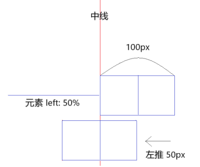
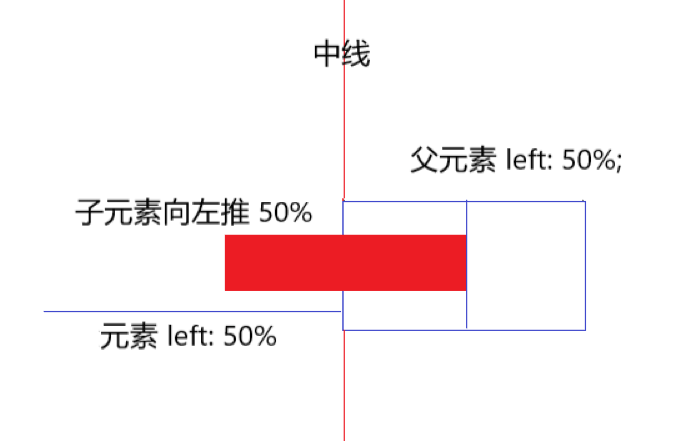

# CSS 居中


根据不同的场景，选择不同的方式去实现居中。


## 水平居中


#### - 内联元素（inline）

常见的内联元素 ( inline ) : 

`span、img、input、a、label、button、select、textarea、sup、sub、abbr、s、i、em、u、strong、small`

 ```css
.inline-center {
    // 文本排列到中间
    text-align: center;
}
 ```

- 注：该方法同样适用于 内联块元素（`inline-block` ）、内联表（`inline-table`）、内联块级弹性伸缩盒（`inline-flex`）
  - 因此，如果块级元素内部包着也是一个块级元素，**我们可以先将其由块级元素改变为行内块元素（`inline-block` ），再通过设置行内块元素居中以达到水平居中**。


#### - 块级元素（block)

常见的块级元素 ( block ): 

`div、p、h1~h6、ul、li`


##### 1. （**需定宽**）margin-left/right: auto

设置块级元素的 `margin-left` 和`margin-left` 为 **auto** （前提是这个块级元素已经定宽，否则它会占满宽度，不需要居中）

```css
.block-center {
    margin: 0 auto;
}
```

- 注：该方法对浮动元素或绝对定位元素无效。

- 将子元素设置为块级表格 (**display: table** 在表现上类似 **block** 元素，但是宽度为内容宽)，再设置水平居中，同理也可以设置为弹性盒子 (**display: flex**)。


##### 2. absolute + transform

**CSS3** **transform** 平移 向X轴反向偏移 50%的方法实现，但是部分浏览器存在兼容性问题。

```css
.parent {
    position: relative
}
.child {
    position: absolute;
    left: 50%;
    transform: translateX(-50%);
}
```

- 注：兼容性存在一定问题，高版本浏览器需要添加一些前缀。


##### 3. flex + justify-content

利用弹性布局(`flex`)，实现水平居中，其中`justify-content` 用于设置弹性盒子元素在主轴（`flex-direction`默认横轴）方向上的对齐方式，本例中设置子元素水平居中显示。

```css
.parent {
    display: flex;
    justify-content: center;
}
```


#### - 多块级元素水平居中


##### 1. 父:text-align: center + 子:inline-block

将需要水平排列的块级元素的 **display** 修改为 **inline-block** 属性，父级元素设置行内居中 **text-align: center**

```css
.parent {
    text-align: center;
}
.child {
    display: inline-block;
}
```

- 注：**如果一行中有两个或两个以上的块级元素，也可以通过这个方法从而使多个块级元素水平居中。**


##### 2. flex 布局

**利用弹性布局(flex)，实现水平居中，其中justify-content 用于设置弹性盒子元素在主轴（默认横轴）方向上的对齐方式**

```css
.flex-center {
    display: flex;
    justify-content: center;
}
```


#### - 浮动元素 

##### 1. 需定宽 relative + 负margin



```css
.float-element {
    width: 100px;
    height: 50px;
    float: left;
    position: relative;
    left: 50%;
    /* 向左偏移元素高度的一半 */
    margin-left: -50px;
}
```


##### 2. 不定宽 父元素left: 50% 子元素 right: 50%



需要清除浮动，给外部元素（父元素）加上 float

```js
.parent {
    float: left;
    position: relative;
    left: 50%;
}
.child {
    float: left;
    position: relative;
   	left: -50%;
}
```


##### 3. 不论宽度 flex 布局

```js
.parent {
    float: left;
    display:flex;
    justify-content:center;
}
.child {
    /*有无宽度都行*/
    float: left;
}
```


#### - 绝对定位元素 (需定宽)

父元素设置为相对定位，再将子元素设置为绝对定位，向左移动子元素。移动距离为父

##### 1. 负margin (需要知道具体宽度)

```css
.parent {
    position: relative;
}
.child {
    position: absolute;
    width: 100px;
    left: 50%;
    /* 向左偏移元素高度的一半 */
    margin-left: -50px;
}
```


##### 2. margin: 0 auto; (可用百分比宽度)

```css
.parent {
    position: relative;
}
.child {
    position: absolute;
    width: 50%;
    height: 50%;
    left: 0;
    right: 0;
    /*水平居中*/
    margin: 0 auto;
}
```


#### - 常用方法，元素的宽高未知


##### 1. absolute + transform

**CSS3** **transform** 平移 向X轴反向偏移 50%的方法实现，但是部分浏览器存在兼容性问题。

```css
.parent {
    position: relative
}
.child {
    position: absolute;
    left: 50%;
    transform: translateX(-50%);
}
```


##### 2. flex + justify-content

利用弹性布局(`flex`)，实现水平居中，其中`justify-content` 用于设置弹性盒子元素在主轴（`flex-direction`默认横轴）方向上的对齐方式，本例中设置子元素水平居中显示。

```css
.parent {
    display: flex;
    justify-content: center;
}
```


-------------------------------------------------

## 垂直居中

 

#### - 单行内联（inline）元素

有时候行内元素或文字显示为垂直居中，是因为它们的上下内边距（**padding**）相等

```css
.element {
    padding-top: 30px;
    padding-bottom: 30px;
}
```

如果 padding 出于某些原因无法使用，那么可以通过设置内联元素高度（**height**）和行高（**line-height**）相等。

```css
.element {
    height: 30px;
    line-height: 30px;
}
```


#### - 多行内联元素

##### 1. 利用表布局（**table**）

利用表布局的 `vertical-align: middle` 可以实现子元素的垂直居中。

```css
.table-center{
    display: table;
}
.child {
    display: table-cell;
    vertical-align: middle;
}
```


##### 2. 利用flex布局（flex）

`align-items` 属性定义flex子项在flex容器的当前行的侧轴（默认纵轴）方向上的对齐方式。

```css
.flex-center {
	display: flex;
    align-items: center;
}
```


##### 3. 利用"精灵元素"(ghost element)

利用"精灵元素"(ghost element)技术实现，即在父容器内放一个100%高度的伪元素，让文本和伪元素垂直对齐(vertical-align)，从而达到垂直居中的目的。

```css
.ghost-center {
    position: relative;
}
.ghost-center::before {
    content: " ";
    display: inline-block;
    height: 100%;
    width:1%;
    vertical-align: middle;
}
.ghost-center p {
    display: inline-block;
    vertical-align: middle;
    width: 20rem;
}
```

##### 

#### - 块级元素

##### 1. absolute+负margin（需定宽）

若块级元素的高度和宽度已定，可以通过绝对定位元素距离顶部 50%，并设置 `margin-top` 向上偏移元素高度的一半，就可以实现垂直居中

```css
.parent {
    position: relative;
}
.child {
    position: absolute;
    top: 50%;
    height: 100px;
    margin-top: -50px;
}
```


##### 2. absolute + margin-top/bottom: auto (可用百分比宽度)

```css
.parent {
    position: relative;
}
.child {
    position: absolute;
    top: 0;
    bottom: 0;
    height: 100px;
    margin: auto 0;
}
```


##### 3. absolute + transform

**CSS3** **transform** 向Y轴反向偏移 50%的方法实现，但是部分浏览器存在兼容性问题。

```css
.parent {
    position: relative;
}
.child {
    position: absolute;
    top: 50%;
    transform: translateY(-50%);
}
```


##### 4. flex + align-items

`align-items` 属性定义flex子项在flex容器的当前行的侧轴（默认纵轴）方向上的对齐方式。

```css
.flex-center {
    display: flex;
    align-items: center;
}
```


##### 5. table-cell+vertical-align

将父元素转化为一个表格单元格显示，再通过设置 `vertical-align`属性，使表格单元格内容垂直居中。

```css
.parent {
    display: table-cell;
    vertical-align: middle;
}
```


#### - 常用方法，元素宽高未知

##### 1. absolute + transform

**CSS3** **transform** 向Y轴反向偏移 50%的方法实现，但是部分浏览器存在兼容性问题。

```css
.parent {
    position: relative;
}
.child {
    position: absolute;
    top: 50%;
    transform: translateY(-50%);
}
```

##### 2. flex + align-items

`align-items` 属性定义flex子项在flex容器的当前行的侧轴（默认纵轴）方向上的对齐方式。

```css
.flex-center {
    display: flex;
    align-items: center;
}
```

或者先设置`flex-direction: column`定义主轴方向为纵向（默认为横向）再用`justify-content` 设置在主轴上的对齐方式。因为flex布局是CSS3中定义，在较老的浏览器存在兼容性问题。

```css
.flex-center {
    display: flex;
    flex-direction: column;
    justify-content: center;
}
```


## 水平垂直居中


#### - 固定宽高元素

##### 1. 绝对定位 + 负margin

绝对定位居中，通过margin 平移元素整体宽度和高度的一半。

```css
.parent {
    position: relative;
}
.child {
    width: 100px;
    height: 100px;
    position: absolute;
    top: 50%;
    left: 50%;
    margin-left: -50px;
    margin-top: -50px;
}
```

- 优点：有良好的跨浏览器特性，兼容 IE6-IE7。
- 缺点：灵活性差，不能自适应，宽高不支持百分比尺寸和 min-/max-width/height 属性


##### 2.  绝对定位 + margin:auto

通过设置各个方向的距离都是0，此时再将margin设为auto

```css
.parent {
    position: relative;
}
.child {
    /*可用百分比*/
    width: 100px;
    height: 100px;
    position: absolute;;
    top: 0;
    left: 0;
    right: 0;
    bottom: 0;
    margin: auto;
}
```

- 优点：
  - 不仅可以实现在正中间，还可以在正左方，正右方。
  - 元素的宽高支持百分比 % 属性值和 min-/max-width/height 属性。
  - 可以封装成一个弹出层。
  - 浏览器支持性好。


##### 3. 绝对定位 + calc(计算属性)

使用 CSS3 的计算属性 calc，top 的百分比是基于元素的左上角，再减去宽度的一半就好了(有点类似于绝对定位+负边距)

```css
.parent {
    position: relative;
}
.child {
    width: 100px;
    height: 100px;
    position: absolute;
    top: calc(50% - 50px);
    left: calc(50% - 50px);
}
```

- 缺点：兼容性、需要知道子元素的具体宽高


##### 4. 父: table-cell + vertical-align 子：inline/inline-block

适用于子元素为 **inline-block**, **inline** 类型的元素

```js
.parent {
    display: table-cell;
    vertical-align: middle;/*垂直居中*/
    text-align: center; /*水平居中*/
    width: 200px;
    height: 200px;
}
.child {
    width: 100px;
    height: 100px;
    display: inline-block;
}
```

- 缺点：需要已知父元素的宽高，且父元素的宽高不能设为百分比。


#### - 未知宽高元素

##### 1. 绝对定位 + transform

利用 2D 变换，在水平和垂直两个方向都反向平移自身宽高的一半，从而使元素水平垂直居中。

```css
.parent {
    position: relative;
}
.child {
    position: absolute;
    top: 50%;
    left: 50%;
    transform: translate(-50%, -50%);
}
```

- 优点：内容可自适应，可以封装成一个弹出层。

- 缺点：部分浏览器存在兼容性问题，可能干扰其他 transform 效果


##### 2. flex布局

利用CSS3 新增的 flex 弹性盒子布局，其中`justify-content` 用于设置或检索弹性盒子元素在主轴（默认横轴）方向上的对齐方式；而`align-items`属性定义flex子项在flex容器的当前行的侧轴（默认纵轴）方向上的对齐方式。

```css
.flex-center {
    display: flex;
    justify-content: center;
    align-items: center;
}
```

- 优点：移动端可以完全使用，PC端需要看兼容情况。CSS 布局未来的趋势，设计初中就是为了解决像垂直居中这样的常见的布局问题。


##### 3. grid布局

CSS3 新增的网格布局，兼容性不好不如flex，不推荐使用

```js
.parent {
    display: gird;
}
.box {
    align-self: center;
    justify-self: center;
}
```


##### 4. flex/grid + margin:auto

父元素必须有高度，容器元素设为 flex 布局或是grid布局，子元素只要写 margin: auto 即可,不能兼容低版本的IE浏览器。

```css
.parent {
  height: 100vh;
  display: grid;
}
.child {
  margin: auto;
}
```


#### - 文字水平垂直居中

##### lineheight + text-align

```css
.parent {
    height: 100px;
    line-height: 100px;
    text-align: center
}
```


## 总结：

- PC端有兼容性要求，宽高固定，推荐absolute + 负margin
- PC端有兼容要求，宽高不固定，推荐css-table
- PC端无兼容性要求，推荐flex
- 移动端推荐使用flex