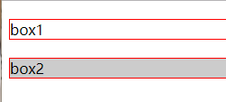

# CSS 布局

​		所谓布局，就是指将元素设置为我们想要的大小，放置于想要的未知，**位置**、**尺寸** 是核心的两要素。这些元素其实就是一些盒子，页面就是由各种盒子拼凑而成

## - 基础盒模型 (basic box model)

### - 基本概念		

​		当浏览器对一个 **渲染树（render tree）** 进行渲染时，浏览器的渲染引擎就会根据 **基础盒模型(CSS basic box model)** ，将所有元素划分为一个个矩形的盒子，这些盒子的外观，属性由`CSS`来决定。


​		盒模型，分为 **4** 部分：

- **content-box(内容) **  ：显示元素内容区域，用 `width` 和 `height` 设置。

- **padding-box(内边距)** ：内容区域到边框的距离，内边距是透明的，用 `padding` 设置。

- **border-box(边框)** ：包围内容和内边距，用 `border` 设置。

- **margin-box(外边距)** ：盒子和其他元素之间的空白区域，外边距是透明的，用 `margin` 设置

  

  一般来说，默认盒模型实际占用空间计算模式为：

- 水平空间大小 = margin（左右）+ border（左右）+ padding（左右）+ width

- 垂直空间大小 = margin（上下）+ border （上下）+ padding （上下）+height

- 因此， 一个元素的实际大小为：border + padding + width/height。

  

  在CSS中，名为box-sizing的属性可以改变元素宽高的计算方式，有两个常用的取值：

- content-box : 默认值，实际宽高为上诉元素实际大小的计算方式。

- border-box：实际宽高为一个元素设置的 width 和 height，不包含其他

### - W3C 盒模型(标准盒模型) 和 IE盒模型（怪异盒模型）


- W3C盒模型，又名标准盒模型，：元素的宽高大小表现为 **content** 的大小。用 `box-sizing: content-box` 设置。
  - **总宽度 = width + padding-left +border-left + margin-left + padding-right + border-right + margin-right**
  - **总高度 = height + padding-top + border-top + margin-top + padding-bottom + border-bottom + margin-bottom**
- IE盒模型，又名怪异盒模型：元素的宽高表现为 **content** + **padding** +  **border** 的大小。用 `box-sizing: border-box`设置。
  - **总宽度 = width + margin-left + margin-right**
  - **总高度 = height + margin-top + margin-bottom**
- 注：
  - 当我们写了`<!Doctype html>`的声明的时候，无论在哪种内核的浏览器下盒子模型都会被解析为 标准盒模型。即：`width = content`。即设置的宽度只显示在 **content** 上，例如设置 `width: 100px`  这个100px 指的就知识 **content** 的宽度，实际总宽度 =  **content** + **padding** + **border** 。
  - 但是当我们没写声明或声明丢失的时候，部分有IE内核的浏览器则会触发怪异模型(IE6,7,8)，`width`= `content`+ `padding`+ `border` 即宽度为三个加一起的宽度。实际总宽度 = **width**。


## - 视觉格式化模型 (visual formatting model)

> ​	MDN：CSS 视觉格式化模型(visual formatting model)是用来处理文档并将它显示在视觉媒体上的机制。他有一套既定的规则（也就是W3C规范），规定了浏览器该怎么处理每一个盒子。根据 **基础盒模型(CSS basic box model)**将 **文档(doucment)** 中的元素转换一个个盒子的实际算法。
>
> ​	MDN：https://developer.mozilla.org/zh-CN/docs/Web/Guide/CSS/Visual_formatting_model

​		在视觉格式化模型当中，文档树的每个元素根据CSS盒模型生成 0 个或多个盒，每个盒子的布局由（以下因素）决定：

- 盒子的尺寸：精确指定、由约束条件指定或没有指定。

- 盒子的类型：**行内级盒子（inline-level box）**、**行内盒子（inline box）**、**原子行内级盒子（atomic inline-level box）**、**块级盒子（block-level box）**、**块盒子（block box）**、**块容器盒子（block container box）**。

- 定位方案（positioning scheme）：**正常流、浮动、绝对定位**。

- 文档树中的其他元素：即当前盒子的**子元素**或**兄弟元素**。

- **视口(viewport)** 的 **尺寸** 和 **位置**。

- 盒子内部图片的**尺寸**

- 其他某些外部因素

  

  该模型会根据盒子的**包含块（containing block 包含其他盒子的块叫包含块）**的边界来渲染盒子。通常，盒子会创建一个包含其后代元素的包含块，但是盒子并不由包含快所限制，当盒子布局跑到包含块的外面称为溢出（**overflow**）

  > 包含块具体概念：http://w3help.org/zh-cn/kb/008/


### - 盒的生成（Box generation)

​		**CSS视觉格式化模型**的一部分工作是从文档元素生成盒子，生成的盒子拥有不同类型，盒子类型取决于 CSS 的 `display` 属性。

​		**格式化上下文（formatting context)** 是定义 **盒子环境** 的规则，不同的 格式化上下文的盒子由不同的表现。


#### - 补充：可替换元素（Replaced element）

- MDN: 典型的可替换元素有 、 <object>、 <video> 和 表单元素，如<textarea>、 <input> 。 某些元素只在一些特殊情况下表现为可替换元素，例如 <audio> 和 <canvas> 。 通过 CSS content 属性来插入的对象 被称作 匿名可替换元素（anonymous replaced elements）。

- 简单的讲，可替换元素就是在源代码中不能直接看出他的要显示的内容的元素。比如元素要通过src属性告诉浏览器显示什么内容的图片。

  

- #### 块级元素（block-level elements）

- 元素的 `display` 为 `block、list-item、table` 时，它就是块级元素。
- 一个块级元素会被格式化一个块，默认按照垂直方向依次排列。
- 元素是否是块级元素仅是元素本身的属性，并不直接用于格式化上下文的创建或布局。


#### - 块级盒子（block-level boxes）

- 块级盒子用于描述它于父、兄弟元素之间的行为。

- 每个块级元素至少生成一个块级盒子，称为**主块级盒子（principal block-level box）**，某些元素，比如 `li`，生成额外的盒子来放置项目符号。
- 每个块级盒子都会参与 **块级格式上下文（block formatting context）**的创建。
- **主块级盒子**将包含后代元素生成的盒子以及生成的内容，也是可以使用**定位方案**的盒子。


#### - 块容器盒（block container boxes）

- 块容器盒描述的是当前盒子与其后代之间的关系，也就是说主要用于确定子元素的定位、布局等。

- 块容器盒子要么只包含其他的块级盒子，要么只包含行内盒子并同时创建一个**行内格式化上下文（inline formatting context）**。

- 有些块级盒子并不是块容器盒子，比如**表格**，**可替换元素**不是块容器盒。相反一些块容器盒，比如**非替换行内块以及非替换表格单元格**，不是块级盒子。

- 一个同时是块容器盒子的块级盒子称为 **块盒子（block box）**。


#### - 块盒子（block boxes）

- 一个同时是块容器盒子的块级盒子称为 **块盒子**
- 分为具名块盒子 和 匿名块盒子

#### - 匿名块盒子（Anonymous block boxes）

- 在某些时候需要进行视觉格式化时，需要添加一些增补性的盒子，这些盒子不能被 CSS 选择符选中，因此称匿名盒子。

  - 不能被 CSS 选择符选中意味着不能用样式表添加样式，这意味对于可继承属性，取父元素的值（`inherit`），而所有不可继承的属性，取初始值（`initial`）。

  - 块容器要么**只包含行内级盒子**，要么**只包含块级盒子**，**但通常文档会同时包含两者**，在这种情况下，**将创建匿名块盒子来包含毗邻的行内级盒子**。

    ```html
     <div>
          第一个匿名块盒：被p标签包含的文本
          <p>块级盒子 block-level box</p>
          第二个匿名块盒：被p标签包含的文本
      </div>
    ```

  - 另一种将创建匿名块盒的情况是，**一个行内盒包含了一个或几个块盒子，在这种情况下，包含块盒子的盒子将拆分为两个行内盒子放置于块盒子前后，然后分别由两个匿名块盒子包含**，这样块盒子就与两个包含行内元素的匿名块盒子形成了兄弟关系。

    ```js
    <style>
        p {
            display: inline;
            border: 1px solid red;
        }
        span {
            display: block;
        }
    </style>
    <p>
        <span>This is the content of SPAN.</span>
    </p>
    ```

    

    - 说明如果行内盒包含多个块盒，并且这些块盒之间没有夹杂内容，将在这些块盒前后创建匿名块盒，即使其前后内容为空。


#### - 行内级元素（inline-level elements）

- 当元素的 `display` 为 `inline、inline-block、inline-table`，称它为**行内级元素**。
- 视觉上它将内容与其他行内级元素排列为多行，典型的如**段落内容，有文本（可以有多种格式，比如强调文本）或图片，都是行内级元素。**


#### - 行内级盒子（inline-level boxes）

- 行内级元素生成**行内级盒子**，该盒子会参与 **行内格式化上下文（inline formatting context）**
- 行内级盒子分为行内盒和原子行内级盒子。


#### - 行内盒子（inline boxes)

- **参与生成行内格式化上下文**的行内级盒子称为行内盒子。
- 所有 `display: inline` 的非替换元素生成的盒是行内盒子。


#### - 原子行内级盒子（atomic inline-level boxes)

- 不参与生成行内格式化上下文的行内级盒子称为原子行内级盒子。

- 这些盒子可替换成行内元素，或 `display` 值为 `inline-block` 或 `inline-table` 的元素生成，向原子一样，不能拆分成多个(盒)，因为无法换行。

  ```html
  <style>
    span {
      display:inline; /* default value*/
    }
  </style>
  <div style="width:10em;">
   span 里的文本 <span>可以
   分成多行因为</span>它是个行内盒子。
  </div>
  ```

  

  ```html
  <style>
    span {
      display:inline-block;
    }
  </style>
  <div style="width:10em;">
     span 里的文本 <span>不能分成多行
     因为它</span> 是个原子行内级盒子。
  </div>
  ```

  

  

  


#### - 匿名行内盒子（anonymous inline boxes）

- 类似于块盒，CSS引擎有时候也会自动创建一些行内盒子。这些行内盒子无法被选择符选中，因此是匿名的。它们从父元素那里继承可继承属性，其他属性保持默认值 `initial`。
- 一种常见的情况是 CSS引擎会自动为**包含在块盒子中的文本创建一个行内格式化上下文**，在这种情况下，这些文本会被一个足够大的匿名行内盒子所包含。但是如果仅包含空格则有可能不会生成匿名行内盒子，因为空格有可能会由于 `white-space` 的设置而被移除，从而导致最终的实际内容为空。


#### - 行盒子（line boxes)

- 行盒子由行内格式化上下文（inline formatting context）产生的盒子，用来显示一行文本。
- 在块盒子内部，行盒子总是从块盒子的一遍排版到另一边，当有浮动元素时，行盒子从左浮动的元素的右边缘排版到右浮动的左边缘。


#### - Run-in 盒子

- Run-in 盒子由 `display: run-in` 定义，其盒类型取决于紧随其后的盒子的类型，Run-in盒子可以用来在可能的情况下将标题嵌入文章的第一个段落中。
- **在CSS2.1的标准中移除了，但可能会在 CSS3 中作为一个实验性的内容再次加入。**


#### - 影响盒子类型的 display 属性 

**CSS2.2**

display属性的值有很多：

 block | list-item |

 inline-block | inline |

table | inline-table | table-row-group | table-header-group | table-footer-group | table-row | table-column-group | table-column | table-cell | table-caption | none | inherit

初始值（默认值）为：inline

可应用于：所有元素

- **block**：元素会生成一个块盒。准确的说是产生块级盒子
- **inline-block**：这个值使一个元素尝试一个行内级块容器（inline-level block container）。行内块（inline-block）的内部被格式化为一个块盒子(block box)，这个元素自身被格式化为一个原子行内盒。准确的说是产生行内块级盒子。
- **inline**：这个值使一个元素产生一个或多个行内盒子（inline boxes)
- **list-item**：这个值使一个元素产生一个主块级盒子盒一个标记盒子（marker box）。（例如 `<li>`)。
- **none：**这个值使一个元素不出现在格式化结构中（在可视化媒体中，该元素不产生盒也不影响布局）。他的后代元素也不产生任何盒子。这个元素和他的内容被完全地从格式化结构中移除。在他的后代元素中重写display的值不会对已有的行为有影响。
  - 注意：display属性值为“none”的元素不产生任何盒子，即使是不可见的盒子。但是在CSS的机制中可以让一个不可见的元素在格式化结构中产生一个可以影响格式（或者说布局）的透明的盒子。使用visibility属性的hidden值实现。 
- **table, inline-table, table-row-group, table-header-group, table-footer-group, table-row, table-column-group, table-column, table-cell, table-caption**：这些值使一个元素表现得像是表格元素。


### - 定位方案

​		一旦生成盒子以后，CSS引擎就需要定位它们以完成布局。下面是定位盒子时可能使用的规则：

- 常规流：包括**块级盒子的块格式化（block formatting)**，**行内级盒子的行内格式化**以及**块级与行内级盒子的 `position` 属性为(`static` 或 `relative`),并且 `float` 为 `none`**。
- 浮动：将盒子从普通流中单独拎出来，将其放到外层盒子的某一边。
- 绝对定位：按照绝对位置来定位盒子，其位置根据盒子的包含元素所建立的绝对坐标系来计算，因此绝对定位元素有可能会覆盖其他元素。

#### - 常规流（文档流 normol flow）

​		如果你打开一个没有用任何CSS来改变页面布局的网页，那么网页元素就会排列在一个常规流（**normal flow**）之中。

​		在常规流中，盒子会依次放置，在**块级格式上下文中**，盒子在垂直方向依次排列；而在**行内格式化上下文**中，盒子则水平排列。

- **块级盒子(block-level boxes)** 与创建 **块级格式化上下文(Block formatting contexts)** 有关；
- **行内级盒子(inline-level boxes)** 与创建 **行内级格式化上下文(Inline formatting contexts)** 有关。


##### - 块格式化上下文（BFC，Block formatting contexts）


**1. 定义**：

- BFC 英文全称是：Block formatting contexts，直译为 “块格式化上下文”。
- BFC 实际上就是页面中的一块渲染区域，该区域与其他区域隔离开来。容器里面的子元素不会影响到外部，外部的元素也不会影响到容器里面的子元素。
- 一个BFC 包含创建该上下文元素的所有子元素，但不包括创建了新BFC的子元素的内部元素。（也就是一个元素不能同时存在于两个 BFC 中 ）

**简单来说：BFC 就是一个独立不干扰外界也不受外界干扰的盒子。**


**2. BFC生成**：满足下列条件之一，会为其内容建立新的块格式化上下文 BFC ：

- 根元素或其他包含它的元素。

- 浮动元素，即 `float` 的值不为 `none`。
- 绝对定位的元素，`position` 的值为 `absolute` 或 `fixed`。
- 非块盒子的块容器盒子，例如行内块 `inline-blocks` (元素具有`display:inline-block`)。
- 表格单元格  (元素具有`display:table-cell`,表格单元格默认属性)
- 表格标题 (元素具有`display:table-caption`,表格标题默认属性)
- `overflow` 不为 `visible` 的块盒子，（除非该值被传播到视口 viewport）
- 弹性盒子 flex box是 (元素具有`display:flex`或`inline-flex` ) ——CSS 3 新增
- display: flow-root 可以创建无副作用的BFC ——CSS 3 新增
- column-span: all 应当总是会创建一个新的格式化上下文，即便具有 column-span: all 的元素并不被包裹在一个多列容器中。

一个块级格式化上下文包括创建它的元素内部的所有内容，出来会创建新的块级格式化上下文的元素。


**3. BFC 渲染规则**

- BFC 内部的盒子会在垂直方向，一个接一个的放置。
- BFC 内的垂直方向的盒子距离以 margin 属性为准，属于同一个块级格式上下文中的相邻块级盒的垂直 margin 可能会叠加（margin collapse）。
- 每个盒子的左侧最外层边界（margin box 的左边）与包含块（border box） 的左边相接触（对于从左往右的格式化，否则相反）。即使存在浮动也是如此（尽管盒里的行盒可能由于浮动而收缩），除非盒创建了一个新的块格式化上下文（在这种情况下 盒子本身可能会由于浮动而变窄）。
- BFC 的区域不会与 float box 折叠。（利用这个特性可以做自适应窗口大小）。
- BFC 就是页面上的一个隔离的独立容器，容器里面的子元素不会影响到外面的元素。反之也是如此。
- 计算 BFC 的高度也会受到浮动元素的影响，浮动元素参与计算（清除浮动的原理）。


**4. BFC 的主要作用**：

- 1. **阻止元素被浮动元素覆盖（防止高度塌陷）**

  ```html
  div {
      border: 1px solid red;
    	/* 创建新的 BFC */  
      /* overflow: hidden */
  }
  p {
      float: left;
      background-color: blue;
  }
  
  <div>
  	<p>浮动元素</p>
  </div>
  ```

  

  - 可以看出 div 盒子的高度没有所包含的 浮动的 p 盒子高度搞，产生了高度塌陷。
  - 原因是：对于正常流中的块级非替换元素，如果其 overflow 最终计算结果为 visible，那么高度只会考虑在其标准流中的子元素（比如，浮动和绝对定位的盒子是会被忽略的，相对定位的盒子只会考虑其未被定位前的位置）。
  - 创建 BFC 后 div 盒子在高度上能包裹住 浮动的 p 盒子了。

  

  - ##### 建立块格式化上下文的元素的高度如下所述计算：

    - 如果该元素只有行内级子元素，其高度为最上行盒的顶部到最下行盒的底部的距离。
    - 如果该元素有块级元素，其高度为最上块级盒子的上外边距边缘到最下块级子盒的下外边距边缘的距离。
    - 绝对定位子元素会被忽略，相对定位盒子不需要考虑其唯一。注意子盒可能是匿名块盒子。
    - 此外，如果该元素有下外边距边缘低于该元素下内容边缘的浮动子元素，那么高度将增大来包含那些边缘。只有参与本块格式化上下文的浮动才考虑在内，比如，在绝对定位后代中的或其他浮动中的浮动就不考虑。

- 2. **防止 margin 折叠**

  ```html
  .box{
      border: 1px solid red;
      margin: 20px 0;
  }
  .parent {
      background: #ccc;
      /* 创建 BFC */
      /* overflow: hidden; */
  }
  
  <div class="box">box1</div>
  <div class="parent">
      <div class="box">box2</div>
  </div>
  ```

  

  - 可以看到，box2  即使包含在另一个块盒子中，但是如果和 box1 在同一个 BFC 且相邻，一样会产生 margin 折叠。

  - 这时如果让 box2 处于一个新的 BFC 下，则其与处于另一个 BFC 的 box1 不会产生 margin 折叠

    


- 3.  **用于多列布局**（后续补充）
  


**注：在 MDN 中依然把 flexbox 跟 gridbox 算在 BFC中，但在最新的规范中，已经从 BFC 中分离出去，成为独立的一个 CSS 模块。**


##### - 行内格式化上下文（IFC, Inline formatting contexts）

**1. 定义**：

​		IFC（Inline Formatting Contexts)，直译为“行内格式化上下文”。IFC 由一个不包含块级盒子的块容器盒生成。


**2. IFC 的生成**：

- 块级元素中仅包含行内级元素
- 注：形成条件非常简单，需要注意的是当 IFC 中有块级元素插入时，会产生两个匿名行内盒子将父元素分割开来，产生两个IFC。

**相关知识点**：顶线、中线、基线、底线，以及行距、半行距、font-size 大小、line-height 大小：

GN16OO_34TV.png)

- inline-box 行内框，高度由 font-size 决定。
- line-box 行框，高度该行框内最大高度的行内框决定。
- content area 内容区域，高度是font-size 盒 padding 的和。
- containing box 包含块，最外层的包裹盒子


line-height 的计算方法：

- 固定值，如果设置了固定值，如 20px，那么行高即为 20px
- 百分比，当前 `font-size * 百分比`，即为行高
- normal 或数字，nomal 则是浏览器默认设置的值，一般为1.2，如果是自定义的数值，比如 1.5 那么行高即为 `font-size * 1.5`

**3. IFC 的渲染规则**：

- 在一个行内格式化上下文中，盒是一个接一个**水平**放置的，从包含块顶部开始。
- 行内元素水平方向上的 margin/border/padding 生效，垂直方向样式空间不会被计算。
- 当几个行内元素不能在一个单独的行盒中水平放置时，它们会被分配给两个或更多的（vertically-stacked line boxes）垂直栈上的行盒，因此，一个段落是很多行盒的垂直栈。这些行盒不会在垂直方向上被分离（除非在其他地方有特殊规定），并且它们也不重叠。
- 每一行将生成一个行盒，包括该行所有的盒子，行盒的宽度是由包含块和存在的浮动来决定
- 垂直方向上，当行内元素的高度比行盒要低，那么 `vertical-align` 属性决定垂直方向上的对齐方式，默认对齐为baseline（基线）。
- 水平方向上，当行内元素的总宽度比行盒要小，那么行内元素在水平方向上的分布由 `text-align` 决定。
- 水平方向上，当行内元素的总宽度超过了行盒，那么行内元素会被分配到多个行盒中去，如果设置了不可拆行等属性，那么行内元素会溢出行盒。
- 行盒的左右两边都会触碰到包含快，而 float 元素则会被放置在行盒盒包含块边缘的中间位置。


**4. 作用**：

- 行内元素按照 `text-align` 进行水平居中
- 行内元素撑开父元素高度，通过 `vertical-align` 属性进行垂直居中

```html
p {
    border: 1px solid gray;
    text-align: center;
}

.big {
    font-size: 60px;
    vertical-align: middle;
}

<p>hello <span class="big">world</span> inline formating context</p>
```


##### - 相对定位

**定义：当一个盒子根据文档流或者浮动摆放好后，它可能会相对于该位置移动，这叫相对定位。相对定位的盒保持它在文档流中的大小，包括换行和空格都会原样保留。**

**relative与absolute,fixed**

- `relative` 可以限制 `absolute` 元素的：
  - 限制 `left / top / right / bottom` 定位。
  - 限制 `z-index` 层级，`relative`元素与`absolute`元素同级的时候，后面的覆盖前面的元素；当`relative`元素与`absolute`元素嵌套时,`relative`元素的`z-index`决定层叠顺序,`absolute`元素`z-index`失效。
  - 限制在 `overflow` 下失效的问题，普通`div`元素设置的` overflow:hidden `对于子元素是 `absolute` 的元素无效,而设置 `relative` 的 `div` 元素设置 `overflow:hidden` 可以在子元素 `absolute` 中生效。
- 而对于`fixed`,`relative`只能限制`z-index`层级

**relative最小化影响原则**

1. 在可以单独使用`absolute`解决问题的时候,不要使用`relative`,如有偏差,可以配合`margin`使用
2. 一定要使用`relative`的时候,要保证作用范围最小化

#### - 浮动（float）

**定义：浮动元素会脱离文档流并向左/向右浮动，直到碰到父元素或者另一个浮动元素**（浮动最初设计的目的只是用来实现文字环绕效果而已）

**特征**：

- **浮动会脱离文档流**，也就是说浮动不会影响普通元素的布局
- **浮动可以内联排列**，可以设置宽高，并且能够一行多个，是介于`block`和`inline`之间的存在。（对多个元素设置浮动，可以实现类似`inline-block`的效果；但是如果每个元素的高度不一致，**会出现“卡住”的情况**。）
- **浮动会导致父元素高度坍塌**

##### **clear 清除浮动**

定义：clear 属性不允许被清除浮动的元素的左边 / 右边挨着浮动元素，底层原理是**在被清除浮动的元素上边或者下边添加足够的清除空间。**

注意：是通过在别的元素上清除浮动来实现撑开高度的，而不是在浮动元素上。

**clear 清除浮动最佳实践：**

通过在浮动元素的末尾添加一个空元素，设置 clear：both属性，after伪元素其实也是通过 content 在元素的后面生成了内容为一个点的块级元素；

```css
// 现代浏览器clearfix方案，不支持IE6/7
.clearfix:after {
    display: table;
    content: " ";
    clear: both;
}

// 全浏览器通用的clearfix方案
// 引入了zoom以支持IE6/7
.clearfix:after {
    display: table;
    content: " ";
    clear: both;
}
.clearfix{
    *zoom: 1;
}

// 全浏览器通用的clearfix方案【推荐】
// 引入了zoom以支持IE6/7
// 同时加入:before以解决现代浏览器上边距折叠的问题
.clearfix:before,
.clearfix:after {
    display: table;
    content: " ";
}
.clearfix:after {
    clear: both;
}
.clearfix{
    *zoom: 1;
}
```

注：`display:table` 本身并不会创建BFC，但是它会产生[匿名框](http://www.w3.org/TR/CSS21/tables.html#anonymous-boxes)(anonymous boxes)，而匿名框中的 `display:table-cell` 可以创建新的BFC，换句话说，触发块级格式化上下文的是匿名框，而不是`display:table`。所以通过`display:table`和`display:table-cell`创建的BFC效果是不一样的。


##### BFC 清除浮动

BFC 的主要特征：

- BFC 容器是一个隔离的容器，和其他元素互不干扰；所以我们可以用触发两个元素的 BFC 来解决垂直边距折叠问题。
- BFC 可以包含浮动；通常用来解决浮动父元素高度坍塌的问题。

###### BFC的触发方式

我们可以给父元素添加以下属性来触发BFC：
 ✦ `float` 为 `left` | `right`
 ✦ `overflow` 为 `hidden` | `auto` | `scorll`
 ✦ `display` 为 `table-cell` | `table-caption` | `inline-block` | `flex` | `inline-flex`
 ✦ `position` 为 `absolute` | `fixed`

所以我们可以给父元素设置`overflow:auto`来简单的实现BFC清除浮动，但是为了兼容IE最好用`overflow:hidden`。但是这样元素阴影或下拉菜单会被截断，比较局限。

```css
.box-wrapper{
  overflow: hidden;
}
```

#### - 定位（positioning）

想要把一个元素从正常流中移除，或者改变其在正常文档流中的位置，可以使用 CSS 的 `position` 属性。当处于正常文档流时，元素的 `position` 属性为 `static`。在块级维度上元素会一个接一个排列下去，当你滚动页面时元素也会随着滚动。

##### 1. 相对定位（relative positioning)

如果一个元素具有属性 `position: relative`，那么它偏移的参照位是其原先在正常文档流中的位置。你可以使用top、left、bottom和right属性来相对其正常流位置进行移动。

注：页面上的其他元素并不会因该元素的位置变化而受到影响。该元素在正常流中的位置会被保留，因此你需要自己去处理一些元素内容覆盖的情况。

##### 2. 绝对定位（absolute postioning）

给一个元素设置 `position: absolute` 属性可以将其完全从正常流中移除。其原本占据的空间也会被移除。该元素会定位于相对于视口容器，除非其某个祖先元素也是定位元素（`position` 值不为 `static`)

通常情况下你并不希望元素相对于视口进行定位，而是相对于容器元素（祖先元素）。在这种情况下，你需要为容器元素设置一个除了默认`static`之外的值。

由于给一个元素设置`position: relative`并不会将其从正常流中移除，所以通常这是一个不错的选择。给你想要相对的容器元素设置`position : relative`，就可以让绝对定位的元素相对其进行偏移。

##### 3. 固定定位（fixed positioning）

大多数情况下，`position: fixed` 的元素会相对于视口定位，并且会从正常文档流中被移除，不会保留它所占据的空间。当页面滚动时，固定的元素会留在相对于视口的位置，而其他正常流中的内容则和通常一样滚动。

为了使一个固定定位的元素不相对于视口进行定位，你需要为容器元素设置`transform`、`perspective`、`filter`三个属性之一（不为默认值none）。这样固定的元素就会相对于该块级元素偏移，而非视口。

##### 4. sticky 定位

设置 `position: sticky` 会让元素在页面滚动时如同在正常流中，但当其滚动到相对于视口的某个特定位置就会固定在屏幕上，如同 `fixed` 一般。这个属性值是一个比较新的 CSS 属性，在浏览器兼容性上会差一些，但在不兼容的浏览器中会被忽略并回退到正常的滚动情况。


### 弹性布局（Flex Layout）

弹性盒子（Flexbox）布局是一种为一维布局而设计的布局方法。一维的意思是你希望内容是按行或按列来布局。你可以使用 `display: flex` 来将元素变为弹性布局。

该容器的直接子元素会变为弹性项（flex item），并默认按行排列。

#### 1. 弹性盒子的轴（axes）

弹性项在行内是从起始位置开始排列，而不是说它们是左对齐。这些元素会按行排列是因为默认的 `flex-direction` 值为 `row`，`row` 代表了文本的行文方向。`flex-direction`的值被定义为弹性盒子的**主轴**（main axis）。

**交叉轴**（cross axis）也称为侧轴，是和主轴垂直的一条轴。如果你的`flex-direction`是`row`并且弹性项是按照行内方向排列的，那么交叉轴就是块级元素的排列方向。如果`flex-direction`是`column`那么弹性项就会以块级元素排列的方向排布，然后交叉轴就会变为`row`。

#### 2. 方向和次序

弹性盒子模型可以让我们通过为 `flex-direction` 属性设置 `row-reverse` 或 `column-reverse` 值来改变主轴上弹性项的方向。

#### 3. 一些Flex的属性

这些flex的属性是用来控制弹性项在主轴上空间大小的。这三个属性是：

- flex-grow
- flex-shrink
- flex-basis

通常可以使用它们的简写形式：flex。跟上面三个值分别对应

```css
.item {
    flex: 1 1 200px;
}
```

`flex-basis`会为弹性项设置未拉伸和压缩时的初始大小。在上面的例子中，大小是200px，因此我们会给每个项200px的空间大小。但是大多数情况下容器元素大小不会正好被分为许多200px大小的项，而是可能有一些不足或剩余空间。`flex-grow`和`flow-shrink`属性允许我们在容器大小不足或有空余时控制各个弹性项的大小。

如果`flex-grow`的值是任意的正数，那么弹性项会被允许拉伸来占据更多的空间。因此，在上面的例子中，当各项被设为200px后，所有多余的空间会被每个弹性项平分并填满。

如果`flex-shrink`的值为任意的正数，那么当弹性项被设置了`flex-basis`后，元素溢出容器时会进行收缩。在上面这个CSS的例子中，如果容器空间不足，每个弹性项会等比例缩放以适应容器的大小。

`flex-grow`和`flex-shrink`的值可以是任意的正数。一个具有较大`flex-grow`值的弹性项会在容器有剩余空间时拉伸更大的比例；而一个具有更大`flex-shrink`值的项则会在容器空间不足时被压缩的更多。


### 网格布局（gird box）


## 参考

[视觉格式化模型(Visual formatting model)](https://segmentfault.com/a/1190000008541494)

[一篇全面的CSS布局学习指南 [译]](https://juejin.im/post/5b3b56a1e51d4519646204bb#heading-43)