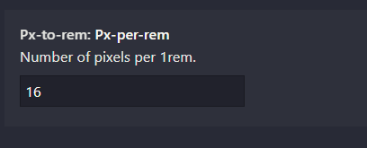

[vue 移动端 h5 适配解决方案（rem or vw）](https://juejin.cn/post/6844903917126434829)

# 方案一：amfe-flexible+px2rem-loader

> **amfe-flexible**：根据设备宽度，修改根元素html的font-size大小，以适配不同终端
> **px2rem-loader**：将css中的px转为rem单位，用了它就不用自己计算rem值了

## 移动端 rem 方案

[移动端适配-rem](https://juejin.cn/post/6844903577715113998#heading-9)

设置`viewport`的`scale`值为1。

```html
<meta name="viewport" content="width=device-width, initial-scale=1.0, maximum-scale=1.0, user-scalable=0">
```

- `width` 属性控制视口的宽度.可以像width=600这样设为确切的像素数，或者设为device-width这一特殊值来指代比例为100%时屏幕宽度的CSS像素数值;
- `initial-scale`属性控制页面最初加载时的缩放等级,
- `maximum-scale、minimum-scale、user-scalable`属性控制允许用户以怎样的方式放大或缩小页面

例如在 `scale` 为 1 时,设计稿宽度为 750, 把设备宽度 10 等分,在 `iPhone6/7/8`上.html 的 `font-size` 为 37.5px .此时 1rem=37.5px

```
scale为1在2倍屏下 750/2 = 375 
将设计稿10等分 375/10 = 37.5
1rem = 37.5px
```

### 设置 rem

```js
// 将设备的宽度10等分
function setRem() {
        var scrren = document.documentElement.clientWidth || 320
        document.getElementsByTagName('html')[0].style.fontSize = scrren / 10 + "px"
    } 
```


### sass

```css
// 设计稿宽度
    $phoneWidth : 750;
    // 计算每个等分的缩放比例 * 10
    @function px2remP( $width ){
      @return $width / $phoneWidth * 10rem;
    }
```

## vscode 插件

### px to rem



配置 rem 基准值（一般可以设置为 设计稿/10）