# Git 

## 概述

- 官方： Git 是一个免费的开源分布式版本控制系统，旨在快速高效地处理从小型到大型项目的所有事务。
- 引用廖雪峰的话：它能自动的帮我记录每次文件的改动，还可以让同时写作编辑，这样就不用自己管理一堆类似的文件了，也不需要把文件传来传去。如果想查看某次改动。只需要在软件里瞄一眼即可

## 安装

[git 官网](https://git-scm.com/)

安装后设置用户信息：

`git config --global user.name "你的名字"`

`git config --global user.email "你的邮箱"`

`global` 表示全局，所有的 Git 仓库都会使用这个配置。允许单个仓库使用其他的名字的邮箱。

## 仓库

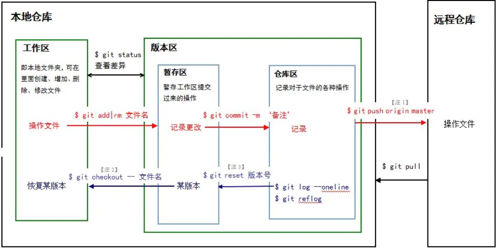

- 本地仓库是对于远程仓库而言的。本地仓库 = 工作区 + 版本区。
  - 工作区即磁盘上的文件集合
  - 版本区（版本库）即 `.git` 文件
  - 版本库 = 暂存区(stage) + 分支(master) + 指针(Head)
- 例子：
  - `git init` 原本本地仓库只包含着工作区，这是最常见的工作状态。此时，`git init` 初始化，表示在本地区域创建了一个 `.git` 文件，版本区建立。
  - `git add .` 表示把工作区的所有文件全部提交到版本区里面的 **暂存区**（可以重复 `add` 到暂存区）
  - 当然也可以通过 `git add ./xxx/` 一条一条分批添加到暂存区
  - `git commit -m "xxx"` 把暂存区中 **所有** 文件提交到仓库区，暂存区清空
  - `git remote add origin https://github.com/xxx/xxx.gt` 把本地仓库与远程仓库连接起来。（只需连接一次，以后提交的时候就可以不用写这条命令了）
  - `git push -u origin master` 把仓库区的文件提交到远程仓库里。
  - 一旦提交后，如果你没有对工作区做任何修改，那么工作区就是“干净”的。会有这样的信息：`nothing to commit,working tree clean`

## 版本的回溯与前进

​		提交一个文件，有时候我们会提交很多次，在提交历史中，这样就产生了不同的版本。每次提交，Git 会把它们串成一条时间线。

- 回溯到之前提交的版本，用 `git reset --hard + 版本号`即可。
- 版本号可以用 `git log` 来查看，每一次的版本都会产生不一样的版本号。
- 前进也是使用 `git reset --hard + 版本号`
- 有时候把版本号弄丢了，可以使用 `git reflog`，可以查看所有分支的所有操作记录（包括已经被删除的 `commit` 记录和 `reset` 的操作），它帮你记录了每一次命令，这样就可以找到版本号了。

## 撤销

- 场景1：在工作区时，你修改了一个东西，想撤销修改，可以使用：`git checkout -- <file>`。撤销修改就回到和版本库一模一样的状态，即用版本库的版本替换工作区的版本。
- 场景2：你修改了一个内容，并且已经 `git add` 到暂存区了。想撤销怎么办？回溯版本，`git reset --hard + 版本号`，再 `git checkout -- <file>`，替换工作区的版本。
- 场景3：你修改了一个内容，并且已经 `git commit` 到了 `master`，跟场景2一样，版本回溯，再进行撤销。、

## 删除

- 如果你 `git add` 一个文件到暂存区，然后在工作区又把文件删除，Git 会知道你删除了文件。如果你要把版本库里的文件删除，`git rm` 并且 `git commit -m "xxx"`。
- 如果你误删了工作区的文件怎么办？使用撤销命令，`git check -- <file>` 就是可以。**这再次证明了撤销命令其实就用版本库里的版本替换工作区的版本，无论工作区是修改还删除，都可以“一键还原”**。

## 分支

分支，就像平行宇宙。你创建了一个属于你自己的分支，别人看不到，还继续在原来的分支上正常工作，而你在自己的分支上干活，想提交就提交，直到开发完毕后，再一次性合并到原来的分支上，这样，即安全，又不影响别人工作。

### 创建与合并分支

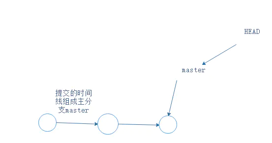

在没有其他分支插进来的时候，就只有一个 master 主分支，每次 `git push -u origin master` 提交就是增加一条时间轴，master 也会跟着移动。

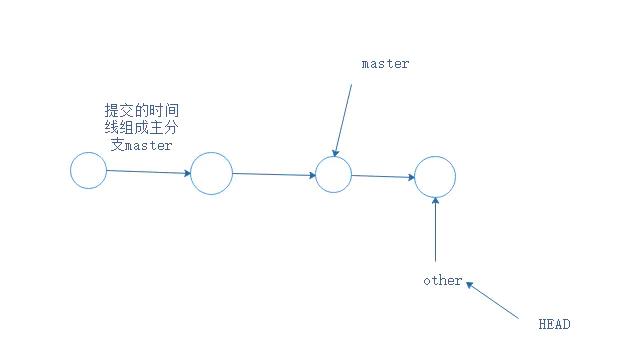

创建一个 other 的分支，通过 other 提交，虽然时间轴向前走了，但是主分支 master 还在原来的位置。 

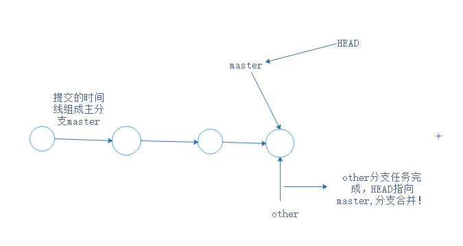

命令：

- 创建分支 `other`，切换到 `other` 分支。

  ```shell
  git branch other
  git checkout other
  ```

- 查看当前所有分支

  ```shell
  git branch
  ```

  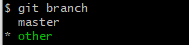

当前分支会有一个 `*`

- 用 `other` 提交

  ```bash
  git add ./xxx
  git commit -m "xxx"
  ```

- `other` 分支完成，切换回 `master`

  ```shell
  git checkout master
  ```

- 此时，master 分支上并没有 `other` 的文件，因为分支还没有合并。

- **合并分支**

  ```shell
  git merge other
  ```

- 合并完成之后，就可以在 master 分支上查看到文件了。

- 删除 `other` 分支

  ```shell
  git branch -d other
  ```

- 由此想到，在后续工作中，应该是一个开放小组共同开发一个项目，组长会创建很多分支，每一个分支可以交给一个人去开发某一个功能，一个小组共同开发而且不会互相干扰。谁的功能完成了，可以由组长合并一下完成了的分支。

### 解决合并分支问题

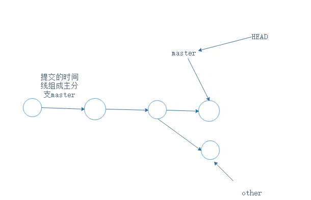

假如有这样一种情况，分支 `other` 已经 `commit`了，但是此时指针指回 `master` 没有合并，而是 `git add / commit `提交了。这样，就产生了冲突，主分支 `master` 文件内容与 `other` 分支的内容不一样。合并不起来！所以：

-  修改文件的内容，让其保持一致。
- `git add` `git commit` 提交。
- 分支合并了。

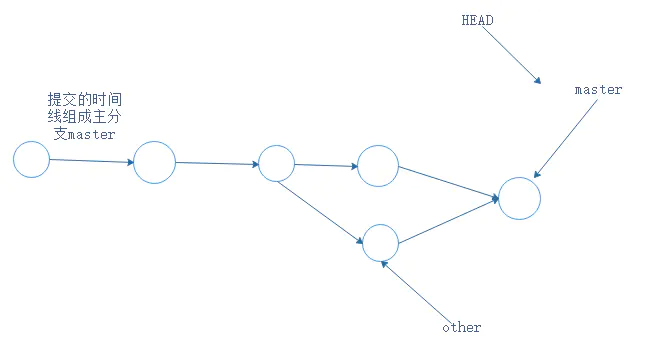

例子：

1. 切换到 other，然后在 other 分支中修改文件 other.js，并且提交新版本

```shell
git checkout other
git add other.js
git commit -m "在 other 更新 other.js"
```

2. 然后切换回 master 分支，在master 分支中修改 other.js，并且也提交一个新的版本

```shell
git checkout master
git add other.js
git commit -m "在 master 更新 other.js"
```

3. 然后合并 dev 和 master，会产生冲突，并且在文件内会有提示：

```shell
git merge other
```

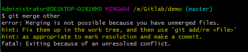

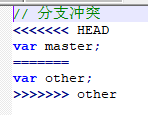

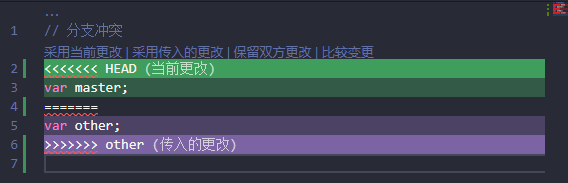

4.  修改文件的内容，让其保持一致，然后`git add` `git commit` 提交，再次合并分支。

- `git log --graph` 查看分支合并图
- `git branch -d other` 删除分支，任务结束。

## 分支管理策略

- `git merge --no-ff other` 禁用`Fast forward`模式，因为使用`Fast forward`模式，删除分支后，分支历史信息会丢失。

## BUG 分支

工作中每个 BUG 都可以通过一个新的临时分支来修复，修复后，合并分支，然后将临时分支删除。但如果你手上有分支在工作中，你的上级要改另外的分支的 BUG。你要把你现在正在工作的分支保存下来，`git stash`，把当前的工作现场“存储”起来，等以后恢复后继续工作。当你解决 BUG 后，`git checkoutp other` 回到自己的分支。用 `git stash list` 查看你刚刚“存放”起来的工作区哪里了，此时你需要恢复工作：

- `git stash apply` 恢复却不删除 `stash` 内容，`git stash drop` 删除 `stash` 内容
- `git stash pop` 恢复的同时把 `stash` 内容也删除了
- 此时，用 `git stash list` 查看，看不到任何 `stash` 内容。

**总结：修复 bug 时，会通过创建新的 bug 分支进行修复，然后合并，最后删除；当手头工作没有完成时，先把工作现场 git stash 一下，然后去修复 bug，修复后，再 git stash pop，回到工作现场**

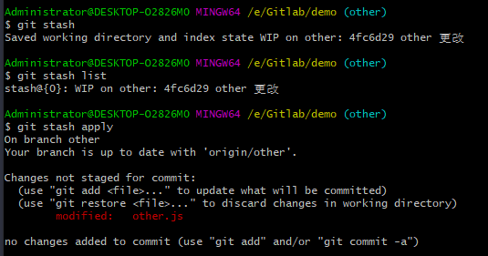

## 删除分支

- `git branch -d + 分支`有可能会删除失败，因为 Git 会保护没有被合并的分支。
- `git branch -D + 分支`强行删除，丢弃没被合并的分支。

## 多人协作

- `git remote` 查看远程库的信息，会显示 `origin`，远程仓库默认名称为 `origin`
- `git remote -v` 显示更详细的信息
- `git push -u origin master` 推送 `master` 分支到 `origin` 远程仓库
- `git push -u origin other` 推送 `other` 到 `origin` 远程仓库

## 抓取分支

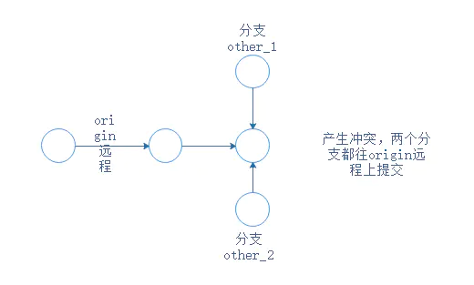

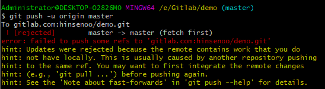

产生上图的冲突时：

- `git pull` 把最新的提交从远程仓库中抓取下来，在本地合并，解决冲突。在进行 `git pull`

  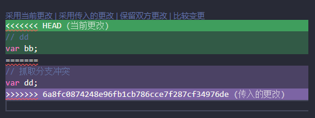

- 如果`git pull` 也失败了，还要指定分支之间的链接，这一步Git会提醒你怎么做。然后再`git pull`。

## 多人协作的工作模式通常是这样

- 首先，可以试图用 `git push origin <branch-name>` 推送自己的修改；
- 如果推送失败，则因为远程分支比你本地版本更新，需要先用 `git pull` 试图合并；
- 如果合并有冲突，则解决冲突，并在本地提交；
- 没有冲突或者解决掉冲突后，再用 `git push origin <branch-name>` 推送就能成功!
- 如果 `git pull` 提示 `no tracking information`，则说明本地分支和远程分支的链接关系没有创建，用命令 `git branch --set-upstream-to <branch-name> origin/<branch-name>`。

## Rebase

`git rebase` 把分叉的提交历史“整理”成一条直线，看上去更直观.缺点是本地的分叉提交已经被修改过了。

最后在进行`git push -u origin master`

`rebase`的目的是使得我们在查看历史提交的变化时更容易，因为分叉的提交需要三方对比。

## 创建标签

步骤：

- `git branch`查看当前分支,`git checkout master`切换到`master`分支。
- `git tag <name>` 打标签，默认为`HEAD`。比如`git tag v1.0`
- 默认标签是打在最新提交的`commit`上的。如果想要打标签在以前的`commit`上，要`git log`找到历史提交的`commit` id.
- 如果一个`commt id`是`du2n2d9`,执行`git tag v1.0 du2n2d9`就把这个版本打上了`v1.0`的标签了。
- `git tag` 查看所有标签，可以知道历史版本的`tag`
- 标签不是按时间顺序列出，而是按字母排序的。
- `git show <tagname>` 查看标签信息。
- `git tag -a <标签名> -m "<说明>"`,创建带说明的标签。 `-a`指定标签名，`-m`指定说明文字。用`show`可以查看说明。

## 操作标签

- `git tag -d v1.0` 删除标签。因为创建的标签都只存储在本地，不会自动推送到远程。所以，打错的标签可以在本地安全删除。
- `git push origin <tagname>` 推送某个标签到远程
- `git push origin --tags` 一次性推送全部尚未推送到远程的本地标签
- 如果标签推送到远程。`git tag -d v1.0` 先删除本地标签v1.0。`git push origin :refs/tags/v1.0`删除远程标签v1.0

## 自定义Git

- 忽略特殊文件 创建一个`.gitignore`文件，把需要忽略的文件名填进去。Git就会自动忽略这些文件。我也在学习中遇到过这样的问题，比如`node_modules`文件就可以忽略。
  - 忽略文件原则：忽略操作系统自动生成的文件，比如缩略图等；忽略编译生成的中间文件、可执行文件等，也就是如果一个文件是通过另一个文件自动生成的，那么自动生成的文件就没必要放进版本库，比如 Java 编译产生的 `.class` 文件；忽略你自己的带有敏感新的配置文件，比如存放口令的配置文件。
- 强制提交已忽略的的文件。`git add -f <file>`

# 常用Git命令总结

- `git config --global user.name "你的名字"` 让你全部的`Git`仓库绑定你的名字
- `git config --global user.email "你的邮箱"` 让你全部的`Git`仓库绑定你的邮箱
- `git init` 初始化你的仓库
- `git add .` 把工作区的文件全部提交到暂存区
- `git add ./<file>/` 把工作区的`<file>`文件提交到暂存区
- `git commit -m "xxx"` 把暂存区的所有文件提交到仓库区，**暂存区空空荡荡**
- `git remote add origin https://github.com/name/name_cangku.git` 把本地仓库与远程仓库连接起来
- `git push -u origin master` 把仓库区的主分支`master`提交到远程仓库里
- `git push -u origin <其他分支>` 把其他分支提交到远程仓库
- `git status`查看当前仓库的状态
- `git diff` 查看文件修改的具体内容
- `git log` 显示从最近到最远的提交历史
- `git clone + 仓库地址`下载克隆文件
- `git reset --hard + 版本号` 回溯版本，版本号在`commit`的时候与`master`跟随在一起
- `git reflog` 显示命令历史
- `git checkout -- <file>` 撤销命令，用版本库里的文件替换掉工作区的文件。我觉得就像是`Git`世界的`ctrl + z`
- `git rm` 删除版本库的文件
- `git branch` 查看当前所有分支
- `git branch <分支名字>` 创建分支
- `git checkout <分支名字>` 切换到分支
- `git merge <分支名字>` 合并分支
- `git branch -d <分支名字>` 删除分支,有可能会删除失败，因为`Git`会保护没有被合并的分支
- `git branch -D + <分支名字>` 强行删除，丢弃没被合并的分支
- `git log --graph` 查看分支合并图
- `git merge --no-ff <分支名字>` 合并分支的时候禁用`Fast forward`模式,因为这个模式会丢失分支历史信息
- `git stash` 当有其他任务插进来时，把当前工作现场“存储”起来,以后恢复后继续工作
- `git stash list` 查看你刚刚“存放”起来的工作去哪里了
- `git stash apply` 恢复却不删除`stash`内容
- `git stash drop` 删除`stash`内容
- `git stash pop` 恢复的同时把stash内容也删了
- `git remote` 查看远程库的信息，会显示`origin`，远程仓库默认名称为`origin`
- `git remote -v` 显示更详细的信息
- `git pull` 把最新的提交从远程仓库中抓取下来，在本地合并,和`git push`相反
- `git rebase` 把分叉的提交历史“整理”成一条直线，看上去更直观
- `git tag` 查看所有标签，可以知道历史版本的tag
- `git tag <name>` 打标签，默认为`HEAD`。比如`git tag v1.0`
- `git tag <tagName> <版本号>` 把版本号打上标签，版本号就是`commit`时，跟在旁边的一串字母数字
- `git show <tagName>` 查看标签信息
- `git tag -a <tagName> -m "<说明>"` 创建带说明的标签。 `-a`指定标签名，`-m`指定说明文字
- `git tag -d <tagName>` 删除标签
- `git push origin <tagname>` 推送某个标签到远程
- `git push origin --tags` 一次性推送全部尚未推送到远程的本地标签
- `git push origin :refs/tags/<tagname>` 删除远程标签`<tagname>`
- `git config --global color.ui true` 让Git显示颜色，会让命令输出看起来更醒目
- `git add -f <file>` 强制提交已忽略的的文件
- `git check-ignore -v <file>` 检查为什么Git会忽略该文件

## git 提交代码到仓库

#### [git提交代码到远程仓库](https://www.cnblogs.com/xuemingyao/p/9496250.html)

1、仓库初始化

git init

2、连接仓库

git remote add origin 仓库地址

3、查看状态

git status

4、将文件添加到暂存区

git add 状态里的新文件

5、将文件添加到仓库

git commit -m'相关注释文字'

6、将本地代码提交到远程仓库

git push origin master

## 存储密码 - SSH 添加密钥

- 查看配置：git config --list
- 设置全局用户名：git config --global user.name "xxxx"
- 设置全局用户邮箱：git config --global user.email "xxx@xxx.com"
- 设置全局存储密码：git config --global credential.helper store
  - 设置为 store 即可存储账密码
  - 从 GitHub 克隆用 HTTPS 地址

- SSH 生成公钥私钥：ssh-keygen -t rsa -C "xxx@xx.com"
  - -t 加密类型： rsa 非对称加密 -C 地址
  - 使用 ssh 方式需要在服务器(Git)设置对应的公钥，本地存储私钥
  - 从 GitHub 克隆用 SSH 地址


- 提交变动：git commit -m "备注" -a
  - -a 为提交所有变动。
- 跟踪指定文件：git add <file>
  - 跟踪所有文件：git add .