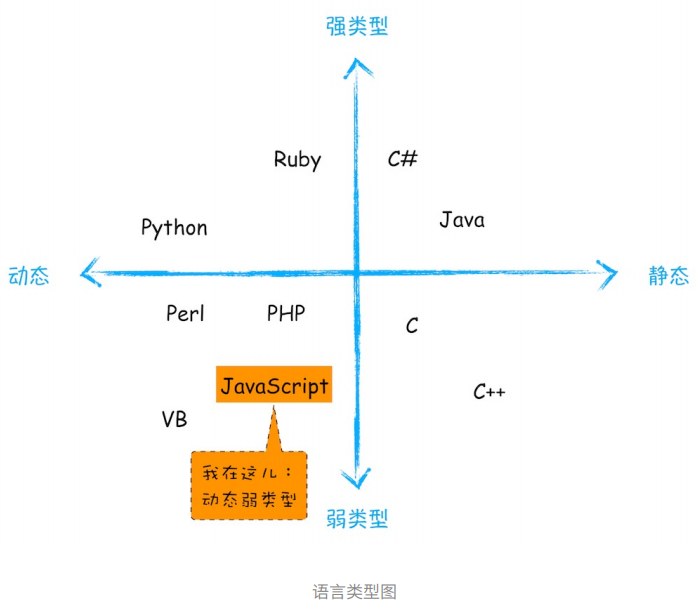

# JavaScript 的内存机制

## JavaScript 是什么类型的语言？

- 在使用之前就需要**确定其变量数据类型**的称为**静态语言**，在运行过程中需要检查数据类型的语言称为**动态语言**。（JavaScript 就是动态语言）
- **支持隐式类型转换**的语言称为**弱类型语言**，不支持隐式类型转换的语言称为**强类型语言**



### JavaScript 的数据类型

JavaScript 是一种弱类型的、动态的语言。特点：

- **弱类型**：意味着不需要告诉 JS 引擎某个变量是什么数据类型，JS 引擎在运行代码的时候会自行计算出来。
- **动态**：意味着可以使用同一个变量保存不同类型的数据。

在 JavaScript 中，可以使用 `typeof` 运算符查看变量的数据类型。如下：

```js
var bar 
console.log(typeof bar) //undefined 
bar = 12 
console.log(typeof bar) //number 
bar = "hinsenoo" 
console.log(typeof bar) //string 
bar = true 
console.log(typeof bar) //boolean 
bar = null 
console.log(typeof bar) //object 
bar = {name: "hinsenoo"} 
console.log(typeof bar) //object
```

JavaScript 中的数据类型一共有 8 种， 它们分别是：

| 类型          | 描述                                                         |
| :------------ | :----------------------------------------------------------- |
| **Boolean**   | 只有 `true` 和 `false` 两个值。                              |
| **Null**      | 只有一个值 `null`。                                          |
| **Undefined** | 一个没有被赋值的变量会有个默认值 `undefined`，变量提升时的默认值也是 `undefined`。 |
| **Number**    | 根据 ECMAScript 标准，JavaScript 中只有一种数字类型：基于 IEEE754 标准的双精度 64 位二进制格式的值，-(263 - 1) 到 263 -1 。 |
| **BigInt**    | JavaScript 中的一个新的数字类型，可以用任意精度表示整数。使用 `BigInt`，即使超出 `Number` 的安全整数范围限制，也可以安全地存储和操作。 |
| **String**    | 用与表示文本数据。不同于类 C 语言，JavaScript 的字符串是不可更改的。 |
| **Symbol**    | 符号类型是唯一的并且是不可修改的，通常用来作为 `Object` 的 `key`。 |
|               |                                                              |

