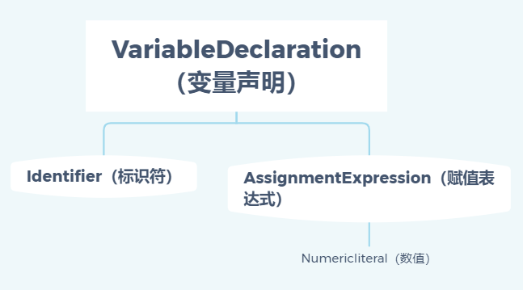

# 作用域

## 1. 基本概念

​		变量存储的地方，以及在需要时如何寻找他们。—— 解决这问题的规则称之为作用域。

### 1.1 编译原理

1. 传统编译语言：在执行前会经历三个步骤，统称为**编译**：

   - 分词/词法分析 ( Tokenizing/Lexing )：这个过程会将由字符组成的字符串分解成有意义的代码块，这些代码块被称为词法单元 ( token )。例如：`var a = 2;` => `var、a、=、2、;`

   - 解析/语法分析 ( Parsing )：这个过程是将语法单元流 (数组) 转换成一个由元素主机嵌套所组成的代表了程序语法结构的树。这树被称为 “抽象语法树” ( **Abstract Syntax Tree**, **AST**)。

     
     
     注：一个简单的AST，例如 var a = 2; a 为标识符(Identifier)，= 为赋值表达式，2 为数值。
     
   - 代码生成：将 **AST** 转换为可执行代码的过程被称为代码生成。简单来说就是有某种方法可以将 `var a = 2;` 的 AST 转换为一组机器指令，用来创建一个叫做 a 的变量(包括分配内存等)，将一个值储存在 a 中。
   
2.  JavaScript：大部分情况下编译发生在代码执行前的几微秒，并且更为复杂，通常在parsing和代码生成阶段，存在大量对运行性能的优化操作。

### 1.2 理解作用域

- 引擎：从头到尾复制整个 JavaScript 程序的编译及执行过程。
- 编译器：负责语法分析及代码生成的工作。
- 作用域：负责收集并维护所有声明的标识符(变量) 组成的一系列查询，并实施一套非常严格的规则，确定当前执行的代码对这些标识符的访问权限。

例：`var a = 2;`

编译器：	

- 处理 `var a`，询问作用域是否存在 a。是则忽略该声明，继续进行编译；否则在当前作用域声明一个新的变量 a。
- 为引擎生成运行时所需的代码，用来处理赋值操作 ( `a = 2` )。

引擎：运行时询问当前作用域是否存在 a，是则使用该变量，否则继续查找(作用域链)，找到则进行赋值，否则抛出异常。

**变量查找：**作用域用来确定在何处以及如何查找变量(标识符)的规则。

- LHS——赋值操作的目标是谁(容器)，赋值操作的左侧进行 LHS 查询。

- RHS——谁是赋值操作的源头，赋值操作的非左侧进行 RHS 查询。

- 简单来说，如果查找的目的是对变量进行赋值，那么就会使用 LHS 查询；如果目的是获取变量的值，就会使用 RHS 查询。

  例如：a = b; a 为 LHS 查询 (寻找目标 a)，b 为 RHS 查询（查询 b 变量的值）

### 1.3 作用域嵌套

​		一个函数或块级作用域嵌套在另一个函数或块级作用域中，当在当前作用域无法找到某个变量时，就会在外层嵌套的作用域中继续查找，直到找到该变量或抵达最外层的作用域 (也就是全局作用域) 为止。

### 1.4 异常

​		不成功的 RHS 引用会导致抛出 **ReferenceError** 异常。不成功的 LHS 引用会导致自动隐式地创建一个全局变量 ( 非严格模式下 )，严格模式下会抛出 **ReferenceError** 异常。如果找到该变量，但进行不合理操作，会抛出 **TypeError** 异常。

 

## 2. 词法作用域

### 2.1 基本概念

> 大部分编译器的第一个工作阶段叫做词法化（也叫单词化），词法化的过程中会对源代码中的字符进行检查，如果是有状态的解析过程，还会赋予单词语义。——理解词法作用域的基础

​		**词法作用域就是定义在词法阶段的作用域。**换句话说，词法作用域是由你在写代码时将变量和块作用域写在哪里来决定的，因此当词法分析器处理代码时会保持作用域不变（大部分情况下是这样的）。（存在一些欺骗词法作用域的方法）

### 2.2 查找

​		**作用域查找会在找到第一个匹配的标识符时停止，始终从运行时所处的最内部作用域开始，逐级向外或者说向上进行，直到遇见第一个匹配的标识符为止。**通过 window.标识符 可以访问被同名变量所遮蔽的全局变量，非全局变量被遮蔽则无法访问。

​		无论函数在**哪里**被调用，也无论它**如何**被调用，**它的词法作用域都只由函数被声明时所处的位置决定。**

### 2.3 欺骗词法(不推荐)

​		欺骗词法作用域会导致性能下降。在程序中动态生成代码的使用场景非常罕见，因为带来的好处无法抵消性能上的损失。

1. **eval**: 执行动态创建的代码

   ```js
   function foo(str, a){
       eval(str); // 欺骗！
       console.log(a, b);
   }
   var b = 2;
   foo("var b = 3;", 1); // 1,3
   ```

   注：严格模式下，eval 在运行时有自己的词法作用域，即其中中声明无法改变所在的作用域。

2. **with**：用于重复引用同一个对象中的多个属性的快捷方式。

   ```js
   function foo(obj) {
       with(obj) {
           a = 2;
       }
   }
   var o1 = { a: 3 };
   var o2 = { b: 3 };
   
   foo(o1);
   console.log( o1.a ); // 2
   
   foo(o2);
   console.log( o2.a ); // undefined
   console.log( a ); // 2 —— a 被泄漏到全局作用域上!
   ```

   解析： 在 with 块内部，对变量 a 实际上就是一个 **LHS** 引用，并将 2 赋值给它。with 把对象处理为一个**完全隔离的词法作用域**，这个对象的属性被处理为定义在这个作用域中的词法标识符(无法限制 var 声明)。

   - 当传递 o1 ，`a=2` 赋值操作找到了 o1.a 并将 2 赋值给它。
   - 当传递 o2，o2 并没有 a 属性，因此不会创建这个属性，o2.a 保持 undefined ，进行正常的 LHS ，自动创建了一个全局变量。

   **注：with 在严格模式下禁用。**

3. **性能**：

   - JavaScript 引擎会在编译阶段进行数项性能优化，部分优化依赖于能够根据代码词进行静态分析，并预先确定所有变量和函数的定义位置，才能在执行过程中快速找到标识符。
   - 如果出现了 eval 或 with，引擎只能简单的假设关于标识符位置的判断都是无效的，无法在编译时对作用域查找进行优化，因为引擎只能谨慎地认为这样的优化是无效的。
   - 使用这其中任何一个机制都将导致代码运行变慢。


## 3. 函数作用域和块作用域

### 3.1 函数中的作用域

​		JS 具有基于函数的作用域，意味着每声明一个函数都会为其创建一个作用域。

​		函数作用域含义：属于这个函数的全部变量都可以在整个函数的范围内使用及复用（包括嵌套的作用域中）。

### 3.2 隐藏内部实现

利用函数声明对代码片段进行包装，外部作用域无法访问包装函数的内容：

1. 基于最小暴露规则（应该最小限度的暴露必要内容，而将其他内容都"隐藏"起来）
2. 避免同名标识符之间的冲突

例如，加载多个第三方库时，需要将内部变量和方法隐藏避免冲突，解决方法有：

	1. 全局命名空间，通过声明一个对象作为命名空间，所有需要暴露的变量和方法都作为这个对象的属性。
 	2. 模块管理，通过依赖管理器将库的标识符显示地导入另外一个特定的作用域中。

### 3.3 函数作用域

​		在任意代码片段外部添加包装函数，可以将内部变量和函数定义“隐藏“起来，外部作用域无法访问包装函数内部的任何内容。

> 补充：区分函数声明和表达式最简单的方法是看 function 关键字在声明中的位置。如果 function 是声明中的第一个词，就是一个函数声明，否则就是一个函数表达式。
>
> 函数声明和函数表达式之间最重要的区别是它们的名称标识符将会绑定在何处。
>
> (function foo(){ .. }) 作为函数表达式意味着 foo 只能在 .. 所代表的位置中访问，外部作用域则不行。foo 变量名被隐藏在自身中意味着不会非必要地污染外部作用域。

#### 3.3.1 匿名和具名

函数表达式可以是匿名的，而函数声明则不可以省略函数名。

匿名函数表达式——最熟悉的场景就是回调参数，因为 function()... 没有名称标识符。缺点：

	1. 匿名函数在栈追踪中不会显示有意义的函数名，使调试困难。
 	2. 当函数需要引用自身时，只能使用 arguments.callee 引用（严格模式下已禁用）。
 	3. 影响代码的可读性。

给函数表达式指定一个函数名可以有效解决以上问题。

#### 3.3.2 立即执行函数表达式(IIFE)

​		使用普通的包装函数(函数声明)会导致声明的具名函数''污染了”所在作用域，其次必须显式的通过函数名 ( xxx() )调用这个函数才能运行其中的代码。

```js
var a = 2;
function foo(){
    var a = 3;
    console.log(a); //3
}
foo();

console.log(a);	// 2
```

使用 IIFE 可以解决这个问题。

```js
var a = 2;
(function foo(){
    var a = 3;
    console.log(a); //3
})()

console.log(a);	// 2
```

第一个( )将函数变成函数表达式，第二个( ) 执行了这个函数。

**IIFE——立即执行函数表达式（Immediatel Invoked Function Expression）**

也可以 `(function(){...}())` 这样调用，两种方法功能一致。

- IIFE 的另一个进阶用法是把它们当作函数调用并传递参数进去。

  ```js
  var a = 2;
  (function IIFE(global){
      var a = 3;
      console.log(a); // 3
      console.log(global.a); // 2
  })(window)
  
  console.log(a);	// 2
  ```

- 另外一个应用场景是解决 undefined 标识符的默认值被错误覆盖导致的异常(不常见),通过 `(function foo(undefined){})()`即可在代码块中安全访问  undefined。

- 用来倒置代码的运行顺序，将需要运行的函数放在第二位，在 IIFE 执行之后当作参数传递进去。

  ```js
  (function IIFE(def){
      def();
  })(function def(){
      console.log('a');
  })//a
  def();//Uncaught ReferenceError: def is not defined
  ```

### 3.4 块作用域

​		块作用域指的是变量和函数不仅可以属于所处的作用域，也可以属于某个代码块（通常指 {...} 内部）。

​		块作用域是一个用来对之前的最小授权原则进行扩展的工具，将代码从在函数中隐藏信息扩展为在块中隐藏信息。（在if for 中使用 var 声明变量时，不会创建块作用域，属于外部作用域）

1. **with** 是块作用域的一种形式，用 with 从对象中创建出的作用域仅在 with 声明中而非外部作用域中有效。

2. **try/catch  (ES3)** 的 **catch** 分句会创建一个块作用域，其中声明的变量仅在 catch 内部有效。

   ```js
   try {
       undefined(); // 执行一个非法操作制造一个异常
   }catch(err) {
       console.log(err);	// 能够正常执行 打印TypeError: undefined is not a function
   }
   console.log(err);	// ReferenceError: err is not defined
   ```

3. **let**：**let 可以将变量绑定到所在的任意作用域中**（通常是 { ... } 内部）。即，**let 为其声明的变量隐式地劫持了所在的块作用域。**

   - 可以通过在内部 {...} 显示创建块，来避免对外部块的影响。

   - 通过 let 进行的声明不会在块作用域中进行提升。[创建但并未初始化——暂时性死区]

   - 应用：

     - 垃圾收集：例如，由于事件监听的回调函数会产生一个覆盖整个作用域的闭包，保留全局变量，因此会阻碍垃圾收集，可以将需要回收的变量用 {...} 包裹，为变量显式声明块作用域，并对变量进行本地绑定。

     - let 循环 ：在 for 循环头部使用 let 不仅可以将变量绑定到 for 循环的块中，事实上它将其重新绑定到了循环的每一个迭代中，确保使用上一个循环迭代结束时的值重新进行赋值。

       ```js
       for(let i=0; i<10; i++){
           console.log(i);
       }
       // 按顺序输出
       // 外部作用域无法访问
       console.log(i); // ReferenceError
       ```

       用下面的方式来说明每次迭代时**重新绑定**的行为：

       ```js
       {
           let j;
           for(j=0; j<10; j++){
               let i = j;	// 每个迭代重新绑定
               console.log(i);
           }
       }
       ```

4. **const**：同样可以创建块作用域变量，但其值是固定的（常量），之后任何试图修改值的操作都会引起错误。（若存储的是对象，可以修改对象的属性）


## 4. 提升

声明本身会提示，而包括函数表达式的赋值在内的赋值操作并不会提升。

### 4.1 编译器

​		变量提升的本质是 js 编译执行造成的，由于在执行前编译器对词法单元进行解析的时候先进行 LHS RHS 查询作用域，**包括变量和函数在内的所有声明都会在任何代码被执行前首先被处理。**

例如 `var a = 2;` ，第一个定义声明是在编译阶段进行的。第二个赋值声明会在原地等待执行阶段。

**每个作用域都会进行提升操作，函数声明会被提升，但函数表达式不会被提升，因为视为赋值操作。**

```js
foo(); // TypeError
bar();	// ReferenceError
var foo = function bar() {
  // ...  
};
```

### 4.2 函数优先

​		**函数首先会被提升，然后是变量（之后出现的同名变量提升由于重复声明会被忽略，但出现在后面的函数声明会覆盖前面的函数声明）。**

一个普通块内部的函数声明通常会被提升到块所在作用域的顶部，因此应该尽可能**避免在块内部声明函数**。

```js
foo();// Uncaught TypeError: foo is not a function
var a = true;
if(a){
    function foo(){console.log('a')};
}else{
    function foo(){console.log('b')};
}
```


## 5. 作用域闭包

​		**当函数可以记住并访问所在的词法作用域时，就产生了闭包，即使函数是在当前词法作用域之外执行。**

​		无论通过何种手段将内部函数传递到所在的词法作用域之外，它都会持有对原始定义作用域的引用，无论在何处执行这个函数都会使用闭包。

```js
function foo() {
    var a = 2;
    function bar() {
        console.log(a);
    }
    return bar;
}
var baz = foo();

bar(); // 2 —— 闭包的效果
```

​		在定时器、事件监听器、Ajax 请求、跨窗口通信、Web Workers 或者任何其他的异步（或者同步）任务中，只要使用了回调函数，实际上就是在使用闭包。

```js
var a = 2;
(function IIFE() {
    console.log(a);
})();
```

- 上面这段代码的 a 是通过普通的词法作用域查找而非闭包被发现的，函数并不是在它本身的词法作用域之外执行的，所以严格来讲它并不是闭包

### 5.1 循环与闭包

```js
for(var i=1; i<=5; i++){
    setTimeout(function timer(){
        console.log(i);
    }, i*1000);
}// 6,6,6,6,6
```

延迟函数的回调会在循环结束才执行。事实上，当定时器运行时即使每个迭代中执行的是 setTimeout(..., 0)，所有的回调函数依然是在循环结束后才会被执行，因此会每次输出一个 6 出来。

我们试图假设循环中的每个迭代在运行是都会给自己“捕获”一个 i 的副本。但是实际上是尽管循环中的五个函数是各个迭代中分别定义的，但是它们都被封闭在一个共享的作用域中，因此实际上只有一个 i，所有函数共享一个 i 的引用。

解决方法：IIFE、块作用域

```js
for(var i=1; i<=5; i++){
    (function() {
        var j = i;
        setTimeout(function timer(){
            console.log(j);
        }, j*1000);
    })();
}
// 或者
for(var i=1;i<=5;i++){
    (function(j){
       setTimeout(function(){
          console.log(j);
      },j*1000);
    })(i)
}
// 或者
for(var i=1;i<=5;i++){
    let j=i;
    setTimeout(function(){
        console.log(j);
    },j*1000);
}
//或者
for(let i=1;i<=5;i++){
    setTimeout(function(){
        console.log(i);
    },i*1000);
}//每个块作用域里i的值不同
```

注： for 循环头部的 let 声明还会有一个特殊的行为。这个行为指出变量在循环过程中不止被声明一次，每次迭代都会声明。随后的每个迭代都会使用上一个迭代结束时的值来初始化这个变量。

### 5.2 模块

模块也是闭包的一种应用

```js
function CoolModule(){
    var something = 'cool';
    var anonther = [1,2,3];
    function doSomething(){
        console.log(something);
    }
     function doAnother(){
        console.log(another.join('!'));
    }
    return {
        doSomething,
        doAnother
    }
}
var foo=CoolModule();
foo.doSomething();//cool
foo.doAnother()://1!2!3
```

- 这个模式在 JS 中被称为模块。最常见的实现模块模式的方法通常被称为**模块暴露**，这里展示的是其变体。

- 可以将这个**对象返回值**看作本质上是**模块的公共 API**

模块也是普通的函数，因此也可以接受参数

模块模式需要具备的两个必要条件：

1. 必须有外部的封闭函数，该函数必须至少被调用一次（每次调用都会创建一个新的模块实例）。
2. 封闭函数必须返回至少一个内部函数，这样内部函数才能在私有作用域中形成闭包，并且可以访问或者修改私有的状态。

一个具有函数属性的对象本身并不是真正的模块。一个从函数调用所返回的，只有数据属性而没有闭包函数的对象并不是真正的模块。

当只需一个实例时，可以使用单例模式：利用 IIFE `var foo = (function xxxMoudle(){ ... })()`

#### 5.2.1 现代的模块机制

通过在模块实例内部保留对公共 API 对象的内部引用，可以从内部对模块实例进行修改，现代的大多数模块依赖加载器/管理器本质上都将模块定义封装进一个友好的 API。

```js
var MyMoudules = (function Manager(){
// 保存了所有定义的模块的模块池
var modules = {};
/*
    定义模块
    name：模块的名字
    deps：该模块依赖的其他模块，数组的形式出现
    impl：模块的定义，即该模块所包含的方法
*/
function define(name, deps, impl) {
    // 遍历 deps 中所有的模块，从模块池中取出
    for(var i=0; i<deps.length; i++){
        deps[i] = modules[deps[i]];
    }
    // 将新模块存储进模块池，并注入依赖
    modules[name] = impl.apply(impl, deps);
}
// 从模块池中取出模块
function get(name){
    return modules[name];
}
return {
    define: define,
    get: get
};
})();
MyModules.define('bar',[],function () {
    function hello(who) {
        return 'let me introduce:' + who;
    }
    return {
        hello:hello
    };
});
MyModules.define('foo',['bar'],function (bar) {
    var hungry = 'hippo';
    function awesome(){
        console.log(bar.hello(hungry).toUpperCase());
    }
    return {
        awesome:awesome
    };
});
//将foo模块存储进模块池中并注入依赖（将foo模块方法的this指向bar模块，所以可以调用bar模块中的hello方法）
var bar = MyModules.get('bar');
var foo = MyModules.get('foo');

console.log(bar.hello('hippo'));//let me introduce:hippo
foo.awesome();//LET ME INTRODUCE:HIPPO
```

