讲述了有关 JavaScript 中原型相关知识，又引出了 JavaScript 中的**“类“**究竟是什么？，以及一系列相关问题。

## 一、前置知识

### 1、JavaScript 的面向对象（OOP）

​		面向对象是对真实世界的抽象，目前主要 OOP 语言用来实现对象的基础是**类**，通过类的封装、继承来映射真实世界。

​		JavaScript 也是面向对象的编程语言，只不过它实现面向对象的思路是基于**原型**（prototype），而不是类。这种思路也被称为 **“对象关联”（OLOO，object linked to other objects）**，也可以理解为一个对象**委托**了另一个对象。

（注：**委托**行为意味着当对象在自身找不到属性或者方法引用时，会把这个请求委托给另一个对象。）

### 2. 继承

​		类是一种设计模式，类意味着复制，传统的类被实例化时，它的行为会被复制到实例中。类被继承时，行为也会被复制到子类中。JavaSciprt 也有类似的语法，但是和其他语言中的类完全不同，是**基于原型来模拟类**的实现。

引用《你不知道的 JavaScript》中的话：

- 继承意味着复制操作，然而 JavaSciprt 的对象机制并不会自动执行复制行为。简单来说，JavaScript 中只有对象，并不存在可以被实例化的 “类”。JavaScript 会在两个对象之间创建一个关联，这样一个对象就可以通过委托访问另一个对象的属性和函数，所以 **委托** 这个术语可以更加准确的描述 JavaScript 中对象的关联机制。


## 二、原型与原型链

### 1. 概念

​		JavaScript 常被描述为一种**基于原型的语言 (prototype-based language)**——每个对象拥有一个**原型对象**，对象以其原型为模板、从原型继承方法和属性。原型对象也可能拥有原型，并从中继承方法和属性，一层一层，以此类推。这种关系被称为**原型链（prototype chain）**。

### 2. 原型（`[[Prototype]]` 与 `__proto__`）

​		JavaScript 中的对象有一个特殊的 `[[Prototype]]` 内置属性（外部代码无法直接访问），该属性指向该对象的**原型对象**，其实就是对于其他对象的引用。几乎所有的对象在创建时 `[[Prototype]]` 属性都会被赋予一个非空的值（对象的 `[[Prototype]]` 链接可以为空，但是很少见，例如用 `Object.create(null)` 创造的对象）。

#### 如何获取对象的原型对象（`[[Prototype]]` 指向）呢？

##### 1. Object.getPrototypeOf() (或者 Reflect.getPrototypeOf())

​		在ES5中，可以使用 `Object.getPrototypeOf()` 来访问一个对象的原型对象，也就是内置属性 `[[Prototype]]` 的指向。

举个例子：

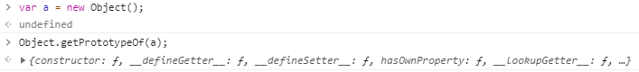


##### 2.`__proto__` 属性

先上例子：

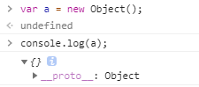

验证一下：

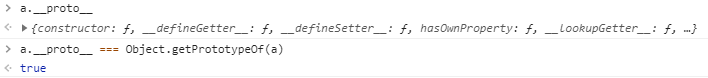

结果与 `Object.getPrototypeOf()` 完全一致。

​		这个 `__proto__` 属性引用了内部的 `[[Prototype]]` 对象（原型对象），甚至还可以通过 `.__proto__.__proto__...` 来遍历原型链。实际上`__proto` 存在于内置的 **Object.prototype** ,`__proto__` 属性是一个访问器属性（ `getter/setter`（若对于 `getter/setter` 不理解可以移步👉 [深入 JS 对象]() 好吧还没写hhhh）。），暴露了通过它访问对象的内部 `[[Prototype]]`（一个原型对象或 null）。

`__proto__` 的实现大致上是这样的：

```js
Object.defineProperty(Object.prototype, "__proto__",{
  get: function() {
      return Object.getPrototypeOf(this);
  },
  set: function(o){
      // ES6 的 setPrototypeOf(..)
      Object.setPrototypeOf(this, o);
      return o;
  }
});
```

因此，访问 `a.__proto__` 时，实际上是调用了 `a.__proto__()`（调用 `getter` 函数）。虽然 `getter` 函数存在于 `Object.prototype` 对象中，但是它的 `this`  指向对象 a（ [`this` 的隐式绑定](https://juejin.im/post/5e80f60ef265da47c43204da)） ，所以和 `Object.getPrototypeOf(a)` 结果相同。

##### 注意：

​		`__proto__` 属性在 ES6 时才被标准化，以确保浏览器的兼容性，但是不推荐使用，除了标准化的原因之外还有性能问题。为了更好的支持，推荐使用 `Object.getPrototypeOf()`

>通过改变一个对象的 `[[Prototype]]` 属性来改变和继承属性会对性能造成非常严重的影响，并且性能消耗的时间也不是简单的花费在 `obj.__proto__ = ...` 语句上，它还会影响到所有继承自该 `[[Prototype]]` 的对象。

如果要读取或修改对象的 `[[Prototype]]` 属性，建议使用`Object.get/setPrototypeOf() 或者 Reflect.get/setProtoypeOf()`，但是此时设置对象的 `[[Prototype]]` 依旧是一个缓慢的操作，如果性能是一个问题，就要避免这种操作。

如果要创建一个新的对象，同时继承另一个对象的 `[[Prototype]]`，推荐使用 **Object.create()**：

```
function Parent(){...}
var parent = new Parent();
var child = Object.create(parent);
// 这里的 child 是一个新的空对象，它的[[Prototype]] 指向对象 parent
```

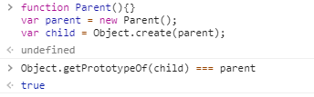

结构图：


### 3. 原型链

​		`[[Prototype]]` 机制就是存在于对象的一个内部链接，它会引用其他对象。这个链接的作用是：如果在对象上没有找到需要的属性或方法引用，引擎就会继续在 [[Prototype]] 关联的对象上进行查找。同理，如果在后者也没有找到需要的引用就会继续查找它的 `[[Prototype]]`，以此类推。这一系列的链接被称为 **“原型链”**。

​		所有普通对象（内置的，不是来源于特定主机的扩展）都“源于” **Object.prototype** 对象，也就是说把所有的普通对象的原型链最终都会指向内置的 **Object.prototype** 对象。（这里注意：`Object.prototype.__proto__` 的值为 `null`  即表示没有对象，**所以说 Object.prototype 没有原型对象**）

​		当你通过各种语法进行属性查找时，都会（通过委托）查找原型链，直到找到属性或者查找完整条原型链。

图中这条黄色组成的链状结构就是原型链：（用 `__proto__` 来访问内部属性 `[[Prototype]]`)

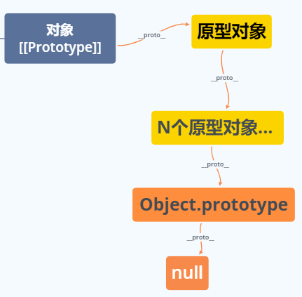

#### 属性设置和屏蔽

当我们给一个对象设置属性时并不仅仅是添加一个新属性或者修改已有属性，那么会发生什么呢？

例如 `myObject.foo = "bar"` 的一个过程：

1. 如果 `myObject` 对象中包含名为 foo 的普通数据访问属性，这条赋值语句只会修改已有的属性值。
2. 如果 foo 不是直接存在于 `myObject` 中，原型链就会被遍历，如果原型链上找不到 foo，foo 就会直接添加到 `myObject` 上。
3. 如果属性名 foo 即出现在 `myObject` 中也出现在 `myObject` 的原型链上层，那么就会发生**屏蔽**。`myObject` 中包含的 foo 属性会屏蔽原型链上层的所有 foo 属性，因为 `myObjcet.foo` 总会选择原型链中最底层的 foo 属性
4. 然而，如果 foo 只存在于原型链上，赋值语句的行为就会有些出人意料 ，会出现三种情况：
   - a. 如果在原型链上层存在名为 foo 的普通数据访问属性并且**没有被标记为只读（writable: false)**，那么就会直接在 `myObject` 中添加一个名为 foo 的新属性，它是**屏蔽属性**。
   - b. 如果在原型链上层存在 foo 但它**被标记为只读（writable: false)**，那么无法修改已有属性或者在 `myObject` 上创建屏蔽属性。如果运行在严格模式下，代码会抛出一个错误。否则，这条赋值语句会被忽略，总之，**不会发生屏蔽**。
   - 如果在原型链上层存在 foo 并且它是一个 setter ，那就一定会调用这个 setter。foo  不会被添加到（或者说屏蔽于）`myObject` ，也不会重新定义 foo 这个 setter
   - 注：若希望在第二种和第三种情况下也屏蔽 foo，那么就不能使用 = 操作符来赋值，而是使用 `Object.defineProperty(..)` 来向 `myObject` 添加 foo。

## 三、函数—”类“？？

​		在前置知识说过，JavaScript 并不是基于类的面向对象语言。

​		JavaScript 面向对象的基础是基于原型，所以开发只能通过原型来**“模仿类”**来实现 JavaScript 中的 **”类“**。

​		这种行为利用了函数的一种特性：所有的函数默认都会拥有一个名为 **prototype** 的公有并且不可枚举的属性，它会指向另一个对象：

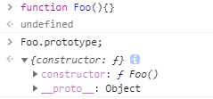

对于这个对象最直接的解释就是，通过调用 `new  Foo()` 创建的每个对象最终被 `[[Prototype]]` 链接到这个 "Foo.prototype" 对象，让我们来验证一下：

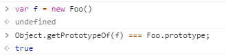

调用 **new Foo()** 时会生成一个新对象 f（具体步骤请👉[new绑定](https://juejin.im/post/5e80f60ef265da47c43204da#heading-8)），其中的一步就是将这个新对象 f 的内部链接 `[[Prototype]]` 关联到 `Foo.prototype` 所指向的对象。

所以最后我们得到了两个对象，它们之间相互关联，就是这样。我们并没有像其他语言一样初始化一个类，实际上并没有从 “类” 中**复制（继承）**任何行为到一个对象中，只是让两个对象互相关联。

注：`new Foo()` 实际上并没有直接创建关联，而且实际上是 new 调用内的 **Object.create()** 关联到其他对象。

可以用关系图表示为：

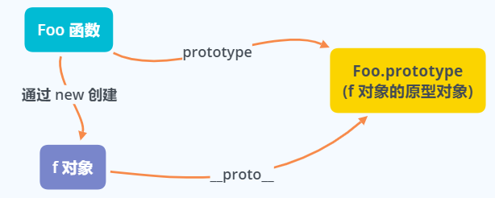

这个机制通常被称为**原型继承**（动态语言版本的类继承），但是并不会将一个对象（”类“）复制到另一个对象（”类的实例“），只是将他们关联起来。（其实比继承更贴切的说法是**委托**）


上面例子中的 `Foo` 为什么会被认为是一个”类“？ 👇


### “构造函数”

- 一个原因是因为使用了关键字 **new** 来调用，在面向类的语言中构造类的实例也会使用到他。
- 另一个原因是，看起来我们执行了类的构造函数方法，**Foo()** 的调用方式很像初始化类时构造函数的调用方法。

上一段代码很容易让人认为 `Foo` 是一个构造函数，因为我们使用 new 来调用他并且看到它 ”构造“ 了一个对象。

实际上，`Foo` 和程序中的其他函数没有任何区别。函数本身不是构造函数，然而，当你在普通的函数调用前面加上 `new` 关键字之后，就会把这个函数调用变成一个 **”构造函数调用“**。**new 会劫持所有普通函数并用构造对象的形式来调用它。**

**换句话说，在 JavaScript 中对于”构造函数“ 最准确的解释是，所有带 new 的函数调用。**函数不是构造函数，但是当且仅当使用 new 时，函数调用会变成 ”**构造函数调用**“。

注：由于 ”类“名字首字母要大写，所以构造函数的名字写作 `Foo` 而非 `foo`，这只是一种约定成俗的规矩，首字母大小写并不影响构造函数的调用。


### constructor

还有一个原因是：

函数的 `prototype` 指向的对象中有一个 `constructor` 返回创建实例对象时构造函数的引用。

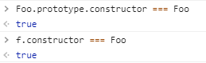

- `Foo.prototype` 默认（在代码第一行声明时！）有一个公有并且不可枚举的属性 `constructor`，这个属性引用的是对象关联的函数（这里指 Foo 函数），此属性的值是对函数本身的引用，而不是一个包含函数名称的字符串。
- 此外也可以看到通过 ”构造函数“ 调用 `new Foo` 创建的对象也有一个 `constructor` 属性，指向 ” 创建这个对象的函数 “。

`f.constructor === Foo` 看起来 f 确实有一个指向 `Foo` 的 `constructor` 属性，但是事实不是这样。实际上，`constructor` 同样被委托给了 `Foo.prototype` (也就是原型链的作用)，而 `Foo.prototype.coustructor` 默认在声明时指向构造函数 `Foo`。

也就是说，当你创建了一个新对象并替换了函数默认的 `prototype` 对象引用，那么新的对象并不会自动获得 `constructor`，`constructor` 同样也会被修改，需要去手动添加一个符合正常行为的 `constructor` 属性。

举个例子：

```js
function Foo() {}
Foo.prototype = {}; // 指向一个新的原型对象

var f = new Foo();
a1.constructor === Foo; // false！
a1.constructor === Object; // true!
```

- 当 `Foo` 的原型指向被修改时，`constructor`也会随之改变。a1 并没有 `constructor` 属性，所以它会委托原型链上的 `Foo.prototype`。而此时的 `Foo.prototype` 指向了 `{}`（ `{}` 类似于 `new Object()`)，所以它会继续委托给 `Object.prototype` ，这个对象有  `constructor` 属性，指向内置的 `Object(..)` 函数。

**注意：由于 `constructor` 是可以手动修改的，所以是一个不可靠的引用，它们不一定会指向默认的函数引用，要避免使用。**

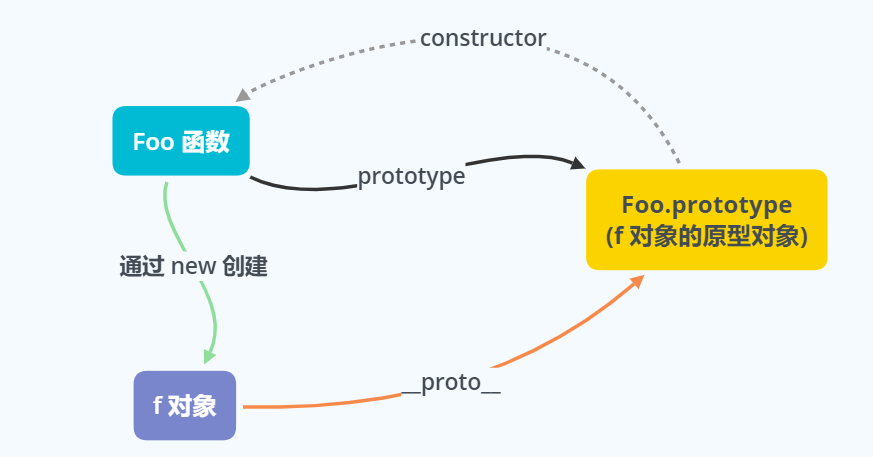

### 模拟类的行为

```js
function Foo(name) {
    this.name = name;
}
Foo.prototype.myName = function() {
    return this.name;
};

var a = new Foo("a");
var b = new Foo("b");

a.myName(); // "a"
b.myName(); // "b"
```

这段代码展示了两种 ”面向类“ 的技巧：

1. `this.name = name` 给每个对象（也就是 a 和 b）都添加了 `name` 属性，有点像类似封装的数据值。
2. `Foo.prototype.myName = ...`  ，它会给 `Foo.prototype` 对象添加一个属性（函数），使 `a.myName()` 可以正常工作，类似于类的继承，其实是当 a 和 b 无法找到 `myName` 时，会通过委托在 `Foo.prototype` 上找到。

#### 原型继承

JS 实现模拟类还需要模拟类的**继承**机制，但是 JS 中的是委托关联，并不是传统类的复制操作。

```js
function Foo(name) {
    this.name = name;
}
Foo.prototype.myName = function() {
    return this.name;
};

function Bar(name, label){
    Foo.call(this, name);
    this.label = label;
}

// 创建了一个新的 Bar.prototype 对象并关联到 Foo.prototype
Bar.prototype = Object.create(Foo.prototype);
// 注意！ 现在没有 Bar.prototype.constructor,需要手动修复
Object.defineProperty(Foo.prototype, "constructor", {
    enumerable: false,
    writable: true,
    configurable: true,
    value: Bar // 让 constructor 指向 Bar
});

Bar.prototype.myLabel = function() {
    return this.label;
};

var a = new Bar("a", "obj a");

a.myName(); // "a"
b.myLabel(); // "obj a"
```

这段代码的核心部分就是语句 `Bar.prototype = Object.create(Foo.prototype)`。调用 `Object.create` 会创建一个新对象并把新对象内部的 `[[Prototype]]` 关联到指定的对象（本例中是 Foo.prototype)。

换句话说就是：创建一个新的 `Bar.prototype` 对象并把它关联到 `Foo.prototype`。

注意，下面这两种方式是常见的错误做法，实际上它们都存在一些问题：

- `Bar.prototype = Foo.prototype;`
  - 该语句并不会创建一个关联到  `Foo.prototype` 的新对象，它只是让 `Bar.prototype` 直接引用 `Foo.prototype` 对象。因此当执行类似的 `Bar.prototype.myLabel = ...` 的赋值语句时会直接修改 `Foo.prototype` 本身。
- `Bar.prototype = newFoo()`
  - 该语句的确会创建一个关联到 `Foo.prototype` 的新对象，但是它使用了 `Foo()` 的 “构造函数调用”，如果函数 Foo 中有一些副作用（比如，修改状态、注册到其他对象、给 `this` 添加数据属性等等），就会影响到 `Bar()` 的 "后代"。

因此，要创建一个合适的关联对象，我们必须使用 `Object.create(...)` 而不是使用具有副作用的 `Foo()`。这样做的唯一缺点就是需要创建一个新对象然后把旧对象抛弃掉，不能直接修改已有的默认对象。

在ES6 之前，我们只能通过设置 `__proto__` 属性来实现，但是这个方法并不是标准并且无法兼容所有浏览器。ES6 添加了辅助函数 **Object.setPrototypeOf()**，可以用标准并且可靠的方法来修改关联。

来对比一下两种把 `Bar.prototype` 关联到 `Foo.prototype` 的方法：

```js
// ES6 之前需要抛弃默认的 Bar.prototype，会有轻微的性能损失（抛弃的对象需要进行垃圾回收）
Bar.prototype = Object.create(Foo.prototype);
// ES6 开始可以直接修改现有的 Bar.prototype
Objcet.setPrototype(Bar.prototype, Foo.prototype);
```


### 函数的`[[Prototype]]`

先来看一段代码：

```js
function Foo() {...}
console.log(Foo.constructor) // 输出结果:[Function: Function]
// 上面的函数声明代码等价于
var Foo = new Function('...');
Foo.__proto__ === Function.prototype;
Object.getPrototypeOf(Foo) === Function.prototype;
```

说明了在 JavaScript 中，函数（`Foo`）就是 `Function` 内置构造器的实例对象，对象由函数创造，也就是常说的**函数即对象**。而且函数的 `[[Prototype]]` （即 `__proto__`）也指向其构造器（构造函数）的 `prototype` 属性。

再来一段代码：

```js
console.log(Object.__proto__   === Function.prototype); // true
console.log(Number.__proto__   === Function.prototype); // true
console.log(Boolean.__proto__  === Function.prototype); // true
console.log(String.__proto__   === Function.prototype); // true
console.log(Object.__proto__   === Function.prototype); // true
console.log(Function.__proto__ === Function.prototype); // true
console.log(Array.__proto__    === Function.prototype); // true
console.log(RegExp.__proto__   === Function.prototype); // true
console.log(Error.__proto__    === Function.prototype); // true
console.log(Date.__proto__     === Function.prototype); // true
```

这说明 **所有的构造函数（构造器）都继承于 Function.prototype**，甚至包括根构造器 `Object` 及 `Function` 自身。所有构造器都继承了 `Function.prototype` 的属性及方法。如 `length、call、apply、bind（ES5）`等

即 

- Object 构造器的 `[[Prototype]]` 属性指向 `Function` 构造器的 `prototype` 属性  
  - `Object.__proto__ === Function.prototype` 

- Function 构造器的 `[[Prototype]]` 属性指向其构造器本身的 `prototype` 属性：
  - `Function.__proto__ === Function.prototype`

而 `Function.prototype.__proto__` 会指向哪里呢？

根据我们在上面得出的结论：所有的构造器即是函数，也是一个 JS 对象，而对象的原型链的顶端都是  `Object.prototype`，所以它也会继承自 `Object.prototype` 以及其方法（例如：toString、valueOf、hasOwnProperty 等）。

即 `Function.prototype.__proto__ === Object.prototype`

用结构图来梳理一波：（黄色的线条即代表原型链）

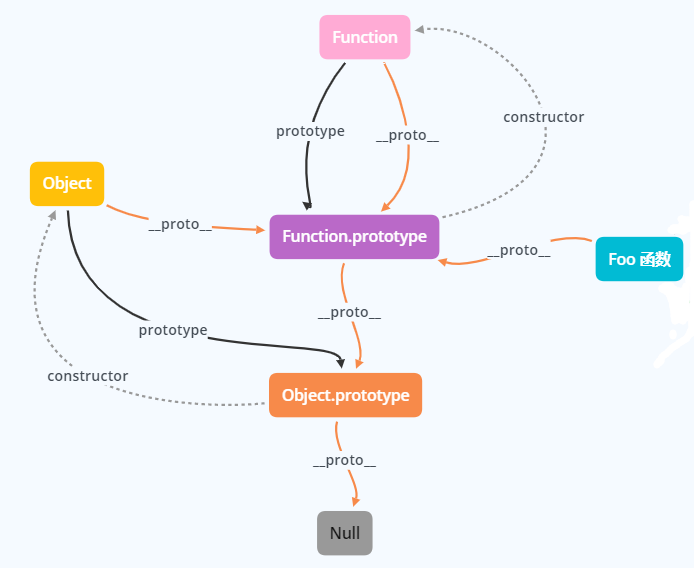

下图是包含了 Foo 函数创建了 f 对象的结构图：

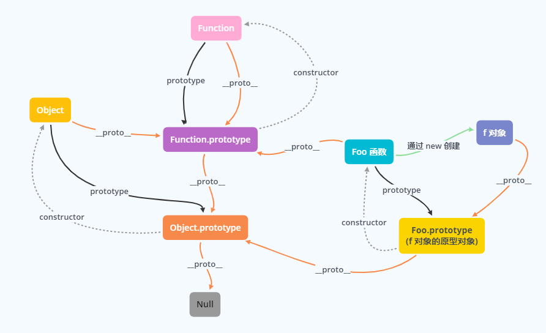

## 总结

​		虽然 JavaScript 模拟类的机制和传统面向类语言中的 ”类初始化“ 和 ”类继承“ 很相似，但是 JavaScript 中的机制由一个核心区别。那就是不会进行复制，对象之间是通过内部的原型链进行关联的。相比之下，委托更适合 JS 中对象的关系。 

​		JS 对象的委托（继承）关联机制——原型链接（也就是对象内部属性 `[[Prototype]]` 的指向)，以及函数的 `prototype、constructor` 属性的指向。	

​		对象的 `[[Prototype]]`总结：先由 `Object.prototype`（原型链顶端），接下来是构造函数的 `prototype` 属性。

​		函数的`[[Prototype]]` 指向总结：先由 `Object.prototype`（原型链顶端），`Function.prototype` 继承 `Object.prototype` 而产生，最后，`Function` 和 `Object`  和其它构造函数继承 `Function.prototype` 而产生。

最后！！！！放波原型链图镇镇，看晕了的话再多看几遍文章（🐶狗头自保）。


## 参考：

《你不知道的 JavaScript》——上卷 ！！！强烈推荐阅读

[对象原型](https://developer.mozilla.org/zh-CN/docs/Learn/JavaScript/Objects/Object_prototypes)

[从prototype与__proto__窥探JS继承之源 | 掘金技术征文](https://juejin.im/post/58f9d0290ce46300611ada65#heading-3)

[JavaScript深入之从原型到原型链](https://github.com/mqyqingfeng/Blog/issues/2#)

[重新认识构造函数、原型和原型链](https://www.muyiy.cn/blog/5/5.1.html#引言)

