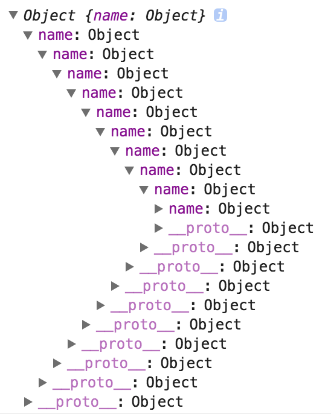
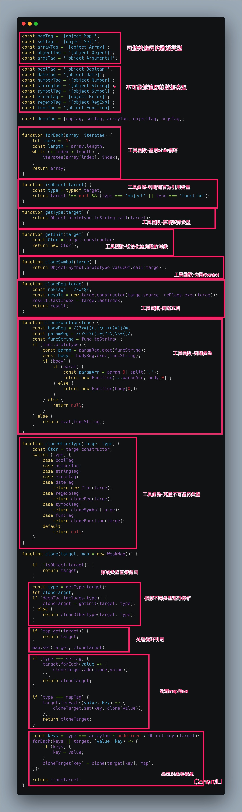

# 一、什么是拷贝？

举个例子：

```js
let arr = [1, 2, 3];
let newArr = arr;
newArr[0] = 100;

console.log(arr);//[100, 2, 3]
```

这是直接赋值的情况，不涉及任何拷贝。当改变 `newArr` 的时候，由于是同一个引用，`arr` 的指向的值也跟着改变。

现在进行浅拷贝:

```js
let arr = [1, 2, 3];
let newArr = arr.slice();
newArr[0] = 100;

console.log(arr);//[1, 2, 3]
复制代码
```

当修改`newArr`的时候，arr的值并不改变。什么原因?因为这里`newArr`是`arr`浅拷贝后的结果，`newArr`和`arr`现在引用的已经不是同一块空间啦！

但是这又会带来一个潜在的问题:

```js
let arr = [1, 2, {val: 4}];
let newArr = arr.slice();
newArr[2].val = 1000;

console.log(arr);//[ 1, 2, { val: 1000 } ]
```

这就是浅拷贝的限制所在了。它只能拷贝一层对象。如果有对象的嵌套，那么浅拷贝将无能为力。但幸运的是，深拷贝就是为了解决这个问题而生的，它能解决无限级的对象嵌套问题，实现彻底的拷贝。

# 二、浅拷贝（Shallow Copy）

## 1. 什么是浅拷贝

创建一个新对象，这个对象有着原始对象属性的一份精确拷贝。如果属性是基本类型，拷贝的就是基本类型的值，如属性是引用类型，拷贝的就是内存地址，所以如果其中一个对象改变了这个地址，就会影响到另一个对象。

简单来说可以理解为浅拷贝只解决了第一层的问题，拷贝第一层的基本类型值，以及第一层的引用类型地址。


上图中，`SourceObject` 是原对象，其中包含基本类型属性 `field1` 和引用类型属性 `refObj`。浅拷贝之后基本类型数据 `field2` 和 `filed1` 是不同属性，互不影响。但引用类型 `refObj` 仍然是同一个，改变之后会对另一个对象产生影响。

## 2. 浅拷贝使用场景

- `Object.assign()`

`Object.assign()` 方法用于将所有可枚举属性的值从一个或多个源对象复制到目标对象。它将返回目标对象。

注意：`Object.assgin()` 拷贝的是对象的属性的引用，而不是对象本身。

```js
let a = {
    name: "muyiy",
    book: {
        title: "You Don't Know JS",
        price: "45"
    }
}
let b = Object.assign({}, a);
console.log(b);
// {
// 	name: "muyiy",
// 	book: {title: "You Don't Know JS", price: "45"}
// } 
```

- 扩展运算符 `...`

```js
let arr = [1, 2, 3];
let newArr = [...arr];
```

- `Array.prototype.slice()`

`slice()` 方法返回一个新的数组对象，这一对象是一个由 `begin` 和 `end`（不包括 `end`）决定的原数组的**浅拷贝**。原始数组不会被改变。

```js
let arr = [1, 2, 3];
let newArr = arr.slice();
newArr[0] = 100;

console.log(arr);//[1, 2, 3]
```

- `Array.prototype.concat()`

```js
let arr = [1, 2, 3];
let newArr = arr.concat();
newArr[1] = 100;
console.log(arr);//[ 1, 2, 3 ]
```

## 3. 手动实现浅拷贝

思路：遍历对象，然后把属性和属性值都放在一个新的对象

```js
var shallowCopy = function(obj){
    // 只拷贝对象
    if(typeof obj !== 'object' || obj === null) return obj;
    // 根据 obj 的类型判断是新建一个数组还是对象
    var newObj = obj instanceof Array ? [] : {};
    // 遍历 obj，并判断是 obj 的属性才拷贝
    for(var key in obj){
        if(obj.hasOwnProperty(key)){
            newObj[key] = obj[key];
        }
    }
    return newObj;
}
```


# 三、深拷贝（Deep Copy）

## 1. 什么是深拷贝

深拷贝会拷贝所有的属性，并拷贝属性指向的动态分配的内存。当对象和它所引用的对象一起拷贝时即发生深拷贝。深拷贝相比于浅拷贝速度较慢并且花销较大。拷贝前后两个对象互不影响。


## 2. 深拷贝使用场景

`JSON.parse(JSON.stringify(object))`

```js
let a = {
    name: "muyiy",
    book: {
        title: "You Don't Know JS",
        price: "45"
    }
}
let b = JSON.parse(JSON.stringify(a));
console.log(b);
// {
// 	name: "muyiy",
// 	book: {title: "You Don't Know JS", price: "45"}
// } 

a.name = "change";
a.book.price = "55";
console.log(a);
// {
// 	name: "change",
// 	book: {title: "You Don't Know JS", price: "55"}
// } 

console.log(b);
// {
// 	name: "muyiy",
// 	book: {title: "You Don't Know JS", price: "45"}
// } 
```

数组同理，但是该方法会有以下几个问题：

1. 会忽略 `undefined`，`Symbol`

2. 无法解决**循环引用**的问题，例子：

   ```js
   var a = { val:2 };
   a.target = a;
   ```

   拷贝 a 会出现栈溢出，因为出现了**无限递归**的情况。

3. 不能序列化**函数**！

4. 无法拷贝一些**特殊对象**，诸如 `RegExp,Date,Set,Map` 等。

## 3. 手动实现深拷贝

简易版深拷贝

```js
function deepClone(target){
    if(typeof obj !== 'object' || obj === null) return obj;
    var newObj = obj instanceof Array ? [] : {};
    for(var key in obj){
        if(obj.hasOwnProperty(key)){
            newObj[key] = typeof obj[key] === 'object' ? deepClone(obj[key]) : obj[key];
        }
    }
    return newObj;
}
```


# 四、实现 jQuery 的 extend

## 1. extend 基本用法

功能：合并两个或者更多的对象的内容到第一个对象中。

`extend` 的用法：

```js
jQuery.extend( target [, object1 ] [, objectN ] )
```

第一个参数 `target`，表示要拓展的目标，我们就称它为目标对象吧。

后面的参数，都传入对象，内容都会复制到目标对象中，我们就称它们为待复制对象吧。

举个例子：

```js
var obj1 = {
    a: 1,
    b: { b1: 1, b2: 2 }
};

var obj2 = {
    b: { b1: 3, b3: 4 },
    c: 3
};

var obj3 = {
    d: 4
}

console.log($.extend(obj1, obj2, obj3));

// {
//    a: 1,
//    b: { b1: 3, b3: 4 },
//    c: 3,
//    d: 4
// }
```

当两个对象出现相同字段的时候，后者会覆盖前者，而不会进行深层次的覆盖。

## 2. extend 第一版

```js
function extend() {
    var name, options, copy;
    var length = arguments.length;
    // 目标对象
    var target = arguments[0];
    
    for(var i = 1; i < length; i++){
        options = arguments[i];
        if(options != null){
            for(name in options){
                copy = options[name];
                // 忽略 undefined
                if(copy !== undefined){
                	target[name] = copy;
                }
            }
        }
    }
    
    return target;
}
```


## 3. extend 深拷贝

那如何进行深层次的复制呢？jQuery v1.1.4 加入了一个新的用法：

```js
jQuery.extend( [deep], target, object1 [, objectN ] )
```

也就是说，函数的第一个参数可以传一个布尔值，如果为 true，我们就会进行深拷贝，false 依然当做浅拷贝，这个时候，target 就往后移动到第二个参数。

还是举这个例子：

```js
var obj1 = {
    a: 1,
    b: { b1: 1, b2: 2 }
};

var obj2 = {
    b: { b1: 3, b3: 4 },
    c: 3
};

var obj3 = {
    d: 4
}

console.log($.extend(true, obj1, obj2, obj3));

// {
//    a: 1,
//    b: { b1: 3, b2: 2, b3: 4 },
//    c: 3,
//    d: 4
// }
```

因为采用了深拷贝，会遍历到更深的层次进行添加和覆盖。

## 4. extend 第二版

我们来实现深拷贝的功能，值得注意的是：

1. 需要根据第一个参数的类型，确定 target 和要合并的对象的下标起始值。
2. 如果是深拷贝，根据 copy 的类型递归 extend。

```js
function extend(){
    // 默认不进行深拷贝
    var deep = false;
    var name, options, src, copy;
    var length = arguments.length;
    // 记录要复制的对象的下标
    var i = 1;
    // 第一个参数不传布尔值的情况下，target 默认是第一个参数
    var target = arguments[0] || {};
    // 如果第一个参数是布尔值，第二个参数才是 target
    if(typeof target == 'boolean'){
        deep = target;
        target = arguments[i] || {};
        i++;
    }
    // 如果 target 不是对象，是无法进行复制的，所以设为{}
    if(typeof target !== 'object'){
        target = {};
    }
    
    // 循环遍历要复制的对象们
    for(; i < length; i++){
        // 获取当前对象
        options = arguments[i];
        // 要求不能为空，避免 extend(a, , b) 这种情况
        if(options != null){
            for(name in options){
                // 目标属性值
                src = target[name];
                // 要复制的对象的属性值
                copy = options[name];
                
                if(deep && copy && typeof copy == 'object'){
                    // 递归调用
                    target[name] = extend(deep, src, copy);
                }else if(copy !== undefined){
                    target[name] = copy;
                }
            }
        }
    }
    
    return target;
};
```

在实现上，如果要复制的对象的属性值是一个对象，就递归调用 extend。不过 extend 的实现中，多了很多细节上的判断，比如第一个参数是否是布尔值，target 是否是一个对象，不传参时的默认值等。

## 5. target 是函数

在我们的实现中，`typeof target` 必须等于 `object`，我们才会在这个 `target` 基础上进行拓展，然而我们用 `typeof` 判断一个函数时，会返回`function`，也就是说，我们无法在一个函数上进行拓展！

什么，我们还能在一个函数上进行拓展！！

当然啦，毕竟函数也是一种对象嘛，让我们看个例子：

```
function a() {}

a.target = 'b';

console.log(a.target); // b
```

实际上，在 underscore 的实现中，underscore 的各种方法便是挂在了函数上！

所以在这里我们还要判断是不是函数，这时候我们便可以使用[《JavaScript专题之类型判断(上)》](https://github.com/mqyqingfeng/Blog/issues/28)中写得 isFunction 函数

我们这样修改：

```
if (typeof target !== "object" && !isFunction(target)) {
    target = {};
}
```

## 6. 类型不一致

其实我们实现的方法有个小 bug ，不信我们写个 demo:

```js
var obj1 = {
    a: 1,
    b: {
        c: 2
    }
}

var obj2 = {
    b: {
        c: [5],

    }
}

var d = extend(true, obj1, obj2)
console.log(d);
```

我们预期会返回这样一个对象：

```js
{
    a: 1,
    b: {
        c: [5]
    }
}
```

然而返回了这样一个对象:

```js
{
    a: 1,
    b: {
        c: {
            0: 5
        }
    }
}
```

让我们细细分析为什么会导致这种情况：

首先我们在函数的开始写一个 console 函数比如：console.log(1)，然后以上面这个 demo 为例，执行一下，我们会发现 1 打印了三次，这就是说 extend 函数执行了三遍，让我们捋一捋这三遍传入的参数：

第一遍执行到递归调用时：

```js
var src = { c: 2 };
var copy = { c: [5]};

target[name] = extend(true, src, copy);
```

第二遍执行到递归调用时：

```js
var src = 2;
var copy = [5];

target[name] = extend(true, src, copy);
```

第三遍进行最终的赋值，因为 src 是一个基本类型，我们默认使用一个空对象作为目标值，所以最终的结果就变成了对象的属性！

为了解决这个问题，我们需要对目标属性值和待复制对象的属性值进行判断：

判断目标属性值跟要复制的对象的属性值类型是否一致:

- 如果待复制对象属性值类型为数组，目标属性值类型不为数组的话，目标属性值就设为 []
- 如果待复制对象属性值类型为对象，目标属性值类型不为对象的话，目标属性值就设为 {}

结合着[《JavaScript专题之类型判断(下)》](https://github.com/mqyqingfeng/Blog/issues/30)中的 isPlainObject 函数，我们可以对类型进行更细致的划分：

```js
var clone, copyIsArray;

...

if (deep && copy && (isPlainObject(copy) ||
        (copyIsArray = Array.isArray(copy)))) {

    if (copyIsArray) {
        copyIsArray = false;
        clone = src && Array.isArray(src) ? src : [];

    } else {
        clone = src && isPlainObject(src) ? src : {};
    }

    target[name] = extend(deep, clone, copy);

} else if (copy !== undefined) {
    target[name] = copy;
}
```

## 7. 循环引用

实际上，我们还可能遇到一个循环引用的问题，举个例子：

```js
var a = {name : b};
var b = {name : a}
var c = extend(a, b);
console.log(c);
```

我们会得到一个可以无限展开的对象，类似于这样：



为了避免这个问题，我们需要判断要复制的对象属性是否等于 target，如果等于，我们就跳过：

```js
...
src = target[name];
copy = options[name];

if (target === copy) {
    continue;
}
...
```

如果加上这句，结果就会是：

```js
{name: undefined}
```

## 8. 最终代码

```js
// isPlainObject 函数来自于  [JavaScript专题之类型判断(下) ](https://github.com/mqyqingfeng/Blog/issues/30)
var class2type = {};
var toString = class2type.toString;
var hasOwn = class2type.hasOwnProperty;

function isPlainObject(obj) {
    var proto, Ctor;
    if (!obj || toString.call(obj) !== "[object Object]") {
        return false;
    }
    proto = Object.getPrototypeOf(obj);
    if (!proto) {
        return true;
    }
    Ctor = hasOwn.call(proto, "constructor") && proto.constructor;
    return typeof Ctor === "function" && hasOwn.toString.call(Ctor) === hasOwn.toString.call(Object);
}


function extend() {
    // 默认不进行深拷贝
    var deep = false;
    var name, options, src, copy, clone, copyIsArray;
    var length = arguments.length;
    // 记录要复制的对象的下标
    var i = 1;
    // 第一个参数不传布尔值的情况下，target 默认是第一个参数
    var target = arguments[0] || {};
    // 如果第一个参数是布尔值，第二个参数是 target
    if (typeof target == 'boolean') {
        deep = target;
        target = arguments[i] || {};
        i++;
    }
    // 如果target不是对象，我们是无法进行复制的，所以设为 {}
    if (typeof target !== "object" && !isFunction(target)) {
        target = {};
    }

    // 循环遍历要复制的对象们
    for (; i < length; i++) {
        // 获取当前对象
        options = arguments[i];
        // 要求不能为空 避免 extend(a,,b) 这种情况
        if (options != null) {
            for (name in options) {
                // 目标属性值
                src = target[name];
                // 要复制的对象的属性值
                copy = options[name];

                // 解决循环引用
                if (target === copy) {
                    continue;
                }

                // 要递归的对象必须是 plainObject 或者数组
                if (deep && copy && (isPlainObject(copy) ||
                        (copyIsArray = Array.isArray(copy)))) {
                    // 要复制的对象属性值类型需要与目标属性值相同
                    if (copyIsArray) {
                        copyIsArray = false;
                        clone = src && Array.isArray(src) ? src : [];

                    } else {
                        clone = src && isPlainObject(src) ? src : {};
                    }

                    target[name] = extend(deep, clone, copy);

                } else if (copy !== undefined) {
                    target[name] = copy;
                }
            }
        }
    }

    return target;
};
```


# 完整版

[如何写出一个惊艳面试官的深拷贝](http://www.conardli.top/blog/article/JS进阶/如何写出一个惊艳面试官的深拷贝.html#导读)


