[Vue风格指南](https://cn.vuejs.org/v2/style-guide/index.html)

[前端代码规范总结](https://lq782655835.github.io/blogs/team-standard/0.standard-ai-summary.html)

# Vue 编码规范

## 一、命名规范

### **1.** **文件夹命名统一**

确保文件命名总是以字母开头而不是数字，且字母一律小写，以下划线连接且不带其他标点符号

所有文件名统一使用小写，首页命名为`index.html`

### **2.** **组件名**

组件命名为多个单词。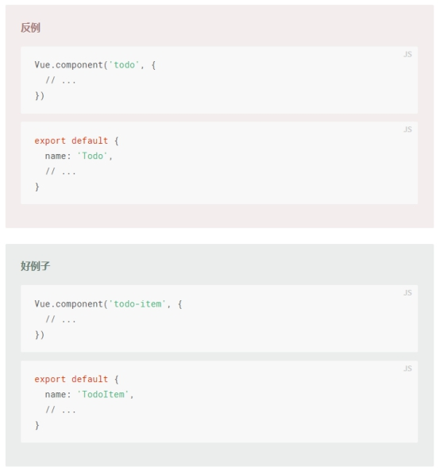

#### 2.1单文件组件名

​		单文件组件的文件名应该要么始终是单词大写开头（PascalCase），要么始终是横线连接（kebab-case）

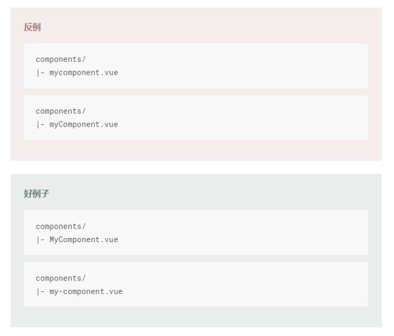

#### 2.2基础组件名

​		应用特定样式和约定的基础组件（也就是展示类的、无逻辑的或无状态的组件）应该全部以一个特定的前缀开头，比如Base、App、V

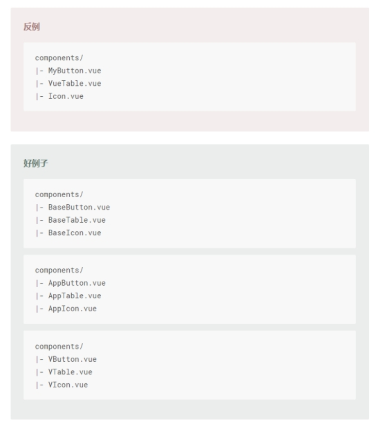

#### 2.3单例组件名

​		只应该拥有单个活跃实例的组件应该以 The 前缀命名，以示其唯一性

#### 2.4紧密耦合的组件名

​		和父组件紧密耦合的子组件应该以父组件名作为前缀命名。（若组件名称过长，可根据具体情况使用明确的单词缩写命名）

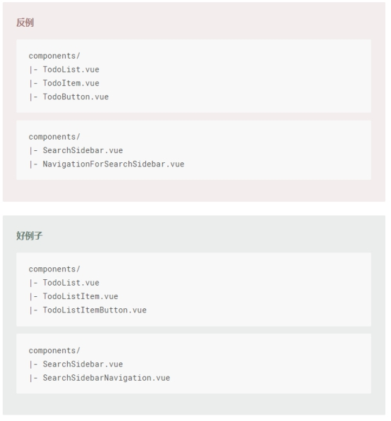

#### 2.5组件名中单词顺序

​				组件名应该以高级别的（通常是一般化描述的）单词开头。以描述性的修饰词结尾。


#### 2.6模板中的组件名

​		对于绝大多数项目来说，在单文件组件和字符串模板中组件名应该总是PascalCase的--但是在DOM末班中总是kebab-case

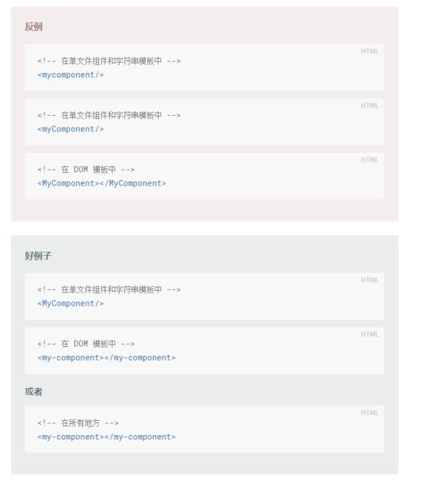

#### 2.7 js/jsx中的组件名

​		Js/jsx 中的组件名应该始终是 PascalCase 的，尽管在较为简单的应用中只使用 `Vue.component` 进行全局组件注册时，可以使用 kebab-case 字符串

#### 2.8完整单词的组件名

​		组件名应该倾向于完整的单词而不是缩写

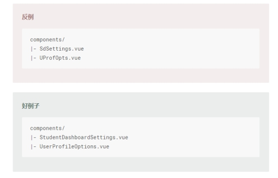

### **3.** **prop命名**

​		在声明 `prop` 的时候，其命名应该始终使用 camelCase，而在模板和JSX中应该始终使用kebab-case

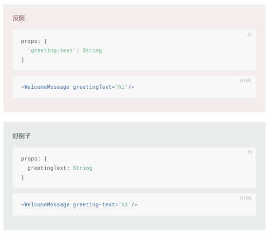

### **4.** **js命名**

Js命名应遵循简洁、语义化的原则

#### 4.1变量命名

命名方法：camelCase 命名法

命名规范：前缀为形容词

例：`let maxCount = 10`

#### 4.2常量命名

命名方法：名词全部大写

命名规范：使用大写字母和下划线来组合命名，下划线用来分割单词。

例：`const MAX_COUNT = 10`

#### 4.3函数命名

命名方法：camelCase命名法

命名规范：前缀为动词

例：`function getName(){}`

推荐：新增：addXxxxxxx

​      删除：delXxxxxxxx

​      编辑：editXxxxxxx

​      查询：getXxxxxxx

​      提交：submitXxxxx

​      选择多选框：chooseXxxxCheckBox

​      选择单选框：chooseXxxxRadio

​      下拉框选择：chooseXxxxSelect等

#### 4.4类&构造函数命名

命名方法：PascalCase命名法

命名规范：前缀为名称

例：class Persion

#### 4.5类成员

##### 4.5.1公共属性和方法

同变量和函数命名

##### 4.5.2私有属性和方法

前缀为下划线，后面同变量和函数名

### **5.** **css命名**

命名方法：BEM命名法

例：`.block__element--modifier`

> - 中划线 ：仅作为连字符使用，表示某个块或者某个子元素的多单词之间的连接记号。
>
> __ 双下划线：双下划线用来连接块和块的子元素
>
> _ 单下划线：单下划线用来描述一个块或者块的子元素的一种状态

**Block（模块）**__**Element（元素）**--**Modifier（修饰符）**

比如对话框内有一个确定按钮，这个确定按钮的类名可以是：`.alertmodal__button--done`，其中done是修饰符，表示是“表确定的那个按钮”。

```html
.form { }
.form--theme-xmas { }
.form--simple { }
.form__input { }
.form__submit { }
.form__submit--disabled { }

//对应的HTML结构如下：
<form class="form form--theme-xmas form--simple">
  <input class="form__input" type="text" />
  <input
    class="form__submit form__submit--disabled"
    type="submit" />
</form>
```

## **二、**编码规范

### **1.** **组件数据**

组件的data必须是一个函数

当在组件中使用data属性的时候（除了new Vue外的任何地方），它的值必须是返回一个对象的函数。


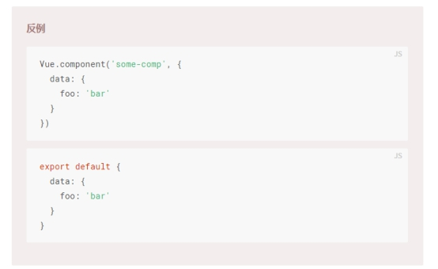

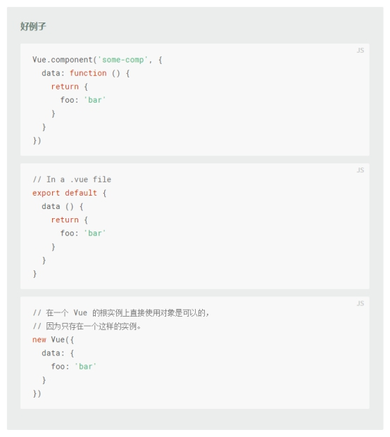

解析：

在创建或注册模板的时候，传入一个data属性作为用来绑定的数据。但是在组件中，data必须是一个函数，而不能直接把一个对象赋值给它。

```js
Vue.component('my-component', {
  template: '<div>OK</div>',
  data() {
    return {} // 返回一个唯一的对象，不要和其他组件共用一个对象进行返回
  },
})
```

在new Vue()的时候，是可以给data直接赋值为一个对象的。这是怎么回事，为什么到了组件这里就不行了。

因为上面这个操作是一个简易操作，实际上，它首先需要创建一个组件构造器，然后注册组件。注册组件的本质其实就是建立一个组件构造器的引用。使用组件才是真正创建一个组件实例。所以，注册组件其实并不产生新的组件类，但会产生一个可以用来实例化的新方式。

理解这点之后，再理解原型链：

```js
var MyComponent = function() {}
MyComponent.prototype.data = {
  a: 1,
  b: 2,
}
// 上面是一个虚拟的组件构造器，真实的组件构造器方法很多

var component1 = new MyComponent()
var component2 = new MyComponent()
// 上面实例化出来两个组件实例，也就是通过<my-component>调用，创建的两个实例

component1.data.a === component2.data.a // true
component1.data.b = 5
component2.data.b // 5
```

可以注意到，如果两个实例同时引用一个对象，那么当你修改其中一个属性的时候，另外一个实例也会跟着改。这显然是不像的，两个实例应该有各自的对象空间才对。

所以，需要通过下面方法来进行处理：

```js
var MyComponent = function() {
  this.data = this.data()
}
MyComponent.prototype.data = function() {
  return {
    a: 1,
    b: 2,
  }
}
```

这样每一个实例的data属性都是独立的，不会相互影响了。所以，你现在知道为什么vue组件的data必须是函数了吧。这都是因为js本身的特性带来的，跟vue本身设计无关。

### **2.** **prop定义**

Prop定义应该尽量详细

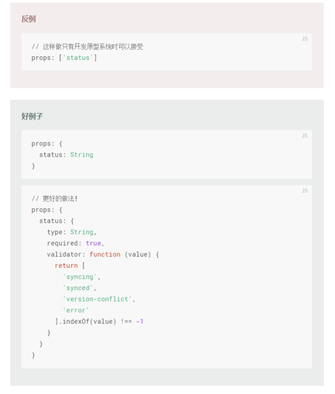

### **3.** **v-for**

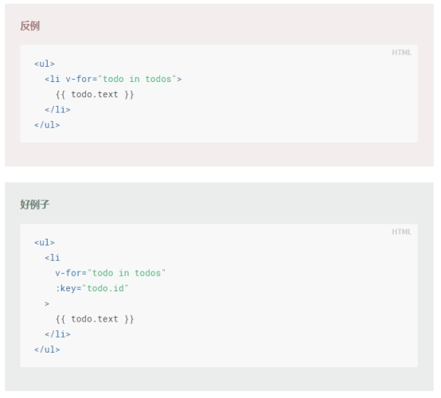

### **4.** **避免v-if和v-for用在一起**

永远不要把v-if和v-for同时用在同一个元素上，当 Vue 处理指令时，`v-for` 比 `v-if` 具有更高的优先级，所以会先遍历整个列表

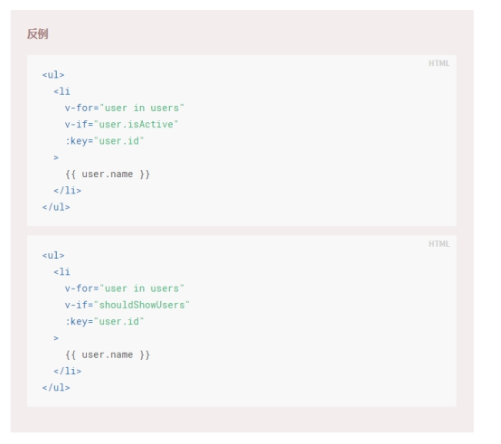

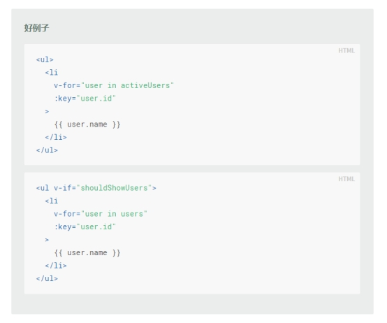

### **5. 组件样式设置作用域**

对于应用来说，顶级App组件和布局组件中的样式可以是全局的，但是其他所有组件都应该是有作用域的。（对于修改第三方样式库样式，使用scoped特性可能会导致样式不生效问题，若需要修改的第三方样式为公共样式，则需在全局样式中进行修改；若需要修改的为某个组件的特定样式，则可以在本页另写一个style标签，并不需要写scoped属性，但需定义好父容器class或id属性，防止直接使用第三方样式class修改样式对全局样式造成影响）

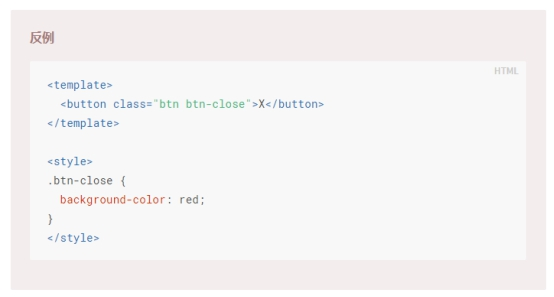

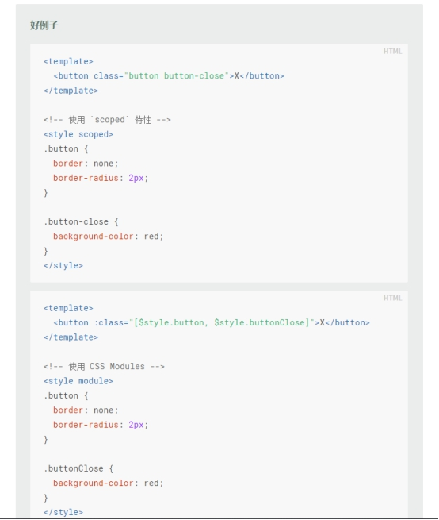

### **6. 私有属性名**

使用模块作用域保持不允许外部访问的函数的私有性。如果无法做到这一点，就始终为插件、混入等不考虑作为对外公共 API 的自定义私有属性使用 $_ 前缀。并附带一个命名空间以回避和其它作者的冲突 (比如 `$_yourPluginName_`)。

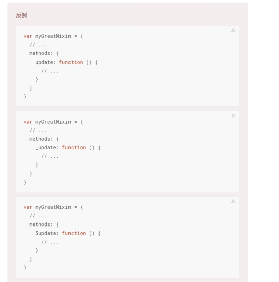

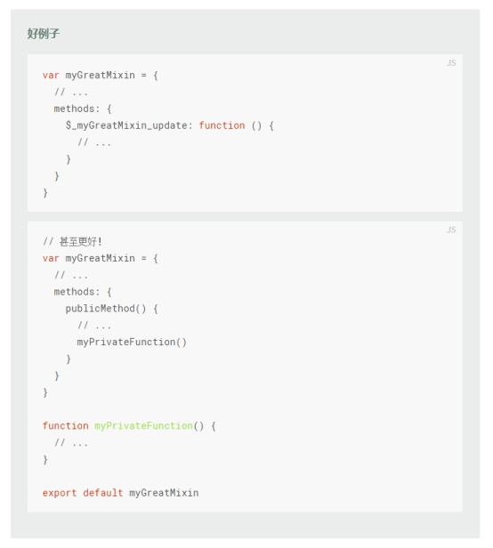

### **7. 组件文件**

只要有能够拼接文件的构建系统，就把每个组件单独分成文件。

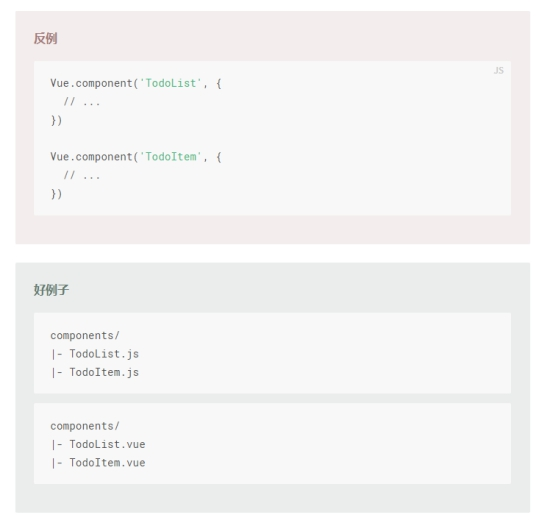

### **8.** **多个特性的元素**

多个特性的元素应该分多行撰写，每个特性一行。非空HTML特性值应该始终带引号。

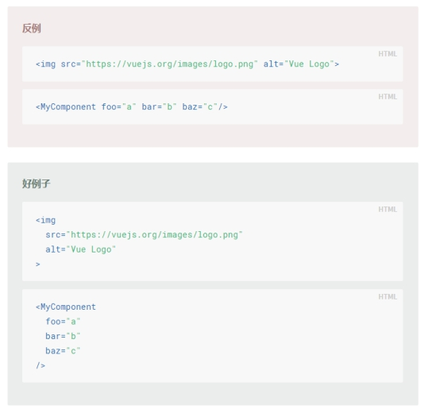

### **9.** **模板中简单的表达式**

组件模板应该只包含简单的表达式，复杂的表达式则应该重构为计算属性或方法。（除简单易懂三目运算外，其余条件判断或计算属性都应重构为计算属性或方法，并写清注释）

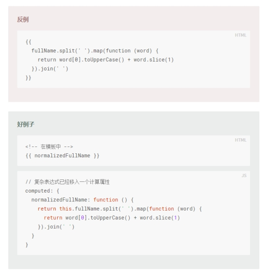

### **10. 简单的计算属性**

应该把复杂计算属性分割为尽可能多的更简单的属性。

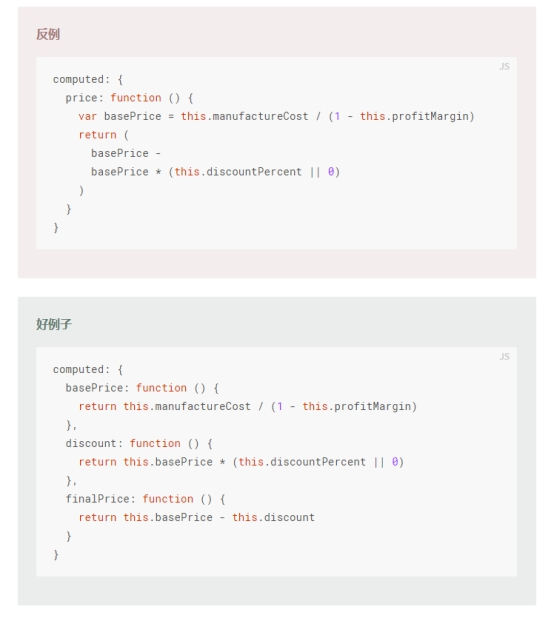

### **11. 指令缩写**

指令缩写（用：表示v-bind：、用@表示v-on：和用#表示v-solt：）应该要么都用要么都不用

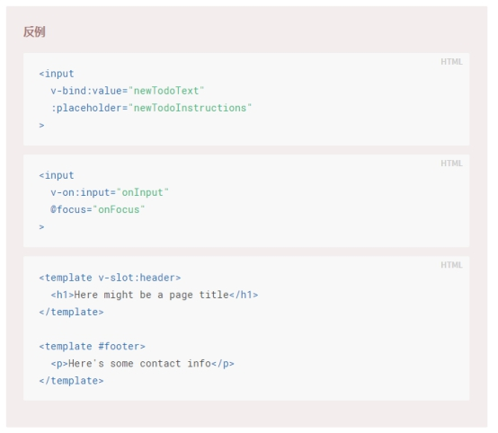

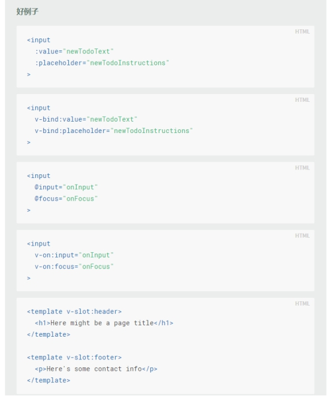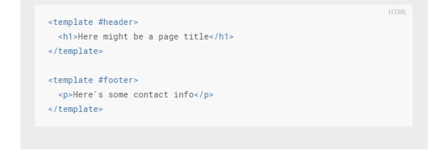

### **12.** **v-if/v-else-if/v-else**

如果一组 `v-if` + `v-else` 的元素类型相同，最好使用 `key` (比如两个 `<div>` 元素)。

默认情况下，Vue 会尽可能高效的更新 DOM。这意味着其在相同类型的元素之间切换时，会修补已存在的元素，而不是将旧的元素移除然后在同一位置添加一个新元素。如果本不相同的元素被识别为相同，则会出现意料之外的结果。

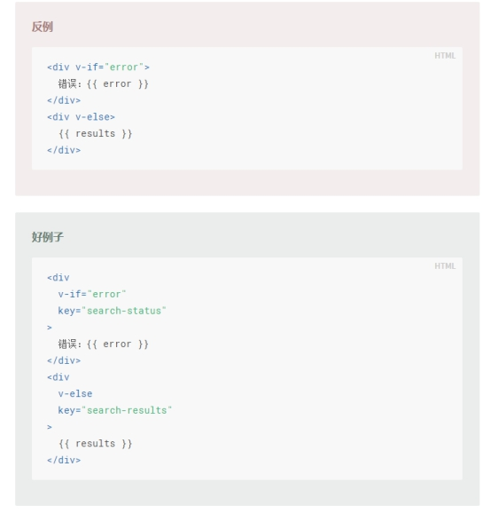

### **13. css作用域scoped**

元素选择器应该避免在scoped中出现

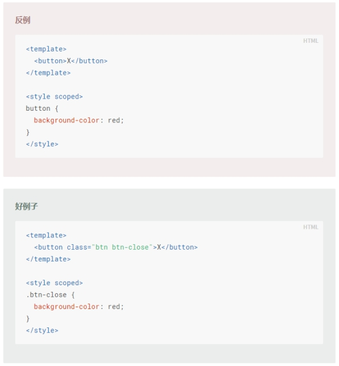

### **14. 不推荐使用内联样式书写样式**

推荐尽量使用外部样式或者内部样式的方式书写样式

### **15. 父子组件通信**

**应该优先通过prop和事件进行父子组件之间的通信，而不是 `this.$parent` 或改变 prop。**

一个理想的 Vue 应用是 prop 向下传递的，事件向上传递的。遵循这一约定会让你的组件更易于理解。然而，在一些边界情况下 prop 的变更或 `this.$parent` 能够简化两个深度耦合的组件。

问题在于，这种做法在很多*简单*的场景下可能会更方便。但请当心，不要为了一时方便 (少写代码) 而牺牲数据流向的简洁性 (易于理解)。


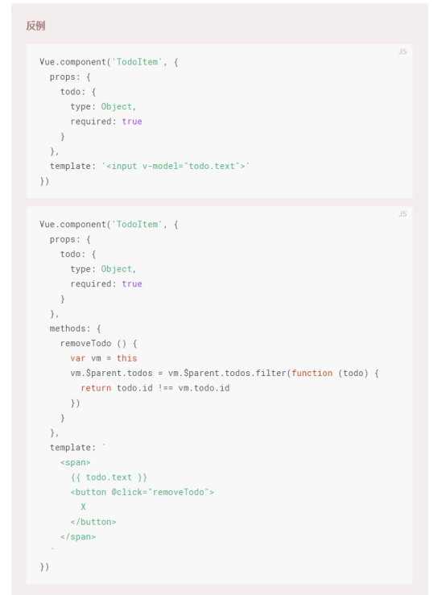

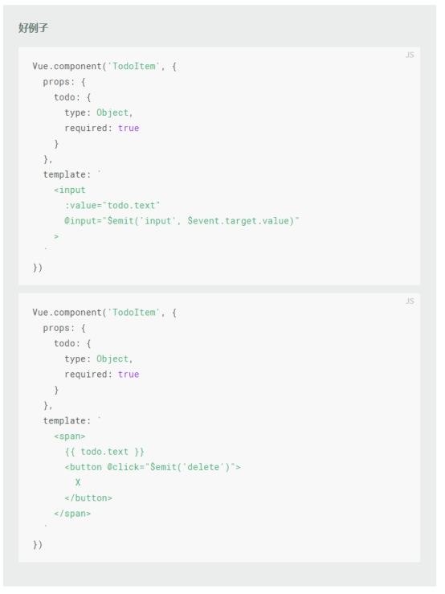

## **三、**注释

### 1. data中变量，尽量使用行注释，标清每个变量的意义

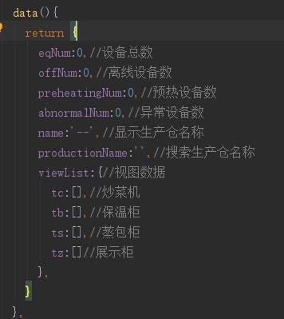

### 2.在方法上面写明方法作用，在逻辑判断位置使用行注释标清逻辑判断目的

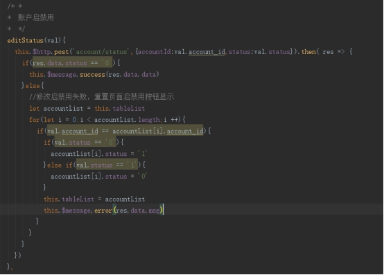

## **四、**目录结构

​		将能提取出来的公共样式、公共函数、公共组件，全部提取出，放到公共文件夹下。能对原生二次封装的地方，尽量二次封装，减少代码冗余。

此目录结构仅为大部分项目基础结构，可根据具体项目具体情况进行修改

1. common 

   存放平台级公共文件，例如 css、js、less、sass、image等，对于公共文件中的 css、less、sass 等代码，需注释清每个选择器的意义

2. components

   存放平台及公共组件，每个组件单独一个文件夹，文件夹下放置对应 vue 组件

3. images

   存放图片资源。其中 commonIcon 存放平台级图片资源，其他各文件夹存放对应页面图片资源

4. router

   路由文件夹。存放路由文件。建议路由文件名使用 index.js 命名。原因，import 引入时会默认寻找 index.js 文件。

5. utils

   存放 http、store 文件。http 文件为封装配置请求文件，store 为状态管理文件。同样，推荐使用 index.js 命名

6. view

   每个模块一个文件夹，若模块下只有一个页面，就将页面文件放置在模块文件夹中即可；若某个模块存在于多个子模块，则在父模块文件夹下新建子模块文件夹，在子模块文件夹中放置子页面。

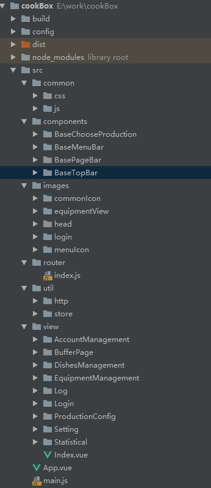

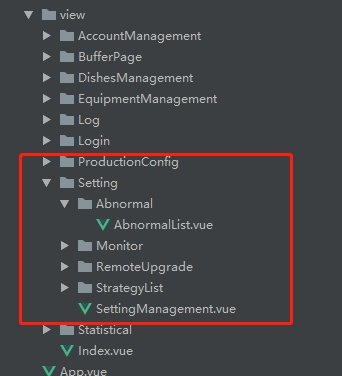

## 五、Vue项目包优化

### **1.** **路由懒加载**

当打包构建时，若按照图5.1.2及图5.1.3配置路由（方法一），将造成打包后 Javascript 包臃肿，形成一个较大js文件，直接影响加载速度。

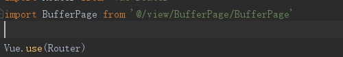

图5.1.2

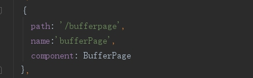

图5.1.3

若按照图5.1.1方式配置路由（方法二），打包时会将方法一打包出的较大js文件会按照对应组件分割成不同的代码块，页面加载时会根据当前路由来加载指定js。

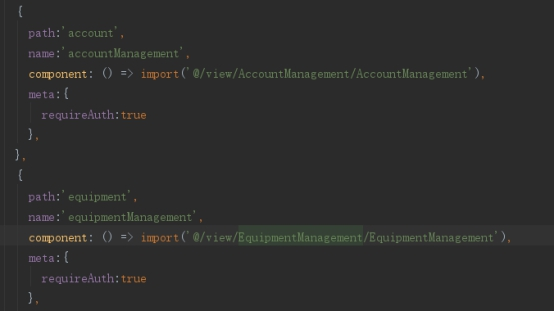

图5.1.1

### **2.** **css** ？？？？？？？？？

webpack  [ExtractTextWebpackPlugin](https://www.webpackjs.com/plugins/extract-text-webpack-plugin/)

修改build文件夹下 webpack.prod.conf.js 中的 allChunks ，将默认的true改为false

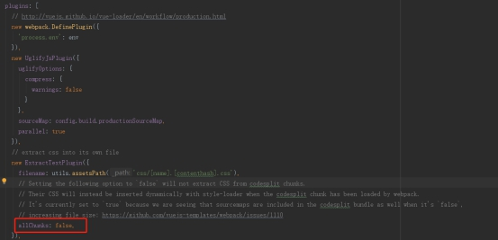

### **3.** **不生成.map文件**

默认的项目打包，生成css文件的同时，会生成一个名字相同的.map文件。.map文件的作用是开发过程中调试代码，在生产环境中，是不需要这个.map文件的。修改config文件夹下的index.js中的productionSourceMap属性默认值true为false


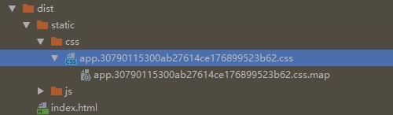

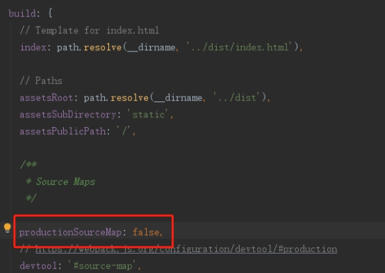

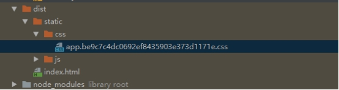

### **4.** **框架的按需引入**

Vue打包时会将框架代码打包为vendor.js文件。若整体引入框架（以elementui及v-charts为例，图5.4.1、图5.4.3），打包时，webpack会将所有框架资源打包到vendor.js，这样将会造成vendor.js过大，影响加载速度并浪费资源。所以，在引入框架的时候，要尽量的按需引入（图5.4.2、图5.4.4），减小vendor.js，节省资源，提升加载速度

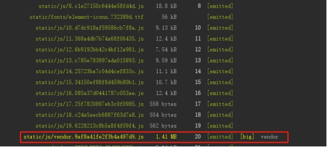

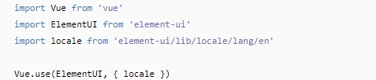

图5.4.1

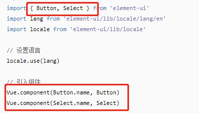

图5.4.2

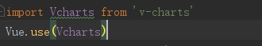

图5.4.3


图5.4.4

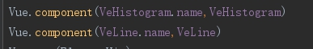

图5.4.5

### **5.** **进行gzip压缩**

将config下的index.js中的productionGzip属性置为true即可开启gzip压缩。Webpack压缩时，基本上能压缩50%以上，启用gzip压缩还能在此基础上再次压缩50%以上。提升页面加载速度。

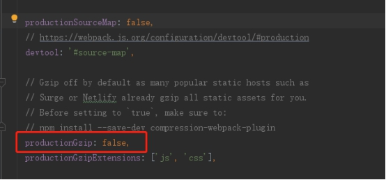

## 六、Vue实例选项顺序

Vue官网文档中也有推荐[顺序](https://cn.vuejs.org/v2/style-guide/index.html#组件-实例的选项的顺序-推荐),文档中对选项顺序做了许多分类。但从工程项目角度思考，需要更加精简以及合理的排序。推荐如下规则进行排序：

1. Vue扩展: extends, mixins, components
2. Vue数据: props, model, data, computed, watch
3. Vue资源: filters, directives
4. Vue生命周期: created, mounted, destroy...
5. Vue方法: methods

以下推荐顺序，基于团队小伙伴@akimoto整理的顺序：

```js
export default {
    name: '',
    /*1. Vue扩展 */
    extends: '', // extends和mixins都扩展逻辑，需要重点放前面
    mixins: [],   
    components: {},
    /* 2. Vue数据 */
    props: {},
    model: { prop: '', event: '' }, // model 会使用到 props
    data () {
        return {}
    },
    computed: {},
    watch:{}, // watch 监控的是 props 和 data，有必要时监控computed
    /* 3. Vue资源 */
    filters: {},
    directives: {},
    /* 4. Vue生命周期 */
    created () {},
    mounted () {},
    destroy () {},
    /* 5. Vue方法 */
    methods: {}, // all the methods should be put here in the last
}
```

## 七、组件设计风格

### 要求 Element 元素统一使用El后缀

```js
// ✗ bad
const elem = this.$el;
const element = e.target;
const input = this.$refs.input

// ✓ good
const el = this.$el;
const el = e.target;
const inputEl = this.$refs.input;
 Copied!
```

### 要求 Vue 实例统一使用VM后缀

```js
// ✗ bad
const instance = this;
const form = this.$refs.form;
this.$emit('select', {
    item,
});

// ✓ good
const vm = this;
const formVM = this.$refs.form;
this.$emit('select', {
    item,
    itemVM: selectedVM,
});
 Copied!
```

### 被动接收事件方法使用on前缀

```js
// ✗ bad
{
    methods: {
        input() {
            // ...
        },
        handleValidate() {
            // ...
        },
    },
}

// ✓ good
{
    methods: {
        onInput() {
            // ...
        },
        onValidate() {
            // ...
        },
    },
}
```

### slot 只在对应名称的 class 内设置

```js
// ✗ bad
<slot name="head">
    <div :class="$style.head">
            <slot name="title">
                <div :class="$style.title">
                    {{ title }}
                </div>
            </slot>
            <div :class="$style.close"></div>
    </div>
</slot>

// ✓ good
<div :class="$style.head">
    <slot name="head">
        <div :class="$style.title">
            <slot name="title">{{ title }}</slot>
        </div>
        <div :class="$style.close"></div>
    </slot>
</div>
```

### 变量命名

- 常见状态：default, primary, info, success, warning, error, disabled, muted, ...
- 大小分级：mini, small, base, large, huge, ...
- 颜色分级：darkest, darker, dark, base, light, lighter, lightest, ...

## 八、推荐-Vue-Router写法

使用路由懒加载，实现方式是结合Vue异步组件和Webpack代码分割功能。

优点：

- 减小包体积，提高加载速度
- 当页面>20个时，组件定义需要拉到编辑器顶部才知道具体路径

### bad

```js
import IntentionList from '@/pages/intention/list'
import Variable from '@/pages/variable'
...

{
    path: '/intention/list',
    name: 'ilist',
    component: IntentionList
},
{
    path: '/variable',
    name: 'variable',
    component: Variable
}
 Copied!
```

### good

```js
{
    path: '/intention/list',
    name: 'ilist',
    component: () => import('@/pages/intention/list')
},
{
    path: '/variable',
    name: 'variable',
    component: () => import('@/pages/variable')
}
 Copied!
```

> import语法需要Babel添加`syntax-dynamic-import`插件。最新当vue-cli 3.0中默认添加该特性，不需要额外引用。另外，合理控制异步模块的数量。

## 推荐-Vue项目目录结构

目录结构保持一致，使得多人合作容易理解与管理，提高工作效率。[Vue标准项目](https://github.com/lq782655835/standard-vue-project)

## [#](https://lq782655835.github.io/blogs/team-standard/recommend-vue-project-structure.html#简要说明)简要说明

- `main.js`主入口，`router.js`路由划分
- `plugins` 自己或第三方插件,包括但不限于components、directives、filters、third lib
- `pages` 所有路由页面。原则：轻page，重component
- `components` 所有组件。包括原子组件、业务公用组件、页面独有组件
- `server` api引入入口
- `assets` sass、图片资源入口，不常修改数据
- `utils` 工具文件夹
- `store` 标准vuex格式，非必须

## [#](https://lq782655835.github.io/blogs/team-standard/recommend-vue-project-structure.html#详细说明)详细说明

```css
project
└───src
│   │   app.vue    // 主页面
│   │   main.js    // 主入口
|   |   router.js  // 所有路由
│   │
│   |____assets    // css、image、svg等资源
│   |   |____css   // 所有sass资源
|   |   |    |  reset.scss       // 兼容各浏览器
|   |   |    |  global.scss      // 全局css
|   |   |    |  variable.scss    // sass变量和function等
│   |   |____img   // image图标库
|   |   |____svg   // svg图标库
|   |
|   |____components    // 组件
│   |   |____common    // common自注册组件
│   |        |____base // 原子组件(如果是引入第三方，该文件夹可省略)
│   |        |   ...   // 业务公用组件
│   |   |____entity    // entity页面组件
│   |   |____about     // about页面组件
|   |
|   |____pages     // UI层(原则：轻page，重component)
|   |   |____entity
|   |   |    |  list.vue      // 列表页
|   |   |    |  create.vue    // 新增页
|   |   |    |  edit.vue      // 修改页
|   |   | main.vue
|   |
|   |____plugins   // 自己或第三方插件
|   |   | index.js       // 插件入口文件
|   |   | directives.js  // 所有Vue指令
|   |   | filters.js  // 所有Vue过滤
|   |
|   |____server    // 接口层
|   |   | index.js   // 所有接口
|   |   | http.js  // axios二次封装
|   |
|   |____store     // vuex数据
|   |   | index.js
|   |
|   |____utils     // 工具层
|   |   | config.js// 配置文件，包括常量配置
|
└───public         // 公用文件，不经过webpack处理
│   │   favicon.ico
│   │   index.html
│   vue.config.js  // vue-cli3主配置
│   babel.config.js// babel配置
│   .eslintrc.js   // eslint配置
│   .prettierrc.js // perttier配置
│   package.json   // npm配置
│   README.md      // 项目说明
 
```