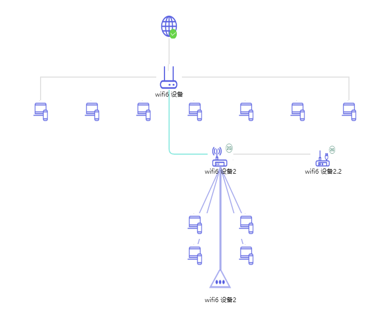

[Antv-G6](https://g6.antv.vision/zh)

# Antv-G6

## 简单入门

```js
import G6 from "@antv/g6"
// import vueImage from "../assets/logo.png"
// import vueImage2 from "../assets/wifi6 图标 (选中).png"
import img1 from "../assets/img1.png"
import img2 from "../assets/img2.png"
import img3 from "../assets/img3.png"
import wifi from "../assets/wifi.png"
import wifi2 from "../assets/wifi2.png"
import footer from "../assets/footer.png"


const data = {
    // 点集
    nodes: [
        {
            id: 'image',
            img: img1,
            size: 50,
            x: 250,
            y: 0,
        },
        {
            id: 'image2',
            shape: 'image',
            img: img2,
            size: 50,
            x: 250,
            y: 100,
            anchorPoints: [
                [0.5, 0],
                [0, 0.5],
                [0.5, 1],
                [1, 0.5]
            ],
            label: 'wifi6 设备'
        },
        // 设备 2 下级分组
        {
            id: 'image2-1',
            shape: 'image',
            img: img3,
            // 该节点可选的连接点集合，该点有两个可选的连接点
            anchorPoints: [
                [0.5, 0],
            ],
            size: 50,
            x: 0,
            y: 170,
        },
        {
            id: 'image2-2',
            shape: 'image',
            img: img3,
            size: 50,
            x: 100,
            y: 170,
        },
        {
            id: 'image2-3',
            shape: 'image',
            img: img3,
            size: 50,
            x: 200,
            y: 170,
        },
        {
            id: 'image2-4',
            shape: 'image',
            img: img3,
            size: 50,
            x: 300,
            y: 170,
        },
        {
            id: 'image2-5',
            shape: 'image',
            img: img3,
            size: 50,
            x: 400,
            y: 170,
        },
        {
            id: 'image2-6',
            shape: 'image',
            img: img3,
            size: 50,
            x: 500,
            y: 170,
        },
        {
            id: 'image2-7',
            shape: 'image',
            img: img3,
            size: 50,
            x: 600,
            y: 170,
            // 该节点可选的连接点集合，该点有两个可选的连接点
            anchorPoints: [
                [0.5, 0],
            ],
        },
        // wifi2 族群
        {
            id: 'wifi2',
            shape: 'image',
            img: wifi,
            size: 50,
            x: 350,
            y: 250,
            label: 'wifi6 设备2',
            // 该节点可选的连接点集合，该点有两个可选的连接点
            anchorPoints: [
                [0, 0.5],
                [0.5, 1],
                [1, 0.5],
            ],
            conf: [
                {
                    label: 'IP：',
                    value: '192.168.1.1',
                },
                {
                    label: '连接状态',
                    value: '已连接',
                },
                {
                    label: '时长',
                    value: 'xxxx小时',
                },
            ],
        },
        {
            id: 'wifi2-1',
            shape: 'image',
            img: img3,
            size: 50,
            x: 300,
            y: 390,
        },
        {
            id: 'wifi2-2',
            shape: 'image',
            img: img3,
            size: 50,
            x: 400,
            y: 390,
        },
        {
            id: 'wifi2-3',
            shape: 'image',
            img: img3,
            size: 50,
            x: 300,
            y: 450,
        },
        {
            id: 'wifi2-4',
            shape: 'image',
            img: img3,
            size: 50,
            x: 400,
            y: 450,
        },
        // wifi2 尾部
        {
            id: 'footer2',
            shape: 'image',
            img: footer,
            size: 50,
            x: 350,
            y: 500,
            label: 'wifi6 设备2',
            // 该节点可选的连接点集合，该点有两个可选的连接点
            anchorPoints: [
                [0.5, 0],
            ],
        },
        {
            id: 'wifi3',
            shape: 'image',
            img: wifi2,
            size: 50,
            x: 550,
            y: 250,
            label: 'wifi6 设备2.2',
            // 该节点可选的连接点集合，该点有两个可选的连接点
            anchorPoints: [
                [0, 0.5],
            ],
        },

    ],
    edges: [
        // 表示一条从 node1 节点连接到 node2 节点的边
        {
            source: 'image', // 起始点 id
            target: 'image2', // 目标点 id
            //   label: '我是连线', // 边的文本
        },
        {
            source: 'image2', // 起始点 id
            target: 'image2-1', // 目标点 id
            //   label: '我是连线', // 边的文本
            type: 'polyline'
        },
        {
            source: 'image2', // 起始点 id
            target: 'image2-7', // 目标点 id
            //   label: '我是连线', // 边的文本
            type: 'polyline'
        },
        // wifi2
        {
            source: 'image2', // 起始点 id
            target: 'wifi2', // 目标点 id
            //   label: '我是连线', // 边的文本
            type: 'polyline',
            style: {
                offset: 20,  // 拐弯处距离节点最小距离
                radius: 10,  // 拐弯处的圆角弧度，若不设置则为直角
                lineWidth: 2,
                stroke: '#87e8de'
              },
        },
        {
            source: 'wifi2', // 起始点 id
            target: 'footer2', // 目标点 id
            //   label: '我是连线', // 边的文本
            //   type: 'polyline'
            style: {
                stroke: '#abafee',
                lineWidth: 4,
                // ... 其他样式属性
            },
        },
        {
            source: 'wifi2', // 起始点 id
            target: 'wifi2-1', // 目标点 id
            //   label: '我是连线', // 边的文本
            //   type: 'polyline'
            style: {
                stroke: '#abafee',
                lineWidth: 2,
                // ... 其他样式属性
            },
        },
        {
            source: 'wifi2', // 起始点 id
            target: 'wifi2-3', // 目标点 id
            //   label: '我是连线', // 边的文本
            //   type: 'polyline'
            style: {
                stroke: '#abafee',
                lineWidth: 2,
                // ... 其他样式属性
            },
        },
        {
            source: 'wifi2', // 起始点 id
            target: 'wifi2-4', // 目标点 id
            //   label: '我是连线', // 边的文本
            //   type: 'polyline'
            style: {
                stroke: '#abafee',
                lineWidth: 2,
                // ... 其他样式属性
            },
        },
        {
            source: 'wifi2', // 起始点 id
            target: 'wifi2-2', // 目标点 id
            //   label: '我是连线', // 边的文本
            //   type: 'polyline'
            style: {
                stroke: '#abafee',
                lineWidth: 2,
                // ... 其他样式属性
            },
        },
        // wifi2-->wifi3
        {
            source: 'wifi2', // 起始点 id
            target: 'wifi3', // 目标点 id
            //   label: '我是连线', // 边的文本
            //   type: 'polyline'
        },
    ],
};

const width = 800;
const height = 1000;

export default function () {
    const graph = new G6.Graph({
        container: 'mountNode',
        width,
        height,
        // translate the graph to align the canvas's center, support by v3.5.1
        fitCenter: true,
        // 默认节点
        defaultNode: {
            type: 'image',
            //   size: [260, 200],
        },
        defaultEdge: {
            // ... 其他属性
            style: {
                //   stroke: '#eaff8f',
                lineWidth: 2,
                // ... 其他样式属性
            },
        },
        modes: {
            default: [
                'drag-combo', // 拖动
                'drag-canvas', // 未知
                'zoom-canvas', // 未知
                // 点击事件
                //   'click-select', 
                // 节点文本提示
                {
                    type: 'tooltip',
                    formatText(model) {
                        const cfg = model.conf;
                          console.log(cfg);
                        return `${cfg[0].label} ${cfg[0].value} <br/>
                  ${cfg[1].label} ${cfg[1].value}
                  <br/>
                  ${cfg[2].label} ${cfg[2].value}
                  `;
                    },
                    offset: 30,
                },
            ],
        },
    });

    graph.data(data);
    graph.render();
}
```

效果图：



