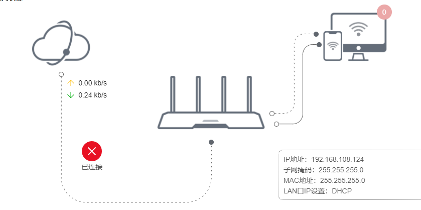

[canvas 设置拐角类型、裁切、曲线、转换等](https://blog.csdn.net/u010081689/article/details/50508920)

# Canvas 基础使用

## 基本使用

- 创建

  ```html
  <canvas id="myCanvas" width="500" height="300"></canvas>
  ```

- 初始化

  ```js
  let canvas = document.getElementById('canvasDraw');
  let ctx = canvas.getContext('2d');
  canvas.width = window.innerWidth;
  canvas.height = window.innerHeight;
  ```

## 拐角直线



- 步骤：
  - 1. 获取点的坐标（x, y）
  - 2. 定义新路径（`beginPath()`）
  - 3. 确定起始点坐标
  - 4. 再定一个点进行连线
  - 5. 在两条线段之间进行弧线拐角（y 轴拐角，y 不变，变 x；x 轴拐角，x 轴不变，变 y）
  - 6. ctx.stroke();  绘制

```js
drawDevicesLine(ctx) {
      // 左 ——> 中
      let leftStartX = this.$refs.networkPoint.getBoundingClientRect().x + 5;
      let leftStartY = this.$refs.networkPoint.getBoundingClientRect().y + 10;
      let leftEndX = this.$refs.wifiPoint.getBoundingClientRect().x + 5;
      let leftEndY = this.$refs.wifiPoint.getBoundingClientRect().y;
      
      // 虚线
      ctx.setLineDash([3,5]);

      // 第一条线
      ctx.beginPath();
      ctx.strokeStyle="#666";
      ctx.moveTo(leftStartX,leftStartY);           // 创建开始点
      ctx.lineTo(leftStartX, leftEndY + 75);          // 创建垂直线
      ctx.arcTo(leftStartX, leftEndY + 125, leftEndX - 50, leftEndY + 125, 50); // 创建弧
      ctx.lineTo(leftEndX - 50, leftEndY + 125);          // 创建水平
      ctx.arcTo(leftEndX, leftEndY + 125, leftEndX, leftEndY + 75, 50); // 创建弧
      ctx.lineTo(leftEndX, leftEndY);         // 创建水平线
      ctx.stroke();  

      // 中上 ——> 右上
      let rightTStartX = this.$refs.wifiPointRT.getBoundingClientRect().x + 10;
      let rightTStartY = this.$refs.wifiPointRT.getBoundingClientRect().y + 5;
      let rightTEndX = this.$refs.clientPointLT.getBoundingClientRect().x;
      let rightTEndY = this.$refs.clientPointLT.getBoundingClientRect().y + 5;
      let TMiddleX = (rightTEndX - rightTStartX) / 2;


      ctx.beginPath();
      ctx.strokeStyle="#666";
      ctx.moveTo(rightTStartX,rightTStartY);           // 创建开始点
      ctx.lineTo(rightTStartX + TMiddleX - 20, rightTStartY);          // 创建水平线
      ctx.arcTo(rightTStartX + TMiddleX, rightTStartY, rightTStartX + TMiddleX, rightTEndY - 20, 20); // 创建弧
      ctx.lineTo(rightTStartX + TMiddleX, rightTEndY + 20);         // 创建垂直线
      ctx.arcTo(rightTStartX + TMiddleX, rightTEndY, rightTStartX + TMiddleX + 20, rightTEndY, 20); // 创建弧
      ctx.lineTo(rightTEndX, rightTEndY);          // 创建水平线
      ctx.stroke(); 

      ctx.setLineDash([0,0]);
      // 中下 ——> 右下
      let rightBStartX = this.$refs.wifiPointRB.getBoundingClientRect().x + 10;
      let rightBStartY = this.$refs.wifiPointRB.getBoundingClientRect().y + 5;
      let rightBEndX = this.$refs.clientPointLB.getBoundingClientRect().x;
      let rightBEndY = this.$refs.clientPointLB.getBoundingClientRect().y + 5;
      let BMiddleX = (rightBEndX - rightBStartX) / 2 + 10;

      // 第一条线
      ctx.beginPath();
      ctx.strokeStyle="#666";
      ctx.moveTo(rightBStartX,rightBStartY);           // 创建开始点
      ctx.lineTo(rightBStartX + BMiddleX - 20, rightBStartY);          // 创建水平线
      ctx.arcTo(rightBStartX + BMiddleX, rightBStartY, rightBStartX + BMiddleX, rightBEndY - 20, 20); // 创建弧
      ctx.lineTo(rightBStartX + BMiddleX, rightBEndY + 20);         // 创建垂直线
      ctx.arcTo(rightBStartX + BMiddleX, rightBEndY, rightBStartX + BMiddleX + 20, rightBEndY, 20); // 创建弧
      ctx.lineTo(rightBEndX, rightBEndY);          // 创建水平线
      
      ctx.stroke(); 


    },
```

arcTo() 方法

| 参数 | 描述              |
| :--- | :---------------- |
| x1   | 弧的起点的 x 坐标 |
| y1   | 弧的起点的 y 坐标 |
| x2   | 弧的终点的 x 坐标 |
| y2   | 弧的终点的 y 坐标 |
| r    | 弧的半径          |