# Webpack

[彻底解决新手对webpack的恐惧！](https://juejin.cn/post/6953042611963691021)

## 概念

​		webpack 是一个现代 JavaScript 应用程序的**静态模块打包器**。

​		最初的工程可没有这样的打包工具，一个文件就相当于一个模块，最终这些文件需要按照一定的顺序使用 `script` 标签引入 `html`（因为如果顺序不对就会导致依赖变量丢失等错误问题）。但是这个写项目不仅麻烦而且不优雅，随着 `node.js` 的出现和发展，才出现了这类基于 `node.js` 运行的打包工具（`gulp、grunt`，以及现在最流行的 webpack），因为 **node.js  拥有可对文件操作的能力**。所以 **webpack 本质就是为我们打包 js 的引用**，而我们常听到各种 `loader`、各种 `plugin`、热更新、热模块替换等等都是 webpack 的一个升华，使得 webpack 能为我们提供更多的帮助。

- **loader**：webpack 本身只能打包 `js、json` 格式的文件，但实际项目中我们还会有 `css、scss、png、ts` 等其他文件，这时候就需要使用 loader 来让它正确打包。

  - **总结：loader 是处理编译 js 和 json 以外的文件时使用的。**

  - 常见的 loader：

    ```
    style-loader
    css-loader
    sass-loader
    ts-loader
    file-loader
    babel-loader
    postcss-loader
    ```

- **plugin**：plugin 可以在 webpack 运行到某个阶段时，帮你做一些事情，类似 `react/vue` 中的生命周期。具体的某个插件（plugin）就是在 webpack 构建过程中的特定时机注入扩展逻辑来改变构建结果，作用于整个构建过程。

## 相关知识

- **postcss**：postcss 是一个用 JavaScript 工具和插件转换 CSS 代码的工具。可以把他理解成  babel ，他本身作用不大，很多具体需求的实现都需要他的插件来完成，它本身更像一个平台。例如，项目中需要 webpack 自动的帮我们为 css 样式加上兼容性的前缀，实际帮我们加上前缀的插件是 [`autoprefixer`](https://link.juejin.cn/?target=https%3A%2F%2Fgithub.com%2Fpostcss%2Fautoprefixer)，但它能为我们加前缀的前提是我们有 postcss 。**！！千万不要把 postcss 误解成 scss、less 替代品**
  - 对于 “PostCSS” 一词，可以替代地指两件事：
    1. 该工具本身就是 [PostCSS](https://link.juejin.cn/?target=https%3A%2F%2Fgithub.com%2Fpostcss%2Fpostcss)（运行时会得到什么）`npm install postcss`，以及
    2. 该工具支持的 [PostCSS插件生态系统](https://link.juejin.cn/?target=https%3A%2F%2Fgithub.com%2Fpostcss%2Fpostcss%23plugins)
- **balel**：babel 是一个 JavaScript 编译器，它可以让我们不再考虑兼容性，尽情的使用下一代的 JavaScript 语法编程。但是要实现具体的语法转换，我们还是要使用它的 [插件](https://link.juejin.cn/?target=https%3A%2F%2Fwww.babeljs.cn%2Fdocs%2Fplugins) 才能实现
  - 在 babel7 后为我们提供了[预设](https://link.juejin.cn/?target=https%3A%2F%2Fwww.babeljs.cn%2Fdocs%2Fpresets)，可以让我们不再自己麻烦的对插件进行组合，想在什么环境运行就写什么预设即可（相当于每个预设选项中都帮你组合好了这个环境中需要用到的插件）
- **es6+ 语法**：babel 默认会转换语法，例如：let、const、() => {}、class
- **es6+ 特性**：babel 不会转换默认特性，特性需要 js 垫片来兼容低版本的浏览器。例如：`Iterator、Generator、Set、Map、Proxy、Reflect、Symbol、Promise`
- **@babel/core**：@babel/core 是 babel 的核心库，所有的核心 api 都在这个库中，这些 api 可供 babel-loader 调用
- **@babel/preset-env**：这是一个预设的插件集合，包含了一组相关的插件，Babel 中是通过各种插件来指导如何进行代码转换。该插件包含所有 es6 转化为 es5 的翻译规则
- **@babel/polyfill**：@babel/preset-env 只是提供了语法转换的规则，但是它并不能弥补浏览器缺失的一些新的功能，如一些内置的方法和对象，如 Promise、Array.from 等，此时就需要 polyfill 来做 js 的垫片，弥补低版本浏览器缺失的这些新功能。**注意：Babel 7.4.0 该包将被遗弃**
- **core-js**：它是 JavaScript 标准库的 polyfill，而且它可以实现按需加载。使用 @babel/preset-env 的时候可以配置 core-js 的版本和 core-js 的引入方式。**注意：@babel/polyfill 依赖 core.-js**
- **regenerator-runtime**：提供 generator 函数的转码

### 补充知识点（重要）

- **browserlist**：browserslist 实际上就是声明了一段浏览器的合集，我们的工具可以根据这个合集描述，针对性的输出兼容性代码，browserslist 应用于 babel、postcss 等工具当中。

  - browserslist 可以在 package.json 文件配置，也可以单出写一个 .browserslistrc 文件进行配置

  - 工具会自动查找 .browserslistrc 中的配置，如果没有发现 .browserslistrc 文件，则会去 package.json 中查找

  - 例子：

    ```json
    // 在 .browserslistrc 中的写法
    > 1%
    last 2 versions
    
    // 还可以配置不同环境的下的规则（在 .browserslistrc 中）
    [production]
    > 1%
    ie 10
    
    [development]
    last 1 chrome version
    last 1 firefox version
    
    // 在 packpage.json 中的写法
    {
        "browserslist": ["> 1%", "last 2 versions"]
    }
    
    // 还可以配置不同环境下的规则（在 package.json 中）
    // production 和 development 取决你 webpack 中 mode 字段的配置
    {
        "browserslist": {
            "production": [
                ">0.2%",
                "not dead",
                "not op_mini all"
            ],
            "development": [
                "last 1 chrome version",
                "last 1 firefox version",
                "last 1 safari version"
            ]
        } 
    }
    ```

    注："> 1%" 表示兼容市面上使用量大于百分之一的浏览，"last 1 chrome version" 表示兼容到谷歌的上一版本，具体的可以使用命令 `npx browserslist "> 1%"` 的方式查看都包含了哪些浏览器，

    [browserslist的github地址](https://link.juejin.cn/?target=https%3A%2F%2Fgithub.com%2Fbrowserslist%2Fbrowserslist)

- **chunk**：它不是库也不是插件，它就是一个名词，顾名思义就是代码块。明白它以后自然就能理解 webpack 中配置一些参数的意思了

- **chunks**：一个 chunks 至少包含一个 chunk，chunks 是多个 chunk 的合集

  ```js
// index.js
  import { a } from 'a.js';
  console.log('我是 index 文件');
  
  // a.js
  const a = '我是 a 文件';
  export { a }
  ```
  
  上面代码来说，a.js 就是 chunk，而 index.js 就是 chunks
  
  在 webpack 构建中，入口是 chunks，出口是 chunk（知道这个概念就行）
  
  
  
# 搭建 webpack 项目

## 初始化项目

- 新建一个文件夹
  
    ```shell
    mkdir learnWebpack
    复制代码
    ```
  
- 进入到文件夹中
  
    ```shell
    cd learnWebpack/
    复制代码
    ```
  
- 初始化package.json文件
  
    ```shell
    # 可以输入配置
    npm init
    
    # 默认配置创建
    npm init -y
    
    # 是用npm init -y后得到的内容
    {
      "name": "learnwebpack",
      "version": "1.0.0",
      "description": "",
      "main": "index.js",
      "scripts": {
        "test": "echo \"Error: no test specified\" && exit 1"
      },
      "author": "",
      "license": "ISC"
    }
    ```

##   安装

- 安装 webpack、webpack-cli 依赖
  
    ```shell
    # 我更喜欢yarn，当然你也可以使用npm
    yarn add webpack@4.44.2 webpack-cli@3.3.12 -D
    ```

## 创建目录

- 根目录下创建 src、src 下创建 index.js

- 在 index.js 中添加一段代码:

  ```js
  console.log('hello webpack');
  ```
  
- 在 package.json 文件中的 scripts 字段中添加`"start": "webpack"`

  ```json
  "scripts": {
      "test": "echo \"Error: no test specified\" && exit 1",
      "start": "webpack"
  }
  ```
  
- 在命令行中执行`yarn start`，我们会发现编译成功，但有个警告！在 webpack 自动在根目录下创建了一个dist文件夹和dist文件夹中的 main.js 文件

  - 关于警告：ARNING in configuration The 'mode' option has not been set, webpack will fallback to 'production' for this value. Set 'mode' option to 'development' or 'production' to enable defaults for each environment. You can also set it to 'none' to disable any default behavior. Learn more: [webpack.js.org/configurati…](https://link.juejin.cn?target=https%3A%2F%2Fwebpack.js.org%2Fconfiguration%2Fmode%2F); 警告中已经说的很清楚了，我们没有设置mode字段。我们只需在 webpack 的配置中配置 mode 字段即可消除该警告

  - 关于 dist 文件夹和 main.js 文件 ：这是 webpack4 当初宣传的零配置使用。很显然我们这里什么都没配置，就帮我们成功打包了一个 src 下的代码。该功能实际上是 webpack 默认帮我们配置了一套简单的打包配置，让我们看看 webpack 默认为我们配置了什么：

    ```js
    const path = require('path')
    module.exports = {
      extry: './src/index.js',
      output: {
        filename: 'main.js',
        path: path.resolve(__dirname, './dist') 
      }
    }
    ```
    
- 注意：这份默认配置是不是太过简单了。看了这个配置后，我想你也知道为什么当我们创建的不是src或者src下不是index.js时候无法使用零配置功能的原因了

## webpack的零配置

上面我们看到了，零配置很弱，真正的项目中他完全不可能满足我们的需求

我们想要自定义配置webpack的话，需要在根目录上创建一个`webpack.config.js`的文件，这个文件的内容可以覆盖webpack的零配置

- 使用默认的配置文件：webpack.config.js

  ```shell
  # 使用webpack.config.js配置文件时，输入该命令即可启动webpack打包
  webpack
  复制代码
  ```

- 使用其他配置文件：如yzyConfig.js，可以通过`--config yzyConfig.js`来指定webpack使用哪个配置文件来执行构建

  ```shell
  # 通过--config来指定其他配置文件，并按照指定的配置文件的配置内容进行打包
  webpack --config yzyConfig.js
  ```

## webpack 配置核心概念

- **chunk**：指代码块，一个 chunk 可能由多个模块组合而成，也用与代码合并与分割（这里的合并分割主要指指纹策略的判断），指纹策略简单来说就是文件名后的 hash
- **bundle**：资源经过 webpack 流程解析编译后最终输出的成果文件（一个 .js 格式的文件，也就是我们的 output 文件）
- **entry**：文件打包的入口，webpack 会根据 entry 递归的去寻找依赖，每个依赖都将被它处理，最后打包到集合文件中
- **output**：配置打包输出的位置、文件名等
- **loader**：默认情况下，webpack 仅支持 js 和 json 文件，通过 loader，可以让它解析其他类型的文件。理论上只要有响应的 loader，webpack 可以处理任何类型的文件
- **plugin**：loader 主要的职责是让 webpack 认识更多的文件类型，而 plugin 的职责则是让其可以控制构建流程，从而执行一些特殊的任务。插件的功能非常强大，可以完成各种各样的任务
- **mode**：目标环境，不用的目标环境会影响 webpack 打包时的决策
  - **production**：（生产环境）对代码进行压缩等一系列优化操作
  - **development**：有利于热更新的处理，识别哪个模块变化
  - **none**：什么都不做，打包时会有提示警告

# 配置 webpack.config.js

## 项目搭建目标

目标是以一些有代表性的功能作为切入点学习 webpack：

- 实现加载 css
- 实现 css 效果展示
- 实现 css 前缀自动补充
- 实现 css 以文件形式导出
- 实现自动生成 html 文件
- 实现打包清空 dist 文件夹
- 实现图片在 js 文件中引入
- 实现图片在 css 文件中引入
- 实现 webpack 本地服务
- 实现多页面打包

## 实现加载 css

我们已经知道 .css 文件无法正常被 webpack 打包进 bundle 文件，所以我们需要一个 lodaer 作为加载器将它正确打包进 bundle 文件

文件内容

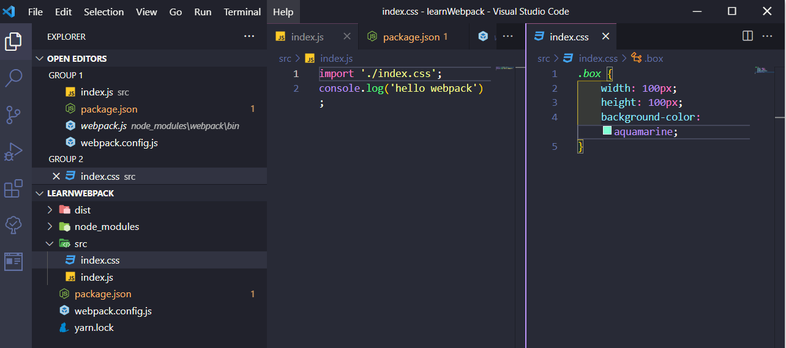

安装 css-loader

```shell
yarn add css-loader -D
```

配置 css-loader

```js
const path = require('path');
module.exports = {
    entry: './src/index.js',
    output: {
        filename: 'main.js',
        path: path.resolve(__dirname, './dist')
    },
    mode: 'development',
    module: {
        rules: [
            {
                test: /\.css$/,
                use: 'css-loader'
            }
        ]
    }
}
```

运行webpack命令，检查一下dist/main.js中是否包含了css文件中的内容

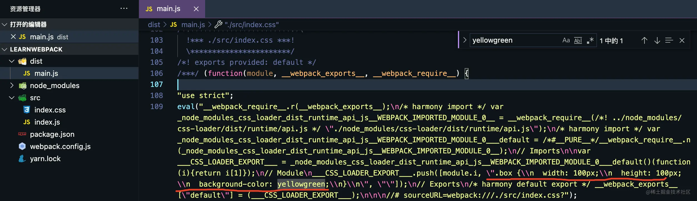

我们发现 css 文件的内容被成功打包了，这时如果你在dist文件夹下创建了一个 html 页面给div元素加上了box类，并引入 main.js 文件，你会发现完全看不到样式效果。

因为此时 css 中的内容只是被作为一段字符串引入了js中（相当于对css文件的内容进行了JSON.stringify ），所以你自然是看不到效果的。

想要看到效果要怎么办？当然是将css内容放进style标签啦！不过这步不需要我们做，因为我们有style-loader为我们做这件事情！

## 实现css效果展示

安装style-loader

```shell
yarn add style-loader -D
复制代码
```

配置 style-loader

```js
const path = require('path')
module.exports = {
  entry: './src/index.js',
  output: {
    filename: 'main.js',
    path: path.resolve(__dirname, './dist') 
  },
  mode: 'development',
  module: {
    rules: [
      {
        test: /\.css$/,
        use: ['style-loader', 'css-loader']
      }
    ]
  }
}
复制代码
```

这里需要注意的是，对同一种类型文件使用多个  loader 的时候，use 属性接收一个数组，并且**从右向左执行**。所以 style-loader 要写在 css-loader 前面

运行 webpack 命令，看一下结果

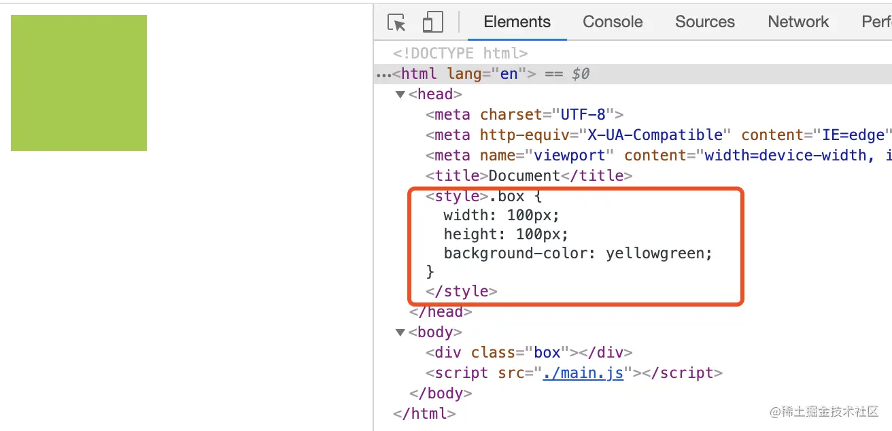

成功！

但是我们知道，css3在浏览器中会存在兼容性问题，我们可以通过给属性加上前缀来解决该问题。前端丰富的生态当然不会让你自己傻傻的做这件事情，我们可以通过autoprefixer这个插件帮我们完成

## 实现css前缀自动补充

已经知道autoprefixer是postcss工具的插件，所以我们需要安装postcss和postcss-loader

安装 postcss、postcss-loader、autoprefixer，**这里 postcss-loader 需要指定 4.x 的版本，因为 4.x 的版本和 webpack4 不会存在报错问题**

```shell
yarn add autoprefixer postcss-loader@4.2.0 postcss -D
```

配置 postcss-loader 和插件 autoprefixer

```js
const path = require('path')
module.exports = {
  entry: './src/index.js',
  output: {
    filename: 'main.js',
    path: path.resolve(__dirname, './dist') 
  },
  mode: 'development',
  module: {
    rules: [
      {
        test: /\.css$/,
        use: [
          'style-loader', 
          'css-loader', 
          {
            loader: 'postcss-loader',
            options: {
              postcssOptions: {
                plugins: [require('autoprefixer')]
              }
            }
          }
        ]
      }
    ]
  }
}
```

当 loader 需要写配置的时候，可以把 loader 写成一个对象，loader 属性就是要使用的 loader 名称，options 数据就是这个 loader 的配置对象。autoprefixer 是 postcss 的插件，所以 autoprefixer 的使用自然就要写在 postcss-loader 的配置中了

因为postcss有自己的配置文件，所以这里还可以写成这样：

```js
// webpack.config.js
const path = require('path')
module.exports = {
  entry: './src/index.js',
  output: {
    filename: 'main.js',
    path: path.resolve(__dirname, './dist') 
  },
  mode: 'development',
  module: {
    rules: [
      {
        test: /\.css$/,
        use: ['style-loader', 'css-loader', 'postcss-loader']
      }
    ]
  }
}

// 根目录下新建postcss.config.js文件
module.exports = {
  plugins: [require('autoprefixer')],
}
复制代码
```

这里我们需要配置一下browserslist，否则插件不知道按照什么样的规则进行前缀补全

```json
// 在package.json文件中添加
// 这里的意思表示目标浏览器为ie浏览器，并需要兼容到ie8以上
"browserslist": ["ie > 8"]
```

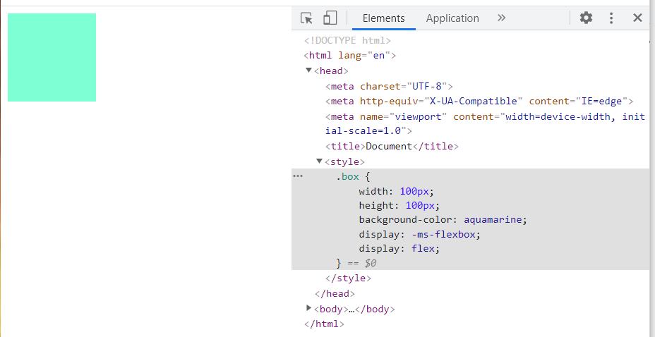

## 实现css以文件形式导出

随着项目的增大，我们不想把那么多的样式都放在 style 标签中，我们想用 link 标签引入，这时我们就需要使用[mini-css-extract-plugin](https://link.juejin.cn/?target=https%3A%2F%2Fwebpack.docschina.org%2Fplugins%2Fmini-css-extract-plugin%2F)

安装 mini-css-extract-plugin

```shell
yarn add mini-css-extract-plugin -D
```

配置 mini-css-extract-plugin 插件和它的 loader，这时候不需要 style-loader 了，我们要将 style-loader 替换成 MiniCssExtractPlugin.loader

```js
const path = require('path')
const MiniCssExtractPlugin = require('mini-css-extract-plugin')
module.exports = {
  entry: './src/index.js',
  output: {
    filename: 'main.js',
    path: path.resolve(__dirname, './dist') 
  },
  mode: 'development',
  module: {
    rules: [
      {
        test: /\.css$/,
        use: [
          MiniCssExtractPlugin.loader,
          'css-loader', 
          'postcss-loader'
        ]
      }
    ]
  },
  plugins: [
    new MiniCssExtractPlugin({
      filename: "css/[name].css"
    })
  ]
}
```

- MiniCssExtractPlugin 可以配置输出文件名
- [name] 为占位符，引入的时候是什么名字，导出的时候就是什么名字
- css／表示导出到 css 文件夹下

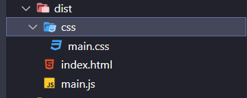

## 实现自动生成html文件

我们发现dist下的html是我们自己手动创建的，这显然不够优雅。[html-webpack-plugin](https://link.juejin.cn/?target=https%3A%2F%2Fwebpack.docschina.org%2Fplugins%2Fhtml-webpack-plugin%2F)帮你解决！

安装 html-webpack-plugin，这里也要制定一下4.x的版本

```shell
yarn add html-webpack-plugin@4.5.2 -D
```

配置 html-webpack-plugin

```js
const path = require('path');
const MiniCssExtractPlugin = require('mini-css-extract-plugin');
const HtmlWebpackPlugin = require('html-webpack-plugin');
module.exports = {
    entry: './src/index.js',
    output: {
        filename: 'main.js',
        path: path.resolve(__dirname, './dist')
    },
    mode: 'development',
    module: {
        rules: [
            {
                test: /\.css$/,
                use: [
                    MiniCssExtractPlugin.loader,
                    'css-loader', 'postcss-loader']
            }
        ]
    },
    plugins: [
        new MiniCssExtractPlugin({
            filename: "css/[name].css"
        }),
        new HtmlWebpackPlugin({
            template: './src/index.html'
        })
    ]
}
```

运行`webpack`命令看一下结果

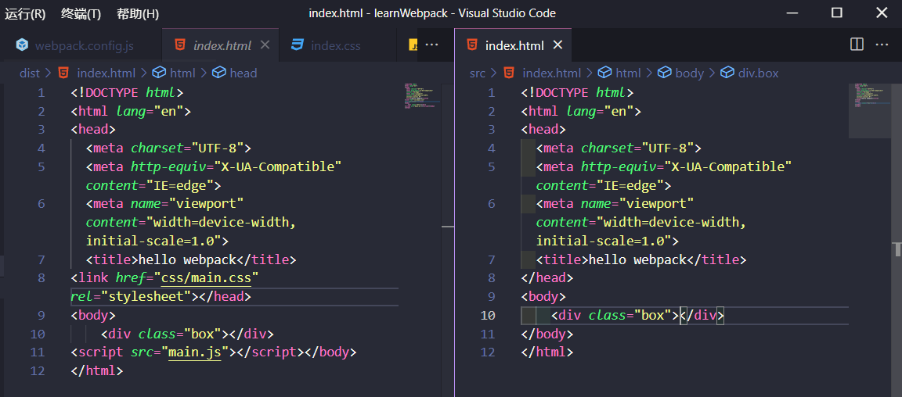

成功！很显然HtmlWebpackPlugin根据我们的模版为我们生成了新的html页面，并自动引入了dist包下的依赖。查看更多[HtmlWebpackPlugin配置](https://link.juejin.cn/?target=https%3A%2F%2Fgithub.com%2Fjantimon%2Fhtml-webpack-plugin%23options)

## 实现打包清空dist文件夹

我们会发现每次打包dist文件夹的内容会被覆盖，但是如果下次打包出来的文件名不同，那旧的打包文件还会存在，这是我们不想要的。[clean-webpack-plugin](https://link.juejin.cn?target=https%3A%2F%2Fwww.npmjs.com%2Fpackage%2Fclean-webpack-plugin)来帮我们解决这个问题

安装 clean-webpack-plugin

```js
yarn add clean-webpack-plugin -D
```

配置 clean-webpack-plugin

```js
const path = require('path');
const MiniCssExtractPlugin = require('mini-css-extract-plugin');
const HtmlWebpackPlugin = require('html-webpack-plugin');
const { CleanWebpackPlugin } = require('clean-webpack-plugin');
module.exports = {
    entry: './src/index.js',
    output: {
        filename: 'main.js',
        path: path.resolve(__dirname, './dist')
    },
    mode: 'development',
    module: {
        rules: [
            {
                test: /\.css$/,
                use: [
                    MiniCssExtractPlugin.loader,
                    'css-loader', 'postcss-loader']
            }
        ]
    },
    plugins: [
        new MiniCssExtractPlugin({
            filename: "css/[name].css"
        }),
        new HtmlWebpackPlugin({
            template: './src/index.html'
        }),
        new CleanWebpackPlugin()
    ]
}
```

这时，你也在dist文件夹下随意建一个其他文件，运行`webpack`命令看一下结果，你会发现你随意建的文件不在了。验证了这一点，就说明你成功了

## 实现图片在js文件中引入

实现这个功能我们使用 url-loader，当然你也可以使用 file-loader。url-loader 是 file-loader 的升级版，它内部也依赖了 file-loader。**file-loader和url-loader在 webpack5 后都被废弃了，使用 asset modules 代替**

安装 url-loader 和 file-loader

```shell
yarn add url-loader file-loader -D
```

**你可以会疑问为什么要装 file-loader，因为url-loader依赖file-loader。若不装，当 url-loader 将图片转换为 base64 导入 bundle 时不会存在问题，但直接输出图片到 dist 文件夹下就会报错，告诉你缺少 file-loader**

配置 url-loader

```js
const path = require('path');
const MiniCssExtractPlugin = require('mini-css-extract-plugin');
const HtmlWebpackPlugin = require('html-webpack-plugin');
const { CleanWebpackPlugin } = require('clean-webpack-plugin');
module.exports = {
    entry: './src/index.js',
    output: {
        filename: 'main.js',
        path: path.resolve(__dirname, './dist')
    },
    mode: 'development',
    module: {
        rules: [
            {
                test: /\.css$/,
                use: [
                    MiniCssExtractPlugin.loader,
                    'css-loader', 'postcss-loader']
            },
            {
                test: /\.(png|jpe?g|gif)$/,
                use: {
                    loader: 'url-loader',
                    options: {
                        name: '[name].[ext]',
                        limit: 1024 * 3
                    }
                }
            }
        ]
    },
    plugins: [
        new MiniCssExtractPlugin({
            filename: "css/[name].css"
        }),
        new HtmlWebpackPlugin({
            template: './src/index.html'
        }),
        new CleanWebpackPlugin()
    ]
}
```

- [ext] 表示导入时是什么格式，导出时就是什么格式
- limit 表示图片大小的阙值，超过阙值的图片回被原封不动的放置到打包文件夹下（file-loader 做的这件事，在 js 中引入时会帮你生成一个地址，即打包后对应的访问地址），没有超过会处理成 base64 放在 bundle 文件中

在入口文件中引入图片

```js
import './index.css'
import test from './assets/images/test.jpg'
console.log(test) // test.jpeg
const img = document.createElement('img')
img.src = test
const BoxDiv = document.getElementsByClassName('box')
BoxDiv[0].appendChild(img)
```

## 实现图片在css文件中引入

在css中引入图片我们依旧使用url-loader，但需要对配置稍微进行修改

css代码

```css
.box {
    width: 100px;
    height: 100px;
    /* background-color: yellowgreen; */
    background-image: url('./assets/images/test.jpg');
    display: flex;
}
```

直接引用并打包，打包成功！打开 html 页面，发现看不到图片，因为地址不对。打包后 test 图片在dist文件夹下，而 index.css 的引用路径依旧是test.jpg，可 index.css 是在 css 文件夹下的，所以自然是无法引用到。那如何才能引用到呢？最简单的方法就是加上`/`，**但这里有坑（其实也不是坑，这是一个关于/images、./images、image三者有什么不同的知识点）**。补充：create-react-app 也是通过`/` 实现引用统一的

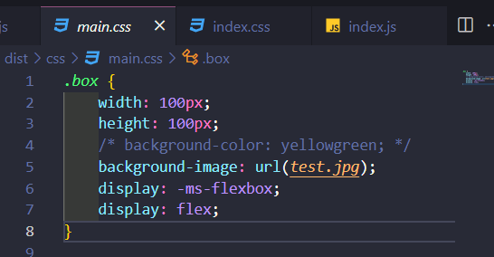

修改 url-loader 配置

```js
const path = require('path');
const MiniCssExtractPlugin = require('mini-css-extract-plugin');
const HtmlWebpackPlugin = require('html-webpack-plugin');
const { CleanWebpackPlugin } = require('clean-webpack-plugin');

module.exports = {
    entry: './src/index.js',
    output: {
        filename: 'main.js',
        path: path.resolve(__dirname, './dist')
    },
    mode: 'development',
    module: {
        rules: [
            {
                test: /\.css$/,
                use: [
                    MiniCssExtractPlugin.loader,
                    'css-loader', 'postcss-loader'
                ]
            },
            {
                test: /\.(png|jpe?g|gif)$/,
                use: {
                    loader: 'url-loader',
                    options: {
                        name: '[name].[ext]',
                        limit: 1024 * 3,
                        outputPath: "images/",
                        pubilcPath: "/images"
                    }
                }
            }
        ]
    },
    plugins: [
        new MiniCssExtractPlugin({
            filename: "css/[name].css"
        }),
        new HtmlWebpackPlugin({
            template: './src/index.html'
        }),
        new CleanWebpackPlugin()
    ]
}
```

- outputPath 表示输出的到哪里（file-loader 提供的）

- `name: images/[name].[ext]` 这样写和用 outputPath 设置效果一样吗？在配合 publicPath 字段时不一样。所以当你不需要配置 pubilcPath 字段时，可以通过 name 设置输出路径（file-loader 提供的）

  ```js
  options: {
      name: '[name].[ext]',
      limit: 1024 * 3,
      outputPath: "images/",
      publicPath: "/images",
  }
  
  // 等价于  
  options: {
      name: 'images/[name].[ext]',
      limit: 1024 * 3,
      publicPath: "/",
  }
  ```

- publicPath 表示资源引用的路径

运行`webpack`命令看一下结果

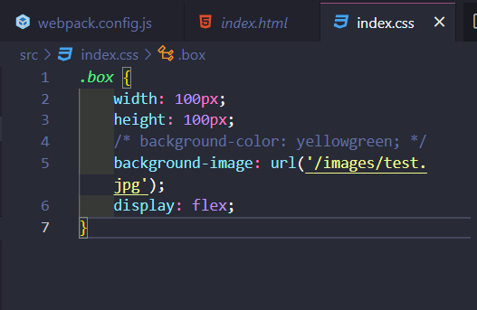

成功了！是我们想要的结果，不过问题又来了，当你打开html页面时发现并不能看到图片正常显示，这里就牵扯到**关于/images、./images、image三者有什么不同的知识点**

简单来说，如果我起了服务，我的实际路径就是 “localhost:8080/images/test.jpg”，如果没有起服务那就是 “/images/test.jpg”

所以让我们开启一个服务吧！

## 实现webpack本地服务

安装 webpack-dev-server 

```shell
yarn add webpack-dev-server -D
```

配置 url-loader

``` js
const path = require('path');
const MiniCssExtractPlugin = require('mini-css-extract-plugin');
const HtmlWebpackPlugin = require('html-webpack-plugin');
const { CleanWebpackPlugin } = require('clean-webpack-plugin');

module.exports = {
    entry: './src/index.js',
    output: {
        filename: 'main.js',
        path: path.resolve(__dirname, './dist')
    },
    mode: 'development',
    module: {
        rules: [
            {
                test: /\.css$/,
                use: [
                    MiniCssExtractPlugin.loader,
                    'css-loader', 'postcss-loader'
                ]
            },
            {
                test: /\.(png|jpe?g|gif)$/,
                use: {
                    loader: 'url-loader',
                    options: {
                        name: '[name].[ext]',
                        limit: 1024 * 3,
                        outputPath: "images/",
                        pubilcPath: "/images"
                    }
                    // 等价于
                    // options: {
                    //     name: 'images/[name].[ext]',
                    //     limit: 1024 * 3,
                    //     publicPath: "/",
                    //   }
                }
            }
        ]
    },
    devServer: {
        open: true,
        port: 8080,
    },
    plugins: [
        new MiniCssExtractPlugin({
            filename: "css/[name].css"
        }),
        new HtmlWebpackPlugin({
            template: './src/index.html'
        }),
        new CleanWebpackPlugin()
    ]
}
```

- 只需要加上devServer配置即可
- open表示打开浏览器
- port表示服务的端口号

**注意：这时就不是使用webpack命令来启动项目了，需使用webpack-dev-server来启动**

## 实现多页面打包

顾名思义，多页面自然是有多个html页面，每个html页面都有自己的js文件，那么，**有多少个入口就要有多少个出口**

我们首先要设置一下目录形式，以适应多页面打包的形式（以下形式不是唯一的，但有助于大家的理解）

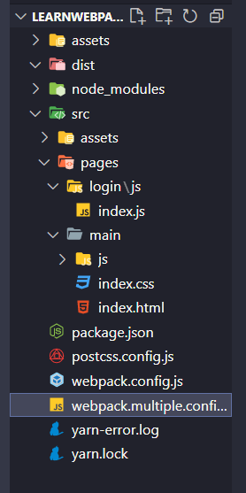

- 这里不需要src/index.js
- 新建一个webpack.multiple.config.js
- 新建src/pages/login/js/index.js
- 新建src/pages/main/js/index.js

安装glob，用于处理文件

```shell
yarn add glob -D
```

配置 webpack.multiple.config.js

```js
  entry: {
    login: './src/pages/login/js/index.js',
    main: './src/pages/main/js/index.js'
  },
  output: {
    filename: '[name].js',
    path: path.resolve(__dirname, './dist') 
  },
  plugins: [
    new HtmlWebpackPlugin({
      template: './src/index.html',
      filename: 'login.html',
      chunks: ['login'] // chunks的名字对应entry中的名字
    }),
    new HtmlWebpackPlugin({
      template: './src/index.html',
      filename: 'main.html',
      chunks: ['main']
    })
  ]
}
```

这样就完成了！你可以使用`webpack --config ./webpack.multiple.config.js` 命令运行一下。结果会如你所愿的

但是，这时你肯定会想难道我每写一个页面就重新配置一次吗？这也太麻烦了，也不优雅！那我们现在解决一下这个问题吧，直接上代码

```js
// 我们写一个方法自动做我们上面配置的事情
const glob = require("glob")

const setMpa = () => {
  const entry = {}
  const htmlwebpackplugins = []
	// 通过glob库拿到我们的入口文件数组
  const entryFiles = glob.sync(path.resolve(__dirname, "./src/pages/*/*/index.js"))
	// console.log(entryFiles)
  // 打印结果
  // [
  //  '/Users/yzy/Desktop/learnSpace/learnWebpack/src/pages/login/js/index.js', 
  //  '/Users/yzy/Desktop/learnSpace/learnWebpack/src/pages/main/js/index.js'
  // ]
  entryFiles.forEach((item) => {
    const entryFile = item
    const match = entryFile.match(/src\/pages\/(.*)\/js\/index\.js$/)
    // console.log(match)
    // 打印结果
    // [
    //   'src/pages/login/js/index.js',
    //   'login',
    //   index: 43,
    //   input: '/Users/yzy/Desktop/learnSpace/learnWebpack/src/pages/login/js/index.js',
    //   groups: undefined
    // ]
    const pageName = match[1]
    entry[pageName] = entryFile
    htmlwebpackplugins.push(
      new HtmlWebpackPlugin({
        template: `./src/index.html`,
        filename: `${pageName}.html`,
        chunks: [pageName]
      })
    )
  })

  return {
    entry,
    htmlwebpackplugins,
  }
}
复制代码
```

有了这个方法以后，我们把它加到配置文件里

```js
const path = require('path')
const MiniCssExtractPlugin = require('mini-css-extract-plugin')
const HtmlWebpackPlugin = require('html-webpack-plugin')
const { CleanWebpackPlugin } = require('clean-webpack-plugin')
const glob = require("glob")

const setMpa = () => {
    const entry = {}
    const htmlwebpackplugins = []
    const entryFiles = glob.sync(path.resolve(__dirname, "./src/pages/*/*/index.js"))
    entryFiles.forEach((item) => {
        const entryFile = item
        const match = entryFile.match(/src\/pages\/(.*)\/js\/index\.js$/)
        const pageName = match[1]
        entry[pageName] = entryFile
        htmlwebpackplugins.push(
            new HtmlWebpackPlugin({
                template: `./src/index.html`,
                filename: `${pageName}.html`,
                chunks: [pageName]
            })
        )
    })

    return {
        entry,
        htmlwebpackplugins,
    }
}
const { entry, htmlwebpackplugins } = setMpa()


module.exports = {
    entry: {
        login: './src/pages/login/js/index.js',
        main: './src/pages/main/js/index.js'
    },
    output: {
        filename: '[name].js',
        path: path.resolve(__dirname, './dist')
    },
    mode: 'development',
    module: {
        rules: [
            {
                test: /\.css$/,
                use: [
                    'style-loader',
                    'css-loader',
                    'postcss-loader'
                ]
            },
            {
                test: /\.(png|jpe?g|gif)$/,
                use: {
                    loader: 'url-loader',
                    options: {
                        name: '[name].[ext]',
                        limit: 1024 * 3,
                        outputPath: "images/",
                        publicPath: "/images",
                    }
                }
            }
        ]
    }, 
    devServer: {
        open: true,
        port: 8080,
        hot: true
    },
    plugins: [
        new MiniCssExtractPlugin({
            filename: "css/[name].css",
        }),
        new CleanWebpackPlugin(),
        ...htmlwebpackplugins
    ]
}
```

 我们再使用`webpack --config ./`webpack.multiple.config.js` 命令运行一下，成功！

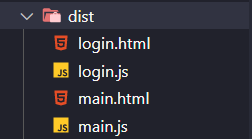

## 小结

到这里就算是完成了一个简单的 webpack 项目配置，看到这里先不要着急往下看，思考一下是否真的了解了 loader 和 plugin，如果让你写一个 loader 和 plugin，你有思路吗

我想不出意外的话，你应该是已经有了思路。如果没有也不用担心，看看下面的内容。

# 实现一个loader

先上链接，[官网编写loader文档](https://link.juejin.cn/?target=https%3A%2F%2Fwebpack.docschina.org%2Fcontribute%2Fwriting-a-loader%2F)

首先loader是一个函数，注意这里不能是箭头函数

编写一个替换字符串的loader

```js
// replaceLoader.js
module.exports = function(source) {
	console.log(source, this);
    return source.replace('hell webpack', '你好呀，webpack！')
}
```

- loader 是一个函数
- 不能使用箭头函数，因为要用到上下文的 this
- source 接收到的是待处理的文件源码
- return 处理后的文件源码，也是下一个 loader 接收到的文件源码

使用 loader

```js
{
    test: /\.js$/,
    use: path.resolve(__dirname, './loader/replaceLoader.js')
}
```

运行 `webpack` 命令看一下结果

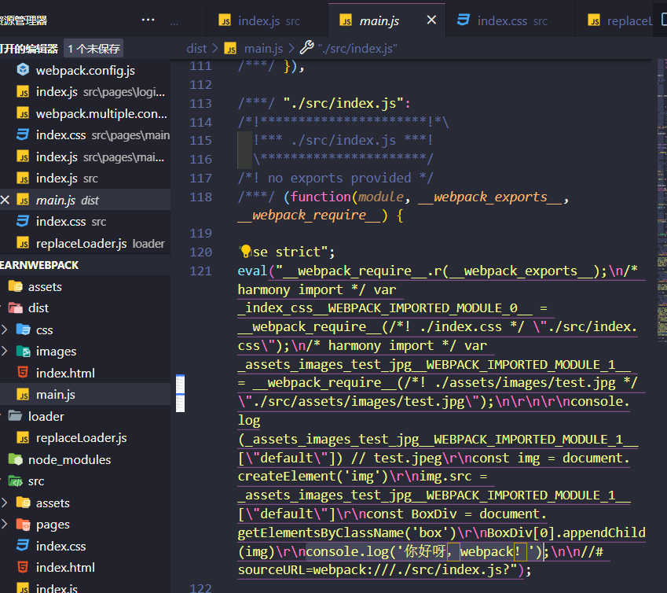

成功！是不是发现原来自定义 loader 这么简单，感兴趣可以自己尝试写一下 css、png 等其他文件的 loader

# 实现一个plugin

线上链接，[官网编写plugin文档](https://link.juejin.cn/?target=https%3A%2F%2Fwebpack.docschina.org%2Fcontribute%2Fwriting-a-plugin%2F)

同样简单，我们已经用了很多次plugin了，发现是不是都需要new一下。很显然，自定义loader是一个构造函数。

我们看一下格式：

```js
class PluginName {
    constructor(options) {
	},
    apply(compiler) {
        
    }
}
```

- 这里一定要写 apply 方法，webpack 会通过 apply 方法启动插件
- PluginName 可以写成普通函数，apply 必须挂载到原型对象上（`PluginName.prototype`)
- class 类中的 apply 不能写成箭头函数
- webpack 中的 [compiler钩子](https://link.juejin.cn/?target=https%3A%2F%2Fwebpack.docschina.org%2Fapi%2Fcompiler-hooks%2F)，查看钩子决定你的插件要在哪一步做什么

编写一个假的 html-webpack-plugin，输出一个fake.html文件

```js
class HtmlPlugin {
    constructor(options) {

    }
    apply(compiler) {
        compiler.hooks.emit.tap('HtmlPlugin', (compolation) => {
            const content = '<html><body>fake html</body></html>';
            compolation.assets['fake.html'] = {
                source: function () {
                    return content;
                },
                size: function () {
                    return content.length;
                }
            }
        })
    }
}
module.exports = HtmlPlugin;
```

使用这个plugin

```js
plugins: [
  new HtmlPlugin()
]
复制代码
```

运行`webpack`命令看一下结果

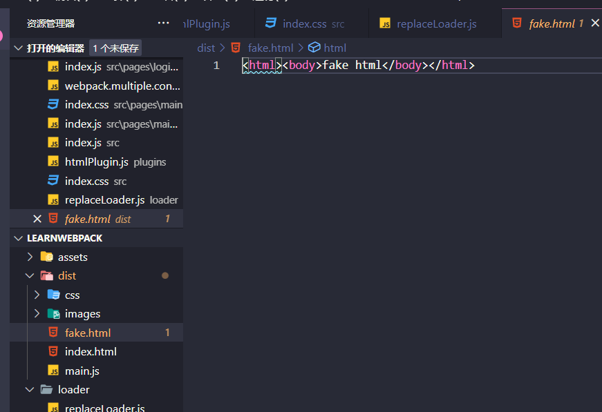

成功！你也可以试着完善一下这个插件，加上配置，加上引入资源文件等

# 指纹策略

## 关于浏览器缓存

- 现代浏览器都会有缓存策略
- 当我们第一次访问 A 网站时，这是加载了 y.js 的文件进行了缓存
- 当我们第二次访问 A 网站时，浏览器发现缓存中已经有 y.js 了
  - 缓存中有 y.js 那就用缓存的文件
  - 优点：减少了资源的请求
  - 缺点：当 y.js 的内容更新了，若不通过强制刷新浏览器的话则无法获取最新的 y.js 内容
- 我们加上标识符就可以解决这个问题了
  - 第一次访问时加载了 y.123.js 
  - 第二次访问发现有缓存就用缓存中的 y.123.js
  - 这时候服务器中的 y 文件内容改变，同时也修改了名字为 y.111.js 
  - 第三次访问发现没有 y.111.js 文件，正确加载最新 y.111.js

上诉都是比较简单解释，具体细节你可以不用知道，明白这个缓存机制的缓存方式即可。

## webpack 中使用指纹策略

使用：

```js
filename: '[name].[hash].[ext]',
```

- hash：以项目为单位，项目内容改变了，则会生成新的 hash，内容不变则 hash 不变
  - 整个工程任何一个需要被打包的文件发生了改变，打包结果中的所有文件的 hash 值都会改变。
- chunkhash：以 chunk 为单位，当一个文件内容改变，则整个 chunk 组的模块 hash 都会改变
  - 假设打包出口有 a.123.js 和 c.123.js
  - a 文件中引入了 b 文件
  - 修改了 b 文件的内容
  - 重新的打包结果为 a.111.js 和 c.123.js
  - a 的哈希值会被影响，但是 c 的 hash 值不受影响
- contenthash：以自身内容为单位，依赖不算
  - 假设打包出口有 a.123.js 和 b.123.css
  - a 文件引入了 b 文件
  - 修改了 b 文件的内容
  - 重新打包结果为 a.123.js 和 b.111.css
  - a 的 hash 值不受影响

# 热模块替换

场景：

- 启动项目本地服务
- 修改了一个 .css 文件的内容
- 浏览器没有刷新，但是修改的内容还是生效了

这就是热模块替换，提示：无论是 css 还是 js 都可以做热模块替换，但是个人建议只做 css 的热模块替换即可。因为 js 的热模块替换需要写代码进行替换，除非特定情况下，否则 js 的热模块替换用处不大。

我们来做一个 css 的热模块替换吧

**注：热模块不支持抽取出的 css 文件，只能放在 style 中，所以需要 style-loader**

配置 webpack.config.js

```js
const path = require('path')
const MiniCssExtractPlugin = require('mini-css-extract-plugin')
const HtmlWebpackPlugin = require('html-webpack-plugin')
const { CleanWebpackPlugin } = require('clean-webpack-plugin')
const HtmlPlugin = require('./plugin/htmlPlugin')
const Webpack = require('webpack')

module.exports = {
    entry: './src/index.js',
    output: {
        filename: 'main.js',
        path: path.resolve(__dirname, './dist')
    },
    mode: 'development',
    module: {
        rules: [
            {
                test: /\.js$/,
                use: path.resolve(__dirname, './loader/replaceLoader.js')
            },
            {
                test: /\.css$/,
                use: [
                    // MiniCssExtractPlugin.loader,
                    'style-loader',
                    'css-loader',
                    'postcss-loader'
                ]
            },
            {
                test: /\.(png|jpe?g|gif)$/,
                use: {
                    loader: 'url-loader',
                    options: {
                        name: '[name].[ext]',
                        limit: 1024 * 3,
                        outputPath: "images/",
                        publicPath: "/images",
                    }
                }
            }
        ]
    },
    devServer: {
        open: true,
        port: 8080,
        hot: true
    },
    plugins: [
        new MiniCssExtractPlugin({
            filename: "css/[name].css",
        }),
        new HtmlWebpackPlugin({
            template: './src/index.html'
        }),
        new CleanWebpackPlugin(),
        new HtmlPlugin(),
        new Webpack.HotModuleReplacementPlugin()
    ]
}
```

思考了一下，还是附了一份完整的配置文件（有点担心这样太占页面位置了）

- 首先，将之前的MiniCssExtractPlugin.loader替换回style-loader
- 给devServer中加上`hot: true`
- 引入webpack: `const Webpack = require('webpack')`
- 在plugin中添加：`new Webpack.HotModuleReplacementPlugin()`

运行`webpack-dev-server`命令看看效果吧！

# webpack5都更新了什么

话不多说，直接上链接，[webpack5更新的内容](https://link.juejin.cn?target=https%3A%2F%2Fzhuanlan.zhihu.com%2Fp%2F268925969)

**提示：当你使用webpack4的时候，无论是装plugin（插件）还是loader都尽量看看该插件现在都有什么版本，如果发现版本从4.x一下子跳到了5.x，那么一定要去安装4.x的版本，否则在打包的时候会发生未知的错误**

