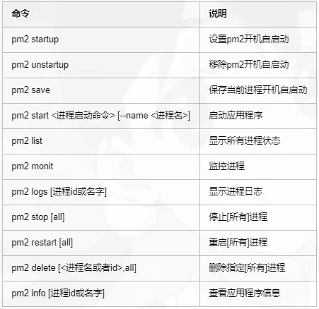

# PM2

## 安装步骤

- 安装PM2

```bash
npm i pm2 -g
```

- 软连接设置为全局

```bash
ln -s /soft/node-v12.16.1-linux-x64/bin/pm2 /usr/local/bin/pm2
```

## 常用命令



## 设置环境变量

```bash
NODE_ENV=production pm2 start app --update-env
```

## 添加日志日期

```bash
NODE_ENV=production pm2 start app --update-env --log-date-format "YYYY-MM-DD HH:mm"
```

