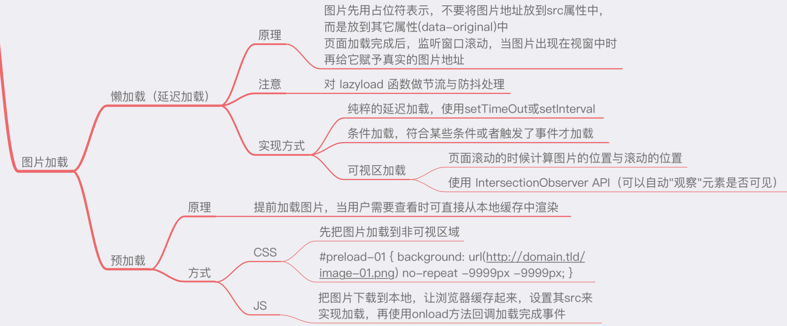

[【性能优化】手把手实现图片懒加载+Vue封装](https://github.com/amandakelake/blog/issues/46)

# 一、总览



## 1. 为什么要懒加载或者预加载

对页面加载速度影响最大的就是图片，当页面图片比较多，加载速度慢，非常影响用户体验。

思考一下，页面可能有几百张图片，但是首屏上需要展示的可能就一张而已，其他的那些图片能不能再晚点加载，比如用户往下滚动的时候。。。

这是为什么要用懒加载的原因

那预加载呢？

这个非常语义化，预备，提前。。。就是让用户感觉到你加载图片非常快，甚至用户没有感受到你在加载图片。

## 2. 懒加载原理

图片先用占位符表示，将图片地址放到自定义属性（data-xx）中。

页面加载完成后，监听窗口滚动，当图片出现在视窗中时再给它赋予真实的图片地址，也就是将 data-xx 中的属性值拿出来放到 src 属性中。

在滚动页面的过程中，通过给 scroll 事件绑定 lazyload 函数，不断加载出需要的图片

注意：请对 lazyload 函数使用防抖与节流

## 3. 懒加载方式

### 1. 纯粹的延迟加载，使用定时器

这种方式，本质上不算懒加载。

加载完首屏内容后，隔一段时间，去加载全部内容；

但这个时间差已经完成了用户对首屏加载速度的期待。

### 2. 条件加载

用户点击或者执行其他操作再加载，其实也包括滚动可视区域，但是大部分情况下，大家说的懒加载都是只可视区域的图片懒加载，所以就拿出来说了。

### 3. 可视区加载

这里也分两种情况：

1. 页面滚动时计算图片的位置与滚动的位置
2. 通过新的 API：IntersectionObserver API （可以自动“观察”元素是否可见）[Intersection Observer API - Web API 接口 | MDN](https://developer.mozilla.org/zh-CN/docs/Web/API/Intersection_Observer_API)

## 4. 预加载

提前加载图片，当用户需要查看时可直接从本地缓存中渲染

加载方式目前主要有两种：

### 1. CSS 预加载

先通过CSS将图片加载到不可见区域

```css
#preload-01 { background: url(http://domain.tld/image-01.png) no-repeat -9999px -9999px; }
```

待到满足触发条件后，再通过 JS 渲染

#### 2）、JS预加载

通过`new Image()`把图片下载到本地，让浏览器缓存起来，设置其 src 来实现加载，再使用 onload 方法回调加载完成事件

## 5、两者对比

其实两者的概念是相反的
一个是延迟加载，一个是提前加载
一个是减低服务器压力，一个是增加服务器压力（换取用户体验）

# 二、懒加载具体实现代码分析

## 1. 核心原理

将非首屏的图片的 src 属性设置一个默认值，监听事件 `scroll`，判断元素进入视口 viewport 时则把真实地址赋予到 src 上。

## 2. img 标签自定义属性相关

``

如上，`data-*` 属于自定义属性，`ele.dataset` 可以读取自定义属性集合 `img.srcset` 属性用于设置不同屏幕密度下，image 自动加载不同的图片，比如 ``

## 判断元素进入视口 viewport

#### 1. 图片距离顶部距离 < 视窗高度 + 页面滚动高度

```js
imgEle.offsetTop < window.innerHeight + document.body.scollTop
```

### 2. getBoundingClientRect()

`Element.getBoundingClientRect()`方法返回元素的大小及其相对于视口的位置,具体参考文档[Element.getBoundingClientRect() - Web API 接口 | MDN](https://developer.mozilla.org/zh-CN/docs/Web/API/Element/getBoundingClientRect)

```js
function isInViewport(ele) {
    // 元素顶部 距离 视口左上角 的距离top <= 窗口高度 （反例：元素在屏幕下方的情况）
    // 元素底部 距离 视口左上角 的距离bottom > 0 (反例：元素在屏幕上方的情况)
    // 元素display样式不为none
    const notBelow = ele.getBoundingClientRect().top <= window.innerHeight ? true : false;
    const notAbove = ele.getBoundingClientRect().bottom >= 0 ? true : false;
    const visable = getComputedStyle(ele).display !== "none" ? true : false;
    return notBelow && notAbove && visable ? true : false;
}
```

### 3）、Intersection Observer（存在兼容性问题，但帅啊）

由于兼容性问题，暂时不写，具体可参考文档
[Intersection Observer - Web API 接口 | MDN](https://developer.mozilla.org/zh-CN/docs/Web/API/IntersectionObserver)

