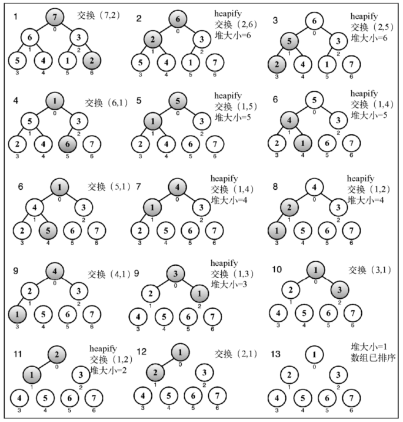

#### 堆排序算法

- 可以使用二叉堆数据结构来创建一个非常著名的排序算法：堆排序算法，它包含下面三个步骤。

  - （1）用数组创建一个最大堆用作源数据。
  - （2）在创建最大堆后，最大的值会被存储在堆的第一个位置。我们要将它替换为堆的最后一个值，将堆大小减1。
  - （3）最后，将堆的根节点下移并重复步骤 2 直到堆的大小为 1。-

- 用最大堆得到一个升序排列的数组（从最小到最大）。如果想要这个数组按降序排列，可以用最小堆代替：

  - 堆排序算法的代码：

    ```js
    /*堆排序算法
    * @method heapSort
    * @param {Array} array 待排序数组
    * @param {Function} compareFn 比较函数（默认值为内置的比较函数）
    */
    function heapSort(array, compareFn = defaultCompare) {
        // 获取数组长度作为堆的大小
        let heapSize = array.length;
        // 初始化堆
        buildMaxHeap(array, compareFn);
        while(heapSize > 1) {
            // 将第一个节点（最大值）替换为堆最后一个元素
            swap(array, 0, --heapSize);
            // 进行堆化，直到堆的大小为 1;
            heapify(array, 0, heapSize, compareFn);
        }
        return array;
    }
    
    /*初始化堆
    * @method buildMaxHeap
    * @param {Array} array 待构建成堆的数组
    * @param {Function} compareFn 比较函数（默认值为内置的比较函数）
    */
    function buildMaxHeap(array, compareFn) {
        // 对下标从 n/2 到 1 的数据进行堆化，
        // 因为下标 n/2 + 1 到 n 的节点是叶子节点，不需要堆化
    	for(let i = Math.floor(array.length / 2); i >= 0; --i){
            heapify(array, i, array.length, compareFn);
        }
        return array;
    }
    
    /*比较函数
    * @method defaultCompare
    */
    function defaultCompare(a, b) {
        if (a === b) {
          return 0;
        }
        return a > b ? 1 : -1;
    }
    /*交换函数
    * @method defaultCompare
    */
    function swap(array, a, b){
        // es6 解构赋值
        [array[a],array[b]] = [array[b], array[a]];
    	// const temp = array[a];
        // array[a] = array[b];
        // array[b] = temp;
    }
    /*堆化(下沉)
    * @method heapify
    * @param {Array} array 待构建成堆的数组
    * @param {Function} compareFn 比较函数（默认值为内置的比较函数）
    */
    function heapify(array, index, heapSize, compareFn) {
        // 假设最大值为当前节点
        let largest = index;
        // 获取左右节点的索引
        const left = (2 * index) + 1;
        const right = (2 * index) + 2;
        // 把当前节点与左右节点进行比较，若小于其中一个,则把当前节点和它进行交换
        if(
        	left < heapSize &&
            compareFn(this.heap[left], this.heap[largest]) > 0
        ){
            largest = left;
        }
        if(
            right < heapSize && 
            this.compareFn(this.heap[right], this.heap[largest] > 1) 
        ){
            largest = right;
        }
        // 验证当前节点是否为最大节点（即element无发生变化），若是则不用交换
        if(index !== largest) {
            // 将当前节点和最小子节点进行交换
    		swap(array, index, largest);
            // 继续堆化(下沉)，看是否需要调整
            this.heapify(element);
        }
    }
    ```

    - 初始化堆的思路：从后往前处理数组，并且每个数据都是从上往下堆化。因为叶子节点往下堆化只能自己跟自己比较，所以直接从第一个非叶子节点（倒数第二层）开始，依次堆化。（另一种思路是在堆种插入一个元素的思路：尽管数组种包含 n 个元素，但是可以假设，起初堆种只包含一个数据，就是下标为0 的数据，然后将下标 从 1 到 n的数据依次插入到堆中 ）。
    - 注：实际上，对于完全二叉树来说，下标从 n/2 + 1 到 n 的节点都是叶子节点。

- 测试：

  ```js
  const array = [7, 6, 3, 5, 4, 1, 2];
  console.log('Before sorting: ', array);
  console.log('After sorting: ', heapSort(array));
  ```

  

**堆排序是不稳定的排序算法，因为排序的过程，存在最后一个节点和堆顶节点互换的操作，所以两个相同的数，经过排序后的位置与初始位置不一定一样。**