## 图（Graph）

​		图是网络结构的抽象模型。图是一组由**边**连接的**节点**（或**顶点**）。**任何二元关系都可以用图来表示**。

一个图 G = (V, E) 由以下元素组成。

- V：一组顶点
- E：一组边，连接 V 中的顶点

如下，表示一个图：

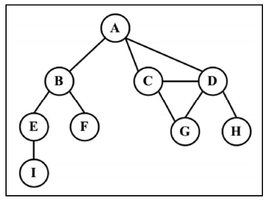

### 图的术语

​		由一条边连接在一起的顶点称为**相邻顶点**。比如，A 和 B 是相邻的，A 和 D 是相邻的，A 和 C 是相邻的，A 和 E 不是相邻的。

​		一个顶点的**度**是其相邻顶点的数量。比如，A 和其他三个顶点相连接，因此 A 的度为 3；E 和其他两个顶点相连，因此 E 的度为 2。

​		路径是顶点 v1, v2, ..., vk 的一个连续序列，其中 vi 和 v(i+1) 是响铃的。以上图包含的路径 `A B E I` 和 `A C D G`。

​		简单路径要求不包含重复的顶点。举例：`A D G ` 是一条简单路口。除去最后一个顶点（因为它和第一个顶点是同一个顶点），**环** 也是一个简单路径，比如 `A D C A ` (最后一个顶点重新回到 A)。

​		如果图中不存在环，则称该图是**无环**的。如果图中每两个顶点间都存在路径，则该图是**连通**的。

#### 有向图和无向图

​		图可以是无向的（边没有方向）或是有向的（有向图）。如下图，有向图的边有一个方向：

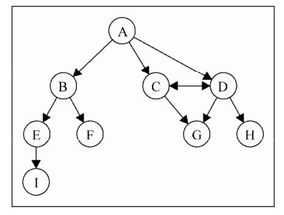

如果图中每两个顶点间在双向上都存在路径，则该图是**强连通**的。例如，C 和 D 是强连通的。

​		图还可以是**未加权**的（目前为止看到的图都是未加权的）或是加权的。如下图，加权图的边被赋予了权值：

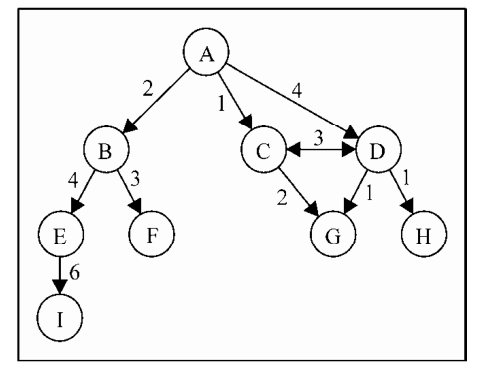

可以使用图来解决很多问题，例如搜索图中的一个特定顶点或搜索一条特定边，寻找图中 的一条路径（从一个顶点到另一个顶点），寻找两个顶点之间的最短路径，以及环检测。


### 图的表示

​		从数据结构的角度来说，有很多中方式来表示图。在所有的表示方中，不存在绝对正确的方式。图的正确表示法取决于待解决的问题和图的类型。

#### 邻接矩阵

​		图最常的实现是**邻接矩阵**。每个节点都和一个整数相关联，该整数将作为数组的索引。可以用一个二维数组来表示顶点之间的连接，如果索引为 i 的节点和索引为 j 的节点相邻，则 `array[i][j] === 1`，否则 `array[i][j] === 0`，如图所示:

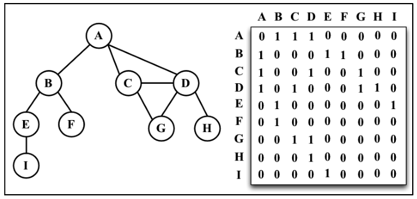

​		不是强连通的图（**稀疏图**）如果用邻接矩阵来表示，则矩阵中将会有很多 0，这意味着浪费了计算机存储空间来表示根本存在的边。例如，给定顶点的相邻顶点，即使该顶点只有一个相邻顶点，也只能迭代一整行。邻接矩阵表示法的不够好的另一个理由是，图中顶点的数量可能会改变，而二维数组不太灵活。

#### 邻接表

​		也可以通过使用一种叫做**邻接表**的动态数据结构来表示图。邻接表由图中每个顶点的相邻顶点列表所组成。存在好几种方式来表示这种数据结构。可以使用列表（数组）、链表，甚至是散列表或是字典来表示相邻顶点列表。如下图：

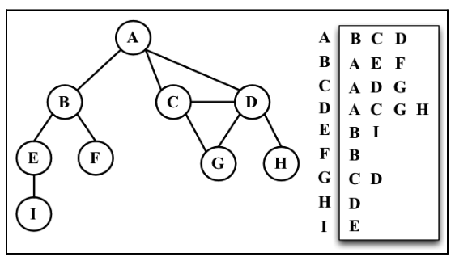

​		尽管邻接表可能对大多数问题来说都是更好的选择，但以上两种表示法都很有用，且它们有着不同的性质（例如，要找出顶点 v 和 w 是否相邻，使用邻接矩阵会比较快）。

#### 关联矩阵

​		另外还可以使用**关联矩阵**来表示图。在关联矩阵中，矩阵的行表示顶点，列表示边。如下图所示，使用二维数组来表示两者之间的连通性，如果顶点 v 是边 e 的入射点，则 `array[v][e] === 1`；否则，`array[v][e] === 0`。

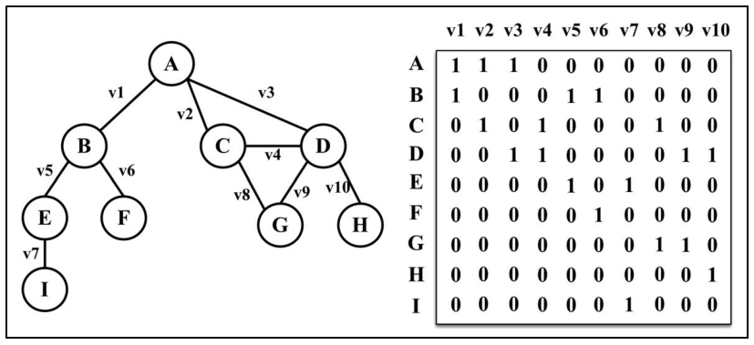

​		关联矩阵通常用于边的数量比顶点多的情况，以节省空间和内存。


### 创建 Graph 类

- 声明 Graph 类

  ```js
  class Graph{
      constructor(isDirected = false){
          // 接受一个参数来判断图是否有向,默认无向
          this.isDirected = isDirected;
          // 存储图中所有节点的名字
          this.vertices = [];
          // 使用字典来存储邻接表：键-顶点的名称，值：邻接顶点列表
          this.adjList = new Dictionary();
      }
  }
  ```

- Graph 类的方法：

  - addVertex：用来向图中添加一个新的顶点。

    ```js
    addVertex(v){
        // 判断顶点是否已存在
        if(!this.vertices.includes(v)) {
            // 将该顶点添加到顶点列表中
            this.vertices.push(v);
            // 初始化顶点 v 对应的字典值为一个空数组
            this.adjList.set(v, []);
        }
    }
    ```

  - addEdge：用来添加两个顶点之间的边

    ```js
    addEdge(v, w){
        // 在连接顶点之前，需要研制顶点是否存在于图中
        if(!this.adjList.get(v)){
            // 若顶点不存在，则需要加入顶点列表
            this.addVertex(v);
        }
        if(!this.adjList.get(w)){
            this.addVertex(w);
        }
        // 将 w 加入 v 的邻接表中
        this.adjList.get(v).push(w);
        // 判断是否为有向图
        if(!this.isDirected){
            // 若不是，则需要添加一条自 w 到 v 的边
            this.adjList.get(w).push(v);
        }
    }
    ```

  - getVertices：返回顶点列表

  - getAdjList：返回邻接表

    ```js
    // 返回顶点列表
    getVertices(){
        return this.vertices;
    }
    // 返回邻接表
    getAdjList(){
        return this.addList;
    }
    ```

  - toString：输出图

    ```js
    toString(){
        let s = '';
        for (let i = 0; i < this.vertices.length; i++) {
            // 输出顶点名称，例如 A ->
            s += `${this.vertices[i]} -> `;
            const neighbors = this.adjList.get(this.vertices[i]);
            for (let j = 0; j < neighbors.length; j++) {
                // 输出邻接顶点,并逐个输入，例如 ABCD
                s += `${neighbors[j]} `;
            }
            s += '\n';
        }
        return s;
    }
    ```

- 测试：

  ```js
  import Graph from './Graph.js';
  
  const graph = new Graph();
  const myVertices = ['A', 'B', 'C', 'D', 'E', 'F', 'G', 'H', 'I'];
  // 添加顶点
  for (let i = 0; i < myVertices.length; i++) {
      graph.addVertex(myVertices[i]);
  }
  // 初始化边
  graph.addEdge('A', 'B');
  graph.addEdge('A', 'C');
  graph.addEdge('A', 'D');
  graph.addEdge('C', 'D');
  graph.addEdge('C', 'G');
  graph.addEdge('D', 'G');
  graph.addEdge('D', 'H');
  graph.addEdge('B', 'E');
  graph.addEdge('B', 'F');
  graph.addEdge('E', 'I');
  
  // 输出图
  console.log(graph.toString());
  ```

  结果：

  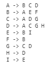

### 图的遍历

​		与树类似，可以访问图的所有节点。有两种算法可以对图进行遍历：**广度优先搜索（breadth-first search，BFS）**和**深度优先搜索（depth-first search，DFS）**。图遍历可以用来寻找特定的顶点或寻找两个顶点之间的路径，检查图是否连通，检查图是否含有环，等等。

- 图遍历的思想：
  - **图遍历算法**的思想是必须追踪每个第一次访问的节点，并且追踪有哪些节点还没有被完全探索。对于两种图遍历算法，都需要明确指出第一个被访问的顶点。	
  - 完全探索一个顶点要求查看该顶点的每一条边。对于每一条边所连接的没有被访问过的顶点，将其标注为被发现的，并将其加入待访问顶点列表中。
  - 为了保证算法的效率，务必访问每个顶点至多两次。连通图中每条边和顶点都会被访问到。

广度优先搜索算法和深度优先搜索算法基本上是相同的，只有一点不同，那就是待访问顶点列表的数据结构：

- 广度优先搜索
  - 数据结构：队列
  - 描述：将顶点存入队列，最先入队列的顶点先被探索。

- 深度优先搜索
  - 数据结构： 栈
  - 描述：将顶点存入栈，顶点是沿着路径被探索的，存在新的相邻顶点就去访问。

用颜色来标注顶点的状态：

```js
const Colors = {
    // 白色：表示顶点还没被访问过
    WHITE: 0,
    // 灰色：表示顶点被访问过，但并未被探索过
    GREY: 1,
    // 黑色：表示该顶点被访问且被完全探索过
    BLACK: 2
}
```

还需使用一个辅助对象来帮助存储顶点是否被访问过。在每个算法的开头，所有的顶点会被标记为未访问（白色）。使用下列函数来初始化每个顶点的颜色。

```js
const initializeColor = vertices => {
    // 存储顶点是否被访问过
    const color = {};
    for(let i = 0; i < vertices.length; i++){
        // 初始化每个顶点为白色（未访问状态）
        color[vertices[i]] = Colors.WHITE;
    }
    return color;
}
```

#### 广度优先搜索

​		广度优先搜索算法会从指定的第一个顶点开始遍历图，先访问其所有的邻点（相邻顶点），就像一次访问图的一层。换句话说，就是**先宽后深的访问顶点**，如图所示：

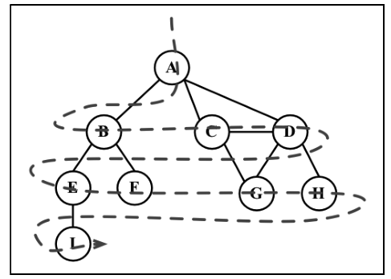

以下是从顶点 v 开始的广度优先搜索算法所遵循的步骤：

1. 创建一个队列 Q。

2. 标注 v 为被发现的（灰色），并将 v 入队列 Q。

3. 如果 Q 非空，则运行以下步骤：

   a. 将 u 从 Q 中出队列；

   b. 标注 u 为被发现的（灰色）；

   c. 将 u 所有未被访问过的邻点（白色）入队列；

   d. 标注 u 为已被探索的（黑色）。

- 实现广度优先搜索算法：

  ```js
  const breadthFirstSearch = (graph, startVertex, callback) => {
      // 获取图的顶点列表
      const vertices = graph.getVertices();
      // 获取图的邻接表
      const adjList = graph.getAdjList();
      // 初始化每个顶点的状态（颜色）为未访问（白色）
      const color = initializeColor(vertices);
      // 创建队列，存储待访问和待探索的顶点
      const queue = new Queue();
  
      // 将起始顶点入列
      queue.enqueue(startVertex);
  
      // 判断队列是否为空
      while(!queue.isEmpty()){
          // 如果队列非空
          // 将队首顶点出队
          const u = queue.dequeue();
          // 获取该顶点的邻接表   
          const neighbors = adjList.get(u);
          // 设置该顶点的状态为被访问（灰色）
          color[u] = Colors.GREY;
          // 遍历该顶点的邻接表
          for (let i = 0; i < neighbors.length; i++) {
              // 获取邻点
              const w = neighbors[i];
              // 判断邻点是否被访问过
              if(color[w] === Colors.WHITE) {
                  // 若没被访问（白色），则将其状态改为被访问（灰色），并且加入队列
                  color[w] = Colors.GREY;
                  queue.enqueue(w);
              }
          }
          // 将该顶点的状态改为已访问（黑色）
          color[u] = Colors.BLACK;
          // 是否有回调函数，若有则执行
          if(callback) {
              callback(u);
          }
      }
  };
  ```

- 测试：

  ```js
  // 输出已经被完全探索过的顶点的名字
  const printVertex = (value) => console.log('Visited vertex: ' + value);
  breadthFirstSearch(graph, myVertices[0], printVertex);
  ```

- 结果：

  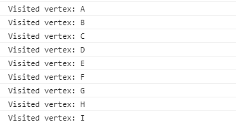

##### 使用 BFS 寻找最短路径

给定一个图 G 和源顶点 v，找出每个顶点 u 和 v 之间最短路径的距离（以边的数量计）。

对于给定顶点 v，广度优先算法会访问所有与其距离为 1 的顶点，接着是距离为 2 的顶点，以此类推。所以，可以用广度优先算法来解这个问题。可以修改 `breadthFirstSearch` 方法以返回一些信息：

- 从 v 到 u 的距离 `distances[u]`；
- 前溯点 `predecessors[u]`，用来推导出从 v 到其他每个顶点 u 的最短路径。

改进之后：

```js
BFS = (graph, startVertex) => {
    // 获取图的顶点列表
    const vertices = graph.getVertices();
    // 获取图的邻接表
    const adjList = graph.getAdjList();
    // 初始化每个顶点的状态（颜色）为未访问（白色）
    const color = initializeColor(vertices);
    // 创建队列，存储待访问和待探索的顶点
    const queue = new Queue();
    // 表示顶点的距离===================================================
    const distances = {};
    // 表示顶点的前溯点=================================================
    const predecessors = {};
    // 将起始顶点入列
    queue.enqueue(startVertex);

    // 初始化每个顶点的距离为 0，前溯点为 null ==========================
    for (let i = 0; i < vertices.length; i++) {
        distances[vertices[i]] = 0;
        predecessors[vertices[i]] = null;
    }

    // 判断队列是否为空
    while(!queue.isEmpty()){
        // 如果队列非空
        // 将队首顶点出队
        const u = queue.dequeue();
        // 获取该顶点的邻接表   
        const neighbors = adjList.get(u);
        // 设置该顶点的状态为被访问（灰色）
        color[u] = Colors.GREY;
        // 遍历该顶点的邻接表
        for (let i = 0; i < neighbors.length; i++) {
            // 获取邻点
            const w = neighbors[i];
            // 判断邻点是否被访问过
            if(color[w] === Colors.WHITE) {
                // 若没被访问（白色），则将其状态改为被访问（灰色），并且加入队列
                color[w] = Colors.GREY;
                // 加 1 来增加 u 和 w 之间的距离========================
                distances[w] = distances[u] + 1;
                // u 是 w 的前溯点=====================================
                predecessors[w] = u;
                queue.enqueue(w);
            }
        }
        // 将该顶点的状态改为已访问（黑色）
        color[u] = Colors.BLACK;
    }
    // 返回一个包含  distances 和 predecessors 的对象 ==============
    return {
        distances,
        predecessors
    }
};
```

改变：增设两个对象来存储顶点的距离以及前溯点，当一个顶点出队后，遍历该顶点的邻接表，让其每个邻接点的距离加 1，以及设置每个邻接点的前溯点为该节点。

测试：

```js
const shortestPathA = BFS(graph, myVertices[0]);
console.log(shortestPathA);

// 输出
distances: [A: 0, B: 1, C: 1, D: 1, E: 2, F: 2, G: 2, H: 2 , I: 3],
predecessors: [A: null, B: "A", C: "A", D: "A", E: "B", F: "B", G: "C", H: "D", I: "E"]
```

通过前溯数组，可以使用下面的函数来构建顶点 A 到其他顶点的路径：

```js
/**
 * 返回指定节点的所有路径
 * @param {*} vertices 顶点列表
 * @param {*} startVertexIndex 起始顶点
 * @param {*} distances 顶点距离列表
 * @param {*} predecessors 顶点前溯点列表
 */
const findAllPath = (vertices,startVertexIndex, shortestPath) => {
    // 获取起始顶点
    const fromVertex = vertices[startVertexIndex];
    let allPath = [];
    // 遍历其他每个顶点
    for (let i = 1; i < vertices.length; i++) {
        // 获取终止节点
        const toVertex = vertices[i];
        const path = new Stack();
        // 追溯终止顶点到起始顶点的路径
        // 每次循环后将 v 赋值为其前溯点的值，以便于反向追溯这条路径
        for(let v = toVertex; v !== fromVertex; v = shortestPath.predecessors[v]){
            // 将顶点加入栈，最后起始顶点也会被添加到栈中，以得到完整路径。
            path.push(v);
        }
        // 加入起始顶点，得到完整路径
        path.push(fromVertex);
        // 路径字符串，将起始顶点弹出
        let s = path.pop();
        while(!path.isEmpty()){
            // 当栈非空，将栈中的每一个项一处并拼接到字符串 s 后，以形成完整路径。
            s += ' - ' + path.pop();
        }
        allPath.push(s);
    }
    return allPath;
}
```

```js
console.log(findAllPath(myVertices,0,shortestPathA));
// 输出： ["A - B", "A - C", "A - D", "A - B - E", "A - B - F", "A - C - G", "A - D - H", "A - B - E - I"]
```


#### 深度优先搜索

​		深度优先搜索算法将会从第一个指定的顶点开始遍历图，沿着路径直到这条路径最后一个顶点被访问了，接着原路回退并探索下一条路径。换句话说，它是先深度后广度地访问顶点，如图所示：

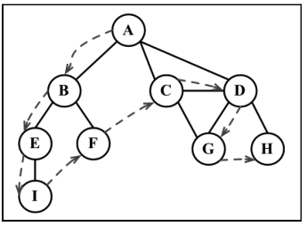

深度优先搜索算法不需要一个源顶点。在深度优先搜索算法中，若图中顶点 v 未访问，则访问该顶点 v。

要访问顶点 v，照如下步骤做：

1. 标注 v 为被发现的（灰色）；
2. 对于 v 的所有未访问（白色）的邻点 w，访问顶点 w；
3. 标注 v 为已被探索的（黑色）。

深度优先搜索的步骤是**递归**的，这意味着深度优先搜索算法使用**栈**来存储函数调用（由递归调用所创建的栈）。

```js
const depthFirstSearch = (graph,callback) => {
    // 获取图的顶点列表
    const vertices = graph.getVertices();
    // 获取图的邻接表
    const adjList = graph.getAdjList();
    // 初始化顶点状态
    const color = initializeColor(vertices);

    // 遍历每个顶点
    for(let i = 0; i < vertices.length; i++){
        if(color[vertices[i]] === Colors.WHITE) {
            // 若顶点未被访问，则调用递归函数 depthFirstSearchVisit 去探索该顶点
            depthFirstSearchVisit(vertices[i], color, adjList, callback);
        }
    }
};

/**
 * 访问顶点的所有邻点，并对顶点执行回调函数
 * @param {*} u         被探索的顶点
 * @param {*} color     顶点状态表
 * @param {*} adjList   邻接表
 * @param {*} callback  回调函数
 */
const depthFirstSearchVisit = (u, color, adjList, callback) => {
    // 设置该顶点的状态为 被访问过（灰色）
    color[u] = Colors.GREY;
    // 对顶点执行回调函数
    if(callback) {
        callback(u);
    }
    // 获得 u 的邻接表
    const neighbors = adjList.get(u);
    // 遍历 u 的所有邻点
    for(let i = 0; i < neighbors.length; i++){
        const w = neighbors[i];
        if(color[w] === Colors.WHITE) {
            // 若该邻点 w 未被访问过（白色），则递归调用 depthFirstSearchVisit 函数
            depthFirstSearchVisit(w, color, adjList, callback);
        }
    }
    // 最后，在该顶点和邻点按深度访问之后，回退，
    // 意味着该顶点已被完全探索，改变状态为 已访问（黑色）
    color[u] = Colors.BLACK;
}
```

测试：

```js
depthFirstSearch(graph, printVertex);
// 输出
/*
	Visited vertex: A
    Visited vertex: B
    Visited vertex: E
    Visited vertex: I
    Visited vertex: F
    Visited vertex: C
    Visited vertex: D
    Visited vertex: G
    Visited vertex: H
*/
```

下面这个示意图展示了该算法每一步的执行过程：

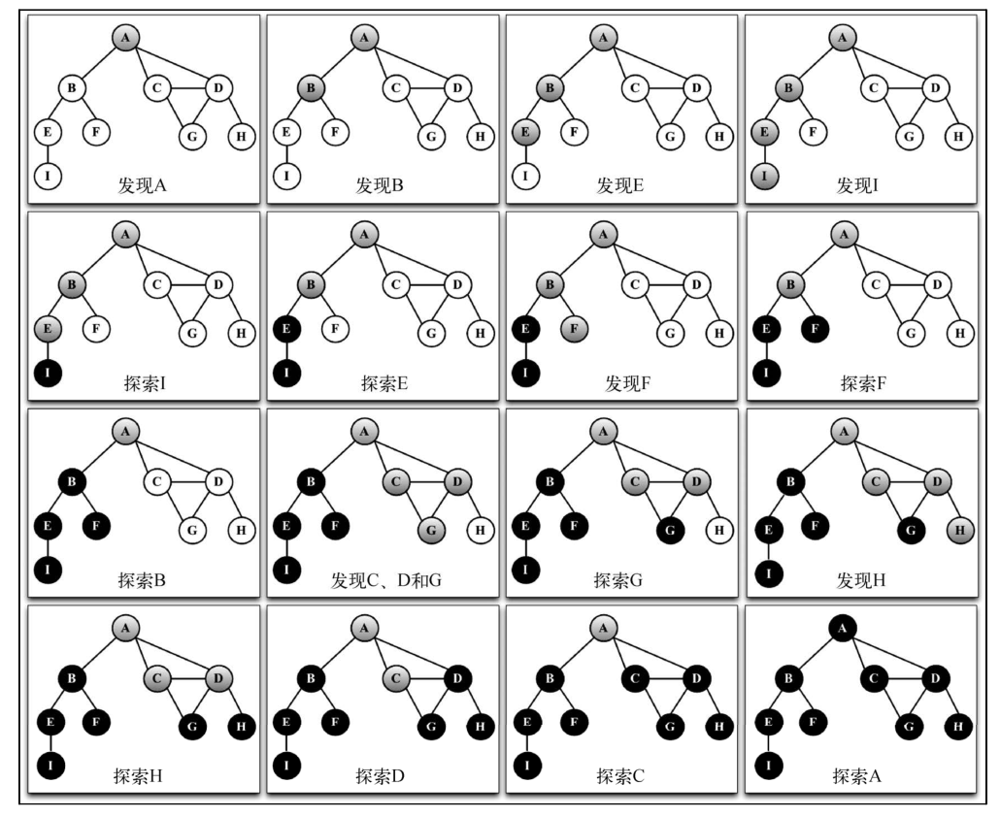

`depthFirstSearch` 内的 `depthFirstSearchVisist` 只会被执行一次，因为所有其他顶点都由路径到第一个调用 `depthFirstSearchVisist` 函数的顶点（顶点 A）。如果顶点 B 第一个调用函数，则 `depthFirstSearchVisist` 将会为其他顶点再执行一次（比如顶点 A）。

##### 1. 探索深度优先算法

​		对于给定的图 G，希望深度优先搜索算法遍历图 G 的所有节点，构建“森林”（**有根树** 的一个集合）以及一组源顶点（根），并输出两个数组：发现时间和完成探索时间。通过修改 `depthFirstSearch` 函数来返回一些信息：

- 顶点 u 的发现时间 `d[u]`；
- 当顶点 u 被标注为黑色时，u 的完成探索时间 `f[u]`；

- 顶点 u 的前溯点 `p[u]`；

改进：

```js
const DFS = graph => {
    // 获取图的顶点列表
    const vertices = graph.getVertices();
    // 获取图的邻接表
    const adjList = graph.getAdjList();
    // 初始化顶点状态
    const color = initializeColor(vertices);
    
    // 初始化 d: 发现时间，f：完成探索时间，p：前溯点=================================
    const d = {};
    const f = {};
    const p = {};
    // 追踪发现时间和完成探索时间 ===================================================
    const time = { count: 0 };
    for (let i = 0; i < vertices.length; i++) {
        f[vertices[i]] = 0;
        d[vertices[i]] = 0;
        p[vertices[i]] = null;
    }

    // 遍历每个顶点
    for(let i = 0; i < vertices.length; i++){
        if(color[vertices[i]] === Colors.WHITE) {
            // 若顶点未被访问，则调用递归函数 depthFirstSearchVisit 去探索该顶点
            DFSVisit(vertices[i], color, d, f, p, time, adjList);
        }
    }

    // 返回发现时间，完成探索时间，前溯点 =============================================
    return {
        discovery: d,
        finished: f,
        predecessors: p
    }
};

const DFSVisit = (u, color, d, f, p, time, adjList) => {
    // 设置该顶点的状态为 被访问过（灰色）
    color[u] = Colors.GREY;
    // 当一个顶点第一次被发现时，追踪其发现时间 ========================================
    d[u] = ++time.count;
    // 获得 u 的邻接表
    const neighbors = adjList.get(u);
    // 遍历 u 的所有邻点
    for(let i = 0; i < neighbors.length; i++){
        const w = neighbors[i];
        if(color[w] === Colors.WHITE) {
            // 追踪前溯点 ============================================================
            p[w] = u;
            // 若该邻点 w 未被访问过（白色），则递归调用 depthFirstSearchVisit 函数
            DFSVisit(w, color, d, f, p, time, adjList);
        }
    }
    // 最后，在该顶点和邻点按深度访问之后，回退，
    // 意味着该顶点已被完全探索，改变状态为 已访问（黑色）
    color[u] = Colors.BLACK;
    // 追踪其探索完成时间 =============================================================
    f[u] = ++time.count;
}
```

- 声明一个变量 `time` 来追踪发现时间和完成探索时间。当一个顶点第一次被发现时，追踪其发现时间。当它是由引自顶点 u 的边而被发现的，追踪它的前溯点。最后，当这个顶点被完全探索后，追踪其完成时间。

深度优先算法背后的思想是什么? 边是从最近发生的顶点 u 处被向外探索的。只有连接到未发现的顶点的边被探索了。当 u 所有的边都被探索了，该算法回退到 u 被发现的地方去探索其他的边。这个过程持续到发现了所有从原始顶点能够触及的顶点。如果还留有任何其他未被发现的顶点，对新源顶点重复这个过程。重复该算法，直到图中所有的顶点都被探索了。

对于改进的深度优先搜索，由两点需要注意：

- 时间（`time`）变量值的范围只可能在图顶点的一倍到两倍之间（2|V|）；

- 对于所有的顶点 u ，d[u] < f[u] (意味着，发现时间的值比完成时间的值小，完成时间意思是所有顶点都已经被探索过了)。

  在这两个假设下，有如下的规则：

  1 <= d[u] < f[u] <= 2|V|

如果对同一个图再跑一边新的深度优先搜索方法，对图中的每个顶点，会得到如下的发现：（发现/完成时间)

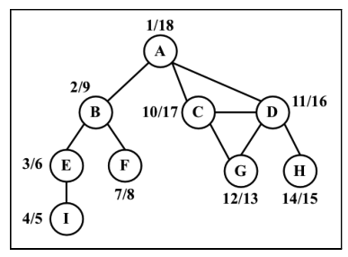

这些信息能用来干什么呢，请看下文：

##### 2.拓扑排序——使用深度优先搜索

给定下图，假设每个顶点都是一个需要去执行的任务:

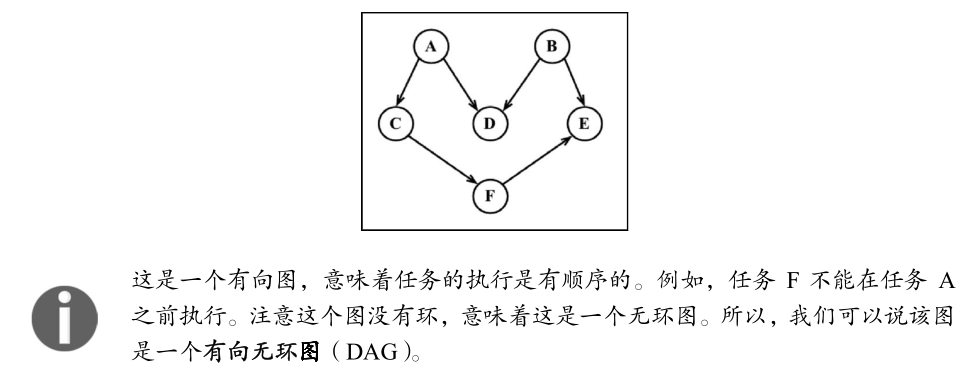

​		当需要编排一些任务或步骤的执行顺序时，这称为**拓扑排序**（topological sorting，英文亦写作 topsort 或是 toposort）。在日常生活中，这个问题在不同情形下都会出现。例如，当我们开始学习一门计算机科学课程，在学习某些知识之前得按顺序完成一些知识储备（你不可以在上算法 I 课程前先上算法 II 课程）。当我们在开发一个项目时，需要按顺序执行一些步骤。例如，首先从客户那里得到需求，接着开发客户要求的东西，最后交付项目。你不能先交付项目再去收集需求。

​		拓扑排序只能应用于 DAG。那么，如何使用深度优先搜索来实现拓扑排序呢？让我们在本节开头的示意图上执行一下深度优先搜索。

```js
graph = new Graph(true); // 有向图

myVertices = ['A', 'B', 'C', 'D', 'E', 'F'];
for (i = 0; i < myVertices.length; i++) {
    graph.addVertex(myVertices[i]);
}

graph.addEdge('A', 'C');
graph.addEdge('A', 'D');
graph.addEdge('B', 'D');
graph.addEdge('B', 'E');
graph.addEdge('C', 'F');
graph.addEdge('F', 'E');

const result = DFS(graph);
```

​		这段代码将创建图，添加边，执行改进版本的深度优先搜索算法，并将结果保存到 result
变量。下图展示了深度优先搜索算法执行后，该图的发现和完成时间。

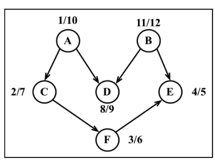

```js
const fTimes = result.finished;
s = '';
for (let count = 0; count < myVertices.length; count++) {
    let max = 0;
    let maxName = null;
    for (i = 0; i < myVertices.length; i++) {
        if (fTimes[myVertices[i]] > max) {
            max = fTimes[myVertices[i]];
            maxName = myVertices[i];
        }
    }
    s += ' - ' + maxName;
    delete fTimes[maxName];
}
console.log(s);
```

​		执行了上述代码后，我们会得到下面的输出。

​		`B - A - D - C - F - E`

​		注意之前的拓扑排序结果仅是多种可能性之一。如果我们稍微修改一下算法，就会有不同的
结果。比如下面这个结果也是众多其他可能性中的一个。

​		`A - B - C - D - F - E`

​		这也是一个可以接受的结果。