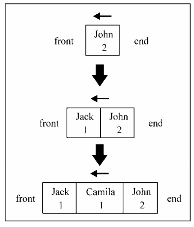
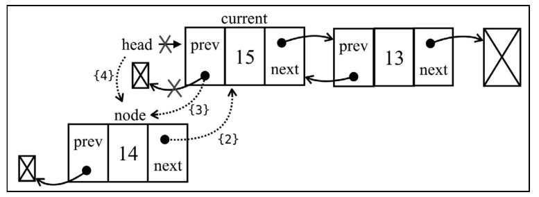
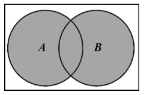

数据结构与算法

！！算法+数据结构=编程！！


> 阅读记录自 Loiane Groner ——《学习JavaScript数据结构与算法》第一版与第三版

# 数据结构

**数据结构是以某种特定的布局方式存储数据的容器。这种“布局方式”决定了数据结构对于某些操作是高效的，而对于其他操作是低效的。**

- 常见的数据结构有
  - 数组（Array）
  - 栈（Stack）
  - 队列（Queue）
  - 链表（LinkedList）
  - 集合（Set）
  - 字典与散列表（HashMap）
  - 树（Tree）
  - 堆（Heap）
  - 图（Graph）

## 数组（Array）

​	所谓的数组指的就是一组相关类型的变量集合，并且这些变量可以按照统一的方式进行操作。数组本身属于引用类型

### 用JS创建数组的方式:

- 使用new关键字，可以简单的声明并且初始化一个数组，也可以创建一个指定长度的数组，另外也可以直接将数组元素作为参数传递给他的构造器
    - `var array = new Array()`
    - `var array = new Array(4)`
    - `var array = new Array(1,2,3,4)`
- 更推荐采用中括（[ ]）创建的方式
    - `var array = []`
    - `var array = [1,2,3,4]`

### 遍历数组

数组的length属性可以知道数组中存储了多少个元素

- 遍历输出数组中所有元素

  ```js
  	for(let i = 0; i < array.length; i++) {
          console.log(array[i]);
      }
  ```

#### 例子： 斐波那契数列

- 求斐波那契数列前二十个数，已知斐波那契数列中第一个数字是1，第二个是2，从第三项开始，每一项都等于前两项之和:

  ```js
  	let fibonacci = [];
      // 已知数列第一个为1 第二个为2
      fibonacci[1] = 1;
      fibonacci[2] = 1;
  
      for (let i = 3; i < 20; i++){
          // 输出数列的前两位
          if(i == 3){ 
              console.log(fibonacci[1]);
              console.log(fibonacci[1]);
          }
          // 从第三项开始，每一项都等于前两项之和
          fibonacci[i] = fibonacci[i-1] + fibonacci[i-2];
          console.log(fibonacci[i]);
      }
  ```


### 添加和删除元素

- 在尾部添加元素
  - 把值赋给数组的长度所代表的位置即可（数组坐标是从0开始计算）
    - `array[array.length] = xx;` 
  - 数组的**push**方法，把元素添加到数组的末尾，能添加任意一个元素
    - `array.push(8);`
    - `array.push(9,10,11);`

- 在头部添加元素
  - 数组的**unshift**方法，可以直接把数值放入数组的首位
    - `array.unshift(-1);`

- 删除数组头部元素 
	- 数组的**shift**方法，删除数组里第一个元素
  		- `array.shift();`

- 删除数组尾部元素 
  - 数组的**pop**方法，删除数组里最后的元素
    - `array.pop();`

- 对数组中任意位置的元素删除或者添加

  - 数组的**splice**方法，通过指定位置/索引，就可以删除相应位置和数量的元素:
    - `array.splice(2,3)`;
    - 这行代码删除了数组索引从5开始的3个元素。意味着array[2],array[3],array[4]从数组中删除了

  - **splice**接收的第一个参数，表示想要删除或插入的元素的索引值。第二个参数是删除元素的个数（若不删除元素，则传入0）。第三个参数往后，就是要添加到数组里的值。

    - `array.splice(2,0,3,4,5);`

    - 从数组索引为2开始插入了 3，4，5三个元素

      

### 矩阵(二维数组)和多维数组

- 可以使用矩阵(二维数组)来存储数据 `array[][]`

  ```js
  let matrix = [];
  matrix[0] = [1,2,3,4,5,6,7];
  matrix[1] = [11,12,13,14,15,16,17];
  matrix[2] = [21,22,23,24,25,26,27];
  
  console.log(matrix);
  /*
  	[Array(7), Array(7), Array(7)]
      0: (7) [1, 2, 3, 4, 5, 6, 7]
      1: (7) [11, 12, 13, 14, 15, 16, 17]
      2: (7) [21, 22, 23, 24, 25, 26, 27]
      length: 3
      __proto__: Array(0)
  */
  ```

- 三维数组 `array[][][]`

  ```js
  let array3d = [
      [
          [0, 1, 2],
          [1, 2, 3]
      ],
      [
          [4, 5, 6],
          [7, 8, 9]
      ],
      [
          [10, 11, 12],
          [13, 14, 15]
      ]
  ];
  console.log(array3d[0][1][2]);	// 3
  ```


### JS部分数组方法

| 方法名 | 描述                          |
| ------ | ----------------------------- |
| concat | 合并数组，连接2个或更多数组，并返回结果 |
| every | 对数组中的每一项运行给定函数，如果该函数对每一项都返回true，则返回true |
| filter | 对数组中的每一项运行给定函数，返回该函数会返回true的项组成的数组 |
| forEach | 对数组中的每一项运行给定函数。这个方法没有返回值 |
| join | 将所有的数组元素连接成一个字符串 |
| indexof | 返回第一个与给定参数相等的数组元素的索引，没有找到则返回-1 |
| lastIndexof | 返回指定元素在数组中的最后一个的索引，如果不存在则返回 -1。从数组的后面向前查找 |
| map | 创建一个新数组，其结果是该数组中的每个元素都调用一个提供的函数后返回的结果。 |
| reverse | 方法将数组中元素的位置颠倒，并返回该数组。数组的第一个元素会变成最后一个，数组的最后一个元素变成第一个。该方法会改变原数组。 |
| slice | 返回传入索引值范围，将数组里对于索引范围内的元素作为新数组返回。原始数组不会被改变。 |
| some | 测试数组中是不是至少有1个元素通过了被提供的函数测试，如果任一项返回true，则返回true |
| sort | 按照字母顺序对数组排序，支持传入指定排序方法的函数作为参数 |

### ES6新增数组的功能

- 新增的数组方法

  | 方法       | 描述                                                         |
  | ---------- | ------------------------------------------------------------ |
  | @@iterator | 返回一个包含数组键值对的迭代器对象，可以通过同步调用得到数组元素的键值对 |
  | copyWithin | 复制数组中一系列元素到同一数组指定的起始位置                 |
  | entries    | 返回包含所有数组所有键值对的@@iterator                       |
  | includes   | 如果数组中存在某个元素则返回true，否则返回false。E2016新增   |
  | find       | 根据回调函数给定的条件从数组中查找元素，如果找到则返回该元素 |
  | findIndex  | 根据回调函数给定的条件从数组中查找元素，如果找到则返回该元素在数组中的索引 |
  | fill       | 用静态值填充数组                                             |
  | from       | 根据已有数组创建一个新数组                                   |
  | keys       | 返回包含数组所有索引的@@iterator                             |
  | of         | 根据传入的参数创建一个新数组                                 |
  | values     | 返回数组中所有值的@@iterator                                 |
  
  使用for...of循环迭代

    ```js
    for(const n of numbers){
        console.log(n % 2 === 0 ? 'even' : 'odd');
    }
    ```


### 排序

- **sort**方法：按照字母顺序对数组排序，支持传入指定排序方法的函数作为参数
	- 从小到大排序
    ```js
        var array = [1,123,43,23,5,74,3,5];
        // 给定排序方法的函数
        array.sort(function (now,next){
            return now - next;
        })

        console.log(array);
        //[1, 3, 5, 5, 23, 43, 74, 123]
    ```
  
  - 注：JavaScript在字符比较时，是根据字符对应的ASCII值来比较的


### 搜索

- **indexof**方法：返回与参数匹配的第一个元素的索引。
- **lastIndexOf**方法：返回与参数匹配的最后一个元素的索引。

- ES2015---**find**和**findIndex**方法：接收一个回调函数，搜索一个满足回调函数条件的值，不同之处在于**find**方法返回第一个满足条件的值，后者则返回这个值在数组中的索引。若无满足条件的值，**find**返回undefined，**findIndex**返回-1。
- ES2017--**includes**方法：如果数组中存在某个元素，该方法会返回true，否则返回false。

### 类型数组

​	与C 和Java 等其他语言不同，JavaScript 数组不是强类型的，因此它可以存储任意类型的
数据。
​	类型数组则用于存储单一类型的数据。它的语法是let myArray = new TypedArray
(length)，其中TypedArray 需替换为下表所列之一。


​	代码示例：

```js
let length = 5;
let int16 = new Int16Array(length);

let array16 = []
array16.length = length;

for(let i=0; i<lengthl; i++){
    int16[i] = i+1;
}
console.log(int16);
```

​	用于WebGL API、进行位操作、处理文件和图像


### TypeScript中的数组

​	TypeScript会在编译时进行类型检测，来确保只对所有值都属于相同数据类型的数组进行操作。

- 声明

  ```js
  let arr1:number[];	//声明一个数值类型的数组
  // 或者 let arr1:Array<number>
  let arr2:Array<string>  //声明一个字符串类的数组
  ```

- 数组初始化

  ```js
  // 定义一个空数组
  let arr1:number[] = [];
  // 定义一个数组，直接赋值
  let arr2:number[] = [1,2,3,4,5];
  //定义数组的同时给数组赋值
  let arr3:Array<string> = ['a','b','c'];
  let arr4:Array<boolean> = [ true,true,false];
  ```

- 数组的项中不允许出现其他的类型

  ```js
  let  arr: number[] = [1, '1', 2, 3, 5];
  
  // index.ts(1,5): error TS2322: Type '(number | string)[]' is not assignable to type 'number[]'.
  //   Type 'number | string' is not assignable to type 'number'.
  //     Type 'string' is not assignable to type 'number'.
  ```

  


----------------------------------------

## 栈（Stack）

​	栈是一种从先进后出LIFO(LastInFirtOut)原则的有序集合。新添加的或待删除的元素都保存在栈的末尾，称作栈顶，另一端就叫栈底。在栈里，新元素都靠近栈顶，旧元素都接近栈底。

### 基于数组的栈的创建

- 声明栈的构造函数

  - 可以使用用数组这种数据结构来保存栈里面的元素：

  ```js
  function Stack(){
      // 各种属性和方法的声明
      var items = [];
  }
  ```

- 声明栈的方法

  - `push(element)` ：添加一个新元素到栈顶（使用数组的push方法），也就是栈的末尾。

    ```js
    this.push = function(element){
        items.push(element);
    }
    ```

    

  - `pop()`：栈遵从LIFO原则，所有移除的是最后添加的元素，移除栈顶的元素，同时返回被移除的元素。

    ```js
    this.pop = function(element){
        // 返回被移除的元素
        return items.pop();
    }
    ```

  - `peek()`：返回栈顶的元素，不对栈做任何修改（这个方法不会移除栈顶的元素，仅仅返回它）。

    ```js
    this.peek = function (){
        return items[items.length-1];
    }
    ```

  - `isEmpty()`：如果栈里没有任何元素就返回true，否则返回false。

    ```js
    this.isEmpty = function (){
        return items.length == 0;
    }
    ```
    
  - `size()`：返回栈里的元素个数。用size代替length。
  
    ```js
    this.size = function(){
        return items.length;
    }
    ```
  
  - `clear()`：移除栈里的所有元素，把栈清空。
  
    ```js
    this.clear = function(){
        items = [];
    }
    ```
  
  - `print()` ：输出栈里的元素到控制台。
  
    ```js
    this.print = function(){
        console.log(items.toString());
    }
    ```


### 实现栈

```js

function Stack(){
    // 创建数组来保存栈的元素
    var items = [];

    // 添加元素到栈顶
    this.push = function(element){
        items.push(element);
    }

    // 移除栈顶元素，并返回该元素
    this.pop = function(element){
        // 返回被移除的元素
        return items.pop();
    }

    // 返回栈顶的元素
    this.peek = function (){
        return items[items.length-1];
    }

    // 检测栈是否为空
    this.isEmpty = function (){
        return items.length == 0;
    }

    // 返回栈里元素个数
    this.size = function(){
        return items.length;
    }

    // 清空栈
    this.clear = function(){
        items = [];
    }

    // 输出元素到控制台
    this.print = function(){
        console.log(items.toString());
    }
}
```

- 测试

  ```js
  // 测试
  var stack = new Stack();
  console.log(stack.isEmpty());	// true
  
  stack.push(5);
  stack.push(8);
  
  console.log(stack.peek());		// 8
  
  stack.push(11);
  console.log(stack.size());		// 3
  console.log(stack.isEmpty());	// false
  
  stack.push(15);
  
  stack.pop();
  stack.pop();
  console.log(stack.size());
  stack.print();
  ```

  

### 基于对象的Stack类

- 创建一个Stack类

  ```js
  class Stack {
      constructor() {
          // 记录栈的大小
          this.count = 0;
          // 创建对象存储元素
          this.items = {};
      }
      // 方法如下
  }
  ```

- 插入元素
  ```js
  push(element) {
      // 存储在栈顶
      this.items[this.count] = element;
      // 栈的大小+1
      this.count++;
  }
  ```

- 验证是否为空

  ```js
  isEmpty() {
      return this.count === 0;
  }
  ```

- 获取大小

  ```js
  size() {
      return this.count;
  }
  ```

- 移除栈顶元素,并返回

  ```js
  pop() {
      // 验证栈是否为空
      if(this.isEmpty()) {
          return undefined;
      }
      // 栈的大小-1
      this.count--;
      // 获取要移除的元素;
      const result = this.items[this.count];
      // 从栈中移除该元素
      delete this.items[this.count];
      // 返回被移除的元素
      return result;
  }
  ```

- 访问栈顶元素

  ```js
  peek() {
      if(this.isEmpty()) {
          return undefined;
      }
      return this.items[this.count - 1];
  }
  ```

- 清空栈

  ```js
  clear() {
      this.items = {};
      this.count = 0;
  
      // 遵循栈的LIFO原则的做法
      /*
      while(!this.isEmpty()) {
          this.pop();
      }
      */
  }
  ```

- 输出栈的内容

  ```js
  toString() {
      // 若栈为空，返回空字符串
      if(this.isEmpty()) {
          return '';
      }
      // 栈底元素为空
      let objString = `${this.items[0]}`;
      // 迭代整个栈
      for (let i=1; i < this.count; i++){
          objString = `${objString},${this.items[i]}`;
      }
      return objString;
  }
  ```

  

### 保护数据结构内部元素

- 在Stack类中声明的items和count属性没有得到保护，外界可以直接访问并且赋值。

- 解决方案： 

  - 1. 使用下划线命名约定标记属性为私有属性

       ```js
       class Stack {
           construtror() {
               this._count = 0;
               this._items = {};
           }
       }
       ```

       注：下划线命名约定接收在属性名称之前加上一个下划线 **_** 不过这种方式只是一种开发者的约定，并不能实际保护数据

  - 2. 使用Symbol实现类

       ES2015新增了一种叫做Symbol的基本类型，它是不可变的，可以作为对象的属性

       ```js
       // 声明Symbol类型的变量
       const _items = Symbol('stackItems');
       class Stack {
           constructor() {
               // 初始化值
               this[_items] = [];
           }
           // 栈的方法
       }
       ```

       注：要访问_items，只需把所有的`this.items`都换成`this[_items]`
       
       但是使用Object.getOwnProprtySymbols方法能取到类中声明的所有的Symbol属性
    
  - 3. 使用WeakMap实现类
  
       使用WeakMap数据类型可以确保属性是私有的，WeakMap可以存储键值对，其中键是对象，值可以是任意数据类型
  
       ```js
       // 声明一个WeakMap类型的变量items
       const items = new WeakMap();
       
       class Stack {
           constructor() {
               // 以this(Stack类)为键，把代表栈的数组存入items
               items.set(this,[]);
           }
           push(element) {
               // 从WeakMap中取出值
               const s = items.get(this);
               s.push(element);
           }
           pop() {
               const s = items.get(this);
               const r = s.pop();
               return r;
       	}
       }
       ```
  
       注:  items 在 Stack类里是真正的私有属性。但是可读性不强，而且扩展该类时无法继承私有属性。

### 使用栈解决问题

#### 	十进制转二进制：

- 要把十进制转二进制，将十进制数除以2（二进制是满二进一）并对商取整，直到结果为0

- 对应的算法描述：

  ```JS
  function decimalToBinary(decNumber){
      // 存储余数的栈
      const remStack = new Stack();
      // 十进制数
      let number = decNumber;
      // 余数
      let rem;
      // 二进制字符串
      let binaryString = '';
      
      while (number > 0) {
          // 对二取余，向下取整
  		rem = Math.floor( number % 2 );
          // 余数推入栈
          remStack.push(rem);
          // 十进制数除以二
          number = Math.floor( number / 2 );
      }
      
      while(!remStack.isEmpty()) {
          // 拼接字符串  按顺序移除栈内元素（与推进相反） 
          binaryString += remStack.pop().toString();
      }
      
      return binaryString;
  }
  ```

  - 测试

    ```js
    console.log(decimalToBinary(233));	// 11101001
    console.log(decimalToBinary(10));	// 1010
    console.log(decimalToBinary(1000));	// 1111101000
    ```


####  进制转换算法

- 对十进制转二进制方法进行修改，使之能把十进制转换成基础为2~36的任意进制。可以传入其他任意进制的基数作为参数，如下：

  ```js
  function baseConverter(decNumber, base){
      const remStack = new Stack();
  
      // 进制相应的基数字符  （1）
      const digits = '0123456789ABCDEFGHIJKLMNOPQRSTUVWXYZ';
  
      let number = decNumber
      let rem;
      let binaryString = '';
  
      // 进制转换范围 2--36
      if (!(base >= 2 && base <= 36)) {
          return '';
      }
  
      while (number > 0) {
          rem = Math.floor( number % base );
          remStack.push(rem);
          number = Math.floor( number / base );
      }
  
      while(!remStack.isEmpty()) {
          // 取出对应的字母基数进行拼接  （2）
          binaryString += digits[remStack.pop()];
      }
  
      return binaryString;
  }
  ```

  - 在十进制转八进制时，余数是0~7；但在十进制转十六进制时，余数是0~9 加上 A~F（对应10~15）。因此，我们需要对栈中的数字做转换（行(1)(2)）。因此从十一进制开始，字母表中的每个字母将表示相应的技术。字母A表示基数11，B代表基数12，以此类推

  - 测试

    ```js
    console.log(baseConverter(100345,2));	// 11000011111111001
    console.log(baseConverter(100345,8));	// 303771
    console.log(baseConverter(100345,16));	// 187F9
    console.log(baseConverter(100345,35));	// 2BW0
    ```

    

-----------------------------

## 队列（Queue）

​	队列是遵循**先进先出**（FIFO，即先来优先）原则的一组有序的项。队列在尾部添加新元素，并从顶部移除元素。最新添加的元素必须排在队列的末尾。（最常见的例子就是生活中的排队）

### 创建队列

- 创建Queue类

  ```js
  class Queue {
      constructor() {
          // 队列序号（包含已经离队的）
          this.count = 0;
          // 队列最前端的元素索引
     		this.lowestCount = 0;
          // 存储队列元素的对象
          this.items = {};
      }
  }
  ```

- 声明队列类的方法

  - **enqueue(element)**：向队列尾部添加一个新的项。

    ```js
    enqueue(element) {
        // 新的项只能添加到队列末尾
        this.items[this.count] = element;
        this.count++;
    }
    ```

  - **size()**：返回队列中包含的元素个数，与数组的length属性类似。

    ```js
    size() {
        return this.count - this.lowestCount;
    }
    ```

    注：计算队列中元素个数，只需计算count和lowestCount之间的差值。

  - **isEmpty()**：如果队列中不包含任何元素，返回true，否则返回false。

    ```js
    isEmpty() {
        return this.size() === 0;
    }
    ```

  - **dequeue()**：由于队列遵循先进先出原则，移除队列的第一项（即排在队列最前面的项）并返回被移除的元素。

    ```js
    dequeue() {
        // 检测队列是否为空
        if(this.isEmpty()){
            return undefined;
        }
        // 获得队列最前面的元素，注：索引不一定为0
        const  result = this.items[this.lowestCount];
        // 移除队首元素
        delete this.items[this.lowestCount];
        // 队首索引+1 及未移除前的第二位
        this.lowestCount++;
        return result;
    }
    ```

  - **peek()**：返回队列中第一个元素----最先被添加，也将是最先被移除的元素。(队列不做任何变化，不移除元素，只返回元素信息---与Stack类的peek类似)。在其他语言中叫做front方法。

    ```js
    peek() {
        if(this.isEmpty()) {
            return undefined;
        }
        return this.items[this.lowestCount];
    }
    ```

  - **clear()**：清空队列中所有的元素

    ```js
    clear() {
        this.items = {};
        this.count = 0;
        this.lowestCount = 0;
    }
    ```

  - **toString()**：输出队列的内容

    ```js
    toString() {
        if(this.isEmpty()) {
            return '';
        }
        let objString = `${this.items[this.lowestCount]}`;
        for(let i = this.lowestCount + 1; i < this.count; i++){
            objString = `${objString},${this.items[i]}`;
        }
        return objString;
    }
    ```

  - 测试

    ```js
    let queue = new Queue();
    
    queue.enqueue('a');				
    queue.enqueue('b');
    console.log(queue.toString());	// a,b
    
    queue.enqueue('c');
    console.log(queue.toString());	// a,b,c
    console.log(queue.size());		// 3
    console.log(queue.isEmpty());	// false
    
    queue.dequeue();
    queue.dequeue();
    console.log(queue.toString());	// a,b,c
    ```

    

### 双端队列

​	**双端队列**（deque，double-ended queue）是一种允许同时从前端和后端添加和移除元素的特殊队列，它同时遵守了先进先出和后进先出原则，可以说它是把队列和栈项结合的数据结构

- 创建**Deque**类

  ```js
  class Deque {
      constructor() {
          this.count = 0;
          this.lowestCount = 0;
          this.items = {};
      }
  }
  ```

- **Deque**类的方法（由于双端队列是一种特殊队列，所以有相同属性和方法：isEmpty、clear、size、toString）

  - **addBack(element)**：该方法在双端队列后端添加新的元素（实现方法和 Queue 类中的
    enqueue 方法相同）。
  - **removeFront()**：该方法会从双端队列前端移除第一个元素（实现方法和Queue 类中的
    dequeue 方法相同）。
  - **removeBack()**：该方法会从双端队列后端移除第一个元素（实现方法和Stack 类中的
    pop 方法一样）。
  - **peekFront()**：该方法返回双端队列前端的第一个元素（实现方法和Queue 类中的peek
    方法一样）。 
  - **peekBack()**：该方法返回双端队列后端的第一个元素（实现方法和Stack 类中的peek
    方法一样）。

- **addFront(element)**：该方法在双端队列前端添加新的元素。

  ```js
  addFront(element) {
  	if(this.isEmpty()) {
          // 第一种情况:双端队列为空，直接添加到队列后端（也是队列前端）
          this.addBack(element);
      }else if(this.lowestCount > 0){
          // 第二种情况:lowestCount属性大于0时，只需把该属性-1并将新元素放入该位置即可
          this.lowestCount--;
          this.items[this.lowestCount] = element;
      }else {
          // 第三种情况:lowestCount属性为0，将所有元素的索引都+1(即往后挪一位)，使第一位为空闲状态，并把新元素添加进去
          for(let i = this.count; i > 0; i--){
              this.items[i] = this.items[i - 1];
          }
          this.count++;
          this.lowestCount = 0;
          this.items[0] = element;//
      }
  }
  ```

- 测试

  ```js
  console.log(deque.isEmpty()); // 输出 true
  deque.addBack('John');
  deque.addBack('Jack');
  console.log(deque.toString()); // John, Jacks
  deque.addBack('Camila');
  console.log(deque.toString()); // John, Jack, Camila
  console.log(deque.size()); // 3
  console.log(deque.isEmpty()); // false
  deque.removeFront();
  console.log(deque.toString()); // Jack, Camila
  deque.removeBack();
  console.log(deque.toString()); // Jack
  deque.addFront('John');
  console.log(deque.toString()); // John, Jack
  ```

  

### 使用队列和双端队列解决问题

#### 最小优先队列

- 该队列中，元素的添加和移除是基于优先级的。现实中的例子就是机场登机的顺序。头等舱和商务舱的乘客优先级要高于经济舱的乘客，或者老年人和孕妇优先的规则

- 实现一个优先队列，有两种选项：

  - 1. 设置优先级，然后在正确的位置添加元素
  - 2. 或者用入列操作添加元素，然后按照优先级移除它们

- 本示例：将会在正确的位置添加元素，所以可以对它们使用默认的出列操作

  ```js
  class PriorityQueue{
      constructor() {
          // 队列序号（包含已经离队的）
          this.count = 0;
          // 队列最前端的元素索引
          this.lowestCount = 0;
          // 存储队列元素的对象
          this.items = {};
          // 初始化元素对象
          this.queueElement = {
              element: '',
              priority: 0,
          }
      }
  
      // 添加元素根据优先级选择位置进行添加
      enqueue(element,priority) {
          // 对对象进行解构赋值
          this.queueElement = {element,priority};
          // 若队列为空，则直接添加
          if(this.isEmpty()) {
              this.items[this.count] = this.queueElement;
              this.count++;
          }else {
              // 是否被添加标识
              let added = false;
              for(let i = 0; i < this.count; i++){
                  // 比较优先级
                  if(this.queueElement.priority < this.items[i]['priority']) {
                      // 若优先级小于某个元素，则插入某个元素的位置，其他元素向后挪
                      for(let j = this.count; j > i; j--) {
                      this.items[j] = this.items[j-1];
                      }
                      // 插入元素
                      this.items[i] = this.queueElement;
                      this.count++;
                      added = true;
                      break;
                  }
              }
              if(!added) {
                  this.items[this.count] = this.queueElement;
                  this.count++;
              }
          }
      }
      
      // 其他方法和默认的Queue实现相同
  }
  ```

- 测试: 

  ```js
          let priorityQueue = new PriorityQueue();
          priorityQueue.enqueue('John',2);
          priorityQueue.enqueue('Jack',1);
          priorityQueue.enqueue('Camila',1);
          console.log(priorityQueue.toString());
  
  		// Jack,Camila,John
  ```

  

- 在这里实现的优先队列称为最小优先队列，因为优先级值小的元素被放置在队列最前面（1代表更高的优先级）。最大优先队列则与之相反

#### 循环队列——击鼓传花

- **循环队列**的一个例子就是击鼓传花游戏（hotPotato(烫手山芋)）。在这个游戏中，参与者围成一个圆圈（环），把花尽快的传递给旁边的人。某一刻传花停止，这时候花在谁的手里，谁就退出圆圈、结束游戏。重复这个过程，直到只剩一个胜者。

- 实现一个模拟的击鼓传花游戏:

  ```js
  /*
  *@param {Array} elementsList 参与者名单
  *@param {Number} num 传递次数（模拟击鼓停止）
  *@return {Object} { eliminated 淘汰者名单,winner 获胜者}
  */
  function hotPotato(elementsList, num) {
      // 初始化游戏队列
      const queue = new Queue();
      // 存放淘汰者名单
      const elimitatedList = [];
  
      // 将参与者名称逐个入队
      for(let i = 0; i < elementsList.length; i++){
          queue.enqueue(elementsList[i]);
      }
      console.log(queue);
  
      // 剩下一个胜者才跳出循环
      while(queue.size() > 1){
          // 默认从队首开始传（花在队首手里）
          for(let i = 0; i < num; i++){
              // 将出队的元素添加到队末，形成环状循环
              queue.enqueue(queue.dequeue());
          }
          // 达到传递次数，移除此刻队首（即拥有花的参与者），并且存入淘汰者名单
          elimitatedList.push(queue.dequeue());
      }
  
      console.log(elimitatedList);
      return {
          // 淘汰者名单
          eliminated: elimitatedList,
          // 获胜者（队列中剩下的唯一参与者）
          winner: queue.dequeue()
      }
  }
  ```

  - 注：给定一份参与者名单，以及给定一个数字，然后迭代队列。从队列开头移除一项，再将其添加到队列末尾，模拟击鼓传花（如果你把花传给了旁边的人，你被淘汰的威胁就立刻解除了）。一旦达到给定的传递次数，拿着花的那个人就被淘汰了（从队列中移除）。只剩下一个的时候，这个人就是胜者。

  - 测试

    ```js
    const names = ['John', 'Jack', 'Camila', 'Ingrid', 'Carl'];
    const result = hotPotato(names, 7);
    
    result.eliminated.forEach(name => {
        console.log(`${name}在击鼓传花游戏中被淘汰。`);
    });
    console.log(`胜利者： ${result.winner}`);
    
    /*
    	输出:
    	Camila 在击鼓传花游戏中被淘汰。
        Jack 在击鼓传花游戏中被淘汰。
        Carl 在击鼓传花游戏中被淘汰。
        Ingrid 在击鼓传花游戏中被淘汰。
        胜利者：John
    */
    ```

    

#### 回文检查器

- **回文**——正反都能读通的单词、词组、数或一系列字符的序列，例如madam 或 racecar。
- 有不同的算法可以检查一个词组或字符串是否为回文。最简单的方式是将字符串反向排列并检查它和原字符是否相同。若两者相同，那么它就是一个回文。可以用栈来完成，但利用数据结构来解决这个问题最简单的方法是使用双端队列。

- 下列算法使用双端队列来解决问题：

  ```js
  /*
  *@param {String} aString 被检查字符串
  *@return {Boolean} 是否为回文
  */
  function palindromeChecker(aString){
      // 检查传入字符串是否合法（undefined,null,''）
      if(aString === undefined || aString === null || (aString !== null && aString.length === 0)) {
          return false;
      }
      // 创建双端队列
      const deque = new Deque();
      // 先全部转换为小写split(' ')去除字符串中的空格然后转换为数组，再用join方法拼接
      const lowerString = aString.toLocaleLowerCase().split(' ').join('');
      let isEqual = true;
      let firstChar, lastChar;
      
      for(let i = 0; i < lowerString.length; i++){
          // 把字符逐个加入队列中
          deque.addBack(lowerString.charAt(i));
      }
      
      // 队列不为空，且上次比较相等
      while(deque.size() > 1 && isEqual){
          // 分别取出队首队尾
          firstChar = deque.removeFront();
          lastChar = deque.removeBack();
          // 首尾相等
          if(firstChar !== lastChar) {
              isEqual = false;
          }
      }
      
      return isEqual;
  }
  ```

  - 注：使用之前实现的Deque类，由于可能接收到包含大小写字母的字符串，所有将字符串转换为小写，并移除所有空格（需要处理特殊字符另外加）。然后对字符串所有字符执行入队(enqueue)操作，如果所有元素都在双端队列中（若只有一个字符，则肯定是回文）。随后每次同时移除队首队尾，并且比较首尾字符相同的话，则是回文，否则则不是。

  - 测试:

    ```js
    console.log('a', palindromeChecker('a'));
    console.log('asda', palindromeChecker('asda'));	
    console.log('kayak', palindromeChecker('kayak'));
    console.log('level', palindromeChecker('level'));
    console.log('Was it a car or a cat I saw', palindromeChecker('Was it a car or a cat I saw'));
    console.log('Step on no pets', palindromeChecker('Step on no pets'));
    
    // 第二行为false  其他都为true
    ```

    

---------------------

## 链表（LinkedList）

​		链表存储有序的元素集合，但不同于数组，链表中的元素在内存中并不是连续放置的。每个元素由一个存储元素本身的节点和一个指向下一个元素的引用（也称指针或链接）组成。链表结构如下:


​		相比于传统的数组，链表的一个好处在于，添加或移除元素的时候不需要移动其他元素。然而，链表需要使用指针，在数组中我们可以直接访问任何位置的任何元素，而想要访问链表中间的一个元素，则需要从起点开始迭代链表直到找到所需元素

### 	创建链表

- 首先先创建后续可以复用的模块
  - **defaultEquals(a,b)**---作为默认的相等性比较函数，用于比较两个 JavaScript 对象或值是否相等

    ```js
    export function defaultEquals(a,b) {
        return a === b;
    }
    ```

  - **Node类**---作为表示链表中的元素，包含一个`element`属性，该属性表示要加入链表元素的值，和一个`next`属性，该属性是指向链表中下一个元素的指针。

    ```js
    export class Node {
        constructor(element) {
            this.element = element;
            this.next = undefined;
        }
    }
    ```

- **LinkedList**类的结构：

  ```js
  import { defaultEquals } from './modules/defaultEquals.js';
  import { Node } from './modules/Node.js';
  
  export default class LinkedList {
      // 设置默认值为传入的比较函数
      constructor(equalsFn = defaultEquals) {
          // 存储元素数量
          this.count = 0;
          // 存储第一个元素的引用
          this.head = undefined;
          // 比较函数
          this.equalsFn = equalsFn;
      }
  }
  ```

  - 注：要比较链表中的元素是否相等，需要使用一个内部调用的函数，名为`equalsFn`，开发者可以自行传入比较函数，若没传入，则默认使用导入的`defaultEquals`函数。由于该数据结构是动态的，所以需要把第一个元素的引用保存在`head`中

- **LinkedList**类的方法：

  - **push(element)**：向链表尾部添加一个元素，有两种场景：链表为空，添加到第一个元素；链表不为空，向尾部追加元素
  
    ```js
    push(element) {
        // 创建要添加的元素
        const node = new Node(element);
        // 当前访问的元素
        let current;
        if(this.head == null) {
            // 当链表为空，直接添加到头部元素
            this.head = node;
        }else {
            // 从头部开始访问
            current = this.head;
            while (current.next != null) {
                // 循环访问每个元素，直到元素的next指向为null或undefined时跳出循环
                current = current.next;
            }
            // 将其next赋值为新元素，建立链接
            current.next = node;
        }
        // 长度+1
        this.count++;
    }
    ```

    - 第一个场景：向空链表添加一个元素。当我们创建一个`LinkedList`对象时，`head`会指向`undefined`（或者是`null`），而创建的`node`元素的`next`默认指向`undefined`;

    

    ​		**注：`this.head == null` 等同于`(this.head === undefined || this.head === null)`。`current.next != null`等同于`(current.next !== undefined && current.next !== null)` 。链表的最后一个节点的下一个元素始终是`undefined`或`null` **
  
    - 第二个场景：向不为空的链表尾部添加元素，首先要找到最后一个元素。因为只有第一个元素的引用，因此要循环访问链表，直到找到最后一项。当`current.next`元素为`undefined`或`null`时，说明以及到达链表尾部，这是让当前访问的（也就是最后一个）元素的`next`指针指向要新添加的元素。
  - 
	
	- **getElementAt(index)**：返回链表中特定位置的元素。如果链表中不存在这样的元素，则返回undefined。
	
	  ```js
	  getElementAt(index) {
	      // 合法性检验，不合法则返回undefined
	      if(index >= 0 && index <= this.count) {
	          // 初始化node变量
	          let current = this.head;
	          // 从head元素开始迭代整个链表,直到目标index。
	          // 结束循环时，current元素将是index位置元素的引用。
	          for(let i = 0; i < index && current != null; i++) {
	              current = current.next;
	          }
	          return current;
	      }
	      return undefined;
	  }
	  ```
	
	  - 注：确保能迭代链表到一个合法的位置，需要对传入的`index`参数进行合法性验证，若传入的位置是不合法的参数，返回`undefined`，然后初始化`current`，该变量会从链表的第一个元素`head`开始，迭代整个链表。 
	
	- **index(element, index)** ：向链表中任意位置插入一个元素
	
	  ```js
	  insert(element,index) {
	      if(index >= 0 && index <= this.count) {
	          const node = new Node(element);
	          if(index === 0) {
	              // 在第一个位置添加元素
	              const current = this.head;
	              // 插入元素的next指向head元素
	              node.next = current;
	              // 将插入元素设为头部元素
	              this.head = node;
	          }else {
	              // 获取目标位置的前一个元素
	  			const previous = this.getElementAt(index-1);
	              // 获取目标位置的元素
	              const current = previous.next;
	              // 将插入元素的next指向目标位置元素
	              node.next = current;
	              // 将目标位置的前一个元素的next指向插入元素
	              previous.next = node;
	          }
	          // 更新链表长度
	          this.count++;
	          return true;
	      }
	      return false;
	  }
	  ```
	
	  - 第一种场景：在链表头部插入元素
	
	    
	
	  - 第二种场景：在链表中间或尾部添加一个元素
	
	    
	
	    
	
	- **indexOf(element)**：接收一个元素的值，如果在链表种找到该元素，返回其位置，否则返回-1
	
	  ```js
	  indexOf(element) {
	      let current = this.head;
	      // 从头部开始迭代元素
	      for(let i = 0; i < this.count && current != null; i++){
	          // 使用传入LinkedList类构造函数的判断函数
	          if(this.equalsFn(element,current.element)) {
	              return i;
	          }
	          current = current.next;
	      }
	      return -1;
	  }
	  ```
	
	  - 注：如果元素是一个复杂对象的话，可以向LinkedClass种传入自定义的函数来判断元素是否相等。

	- **removeAt(index)**：从特定位置移除一个元素（后面会有一个根据值移除元素的remove方法），并返回该元素。
      ```js
      removeAt(index) {
          // 检查越界值 从0到链表的长度(索引是count-1，因为index是从0开始的)都是有效位置
          if(index >= 0 && index < this.count) {
              // 从第一个元素开始访问
              let current = this.head;
              // 移除第一项
              if(index === 0) {
                  // 将head指向第二哥元素
                  this.head = current.next;
              } else {
                  // 存储对前一个元素的引用
                  const previous = this.getElementAt(index-1);
                  // 目标元素
                  current = previous.next;
                  // 将previous 与 current 的下一项链接起来；跳过current，从而移除它
                  previous.next = current.next;
              }
              this.count--;
              // 返回被移除的元素
              return current.element;
          }
          // 越界
          return undefined;
      }
      ```
		- 第一个场景：从链表移除第一个元素，要做的就是让`head`指向链表的第二个元素
        
        
		- 第二个场景：移除链表的最后一个元素或中间的某个元素。需要迭代链表的节点，直到到达目标位置。（current变量总是为对所循环链表的当前元素的引用）。迭代到目标位置的前一个元素`previous`之后（使用`getElementAt(index-1)`），`current = previous.next; `。因此，要从链表中移除当前元素，就是要将`previous.next`和`current.next`链接起来。这样，当前节点就会被丢弃在内存中，等待着被垃圾回收器回收。
			- 移除最后一个
              
			- 移除中间元素
              
  
  - **remove(element)**：根据传入元素的，从链表移除该元素。
  
    ```js
    remove(element) {
        // 使用indexOf找到其索引
        const index = this.indexOf(element);
        // 根据index使用removeAt删除该元素
        return this.removeAt(index);
    }
    ```
  
  - **size()**：获得链表元素大小
  
    ```js
    size() {
        return this.count;
    }
    ```
  
  - **isEmpty()**：检查链表是否为空
  
    ```js
    isEmpty() {
        return this.size() === 0;
    }
    ```
  
  - **getHead()**：获得链表头部元素(把head看作`LinkedList`类的私有变量)
  
    ```js
    getHead() {
        return this.head;
    }
    ```
  
  - **toString()**：把`LinkedList`对象转换成一个字符串。
  
    ```js
    toString() {
        // 如果链表为空，返回一个空字符串
        if(this.isEmpty()) {
            return '';
        }
        // 使头部元素，初始化返回值
        let objString = `${this.head.element}`;
        // 当前访问元素为第二个元素
        let current = this.head.next;
        //  迭代链表元素，若链表只有一个元素，current != null 验证将失败
        for(let i = 1; i < this.size() && current != null; i++) {
    		objString = `${objString},${current.element}`;
            current = current.next;
        }
        return objString;  
    }
    ```
  
- 测试：

  ```js
  const linkedList = new LinkedList();
  linkedList.push('a');
  linkedList.push('b');
  linkedList.push('c');
  console.log(linkedList.toString());         // a,b,c
  
  console.log(linkedList.getElementAt(2));    // Node {element: "c", next: undefined}
  
  console.log(linkedList.insert('z',1));      // true
  console.log(linkedList.toString());         // a,z,b,c
  
  console.log(linkedList.indexOf('c'));       // 3
  
  console.log(linkedList.removeAt(1));        // z
  console.log(linkedList.toString());         // a,b,c
  
  console.log(linkedList.remove('c'));        // c
  console.log(linkedList.toString());         // a,b
  
  console.log(linkedList.size());             // 2
  console.log(linkedList.isEmpty());          // false
  console.log(linkedList.getHead());          // Node {element: "a", next: Node}
  ```

  

### 双向链表

- 双向链表和普通链表的区别在于，在普通链表中，一个节点只有链向下一个节点的链接；而在双向链表中，链接是双向的：一个链向下个元素，另一个链向前一个元素，如图所示:

  

- **DoublyLinkedList**类是一种特殊的LinkedList类，可以用DoublyLinkedList类继承LinkedList类中所有属性和方法。一开始，在DoublyLinkedList的构造函数中，我们要调用LinkedList的构造函数，它会初始化equals、count和head属性。除此之外，也会保存对链表最后一个元素的引用---tail

  ```js
  import { defaultEquals } from './modules/defaultEquals.js';
  
  // 继承自普通链表
  class DoublyLinkedList extends LinkedList {
      constructor(equalsFn = defaultEquals) {
          // 调用父类(LinkedList类)的构造函数
          super(equalssFn);
          // 存储对尾部元素的引用
          this.tail = undefined;	
      }
  }
  ```

- 双向链表提供了两种迭代的方法：从头到尾，或者从尾到头。我们也可以访问一个特定节点的下一个或前一个元素，为了实现该行为，使用一个特殊的节点DoublyNode。该节点继承node类，在此基础上扩展一个叫prev属性。相比单向链表若迭代时错过了要找的元素，就需要回到起点，重新开始迭代。

  ```js
  import { Node } from './modules/Node.js';
  
  class DoublyNode extends Node {
      costrictor(element, next , prev){
          super(element, next);
          // 指向上一个元素
          this.prev = prev;
      }
  }
  ```

- 重写**insert(element, index)**：与链表的区别在于，链表只需要控制一个next指针，而双向链表则要同时控制next和prev(previous)这两个指针。

  ```js
  insert(element,index) {
      if(index >= 0 && index <=this.count ){
          const node = new DoublyNode(element);
          let current = this.head;
          // 1.插入位置为头部
          if(index === 0) {
              // 链表为空时
              if(this.head == null) { // {1}
                  // head 和 tail 都指向node
                  this.head = node;
                  this.tail = node;
              }else {
                  // 插入元素的next指向head元素
              	node.next = this.head; 	// {2}
                  // current(当前是head)的prev指向node元素
                  current.prev = node;	// {3}
                  this.head = node;		// {4}
              }
          }else if(index === this.count) { // 2.插入位置为最后一项
              // 访问尾部元素
              current = this.tail;		// {5}
              current.next = node;		// {6}
              node.prev = current;		// {7}
              // 尾部元素指向node
              this.tail = node;			// {8}
          }else { // 3. 插入中间任意位置
  			const previous = this.getElement(index-1);	// {9}
              current = previous.next;	// {10}
              node.next = current;		// {11}
              previous.next = node;		// {12}
              current.prev = node;		// {13}
              node.prev = previous;		// {14}
          }
          this.count++;
          return true;
      }
      return false;
  }
  ```

  - 第一个场景：在头部插入元素，若链表为空只需把`head`和`tail`都指向新节点，若不为空，则把`node.next`设为`current`(当前为head)，`current.pre`指向`node`，而`head`则指向`node`，初始化时`node`的`prev`已经为`undefined`。

    

  - 第二个场景：在尾部插入元素

    

  - 第三个场景：在中间任意位置插入元素

    

- 重写**removeAt(index)**：从任意位置移除元素，唯一区别就是还需要设置前一个位置的指针

  ```js
  removeAt(index) {
      if (index >= 0 && index < this.count) {
          let current = this.head;
          if (index === 0) {
              this.head = current.next; // {1}
              // 如果只有一项，更新 tail // 新增的
              if (this.count === 1) { // {2}
              	this.tail = undefined;
              } else {
              	this.head.prev = undefined; // {3}
              }
          } else if (index === this.count - 1) { // 最后一项 //新增的
              current = this.tail; // {4}
              this.tail = current.prev; // {5}
              this.tail.next = undefined; // {6}
          } else {
              current = this.getElementAt(index); // {7}
              const previous = current.prev; // {8}
              // 将 previous 与 current 的下一项链接起来——跳过 current
              previous.next = current.next; // {9}
              current.next.prev = previous; // {10} 新增的
          }
          this.count--;
          return current.element;
      }
      return undefined;
  }
  ```

  - 第一个场景：从头部移除一个元素

    

  - 第二个场景：从尾部移除一个元素

    

  - 第三个场景：从中间移除一个元素

    


### 循环链表

- **循环链表**可以像链表一样只有单向引用，也可以跟双向链表一样有双向引用。循环链表和链表之间唯一的区别在于，最后一个元素指向下一个元素的指针(`tail.next`)不是引用`undefiined`，而是指向第一个元素

  循环链表：

  

  双向循环链表：有指向 head 元素的 tail.next 和指向 tail 元素的 head.prev。

  

- 创建CircularLinkedList类:

  ```js
  CircularLinkedList extends LinkedList {
      constructor(equalsFn = defaultEquals) {
          super(equalsFn);
      }
  }
  ```

  - 重写**insert(element, index)**：在任意位置插入新元素，与普通链表不同的是需要将循环链表尾部节点的next引用指向头部节点。

    ```js
    insert(element, index) {
        if (index >= 0 && index <= this.count) {
            const node = new Node(element);
            let current = this.head;
        if (index === 0) {
            if (this.head == null) {
                this.head = node; // {1}
                // 将最后一个节点的next链接到head
                node.next = this.head; // {2} 新增的
            } else {
                node.next = current; // {3}
                current = this.getElementAt(this.size()); // {4}
                // 更新最后一个元素
                this.head = node; // {5}
                current.next = this.head; // {6} 新增的
            }
        	} else { // 这种场景没有变化
            	const previous = this.getElementAt(index - 1);
            	node.next = previous.next;
            	previous.next = node;
        	}
            this.count++;
            return true;
        }
        return false;
    }
    ```

    - 第一种情况：

      

    - 第二种情况:

      

  - 重写**removeAt(index)**：从循环链表中移除元素，只需考虑第二种情况，也就是修改循环链表的head元素。

    ```js
    removeAt(index) {
        if (index >= 0 && index < this.count) {
            let current = this.head;
            if (index === 0) {
            	if (this.size() === 1) {
            		this.head = undefined;
            	} else {
            		const removed = this.head; // {1}
            		current = this.getElementAt(this.size()); // {2} 新增的
            		this.head = this.head.next; // {3}
            		current.next = this.head; // {4}
            		current = removed; // {5}
            	}
            	} else {
            		// 不需要修改循环链表最后一个元素
            		const previous = this.getElementAt(index - 1);
            		current = previous.next;
            		previous.next = current.next;
            	}
        	this.count--;
        	return current.element; // {6}
        }
        return undefined;
    }
    ```

    - 第二种情况：从一个非空循环中移除元素

      

### 有序链表

- 有序链表是指保持元素有序的链表结构。除了使用排序算法之外，我们还可以将元素插入到
  正确的位置来保证链表的有序性。

- 创建SortedLinkedList类

  ```js
  const Compare = {
      LESS_THAN: -1,
      BIGGER_THAN: 1
  };
  // 比较元素的函数，如果第一个元素小于第二个元素，它就返回 -1 ，反之则返回 1
  function defaultCompare(a, b) {
      if (a === b) { // {1}
          return 0;
      }
      return a < b ? Compare.LESS_THAN : Compare.BIGGER_THAN; // {2}
  }
  class SortedLinkedList extends LinkedList {
      constructor(equalsFn = defaultEquals, compareFn = defaultCompare) {
          super(equalsFn);
          this.compareFn = compareFn; // {3}
      }
  }
  ```

  - 有序插入元素

    ```js
    // 如果没传入索引，默认为0
    insert(element, index = 0) { // {1}
        if (this.isEmpty()) {
        	return super.insert(element, 0); // {2}
        }
        const pos = this.getIndexNextSortedElement(element); // {3}
        return super.insert(element, pos); // {4}
    }
    getIndexNextSortedElement(element) {
        let current = this.head;
        let i = 0;
        // 迭代整个链表直至找到插如元素的位置，或者是迭代完所有的元素
        for (; i < this.size() && current; i++) {
            const comp = this.compareFn(element, current.element); // {5}
            if (comp === Compare.LESS_THAN) { // {6}
            	return i;
        	}
    		current = current.next;
    	}
        // 插入末尾
    	return i; // {7}
    }
    ```

    

### 基于链表创建栈

- 使用LinkedList类及其变种作为内部的数据结构来创建其他数据结构，例如 基于双向链表创建栈

  ```js
  class StackLinkedList {
      constructor() {
      	this.items = new DoublyLinkedList(); // {1}
      }
      push(element) {
      	this.items.push(element); // {2}
      }
      pop() {
      	if (this.isEmpty()) {
      		return undefined;
      	}
      	return this.items.removeAt(this.size() - 1); // {3}
      }
  }
  ```

  - 使用双向链表对于栈来说，会像链表尾部添加元素，也会从链表尾部移除元素。双向链表有对与最后一个元素tail的引用，无需迭代整个链表就能获取到

  ```js
  peek() {
      if (this.isEmpty()) {
      	return undefined;
      }
  	return this.items.getElementAt(this.size() - 1).element;
  }
  isEmpty() {
  	return this.items.isEmpty();
  }
  size() {
  	return this.items.size();
  }
  clear() {
  	this.items.clear();
  }
  toString() {
  	return this.items.toString();
  }
  ```

  

--------------------------------------------------------

## 集合（Set）

​	**集合**是由一组无序且唯一（即不能重复）的项组成的。在数学中，集合是一组不同对象的集。


### 创建集合类

- **Set**类构造函数：

  ```js
  class Set {
      constructor() {
  		this.items = {};
      }
  }
  ```

  注： 使用对象存储元素，JS中的对象不允许一个键指向两个不同的属性，也保证了集合里面的元素都是唯一的。

  - **has(element)**：用来检查某个元素是否存在于集合中

    ```js
    has(element) {
        //  in 运算符则返回表示对象在原型链上是否有特定属性的布尔值
        // return element in items;
        
        // 更好的实现方式 
        //Object 原型的 hasOwnProperty 方法返回一个表明对象是否具有特定属性的布尔值。
        return Object.prototype.hasOwnProerty.call(this.items, element);
    }
    ```

    - 注：使用`this.items.hasOwnProperty(element)`可能会错误，因为继承自`Object.protoype`对象上的`hasOwnProperty`方法也有可能被覆盖，导致代码不能正常工作，使用`Object.prototype.hasOwnProperty.call`更为安全

  - **add(element)**：向集合添加一个新元素

    ```js
    add(element) {
        // 检查要添加的元素是否已存在
        if(!this.has(element)){
            this.items[element] = element;
            return true;
        }
        return false;
    }
    ```

    - 注：对于给定的element，先检查是否存在于集合中，若不存在就添加到集合中。添加的时候，把element同时作为键和值保存，有利于查找该元素。

  - **delete(element)**：移除元素

    ```js
    delete(element) {
        if(this.has(element)) {
            delete this.items[element];
            return true;
        }
        return false;
    }
    ```

  - **clear()**：清空集合

    ```js
    clear() {
        // 重置items对象
        this.items = {};
    }
    ```

  - **size()**：返回集合中元素的数量

    ```js
    size() {
        // ES2015
        // 返回一个包含给定对象所有属性的数组（自身属性）
        // return Object.keys(this.items).length;
        
        let count = 0;
        for (let key in this.items) {
            if(this.has(key)){
                count++;
            }
        }
        return count;
    };
    ```

    - 注：不能简单的使用`for-in`语句迭代对象的属性，因为也会包含原型上的属性，所以使用`has`方法来验证是否是自身的属性，使用`Object.keys()`方法也可，但是无法兼容IE8及其以下

  - **values()**：返回一个包含集合中所有值（元素）的数组。

    ```js
    values() {
        // ES2017 Object.values()方法返回了一个包含给定对象所有属性的数组
        // return Object.values(this.items);
        
        let values = [];
        for(let key in this.items) {
        	if(this.has(key)) {
                values.push(key);
            }
        }
        return values;
    }
    ```

    - 注：第二个方法在任何浏览器中都能执行，迭代items对象的所有属性，并把它们添加到一个数组中，并返回整个数组。

  - 测试：

    ```js
    const set = new Set();
    
    set.add(1);
    console.log(set.values()); // 输出[1]
    console.log(set.has(1)); // 输出 true
    console.log(set.size()); // 输出 1
    set.add(2);
    console.log(set.values()); // 输出[1, 2]
    console.log(set.has(2)); // 输出 true
    console.log(set.size()); // 输出 2
    set.delete(1);
    console.log(set.values()); // 输出[2]
    set.delete(2);
    console.log(set.values()); // 输出[]
    ```


### 集合运算

- **并集**：对于给定的两个集合，返回一个包含两个集合中**所有元素**的新集合。

  

  - Set类的**union**方法：

    ```js
    // ES2015版
    union(otherSet) {
        const unionSet = new Set();
        this.values().forEach(value => unionSet.add(value));
        otherSet.values().forEach(value => unionSet.add(value));
        return unionSet;
    }
    
    // 
    union(otherSet) {
        const unionSet = new Set(); // {1}
    
        let values = this.values(); // {2}
        for (let i = 0; i < values.length; i++){
        	unionSet.add(values[i]);
        }
        values = otherSet.values(); // {3}
        for (let i = 0; i < values.length; i++){
        	unionSet.add(values[i]);
        }
        return unionSet;
    };
    ```

    - 注：ES2015.使用Array类的`forEach`方法来迭代数组的所有元素。使用箭头函数(=>)来替代显式声明。

- **交集**：对于给定的两个集合，返回一个包含两个集合中**共有元素**的新集合。

  

  - Set类的**intersection**：

    ```js
    intersection(otherSet) {
    	// 存储两个集合的交集
        const intersectionSet = new Set();
        // 当前Set实例
        const values = this.values();
        // 传入对象Set实例
        const otherValues = otherSet.values();
        
        let biggerSet = values;
        let smallerSet = otherValues;
        
        // 比较两个集合的大小
        if(otherValues.length - values.length > 0) {
            biggerSet = otherValues;
    		smallerSet = values;
        }
        // 迭代较小的Set实例，使用has方法验证是否拥有较大集合属性
        smallerSet.forEach(value => { // {7}
            if (biggerSet.includes(value)) {
                intersectionSet.add(value);
            }
        })
        return intersectionSet;
    }
    ```

    - 注：通过比较两个集合大小来减少迭代次数，优化代码，提升性能。

- **差集**：对于给定的两个集合，返回一个包含所有存在于第一个集合且不存在于第二个集合的元素的新集合。

  

  - Set类的**difference**方法：

    ```js
    difference(otherSet) {
        const differenceSet = new Set();
        this.values().forEach(value => {
            if(!otherSet.has(value)){
                differenceSet.add(value);
            }
        });
        return differenceSet;
    }
    ```

    - intersection方法会得到所有同时存在于两个集合中的元素，而difference方法会得到所有存在于集合A但不存在于集合B的元素。无法优化递归次数的原因是，SetA与SetB直接的差集可能和SetB和SetA的差集不同

- **子集**：验证一个给定集合是否是另一集合的子集。

  

  - Set类的**isSubsetOf**：

    ```js
    isSubsetOf(otherSet) {
        // 子集的元素个数需要小于或等于要比较的集合
        if(this.size() > other.size()) {
            return false;
        }
        let isSubset = true;
        // 迭代每一个元素，当前实例拥有的元素，otherSet都有
        // 当前实例才为otherSet的子集
        this.values().erver(value => {
        	if(!otherSet.has(value)) {
                isSubset = false;
                return false;
            }
            return true;
        });
        return isSubset;
    }
    ```

- 注：实现的集合运算方法不会修改当前的 Set 类实例或是作为参数传入的 otherSet。没有副作用的方法和函数被称为 纯函数。纯函数不会修改当前的实例或参数，只会生成一个新的结果。


### ES2015——Set类

- 原生Set类：**Set** 对象类似于数组，允许你存储任何类型的唯一值，无论是[原始值](https://developer.mozilla.org/en-US/docs/Glossary/Primitive)或者是对象引用。

- 使用：

  ```js
  const set = new Set();
  set.add(1);
  console.log(set.values());		// 输出@Iterator（迭代器接口）可以依次处理该数据结构所有成员
  console.log(set.has(1)); 		// 输出 true
  console.log(set.size); 			// 输出 1
  set.delete(1);
  set.clear();					// 重复set数据结构
  ```

  - 注：原生Set类没有集合运算功能

#### 使用扩展运算符进行集合运算

- 整个过程包含三个步骤:

  1. 将集合转化为数组;
  2. 执行需要的运算
  3. 将结果转化回集合

  - **并集运算** （setA元素： 1,2,3    setB元素：2,3,4 ）

    `new Set([...setA,...setB])`

    - ES2015的Set类支持向构造函数传入一个数组来初始化集合的运算，对setA和setB使用扩展运算符回将它的值转化为一个数组（展开它的值）,上述代码等价于`new Set([1,2,3,2,3,4])`

  - **交集运算**

    `new Set([...setA]).filter(x => setB.has(x));`

    - 上面代码同样将setA转化为了一个数组,并使用了filter方法，它会返回一个新的数组，包含能通过回调函数筛选的值。然后使用返回的新数组初始化结果集

  - **差集运算**

    `new Set([...setA].filter(x => !setB.has(x)));`

    - 代码和求交集的运算很相似，不同之处在于我们需要的是不存在与setB中的元素。


---------------------

### 字典和散列表（HashMap）

### 字典

​		集合表示一组互不相同的元素（不重复的元素）。字典和集合也很相似，集合是以**[值, 值]**的形式存储元素，在字典中，存储的是**[键, 值]对**，其中键名是用来查询特定元素的。字典也称作**映射**、**符号表**或**关联数组**。

#### 	创建字典类

- 与Set类相似，ES2015同样包含了一个Map类的实现，即我们说的字。

- **Dictionary**类：

  ```js
  // 字典类
  class Dictionary {
      constructor() {
          this.items = {};
      }
  }
  ```

  - **hasKey(key)**：检查某个键值是否存在于该字典中。

    ```js
    hasKey(key) {
        return Object.prototype.hasOwnProperty.call(this.items,key);
    }
    ```

  - **set(key,value)**：向字典中添加新元素，若key已存在，那么存在的value会被新的值覆盖。

    ```js
    set(key, value) {
        // 属性或者值不能为空
        if (key != null && value != null) {
            this.items[key] = value;
            return true;
        }
        return false;
    }
    ```

  - **remove(key)**：通过使用键值来从字典中移除键值对应的数据值。

    ```js
    remove(key) {
        if(this.hasKey(key)) {
            // 使用JS中的detele运算符移除属性
            delete this.items[key];
            return true;
        }
        return false;
    }
    ```

  - **get(key)**：通过键值查找特定的数组并返回。

    ```js
    get(key) {
        return this.has(key) ? items[key] : undefined;
    }
    ```

  - **values()**：将字典所包含的所有数值以数组形式返回。

    ```js
    values() {
        // ES2017 Object.values()方法返回一个给定对象自身的所有可枚举属性值的数组
        // return Object.values(this.items);
        
        // for-in 会循环枚举原型链中的属性
        let values = [];
        for(let key in this.items) {
            if(this.hasKey(key)) {
                values.push(this.items[key]);
            }
        }
        return values;
    }
    ```

  - **keys()**：将字典所包含的所有键名以数组的形式返回。

    ```js
    keys() {
        // ES2025 Object.keys()方法返回了一个包含给定对象所有属性的数组
        // return Object.keys(this.items);
    
        let values = [];
        for(let key in this.items) {
            if(this.has(key)) {
                values.push(key);
            }
        }
        return values;
    }
    ```

  - **size()**：返回字典中的值的个数。

    ```js
    size() {
    	return Object.keys(this.items).length;
    }
    ```

  - **isEmpty()**：检测字典是否为空。

    ```js
    isEmpty() {
    	return this.size() === 0;
    }
    ```

  - **clear()**：清空字典内容。

    ```js
    clear() {
        this.items = {};
    }
    ```

  - **getItems()**：返回字典本身。

    ```js
    getItems = function(){
        return this.items;
    }
    ```


## 散列表

- **HashTable**类，也叫**HashMap**类，是Dictionary类的一种散列表实现方式。

- **散列算法**的作用是尽可能快的在数据结构中找到一个值。与其他需要迭代整个数据结构才能获取到一个值相比，使用散列函数，就知道值的具体位置，因此能快速检索到该值。散列函数的作用是给定一个键值，然后返回值在表中的地址。

- 很常见的应用是使用散列表来表示对象。JavaScript语言内部就是用散列表来表示每个对象。此时，对象的每个属性和方法被存储为 key 对象类型，每个 key 指向对应的成员对象。

- 示例： 电子邮件地址簿,，使用最常见的散列函数—— “lose lose” 散列函数，方法是简单的将每个键值中的每个字母的ASCII值相加。

  


#### 创建散列表

- **HashTable**类：使用关联数组（对象）来表示数据结构。

  ```js
  class HashTable {
      constructor {
          this.table = {};
      }
  }
  ```

  - 创建散列函数：

    ```js
    loseloseHashCode(key) {
        // 数字之间返回
        if(typeOf key === 'number') {
            return key;
        }
        // 其他类型转字符串
        const tableKey = String(key);
        let hash = 0;
        for(let i = 0; i < tableKey.length; i++ ){
            // 查询每个字符对应的ASCII值
            hash += tableKey.charCodeAt(i);
        }
        return hash % 37;
    }
    
    hashCode(key) {
        return this.loseloseHashCode(key);
    }
    ```

    注：为了得到比较小的数值，使用hash值和一个任意数做触发的余（%）——这可以规避操作数超过数值变量最大表示范围的风险。-

  - **put(key,value)**：向散列表增加一个新的项。（也能更新散列表）

    ```js
    put(key,value) {
        // 检验合法性
        if(key != null && value !=undefined) {
            // 根据散列函数传入key参数返回对应的位置
            const position = this.hashCode(key);
            this.table[position] = value;
            return true;
        }
        return false;
    }
    ```

  - **get(key)**：返回根据键值检索到特定的值

    ```js
    get(key) {
        const value = this.table[this.hashCode(key)];
        return value == null ? undefined : value; 
    }
    ```

    注：HashTable 和 Dictionary 类很相似，不同之处在于 Dictionary类中，我们将 value 保存在存储元素的 key 属性中，而在 HashTable 中，由 key(hash) 生成一个数，并将 value 保存在 hash 位置（或属性）。

  - **remove(key)**：根据键值从散列表中移除值。

    ```js
    remove(key) {
        const hash = this.hashCode(key);
        const value = this.table[hash];
        if(value != null) {
            delete this.table[hash];
            return true;
        }
        return true;
    }
    ```

    注：除了使用 delete 运算符，还可以将删除的hash位置赋值为null 或 undefined;

  - **toString()**：输出散列表。

    ```js
    toString() {
        if (this.isEmpty()) {
            return '';
        }
        const keys = Object.keys(this.table);
        let objString = `{${keys[0]} => ${this.table[keys[0]].toString()}}`;
        for (let i = 1; i < keys.length; i++) {
            objString = `${objString},{${keys[i]} =>
            ${this.table[keys[i]].toString()}}`;
        }
        return objString;
    }
    ```
  
  
  
  - 测试：
  
    ```js
    const hash = new HashTable();
    hash.put('Gandalf', 'gandalf@email.com');
    hash.put('John', 'johnsnow@email.com');
    hash.put('Tyrion', 'tyrion@email.com');
    console.log(hash.hashCode('Gandalf') + ' - Gandalf');       // 19 - Gandalf
    console.log(hash.hashCode('John') + ' - John');             // 29 - John
    console.log(hash.hashCode('Tyrion') + ' - Tyrion');         // 16 - Tyrion
    
    console.log(hash.get('Gandalf'));                           // gandalf@email.com
    console.log(hash.get('Loiane'));                            // undefined
    
    hash.remove('Gandalf');
    console.log(hash.get('Gandalf'));                           // undefined
    ```
  
    


#### 处理散列表中的冲突

- 一些键会有相同的散列值。不同的值在散列表中对应相同位置的时候，我们称其为**冲突**

- 示例：

  ```
  const hash = new HashTable();
  hash.put('Ygritte', 'ygritte@email.com');
  hash.put('Jonathan', 'jonathan@email.com');
  hash.put('Jamie', 'jamie@email.com');
  hash.put('Jack', 'jack@email.com');
  hash.put('Jasmine', 'jasmine@email.com');
  hash.put('Jake', 'jake@email.com');
  hash.put('Nathan', 'nathan@email.com');
  hash.put('Athelstan', 'athelstan@email.com');
  hash.put('Sue', 'sue@email.com');
  hash.put('Aethelwulf', 'aethelwulf@email.com');
  hash.put('Sargeras', 'sargeras@email.com');
  
  // 对应的hash
  // 4 - Ygritte
  // 5 - Jonathan
  // 5 - Jamie
  // 7 - Jack
  // 8 - Jasmine
  // 9 - Jak
  // 10 - Nathan
  // 7 - Athelstan
  // 5 - Sue
  // 5 - Aethelwulf
  // 10 - Sargeras
  
  // 注：Jonathan、Jamie、Sue和Aethelwulf有相同的散列值-5  Jack 和 Athelstan有相同的散列值-7  Nathan 和 Sargeras 有相同的散列值-10
  
  // 输出散列表的值
  console.log(hashTable.toString());
  
  // {4 => [#Ygritte: ygritte@email.com]}
  // {5 => [#Aethelwulf: aethelwulf@email.com]}
  // {7 => [#Athelstan: athelstan@email.com]}
  // {8 => [#Jasmine: jasmine@email.com]}
  // {9 => [#Jake: jake@email.com]}
  // {10 => [#Sargeras: sargeras@email.com]}
  ```

  - 如果hash值一样，就会发生冲突，后添加的会覆盖前面的元素。

- 处理冲突有几种方法：分离链接、线性探查和双散列法。

- 1. **分离链接法(开链法)**

  - 分离链接法包括为散列表的每一个位置创建一个链表并将元素存储里面。它是解决冲突的最简单的方法，但是在 HashTable 实例之外还需要额外的存储空间。

  - 例如之前的测试代码，使用分离链接表示的话，输出结果将如下（图示）：

    

    - 在位置5，7，10上会包含多个LinkedList实例

  - **HashTableSeparateChaining** 类：

    ```js
    class ValuePair {
      constructor(key, value) {
        this.key = key;
        this.value = value;
      }
      toString() {
        return `[#${this.key}: ${this.value}]`;
      }
    }
    
    class HashTableSeparateChaining {
        constructor() {
            this.table = {};
        }
    }
    ```

    - **put(key, value)**： 

      ```js
      put(key, value) {
      	if(key != null && value != null) {
              const position = this.hashCode(key);
              if(this.table[position] == null ) {
                  // 若该位置为空，则初始化一个LinkedList类的实例
                  this.table[position] = new LinkedList();
              }
              // 使用LinkedList实例的push方法添加ValuePair实例（键和值）
              this.table[position].push(new ValuePair(key, value));
              return true;
          }
          return false;
      }
      ```

    - **get(key)**：

      ```js
      get(key) {
          const position = this.hashCode(key);
          const linkedList = this.table[position];
          // 验证该位置上是否存在元素
          if(linkedList != null && !linkedList.isEmpty()) {
              // 迭代整个链表，直到找到key对应的值
              let current = linkedList.getHead();
              while(current != null) {
                  if(current.element.key === key) {
                      return current.element.value;
                  }
                  current = current.next;
              }
          }
          return undefined;
      }
      ```

    - **remove(key)**：

      ```js
      remove(key) {
          const position = this.hashCode(key);
          const linkedList = this.table[position];
          if(linkedList != null && !linkedList.isEmpty()) {
              let current = linkedList.getHead();
              while(current != null) {
                  if(current.element.key === key) {
                      // 移除该元素
                      linkedList.remove(current.element);
                      if(linkedList.isEmpty()) {
                          // 若链表为空,则将散列表的该位置删除
                          delete this.table[position];
                      }
                      // 移除成功
                      return true;
                  }
                  current = current.next;
              }
          }
          // 移除失败
          return false;
      }
      ```

    - 测试：

      ```js
      const hash = new HashTableSeparateChaining();
      hash.put('Ygritte', 'ygritte@email.com');
      hash.put('Jonathan', 'jonathan@email.com');
      hash.put('Jamie', 'jamie@email.com');
      hash.put('Jack', 'jack@email.com');
      hash.put('Jasmine', 'jasmine@email.com');
      hash.put('Jake', 'jake@email.com');
      hash.put('Nathan', 'nathan@email.com');
      hash.put('Athelstan', 'athelstan@email.com');
      hash.put('Sue', 'sue@email.com');
      hash.put('Aethelwulf', 'aethelwulf@email.com');
      hash.put('Sargeras', 'sargeras@email.com');
      
      console.log(hash.toString());
      ```

      

- 2. **线性探查(寻址法**)

  - 另一种解决冲突的方法是线性探查。之所以称作线性，是因为它处理冲突的方法是将元素直接存储到表中，而不是在单独的数据结构中。
  - 当想向表中某个位置添加一个新元素的时候，如果索引为 position 的位置已经被占据了，就尝试 position+1 的位置。如果也被占了，就尝试 position+2的位置，以此类推，直到在散列表中找到一个空闲的位置。也就是，有一个已经包含一些元素的散列表，我们想要添加一个新的键和值。我们计算这个新键的 hash，并检查散列表中对应的位置是否被占。如果没有，我们就将该值添加到正确的位置。如果被占据了，我们就迭代散列表，直到找到一个空闲的位置。

  

#### 创建更好的散列函数：

- **djb2**

  ```js
  djb2HashCode(key) {
      const tableKey = this.toStrFn(key);
      // 赋值一个质数（大多数实现都用5381）
      let hash = 5381;
      for (let i = 0; i < tableKey.length; i++) { 
          hash = (hash * 33) + tableKey.charCodeAt(i);
      }
      // 随机质数，比我们认为的散列表大小要大
      return hash % 1013; // {5}
  }
  ```

  

### ES2015——Map类

- **Map**数据结构，它类似于对象，也是键值对的集合，但是“键”的范围不限于字符串，各种类型的值（包括对象）都可以当作键。也就是说，Object 结构提供了“字符串—值”的对应，Map 结构提供了“值—值”的对应，是一种更完善的 **Hash** 结构实现。

- 使用：

  ```js
  const map = new Map();
  map.set('Gandalf', 'gandalf@email.com');
  map.set('John', 'johnsnow@email.com');
  map.set('Tyrion', 'tyrion@email.com');
  console.log(map.has('Gandalf')); // true
  console.log(map.size); // 3
  console.log(map.keys()); // 输出{"Gandalf", "John", "Tyrion"}
  console.log(map.values()); // 输出{"gandalf@email.com", "johnsnow@email.com",
  "tyrion@email.com"}
  console.log(map.get('Tyrion')); // tyrion@email.com
  ```

- 和 Dictionary 类不同，ES2015 的 Map 类的 values 方法和 keys 方法都返回 **Iterator**(遍历器)，而不是值或键构成的数组。另一个区别是，我们实现的 size 方法返回字典中存储的值的个数，而ES2015 的 Map 类则有一个size属性。

- 删除map中的元素可以用delete方法，clear 方法会重置 map 数据结构，这跟我们在Dictionary类中实现的一样。


### ES2015 WeakMap类 和 WeakSet类

- Set 和 Map 的弱化版本 —— WeakSet 和 WeakMap

-  Map 和 Set 与其弱化版本之间仅有的区别是：

  - WeakSet 或 WeakMap 类没有 entries、keys 和 values 等方法;
  - 只能使用对象作为键。

- 创建和使用这两个类主要是为了性能。WeakSet 和 WeakMap 是弱化的（用对象作为键），没有引用的键。这使得 JavaScript的垃圾回收器可以从中清除整个入口。

- 另一个优点是，必须用键才可以取出值。这些类没有 entries、keys 和 values 等迭代器方法，因此，除非直到键，否则没有办法取出值。可以使用WeakMap类封装ES2015类的私有属性。 

--------------------------------------------------------------

## 树 （Tree）

​	散列表属于非顺序数据结构，树也是另一种非顺序数据结构。它对于存储需要快速查找的数据非常有用。树是一种分层数据的抽象模型。

### 树的相关术语

- 一个树结构包括一系列存在父子关系的节点。每个节点都有一个父节点（除了顶部的第一个节点）以及零个或多个子节点：

  
  - 位于树顶部的节点叫作**根节点**。它没有父节点。树种的每个元素都交节点，节点分为**内部节点**和**外部节点**。至少有一个子节点的节点称为内部节点（7、5、9、15、13和 20是内部节点）。没有子元素的节点称为外部节点或叶节点（3、6、8、10、12、14、18和 25是叶节点）。

  - 一个节点可以有祖先的后代。一个节点（除了根节点）的祖先包括父节点、祖父节点、曾祖父节点等。一个节点的后代包括子节点、孙子节点、曾孙节点等。

  - **子树**由节点和它的后代构成。

  - 节点的一个属性是**深度**。节点的深度取决于它的祖先节点的数量。比如，节点3有3个祖先节点，它的深度就为3。

  - 树的高度取决于所有节点深度的最大值。一棵树也可以被分解成层级。根节点在第0层，它的子节点在第1层，以此类推。（上图的树的高度为3）。

### 二叉树和二叉搜索树

- 二叉树种的节点最多只能由两个子节点：一个是左侧子节点，另一个是右侧子节点。这个定义有助于写出更高效地在树种插入、查找和删除节点的算法。

- **二叉搜索树**（**BST**）是二叉树的一种，但是只允许你在左侧节点存储（比父节点）小的值，在右侧节点存储（比父节点）大的值。上图就为一颗二叉搜索树。

  - 创建 **BinarySearchTree** 类：

    - 创建 **Node** 类表示二叉搜索树的每个节点：

      ```js
      class Node {
          constructor(key) {
              this.key = key;		// 节点值
              this.left = null; 	// 左侧子节点引用
              this.rigth = null;	// 右侧子节点引用
          }
      }
      ```

    - 二叉搜索树数据结构的组织方式：

    - 

    - 和链表一样，通过指针（引用）来表示节点之间的关系（树的相关术语称其为**边**）。在双向链表中，每个节点包含两个指针，一个指向下哥节点，另一个指向上一个节点。对于树，使用相同的方式（也使用两个指针），但是一个指向**左侧子节点**，另一个指向**右侧子节点**。因此声明 Node 类来表示树中的每个节点。此外，**键**是树相关的术语中对节点的称呼。

    - 创建 **BinarySearchTree** 类的基本结构：

      ```js
      function defaultCompare(a, b) {
          if (a === b) {
            return 0;
          }
          return a < b ? -1 : 1;
      }
      
      class BinarySearchTree {
      	constructor(compare = defaultCompare) {
              this.compareFn = compareFn;	// 用来比较节点值
              this.root = null;			// Node 类型的根节点
          }
      }
      ```

#### 向二叉搜索树插入一个键

- 要向树种插入一个新的节点（或键），要经历三个步骤。

  - 第一步是验证插入操作是否是特殊情况。对于二叉搜索树的特殊情况是，插入的树节点是否为第一个节点。若是，则创建一个Node类的实例并将它赋值给 root 属性来将 root 指向这个新节点。因为在 Node 构建函数的属性里，只需要向构造函数传递我们想用来插入树的节点值（key），它的左指针和右指针的值会由构造函数自动设置为null。

    ```js
    insert(key) {
    	if(this.root == null) {
            // 添加到根节点
    		this.root = new Node(key);
        } else {
            this.insertNode(this.root, key);
        }
    }
    ```

  - 第二步是若树非空，将节点添加到根节点以为的其他位置。在这种情况下，我们需要一个辅助方法来做这件事：

    ```js
    insertNode(node, key) {
        // 使用构造函数的 compareFn 函数比较值
        if(this.compareFn(key, node.key) === -1 ) {
            // 当新节点的键小于当前节点的键，则检查当前节点的左侧子节点
            if(node.left == null) {
                // 若没有左侧子节点，则直接插入新的节点
    			node.left = new Node(key);
            } else {
                // 若有左侧子节点，通过递归调用 insertNode 方法继续找到树的下一层
                // 在这里，下次要比较的节点将会是当前节点的左侧子节点（左侧节点子树）
                this.insertNode(node.left, key);
            }
        } else {
            // 当新节点的键大于或等于当前节点
    		if(node.right == null) {
                // 若没有右侧子节点，则直接插入新的节点
                node.right = new Node(key);
            } else {
                // 若有，同样递归调用 insertNode 方法
                // 但是要用来和新节点比较的节点将会是右侧子节点（右侧节点子树）
                this.insertNode(node.right, key);
            }
        }
    }
    ```

  - 测试：

    ```js
    const tree = new BinarySearchTree();
    tree.insert(11);
    tree.insert(7);
    tree.insert(15);
    tree.insert(5);
    tree.insert(3);
    tree.insert(9);
    tree.insert(8);
    tree.insert(10);
    tree.insert(13);
    tree.insert(12);
    tree.insert(14);
    tree.insert(20);
    tree.insert(18);
    tree.insert(25);
    ```

    创建的树如下：

    

    - 执行 `tree.insert(6);`

      

#### 树的遍历

​		遍历一颗树是指访问树的每个节点并对它们进行某种操作的过程。访问树的所有节点有三种方式：中序、先序、和后序。

##### 中序遍历

​		**中序**遍历是一种以上行顺序访问 **BST** 所有节点的遍历方式，也就是以从最小到最大的顺序访问所有节点。中旬遍历的一种应用就是对树进行排序操作。

- inOrderTraverse 方法接收一个回调函数作为参数。回调函数用来定义我们对遍历到的每个节点进行的操作。由于在 BST 中最常实现的算法是递归，这里使用了一个辅助方法，用来接收一个节点和对应的回调函数作为参数。

  ```js
  inOrderTraverse(callback) {
      this.inOrderTraverseNode(this.root, callback);
  }
  // 辅助方法
  inOrderTraverseNode(node, callback) {
  	if(node != null) { // 递归的基线条件
          // 遍历左子节点树，并执行回调函数操作
          this.inOrderTraverserNode(node.left, callback);
          // 对根节点执行回调函数操作
          callback(node.key);
          // 遍历右子节点树，并执行回调函数操作
          this.inOrderTraverserNode(node.right, callback);
      }
  }
  ```

- 要通过中序遍历的方法遍历一棵树，首先要检查以参数形式传入的节点是否为 null 

- 然后，递归调用相同的函数来访问左侧子节点。接着对根节点进行操作（callback），然后再访问右侧子节点。

  - 使用之前创建的树进行测试：

    ```js
    const printNode = (value) => console.log(value);
    tree.inOrderTraverse(printNode);
    ```

    - 创建一个回调函数（在控制台上输出节点的值）
    - 控制台输出：3 5 6 7 8 9 10 11 12 13 14 15 18 20 25

  - 访问路径：

    

##### 先序遍历

​		**先序**遍历是以优先于后代节点的顺序访问每个节点的。先序遍历的一种应用是打印一个结构化的文档。

- 先序遍历的实现：

  ```js
  preOrderTraverse(callback) {
      this.preOrderTraverseNode(this.root, callback);
  }
  // 辅助方法
  preOrderTraverseNode(node, callback) {
      if(node != null) {
          // 访问节点本身
          callback(node.key);
         	// 访问左侧节点
          this.preOrderTraverseNode(node.left, callback);
          // 访问右侧节点
          this.preOrderTraverseNode(node.right, callback);
      }
  }
  ```

  - 注：先序遍历和中序遍历的不同点是，先序遍历会先访问节点本身，然后再访问它的左侧子节点，最后是右侧子节点

- 控制台输出结果： 11 7 5 3 6 9 8 10 15 13 12 14 20 18 25

- 下图描绘了preOrderTraverse 方法的访问路径：

  


##### 后序遍历

​		**后序**遍历则是先访问节点的后代节点，再访问节点本身。后续遍历的一种应用是计算一个目录以及子目录中所有文件所占空间的大小

- 后序遍历的实现：

  ```js
  postOrderTraverse(callback) {
  	this.postOrderTraverseNode(this.root, callback);
  }
  // 辅助方法
  postOrderTraverseNode(node, callback) {
      if(node != null) {
          // 访问左侧节点
  		this.postOrderTraverseNode(node.left, callback);
          // 访问右侧节点
          this.postOrderTraverseNode(node.right, callback);
          // 访问当前节点
          callback(node.key);
      }
  }
  ```

  - 注：后序遍历会先访问左侧子节点，然后是右侧子节点，最后是父节点本身

- 控制台的输出结果：3 6 5 8 10 9 7 12 14 13 18 25 20 15 11

- 下图描绘了 postOrderTraverse 方法的访问路径:

  

#### 搜索树中的值


- 如图，树的最后一层的最左侧的节点，值为3，是这棵树中最小的键。树最右端的节点（同样是树的最后一层），值为25，这是这是这棵树中最大的键。这条信息是实现搜索树节点的最小值和最大值方法的关键

- **寻找树的最小键的方法：**

  ```js
  min() {
  	return this.minNode(this.root);
  }
  // min 方法将会暴露给用户，调用minNode方法
  minNode(node) {
  	let current = node;
      while(current != null && current.left != null) {
          current = current.left;
      }
      return current;
  }
  ```

  - minNode 方法允许从树中任意一个节点开始寻找最小的键。可以使用它来找到一棵树或其子树中最小的键。因此，我们在调用 minNode 方法的时候传入树的根节点，因为需要找到整棵树的最小键，在方法内部，会遍历树的左边直到找到树的最下层（最左端）。

- **寻找树的最大键的方法：**

  ```js
  max() {
      return this.maxNode(this.root);
  }
  maxNode(node) {
      let current = node;
      while(current != null && current.right != null) {
          current = current.right;
      }  
      return current;
  }
  ```

  -  要找到最大的键，要沿着树的右边进行遍历直到找到最右端的节点。

    

  **对于寻找最小值，总是沿着树的左边；而对于寻找最大的值，总是沿着树的右边。**

  

- **搜索一个特定的值**

  - 检查特定值是否存在于树中：

    ```js
    search(key) {
    	return this.searchNode(this.root, key);
    }
    searchNode(node, key) {
        // 验证合法性
    	if(node == null){
    		return false;
        }
        if(this.compareFn(key, node.key) === -1) {
            // 找的键比当前节点小，则继续在左侧子树上搜索
            return this.searchNode(node.left, key);
        } else if(this.compareFn(key, node.key) === 1) {
            // 找的键比当前节点大，则继续在右侧子树上搜索
            return this.searchNode(node.right, key);
        }else {
            // 否则声明找的键和当前节点的键相等
    		return true;
        }
    }
    ```

    - 注：searchNode 方法可以用来寻找一棵树或其任意子树中的一个特定的值

    - 测试：

      ```js
      console.log(tree.search(1) ? 'Key 1 found.' : 'Key 1 not found.');
      console.log(tree.search(8) ? 'Key 8 found.' : 'Key 8 not found.');
      // Key 1 not found
      // Key 8 found.
      
      ```

#### 移除一个节点

- **remove**方法：

  ```js
  remove(key) {
      // 把修改完的引用重新赋予节点
  	this.root = this.removeNode(this.root, key); // {1}
  }
  removeNode(node, key) {
      // 开始检测节点为空，则说明键不存在于树，返回null
      if(node == null) {
  		return null;
      }
      // 比较要找的键和当前节点的值的大小，小则往左子树，大则往右子树
      if (this.compareFn(key, node.key) === -1) { // {3}
          // 把修改完的引用重新赋予节点
          node.left = this.removeNode(node.left, key); // {4}
          return node; // {5}
      } else if (this.compareFn(key, node.key) === 1) { // {6}
          // 把修改完的引用重新赋予节点
          node.right = this.removeNode(node.right, key); // {7}
          return node; // {8}
      } else {
          // 找到元素 键等于node.key
          // 第一种情况,左右子节点都为空
          // 直接移除该节点
          if(node.left == null && node.right == null) {
              node = null;
              return node;
          }
          // 第二种情况，只有一个左节点或一个右子节点
          // 若左子节点为空，将右子节点赋值赋值给该节点
          // 若右子节点为空，将左子节点赋值赋值给该节点
          if(node.left == null) {
              node = node.right;
              return node;
          } else if(node.right == null) {
              node = node.left;
              return node;
          }
          
          // 第三种情况，左右子节点都存在
          // 在右子节点树中寻找的最小值，把该值赋值给当前节点，并在右子节点树中移除最小值
          const aux = this.minNode(node.right);
          node.key = aux.key;
          node.right = this.removeNode(node.right, aux.key);
          return node;
      }
  }
  ```

  - 第一种情况：该节点没有左侧或右侧子节点的叶节点，在这种情况下，给这个节点赋予null的值来移除它，但是仅仅赋值一个null值是不够的，还需要处理引用（指针）。在这里，这个节点没有任何子节点，但是它有一个父节点，需要通过返回null来将对应的父节点指针赋予null值。这也是为什么要在函数种返回节点的值，父节点总会接收到函数的返回值。

    - 移除一个叶节点的过程：

    

  - 第二种情况：移除一个有左侧子节点或右侧子节点的节点。这种情况下，需要跳过这个节点，直接将父节点指向它的指针指向子节点。

    - 移除只有一个左侧子节点或右侧子节点的节点的过程：

      

  - 第三种情况：移除的节点有两个子节，需要执行的步骤

    - (1) 当找到要移除的节点后，需要找到它右边子树种最小的节点（它的继承者）。

    - (2) 然后，用它右侧子树中最小节点的键去更新这个节点的值。通过这一步，改变了这个节点的键，也就是说它被移除了。

    - (3) 但是，因此树中就有两个相同键的节点了，要继续把右侧子树中的最小节点移除，毕竟它已经被移至要移除的节点的位置了。

    - (4) 最后，向它的父节点返回更新后节点的引用。

    - 移除有两个子节点的节点的过程：

      

### 自平衡树

​		BST 存在一个问题：取决于你添加的节点数，树的一条边可能会非常深；也就是说，树的一条分支会有很多层，而其他的分支却只有几层：


​		这会在需要在某条边上添加、移除和搜索某个节点时引起一些性能问题。为了解决这个问题，有一种树叫作 Adelson-Velskii-Landi 树（AVL 树）。AVL 树是一种自平衡二叉搜索树，意思是**任何一个节点左右两侧子树的高度差最多为 1**。


#### Adelson-Velskii-Landi 树（AVL树）

​		AVL树是一种自平衡树，添加或移除节点时，AVL树会尝试保持自平衡。任意一个节点（不论深度）的左子树和右子树高度最多相差1。添加或移除节点时，AVL树会尽可能尝试转换为完全树。

​		**平衡二叉树（AVL）定义：它或者是一颗空树，或者具有以下性质的二叉树：它的左子树和右子树的深度之差（平衡因子）的绝对值不超过1，且它的左子树和右子树都是一颗平衡二叉树。**

- **创建AVLTree类**：

  ```js
  class AVLTree extends BinarySearchTree {
      constructor(compareFn = defaultCompare) {
  		super(compareFn);
          this.compareFn = compareFn;
          this.root = null;
      }
  }
  ```

  - 因为**AVL**树是一个**BST**，所以可以扩展**BST**类，只需要覆盖用来维持AVL树平衡的方法，也就是insert、insertNode 和 removeNode 方法。所有其他的 BST 方法将会被AVLTree类继承。
  - 在**AVL**树中插入和移除节点和**BST**完全相同。然而，AVL树的不同之处在于需要检验它的**平衡因子**，如果有需要，会将其逻辑应用于树的自平衡。

- **AVL树的术语以及旋转**

  - 1. 节点的高度和平衡因子

    - 节点的高度是从节点到其任意子节点边的最大值，下图展示了一个包含每个节点高度的树

      

      - 计算一个节点高度的代码：

        ```js
        getNodeHeight(node) {
            if(node == null) {
        		return -1;
            }
            // 返回左子树和右子树中高度较大者
            return Math.max(this.getNodeHeight(node.left), this.getNodeHeight(node.right)) + 1;
        }
        ```

      - 在AVL树中，需要对每个节点计算右子树高度（HR）和左子树高度（HL）之间的差值，该值（HL-HR）应为0、1或-1。如果不是中三个值之一，则需要平衡该AVL树。

      - 平衡因子的概念(bf)：bf = 左子树高度 - 右子树高度  ，那么显然 -1 <= bf <= 1。

      - -1 ：表示右子树比左子树高  +1：表示左子树比右子树高   0：表示左子树和右子树等高

      - 平衡因子示例：

        

      - 计算一个节点的平衡因子并返回值：(使用状态字符串来代替平衡因子数值)

        ```js
        getBalanceFactor(node) {
            // 平衡因子 = 左子节点高度 - 右子节点高度
          const heightDifference = this.getNodeHeight(node.left) - this.getNodeHeight(node.right);
            // 根据平衡因子数值，判断当前树的状态
          switch(heightDifference) {
                // 右子树比左子树高，失衡，需要通过旋转平衡
              case -2:
                    return 'unbalanced_right';
              // 右子树比左子树高，但在可接收范围内，略微失衡，可不调整
                case -1:
                  return 'slightly_unbalanced_right';
                // 左子树比右子树高，但在可接收范围内，略微失衡，可不调整
              case 1:
                    return 'slightly_unbalanced_left';
              // 左子树比右子树高，失衡，需要通过旋转平衡
                case 2:
                  return 'unbalanced_left';
                // 平衡状态
              default:
                    return 'balanced';
            }
        }
        ```
  
  - 2. **平衡操作——AVL旋转**
  
    - 对 AVL树添加或移除节点后，要计算节点的高度并验证树是否需要进行平衡。向AVL树插入节点时，可以执行单旋转或双旋转两种平衡操作，分别对应四种场景。
  
      - **左—左（LL）：向右的单旋转**
  
        这种情况出现于节点的左侧节点的高度大于右侧节点的高度时，并且左侧子节点也是平衡或左侧较重的，如图:
  
        
  
        以 **3** 作为**root**节点进行右单旋转，将左子节点（2）的右子节点（上图为空）赋值给 **root** 节点的左子节点，把 **root** 节点赋值给（2）的右子节点。
  
        - 实例：
  
          
  
        - 假如向 AVL 树插入节点5，这会造成树失衡（节点 50-Y 平衡因子为 +2)，需要恢复树的平衡，执行下述操作：
        
          - 于平衡操作相关的节点有三个（ X、Y、Z ），将节点X置于节点 Y（平衡因子为+2）所在的位置；
          - 节点 X 的左子树保持不变；
          - 将节点 Y 的左子点置为节点 X 的右子节点 Z；
          - 将节点 X 的右节点置为节点Y；
          
          ```js
          rotationLL(node) {
              // 将传入节点的左子节点设为temp节点
              const temp = node.left;
              // 将传入节点旋转到temp节点的右子节点
              node.left = temp.right;
              temp.right = node;
              return temp;
          }
          ```
        
      - **右—右（RR）：向左的单旋转**
      
        右—右的情况和左—左的情况相反。它出现于右侧子节点的高度大于左侧子节点的高度，并且右侧子节点也是平衡或右侧较重的，如图：
      
        
      
        以 **1** 作为**root**节点进行左单旋，将右子节点（2）的左子节点（上图为空）赋值给 **root** 节点的右子节点，把**root**节点赋值给（2）的左子节点。
      
        - 实例：
      
          
      
        - 假如向AVL树插入节点90，这会造成树失衡（节点 50-Y 的平衡因子为 -2），因此需要恢复树的平衡。下面是执行的操作：
      
          - 与平衡相关的节点有三个（ X、Y、Z ），将节点 X 置于节点 Y（平衡因子为-2）所在的位置；
          - 节点 X 的右子树保持不变；
          - 将节点 Y 的右子节点置为节点 X 的左子节点 Z ；
          - 将节点 X 的左子节点置为节点Y
      
        ```js
        rotationRR(node) {
            // 将传入节点的右子节点设为temp节点
        	const temp = node.right;
            // 将传入节点旋转到temp节点的左子节点
            node.right = temp.left;
            temp.left = node;
            return temp;
        }
        ```
        
      - **左—右（LR）：向右的双旋转**
      
        这种情况出现于左侧子节点的高度大于右侧子节点的高度，并且左侧子节点右侧较重。在这种情况下，可以对左侧子节点进行左旋转来修复，这样会形成左-左的情况，然后再对不平衡的节点进行一个右旋转来修复，如图：
      
        
      
        第一步：将 **1** 节点进行左单旋，将右子节点（2）的左子节点 c2，赋值给 **1** 节点的右子节点，把 **1** 节点赋值给（2）的左子节点。
      
        第二步：将 **3** 节点进行右单旋，将左子节点（2）的右子节点 c3，赋值给 **3** 节点的左子节点，把 **3** 节点赋值给（2）的右子节点。
      
        - 实例：
      
          
      
        - 假如向AVL树插入节点35，这会造成树失衡（节点 50-Y 高度为 +2），需要恢复树的平衡。下面是执行的操作：
      
          - 将节点 X 的左子节点置为节点 Z 的右子节点；
          - 将节点 Z 置为 节点 X 的左子节点；（一次左单旋完毕）
          - 将节点 X 的右子节点置为节点 Y 的左子节点；
          - 将节点 Y 置为 节点 X 的右子节点；（ 一次右单旋完毕）
      
          基本上，就是先做一次 左单旋（RR） 旋转，再做一次 右单旋（LL） 旋转。
      
          ```js
          rotationLR(node) {
              // 先进行一次左单旋（RR）旋转
              node.left = this.rotationRR(node.left);
              // 再进行一次右单旋（LL）旋转
              return this.rotationLL(node);
          }
          ```
        
      - **右-左（RL）**：向左的双旋转
      
        右-左的情况和左-右的情况相反。这种情况出现于右侧子节点的高度大于左侧子节点的高度，并且右侧子节点左侧较重。在这种情况下可以对右侧子节点进行右旋转来修复，这样会形成右-右的情况，然后我们再对不平衡的节点进行一个左旋转来修复，如图：
      
        
      
        第一步：将 **3** 节点进行右单旋，将左子节点（2）的右子节点 c3，赋值给 **3** 节点的左子节点，把 **3** 节点赋值给（2）的右子节点。
      
        第二步：将 **1** 节点进行左单旋，将右子节点（2）的左子节点 c2，赋值给 **1** 节点的右子节点，把 **1** 节点赋值给（2）的左子节点。
      
        - 实例：
      
          
      
        - 假如向AVL树插入节点75，这会造成树失衡（节点70-Y的平衡因子为-2），需要恢复树的平衡。下面是执行的操作：
      
          - 将节点 X 的右子节点置于 节点 Z 的左子节点；
          - 将节点 Z 置于 节点 X 的右子节点；（一次右单旋）
          - 将节点 X 的左节点（为空）置于节点 Y 的右子节点；
          - 将节点 Y 置于节点 X 的左子节点；（一次左单旋）
      
        基本上，就是先做一次 右单旋（LL） 旋转，再做一次左单旋（RR） 旋转。
      
          ```js
          rotationRL(node) {
              node.right = this.rotationLL(node.right);
              return this.rotationRR(node);
          }
          ```
  
- 3. 向AVL树插入节点

  向AVL树插入节点和在BST中是一样的。除了插入节点外，我们还要验证插入后树是否是平衡的，如果不是，就要进行必要的旋转操作。

  - 向AVL树插入一个新的节点：

    ```js
    insert(key) {
    	this.root = this.insertNode(this.root, key);
    }
    insertNode(node, key) {
        // 像在BST树中一样插入节点
        if(node == null) {
            // 若根元素为空，则直接添加元素即可
            return new Node(key);
        }else if(this.compareFn(key, node.key) === -1){
            // 插入节点小于当前节点
    		node.left = this.insertNode(node.left, key);
        }else if(this.compareFn(key, node.key) === 1) {
            // 插入节点大于当前节点
            node.right = this.insertNode(node.right, key);
        }else {
            // 重复的键
    		return node;
        }
        
        // 如果需要，将树进行平衡操作
        const balanceFactor = this.getBalanceFactor(node);
        // 左子树比右子树高，失衡，需要通过旋转平衡
        if(balanceFactor === 'unbalanced_left') {
            if(this.compareFn(key, node.left.key) === -1) {
    			// 若插入的节点比当前节点的左节点小，则为LL情况
                node = this.rotationLL(node);
            } else {
                // 若插入的节点比当前节点的左节点大，则为LR情况
                return this.rotationLR(node);
            }
        }
        // 右子树比左子树高，失衡，需要通过旋转平衡
        if(balanceFactor === 'unbalanced_right') {
            if(this.compareFn(key, node.right.key) === 1) {
                // 若插入的节点比当前节点的左节点小，则为RR情况
                node = this.rotationRR(node);
            }else{
                // 若插入的节点比当前节点的左节点大，则为RL情况
            return this.rotationRL(node);
            }
        }
        return node;
    }
    ```
    
    - 在向AVL树插入节点后，需要检查树是否需要进行平衡，因此要使用递归计算以每个插入树的节点为根的节点的平衡因子，然后对每种情况应用正确的旋转。
    - 如果在向左侧子树插入节点后树不平衡了，需要比较是否插入的键小于左侧节点的键。如果是，进行LL旋转，否则，进行LR旋转。
    - 如果在向右侧子树插入节点后树不平衡了，我们需要比较是否插入的键小于右侧子节点的键。如果是，进行RR旋转，否则，进行RL旋转。
  
- 4. 从AVL树中移除节点

  从 AVL 树移除节点和在BST中是一样的。除了移除节点外，还要验证移除后树是否还是平衡的，如果不是，就要进行必要的旋转操作。

  - 从AVL树移除一个节点：

    ```js
    removeNode(node, key) {
    	node = super.removeNode(node, key);
        if(node == null) {
            return node;	// null,不需要进行平衡
        }
        // 检查树是否平衡
        const balanceFactor = this.getBalanceFactor(node);
        // 左侧子树不平衡
        if(balanceFactor == 'unbalanced_left'){
            const balanceFactorLeft = this.getBalanceFactor(node.left);
            // 左侧子树向左不平衡
            if( balanceFactorLeft === 'balanced' || 
            	balanceFactorLeft === 'slightly_unbalanced_left')
            {
                return this.rotationLL(node);
            }
            // 左侧子树向右不平衡
            if( balanceFactorLeft === 'slightly_unbalanced_right')
            { 
                return this.rotationLR(node.left);
        	}
        }
        // 右侧子树不平衡
        if (balanceFactor === 'unbalanced_right') {
            const balanceFactorRight = this.getBalanceFactor(node.right);
            // 右侧子树向右不平衡
            if ( balanceFactorRight === 'balanced' ||
                 balanceFactorRight === 'slightly_unbalanced_right')
            {
                return this.rotationRR(node); // {12}
            }
            // 右侧子树向左不平衡
            if ( balanceFactorRight === 'slightly_unbalanced_left')
            {
                return this.rotationRL(node.right);
            }
        }
        return node;
    }
    ```

  - 因为 AVLTree 类是 BinarySearchTree 类的子类，所以也可以使用 BST 的 removeNode 方法来从 AVL 树移除节点。在从 AVL 树中移除节点后，需要检查树是否需要进行平衡，所以使用递归计算每个移除的节点为根的节点的平衡因子，然后需要对每中情况应用正确的旋转。

  - 如果在从左侧子树移除节点后树不平衡了，我们要计算左侧子树的平衡因子。如果左侧子树向左不平衡，要进行 LL 旋转；如果左侧子树向右不平衡，要进行 LR旋转。

  - 最后一种情况是，如果在从右侧子树移除节点后树不平衡了，我们要计算右侧子树的平衡因子。如果右侧子树向右不平衡，要进行 RR旋转；如果右侧子树向左不平衡，要进行RL旋转。


#### 红黑树

​		和 AVL 树一样，**红黑树**也是一个自平衡二叉搜索树。学习了对 AVL 树插入和移除节点可能会造成旋转，所以需要一个包含多次插入和删除的自平衡树，红黑树是比较好的。如果插入和删除频率较低（更需要多次进行搜索操作），那么AVL树比红黑树更好。

- 在红黑树中，每个节点都遵循以下规则：

  1. 顾名思义，每个节点不是红的就是黑的；
  2. 树的根节点是黑的；
  3. 所有叶节点都是黑的（用 NULL 引用表示的节点）；
  4. 如果一个节点是烘的，那么它的两个子节点都是黑的；
  5. 不能有两个相邻的红节点，一个红节点不能有红的父节点或子节点；
  6. 从给定的节点到它的后代节点（NULL 叶节点）的所有路径包含相同数量的黑色节点。

- 创建 **RedBlackTree**类：

  ```js
  class RedBlackTree extends BinarySearchTree {
      constructor(compareFn = defaultCompare) {
      	super(compareFn);
          this.compareFn = compareFn;
          this.root = null;
      }
  }
  ```

  - 由于红黑树叶是二叉搜索树，所以可以扩展创建的二叉搜索树类并重写红黑树属性所需要的那些方法。

- **红黑树节点**：默认情况下，创建的节点颜色是红的。

  ```js
  // 代表颜色的常量
  const Colors = {
      BLACK: 1,
      RED: 2
  }
  
  class RedBlackNode extends Node {
  	constructor(key) {
          super(key);
          this.key = key;
          // 节点默认颜色
          this.color = Colors.RED;
          // 对父节点的引用
          this.parent = null;
      }
      
      // 验证节点是否为红色
      isRed() {
          return this.color === Colors.RED;
      }
  }
  ```

  

- **向红黑树插入节点**

  - 向红黑树插入节点和在二叉搜索树中是一样的。除了插入的代码，还要在插入后给节点应用一种颜色，并且验证树是否满足红黑树的条件以及是否还是自平衡的。

    ```js
    insert(key: T) {
        if(this.root == null) {
    		this.root = new RedBlackNode(key);
        }
    }
    ```

    

-----------------------------

## 堆（Heap）

​		**堆**——一种特殊的二叉树，堆结构，也叫二叉堆。由于它能高效、快速地找出最大值和最小值，常被应用于**优先队列**。也被用于著名的**堆排序算法**中。

### 二叉堆数据结构

​		二叉堆是一种特殊的二叉树，有以下特性：

- 它是一颗完全二叉树，表示树的每一层都有左侧和右侧子节点（除了最后一层的叶节点），并且最后一层的叶节点尽可能都是左侧节点（也就是如果最下面一层节点不满，则所有的节点在左边的连续排列，空位都在右边）这叫作**结构特性**。

- 二叉堆不是最小堆就是最大堆。最小堆允许你快速导出树的最小值， 最大堆允许你快速导出树的最大值。所有的节点都大于等于（最大堆）或小于等于（最小堆）每个它的子节点。这叫作**堆特性**。

- 如图展示了一些合法和不合法的堆：

  

- 虽然二叉堆是二叉树，但并不一定是二叉搜索树(**BST**)。在二叉堆中，每个子节点都要大于父节点（最小堆）或小于等于父节点（最大堆）。然而在二叉搜索树中，左侧子节点总是父节点小，右侧子节点也总是更大。

#### 创建最小堆类

- 创建 **MinHeap** 类：

  ```js
  function defaultCompare(a, b) {
      if (a === b) {
        return 0;
      }
      return a < b ? -1 : 1;
  }
  class MinHeap {
      constructor(compareFn = defaultCompare) {
          // 比较储存在数据结构中的值，没有传入则使用默认比较函数
          this.compareFn = compareFn;
          // 使用数组存储数据
          this.heap = [];
      }
  }
  ```

- 1. **二叉树的数组表示**：

  - 二叉树有两种表达方式。第一种是使用一个动态的表示方式，也就是指针（用节点表示），在树的那章使用过。第二种是使用一个数组，通过索引值检索父节点、左侧和右侧节点的值。下图展示了两种不同的表示方式：

    

  - 访问使用普通数组的二叉树**节点**，可以用下面的方式操作 index:

    - 对于给定位置 index 的节点:

      - 它的左侧子节点的位置是 2 * index + 1（如果位置可用）;

      - 它的右侧子节点的位置是 2 * index + 2 （如果位置可用）;

      - 它的父节点位置是 index-1 /  2 (向下取整) （如果位置可用）;
	  
	- 用上面的方法来访问特定节点，把下列方法加入 MinHeap 类：
	
	  ```js
	  // 获取当前节点的左子节点索引
	  getLeftIndex(index) {
	      return 2 * index + 1;
	  }
	  // 获取当前节点的右子节点索引
	  getRightIndex(index) {
	      return 2 * index + 2;
	  }
	  // 获取当前节点的父节点索引
	  getParentIndex(index) {
	      if(index === 0) {
	          return undefined;
	      }
	      return Math.floor(index-1 / 2);
	  }
	  ```
	
- 2. **向堆种插入值**

  - 向堆种插入值是指将值插入堆的底部叶节点（数组的最后一个位置），再执行 **siftUp**（上移） 方法，表示将要把这个值和它的父节点进行交换，直到父节点小于这个插入的值。

    ```js
    insert(value) {
        // 检验值的合法性
        if(value != null) {
            this.heap.push(value);
            // 上移函数，传入数组最后一个元素（即插入的值）的索引
            this.siftUp(this.heap.length - 1);
        	return true;
        }
        return true;
    }
    ```

  - **上移操作**

    ```js
    siftUp(index) {
        // 获取父节点的位置
    	let parent = this.getParentIndex(index);
        // 父节点大于插入值，则交换位置
        while( index > 0 && 
              this.compareFn(this.heap[parent],this.heap[index]) === 1 )
        {
            // 当前节点与父节点交换位置
            swap(this.heap, parent,index);
            index = parent;
            parent = this.getParentIndex(index);
        }
    }
    
    // 交换函数
    // ES6——解构赋值
    // const swap = (array,a,b) => [array[a],array[b]] = [array[b], array[a]];
    function swap(array, a, b) {
        const temp = array[a];
        array[a] = array[b];
        array[b] = temp;
    }
    ```

    - 实例：

      ```js
      const heap = new MinHeap();
      heap.insert(2);
      heap.insert(3);
      heap.insert(4);
      heap.insert(5);
      ```

      

      - 向堆中插入一个值 1 `heap.insert(1);` 如图：

        

- 3. **从堆中找到最小值或最大值**

  - 在最小堆中，最小值总是位于数组的第一个位置（堆的根节点）。

    ```js
    size() {
        return this.heap.length;
    }
    isEmpty() {
        return this.size() === 0;
    }
    findMinimum() {
        // 最小堆的根元素即为最小值
        return this.isEmpty() ? undefined : this.heap[0];
    }
    ```

- 4. **移除堆中的最大值或最小值**

  - 移除最小值（最小堆）或最大值（最大堆）表示移除数组的第一个元素（堆的根节点）。为了便于重建堆，实际的操作是将最后一个节点替换根节点，但用最后一个元素取代堆顶元素之后可能会破坏堆，因此需要从根节点进行一次从上向下的调整—— **siftDown**(下沉)，使其满足最大堆或最小堆

    ```js
    extract() {
        if(this.isEmpty()) {
            return undefined;
        }
        if(this.size() === 1) {
            // shift移除第一个元素并返回值（数组方法）
            return this.heap.shift();
        }
        const removedValue = this.heap[0];
        // 将最后一个元素替换到首位
        this.heap[0] = this.heap.pop();
        // 从根节点开始进行下移调整
        this.siftDown(0);
        return removedValue;
    }
    ```

  - **下移操作（堆化）**

    ```js
    siftDown(index) {
        // 当前节点索引
        let element = index;
        // 获取左右节点的索引
        const left = this.getLeftIndex(index);
        const right = this.getRightIndex(index);
        const size = this.size();
        // 把当前节点与左右节点进行比较，若大于其中一个,则把当前节点和它进行交换
        if(
        	left < size &&
            this.compareFn(this.heap[element], this.heap[left]) === 1
        ){
            element = left;
        }
        if(
            right < size && 
            this.compareFn(this.heap[element], this.heap[right] === 1) 
        ){
            element = right;
        }
        // 验证当前节点是否为最小节点（即element无发生变化），若是则不用交换
        if(index !== element) {
            // 将当前节点和最小子节点进行交换
            swap(this.heap, index, element);
            // 继续下沉，看是否需要调整
            this.siftDown(element);
        }
    }
    ```

    - 下移操作表示将元素和最小子节点（最小堆）或最大子节点（最大堆）进行交换。如果元素比左侧子节点要小，就交换元素和它的右侧子节点，否则验证元素是否小于它的右侧子节点，就交换元素和它的右侧子节点

    - 找到最小子节点( element )位置后，检验它的值是否和 index 相同（相同的话，和自身交换是无意义的），如果不是，就将它和最小的element 交换，并且重复这个过程直到 element 被放在正确的位置上。

    - 示例：

      


#### 创建最大堆类

​		MaxHeap 类的算法和 MinHeap 类的算法一模一样，不同之处在于所有 > （比较函数大于时值为 1）的比较换成 < （小于）的比较。

- **MaxHeap** 类：
	```js
	class MaxHeap extends MinHeap{
      constructor(compareFn = defaultCompare) {
          super(compareFn);
          this.compareFn = reverseCompare(compareFn);
      }
      // 求最大堆的最大值
      findMaxmum() {
          return super.findMinimum();
      }
  }
  ```
  
  - 但是不同于赋值代码，可以继承扩展 MinHeap 类来创建 MaxHeap 类，并且在需要时进行反向的比较。要将比较反转，不将 a 和 b 进行比较，而是将 b 和 a 进行比较，代码如下：
  
    ```js
    function reverseCompare(compareFn) {
    	return (a, b) => compareFn(b, a);
    }
    ```
  
  - 测试：
  
    ```js
    const maxHeap = new MaxHeap();
    maxHeap.insert(2);
    maxHeap.insert(3);
    maxHeap.insert(4);
    maxHeap.insert(5);
    
    maxHeap.insert(1);
    
    console.log('Heap size: ', maxHeap.size()); // 5
    console.log('Heap min value: ', maxHeap.findMinimum()); // 5
    ```


### 堆排序算法

- 可以使用二叉堆数据结构来创建一个非常著名的排序算法：堆排序算法，它包含下面三个步骤。
  - （1）用数组创建一个最大堆用作源数据。
  - （2）在创建最大堆后，最大的值会被存储在堆的第一个位置。我们要将它替换为堆的最后一个值，将堆大小减1。
  - （3）最后，将堆的根节点下移并重复步骤 2 直到堆的大小为 1。-
  
- 用最大堆得到一个升序排列的数组（从最小到最大）。如果想要这个数组按降序排列，可以用最小堆代替：

  - 堆排序算法的代码：

    ```js
    /*堆排序算法
    * @method heapSort
    * @param {Array} array 待排序数组
    * @param {Function} compareFn 比较函数（默认值为内置的比较函数）
    */
    function heapSort(array, compareFn = defaultCompare) {
        // 获取数组长度作为堆的大小
        let heapSize = array.length;
        // 初始化堆
        buildMaxHeap(array, compareFn);
        while(heapSize > 1) {
            // 将第一个节点（最大值）替换为堆最后一个元素
            swap(array, 0, --heapSize);
            // 进行堆化，直到堆的大小为 1;
            heapify(array, 0, heapSize, compareFn);
        }
        return array;
    }
    
    /*初始化堆
    * @method buildMaxHeap
    * @param {Array} array 待构建成堆的数组
    * @param {Function} compareFn 比较函数（默认值为内置的比较函数）
    */
    function buildMaxHeap(array, compareFn) {
        // 对下标从 n/2 到 1 的数据进行堆化，
        // 因为下标 n/2 + 1 到 n 的节点是叶子节点，不需要堆化
    	for(let i = Math.floor(array.length / 2); i >= 0; --i){
            heapify(array, i, array.length, compareFn);
        }
        return array;
    }
    
    /*比较函数
    * @method defaultCompare
    */
    function defaultCompare(a, b) {
        if (a === b) {
          return 0;
        }
        return a > b ? 1 : -1;
    }
    /*交换函数
    * @method defaultCompare
    */
    function swap(array, a, b){
        // es6 解构赋值
        [array[a],array[b]] = [array[b], array[a]];
    	// const temp = array[a];
        // array[a] = array[b];
        // array[b] = temp;
    }
    /*堆化(下沉)
    * @method heapify
    * @param {Array} array 待构建成堆的数组
    * @param {Function} compareFn 比较函数（默认值为内置的比较函数）
    */
    function heapify(array, index, heapSize, compareFn) {
        // 假设最大值为当前节点
        let largest = index;
        // 获取左右节点的索引
        const left = (2 * index) + 1;
        const right = (2 * index) + 2;
        // 把当前节点与左右节点进行比较，若小于其中一个,则把当前节点和它进行交换
        if(
        	left < heapSize &&
            compareFn(this.heap[left], this.heap[largest]) > 0
        ){
            largest = left;
        }
        if(
            right < heapSize && 
            this.compareFn(this.heap[right], this.heap[largest] > 1) 
        ){
            largest = right;
        }
        // 验证当前节点是否为最大节点（即element无发生变化），若是则不用交换
        if(index !== largest) {
            // 将当前节点和最小子节点进行交换
    		swap(array, index, largest);
            // 继续堆化(下沉)，看是否需要调整
            this.heapify(element);
        }
    }
    ```

    - 初始化堆的思路：从后往前处理数组，并且每个数据都是从上往下堆化。因为叶子节点往下堆化只能自己跟自己比较，所以直接从第一个非叶子节点（倒数第二层）开始，依次堆化。（另一种思路是在堆种插入一个元素的思路：尽管数组种包含 n 个元素，但是可以假设，起初堆种只包含一个数据，就是下标为0 的数据，然后将下标 从 1 到 n的数据依次插入到堆中 ）。
    - 注：实际上，对于完全二叉树来说，下标从 n/2 + 1 到 n 的节点都是叶子节点。

- 测试：

  ```js
  const array = [7, 6, 3, 5, 4, 1, 2];
  console.log('Before sorting: ', array);
  console.log('After sorting: ', heapSort(array));
  ```

  

**堆排序是不稳定的排序算法，因为排序的过程，存在最后一个节点和堆顶节点互换的操作，所以两个相同的数，经过排序后的位置与初始位置不一定一样。**


---------------------------

## 图（Graph）

​		图是网络结构的抽象模型。图是一组由**边**连接的**节点**（或**顶点**）。**任何二元关系都可以用图来表示**。

一个图 G = (V, E) 由以下元素组成。

- V：一组顶点
- E：一组边，连接 V 中的顶点

如下，表示一个图：


### 图的术语

​		由一条边连接在一起的顶点称为**相邻顶点**。比如，A 和 B 是相邻的，A 和 D 是相邻的，A 和 C 是相邻的，A 和 E 不是相邻的。

​		一个顶点的**度**是其相邻顶点的数量。比如，A 和其他三个顶点相连接，因此 A 的度为 3；E 和其他两个顶点相连，因此 E 的度为 2。

​		路径是顶点 v1, v2, ..., vk 的一个连续序列，其中 vi 和 v(i+1) 是响铃的。以上图包含的路径 `A B E I` 和 `A C D G`。

​		简单路径要求不包含重复的顶点。举例：`A D G ` 是一条简单路口。除去最后一个顶点（因为它和第一个顶点是同一个顶点），**环** 也是一个简单路径，比如 `A D C A ` (最后一个顶点重新回到 A)。

​		如果图中不存在环，则称该图是**无环**的。如果图中每两个顶点间都存在路径，则该图是**连通**的。