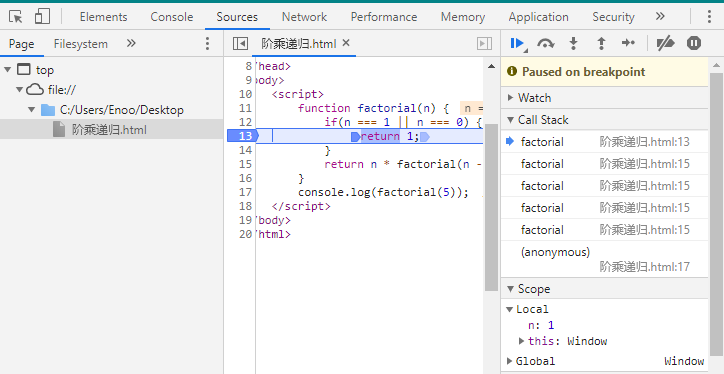
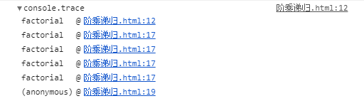
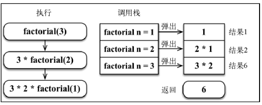
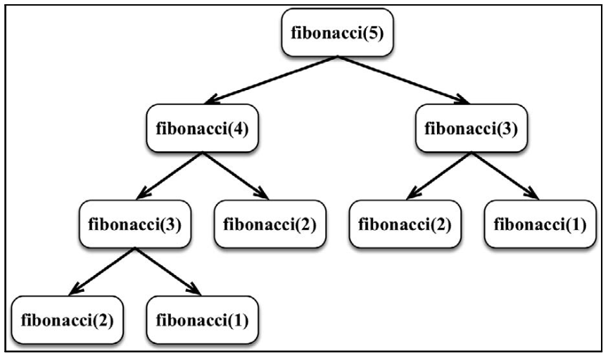
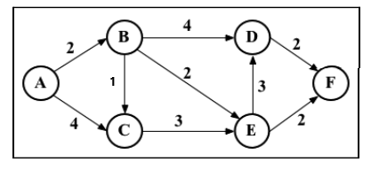

## 算法概述

​	算法（Algorithm）是指解题方案的准确而完整性的描述，是一系列解决问题的清晰指令，算法代表着用系统的方法描述解决问题的策略机制。也就是说，能够对一定规范的输入，在有限时间内获得所要求的输出。如果一个算法有缺陷，或不适合于某个问题，执行这个算法将不会解决这个问题。不同的算法可能用不同的空间、时间或效率来完成同样的任务。一个算法的优劣可以用空间复杂度和时间复杂的来衡量。

----------------

## 递归算法

​	**递归**（Recursion）是一种解决问题的方法，它从解决问题的各个小部分开始，直到解决最初的大问题。递归通常涉及函数调用自身。

​	每个递归函数都必须有**基线条件**，即一个不再递归调用的条件（**停止点**），以防止无限递归。

​	有一句编程的至理名言：“要理解递归，首先要理解递归。”

- 用JavaScript来表示，可以写成：

  ```js
  function recursion(param) {
      const recursionAnswer = confirm('你理解递归了吗？');
      if(recursionAnswer === true) {	// 基线条件或停止点
          return true;
      }
      recursion(recursionAnswer);
  }
  ```

  - recursion 函数会不断的调用自身，直到recursionAnswer 为真（true）。 recursionAnswer 为真就是上述代码的基线条件。

### 计算一个数的阶乘

​	数n的阶乘，定义为 n!，表示 1 到 n 的整数的乘积。

​	5 的阶乘为 5!，和 5 x 4 x 3 x 2 x 1 相等，结果是120。

#### 迭代阶乘

- 表示计算任意数 n 的阶乘的步骤，可以将步骤定义如下：(n) * (n-1) * (n-2) * (n-3) * ... * 1

- 可以使用循环来写：

  ```js
  function factorialIterative(number) {
  	if(number < 0) return undefined;
      let total = 1;
      for(let n = number; n > 1; n--) {
          total = total * n;
      }
      return total;
  }
  
  console.log(factorialIterative(5));	// 120
  ```

  - 注：可以从给定的number 开始计算阶乘，并减少 n，直到它的值为2，因为1的阶乘还是1，而且它已经被包含在total变量中了。零的阶乘也是1。负数的阶乘不会被计算。、

##### 递归阶乘

- 使用递归的 factorial 函数定义如下：

  ```js
  function factorial(n) {
      if(n === 1 || n === 0) { // 基线条件
  		return 1;
      }
      return n * factorial(n - 1); // 递归调用
  }
  console.log(factorial(5));	// 120
  ```

  - 过程：

    - （1）factorial(5) = 5 * factorial(4) ：我们可以用5 x 4! 来计算5!。
    - （2）factorial(5) = 5 * (4 * factorial(3)) ：我们需要计算子问题 4!，它可以用 4 × 3!来计算。

    - （3）factorial(5) = 5 * 4 * (3 * factorial(2)) ：我们需要计算子问题 3!，它可以用 3 × 2!来计算。
    - （4）factorial(5) = 5 * 4 * 3 * (2 * factorial(1)) ：我们需要计算子问题 2!，它可以用 2 × 1!来计算。
    - （5）factorial(5) = 5 * 4 * 3 * 2 * (1) ：我们需要计算子问题 1!。
    - （6）factorial(1) 或 factorial(0) 返回 1。1!等于 1。我们也可以说 1! = 1 × 0!，0!也等于 1。

- **调用栈**

  ​	每当一个函数被一个算法调用时，该函数会进入**调用栈**的顶部。当使用递归的时候，每个函数调用都会堆叠在调用栈的顶部，这是因为每个调用都可能依赖前一个调用的结果。

  ​	我们可以用浏览器看到**调用栈**的行为，如下图所示。

  ​	

  - 也可以在函数第一行加`console.trace();`

    

  - 下图展示了执行的各个步骤和调用栈中的行为：

    

    - 当 factorial(1)  返回 1 的时候，调用栈会开始弹出调用，返回结果，后续栈内函数依次计算并弹出。

- JavaScipt调用栈大小的限制：

  ​	如果忘记加上用以停止递归调用的基线条件，递归并不会无限的执行下去，浏览器会抛出错误，也就是所谓的栈溢出错误（stack overflow error）。
  
  ​	ES2015 有尾调用优化。如果函数内的最后一个操作是调用函数，会通过“跳转指令”(jump) 而不是“子程序调用"(subroutinecall)来控制。因此，具有停止递归的基线条件非常重要。

### 斐波那契数列

​		**斐波那契数列**是另一个可以用递归解决的问题。它是一个由0、1、1、2、3、5、8、13、21、34等数组成的序列。数2 由 1 + 1 得到，数 3 由 1 + 2 得到，数 5 由 2 + 3 得到，以此类推。斐波那契数列的定义如下。

- 位置- 的斐波那契数是零。
- 1 和 2 的斐波那契数是1。
- n（此处n > 2）的斐波那契数是 （n - 1) 的斐波那契数列加上（n-2）的斐波那契数。


#### 迭代求斐波那契数

- 用迭代的方法实现了fibonacci函数，如下所示:

  ```js
  function fibonacciIterative(n) {
      if(n < 1) return 0;
      if(n <= 2) return 1;
      
      let fibNum2 = 0;
      let fibNum1 = 1;
      let fib = n;
      for (let i = 2; i <= n; i++) {
          fib = fibNum1 + fibNum2; // f(n-1) + f(n-2)
          fibNum2 = fibNum1;
          fibNum1 = fib;
      }
      return fib;
  }
  ```


#### 递归求斐波那契数

- fibonacci 函数可以写成下面这样：

  ```js
  function fibonacci(n) {
      if(n < 1) return 0;
      if(n <= 2) return 1;
      return fibonacci(n - 1) + fibonacci(n - 2);
  }
  ```

  - 上面的代码中，有基线条件(第一二行)以及计算 n>2 的斐波那契数的逻辑。

  - 试着调用 fibonacci(5) ，下面是调用情况的结果。

     

#### 记忆化斐波那契数

​		第三种写法，叫做**记忆化**。记忆化是一种保存前一个结果的值的优化技术，类似于缓存。如果分析在计算 faibonacci(5) 时的调用，会发现 fibonacci(3) 被计算了两次，因此可以将它的结果存储下来，这样当需要再次计算它的时候，我们就直接拿取结果了。

```js
function fibonacciMemoization(n) {
    const memory = [0, 1]; // 缓存的数组
    const fibonacci = (n) => {
        if (memory[n] != null) return memory[n]; 
        return memory[n] = fibonacci(n - 1, memory) + fibonacci(n - 2, memory); 
    };
    return fibonacci(n);
}
```


- 注： 迭代的版本比递归的版本快很多，但是对于一些算法来说，迭代的解法可能不可用，而且ES6有了尾调用优化，递归的多余消耗甚至可能被消除。


## 图

### 最短路径算法

​		定义：如果从图中某一顶点（源点）到达另一顶点（终点）的路径可能不止一条，如何找到一条路径使得沿此路径上各边的权值综合（称为路径长度）达到最小。

​		两种比较常用的求最短路径算法：Dijkstra 算法、Flovd-Warshall 算法

#### Dijkstra（迪杰斯特拉）算法

​		Dijkstra 算法主要特点是以起始点（单源）为中心向外层层扩展，直到扩展到终点为止，就像剥洋葱一样，所以它也属于广度优先搜索。

​		算法思想是按路径长度的次序一步一步并入来求取，是贪心算法的一个应用，用来解决单源点到其余顶点的最短路径问题。

> ​		贪心算法（又称贪婪算法）是指，在对问题求解时，总是做出在当前看来是最好的选择。也就是说，不从整体最优上加以考虑，它所做出的是在某种意义的局部最优解。
>
> ​		贪心算法不是对所有问题都能得到整体最优解，关键是贪心策略的选择，选择的贪心策略必须具备无后效性，即某个状态以前的过程不会影响以后的状态，只与当前状态有关

注：Dijkstra 算法适用于边权为正的无向和有向图，不适用于有负边权的图。

**Dijkstra 算法的思路：**

1. 首先，Dijkstra 处理的是带正权值的有权图，需要一个二维数组（graph）存储各个点到达（边）的权值大小，（**邻接矩阵或者邻接表存储**）以及一个**源点（起始顶点）**的索引。
2. 其次，还需要一个数组（visited）来存储哪些顶点已经确定最短路径（即该顶点被访问过），和一个路径数组**dist 用于记录源点到各顶点的距离**（**在算法执行过程可能被多次更新**），下标表示顶点索引，元素值为距离。源点到自身的距离为0，源点无法到达的顶点的距离就是一个无穷大值（比如 Infinity)。
3. 以路径数组中路径值为最小（不包括已经被访问的顶点）的顶点 u 为中转跳点，遍历 u 的邻接顶点（也就是 `graph[u][v]~graph[u][length-1]`），假设 **u 到其邻接顶点 v 的距离（`graph[u][v]`）**加上顶点 **u 至源点的距离（dist[u]）** 还小于 **顶点 v 到源点的距离**，（即 `dist[u] + graph[u][v] < dist[v]`）那么就可以更新顶点 v 至源点的距离。
4. 重复上一步骤直到把每个顶点都访问完成，返回记录源点到各顶点的路径距离数组。



以上图为例：

首先先声明上图的邻接矩阵：

```js
var graph = [[0, 2, 4, 0, 0, 0], // A
             [0, 0, 1, 4, 2, 0], // B
             [0, 0, 0, 0, 3, 0], // C
             [0, 0, 0, 0, 0, 2], // D
             [0, 0, 0, 3, 0, 2], // E
             [0, 0, 0, 0, 0, 0]];// F
		   // A, B, C, D, E, F
```

Dijkstra 算法实现：

```js
/**
 * 计算路径数组中源点到未被访问顶点的最短路径
 * @param {*} dist     路径距离数组
 * @param {*} visited  访问记录数组
 */
const minDistance = (dist, visited) => {
    let min = INF;
    let minIndex = -1;
    for (let v = 0; v < dist.length; v++) {
        if (visited[v] === false && dist[v] <= min) {
            min = dist[v];
            minIndex = v;
        }
    }
    return minIndex;
};

/**
 * Dijkstra 算法求最短路径
 * @param {*} graph     图的邻接矩阵
 * @param {*} src       起始顶点的索引（源点）
 */
const dijkstra = (graph, startIndex) => {
    // 存储源点到各顶点路径距离的数组
    const dist = [];
    // 判断该顶点是否被访问过
    const visited = [];
    // 解构，获取顶点数量
    const { length } = graph;
    for(let i = 0; i < length; i++){
        // 将 dist 的每个元素都初始化为无穷大
        dist[i] = INF;
        // 将 visited 的每个元素初始化为 false 未访问状态
        visited[i] = false;
    }
    // 将源顶点到自身的距离设为0
    dist[startIndex] = 0;
    // 遍历每个顶点
    for (let i = 0; i < length; i++) {
        // 从尚未访问的顶点中选出距离最近的顶点
        const u = minDistance(dist, visited);
        // 把选出的顶点标为 visited，以免重复计算
        visited[u] = true;
        // 遍历 u 的邻接顶点
        for(let v = 0; v < length; v++){
            // 若 u 到邻接节点 v 的距离加上 u 到源点的距离小于 路径数组中 v 到源点的距离，即可更新为最短路径
            if(!visited[v] &&
                graph[u][v] !== 0 &&
                dist[u] !== INF &&
                dist[u] + graph[u][v] < dist[v])
            {
                // 更新最短路径的值
                dist[v] = dist [u] + graph[u][v];
            }
        }
    }
    return dist;
}
```

对本节开始的图执行以上算法，会得到如下输出。
`[0, 2, 3, 6, 4, 6]`

