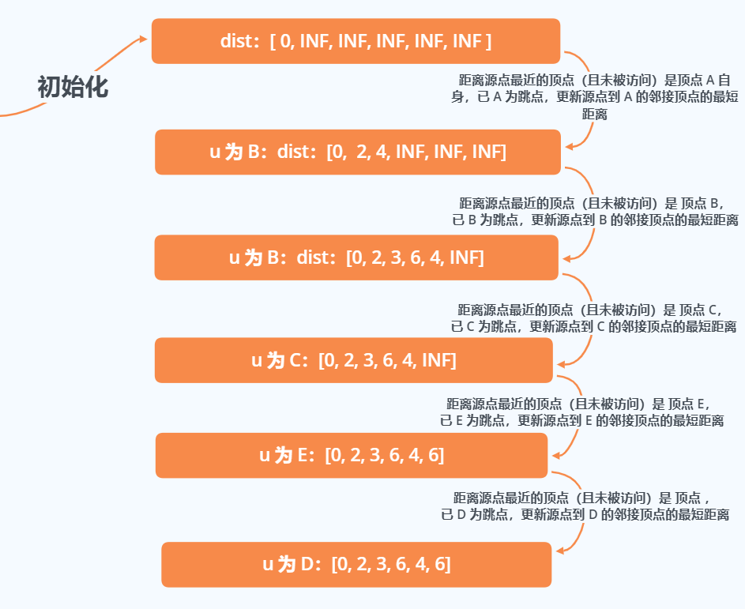
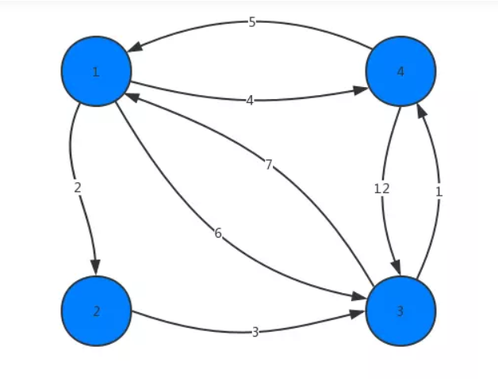
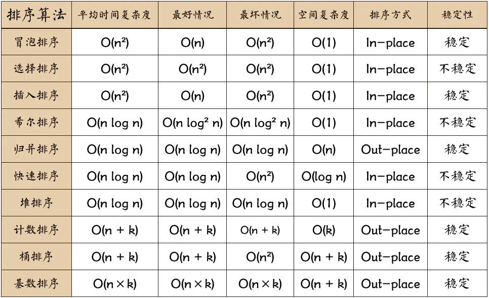
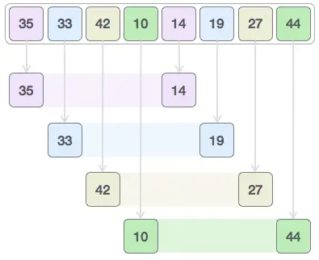
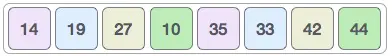
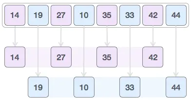
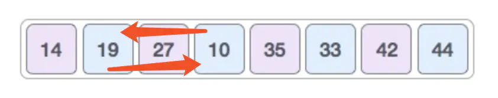
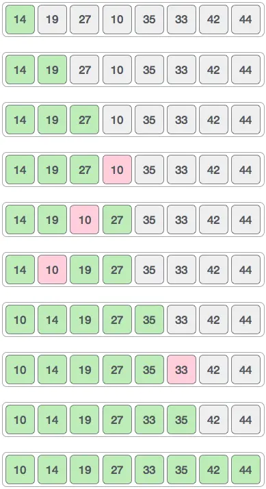

# 算法概述

​	算法（Algorithm）是指解题方案的准确而完整性的描述，是一系列解决问题的清晰指令，算法代表着用系统的方法描述解决问题的策略机制。也就是说，能够对一定规范的输入，在有限时间内获得所要求的输出。如果一个算法有缺陷，或不适合于某个问题，执行这个算法将不会解决这个问题。不同的算法可能用不同的空间、时间或效率来完成同样的任务。一个算法的优劣可以用空间复杂度和时间复杂的来衡量。

----------------

# 递归算法

​	**递归**（Recursion）是一种解决问题的方法，它从解决问题的各个小部分开始，直到解决最初的大问题。递归通常涉及函数调用自身。

​	每个递归函数都必须有**基线条件**，即一个不再递归调用的条件（**停止点**），以防止无限递归。

​	有一句编程的至理名言：“要理解递归，首先要理解递归。”

- 用JavaScript来表示，可以写成：

  ```js
  function recursion(param) {
      const recursionAnswer = confirm('你理解递归了吗？');
      if(recursionAnswer === true) {	// 基线条件或停止点
          return true;
      }
      recursion(recursionAnswer);
  }
  ```

  - recursion 函数会不断的调用自身，直到recursionAnswer 为真（true）。 recursionAnswer 为真就是上述代码的基线条件。

## 计算一个数的阶乘

​	数n的阶乘，定义为 n!，表示 1 到 n 的整数的乘积。

​	5 的阶乘为 5!，和 5 x 4 x 3 x 2 x 1 相等，结果是120。

## 迭代阶乘

- 表示计算任意数 n 的阶乘的步骤，可以将步骤定义如下：(n) * (n-1) * (n-2) * (n-3) * ... * 1

- 可以使用循环来写：

  ```js
  function factorialIterative(number) {
  	if(number < 0) return undefined;
      let total = 1;
      for(let n = number; n > 1; n--) {
          total = total * n;
      }
      return total;
  }
  
  console.log(factorialIterative(5));	// 120
  ```

  - 注：可以从给定的number 开始计算阶乘，并减少 n，直到它的值为2，因为1的阶乘还是1，而且它已经被包含在total变量中了。零的阶乘也是1。负数的阶乘不会被计算。、

## 递归阶乘

- 使用递归的 factorial 函数定义如下：

  ```js
  function factorial(n) {
      if(n === 1 || n === 0) { // 基线条件
  		return 1;
      }
      return n * factorial(n - 1); // 递归调用
  }
  console.log(factorial(5));	// 120
  ```

  - 过程：

    - （1）factorial(5) = 5 * factorial(4) ：我们可以用5 x 4! 来计算5!。
    - （2）factorial(5) = 5 * (4 * factorial(3)) ：我们需要计算子问题 4!，它可以用 4 × 3!来计算。

    - （3）factorial(5) = 5 * 4 * (3 * factorial(2)) ：我们需要计算子问题 3!，它可以用 3 × 2!来计算。
    - （4）factorial(5) = 5 * 4 * 3 * (2 * factorial(1)) ：我们需要计算子问题 2!，它可以用 2 × 1!来计算。
    - （5）factorial(5) = 5 * 4 * 3 * 2 * (1) ：我们需要计算子问题 1!。
    - （6）factorial(1) 或 factorial(0) 返回 1。1!等于 1。我们也可以说 1! = 1 × 0!，0!也等于 1。

- **调用栈**

  ​	每当一个函数被一个算法调用时，该函数会进入**调用栈**的顶部。当使用递归的时候，每个函数调用都会堆叠在调用栈的顶部，这是因为每个调用都可能依赖前一个调用的结果。

  ​	我们可以用浏览器看到**调用栈**的行为，如下图所示。

  ​	

  - 也可以在函数第一行加`console.trace();`

    

  - 下图展示了执行的各个步骤和调用栈中的行为：

    

    - 当 factorial(1)  返回 1 的时候，调用栈会开始弹出调用，返回结果，后续栈内函数依次计算并弹出。

- JavaScipt调用栈大小的限制：

  ​	如果忘记加上用以停止递归调用的基线条件，递归并不会无限的执行下去，浏览器会抛出错误，也就是所谓的栈溢出错误（stack overflow error）。
  
  ​	ES2015 有尾调用优化。如果函数内的最后一个操作是调用函数，会通过“跳转指令”(jump) 而不是“子程序调用"(subroutinecall)来控制。因此，具有停止递归的基线条件非常重要。

## 斐波那契数列

​		**斐波那契数列**是另一个可以用递归解决的问题。它是一个由0、1、1、2、3、5、8、13、21、34等数组成的序列。数2 由 1 + 1 得到，数 3 由 1 + 2 得到，数 5 由 2 + 3 得到，以此类推。斐波那契数列的定义如下。

- 位置- 的斐波那契数是零。
- 1 和 2 的斐波那契数是1。
- n（此处n > 2）的斐波那契数是 （n - 1) 的斐波那契数列加上（n-2）的斐波那契数。


## 迭代求斐波那契数

- 用迭代的方法实现了fibonacci函数，如下所示:

  ```js
  function fibonacciIterative(n) {
      if(n < 1) return 0;
      if(n <= 2) return 1;
      
      let fibNum2 = 0;
      let fibNum1 = 1;
      let fib = n;
      for (let i = 2; i <= n; i++) {
          fib = fibNum1 + fibNum2; // f(n-1) + f(n-2)
          fibNum2 = fibNum1;
          fibNum1 = fib;
      }
      return fib;
  }
  ```


## 递归求斐波那契数

- fibonacci 函数可以写成下面这样：

  ```js
  function fibonacci(n) {
      if(n < 1) return 0;
      if(n <= 2) return 1;
      return fibonacci(n - 1) + fibonacci(n - 2);
  }
  ```

  - 上面的代码中，有基线条件(第一二行)以及计算 n>2 的斐波那契数的逻辑。

  - 试着调用 fibonacci(5) ，下面是调用情况的结果。

     

## 记忆化斐波那契数

​		第三种写法，叫做**记忆化**。记忆化是一种保存前一个结果的值的优化技术，类似于缓存。如果分析在计算 faibonacci(5) 时的调用，会发现 fibonacci(3) 被计算了两次，因此可以将它的结果存储下来，这样当需要再次计算它的时候，我们就直接拿取结果了。

```js
function fibonacciMemoization(n) {
    const memory = [0, 1]; // 缓存的数组
    const fibonacci = (n) => {
        if (memory[n] != null) return memory[n]; 
        return memory[n] = fibonacci(n - 1, memory) + fibonacci(n - 2, memory); 
    };
    return fibonacci(n);
}
```


- 注： 迭代的版本比递归的版本快很多，但是对于一些算法来说，迭代的解法可能不可用，而且ES6有了尾调用优化，递归的多余消耗甚至可能被消除。


# 图

## 最短路径算法

​		定义：如果从图中某一顶点（源点）到达另一顶点（终点）的路径可能不止一条，如何找到一条路径使得沿此路径上各边的权值综合（称为路径长度）达到最小。

​		两种比较常用的求最短路径算法：Dijkstra 算法、Flovd-Warshall 算法

## Dijkstra（迪杰斯特拉）算法

​		Dijkstra 算法主要特点是以起始点（单源）为中心向外层层扩展，直到扩展到终点为止，就像剥洋葱一样，所以它也属于广度优先搜索。

​		算法思想是按路径长度的次序一步一步并入来求取，是贪心算法的一个应用，用来解决单源点到其余顶点的最短路径问题。

> ​		贪心算法（又称贪婪算法）是指，在对问题求解时，总是做出在当前看来是最好的选择。也就是说，不从整体最优上加以考虑，它所做出的是在某种意义的局部最优解。
>
> ​		贪心算法不是对所有问题都能得到整体最优解，关键是贪心策略的选择，选择的贪心策略必须具备无后效性，即某个状态以前的过程不会影响以后的状态，只与当前状态有关

注：Dijkstra 算法适用于边权为正的无向和有向图，不适用于有负边权的图。

**Dijkstra 算法的思路：**

1. 首先，Dijkstra 处理的是带正权值的有权图，需要一个二维数组（graph）存储各个点到达（边）的权值大小，（**邻接矩阵或者邻接表存储**）以及一个**源点（起始顶点）**的索引。
2. 其次，还需要一个数组（visited）来存储哪些顶点已经确定最短路径（即该顶点被访问过），和一个路径数组**dist 用于记录源点到各顶点的距离**（**在算法执行过程可能被多次更新**），下标表示顶点索引，元素值为距离。源点到自身的距离为0，源点无法到达的顶点的距离就是一个无穷大值（比如 Infinity)。
3. 以路径数组中路径值为最小（不包括已经被访问的顶点）的顶点 u 为中转跳点，遍历 u 的邻接顶点（也就是 `graph[u][v]~graph[u][length-1]`），假设 **u 到其邻接顶点 v 的距离（`graph[u][v]`）**加上顶点 **u 至源点的距离（dist[u]）** 还小于 **顶点 v 到源点的距离**，（即 `dist[u] + graph[u][v] < dist[v]`）那么就可以更新顶点 v 至源点的距离。
4. 重复上一步骤遍历`graph.length-1`次，返回记录源点到各顶点的路径距离数组。


以上图为例：

首先先声明上图的邻接矩阵：

```js
var graph = [[0, 2, 4, 0, 0, 0], // A
             [0, 0, 1, 4, 2, 0], // B
             [0, 0, 0, 0, 3, 0], // C
             [0, 0, 0, 0, 0, 2], // D
             [0, 0, 0, 3, 0, 2], // E
             [0, 0, 0, 0, 0, 0]];// F
		   // A, B, C, D, E, F
```

Dijkstra 算法实现：

```js
/**
 * 计算路径数组中源点到未被访问顶点的最短路径
 * @param {*} dist     路径距离数组
 * @param {*} visited  访问记录数组
 */
const minDistance = (dist, visited) => {
    let min = INF;
    let minIndex = -1;
    for (let v = 0; v < dist.length; v++) {
        if (visited[v] === false && dist[v] <= min) {
            min = dist[v];
            minIndex = v;
        }
    }
    return minIndex;
};

/**
 * Dijkstra 算法求最短路径
 * @param {*} graph     图的邻接矩阵
 * @param {*} src       起始顶点的索引（源点）
 */
const dijkstra = (graph, startIndex) => {
    // 存储源点到各顶点路径距离的数组
    const dist = [];
    // 判断该顶点是否被访问过
    const visited = [];
    // 解构，获取顶点数量
    const { length } = graph;
    for(let i = 0; i < length; i++){
        // 将 dist 的每个元素都初始化为无穷大
        dist[i] = INF;
        // 将 visited 的每个元素初始化为 false 未访问状态
        visited[i] = false;
    }
    // 将源顶点到自身的距离设为0
    dist[startIndex] = 0;
    // 遍历每个顶点
    for (let i = 0; i < length; i++) {
        // 从尚未访问的顶点中选出距离最近的顶点
        const u = minDistance(dist, visited);
        // 把选出的顶点标为 visited，以免重复计算
        visited[u] = true;
        // 遍历 u 的邻接顶点
        for(let v = 0; v < length; v++){
            // 若 u 到邻接节点 v 的距离加上 u 到源点的距离小于 路径数组中 v 到源点的距离，即可更新为最短路径
            if(!visited[v] &&
                graph[u][v] !== 0 &&
                dist[u] !== INF &&
                dist[u] + graph[u][v] < dist[v])
            {
                // 更新最短路径的值
                dist[v] = dist [u] + graph[u][v];
            }
        }
    }
    return dist;
}
```

对本节开始的图执行以上算法，会得到如下输出。
`[0, 2, 3, 6, 4, 6]`




## Floyd（弗洛伊德）算法

​		Floyd 算法是一个经典的动态规划算法。是解决任意两点间的最短路径（称为多源最短路径问题）的一种算法，可以正确处理有向图或负权的最短路径问题。

> 动态规划算法是一种将复杂问题分解成更小的相互依赖的子问题来解决的优化技术，最终合并各个拆分的小问题的解为整个问题的解。

**算法思想：**

从任意顶点 i 到任意顶点 j 的最短路径不外乎两种可能：

1. **直接从顶点 i 到顶点 j**
2. **从顶点 i 经过若干个顶点 k 到顶点 j。**

所以：

- 假设 `dist(i,j)` 为顶点 i 到顶点 j 的最短路径的距离，对于每个顶点 k，检查 i 到顶点 k 的距离 `dist(i,k)` 加上 顶点 k 到顶点 j 的距离 `dist(k,j)` 是否小于 `dist(i,j)` 即（**dist(i,k) + dist(k,j) < dist(i,j)**  是否成立。
- 如果成立，证明顶点 i 经过顶点 k 再到顶点 j 的路径比顶点 i 直接到顶点 j 的路径短，我们便设置 **dist(i,j) = dist(i,k) + dist(k,j)**，这样一来，当我们遍历完所有顶点 k，`dist(i,j)`中记录的便是节点 i 到节点 j 的最短路径的距离。
- 这里有点像向量，实际上就是找路径的中间点，如果更小，就赋值。为了求两点的最小距离，就不断找两点之间的其他点，相加的最小距离。

注：由于动态规划算法在执行过程中，需要保存大量的临时状态（即小问题的解），因此它适用于用**矩阵**来作为其数据结构

使用一个二维数组 `dist` 来存储图的距离信息，比如 A 到 B 之间的距离可以存储为 `graph[0][1]=2`，而无法直达的即记为无穷大（`Infinity`)。另外约定一个顶点到其本身的距离为 0（即 `graph[0][0]=0`）  

- Floyd 算法实现：

  ```js
  /**
   * Floyd-Warshall 算法
   * @param {*} dist     图的邻接矩阵
   */
  const floydWarshall = graph => {
      // 用来存储各个顶点之间的最短距离
      const dist = [];
      // 解构，图的顶点数量
      const { length } = graph;
      // 初始化为二维数组，并且初始化顶点间距离
      for(let i = 0; i < length; i++){
          dist[i] = [];
          for (let j = 0; j < length; j++) {
              if (i === j) {
                  // 顶点到自身的距离
                  dist[i][j] = 0;
              }else if(graph[i][j] == 0){
                  // 若两点之间不连通，则设为无穷大
                  dist[i][j] = INF;
              }else {
                  // 若连通（有值），则设置为距离
                  dist[i][j] = graph[i][j];
              }
          }
      }
      // 开始遍历所有顶点
      // 起始顶点 i
      for (let i = 0; i < length; i++) {
          // 中转顶点 k
          for (let k = 0; k < length; k++) {
              // 终点 j
              for (let j = 0; j < length; j++) {
                  // 如果顶点 i 经过顶点 k 再到顶点 j 的路径比顶点 i 直接到顶点 j 的路径短
                  // 那么更新 i 到 j 的距离
                  if(dist[i][k] + dist[k][j] < dist[i][j]) {
                      dist[i][j] = dist[i][k] + dist[k][j]; 
                  }
              }
          }
      }
      return dist;
  };
  ```

  

- 测试：

  

  - 结果：

    ```js
    0: (4) [0, 2, 5, 4]
    1: (4) [9, 0, 3, 4]
    2: (4) [6, 9, 0, 1]
    3: (4) [5, 7, 10, 0]
    ```

    


# 排序算法

## 算法分类

十种常见排序算法可以分为两大类：

- **比较类排序**：通过比较来决定元素间的相对次序，由于时间复杂度不能突破 `O(nlogn)`，因此也称为非线性时间比较类排序。
- **非比较类排序**：不通过比较来决定元素间的相对次序，它可以突破基于比较排序的时间下界，以线性时间允许，因此也称为线性时间非比较类排序


## 算法复杂度



**名词解释：**

- **n**：数据规模
- **k**："桶"的个数
- **In-place**：占用常用内存，不占用额外内存
- **Out-place**：占用额外内存
- **稳定性**：排序后 2 个相等键值的顺序和排序之前它们的顺序相同。
  - **稳定**：如果a原本在b前面，而 a=b，排序之后 a 仍然在b的前面。
  - **不稳定**：如果a原本在b的前面，而 a=b，排序之后 a 可能会出现在 b 的后面。
- **时间复杂度**：对排序数据的总的操作次数。反映当 n 变化时，操作次数呈现什么规律。
- **空间复杂度**：是指算法在计算机内执行时所需存储空间的度量，它也是数据规模 n 的函数

## 1. 冒泡排序（Bubble Sort）

​		人们开始学习排序算法时，通常都先学冒泡算法，因为它在所有的排序算法中最简单。然而，从运行时间的角度来看，冒泡排序是最差的一个，接下来你会知晓原因。

​		冒泡排序比较所有相邻的两个项，如果第一个比第二个大，则交换它们。元素项向上移动至正确的顺序，就好像气泡升至表面一样，冒泡排序因此得名。

### 1.1 算法描述

- 比较相邻的元素，如果第一个比第二个大，就交换它们两个；
- 对每一对相邻元素做同样的工作，从开始第一对到结尾的最后一堆，这样在最后的元素应该会是最大的数；
- 针对所有的元素重复以上的步骤，除了最后一个；
- 重复步骤 1~3，直到排序完成。

### 1.2 动画演示


### 1.3 代码实现

```js
function bubbleSort(arr) {
    var len = arr.length;
    // ES6 解构赋值
    // const { length } = arr;
    for (var i = 0; i < len; i++) {
        for (var j = 0; j < len - 1 - i; j++) {
            if (arr[j] > arr[j+1]) {        //相邻元素两两对比
                var temp = arr[j+1];        //元素交换
                arr[j+1] = arr[j];
                arr[j] = temp;
                // ES6  语法
				// [arr[j + 1], arr[j]] = [arr[j], arr[j + 1]];
            }
        }
    }
    return arr;
}
```

## 2. 选择排序（Selection Sort）

选择排序（Selection-sort）是一种简单直观的排序算法。它的工作原理：首先在未排序序列中找到最小（大）元素，存放到排序序列的起始位置，然后，再从剩余未排序元素中继续寻找最小（大）元素，然后放到已排序序列的末尾。以此类推，直到所有元素均排序完毕。

### 2.1 算法描述

n 个记录的直接选择排序可经过 n-1 趟直接排序得到有序结果。具体算法描述如下：

- 初始状态：无序区为 `R[1..n]`，有序区为空；
- 第 i 趟排序`（i = 1,2,3...n-1）` 开始时，当前有序区和无序区分别为`R[1..i-1]` 和 `R[i..n]`。该趟排序从当前无序区中选出关键字最小的记录 `R[k]`，将它与无序区的第一个记录 R 交换，使 `R[1..i]` 和 `R[i+1..n]` 分别变为记录个数增加1个的新有序区和记录个数减少1个的新无序区；
- n-1 趟结束，数组有序化了。

### 2.2 动图演示


### 2.3 代码实现

```js
function selectionSort(arr){
    var len = arr.length;
    var minIndex, temp;
    for(var i = 0; i < len - 1; i++){
        minIndex = i;
        for(var j = i + 1; j < len; j++){
            if(arr[j] < arr[minIndex]){		// 寻找最小的数
                minIndex = j;				// 将最小数的索引保存
            }
        }
        // 将最小值置于无序区的首位
        temp = arr[i];
        arr[i] = arr[minIndex];
        arr[minIndex] = temp;
    }
    return arr;
}
```

### 2.4 算法分析

表现最稳定的排序算法之一，因为无论什么数据进去都是`O(n^2)`的时间复杂度，所以用到它的时候，数据规模越小越好。唯一的好处可能就是不占用额外的内存空间了吧。理论上讲，选择排序可能也是平时排序一般人想到的最多的排序方法了吧。


## 3. 插入排序（Insertion Sort）

插入排序（Insertion-Sort）的算法描述是一种简单直观的排序算法。它的工作原理是通过构建有序序列，对于未排序数据，在已排序序列中从后向前扫描，找到相应位置并插入。

### 3.1 算法描述

一般来说，插入排序都采用 `in-place` 在数组上实现。具体算法描述如下：

- 从第一个元素开始，该元素可以认为已经被排序；
- 取出下一个元素，在已经排序的元素序列中从后向前扫描；
- 如果该元素（已排序）大于新元素，将该元素移到下一位置；
- 重复步骤3，直到已排序的元素小于或等于新元素的位置；
- 将新元素插入到该位置后；
- 重复步骤 2~5。

### 3.2 动图演示


### 3.3 代码实现

```js
function insertionSort(arr){
    var len = arr.length;
    var preIndex, current;
    for(var i = 1; i < len; i++){
        preIndex = i - 1;
        current = arr[i];
        // 如果前一个元素大于新元素，则将该元素移入下一位置
        while(preIndex >= 0 && arr[preIndex] > current){
            arr[preIndex + 1] = arr[preIndex];
            preIndex--;
        }
        // 将新元素插入到该位置后
        arr[preIndex + 1] = current;
    }
    return arr;
}
```

### 3.4 算法分析

插入排序在实现上，通常采用 `in-place` 排序（即只需要 `O(1)`的额外空间的排序），因而在从后向前扫描过程中，需要反复把已排序元素逐步向后挪位，为最新元素提供插入空间。


## 4. 希尔排序（Shell Sort）

1959 年 Shell 发明，第一个突破 `O(n^2)` 的排序算法，是简单插入排序的改进版。它与插入排序的不同之处在于，它会优先比较距离较远的元素，希尔排序又叫缩小增量排序。

### 4.1 算法描述

先将整个待排序的记录序列分割成为若干子序列分别进行直接插入排序，具体算法描述：

- 选择一个增量序列 `t1, t2,..., tk` ，其中 `ti > tj`，`tk = 1`;
- 按增量序列个数 k，对序列进行 k 趟排序
- 每趟排序，根据对应的增量 `ti`，将待排序列分割成若干长度为 m 的子序列，分别对各子表进行直接插入排序。仅增量因子为 1 时，整个序列作为一个表来处理，表长度即为整个序的长度 。

### 4.2 算法细解

1. 举个易于理解的例子：[35, 33, 42, 10, 14, 19, 27, 44]，我们采取间隔 4。创建一个位于 4 个位置间隔的所有值的虚拟子列表。下面这些值是 { 35, 14 }，{ 33, 19 }，{ 42, 27 } 和 { 10, 44 }。

   

2. 我们比较每个子列表中的值，并在原始数组中交换它们（如果需要）。完成此步骤后，新数组应如下所示。



3. 然后，我们采用 2 的间隔，这个间隙产生两个子列表：{ 14, 27, 35, 42 }， { 19, 10, 33, 44 }。

   

4. 我们比较并交换原始数组中的值（如果需要）。完成此步骤后，数组变成：[14, 10, 27, 19, 35, 33, 42, 44]，图如下所示，10 与 19 的位置互换一下。

   

5. 最后，我们使用值间隔 1 对数组的其余部分进行排序，Shell sort 使用插入排序对数组进行排序。

   

### 4.3 动图演示


### 4.4 代码实现

```js
function shellSort(arr){
    let len = arr.length,
        temp,
        // 动态定义间隔序列
        // 增量（一般第一趟取长度的一半，向下取整）
        gap = Math.floor(len / 2);
    // 每一次增量变为上次的一半，最后一次的增量 为 1
    // 增量为1即实现普通的插入排序，执行完毕整个排序肯定就完成了
    // 而最后一趟增量为1过完时，增量变成0
	// gap > 0是为了控制当增量变成0时，整个排序已完成，停止排序
    for(gap; gap > 0; gap = Math.floor(gap / 2)){
        // 以下开始即为普通的插入排序（按分好的组进行插入）
        // 初始 i = gap 是为了让第 gap + 1 个数和第一个数比
        // i < len 是从第 gap + 1 个数开始之后的每一个数都和之前相差 n 个增量的数相比
        for(let i = gap; i < len; i++){
            // 保存当前要拿来对比插入的数（比较数）
            temp = arr[i];
  			// j = i - gap 是将 temp 和之前差一个增量的数相比，arr[j] 即被比较熟
            // j >= 0 是按增量向前比，一直比到向前减一个增量没有数，即下标 j < 0
            // arr[j] > temp是判断被比较数是否大于比较数,
            // 如果大于，将被比较数向后移一个增量的位置，即比较数的位置 i或者j+gap
            // j -= gap 每次在上次被比较数的基础上向前比差一个增量的数
            for(let j = i - gap;; j >=0 && arr[j] > temp; j -= gap){
                arr[j + gap] = arr[j];
            }
            arr[j + gap] = temp;//插入比较数
        }
    }
    return arr;
}
```

```js
function shellSort(arr) {
	var len = arr.length,
		temp,
		//增量（一般第一趟取长度的一半向下取整）
		gap = Math.floor(len / 2); 
	//每一趟过后增量会变成原来的一半并向下取整，可知最后一趟增量肯定是1
	//增量为1即实现普通的插入排序，执行完毕整个排序肯定就完成了
	//而最后一趟增量为1过完时，增量变成0
	//gap > 0是为了控制当增量变成0时，整个排序已完成，停止排序
	for (gap; gap > 0; gap = Math.floor(gap / 2)) {
		//以下开始即普通的插入排序（按分好的组进行插入）
		//初始i=gap是为了让第gap+1个数和第一个数相比
		//i<len是从第gap+1个数开始之后的每一个数都和之前差n个增量的数相比
		for (var i = gap; i < len; i++) {
			//保存当前要拿来对比插入的数（比较数）
			temp = arr[i];
			//j=i-gap是将temp和之前差一个增量的数相比，arr[j]即被比较数
			//j>=0是按增量向前比，一直比到向前减一个增量没有数 即下标j<0
			//arr[j] > temp是判断被比较数是否大于比较数，
			//如果大于，将被比较数向后移一个增量的位置，
			//即比较数的位置 i或者j+gap
			//j -= gap 每次在上次被比较数的基础上向前比差一个增量的数
			for (var j = i-gap; j>=0 && arr[j]>temp; j-=gap) {
				//将被比较数向后移一个增量的位置，
				//即比较数的位置 i或者j+gap
				arr[j + gap] = arr[j];
			}
			arr[j + gap] = temp;//插入比较数
		}
	}
	return arr;
}
var arr = [99, 44, 38, 5, 47, 15, 36, 26, 27, 2, 46, 4, 19, 50, 48];
console.log(shellSort(arr));
//输出[2, 4, 5, 15, 19, 26, 27, 36, 38, 44, 46, 47, 48, 50, 99]
```

### 4.4 算法分析

希尔排序的核心在于间隔序列的设定。既可以提前设定好间隔序列，也可以动态的定义间隔序列。动态定义间隔序列的算法是《算法（第4版）》的合著者Robert Sedgewick提出的。　