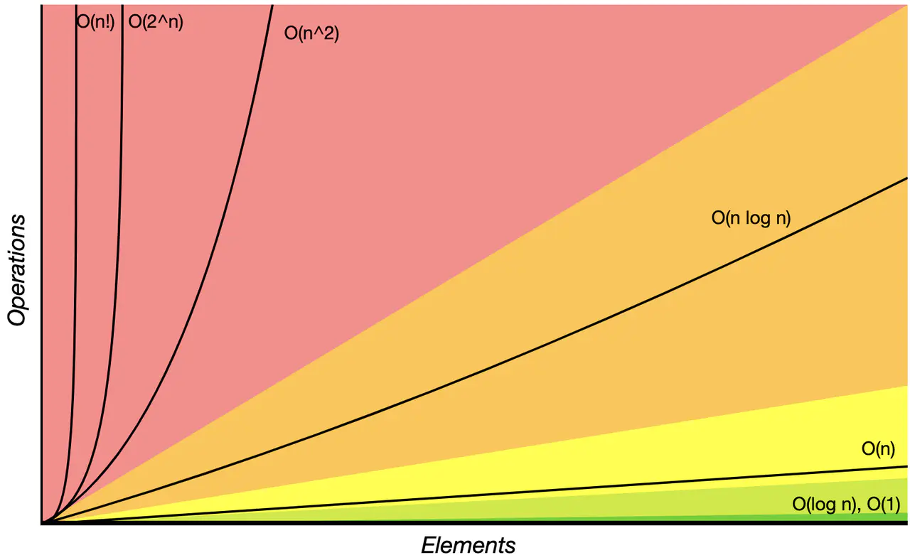

# 算法概述

​	算法（Algorithm）是指解题方案的准确而完整性的描述，是一系列解决问题的清晰指令，算法代表着用系统的方法描述解决问题的策略机制。也就是说，能够对一定规范的输入，在有限时间内获得所要求的输出。如果一个算法有缺陷，或不适合于某个问题，执行这个算法将不会解决这个问题。不同的算法可能用不同的空间、时间或效率来完成同样的任务。一个算法的优劣可以用空间复杂度和时间复杂的来衡量。

----------------

### **1. 算法的效率**

虽然计算机能快速的完成运算处理，但实际上，它也需要根据输入数据的大小和算法效率来消耗一定的处理器资源。要想编写出能高效运行的程序，我们就需要考虑到算法的效率。
算法的效率主要由以下两个复杂度来评估：
**时间复杂度**：评估执行程序所需的时间。可以估算出程序对处理器的使用程度。
**空间复杂度**：评估执行程序所需的存储空间。可以估算出程序对计算机内存的使用程度。

设计算法时，一般是要先考虑系统环境，然后权衡时间复杂度和空间复杂度，选取一个平衡点。不过，时间复杂度要比空间复杂度更容易产生问题，因此算法研究的主要也是时间复杂度，不特别说明的情况下，复杂度就是指时间复杂度。

### 2. 时间复杂度

**时间频度**
一个算法执行所耗费的时间，从理论上是不能算出来的，必须上机运行测试才能知道。但我们不可能也没有必要对每个算法都上机测试，只需知道哪个算法花费的时间多，哪个算法花费的时间少就可以了。并且一个算法花费的时间与算法中语句的执行次数成正比例，哪个算法中语句执行次数多，它花费时间就多。一个算法中的语句执行次数称为语句频度或时间频度。记为T(n)。

**时间复杂度**
前面提到的时间频度T(n)中，n称为问题的规模，当n不断变化时，时间频度T(n)也会不断变化。但有时我们想知道它变化时呈现什么规律，为此我们引入时间复杂度的概念。一般情况下，算法中基本操作重复执行的次数是问题规模n的某个函数，用T(n)表示，若有某个辅助函数f(n)，使得当n趋近于无穷大时，T（n)/f(n)的极限值为不等于零的常数，则称f(n)是T(n)的同数量级函数，记作T(n)=O(f(n))，它称为算法的渐进时间复杂度，简称**时间复杂度**。


### **3.大O表示法**

像前面用O( )来体现算法时间复杂度的记法，我们称之为大O表示法。
算法复杂度可以从最理想情况、平均情况和最坏情况三个角度来评估，由于平均情况大多和最坏情况持平，而且评估最坏情况也可以避免后顾之忧，因此一般情况下，我们设计算法时都要直接估算最坏情况的复杂度。
大O表示法O(f(n)中的f(n)的值可以为1、n、logn、n²等，因此我们可以将O(1)、O(n)、O(logn)、O(n²)分别可以称为常数阶、线性阶、对数阶和平方阶，那么如何推导出f(n)的值呢？我们接着来看推导大O阶的方法。

**推导大O阶**
推导大O阶，我们可以按照如下的规则来进行推导，得到的结果就是大O表示法：
1.用常数1来取代运行时间中所有加法常数。
2.修改后的运行次数函数中，只保留最高阶项
3.如果最高阶项存在且不是1，则去除与这个项相乘的常数。

**常数阶**
先举了例子，如下所示。

```java
  int sum = 0,n = 100; //执行一次  
  sum = (1+n)*n/2; //执行一次  
  System.out.println (sum); //执行一次复制代码
```

上面算法的运行的次数的函数为f(n)=3，根据推导大O阶的规则1，我们需要将常数3改为1，则这个算法的时间复杂度为O(1)。如果sum = （1+n）*n/2这条语句再执行10遍，因为这与问题大小n的值并没有关系，所以这个算法的时间复杂度仍旧是O(1)，我们可以称之为常数阶。

**线性阶**
线性阶主要要分析循环结构的运行情况，如下所示。

```js
for(int i=0;i<n;i++){
    //时间复杂度为O(1)的算法
    ...
}复制代码
```

上面算法循环体中的代码执行了n次，因此时间复杂度为O(n)。

**对数阶**
接着看如下代码：

```js
int number=1;
while(number<n){
    number=number*2;
    //时间复杂度为O(1)的算法
    ...
}复制代码
```

可以看出上面的代码，随着number每次乘以2后，都会越来越接近n，当number不小于n时就会退出循环。假设循环的次数为X，则由2^x=n得出x=log₂n，因此得出这个算法的时间复杂度为O(logn)。

**平方阶**
下面的代码是循环嵌套：

```
  for(int i=0;i<n;i++){   
      for(int j=0;j<n;i++){
         //复杂度为O(1)的算法
         ... 
      }
  }复制代码
```

内层循环的时间复杂度在讲到线性阶时就已经得知是O(n)，现在经过外层循环n次，那么这段算法的时间复杂度则为O(n²)。
接下来我们来算一下下面算法的时间复杂度：

```
  for(int i=0;i<n;i++){   
      for(int j=i;j<n;i++){
         //复杂度为O(1)的算法
         ... 
      }
  }复制代码
```

需要注意的是内循环中int j=i，而不是int j=0。当i=0时，内循环执行了n次；i=1时内循环执行了n-1次，当i=n-1时执行了1次，我们可以推算出总的执行次数为：

n+(n-1)+(n-2)+(n-3)+……+1
=(n+1)+[(n-1)+2]+[(n-2)+3]+[(n-3)+4]+……
=(n+1)+(n+1)+(n+1)+(n+1)+……
=(n+1)n/2
=n(n+1)/2
=n²/2+n/2

根据此前讲过的推导大O阶的规则的第二条：只保留最高阶，因此保留n²/2。根据第三条去掉和这个项的常数，则去掉1/2,最终这段代码的时间复杂度为O(n²)。

**其他常见复杂度**

除了常数阶、线性阶、平方阶、对数阶，还有如下时间复杂度：
f(n)=nlogn时，时间复杂度为O(nlogn)，可以称为nlogn阶。
f(n)=n³时，时间复杂度为O(n³)，可以称为立方阶。
f(n)=2ⁿ时，时间复杂度为O(2ⁿ)，可以称为指数阶。
f(n)=n!时，时间复杂度为O(n!)，可以称为阶乘阶。
f(n)=(√n时，时间复杂度为O(√n)，可以称为平方根阶。

常见的时间复杂度量级有：

- 常数阶)
- 线性阶)
- 平方阶)
- 立方阶)
- 对数阶)
- 线性对数阶)
- 指数阶)

#### 常数阶)

)，表示该算法的执行时间（或执行时占用空间）总是为一个常量，不论输入的数据集是大是小，只要是没有循环等复杂结构，那这个代码的时间复杂度就都是O(1)，如：

```
int i = 1;
int j = 2;
int k = i + j;
复制代码
```

上述代码在执行的时候，它消耗的时候并不随着某个变量的增长而增长，那么无论这类代码有多长，即使有几万几十万行，都可以用)来表示它的时间复杂度。

#### 线性阶)

)，表示一个算法的性能会随着输入数据的大小变化而线性变化，如

```
for (int i = 0; i < n; i++) {
	 j = i;
   j++;
}
复制代码
```

这段代码，for循环里面的代码会执行n遍，因此它消耗的时间是随着n的变化而变化的，因此这类代码都可以用)来表示它的时间复杂度。

#### 平方阶)

) 表示一个算法的性能将会随着输入数据的增长而呈现出二次增长。最常见的就是对输入数据进行嵌套循环。如果嵌套层级不断深入的话，算法的性能将会变为立方阶)，)，)以此类推

```
for(x=1; i<=n; x++){
   for(i=1; i<=n; i++){
       j = i;
       j++;
    }
}
复制代码
```

#### 指数阶)

)，表示一个算法的性能会随着输入数据的每次增加而增大两倍，典型的方法就是裴波那契数列的递归计算实现

```
int Fibonacci(int number)
{
    if (number <= 1) return number;

    return Fibonacci(number - 2) + Fibonacci(number - 1);
}
复制代码
```

#### 对数阶)

```
int i = 1;
while(i<n)
{
    i = i * 2;
}
复制代码
```

上面的代码，在while循环里面，每次都将 i 乘以 2，乘完之后，i 距离 n 就越来越近了，直到i不小于n退出。我们试着求解一下，假设循环次数为x，也就是说 2 的 x 次方等于 n，则由2^x=n得出x=log₂n。因此这个代码的时间复杂度为)

#### 线性对数阶)

线性对数阶)，就是将时间复杂度为对数阶)的代码循环n遍的话，那么它的时间复杂度就是 n * O(logN)，也就是了)，如下，

```
for(m=1; m<n; m++)
{
    i = 1;
    while(i<n)
    {
        i = i * 2;
    }
}
复制代码
```

除此之外，其实还有平均情况复杂度、最好时间复杂度、最坏时间复杂度。。。一般没有特殊说明的情况下，都是值最坏时间复杂度。


参考：[算法（一）时间复杂度](https://juejin.im/post/58d15f1044d90400691834d4)

### 4. 空间复杂度 （未）

空间复杂度（Space Complexity）是对一个算法在运行过程中临时占用存储空间大小的一个量度，同样反映的是一个趋势，一个算法所需的存储空间用f(n)表示。S(n)=O(f(n))，其中n为问题的规模，S(n)表示空间复杂度。

一个算法在计算机存储器上所占用的存储空间，包括存储算法本身所占用的存储空间，算法的输入输出数据所占用的存储空间和算法在运行过程中临时占用的存储空间这三个方面。

一般情况下，一个程序在机器上执行时，除了需要存储程序本身的指令、常数、变量和输入数据外，还需要存储对数据操作的存储单元。若输入数据所占空间只取决于问题本身，和算法无关，这样只需要分析该算法在实现时所需的辅助单元即可。若算法执行时所需的辅助空间相对于输入数据量而言是个常数，则称此算法为原地工作，空间复杂度为O(1)。当一个算法的空间复杂度与n成线性比例关系时，可表示为)，类比时间复杂度。

空间复杂度比较常用的有：O(1)、O(n)、O(n²)

#### 空间复杂度 )

如果算法执行所需要的临时空间不随着某个变量n的大小而变化，即此算法空间复杂度为一个常量，可表示为 O(1) 举例：

```
int i = 1;
int j = 2;
++i;
j++;
int m = i + j;
复制代码
```

代码中的 i、j、m 所分配的空间都不随着处理数据量变化，因此它的空间复杂度 S(n) = O(1)

#### 空间复杂度 )

```
int[] m = new int[n]
for(i=1; i<=n; ++i)
{
   j = i;
   j++;
}
复制代码
```

这段代码中，第一行new了一个数组出来，这个数据占用的大小为n，这段代码的2-6行，虽然有循环，但没有再分配新的空间，因此，这段代码的空间复杂度主要看第一行即可，即 S(n) = O(n)


作者：贾不假
链接：https://juejin.cn/post/6844904103194132494
来源：掘金
著作权归作者所有。商业转载请联系作者获得授权，非商业转载请注明出处。

# 递归算法

​	**递归**（Recursion）是一种解决问题的方法，它从解决问题的各个小部分开始，直到解决最初的大问题。递归通常涉及函数调用自身。

​	每个递归函数都必须有**基线条件**，即一个不再递归调用的条件（**停止点**），以防止无限递归。

​	有一句编程的至理名言：“要理解递归，首先要理解递归。”

- 用JavaScript来表示，可以写成：

  ```js
  function recursion(param) {
      const recursionAnswer = confirm('你理解递归了吗？');
      if(recursionAnswer === true) {	// 基线条件或停止点
          return true;
      }
      recursion(recursionAnswer);
  }
  ```

  - recursion 函数会不断的调用自身，直到recursionAnswer 为真（true）。 recursionAnswer 为真就是上述代码的基线条件。

## 计算一个数的阶乘

​	数n的阶乘，定义为 n!，表示 1 到 n 的整数的乘积。

​	5 的阶乘为 5!，和 5 x 4 x 3 x 2 x 1 相等，结果是120。

## 迭代阶乘

- 表示计算任意数 n 的阶乘的步骤，可以将步骤定义如下：(n) * (n-1) * (n-2) * (n-3) * ... * 1

- 可以使用循环来写：

  ```js
  function factorialIterative(number) {
  	if(number < 0) return undefined;
      let total = 1;
      for(let n = number; n > 1; n--) {
          total = total * n;
      }
      return total;
  }
  
  console.log(factorialIterative(5));	// 120
  ```

  - 注：可以从给定的number 开始计算阶乘，并减少 n，直到它的值为2，因为1的阶乘还是1，而且它已经被包含在total变量中了。零的阶乘也是1。负数的阶乘不会被计算。、

## 递归阶乘

- 使用递归的 factorial 函数定义如下：

  ```js
  function factorial(n) {
      if(n === 1 || n === 0) { // 基线条件
  		return 1;
      }
      return n * factorial(n - 1); // 递归调用
  }
  console.log(factorial(5));	// 120
  ```

  - 过程：

    - （1）factorial(5) = 5 * factorial(4) ：我们可以用5 x 4! 来计算5!。
    - （2）factorial(5) = 5 * (4 * factorial(3)) ：我们需要计算子问题 4!，它可以用 4 × 3!来计算。

    - （3）factorial(5) = 5 * 4 * (3 * factorial(2)) ：我们需要计算子问题 3!，它可以用 3 × 2!来计算。
    - （4）factorial(5) = 5 * 4 * 3 * (2 * factorial(1)) ：我们需要计算子问题 2!，它可以用 2 × 1!来计算。
    - （5）factorial(5) = 5 * 4 * 3 * 2 * (1) ：我们需要计算子问题 1!。
    - （6）factorial(1) 或 factorial(0) 返回 1。1!等于 1。我们也可以说 1! = 1 × 0!，0!也等于 1。

- **调用栈**

  ​	每当一个函数被一个算法调用时，该函数会进入**调用栈**的顶部。当使用递归的时候，每个函数调用都会堆叠在调用栈的顶部，这是因为每个调用都可能依赖前一个调用的结果。

  ​	我们可以用浏览器看到**调用栈**的行为，如下图所示。

  ​	

  - 也可以在函数第一行加`console.trace();`

    

  - 下图展示了执行的各个步骤和调用栈中的行为：

    

    - 当 factorial(1)  返回 1 的时候，调用栈会开始弹出调用，返回结果，后续栈内函数依次计算并弹出。

- JavaScipt调用栈大小的限制：

  ​	如果忘记加上用以停止递归调用的基线条件，递归并不会无限的执行下去，浏览器会抛出错误，也就是所谓的栈溢出错误（stack overflow error）。

  ​	ES2015 有尾调用优化。如果函数内的最后一个操作是调用函数，会通过“跳转指令”(jump) 而不是“子程序调用"(subroutinecall)来控制。因此，具有停止递归的基线条件非常重要。

## 斐波那契数列

​		**斐波那契数列**是另一个可以用递归解决的问题。它是一个由0、1、1、2、3、5、8、13、21、34等数组成的序列。数2 由 1 + 1 得到，数 3 由 1 + 2 得到，数 5 由 2 + 3 得到，以此类推。斐波那契数列的定义如下。

- 位置- 的斐波那契数是零。
- 1 和 2 的斐波那契数是1。
- n（此处n > 2）的斐波那契数是 （n - 1) 的斐波那契数列加上（n-2）的斐波那契数。


## 迭代求斐波那契数

- 用迭代的方法实现了fibonacci函数，如下所示:

  ```js
  function fibonacciIterative(n) {
      if(n < 1) return 0;
      if(n <= 2) return 1;
      
      let fibNum2 = 0;
      let fibNum1 = 1;
      let fib = n;
      for (let i = 2; i <= n; i++) {
          fib = fibNum1 + fibNum2; // f(n-1) + f(n-2)
          fibNum2 = fibNum1;
          fibNum1 = fib;
      }
      return fib;
  }
  ```


## 递归求斐波那契数

- fibonacci 函数可以写成下面这样：

  ```js
  function fibonacci(n) {
      if(n < 1) return 0;
      if(n <= 2) return 1;
      return fibonacci(n - 1) + fibonacci(n - 2);
  }
  ```

  - 上面的代码中，有基线条件(第一二行)以及计算 n>2 的斐波那契数的逻辑。

  - 试着调用 fibonacci(5) ，下面是调用情况的结果。

    

## 记忆化斐波那契数

​		第三种写法，叫做**记忆化**。记忆化是一种保存前一个结果的值的优化技术，类似于缓存。如果分析在计算 faibonacci(5) 时的调用，会发现 fibonacci(3) 被计算了两次，因此可以将它的结果存储下来，这样当需要再次计算它的时候，我们就直接拿取结果了。

```js
function fibonacciMemoization(n) {
    const memory = [0, 1]; // 缓存的数组
    const fibonacci = (n) => {
        if (memory[n] != null) return memory[n]; 
        return memory[n] = fibonacci(n - 1, memory) + fibonacci(n - 2, memory); 
    };
    return fibonacci(n);
}
```


- 注： 迭代的版本比递归的版本快很多，但是对于一些算法来说，迭代的解法可能不可用，而且ES6有了尾调用优化，递归的多余消耗甚至可能被消除。


# 图

## 最短路径算法

​		定义：如果从图中某一顶点（源点）到达另一顶点（终点）的路径可能不止一条，如何找到一条路径使得沿此路径上各边的权值综合（称为路径长度）达到最小。

​		两种比较常用的求最短路径算法：Dijkstra 算法、Flovd-Warshall 算法

## Dijkstra（迪杰斯特拉）算法

​		Dijkstra 算法主要特点是以起始点（单源）为中心向外层层扩展，直到扩展到终点为止，就像剥洋葱一样，所以它也属于广度优先搜索。

​		算法思想是按路径长度的次序一步一步并入来求取，是贪心算法的一个应用，用来解决单源点到其余顶点的最短路径问题。

> ​		贪心算法（又称贪婪算法）是指，在对问题求解时，总是做出在当前看来是最好的选择。也就是说，不从整体最优上加以考虑，它所做出的是在某种意义的局部最优解。
>
> ​		贪心算法不是对所有问题都能得到整体最优解，关键是贪心策略的选择，选择的贪心策略必须具备无后效性，即某个状态以前的过程不会影响以后的状态，只与当前状态有关

注：Dijkstra 算法适用于边权为正的无向和有向图，不适用于有负边权的图。

**Dijkstra 算法的思路：**

1. 首先，Dijkstra 处理的是带正权值的有权图，需要一个二维数组（graph）存储各个点到达（边）的权值大小，（**邻接矩阵或者邻接表存储**）以及一个**源点（起始顶点）**的索引。
2. 其次，还需要一个数组（visited）来存储哪些顶点已经确定最短路径（即该顶点被访问过），和一个路径数组**dist 用于记录源点到各顶点的距离**（**在算法执行过程可能被多次更新**），下标表示顶点索引，元素值为距离。源点到自身的距离为0，源点无法到达的顶点的距离就是一个无穷大值（比如 Infinity)。
3. 以路径数组中路径值为最小（不包括已经被访问的顶点）的顶点 u 为中转跳点，遍历 u 的邻接顶点（也就是 `graph[u][v]~graph[u][length-1]`），假设 **u 到其邻接顶点 v 的距离（`graph[u][v]`）**加上顶点 **u 至源点的距离（dist[u]）** 还小于 **顶点 v 到源点的距离**，（即 `dist[u] + graph[u][v] < dist[v]`）那么就可以更新顶点 v 至源点的距离。
4. 重复上一步骤遍历`graph.length-1`次，返回记录源点到各顶点的路径距离数组。


以上图为例：

首先先声明上图的邻接矩阵：

```js
var graph = [[0, 2, 4, 0, 0, 0], // A
             [0, 0, 1, 4, 2, 0], // B
             [0, 0, 0, 0, 3, 0], // C
             [0, 0, 0, 0, 0, 2], // D
             [0, 0, 0, 3, 0, 2], // E
             [0, 0, 0, 0, 0, 0]];// F
		   // A, B, C, D, E, F
```

Dijkstra 算法实现：

```js
/**
 * 计算路径数组中源点到未被访问顶点的最短路径
 * @param {*} dist     路径距离数组
 * @param {*} visited  访问记录数组
 */
const minDistance = (dist, visited) => {
    let min = INF;
    let minIndex = -1;
    for (let v = 0; v < dist.length; v++) {
        if (visited[v] === false && dist[v] <= min) {
            min = dist[v];
            minIndex = v;
        }
    }
    return minIndex;
};

/**
 * Dijkstra 算法求最短路径
 * @param {*} graph     图的邻接矩阵
 * @param {*} src       起始顶点的索引（源点）
 */
const dijkstra = (graph, startIndex) => {
    // 存储源点到各顶点路径距离的数组
    const dist = [];
    // 判断该顶点是否被访问过
    const visited = [];
    // 解构，获取顶点数量
    const { length } = graph;
    for(let i = 0; i < length; i++){
        // 将 dist 的每个元素都初始化为无穷大
        dist[i] = INF;
        // 将 visited 的每个元素初始化为 false 未访问状态
        visited[i] = false;
    }
    // 将源顶点到自身的距离设为0
    dist[startIndex] = 0;
    // 遍历每个顶点
    for (let i = 0; i < length; i++) {
        // 从尚未访问的顶点中选出距离最近的顶点
        const u = minDistance(dist, visited);
        // 把选出的顶点标为 visited，以免重复计算
        visited[u] = true;
        // 遍历 u 的邻接顶点
        for(let v = 0; v < length; v++){
            // 若 u 到邻接节点 v 的距离加上 u 到源点的距离小于 路径数组中 v 到源点的距离，即可更新为最短路径
            if(!visited[v] &&
                graph[u][v] !== 0 &&
                dist[u] !== INF &&
                dist[u] + graph[u][v] < dist[v])
            {
                // 更新最短路径的值
                dist[v] = dist [u] + graph[u][v];
            }
        }
    }
    return dist;
}
```

对本节开始的图执行以上算法，会得到如下输出。
`[0, 2, 3, 6, 4, 6]`


## Floyd（弗洛伊德）算法

​		Floyd 算法是一个经典的动态规划算法。是解决任意两点间的最短路径（称为多源最短路径问题）的一种算法，可以正确处理有向图或负权的最短路径问题。

> 动态规划算法是一种将复杂问题分解成更小的相互依赖的子问题来解决的优化技术，最终合并各个拆分的小问题的解为整个问题的解。

**算法思想：**

从任意顶点 i 到任意顶点 j 的最短路径不外乎两种可能：

1. **直接从顶点 i 到顶点 j**
2. **从顶点 i 经过若干个顶点 k 到顶点 j。**

所以：

- 假设 `dist(i,j)` 为顶点 i 到顶点 j 的最短路径的距离，对于每个顶点 k，检查 i 到顶点 k 的距离 `dist(i,k)` 加上 顶点 k 到顶点 j 的距离 `dist(k,j)` 是否小于 `dist(i,j)` 即（**dist(i,k) + dist(k,j) < dist(i,j)**  是否成立。
- 如果成立，证明顶点 i 经过顶点 k 再到顶点 j 的路径比顶点 i 直接到顶点 j 的路径短，我们便设置 **dist(i,j) = dist(i,k) + dist(k,j)**，这样一来，当我们遍历完所有顶点 k，`dist(i,j)`中记录的便是节点 i 到节点 j 的最短路径的距离。
- 这里有点像向量，实际上就是找路径的中间点，如果更小，就赋值。为了求两点的最小距离，就不断找两点之间的其他点，相加的最小距离。

注：由于动态规划算法在执行过程中，需要保存大量的临时状态（即小问题的解），因此它适用于用**矩阵**来作为其数据结构

使用一个二维数组 `dist` 来存储图的距离信息，比如 A 到 B 之间的距离可以存储为 `graph[0][1]=2`，而无法直达的即记为无穷大（`Infinity`)。另外约定一个顶点到其本身的距离为 0（即 `graph[0][0]=0`）  

- Floyd 算法实现：

  ```js
  /**
   * Floyd-Warshall 算法
   * @param {*} dist     图的邻接矩阵
   */
  const floydWarshall = graph => {
      // 用来存储各个顶点之间的最短距离
      const dist = [];
      // 解构，图的顶点数量
      const { length } = graph;
      // 初始化为二维数组，并且初始化顶点间距离
      for(let i = 0; i < length; i++){
          dist[i] = [];
          for (let j = 0; j < length; j++) {
              if (i === j) {
                  // 顶点到自身的距离
                  dist[i][j] = 0;
              }else if(graph[i][j] == 0){
                  // 若两点之间不连通，则设为无穷大
                  dist[i][j] = INF;
              }else {
                  // 若连通（有值），则设置为距离
                  dist[i][j] = graph[i][j];
              }
          }
      }
      // 开始遍历所有顶点
      // 起始顶点 i
      for (let i = 0; i < length; i++) {
          // 中转顶点 k
          for (let k = 0; k < length; k++) {
              // 终点 j
              for (let j = 0; j < length; j++) {
                  // 如果顶点 i 经过顶点 k 再到顶点 j 的路径比顶点 i 直接到顶点 j 的路径短
                  // 那么更新 i 到 j 的距离
                  if(dist[i][k] + dist[k][j] < dist[i][j]) {
                      dist[i][j] = dist[i][k] + dist[k][j]; 
                  }
              }
          }
      }
      return dist;
  };
  ```

  

- 测试：

  

  - 结果：

    ```js
    0: (4) [0, 2, 5, 4]
    1: (4) [9, 0, 3, 4]
    2: (4) [6, 9, 0, 1]
    3: (4) [5, 7, 10, 0]
    ```

    


# 排序算法

## 算法分类

十种常见排序算法可以分为两大类：

- **比较类排序**：通过比较来决定元素间的相对次序，由于时间复杂度不能突破 `O(nlogn)`，因此也称为非线性时间比较类排序。
- **非比较类排序**：不通过比较来决定元素间的相对次序，它可以突破基于比较排序的时间下界，以线性时间允许，因此也称为线性时间非比较类排序


## 算法复杂度


**名词解释：**

- **n**：数据规模
- **k**："桶"的个数
- **In-place**：占用常用内存，不占用额外内存
- **Out-place**：占用额外内存
- **稳定性**：排序后 2 个相等键值的顺序和排序之前它们的顺序相同。
  - **稳定**：如果a原本在b前面，而 a=b，排序之后 a 仍然在b的前面。
  - **不稳定**：如果a原本在b的前面，而 a=b，排序之后 a 可能会出现在 b 的后面。
- **时间复杂度**：对排序数据的总的操作次数。反映当 n 变化时，操作次数呈现什么规律。
- **空间复杂度**：是指算法在计算机内执行时所需存储空间的度量，它也是数据规模 n 的函数

## 1. 冒泡排序（Bubble Sort）

​		人们开始学习排序算法时，通常都先学冒泡算法，因为它在所有的排序算法中最简单。然而，从运行时间的角度来看，冒泡排序是最差的一个，接下来你会知晓原因。

​		冒泡排序比较所有相邻的两个项，如果第一个比第二个大，则交换它们。元素项向上移动至正确的顺序，就好像气泡升至表面一样，冒泡排序因此得名。

### 1.1 算法描述

- 比较相邻的元素，如果第一个比第二个大，就交换它们两个；
- 对每一对相邻元素做同样的工作，从开始第一对到结尾的最后一堆，这样在最后的元素应该会是最大的数；
- 针对所有的元素重复以上的步骤，除了最后一个；
- 重复步骤 1~3，直到排序完成。

### 1.2 动画演示


### 1.3 代码实现

```js
function bubbleSort(arr) {
    var len = arr.length;
    // ES6 解构赋值
    // const { length } = arr;
    for (var i = 0; i < len; i++) {
        for (var j = 0; j < len - 1 - i; j++) {
            if (arr[j] > arr[j+1]) {        //相邻元素两两对比
                var temp = arr[j+1];        //元素交换
                arr[j+1] = arr[j];
                arr[j] = temp;
                // ES6  语法
				// [arr[j + 1], arr[j]] = [arr[j], arr[j + 1]];
            }
        }
    }
    return arr;
}
```

## 2. 选择排序（Selection Sort）

选择排序（Selection-sort）是一种简单直观的排序算法。它的工作原理：首先在未排序序列中找到最小（大）元素，存放到排序序列的起始位置，然后，再从剩余未排序元素中继续寻找最小（大）元素，然后放到已排序序列的末尾。以此类推，直到所有元素均排序完毕。

### 2.1 算法描述

n 个记录的直接选择排序可经过 n-1 趟直接排序得到有序结果。具体算法描述如下：

- 初始状态：无序区为 `R[1..n]`，有序区为空；
- 第 i 趟排序`（i = 1,2,3...n-1）` 开始时，当前有序区和无序区分别为`R[1..i-1]` 和 `R[i..n]`。该趟排序从当前无序区中选出关键字最小的记录 `R[k]`，将它与无序区的第一个记录 R 交换，使 `R[1..i]` 和 `R[i+1..n]` 分别变为记录个数增加1个的新有序区和记录个数减少1个的新无序区；
- n-1 趟结束，数组有序化了。

### 2.2 动图演示


### 2.3 代码实现

```js
function selectionSort(arr){
    var len = arr.length;
    var minIndex, temp;
    for(var i = 0; i < len - 1; i++){
        minIndex = i;
        for(var j = i + 1; j < len; j++){
            if(arr[j] < arr[minIndex]){		// 寻找最小的数
                minIndex = j;				// 将最小数的索引保存
            }
        }
        // 将最小值置于无序区的首位
        temp = arr[i];
        arr[i] = arr[minIndex];
        arr[minIndex] = temp;
    }
    return arr;
}
```

### 2.4 算法分析

表现最稳定的排序算法之一，因为无论什么数据进去都是`O(n^2)`的时间复杂度，所以用到它的时候，数据规模越小越好。唯一的好处可能就是不占用额外的内存空间了吧。理论上讲，选择排序可能也是平时排序一般人想到的最多的排序方法了吧。


## 3. 插入排序（Insertion Sort）

插入排序（Insertion-Sort）的算法描述是一种简单直观的排序算法。它的工作原理是通过构建有序序列，对于未排序数据，在已排序序列中从后向前扫描，找到相应位置并插入。

### 3.1 算法描述

一般来说，插入排序都采用 `in-place` 在数组上实现。具体算法描述如下：

- 从第一个元素开始，该元素可以认为已经被排序；
- 取出下一个元素，在已经排序的元素序列中从后向前扫描；
- 如果该元素（已排序）大于新元素，将该元素移到下一位置；
- 重复步骤3，直到已排序的元素小于或等于新元素的位置；
- 将新元素插入到该位置后；
- 重复步骤 2~5。

### 3.2 动图演示


### 3.3 代码实现

```js
function insertionSort(arr){
    var len = arr.length;
    var preIndex, current;
    for(var i = 1; i < len; i++){
        preIndex = i - 1;
        current = arr[i];
        // 如果前一个元素大于新元素，则将该元素移入下一位置
        while(preIndex >= 0 && arr[preIndex] > current){
            arr[preIndex + 1] = arr[preIndex];
            preIndex--;
        }
        // 将新元素插入到该位置后
        arr[preIndex + 1] = current;
    }
    return arr;
}
```

### 3.4 算法分析

插入排序在实现上，通常采用 `in-place` 排序（即只需要 `O(1)`的额外空间的排序），因而在从后向前扫描过程中，需要反复把已排序元素逐步向后挪位，为最新元素提供插入空间。


## 4. 希尔排序（Shell Sort）

1959 年 Shell 发明，第一个突破 `O(n^2)` 的排序算法，是简单插入排序的改进版。它与插入排序的不同之处在于，它会优先比较距离较远的元素，希尔排序又叫缩小增量排序。

### 4.1 算法描述

先将整个待排序的记录序列分割成为若干子序列分别进行直接插入排序，具体算法描述：

- 选择一个增量序列 `t1, t2,..., tk` ，其中 `ti > tj`，`tk = 1`;
- 按增量序列个数 k，对序列进行 k 趟排序
- 每趟排序，根据对应的增量 `ti`，将待排序列分割成若干长度为 m 的子序列，分别对各子表进行直接插入排序。仅增量因子为 1 时，整个序列作为一个表来处理，表长度即为整个序的长度 。

### 4.2 算法细解

1. 举个易于理解的例子：[35, 33, 42, 10, 14, 19, 27, 44]，我们采取间隔 4。创建一个位于 4 个位置间隔的所有值的虚拟子列表。下面这些值是 { 35, 14 }，{ 33, 19 }，{ 42, 27 } 和 { 10, 44 }。

   

2. 我们比较每个子列表中的值，并在原始数组中交换它们（如果需要）。完成此步骤后，新数组应如下所示。


3. 然后，我们采用 2 的间隔，这个间隙产生两个子列表：{ 14, 27, 35, 42 }， { 19, 10, 33, 44 }。

   

4. 我们比较并交换原始数组中的值（如果需要）。完成此步骤后，数组变成：[14, 10, 27, 19, 35, 33, 42, 44]，图如下所示，10 与 19 的位置互换一下。

   

5. 最后，我们使用值间隔 1 对数组的其余部分进行排序，Shell sort 使用插入排序对数组进行排序。

   

### 4.3 动图演示


### 4.4 代码实现

```js
function shellSort(arr){
    let len = arr.length,
        temp,
        // 动态定义间隔序列
        // 增量（一般第一趟取长度的一半，向下取整）
        gap = Math.floor(len / 2);
    // 每一次增量变为上次的一半，最后一次的增量 为 1
    // 增量为1即实现普通的插入排序，执行完毕整个排序肯定就完成了
    // 而最后一趟增量为1过完时，增量变成0
	// gap > 0是为了控制当增量变成0时，整个排序已完成，停止排序
    for(gap; gap > 0; gap = Math.floor(gap / 2)){
        // 以下开始即为普通的插入排序（按分好的组进行插入）
        // 初始 i = gap 是为了让第 gap + 1 个数和第一个数比
        // i < len 是从第 gap + 1 个数开始之后的每一个数都和之前相差 n 个增量的数相比
        for(let i = gap; i < len; i++){
            // 保存当前要拿来对比插入的数（比较数）
            temp = arr[i];
  			// j = i - gap 是将 temp 和之前差一个增量的数相比，arr[j] 即被比较熟
            // j >= 0 是按增量向前比，一直比到向前减一个增量没有数，即下标 j < 0
            // arr[j] > temp是判断被比较数是否大于比较数,
            // 如果大于，将被比较数向后移一个增量的位置，即比较数的位置 i或者j+gap
            // j -= gap 每次在上次被比较数的基础上向前比差一个增量的数
            for(let j = i - gap;; j >=0 && arr[j] > temp; j -= gap){
                arr[j + gap] = arr[j];
            }
            arr[j + gap] = temp;//插入比较数
        }
    }
    return arr;
}
```

```js
function shellSort(arr) {
	var len = arr.length,
		temp,
		//增量（一般第一趟取长度的一半向下取整）
		gap = Math.floor(len / 2); 
	//每一趟过后增量会变成原来的一半并向下取整，可知最后一趟增量肯定是1
	//增量为1即实现普通的插入排序，执行完毕整个排序肯定就完成了
	//而最后一趟增量为1过完时，增量变成0
	//gap > 0是为了控制当增量变成0时，整个排序已完成，停止排序
	for (gap; gap > 0; gap = Math.floor(gap / 2)) {
		//以下开始即普通的插入排序（按分好的组进行插入）
		//初始i=gap是为了让第gap+1个数和第一个数相比
		//i<len是从第gap+1个数开始之后的每一个数都和之前差n个增量的数相比
		for (var i = gap; i < len; i++) {
			//保存当前要拿来对比插入的数（比较数）
			temp = arr[i];
			//j=i-gap是将temp和之前差一个增量的数相比，arr[j]即被比较数
			//j>=0是按增量向前比，一直比到向前减一个增量没有数 即下标j<0
			//arr[j] > temp是判断被比较数是否大于比较数，
			//如果大于，将被比较数向后移一个增量的位置，
			//即比较数的位置 i或者j+gap
			//j -= gap 每次在上次被比较数的基础上向前比差一个增量的数
			for (var j = i-gap; j>=0 && arr[j]>temp; j-=gap) {
				//将被比较数向后移一个增量的位置，
				//即比较数的位置 i或者j+gap
				arr[j + gap] = arr[j];
			}
			arr[j + gap] = temp;//插入比较数
		}
	}
	return arr;
}
var arr = [99, 44, 38, 5, 47, 15, 36, 26, 27, 2, 46, 4, 19, 50, 48];
console.log(shellSort(arr));
//输出[2, 4, 5, 15, 19, 26, 27, 36, 38, 44, 46, 47, 48, 50, 99]
```

### 4.4 算法分析

希尔排序的核心在于间隔序列的设定。既可以提前设定好间隔序列，也可以动态的定义间隔序列。动态定义间隔序列的算法是《算法（第4版）》的合著者Robert Sedgewick提出的。　


## 5. 归并排序（Merge Sort）

归并排序是建立在归并操作上的一种有效的排序算法。该算法是采用分治法（Divide and Conquer）的一个非常典型的应用。将已有序的子序列合并，得到完全有序的序列；即先使每个子序列有序，再使子序列段间有序。若将两个有序表合并成一个有序表，称为 **2-路归并**。

### 5.1 算法描述

- 把长度为 n 的输入序列分成两个长度为 n/2 的子序列；
- 对这两个子序列分别使用归并排序；
- 将两个排序号的子序列合并成一个最终的排序序列。

### 5.2 动图演示


### 5.3 代码实现

其思想是将原始数组切分成较小的数组，直到每个小数组只有一个位置，接着将小数组归并成较大的数组，直到最后只有一个排序完毕的大数组。

由于是分治法，归并排序也是递归的。我们要将算法分为两个函数：第一个负责将一个大数组分为多个校数组并调用用来排序的辅助函数

```js
function mergeSort(arr){	// 采用自上而下的递归法
    var len = arr.length;
    // 递归停止点：当数组被分割只剩下一个元素时，返回该数组
    if(len < 2){
        return arr;
    }
    // 把长度为 n 的输入序列分成两个长度为 n/2 的子序列
    var middle = Math.floor(len/2),
        left = arr.slice(0, middle),
        right = arr.silce(middle);
     return merge(mergeSort(left), mergeSort(right));
}

// 负责合并和排序小数组来尝试大数组
function merge(left, right){
    // 存储新数组
    var result = [];
   
    // 比较两个数组的首项，将较小的一位移除并推入新数组中，
    // 重复这个步骤，直至有一个数组为空
    while(left.length && right.length){
        if(left[0] <= right[0]){
            result.push(left.shift());
        }else{
            result.push(right.shift());
        }
    }
    
    // 将剩余的元素推入数组
    while (left.length)
        result.push(left.shift());
 
    while (right.length)
        result.push(right.shift());
    
    return result;
}
```

### 5.4 算法分析

归并排序是一种稳定的排序方法。和选择排序一样，归并排序的性能不受输入数据的影响，但表现比选择排序好的多，因为始终都是`O(nlogn）`的时间复杂度。代价是需要额外的内存空间。


## 6. 快速排序（Quick Sort）

快速排序的基本思想：通过一趟排序将待排记录分隔成独立的两部分，其中一部分记录的关键字均比另一部分的关键字小，则可分别对这两部分记录继续进行排序，以达到整个序列有序。

>快速排序的内循环比大多数排序算法都要短小，这意味着它无论是在理论上还是在实际中都要更快。它的主要缺点是非常脆弱，在实现时要非常小心才能避免低劣的性能。

### 6.1 算法描述

快速排序使用分治法来把一个串（list）分为两个子串（sub-list）。具体算法描述如下：

- 从数列中挑出一个元素，称为"基准"（pivot）；
- 重新排序数列，所有元素比基准值小的摆在基准前面，所有元素比基准值大的摆在基准的后面（相同的数可以到任一边）。在这个分区退出之后，该基准就处于数列的中间位置。这个称为分区（partition）操作；
- 递归地（recursive）把小于基准值元素的子数列和大于基准值元素的子数列排序。

### 6.2 动画演示


### 6.3 代码实现

第一种：对应动画

```js
function quickSort(arr, left, right){
    var len = arr.length,
        partitionIndex,
        left = typeof left != 'number' ? 0; left,
        right = typeof right != 'number' ? len - 1 : right;
    
    if(left < right){
        // 选取基准值，进行拆分
        partitionIndex = partition(arr, left, right);
        // 排序小于基准值的序列
        quickSort(arr, left, partitionIndex-1);
        // 排序大于基准值的序列
        quickSort(arr, partitionIndex+1, right);
    }
    
    return arr;
}
// 分区操作
function partition(arr, left, right){
    // 设定基准值（pivot）
    var pivot = left,
        // index 初始化为 1，也就是起始下标的下一个
        index = pivot + 1;
    // 循环
    for(var i = index; i <= right; i++){
        // 如果比基准点小就交换元素位置，然后 index++
        if(arr[i] < arr[pivot]){
            swap(arr, i, index);
            index++;
        }
    }
    // 最后将基准点插入到 index-1 的位置
    swap(arr,pivot, index-1);
    return index-1;
}

function swap(arr, i, j) {
    var temp = arr[i];
    arr[i] = arr[j];
    arr[j] = temp;
}
```

第二种：

```js
var quickSort = function(arr) {
  if (arr.length <= 1) {
    return arr;
  }
    // 基准值为数组的中间元素
  var pivotIndex = Math.floor(arr.length / 2);
  // 将基准值从数组删除取出
  var pivot = arr.splice(pivotIndex, 1)[0];
  var left = [];
  var right = [];

  for (var i = 0; i < arr.length; i++) {
    if (arr[i] < pivot) {
      left.push(arr[i]);
    } else {
      right.push(arr[i]);
    }
  }
  return quickSort(left).concat([pivot], quickSort(right));
};
```

以上代码的实现方式是，选择一个中间的数字为基准点，用两个数组分别去保存比基准数小的值，和比基准数大的值，最后递归数组左边和右边的数组，用 concat 去做一个数组的合并。

对于这段代码的分析：
缺点：

- 获取基准点使用了一个splice操作，在 js 中splice会对数组进行一次拷贝的操作，而它最坏的情况下复杂度为O(n)，而O(n)代表着针对数组规模的大小进行了一次循环操作。
- 首先我们每次执行都会使用到两个数组空间，产生空间复杂度。
- concat操作会对数组进行一次拷贝，而它的复杂度也会是O(n)
- 对大量数据的排序来说相对会比较慢

优点：

- 代码简单明了，可读性强，易于理解
- 非常适合用于面试笔试题

**总结**：

第一种的排序算法我们减少了两个`O(n)`的操作，得到了一定的性能上的提升，而第二种方法数据规模足够大的情况下会相对来说比较慢一些

## 7. 堆排序（Heap Sort）

堆排序（HeapSort）是指利用堆这种数据结构所设计的一种排序算法。堆是一个近似完全二叉树的结果，并且同时满足堆的性质：即子结点的键值或索引总是小于（或大于）它的父节点。

堆排序可以说是一种利用堆的概念来排序的选择排序。分为两种方法：

1. 大顶堆：每个节点的值都大于或小于其子节点的值，在堆排序算法中用于升序排列。
2. 小顶堆：每个节点的值都小于或等于其子节点的值，在堆排序算法中用于降序排列。

堆排序是不稳定的排序算法，因为排序的过程，存在最后一个节点和堆顶节点互换的操作，所以两个相同的数，经过排序后的位置与初始位置不一定一样。

### 7.1 算法描述

- 将初始待排序关键字序列`（R1，R2....Rn）`构建成大顶堆，此堆为初始的无序区；
- 将堆顶元素 `R[1]` 与最后一个元素 `R[n]` 交换，此时得到新的无序区`(R1, R2,...Rn-1)`和新的有序区 `(Rn)`，且满足 `R[1,2...,n-1] <= R[n]`;
- 由于交换后的新堆顶 `R[1]` 可能违反堆的性质，因此需要堆当前无序区`(R1,R2,……Rn-1)` 调整为新堆，然后再次将 `R[1]`与无序区最后一个元素交换，得到新的无序区`(R1,R2….Rn-2)`和新的有序区`(Rn-1,Rn)`。不断重复此过程直到有序区的元素个数为 `n-1`，则整个排序过程完成。

### 7.2 动图演示


### 7.3 代码实现

```js
var len;		// 因为声明的多个函数都需要数据长度，所以把 len 设置为全局变量

// 建立大顶堆
function buildMaxHeap(arr){
    len = arr.length;
    // 对下标 n/2 到 1 的数据进行碓队化，
    // 因为下标 n/2 + 1 到 n 的节点是叶子节点，不需要堆化
    for(var i = Math.floor(len/2); i >= 0; i--){
        heapify(arr, i);
    }
}

// 堆化
function heapify(arr,i){
    var left = 2 * i + 1,
        right = 2 * i + 2,
        // 假设最大值为当前节点
        largest = i;
    // 把当前节点与左右节点进行比较，若小于其中一个，则把当前节点和它进行交换
    if(left < len && arr[left] > arr[largest]){
        largest = left;
    }
    
    if (right < len && arr[right] > arr[largest]) {
        largest = right;
    }
    
    // 验证当前节点是否为最大节点，若是则不用交换
    if(largest != i){
        // 将当前节点和最大子节点进行交换
        swap(arr, i, largest);
        // 继续堆化(下沉)，看是否需要调整
        heapify(arr, largest);
    }
    
}


// 交换函数
function swap(arr, i, j) {
    var temp = arr[i];
    arr[i] = arr[j];
    arr[j] = temp;
}

function headSort(arr){
    // 初始化堆
    buildMaxHeap(arr);
    
    for (var i = arr.length-1; i > 0; i--) {
        // 将第一个节点替换为堆最后一个元素
        swap(arr, 0, i);
        len--;
        // 进行堆化，直到堆的大小为1；
        heapify(arr, 0);
    }
    return array;
}
```

- 初始化堆的思路：从后往前处理数组，并且每个数据都是从上往下堆化。因为叶子节点往下堆化只能自己跟自己比较，所以直接从第一个非叶子节点（倒数第二层）开始，依次堆化。（另一种思路是在堆种插入一个元素的思路：尽管数组种包含 n 个元素，但是可以假设，起初堆种只包含一个数据，就是下标为0 的数据，然后将下标 从 1 到 n的数据依次插入到堆中 ）。

- 注：实际上，对于完全二叉树来说，下标从 n/2 + 1 到 n 的节点都是叶子节点。


## 8. 计数排序（Counting Sort）

计数排序不是基于比较的排序算法，其核心在于**将输入的数据值转化为键存储在额外开辟的数组空间中**。作为一种线性时间复杂度的排序，计数排序要求输入的输入的数据必须是有确定范围的整数。

### 8.1 算法描述

- 找出待排序的数组中最大和最小的元素；
- 统计数组中每个值为 i 的元素出现的次数，存入数组 C 的第 i 项；
- 对所有的计数累加（从 C 中的第一个元素开始，每一项和前一项相加）；
- 反向填充目标数组：将每个元素 i 放在新数组的第 `C(i)` 项，每放一个元素就将 `C(i)` 减去 1 。

### 8.2 动图演示


### 8.3 代码实现

```js
function countingSort(arr){
    // ES6： 
    // let maxValue = Math.max(...arr);
    var maxValue = findMaxValue(arr);
    // 计数数组，用来统计结果，下标表示待排数组的元素，元素为元素的个数。
    var bucket = new Array(maxValue + 1),
        // 已排序数组的索引
        sortedIndex = 0,
        arrLen = arr.length,
        bucketLen = maxValue + 1;
    
    // 计数
    for(var i = 0; i < arrLen; i++){
        // 为了确保递增操作成功，初始化元素的位置
        if(!bucket[arr[i]]){
            bucket[arr[i]] = 0;
        }
        // 对应位置增加元素计数值
        bucket[arr[i]]++;
    }
    
    // 反向填充数组，即为从小到大的排序数组
    for(var j = 0; j < bucketLen; j++){
        while(bucket[j] > 0){
            arr[sortedIndex++] = j;
            bucket[j]--;
        }
    }
    
    return arr;
}

// 寻找数组中的最大值
function findMaxValue(array){
    let max = array[0];
    for (let i = 1; i < array.length; i++) {
        if (array[i] > max) {
            max = array[i];
        }
    }
    return max;
}
```

### 8.4 算法分析

计数排序是一个稳定的排序算法。当输入的元素是 n 个 0到 k 之间的整数时，时间复杂度是O(n+k)，空间复杂度也是O(n+k)，其排序速度快于任何比较排序算法。当k不是很大并且序列比较集中时，计数排序是一个很有效的排序算法。


## 9. 桶排序（Bucket Sort）

桶排序是计数排序的升级版。它利用函数的映射关系，高效与否的关键就在于这个映射函数的确定。桶排序（Bucket sort）的工作原理：假如输入数据服从均匀分布，将数据分到有限数量的桶里，每个桶再分别排序（有可能再用别的排序算法或是以递归方式继续使用桶排序进行排序）。

为了使桶排序更加高效，我们需要做到这两点：

1. 在额外空间充足的情况下，尽量增大桶的数量
2. 使用的映射函数能够将输入的N个数据均匀的分配到K个桶中

同时，对于桶中元素的排序，选择何种比较排序算法对于性能的影响至关重要。

### 9.1 算法描述

- 设置一个定量的数组当作空桶；
- 遍历输入数据，并且把数据一个一个放到对应的桶里去；
- 对每个不是空的桶进行排序；
- 从不是空的桶里把排好序的数据拼接起来。

### 9.2 图片演示


### 9.3 代码实现

使用插入排序（用来排序小数组的不错的算法），来对每个桶进行排序。

```JS
function bucketSort(arr, bucketSize){
    if(arr.length === 0){
        return arr;
    }
    
    var i,
        minValue = arr[0],
        maxValue = arr[0];
    for (i = 1; i < arr.length; i++) {
      if (arr[i] < minValue) {
          minValue = arr[i];                //输入数据的最小值
      } else if (arr[i] > maxValue) {
          maxValue = arr[i];                //输入数据的最大值
      }
    }
    
    // 桶的初始化
    var DEFAULT_BUCKET_SIZE = 5;            //设置桶的默认数量为5
    bucketSize = bucketSize || DEFAULT_BUCKET_SIZE;
    // 计算每个桶中需要分布的元素个数
    var bucketCount = Math.floor((maxValue - minValue) / bucketSize) + 1;
    var buckets = new Array(bucketCount);
    // 初始化矩阵
    for (i = 0; i < buckets.length; i++) {
        buckets[i] = [];
    }
    
    // 利用映射函数将数据分配到各个桶中
    for(i = 0; i < arr.length; i++){
        buckets[Math.floor((arr[i] - minValue) / bucketSize)].push(arr[i]);
    }
    
    arr.length = 0;
    for((i = 0; i < buckets.length; i++){
        insertionSort(buckets[i]);
        // 将排序好的桶的所有元素加入数组中
        // ES6：arr.push(...buckets[i]);
         for (var j = 0; j < buckets[i].length; j++) {
            arr.push(buckets[i][j]);                      
        }
    }

	return arr;
}
```

### 9.4 算法分析

桶排序最好情况下使用线性时间O(n)，桶排序的时间复杂度，取决与对各个桶之间数据进行排序的时间复杂度，因为其它部分的时间复杂度都为O(n)。很显然，桶划分的越小，各个桶之间的数据越少，排序所用的时间也会越少。但相应的空间消耗就会增大。 


## 10. 基数排序（Radix Sort）

基数排序是按照低位先排序，然后收集；再按照高位排序，然后再收集；依次类推，直到最高位。有时候有些升序是有优先级顺序的，先按低优先级排序，再按高优先级排序。最后的次序就是高优先级高的在前，高优先级相同的低优先级高的在前。

基数排序适用于：

*  (1) 数据范围较小，建议在小于1000
*  (2) 每个数值都要大于等于0

### 10.1 算法描述

- 取得数组中的最大数，并取得位数；
- arr 为原始数组，从最低位开始取每个位组成 radix 数组；
- 对 radix 进行计数排序（利用计数排序适用于小范围数的特点）；

### 10.2 动图演示


### 10.3 代码实现

```js
// 计数器，桶
var counter = [];
function radixSort(arr, maxDigit){
    var mod = 10;
    var dev = 1;
    // 先基于最后一位有效位数进行排序，每次循环后要乘10 也就是要判断下一位 比如当前是个位 下次就要判断十位
    for(var i = 0; i < maxDigit; i++, dev *= 10, mod *= 10){
        for(var j = 0; j < arr.length; j++){
            // digit 表示 i 位数的值
            var bucket = parseInt((arr[j] % mod) / dev);
            if(counter[bucket] == null){
                counter[bucket] = [];
            }
            // 把该位数的值放到桶中
            counter[bucket].push(arr[j]);
        }
        
        // 出桶，从桶中取值
        // 完成此步后，就完成了一次位数排序
        var pos = 0;
        for(var j = 0; j < counter.length; j++) {
            var value = null;
            if(counter[j]!=null) {
                // shift 从头部取值
                // 保证队列先入先出
                while ((value = counter[j].shift()) != null) {
                      arr[pos++] = value;
                }
          }
        }
    }
    return arr;
}
```

### 10.4 算法分析

基数排序基于分别排序，分别收集，所以是稳定的。但基数排序的性能比桶排序要略差，每一次关键字的桶分配都需要O(n)的时间复杂度，而且分配之后得到新的关键字序列又需要O(n)的时间复杂度。假如待排数据可以分为d个关键字，则基数排序的时间复杂度将是O(d*2n) ，当然d要远远小于n，因此基本上还是线性级别的。

基数排序的空间复杂度为O(n+k)，其中k为桶的数量。一般来说n>>k，因此额外空间需要大概n个左右。

## 非比较排序

### 基数排序 vs 计数排序 vs 桶排序

这三种排序算法都利用了桶的概念，但对桶的使用方法上有明显差异：
 基数排序：根据键值的每位数字来分配桶
 计数排序：每个桶只存储单一键值
 桶排序：每个桶存储一定范围的数值

## 复杂度速查表

#### 图例


#### 大-O 复杂度曲线



### 抽象数据结构的操作复杂度


#### 数组排序


#### 图操作


#### 堆操作

