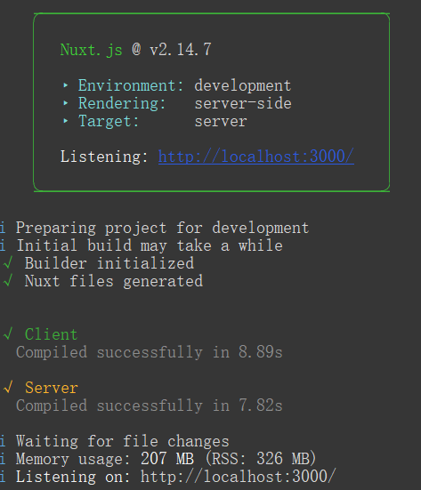
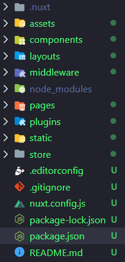

# NuxtJS 学习

官网：[NuxtJS](https://www.nuxtjs.cn/)

## 一、安装、启动项目

```bash
npx create-nuxt-app <项目名>
```

运行完后，将安装所有依赖项，因此下一步是启动项目：

```bash
cd <project-name>
npm run dev
```



## 二、目录结构



- **assets**：资源目录。用于组织未编译的静态资源如  `LESS`、`SASS` 或 `JavaScript`。
- **components**：组件目录。用于组织应用的 **Vue.js** 组件。**Nuxt.js** 不会扩展增强该目录下 Vue.js 组件，即这些组件不会像页面组件那样有 `asyncData` 方法的特性。
- **layouts**：布局目录。用于组织应用的布局组件。
- **middleware**：中间件目录。用于存放应用的中间件。
- **pages**：页面目录。用于组织应用的路由及视图。**Nuxt.js** 框架读取该目录下所有的 `.vue` 文件并自动生成对应的路由配置。
- **plugins**：插件目录。用于组织那些需要在 `根 vue.js 应用` 实例化之前需要运行的 JavaScript 插件。
- **static**：静态文件目录。用于存放应用的静态文件，此类文件不会被 **Nuxt.js** 调用 **Webpack** 进行构建编译出来。服务器启动的时候，该目录下的文件会映射到应用的根路径 `/` 下。
- **store**：Store 目录。用于组织应用的 **Vue 状态树** 文件。**Nuxt.js** 框架集成了 **Vue 状态树** 的相关功能配置，在 `store` 目录下创建一个 `index.js` 文件可激活这些配置。
- **nuxt.config.js**：`nuxt.config.js` 文件。用于组织 **Nuxt.js** 应用的个性化配置，以便覆盖默认配置。

- **package.json**：`package.json` 文件。用于描述应用的依赖关系和对外暴露的脚本接口。


## 三、配置

### css

该配置项用于定义应用的全局（所有页面均需引用的）样式文件、模块或第三方库。

```js
css: [
    'element-ui/lib/theme-chalk/index.css',
    '~/assets/css/common.css'
  ],
```

### build

Nuxt.js 允许你在自动生成的 `vendor.bundle.js` 文件中添加一些模块，以减少应用 bundle 的体积。如果你的应用依赖第三方模块，这个配置项是十分实用的。

```js
  build: {
    analyze: true,
    vendor: [],
    maxChunkSize: 300000,
    optimization: {
      splitChunks: {
        minSize: 10000,
        maxSize: 250000
      }
    },
    babel: {
      plugins: [
          [
              'component',
              {
                  'libraryName': 'element-ui',
                  'styleLibraryName': 'theme-chalk'
              },
              
          ]
      ]
  },
```

### generate

该配置项用于定义每个动态路由的参数，Nuxt.js 依据这些路由配置生成对应目录结构的静态文件。

```js
generate: {
    dir: 'dist/tenbay',
    routes: [
      '/product/ap3300',
      '/product/ap3750',
    ] 
  },
```

- 类型： `Object`

> 配置 Nuxt.js 应用生成静态站点的具体方式。

当运行 `nuxt generate` 命令或在编码中调用 `nuxt.generate()` 时，Nuxt.js 会使用 `generate` 属性的配置。

#### dir

- 类型： 'String'
- 默认值： `'dist'`

`nuxt generate` 生成的目录名称

#### routes

- 类型： `Array`

在 Nuxt.js 执行 `generate` 命令时，[动态路由](https://www.nuxtjs.cn/guide/routing#动态路由) 会被忽略。


