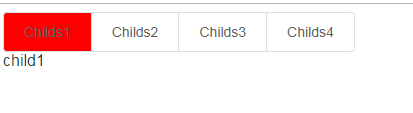

# Vue 基本使用

## 动态组件

### 基本使用

[Vue-动态组件](https://cn.vuejs.org/v2/guide/components.html#%E5%8A%A8%E6%80%81%E7%BB%84%E4%BB%B6)

用途：在不同组件之间进行动态的切换。



可以通过 Vue 的 `<component>` 元素加一个特殊的 `is` attribute 来实现：

```vue
<!-- 组件会在 `currentTabComponent` 改变时改变 -->
<component v-bind:is="currentTabComponent"></component>
```

`currentTabComponent` 可以包括

- 已注册组件的名字，或
- 一个组件的选项对象

### 动态组件缓存（keep-alive）

当在这些组件之间切换的时候，你有时会想保持这些组件的状态，以避免重复渲染导致的性能问题。在每次切换新标签的时候，Vue 都创建了一个新的 `currentTabComponent` 实例

在某些情况下，标签的组件实例需要在第一次被创建的时候缓存下来。

可以使用 `<keep-alive>` 元素将其动态组件包裹起来。

```vue
<keep-alive>
	<component v-bind:is="currentTabComponent"></component>
</keep-alive>
```

 