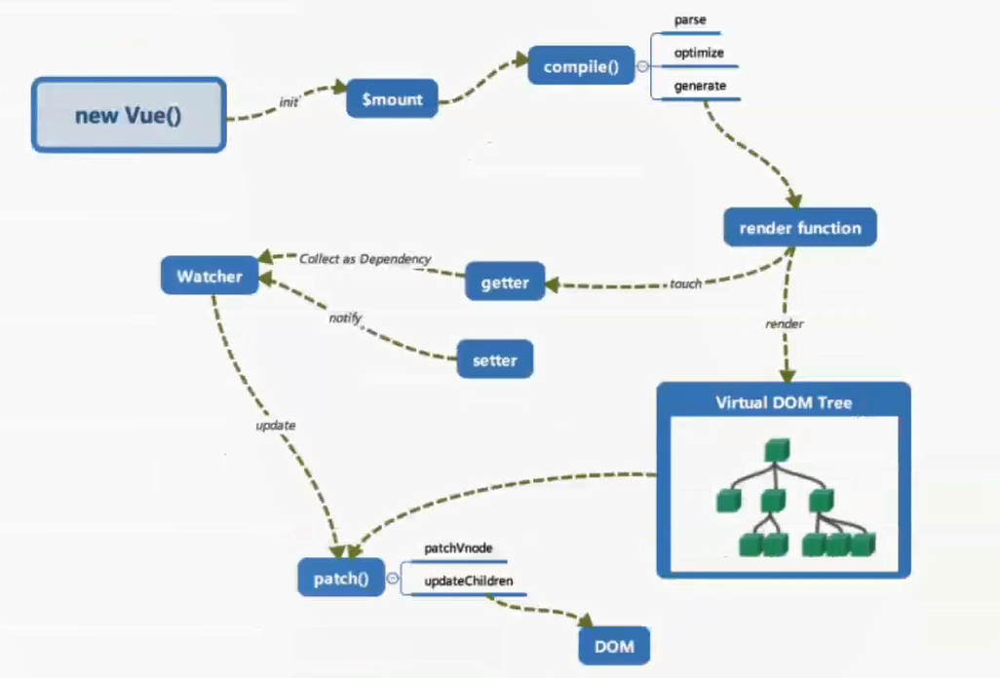

### Vue 工作机制

#### 初始化

在 `new Vue()` 之后。Vue 会调用进行初始化，会初始化生命周期、事件、props、methods、data、computed 与 watch 等。其中最重要的是通过 `Object.defineProperty` 设置 `setter` 与 `getter`，用来实现 [**响应式**] 以及 [**依赖收集**]。

初始化之后调用 `$mount` 挂载组件

