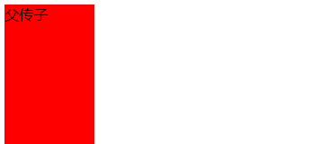
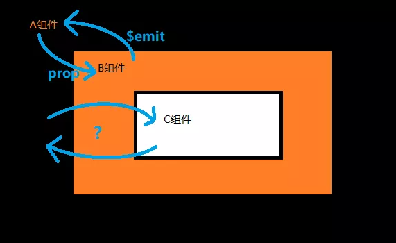
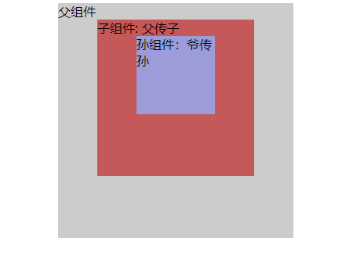
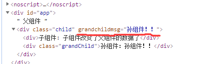
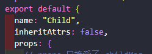
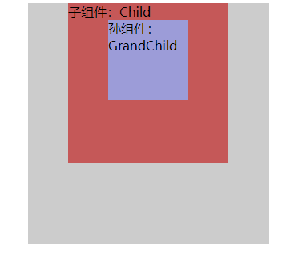
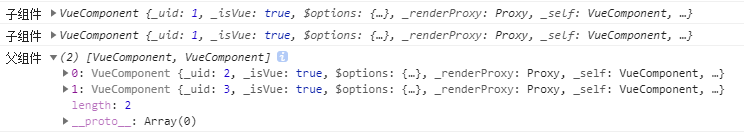
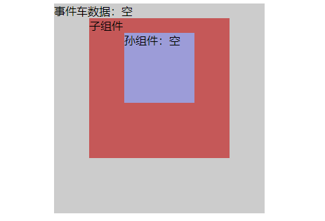

参考：

[Vue中组件最常见的通信方式](https://mp.weixin.qq.com/s?__biz=MzI5MjUxNjA4Mw==&mid=2247486495&idx=1&sn=920df890c785ec3162ea67b7332d7723&chksm=ec017583db76fc957a28e1a8d6d600564d081045c896abd3658bc42c3dfd4bec227d3ee27497&mpshare=1&scene=23&srcid=1118K7fU9xmjJvbLazijFpzn&sharer_sharetime=1605667648909&sharer_shareid=2fc971e338e9cf58cb793cd5056b61ae#rd)

[vue组件通信总结](https://juejin.im/post/6844904048118726663)

# Vue-组件通信

### 概述

​		Vue 是数据驱动视图更新的框架，所以对于 Vue 来说组件间的数据通信非常重要；最常用的方式为父传子（通过 `props` 传值给子组件），但在其他情况下，需要使用其他的通信方式；

​		常见的使用场景分为以下三类：

- 父子组件通信：`props`、`$parent/$children`、`provide/inject`、`$attrs/$listeners`
- 兄弟组件通信：`EventBus`、`Vuex`（或者通过子传父→父传子）
- 跨级通信：`EventBus`、`Vuex`、`provide/inject`、`$atrrs/$listeners`
- 通用：`$root`

### prop / $emit

父组件通过 `prop` 的方式向子组件传递数据，而通过 `$emit` 子组件可以向父组件通信

- Parent

  ```vue
  <template>
  	<div>
          <!-- 在此传递，通过使用 v-bind -->
          <!-- @change 绑定事件，子组件通过 $emit 来触发 -->
          <Child :message="message" @change="childEvent"></Child>
      </div>
  </template>
  <script>
      import Child from './Child';
      export default {
          data(){
              return {
                  message: '父传子'
              }
          },
          components: { Child },
          methods: {
              childEvent(index){
                  console.log(index); // 1
              }
          }
      }
  </script>
  ```

  我们可以通过 `prop`向子组件传递数据；用一个形象的比喻来说，父子组件之间的数据传递相当于自上而下的水流，水只能从上往下流，而不能逆流。这也正是 Vue 的设计理念之单向数据流（即子组件无法修改 `prop` 传递过来的数据值）。而 `prop` 正是父子组件的一个衔接口，这样数据才能从上往下流。

- Child

  ```vue
  <template>
  	<div @click="clickChange(1)">
      </div>
  </template>
  <script>
      export default {
          // 通过使用 props 来接收父组件传递的数据
          // 不指定数据类型时写成：props: [message]
          props: {
              message: {
                  type: String,
                  // 可设置默认值 
                  default: 'null'
              }
          },
          methods: {
              chilickChange(index){
                  // 触发父组件在子组件上绑定的事件名,并传递参数
                  this.$emit("change",index);
              }
          }
      }
</script>
  ```
  
  在子组件中，通过 `props` 对象定义了接受父组件的类型和默认值，然后通过 `$emit()` 触发父组件中的事件。`prop/$emit` 传递数据的方式在日常开发中使用的非常多，一般涉及到组件开发都是基于这种方式；

通过父组件中注册子组件，并在子组件标签上绑定对自定义事件的监听。优点是传值取值方便简洁明了，但是这种方式的缺点是：

- 由于数据是单向传递，如果子组件需要改变父组件的 `props` 值，需要每次给子组件绑定对应的监听事件。
- 如果父组件需要给孙组件传值，需要子组件进行转发，较为不便。

### .sync 修饰符

​		有些情况下，希望在子组件能够 “直接修改” 父组件的 `prop` 值，但是双向绑定会带来维护上的问题；Vue 提供了一种解决方案，通过语法糖 `.sync `修饰符。

​		`.sync` 修饰符在 `vue1.x` 的时候曾作为双向绑定功能存在，即子组件可以修改父组件中的值。但是它违反了单向数据流的设计理念，所以在 `vue2.0` 的时候被干掉了。但是在 `vue2.3.0+`以上版本又重新引入了。但是这次它只是作为一个编译时的语法糖存在。它会被扩展为一个自动更新父组件属性的 `v-on`监听器。说白了就是让我们手动进行更新父组件中的值了，从而使数据改动来源变得更加明显。

- Parent

  ```vue
  <template>
    <div id="app">
      <!-- 传值时添加 `.sync` 修饰符  -->
      <div>{{message}}</div>
      <Child :message.sync="message"></Child>
    </div>
  </template>
  
  <script>
  import Child from './components/Child'
  export default {
    name: 'App',
    data(){
      return {
          message: '父传子'
      }
    },
    components: { Child },
  }
  </script>
  ```

- 在给 Child 组件传值时，给每个值添加一个 `.sync` 修饰，在编译时会被扩展为如下代码：

  ```vue
  <Child :msg="message" @update:message="val => message = val"></Child>
  ```

- 即 `.sync` 是 `v-on:updata:` 的一个缩写（`update:xxx`官方文档推荐以这种模式来描述触发事件 `this.$emit('update:title',newValue)`）

- 因此子组件中只需要显式的触发 `update:` 更新事件

- Child

  ```vue
  <template>
  	<div @click="messageChange">
      </div>
  </template>
  <script>
      export default {
          name: 'Child',
          // 通过使用 props 来接收父组件传递的数据
          // 不指定数据类型时写成：props: [message]
          props: {
              message: {
                  type: String,
                  // 可设置默认值 
                  default: 'null'
              }
          },
          methods: {
              messageChange(){
                  // 触发 update: 更新事件
                  this.$emit("update:message",'子组件改变了父组件的数据了');
              }
          }
      }
  </script>
  ```

- 效果：



- 这种双向绑定的操作看着也似曾相识，其实 `v-model` 本质上也是一种语法糖，只不过它触发的不是 `update` 方法而是 `input` 方法；而且 `v-model` 没有 `.sync` 来的更加灵活，`v-model` 只能绑定一个值。

- 注：当我们用一个对象同时设置多个 `prop` 的时候，也可以将这个 `.sync` 修饰符和 `v-bind` 配合使用：

  ```vue
  <text-document v-bind.sync="doc"></text-document>
  ```

  - 这样会把 `doc` 对象中每一个 property 都作为一个独立的 `prop` 传进去，然后各自添加用于更新的 `v-on` 监听器

> 注意：带有 `.sync` 修饰符的 `v-bind` **不能**和表达式一起使用，例如 `v-bind:title.sync = "doc.titile + '!'"`。取而代之的是，你只能提供你想要绑定的 property 名，类似 `v-model`。

### $attrs / $listeners

​		当需要用从 A 到 C 的跨级通信时，会发现 `prop` 传值非常麻烦，会用很多冗余繁琐的转发操作；如果 C 中的状态改变还要传递给 A，使用事件还需要一级一级的向上传递，代码可读性就更差了。



​		因此 `vue 2.4+` 版本提供了新的方案：`$attrs 和 $listeners`，官网对 `$attrs` 的描述：

> `$attrs`：包含了父作用域中不作为 prop 被识别（且获取）的特性绑定（class 和 style 除外）。当一个组件没有声明任何 prop 时，这里会包含所有父作用域的绑定（class 和 style 除外），并且可以通过 `v-bind="$attrs"` 传入内部组件——在创建高级别的组件时非常有用。 
>
> `$listeners`：包含了父作用域中的 (不含 `.native` 修饰器的) `v-on` 事件监听器。它可以通过 `v-on="$listeners"` 传入内部组件——在创建更高层次的组件时非常有用。

- Parent

  ```vue
  <template>
    <div id="app">
      <Child :childMsg="childMsg" :grandChildMsg="grandChildMsg"
             @childChange="childChange" @grandChildChange="grandChildChange"></Child>
    </div>
  </template>
  
  <script>
  import Child from './components/Child'
  export default {
    name: 'App',
    data(){
      return {
          childMsg: '父传子',
          grandChildMsg: '爷传孙'
      }
    },
    components: { Child },
    methods: {
        childChange(msg){
            this.childMsg = msg; 
        },
        grandChildChange(msg){
            this.grandChildMsg = msg;
        }
    }
  }
  </script>
  ```

  - 首先定义了两个 `msg`，一个给子组件展示，另一个给孙组件展示，首先将这两个数据传递到子组件中，同时将两个改变 `msg` 的函数传入。

- Child

  ```vue
  <template>
  	<div>
          <div @click="clickChild">{{ childMsg }}</div>
          <GrandChild v-bind="$attrs" v-on="$listeners"></GrandChild>
      </div>
  </template>
  <script>
      import GrandChild from './components/GrandChild';
      export default {
          name: 'Child',
          props: {
       		// props 只接受了 childMsg      
              childMsg: {
                  type: String
              }
          },
          methods: {
              clickChild(){
                  this.$emit("childChange",'子组件改变了父组件的数据了');
              }
          },
          components: { GrandChild }
      };
  </script>
  ```

  - 在子组件中通过 `props` 获取子组件所需要的参数，即 `childMsg`；剩余的参数就被归到了 `$attrs` 对象中，我们可以在页面中展示出来，然后把剩余属性继续往孙组件中传；同时把所有的监听函数归到 $listeners，也继续往下传。

- GrandChild

  ```vue
  <template>
  	<div @click="clickGrandChild">
          孙组件：{{ grandChildMsg }}
      </div>
  </template>
  <script>
      export default {
          name: 'GrandChild',
          props: {
       		// props 接收了 父组件 $attrs 传过来的参数      
              grandChildMsg: {
                  type: String
              }
          },
          methods: {
              clickGrandChild(){
                  // 触发 $listeners 中的事件，即触发爷组件中的事件
                  this.$emit("GrandChildChange",'孙组件！！');
              }
          },
      };
  </script>
  ```



还有一个小问题，当我们在组件上赋予一个非 `prop` 声明时，比如 `child` 组件上的 `grandChildMsg` 属性没有在该组件用到，编译后的代码会把这个属性当作原始属性对待，添加到 html 原生标签上，所以查看代码是这样的：



这样会很难看，我们有在组件上加上 `inheritAttrs` 属性将他去掉：

- Child

  

总结：`$attrs` 和 `$listeners` 很好的解决了跨一级组件传值的问题。其实`$attrs`还有一个用途是，当父组件使用 `prop` 传递的属性十分多时，子组件可以直接使用 `this.$attrs` 来便捷获取。

### provide / inject

​		虽然 `$attrs、$listeners` 可以很方便的从父组件传值到孙组件，但如果跨了三四级，并且想要的数据已经被上级组件取出来了，这是 `$attrs` 就不能解决了。

​		`provide/inject` 是 `vue2.2+` 版本新增的属性，简单来说就是父组件中通过 `provide` 来提供变量，然后在子组件中通过 `inject` 来注入变量。这里注入的变量不像 `$attrs`，只能向下一层；`inject`不论子组件嵌套有多深，都能获取到。

- Parent

  ```vue
  <template>
    <div id="app">
      <div class="app" @click="clickChange"> 
        <Child></Child>
      </div>
    </div>
  </template>
  
  <script>
  import Child from "./components/Child";
  export default {
    name: "App",
    data() {
      return {
        childMsg: "Child",
        grandChildMsg: "GrandChild"
      };
    },
    components: { Child },
    // 提供
    provide() {
      return {
        childMsg: this.childMsg,
        grandChildMsg: this.grandChildMsg
      };
    },
    methods: {
      clickChange() {
        console.log(111);
        this.childMsg = "父组件注入";
        this.grandChildMsg = "爷组件注入";
      }
    }
  };
  </script>
  ```

  - 我们在父组件通过provide注入了两个变量，并且点击之后修改变量的值，然后就在子组件和孙组件取出来。

  ```vue
  <!-- Child.vue -->
  <template>
  	<div>
          <div>子组件：{{ childMsg }}</div>
          <GrandChild></GrandChild>
      </div>
  </template>
  <script>
      import GrandChild from './components/GrandChild';
      export default {
          name: 'Child',
          // 注入
          inject: ["childMsg"],
          components: { GrandChild }
      };
  </script>
  <!-- GrandChild.vue -->
  <template>
  	<div>孙组件：{{ grandChildMsg }}</div>
  </template>
  <script>
      export default {
          name: 'GrandChild',
          // 注入
          inject: ["grandChildMsg"]
      };
  </script>
  ```

  

- 住：一旦子组件注入了某个数据，在 data 中就不能再声明这个数据了

- 可以看到子组件和孙组件都能取出值，并且渲染出来。**需要注意的是**，在`Parent` 组件绑定点击事件去改变注入的值，注入的值没有按照预期的改变，也就是说子组件并没有响应修改后的值，官网的介绍是这样说的：

  > 提示：provide 和 inject 绑定并不是可响应的。这是刻意为之的。然而，如果你传入了一个可监听的对象，那么其对象的属性还是可想响应的。

- vue 并没有把`provide`和`inject`设计成响应式的，这是 vue 故意的，但是如果传入了一个可监听的对象，那么就可以响应了。
- 原因是：如果有多个组件同时以来于一个父组件提供的数据，那么一旦父组件修改了该值，所有的组件都会受到影响，这是不希望看到了；这一方面增加了耦合度，另一方面使得数据变化不可控制。
- 使用场景：例如 Element UI 在 form 中使用 `provide/inject`传入一个属性 size 来控制子组件的尺寸，但是子组件的位置是不固定的，可能会嵌套好几层，如果一层一层通过 `props` 传 size 下去会很繁琐，这时候 `provide/inject` 就派上用场了。

**总结**：`provide/inject` 能够解决多层组件嵌套传值的问题，但是是非响应式的，即 `provide` 与 `inject` 之间没有绑定，注入的值是在子组件初始化过程中决定的。

### $refs 

​		有时候我们需要在 Vue 中直接来操作 DOM 元素，比如获取元素高度，或者直接调用子组件的一些函数；虽然使用原生 JS 也能获取到，但是 Vue 提供了更方便的一个属性：`$refs`。如果在普通的 DOM 对象上使用，获取到的就是 DOM 元素，如果用在子组件上，获取的就是组件的实例对象。

- Child

  ```vue
  <!-- Child.vue -->
  <template>
  	<div @click="childMsgChange('自己改变')">{{ childMsg }}</div>
  </template>
  <script>
      import Child from "./components/Child";
      export default {
          name: 'Child',
          data(){
              return {
            		childMsg: '子组件'      
              }
          },
          methods: {
              childMsgChange(msg){
                  this.childMsg = msg;
              }
          }
      };
  </script>
  ```

- Parent

  ```vue
  <template>
    <div id="app">
      <div class="app"> 
        <div @click="clickChange">父组件</div>
        <Child ref="child"></Child>
      </div>
    </div>
  </template>
  
  <script>
  import Child from "./components/Child";
  export default {
    name: "App",
    components: { Child },
    methods: {
      clickChange() {
        this.$refs.child.childMsgChange('父组件触发改变');
      }
    }
  };
  </script>
  ```

  

- 可以看到获取到的是一个 `VueComponent` 对象，这个对象包括了子组件的所有数据和函数，可以对子组件进行一些操作。

### $parent / $Child

​		如果页面有多个相同的子组件需要操作的话，`$refs`一个一个操作起来比较繁琐，Vue 提供了另外的属性：`$parent/$children` 来统一选择。

​		可以在子组件中通过 `$parent` 访问父组件中的函数与数据，同理父组件通过 `$children` 获取子组件实例的数组

```vue
<!-- Child.vue -->
<template>
	<div>子组件</div>
</template>
<script>
    export default {
        mounted(){
            console.log('子组件',this.$parent);
        }
    };
</script>
<!-- Parent.vue -->
<template>
  <div id="app">
    <div class="app"> 
      <div>父组件</div>
      <Child></Child>
      <Child></Child>
    </div>
  </div>
</template>

<script>
import Child from "./components/Child";
export default {
  name: "App",
  components: { Child },
	mounted(){
        console.log('父组件',this.$children);
    }
};
</script>
```

- 在父组件中插入了两个相同的子组件，在子组件中通过 `$parent` 调用了父组件的函数，并在父组件通过 `$children`获取子组件实例的数组。



### $root

​		`$root` 用来访问根实例，如果当前实例没有父实例，此实例将会是其自己。

​		使用场景：比如前面父子组件通信使用了 `parent` 或者 `children`，但是由于需求的改变等等不得已原因，它们的关系已经不是父子组件了，此时，通信机制就不能不重新建立了。但是如果一开始使用 `$root` 作为通信机制，那么就不存在这样的麻烦了。

```vue
<!--children1.vue -->
<script>
export default {
    data(){
        return {
            msg: "hello"
        }
    },
    mounted(){
        this.$root.msg = this.msg
    }
};
</script>
<!--children2.vue -->
<script>
export default {
    mounted(){
        console.log(this.$root.msg) // => 'hello'
    }
};
</script>
```

​		确切的说 `$root` 方法使用与任何情况的组件通信，包括父子组件、兄弟组件、隔代组件通信，可以形象的把它理解成为它们共同的祖先。包括 `App.vue`！！

缺点：官网中提到，它只适合通用化（就是不用动态更新的场景），如果想建立随着改变动态更新的数据，建议使用 `Vuex`。

响应式：不过当尝试着给 `$root` 传递一个响应式的对象，当对象中的数据改变时，其余使用这个属性的地方也会跟着改变，也就是说它就是响应式的了。


### EventBus（事件总线/事件车）

​		`EventBus` 通常被称为**事件车**，但是比较官方的翻译是 **事件总线**。**它的实质就是创建一个 vue 实例，通过一个空的 vue 实例作为桥梁实现 vue 组件间的通信，然后利用 `$on/$emit`进行事件绑定和触发。**他是实现非父子组件通信的一种解决方案，所有的组件都可以上下平行地通知其他组件，但也就是太方便，所以若使用不慎，就会造成难以维护的问题。

- eventBus.js

  ```js
  import Vue from 'vue';
  export default new Vue();
  ```

  - 首先创造出一个空的 vue 对象并将其到处，他是一个不具备 `DOM` 的组件，它具有的仅仅知识它实例的方法而已，因此它非常的轻便。

- main.js

  ```js
  //....
  import eventBus from './util/eventBus';
  Vue.prototype.$eventBus = eventBus;
  ```

  - 将其挂载到全局，变成全局的事件总线，这样就能在组件中很方便的调用了。

- Parent

  ```vue
   {
      return {
        busMessage: '空'
      };
    },
    components: { Child },
    mounted(){
        // 给事件车绑定事件
        this.$eventBus.$on('ParentChange', msg => this.busMessage = msg)
    },
    methods:{
       clickChange(){
         this.$eventBus.$emit('GrandChildChange','爷组件改变了孙子组件');
       }
    }
  };
  </script>
  ```

- GrandChild

  ```vue
  <template>
  	<div class="grandChild" @click="clickChange">孙组件：{{ busMessage }}</div>
  </template>
  <script>
  export default {
      name: 'GrandChild',
      data(){
          return{
              busMessage: '空'
          }
      },
      mounted(){
        // 给事件车绑定事件
        this.$eventBus.$on('GrandChildChange', msg => this.busMessage = msg)
      },
      methods:{
          clickChange(){
              this.$eventBus.$emit('ParentChange','孙子组件改变了爷组件');
          }
      }
  };
  </script>
  ```

- 在初始化的时候，给 `Parent` 和 `GrandChild` 组件分别往事件车里注册了两个事件，然后点击按钮是也是触发事件车里面的对应事件，效果如下：



- 前面也提到过，如果使用不善，EventBus 会是一种灾难。因为 Vue 是单页面应用，如果你在某一个页面刷新了之后，与之相关的 EventBus 都会被一处，这样就导致业务走不下去。还有就是如果业务有反复操作的页面，EventBus 在监听的时候就会触发很多次，这也是一个非常大的隐患。这个时候就需要好好处理 EventBus 在项目中的关系。通常会用的，在页面组件销毁时，同时移除 EventBus 事件监听。

  ```vue
  export defalut{
  	destroyed(){
  		this.$eventBus.$off();
  	}
  }
  ```

  - `$off`用法：移除自定义事件监听器。
    - 如果没有提供参数，则移除所有的事件监听器；
    - 如果只提供了事件，则移除该事件所有的监听器；
    - 如果同时提供了事件与回调，则只移除这个回调的监听器。

**总结**：EventBus 可以用来很方便的实现兄弟组件和跨级组件的通信，但是使用不当时也会带来很多问题，所以适合逻辑并不复杂的小页面，逻辑复杂时还是建议使用 vuex。


### Vuex

​		在 vue 组件开发中，经常会遇到将当前组件的状态传递给其他非父子组件，或者一个状态需要共享给多个组件，这时候采用上面的方式就会非常麻烦。Vue 提供了另一个库 Vuex 来解决数据传递的问题。

​		Vuex 是一个专为 Vue.js 应用程序开发的**状态管理模式**。它采用集中式存储管理应用的所有组件的状态，并以相应的规则保证状态以一种可预测的方式发生变化

​		Vuex 实现了单向数据流，在全局定义了一个 `State` 对象来存储数据，当组件要修改 `State` 中的数据时，必须通过 `Mutation` 进行操作。vuex 在数据传值和操作数据维护起来比较方便。

