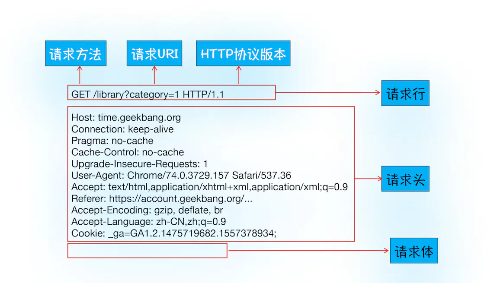
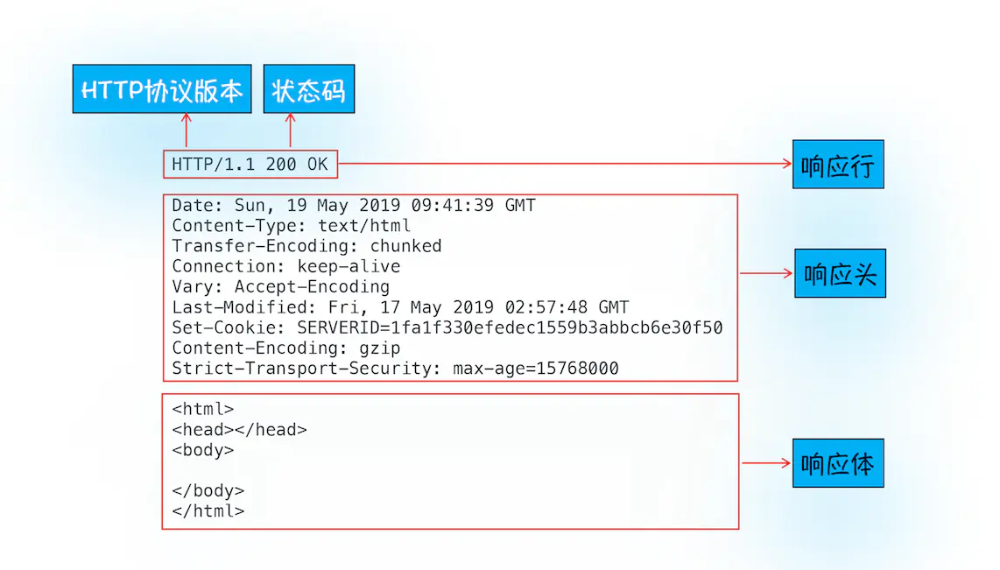
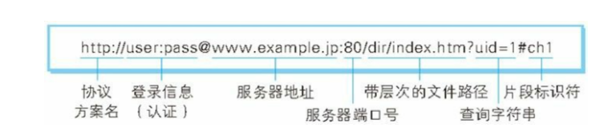
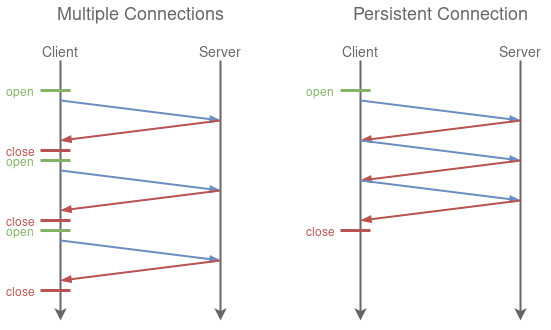
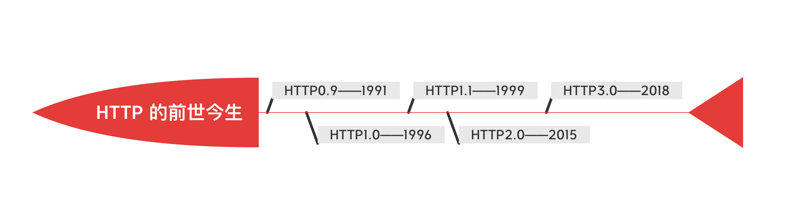
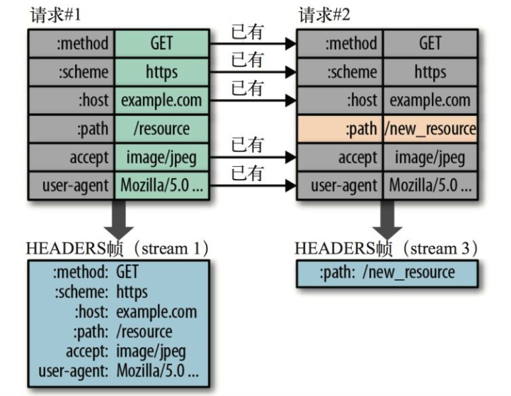
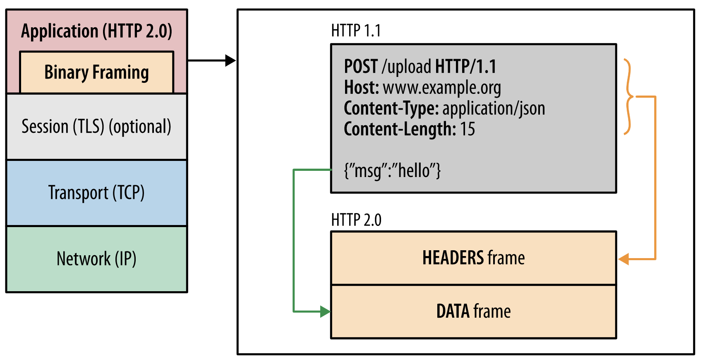
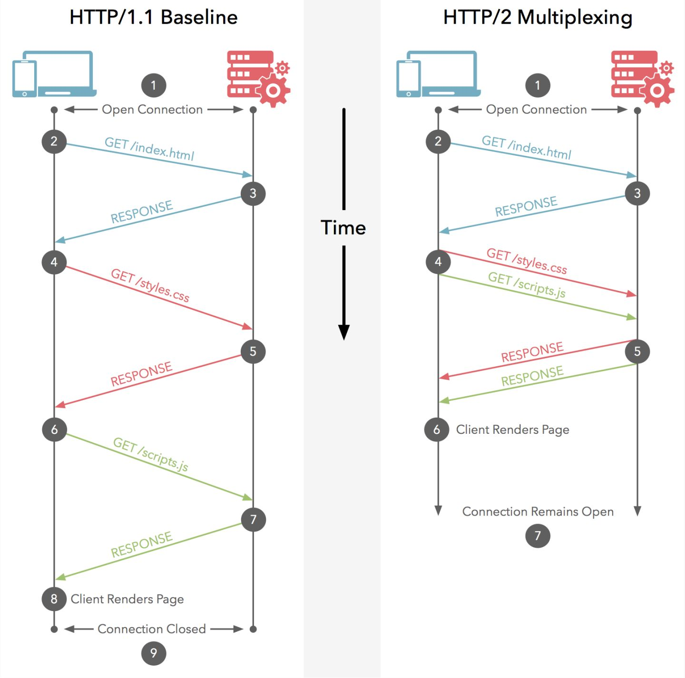
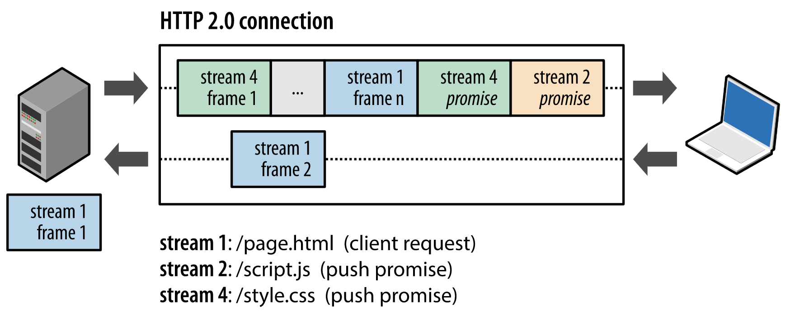
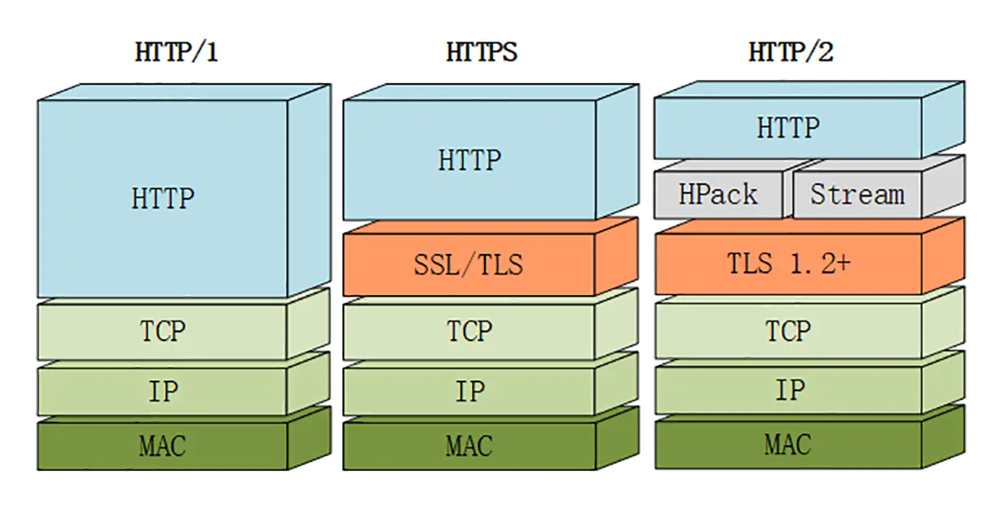

## HTTP 是什么

全称：超文本传输协议（`HyperText Transfer Protocol`）

概念：HTTP 是一种能够获取 HTML、图片等网络资源的通讯协议。它是 web 上进行数据交换的基础，是一种 `client-server` 协议。

HTTP 是基于 TCP/IP 协议的一个应用层协议，规定了客户端与服务端之间的通信格式以及所占用的服务端口80（HTTPS 是 443）。

## HTTP 协议优缺点

### HTTP 特点

1. **灵活可扩展**：主要提现在两个方面。一个是语义上的自由，只规定的基本格式，比如空格分隔单词，换行分隔字段，其他的各个部分都没有严格的语法限制。另一个是传输形式的多样性，不仅仅可以传输文本，还能传输图片、视频等任意数据，非常方便。
2. **可靠传输**：HTTP 是基于 TCP/IP 的，因此把这一特性继承了下来。
3. **请求-应答模式**：也就是`一发一收`、`有来有回`， 当然这个请求方和应答方不单单指客户端和服务器之间，如果某台服务器作为代理来连接后端的服务端，那么这台服务器也会扮演**请求方**的角色。
4. **无状态**：（需要分场景）这里的状态指**通信过程的上下文信息**，而每次 http 请求都是独立、无关的，默认不需要保留状态信息。

### HTTP 缺点

1. **无状态**：分场景，对于 HTTP 而言，最具争议的地方在于它的 **无状态**。
   - 在需要长连接的场景中，需要保存大量的上下文信息，以免传输大量重复的信息，那么这时候无状态就是 http 的缺点了。
   - 但与此同时，另外一些应用仅仅是为了获取一些数据，不需要保存连接上下文信息，无状态反而减少了网络开销，成为了 http 的优点。
2. **明文传输**：即协议里的报文（主要指的是头部）不使用二进制数据，而是文本形式。
   - 这当然对于调试提供了便利，但同时也让 HTTP 的报文暴露给了外界，给攻击者也提供了遍历。`Wifi 陷阱`就是利用 HTTP 明文传输的缺点，诱导你连上热点，然后疯狂抓取你所有的溜了。从而拿到你的敏感信息。
3. **队头阻塞**：当 http 开启长连接时，共用一个 TCP 连接，同一个时刻只能处理一个请求，那么当前请求耗时过长的情况下，其他的请求只能处于阻塞状态，这也就是著名的**队头阻塞问题**。

## HTTP 报文结构

对于 TCP 而言，在传输的时候分为两个部分：**TCP 头** 和 **数据部分**

而 HTTP 类似，也是 `header + body` 的结构，具体而言：`起始行 + 头部 + 空行 + 实体 `。

由于 HTTP **请求报文**和**响应报文**是有一定区别的，因此分开介绍



- 请求行包括：`请求方法字段 + URL 字段 + HTTP协议版本字段` 
- 请求报文——请求体：具体的数据



- 响应行：也叫状态行，由 `http 版本 + 状态码 + 原因` 三个部分组成。
- 响应报文——响应体：具体的数据

不管是请求头还是响应头，其中的字段是相当多的，而且牵扯到 http 非常多的特性，重点看看这些头部字段的格式：

头部由关键字/值对组成，每行一对，关键字和值用 `:` 分隔。

## HTTP 的请求方法

- HTTP 1.0 定义了三种请求方法：GET，POST 和 HEAD 方法。
- HTTP 1.1 新增了五种请求方法：OPTIONS，PUT，DELETE，TRACE 和 CONNECT。

`http/1.1` 规定了以下请求方法（注意，都是大写）：

- `GET`：通常用于请求服务器发送某些资源
- `HEAD`：请求资源的头部信息，并且这些头部与 `GET` 方法请求时返回一致（使用场景：在下载一个大文件前先获取其大小再决定是否要下载，以此节约带宽资源）
- `POST`：发送数据给服务器，即上传数据
- `PUT`：请求服务器存储一个资源（修改数据）
- `DELETE`：删除指定的资源
- `CONNECT`：建立连接隧道，用于代理服务器
- `OPTIONS`：列出可对资源实行的请求方法，用来跨域请求
- `TRACE`：追踪请求-响应的传输路径
- `PATCH`： 用于对资源应用部分修改（新增）

### GET 和 POST 有什么区别？

> 引入副作用和幂等的概念：
>
> 副作用是指对服务器上的资源做改变，搜索是无副作用的，注册是有副作用的。
>
> 幂等指发送 M 和 N 个请求（两者不相同且都大于1），服务器上资源的状态一致。比如说，注册 10 个和 11 个账户是不幂等的，对文章修改 10 次和 11 次是幂等的。因为前者是多了一个账户（资源），后者只是更新同一个资源。

在规范的应用场景上说，**GET 多用于无副作用，幂等的场景**，例如搜索关键字；**POST 多用于副作用，不幂等的场景**，例如注册。

在技术上说：

- **缓存**：GET 请求后浏览器会主动缓存，POST 默认情况下不能。
- **参数**：GET 请求一般放在 URL 中（当然也可以写在请求体里）通过历史记录、缓存很容易查到数据信息，因此不安全，POST 请求放在请求体中，相对而言较为安全，更适合传输敏感信息，但是在抓包的情况下都是一样的。
- **限制**：关于 URL 有长度限制，这是浏览器规定的
- **编码**：GET 只能进行 URL 编码，只能接收 ASCII 字符，而 POST 支持更多的编码类型且不对数据类型限制。
- **TCP 角度**：GET 请求会把请求报文一次性发出去，而 POST 会分为两个 TCP 数据包，首先发送 `header` 部分，如果服务器响应 100 (continue)，然后发送 body 部分。（火狐浏览器除外，它的 POST 请求只发一个 TCP 包）。
- **GET 无害**：（其实就是指幂等性）刷新、后退等浏览器操作 GET 请求是无副作用的，而 POST 可能重复提交表单。


## 如何理解 URI？

**URI**，全称为（Uniform Resource Identifier），也就是**统一资源标识符**，它的作用很简单，就是区分互联网上不同的资源。

但是，它并不是我们常说的`网址`, 网址指的是`URL`, 实际上`URI`包含了`URN`和`URL`两个部分，由于 URL 过于普及，就默认将 URI 视为 URL 了。

（*URL*（Uniform Resource Locator,统一资源定位符））

### URI 的结构



### URI 编码

URI 只能使用`ASCII`, ASCII 之外的字符是不支持显示的，而且还有一部分符号是界定符，如果不加以处理就会导致解析出错。

## HTTP 的 keep-alive

在早期的 HTTP/1.0 中，每次 http 请求都要创建一个连接，而创建连接的过程需要消耗资源和时间，为了减少资源消耗，缩短响应时间，就需要重用连接。

在后来的HTTP/1.0中以及HTTP/1.1中，引入了重用连接的机制，就是在 HTTP 请求头中加入 `Connection:keep-alive` 来告诉对方这个请求响应完成后不要关闭，下一次还用这个请求继续交流。

协议规定 HTTP/1.0 如果想要保持长连接，需要在请求头上加上 `Connection:keep-alive`

`keep-alive` 优点：

- 较少的 CPU 和内存的使用（由于同时打开的连接减少了）。
- 允许请求和应答的 HTTP 管道化。
- 降低拥塞控制（TCP 连接减少了）。
- 减少了后续请求的延迟（无需再进行握手）。
- 报告错误无需关闭 TCP 连接。



### 客户端如何开启

在HTTP/1.0协议中，默认是关闭的，需要在http头加入"Connection: Keep-Alive”，才能启用Keep-Alive；

```http
Connection: keep-alive
```

http 1.1中默认启用Keep-Alive，如果加入"Connection: close “，才关闭。

```http
Connection: close
```

目前大部分浏览器都是用http1.1协议，也就是说默认都会发起Keep-Alive的连接请求了，所以是否能完成一个完整的Keep- Alive连接就看服务器设置情况。

## HTTP 状态码

RFC 规定 HTTP 状态码为**三位数**，被分为五类：

- **1xx**：代表请求已经被接收，需要继续处理。
- **2xx**：表示成功状态。
- **3xx**：重定向状态，资源位置发生变动，需要重新请求。
- **4xx**：客户端错误
- **5xx**：服务器端错误。

### 1xx

接收的请求正在处理，信息类状态码。

### 2xx 成功

- `200 OK`，表示从客户端发来的请求在服务器端被正确处理。
- `204 No Content`，表示请求成功，但响应报文不含实体的主体部分。
- `206 Partial Content`，该状态码表示客户端进行了范围请求。

### 3xx 重定向

- `301 Moved Permanently`，永久性重定向，表示资源已经被分配了新的 URL。
- `302 Found`，临时性重定向，表示资源临时被分配了新的 URL。
- `303 See Other `，表示资源存在另一个 URL，应使用 GET 方法获取资源。
- `304 Not Modified`，当协商缓存命中时会返回这个状态码，表示服务器允许访问资源，但因发送请求未满足条件的情况（也叫是自从上次请求后，请求的网页未修改过）。——也就是让客户端查找本地缓存
- `307 Temporary Redirect`，临时重定向，和 302 类似，但是期望客户端保持请求方法不变向新地址发出请求。

> 当 301、302、303 响应状态码时，几乎所有浏览器都会把 POST 改为 GET，并删除请求报文内的主体，之后请求会再次自动发送。

### 4xx 客户端错误

- `400 Bad Request`，请求报文存在语法错误。
- `401 Unauthorized`，表示发送的请求需要有通过 HTTP 认证的认证信息。
- `403 Forbidden`，表示对请求资源的访问被服务器拒绝。
- `404 Not Found`，表示服务器上没用找到请求的资源。
- `405 Method Not Allowed`，服务器禁止使用该方法。（客户端可以通过 options 方法来查看服务器允许的访问方法。）
- `408 Request timeout`, 客户端请求超时。
- `409 Confict`, 请求的资源可能引起冲突

### 5XX 服务器错误

- `500 Internal Server Error`，表示服务器端在执行请求时发生了错误。
- `501 Not Implemented`，表示服务器不支持当前请求所需要的某个功能，或者是请求是服务器不支持的某个方法。
- `502 Bad Gateway`，服务器自身是正常的，访问的适合出了错误。
- `503 Service Unavailable`: 表示服务器当前很忙，暂时无法响应服务。


## HTTP 的发展历程



### HTTP 0.9 —— 单行协议

HTTP 0.9 是一个最古老的版本：

- 只支持 `GET` 请求方式：由于不支持其他请求方式，因此客户端是没办法向服务端传输太多的信息。
- 没有请求头概念：所以不能在请求中指定版本号，服务器也只具有返回 HTML 字符串的能力
- 服务端响应之后，立即关闭 TCP 连接。

### HTTP 1.0 —— 构建可扩展性

- 协议版本信息会随着每个请求发送（`HTTP/1.0` 被追加到了  `GET` 行），除了GET命令，还引入了POST命令和HEAD命令。。
- 状态码会在响应开始时发送，使浏览器能了解请求执行成功或失败，并相应调整行为（如更新或使用本地缓存）。
- 引入了 HTTP 头的概念，无论是对于请求还是响应，允许传输元数据，使协议变得非常灵活，更具扩展性。
- 在新 HTTP 头的帮助下，具备了除纯文本 HTML 文件以外其他类型文档的能力。（`Content-Type` 头告诉客户端实际返回的内容的内容类型）。
- **短连接**，即每次发送数据都会经过 TCP 的三次握手和四次挥手，效率较低。
- 不支持断点续传，也就是说，每次都会传送全部的页面和数据。
- HTTP 1.0 只使用 header 中的 If-Modified-Since 和 Expires 作为缓存失效的标准。

### HTTP 1.1

HTTP 1.1 是目前最为主流的协议版本，从 1999 年发布至今。

> 长连接就是只需一次建立就可以传输多次数据，传输完成后，只需要一次切断连接即可。

- 引入了持久连接（`persistent connection`），即 TCP 连接默认不关闭，可以被多个请求复用。在 HTTP/1.0 中使用长连接需要添加请求头 `Connection: Keep-Alive`，而在 HTTP 1.1 所有的连接默认都是长连接，一定程度上弥补了 HTTP 1.0 每次请求都要创建连接的缺点。
- 引入了管道机制（`pipelining`），允许在第一个应答发送完成之前就发送第二个请求，以降低通信延迟。在复用同一个 TCP 连接期间，即便是通过管道同时发送了多个请求，服务端也是按请求的顺序一次给出响应的；而客户端在未收到之前所发出的所有请求的响应之前，减肥会阻塞后面的请求（排队等待），这称为“`队头阻塞`”。
- 引入额外的缓存控制机制。在 HTTP/1.0 中主要使用 `header` 里的 `If-Modified-Since、Expires` 等来作为缓存判断的标准，HTTP/1.1 则引入了更多的缓存控制策略例如 `Entity tag、If-None-Match、Cache-Control` 等更多可供选择的缓存头来控制缓存策略。
- HTTP 1.1 支持断点续传，通过使用请求头中的 `Range` 来实现。
- `Host` 头，不同的域名配置同一个 IP 地址的服务器。`Host` 是 HTTP/1.1 协议中新增的一个请求头，主要用来实现虚拟主机技术。
- 新增方法：`PUT、 PATCH、 OPTIONS、 DELETE`。

### HTTP 1.x 版本问题

- HTTP/1.1是文本协议传输，在传输数据的过程中，所有内容都是明文的，客户端和服务器都无法验证对方的身份，无法保证数据的安全性。

- HTTP/1.1 版本默认允许复用 TCP 连接，但是在同一个 TCP 连接中，所有数据通信是按次序进行的，服务器通常在处理完一个回应后，才会继续去处理下一个，这样就会造成队头阻塞。
- HTTP/1.x 版本支持 `Keep-alive`，用此方案来弥补创建多次连接产生的延迟，但同样会给服务器带来压力，并且的话，对于单文件不断被请求的服务，Keep-alive 会极大影响性能，因为它在文件被请求之后还保持了不必要的连接很长时间。

### HTTP 2.0

2015 年，HTTP/2.0 面世

- `二进制分帧`：HTTP/2.0 使用了更加靠近 TCP/IP 的二进制格式，而抛弃了 ASCII 码，提升了解析效率。这是一次彻底的二进制协议，头信息和数据体都是二进制，并且统称为 “帧”。
- `头部压缩`：HTTP/1.1 会出现 `User-Agent、Cookie、Accept、Server、Range`等字段可能会占用几百甚至几千字节，而 Body 却经常只有几十字节，所以导致头部偏重。HTTP/2.0 使用 `HPACK` 算法进行压缩。
- `多路复用`：复用 TCP 连接，在一个连接里，客户端和浏览器都可以同时发送多个请求或回应，且不用按顺序一一对应，这样子解决了队头阻塞的问题。
- `服务器推送`：允许服务器未经请求，主动向客户端发送资源。
- `请求优先级`：可以设置数据帧的优先级，让服务端先处理重要资源，优化用户体验。

### HTTP/3.0

HTTP 出现的原因：

- 虽然 HTTP/2 解决了很多之前旧版本的问题，但是它还是存在一个巨大的问题，虽然这个问题并不是它本身造成的，而是底层支撑的 TCP 协议的问题。

- 因为 HTTP/2 使用了多路复用，一般来说同一域名下只需要使用一个 TCP 连接。但当这个连接中出现了丢包的情况，那么就会导致整个 TCP 都要开始等待重传，也就导致了后面所有的数据都被阻塞了。

- 反而对于 HTTP/1 来说，可以开启多个 TCP 连接，出现丢包反倒只会影响其中一个连接，剩余的 TCP 连接还可以正常传输数据。

但修改 TCP 协议是不现实的问题。基于这个原因，Google 另起炉灶搞了个`基于 UDP 协议的 QUIC 协议`，并且使用在了 HTTP/3 上，HTTP/3 之前名为 HTTP-over-QUIC。

关于 UDP 协议，知道这个协议虽然效率很高，但是并不是那么的可靠。QUIC 虽然基于 UDP，但是在原本的基础上新增了很多功能，比如多路复用、0-RTT、使用 TLS1.3 加密、流量控制、有序交付、重传等等功能 优点诸多，参考[这里](https://www.jianshu.com/p/bb3eeb36b479)：

- **避免包阻塞**：多个流的数据包在 TCP 连接上传输时，若一个流中的数据包传输出现问题，TCP 需要等待该包重传后，才能继续传输其他流的数据包。但在基于 UDP 的 QUIC 协议中，不同的流之间的数据传输真正实现了相互独立互不干扰，某个流的数据包在出问题需要重传时，并不会对其他流的数据包传输产生影响。

- **多路复用**：虽然 HTTP/2 支持了多路复用，但是 TCP 协议终究是没有这个功能的。QUIC 原生就实现了这个功能，并且传输的单个数据流可以保证有序交付且不会影响其他的数据流，这样的技术就解决了之前 TCP 存在的问题。

- **快速重启会话**： 普通基于tcp的连接，是基于两端的ip和端口和协议来建立的。在网络切换场景，例如手机端切换了无线网，使用4G网络，会改变本身的ip，这就导致tcp连接必须重新创建。而QUIC协议使用特有的UUID来标记每一次连接，在网络环境发生变化的时候，只要UUID不变，就能不需要握手，继续传输数据。

  

## HTTP/2.0

由于 HTTPS 在安全方面已经做的非常好了，HTTP 改进的关注点放在了性能方面。

- HTTP/2 是二进制协议而不是文本协议，先看几个概念：
  - `帧`：客户端与服务器通过交换帧来通信，帧是基于这个新协议通信的最小单位。
  - `消息`：是指逻辑上的 HTTP 消息，比如请求、响应等，由一或多个帧组成。
  - `流`：流是连接中的一个虚拟信道，可以承载**双向传输**的信息；每个流都有唯一的整数标识符。

### 头部压缩

HTTP 1.1版本会出现 **User-Agent、Cookie、Accept、Server、Range** 等字段可能会占用几百甚至几千字节，而 Body 却经常只有几十字节，所以导致头部偏重。

HTTP 2.0 使用 `HPACK` 算法进行压缩。

- HTTP/2 在客户端和服务器端使用 “首部表” 来跟踪和存储之前发送的键/值对，对于相同的数据，不再通过每次请求和响应发送。
- 首部表在 HTTP/2 的连续存续期内始终存在，由客户端和服务端共同渐进的更新。
- 每个新的首部键－值对要么被追加到当前表的末尾，要么替换表中之前的值。

> 可以理解为只发送差异数据，而不是全部发送，从而减少头部的信息量。



### 二进制分帧

之前是明文传输，不方便计算机解析，效率低。HTTP/2 采用二进制格式，全部传输 0/1 串，便于机器解码。

这样子一个报文格式就被拆分为一个个二进制帧，用 **Headers帧** 存放头部字段，**Data帧** 存放请求体数据。这样的话，就是一堆乱序的二进制帧，它们不存在先后关系，因此不需要排队等待，解决了 HTTP 队头阻塞问题。

在客户端与服务器之间，双方都可以互相发送二进制帧，这样子**双向传输的序列**，称为`流`，所以 HTTP/2 中以流来表示一个TCP连接上进行多个数据帧的通信，这就是**多路复用**概念。

那乱序的二进制帧，是如何组装成对于的报文呢？

- 所谓的乱序，值的是不同ID的Stream是乱序的，对于同一个Stream ID的帧是按顺序传输的。
- 接收方收到二进制帧后，将相同的Stream ID组装成完整的请求报文和响应报文。
- 二进制帧中有一些字段，控制着`优先级`和`流量控制`等功能，这样子的话，就可以设置数据帧的优先级，让服务器处理重要资源，优化用户体验。




### 多路复用

HTTP 1.x 中，如果想并发多个请求，必须使用多个 TCP 连接，且浏览器为了控制资源，还会对单个域名有 6-8 个的 TCP 连接请求限制。

`HTTP 2.0` 中的帧将 `HTTP/1.x` 消息分成帧并嵌入到流 (`stream`) 中。数据帧和报头帧分离，这将允许报头压缩。将多个流组合，这是一个被称为多路复用 (`multiplexing`) 的过程，它允许更有效的底层 `TCP` 连接。 

HTTP2 中：

- 同域名下所有通信都在单个连接上完成。
- 单个连接可以承载任意数量的双向数据流。
- 数据流以消息的形式发送，而消息又由一个或多个帧组成，多个帧之间可以乱序发送，因为根据帧首部的流表示可以重新组装，也就是 `Steam ID`，流标识符，有了它，接收方就能乱序的二进制帧中选择 ID 相同的帧，按照顺序组装成请求/响应报文。



### 服务器推送

服务器推送，其允许服务器在客户端缓存中填充数据，通过一个叫服务器推送的机制来提前请求。服务器向客户端推送资源无需客户端明确地请求，服务端可以提前给客户端推送必要的资源，这样可以减少请求延迟时间，例如浏览器请求一个 HTML 文件，服务器就可以在返回 HTML 的基础上，将 HTML 中引用到的其他资源文件一起返回给浏览器，减少延迟时间，过程如下：



服务器端可以主动推送，客户端也有权力选择是否接收，如果服务端推送的资源已经被浏览器缓存过，浏览器可以通过发送 `RST_STREAM` 帧来拒收。主动推送也遵守同源策略，服务器不会随便推送第三方资源给客户端。

相比较http/1.1的优势👇

- 推送资源可以由不同页面共享
- 服务器可以按照优先级推送资源
- 客户端可以缓存推送的资源
- 客户端可以拒收推送过来的资源


### 总结

HTTP/2 完全兼容之前 HTTP 的语法和语义，如 **请求头、URI、状态码、头部字段** 都没有改变。同时，在安全方面，HTTP 也支持 TLS，并且现在主流的浏览器都公开只支持加密的 HTTP/2，因此现在能看到的 HTTP/2 也基本上都是跑在 TLS 上面的了。 



## HTTPS

### 1. HTTP 存在的安全问题

- HTTP 通信使用明文（不加密），内容可能被窃听。
- 无法验证报文的完整性，所以可能被篡改。
- 无法验证通信方的身份，因此可能遭遇伪装。

反观 HTTPS 协议，比 HTTP 协议相比多了以下优势（下文介绍）：

- **数据隐私性**：内容经过对称加密，每个连接生成一个唯一的加密密钥。
- **数据完整性**：内容传输经过完整性校验。
- **身份认证**：第三方无法伪造服务端（客户端）身份

### 2. 什么是 HTTPS

**超文本传输安全协议**（英语：Hypertext Transfer Protocol Secure，缩写：HTTPS）是一种通过计算机网络进行安全通信的传输协议。HTTPS 经 HTTP 进行通信，但利用 SSL/TLS 来加密数据包。HTTPS 开发的主要目的，**是提供对网站服务器的身份认证，保护交换数据的隐私与完整性。**

也就是：**HTTPS = HTTP + SSL/TLS**

