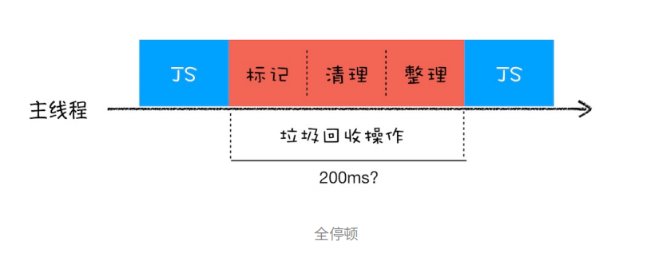

# JS 内存机制

## JavaScript 中的数据是如何存储在内存中的

### JavaScript 是什么类型的语言？

- 在使用之前就需要**确定其变量数据类型**的称为**静态语言**，在运行过程中需要检查数据类型的语言称为**动态语言**。（JavaScript 就是动态语言）
- **支持隐式类型转换**的语言称为**弱类型语言**，不支持隐式类型转换的语言称为**强类型语言**


### JavaScript 的数据类型

JavaScript 是一种弱类型的、动态的语言。特点：

- **弱类型**：意味着不需要告诉 JS 引擎某个变量是什么数据类型，JS 引擎在运行代码的时候会自行计算出来。
- **动态**：意味着可以使用同一个变量保存不同类型的数据。

在 JavaScript 中，可以使用 `typeof` 运算符查看变量的数据类型。如下：

```js
var bar 
console.log(typeof bar) //undefined 
bar = 12 
console.log(typeof bar) //number 
bar = "hinsenoo" 
console.log(typeof bar) //string 
bar = true 
console.log(typeof bar) //boolean 
bar = null 
console.log(typeof bar) //object 
bar = {name: "hinsenoo"} 
console.log(typeof bar) //object
```

JavaScript 中的数据类型一共有 8 种， 它们分别是：

| 类型          | 描述                                                         |
| :------------ | :----------------------------------------------------------- |
| **Boolean**   | 只有 `true` 和 `false` 两个值。                              |
| **Null**      | 只有一个值 `null`。                                          |
| **Undefined** | 一个没有被赋值的变量会有个默认值 `undefined`，变量提升时的默认值也是 `undefined`。 |
| **Number**    | 根据 ECMAScript 标准，JavaScript 中只有一种数字类型：基于 IEEE754 标准的双精度 64 位二进制格式的值，-(263 - 1) 到 263 -1 。 |
| **BigInt**    | JavaScript 中的一个新的数字类型，可以用任意精度表示整数。使用 `BigInt`，即使超出 `Number` 的安全整数范围限制，也可以安全地存储和操作。 |
| **String**    | 用与表示文本数据。不同于类 C 语言，JavaScript 的字符串是不可更改的。 |
| **Symbol**    | 符号类型是唯一的并且是不可修改的，通常用来作为 `Object` 的 `key`。 |
| **Object**    | 在 JavaScript 里，对象可以被看作是一组属性的集合。           |

注意点：

1. 使用 `typeof` 检测 `Null` 类型时，返回的是 `Object`。这是当初 JavaScript 语言的一个 Bug，一直保留至今，之所以一直没修改过来，主要是为了兼容老代码。（解释：在 JS 最初版本中使用的是 32 位系统，为了性能考虑使用低位存储变量的类型信息，`000` 开头代表是对象，然而 `null` 表示为全零，所以将它错误的判断为 `Object`。

2. `Object` 类型比较特殊，它是由上述七种类型组成的一个包含了 `key-value` 对的数据类型。如下所示：

   ```js
   let myObj = {
   	name: 'hinsenoo',
       update: function() {}
   }
   ```

   其中的 `value` 可以是任何类型，包括函数，这也就意味着你可以通过 `Object` 来存储函数，`Object` 中的函数又称为方法。

3. 把前面 7 种数据类型称为 **原始类型**，把最后一个对象类型称为 **引用类型**，之所以把它们区分为不同的类型，是因为它们在内存存放的位置不一样。

### 内存空间

下图是 JavaScript 的内容模型：


从图中可以看出，在 JavaScript 的执行过程中，主要有三种类型内存空间，分别是 **代码空间**、**栈空间** 和 **堆空间**。（其中代码空间主要是存储可执行代码的）

### 栈空间和堆空间

这里的栈空间就是调用栈，是用来存储执行上下文的。为了搞清楚栈空间是如何存储数据的，先看下⾯这段代码： 

```js
function foo() {
	var a = "极客时间"; 
    var b = a; 
    var c = {name:"极客时间"};
    var d = c;
}
foo();
```

当执行一段代码时，需要先编译，并创建执行上下文，然后再按照顺序执行代码。下图是，当执行到第三行代码时，其调用栈的状态：


从图中可以看出，执行到第3行时，变量 a 和变量 b 的值都被保存在执行上下文中，而执行上下文又被压入到栈中，所以也可以认为变量 a 和 b 的值都是存放在栈中的。	

接下来继续执行第 4 行代码，由于 JavaScript 引擎判断右边的值是一个引用类型，这时候的处理情况就不一样了，JavaScript 引擎并不是直接将对象存放到变量环境中，而是将它分配到堆空间中，分配后该对象会有一个在 “堆” 中的地址，然后再将该数据的地址写进 c 的变量值，最终分配好的内存示意图如下所示：


从上图可以得知，对象类型是存放在堆空间的，在栈空间只是保存了对象的引用地址，当 JavaScript 需要访问该数据的时候，是通过栈中的引用地址来访问的，相当于多了一道转手流程。

**原始类型的数据值都是直接保存在 "栈" 中的，引用类型的值是存放在 "堆" 中的**。这样存放的原因是：
因为 JavaScript 引擎需要用栈来维护程序执行期间上下文的状态，如果栈空间大了话，所有数据都存放在栈空间里面，那么会影响到上下文切换的效率，进而又影响到整个程序的执行效率。比如文中的 foo 函数执行结束了，JavaScript 引擎需要离开当前的执行上下文，只需要将指针下移到上个执行上下文的地址就可以了，foo 函数执行上下文栈区空间全部回收，具体过程可以参考下图：


所以 **通常情况下，栈空间都不会设置太大，主要用来存放一些原始类型的小数据**。而引用类型的数据占用空间都比较大，所以这一类数据会被存放到堆中，**堆空间很大，能存放很多大的数据**，不过缺点是分配内存和回收内存都会占用一定的时间。

在 JavaScript 中，赋值操作和其他语言有很大的不同，**原始类型的赋值会完整复制变量值，而引用类型的赋值是复制引用地址**。

所以 `d=c` 的操作就是把 c 的引用地址复制给 d，可以参考下图：


### 谈谈闭包

前置知识：作用域内的原始类型数据会被存储到栈空间，引用类型会被存储到堆空间，基于这两点探讨一下闭包的内存模型。

例子：

```js
function foo() {
    var myName = "极客时间";
    let test1 = 1;
    const test2 = 2;
    var innerBar = {
        setName: function (newName) {
            myName = newName;
        },
        getName: function () {
            console.log(test1);
            return myName;
        }
    }
    return innerBar;
}
var bar = foo();
bar.setName("极客邦");
bar.getName();
console.log(bar.getName())
```

当执⾏这段代码的时候，你应该有过这样的分析：由于变量 `myName、test1、test2` 都是原始类型数据，所 以在执⾏ foo 函数的时候，它们会被压⼊到调⽤栈中；当 `foo` 函数执⾏结束之后，调⽤栈中 `foo` 函数的执⾏上 下⽂会被销毁，其内部变量 `myName、test1、test2` 也应该⼀同被销毁。 

但是在闭包的⽂章中，介绍了当` foo` 函数的执⾏上下⽂销毁时，由于`foo`函数产⽣了闭包，所以变量 

`myName`和`test1`并没有被销毁，⽽是保存在内存中，那么应该如何解释这个现象呢？ 

要解释这个现象，我们就得站在内存模型的⻆度来分析这段代码的执⾏流程：

1. 当 JavaScript 引擎执行到 `foo` 函数时，首先会编译，并创建一个空执行上下文。
2. 在编译过程中，遇到内部函数 `setName`，JavaScript 引擎还要对内部函数做一次快速的词法扫描，发现该内部函数引用了 `foo` 函数的 `myName` 变量，由于是内部函数引用了外部函数的变量，所以 JavaScript 引擎判断这是一个闭包，于是在堆空间创建了一个 **"closure(foo)"** 的对象（这是一个内部对象，JavaScript 是无法访问的），用来保存 `myName` 变量。
3. 接着继续扫描到 `getName` 方法时，发现该函数内部还引用变量 `test1`，于是 JavaScript 引擎又将 `test1` 添加到 **"closure(foo)"** 对象中。这时候堆中的 **"closure(foo)"** 对象中就包含了 `myName、test1` 两个变量。
4. 由于 `test2` 并没有被内部函数引用，所以 `test2` 依然保存在调用栈中。

通过上面的分析，可以画出执行到 `foo` 函数中 "return innerBar" 语句时的调用栈状态，如下图所示：


从上图你可以清晰地看出，当执⾏到foo函数时，闭包就产⽣了；当`foo`函数执⾏结束之后，返回的 

`getName`和`setName`⽅法都引⽤**“clourse(foo)”**对象，所以即使`foo`函数退出了，**“clourse(foo)”**依然被 

其内部的`getName`和`setName`⽅法引⽤。所以在下次调⽤`bar.setName`或者`bar.getName`时，创建的执 ⾏上下⽂中就包含了**“clourse(foo)”**。

总结：**产生闭包的核心有两步：第一步是需要预扫描内部函数；第二步是把内部函数引用的外部变量保存到堆中。**

### 总结

- 介绍了 JavaScript 中的 8 种数据类型，可以分为两大类——**原始类型和引用类型**。
  - 原始类型的数据是放在 **栈** 中，引用类型的数据是存放在 **堆** 中的。堆中的数据是通过引用和变量关联起来的。也就是说JavaScript 的变量是没有数据类型的，值才有数据类型，变量可以随时持有任何类型的数据。

## 垃圾回收：垃圾数据是如何自动回收的？

有些数据使用之后，可能就不再需要了，我们把这种数据称为 **垃圾数据**。如果这些垃圾数据一直保存在内存中，那么内存会越用越多，所以我们需要 **对这些垃圾数据进行回收，以释放有限的内存空间**。

### 不同语言的垃圾回收策略

通常情况下，垃圾数据回收分为 **手动回收** 和 **自动回收** 两种策略。

如 C/C++ 就是使用手动回收策略，**何时分配内存、何时销毁内存都是由代码控制的**，可以参考如下代码：

```c
//在堆中分配内存 
char* p = (char*)malloc(2048); //在堆空间中分配2048字节的空间，并将分配后的引⽤地址保存到p中 
//使⽤p指向的内存 
{ 
    //.... 
}
//使⽤结束后，销毁这段内存 
free(p)； 
p = NULL；
```

从上⾯这段C代码可以看出来，要使⽤堆中的⼀块空间，我们需要先调⽤ `mallco` 函数分配内存，然后再使⽤；当不再需要这块数据的时候，就要⼿动调⽤ `free` 函数来释放内存。如果这段数据已经不再需要了，但是 ⼜没有主动调⽤ `free` 函数来销毁，那么这种情况就被称为**内存泄漏** 。

另外一种使用的是自动垃圾回收的策略，如 JavaScript、Java、Python 等语言，**产生的垃圾数据是由垃圾回收器来释放的**，并不需要手动通过代码来释放。

### 调用栈中的数据是如何回收的

例子代码如下：

```js
function foo() {
    var a = 1;
    var b = { name: "极客邦" };
    function showName() {
        var c = "极客时间";
        var d = { name: "极客时间" };
    }
    showName();
}
foo();
```

当执行到第 6 行代码时，其调用栈和堆空间状态图如下所示：


从图中可以看出，原始类型的数据被分配到栈中，引⽤类型的数据会被分配到堆中。当 `foo` 函数执⾏结束之 后，`foo` 函数的执⾏上下⽂会从堆中被销毁掉，那么它是怎么被销毁的呢？下⾯我们就来分析⼀下。

之前简单介绍过，如果执行到 `showName` 函数时，那么 JavaScript 引擎会创建 `showName` 函数的执行上下文，并将 `showName` 函数的执行上下文压入到调用栈中，最终执行到 `showName` 函数时，其调用栈就如上图所示。与此同时，还有一个 **记录当前执行状态的指针（称为 ESP）**，指向调用栈中 `showName` 函数的执行上下文，表示当前正在执行 `showName` 函数。

接着，当 `showName` 函数执行完成之后，函数执行流程就进入了 `foo` 函数，那这时就需要销毁 `showName` 函数的执行上下文。**ESP** 这时候就帮上忙了，JavaScript 会将 **ESP** 下移到 `foo` 函数的执行上下文，**这个下移操作就是销毁 showName 函数执行上下文的过程。**

具体可以看下⾯这张移动 **ESP** 前后的对⽐图： 


从图中可以看出，当 `showName` 函数执行结束之后，**ESP** 向下移动到 `foo` 函数的执行上下文中，上面 `showName` 的执行上下文虽然保存在栈内存中，但是已经是无效内存了。比如当 `foo` 函数再次调用另外一个函数时，这块内容会被直接覆盖掉，用来存放另一个函数的执行上下文。

所以说，当一个函数执行结束之后，**JavaScript 引擎会通过向下移动 ESP 来销毁该函数保存在栈中的执行上下文**。

### 堆中的数据是如何回收的

通过上文的讲解，知道当 `foo` 函数执行结束之后，**ESP** 应该是指向全局执行上下文的，这样的话，`showName` 函数和 `foo` 函数的执行上下文就处于无效状态了，不过保存在堆中的两个对象依然占用着空间，如下图所示：


从图中可以看出，1003 和 1050 这两块内存依然被占用。**要回收堆中的垃圾数据，就需要用到 JavaScript 中的垃圾回收器了**。

所以，接下来就通过 Chrome 的 JavaScript 引擎 V8 来分析下堆中的垃圾数据是如何回收的。

### 代际假说和分代收集

在介绍 V8 如何实现回收之前，需要先学习下 **代际假说（The Generational Hypothesis）**的内容，这是垃圾回收领域中的一个重要术语，后续垃圾回收的策略都是建立在该假说的基础上，所以很是重要。

**代际假说** 有以下两个特点：

- 第一个是大部分对象在内存中存在的时间很短，简单来说，就是很多对象一经分配内存，很快就变得不可访问。
- 第二个是不死的对象，会活得更久。

其实这两个特点不仅仅适用于 JavaScript ，同样适用于大多数的动态语言，如 `Java、Python`等。

有了代际假说的基础，我们就可以来探讨V8是如何实现垃圾回收的了。 

通常，垃圾回收算法有很多种，但是并没有哪一种能胜任所有的场景，你需要权衡各种场景，根据对象的生命周期的不同而使用不同的算法，以便达到最好的效果。

所以，在 V8 种会把堆分为 **新生代** 和 **老生代** 两个区域，**新生代中存放的是生存时间短的对象，老生代中存放的生存时间久的对象**。

新生代通常只支持 `1~8 M` 的容量，而老生区支持的容量就大很多了。对于这两块区域，V8 分别使用两个不同的垃圾回收其，以便更高效得实施垃圾回收。

- **副垃圾回收器，主要负责新生代的垃圾回收。**
- **主垃圾回收器，主要负责老生代的垃圾回收。**

### 垃圾回收器的工作流程

现在知道了 V8 把堆分成两个区域——新生代和老生代，并分别使用两个不同的垃圾回收器。其实 **不论什么类型的垃圾回收器，它们都有一套共同的执行流程**。

- 第一步是标记空间中活动对象和非活动对象。所谓活动对象就是还在使用的对象，非活动对象就可以进行垃圾回收的对象。
- 第二步是回收非活动对象所占据的内容。其实就是在所有的标记完成之后，统一清楚内存中所有被标记为可回收的对象。
- 第三步是做内存整理。一般来说，频繁回收对象后，内存中就会存在大量不连续空间，我们这边这些不连续的内存空间称为 **内存碎片**。当内存中出现了大量的内存碎片之后，如果需要分配较大的连续内存的时候，就有可能出现内存不足的情况。所以最后一步需要整理这些内存碎片，但是这一步其实是可选的，因为有的垃圾回收器不会产生内存碎片，例如接下来要介绍的副垃圾回收器。

### 副垃圾回收器（新生代垃圾回收器）

副垃圾回收器主要负责新生区的垃圾回收。而通常情况下，大多数小的对象都会被分配到新生区，所以说这个区域虽然不大，但是垃圾回收还是比较频繁的。

新生代中用 **Scavenge 算法** 来处理。所谓 Scavenge 算法，是把新生代空间对半划分为两个区域，一般是对象区域，一般是空闲区域，如下图所示：


新加入的对象都会存放到对象区域，当对象区域快被写满时，就需要执行一次垃圾清理操作。

在垃圾回收过程中，首先要对对象区域中的垃圾做标记；标记完成之后，就进入垃圾清理阶段，副垃圾回收器会把这些存活的对象复制到空闲区域中，同时它还会把这些对象有序地排列起来。所以这个复制过程，也就相当于完成了内存整理操作，复制后空闲区域就没有内存碎片了。

完成复制后，对象区域与空闲区域进行角色翻转，也就是原来的对象区域变成空闲区域，原来的空闲区域变成了对象区域。这样就完成了垃圾对象的回收操作，同时这种 **角色翻转的操作还能让新生代中的这两块区域无限重复使用下去**。

由于新生代中采用的 Scavenge 算法，所以每次执行清理操作时，都需要将存活的对象从对象区域复制到空闲区域。但复制操作需要时间成本，如果新生区空间设置太大了，那么每次清理的时间就会过久，所以 **为了执行效率，一般新生区的空间会被设置得比较小**。

也正是因为新生区的空间不大，所以很容易被存号的对象装满整个区域。为了解决这个问题，JavaScript 引擎采用了 **对象晋升策略**，也就是经过两次垃圾回收依然还存活的对象，会被移动到老生区中。

### 主垃圾回收器

主垃圾回收器主要负责老生区中的垃圾回收。除了新生区中晋升的对象，一些大的对象会直接被分配到老生区。因此老生区中的对象有两个特点，一个是对象占用空间大，另一个是对象存活时间长。

由于老生区的对象比较大，若要在老生区中使用 Scavenge 算法进行垃圾回收，复制这些大的对象将会花费比较多的时间。从而导致回收执行效率不高，同时还会浪费一半的空间。因此，主垃圾回收器是采用 **标记-清除（Mark-Sweep）**的算法进行垃圾回收的。

首先是标记过程阶段。标记阶段就是从一组根元素开始，递归遍历这组根元素，在这个遍历过程中，能到达的元素称为 **活动对象**，没有到达的元素就可以判断为 **垃圾数据**。

比如最开始的那段代码，当 showName 函数执行退出之后，这段代码的调用栈和堆空间如下图所示：


 从上图可以大致看到垃圾数据的标记过程，当 `showName` 函数执行结束之后，**ESP** 向下移动，指向了 `foo` 函数的执行上下文，这时候如果遍历调用栈，是不会找到引用 `1003`地址的遍历，也就意味着 `1003` 这块数据为垃圾数据，被标记为红色。由于 `1050` 这块数据被变量 b 引用了，所以这块数据会被标记为活动对象。这就是大致的标记过程。

接下来就是垃圾的清除过程。它和副垃圾回收器的垃圾清除过程完全不同，你可以理解这个过程是清除掉红色标记数据的过程，可参考下图大致理解下其清除过程：


上面的标记过程和清除过程就是标记-清除算法，不过对一块内存多次执行标记-清除算法后，会产生大量不连续的内存碎片。而碎片过多会导致大对象无法分配到足够的连续内存，于是又产生了另一种算法——**标记-整理（Mark-Compact）**，这个标记过程仍然与标记-清除算法里的是一样的，但后续步骤不是直接对可回收对象进行清理，而是让所有存活的对象都向一端移动，然后直接清除掉端边界以外的内存。你可以参考下图：


### 全停顿

现在知道了 V8 是使用副垃圾回收器和主垃圾回收器处理垃圾回收的，不过由于 JavaScript 是运行在主线程上的，一旦执行垃圾回收算法，都需要将正在执行的 JavaScript 脚本暂停下来，待垃圾回收完毕后再恢复脚本执行。我们把这种行为叫做 **全停顿（Stop-The-World）**

⽐如堆中的数据有1.5GB，V8实现⼀次完整的垃圾回收需要1秒以上的时间，这也是由于垃圾回收⽽引起 JavaScript 线程暂停执⾏的时间，若是这样的时间花销，那么应⽤的性能和响应能⼒都会直线下降。主垃圾回收器执⾏⼀次完整的垃圾回收流程如下图所⽰：



在 V8 新生代的垃圾回收中，因其空间较小，且存活对象较少，所以全停顿的影响不大，但老生代就不一样了。如果在执行垃圾回收的过程中，占用主线程时间过久，像上面图片展示的那样，花费了 200 毫秒，在这 200 毫秒内，主线程是不能做其他事情的。比如页面正在执行一个 JavaScript 动画，因为垃圾回收器在工作，就会导致这个动画在这 200 毫秒内无法执行的，这将会造成页面的卡顿现象。

为了降低老生代的垃圾回收而造成的卡顿，V8 将标记过程分为一个个的子标记过程，同时让垃圾回收标记和 JavaScript 应用逻辑交替进行，直到标记阶段完成，我们把这个算法称为**增量标记（IncrementalMarking）算法**。如下图所示：


使用增量标记算法，可以把一个完整的垃圾回收任务拆分为很多小的任务，这些小的任务执行时间比较短，可以穿插在其他的 JavaScript 任务中间执行，这样当执行上述动画效果时，就不会让用户因为垃圾回收任务而感受到页面的卡顿了。

## 编译器和解释器：V8 是如何执行一段 JavaScript 代码的？

相关概念：**编译器（Compiler）、解释器（Interpreter）、抽象语法树（AST）、字节码（Bytecode）、即时编译器**

### 编译器和解释器

存在编译器和解释器的原因是：机器不能直接理解我们所写的代码，因此在执行程序之前，需要将我们所写的代码 "翻译" 成机器能读懂的机器语言。按语言的执行流程，可以把语言划分为编译型语言和解释型语言。

- **编译型语言在程序执行之前，需要经过编译器的编译过程，并且编译之后会直接保留机器能读懂的二进制文件，这样每次运行程序时，都可以直接运行该二进制文件，而不需要再次重新编译了。**比如 C/C++、GO 等都是编译型语言。
- **由解释型语言编写的程序，在每次运行时都需要通过解释器对程序进行动态解释和执行。**比如 Python、JavaSciprt 等都属于解释型语言。


由上图可看出二者的执行流程，大致如下：

1. 在编译型语言的编译过程中，编译器首先会依次对源代码进行词法分析、语法分析，生成抽象语法树（AST），然后是优化代码，最后再生成处理器能够理解的机器码。如果编译成功，将会生成一个可执行的文件。但如果编译过程中发生了语法或者其他的错误，那么编译器就会抛出异常，最后的二进制文件也不会生成成功。
2. 在解释型语言的解释过程中，同样解释器也会对源代码进行词法分析、语法分析，并生成抽象语法树（AST），不过它会再基于抽象语法树生成字节码，最后再根字节码来执行程序、输出结果。

### V8 是如何执行一段 JavaScript 代码的


从上图可以得知，V8 在执行过程中既有 **解释器 Ignition**，又有 **编译器 TurboFan**，它们又是如何配合去执行一段 JavaScript 代码的呢。

#### 1. 生成抽象语法树（AST）和执行上下文

将源代码转换为**抽象语法树**，并生成**执行上下文**。（执行上下文主要是代码在执行过程中的环境信息）。

讲解一下什么是 AST 以及 AST 的生成过程是怎样的。

高级语言是开发者可以理解的语言，但是让编译器或者解释器来理解就非常困难了。对于编译器或者解释器来说，它们可以理解的就是 AST 了。所以无论使用的是解释型语言还是编译型语言，在编译过程中，它们都会生成一个 AST。这和渲染引擎将 HTML 格式文件转换为计算器可以理解的 DOM 树的情况类似。

```js
var myName = "极客时间";
function foo(){
    return 23;
}
myName = "geektime"; 
foo();
```

这段代码经过处理后，生成的 AST 结构如下：


从图中可以看出，AST 的结构和代码的结构非常相似，其实也可以把 AST 看成代码的结构化表示，编译器或者解释器后续的工作都需要依赖于 AST，而不是源代码。

AST 是非常重要的一种数据结构，在项目中有着广泛的应用。其中最著名的一个项目是 Babel。Babel 是一个被广泛使用的代码转换器，可以将 ES6 代码转为 ES5 代码，这意味着你可以现在就用 ES6 编写程序，而不用担心现有环境是否支持 ES6 。Babel 的工作原理就是先将 ES6 源码转换成 AST，然后再将 ES6 语法的 AST 转换为 ES5 语法的 AST，最后利用 ES5 的 AST 生成 JavaScript 源代码。

除了 Babel 外，还有 ESLint 也使用 AST。ESlint 是一个用来检查 JavaScript 编写规范的插件，其检测流程也是需要将源码转为 AST，然后再利用 AST 来检查代码规范化的问题。 

接下来看下 AST 是如何生成的。通常生成 AST 需要经过两个阶段

- **第一阶段是分词（tokenize），又称为词法分析**，其作用是将一行行的源码拆解成一个个 token。所谓 **token**，之的是语法上不可能再分、最小的单个字符或字符串。参考下图

  

从图中可以看出，通过 `var myName = "极客时间"` 简单地定义了一个变量，其中关键词 `“var”`、标识符 `“myName”`、赋值运算符 `“=”`、字符串 `“极客时间”` 四个都是 token，而且它们代表的属性还不一样。

- **第二阶段是解析（parse），又称为语法分析**，其作用是将上一步生成的 token 数据，根据语法规则转为 AST。如果源码符合语法规则，这一步就会顺利完成。但是如果源码存在语法错误，这一步就会终止，并抛出一个 "语法错误"。

这就是 AST 的生成过程，先分词，再解析。有了 AST 后，接下来 V8 就会生成该段代码的执行上下文。

#### 2. 生成字节码

有了 AST 和执行上下文后，接下来的第二步，解释器 `Ignition` 就起作用了，它会根据 AST 生成字节码，并解释执行字节码。

其实一开始 V8 并没有字节码，而是直接将 AST 转换为机器码，由于执行机器码的效率是非常高效的，所以这种方式在发布后的一段时间内运行效果是非常好的。但是随着 Chrome 在手机上的广泛普及，特别是运行在 512M 内存的手机上，内存占用问题也暴露出来了，因为 V8 需要消耗大量的内存来存放转换后的机器码。为了解决内存占用的问题，V8 团队大幅重构了引擎架构，引入字节码，并且抛弃了之前的编译器，最终花了将近四年的时间，实现了现在的这套架构。

那什么是字节码呢？为什么引入字节码就能解决内存占用的问题呢？

**字节码就是介于 AST 和机器码之间的一种代码。但是与特定类型的机器码无关，字节码需要通过解释器将其转换为机器猫后才能执行。**

下面是高级代码、字节码、机器码的对比图：


从图中可以看出，机器码所占用的空间远远超过了字节码，所以使用字节码可以减少系统的内存使用。

#### 3. 执行代码

生成字节码之后，接下来就要进入执行阶段了。

通常，如果有一段第一次执行的字节码，解释器 `Ignition` 会逐条解释执行。在执行字节码的过程中，如果发现有热点代码（HotSpot），比如一段代码被重复执行多次，这种就被称为 **热点代码**，那么后台的编译器 `TurboFan` 就会把该段热点的字节码编译为高效的机器码，然后当再次执行这段被优化的代码时，只需要执行编译后的机器码就可以了，这样就大大提升了代码的执行效率。

V8 的解释器和编译器的取名也很有意思。解释器 `Ignition` 是点火器的意思，编译器 `TurboFan` 是涡轮增压的意思，寓意着代码启动时通过点火器慢慢发动，一旦启动，涡轮增压介入，其执行效率随着执行时间越来越搞效率，因为热点代码都被编译器 `TurboFan` 转换了机器码，直接执行机器码就省去了字节码 "翻译" 为机器码的过程。

其实字节码配合解释器和编译器是最近一段时间很火的技术，比如 `Java` 和 `Python` 的虚拟机也都是基于这种技术实现的，我们把这种技术称为 **即时编译（JIT）**。具体到 V8，就是指解释器 `Ignition` 在解释执行字节码的同时，收集代码信息，当它发现某一部分代码变热了之后，`TurboFan` 编译器 便闪亮登场，把热点的字节码转换为机器码，并把转换后的机器码保存起来，以备下次使用。

对于 JavaScript ⼯作引擎，除了V8使⽤了“字节码+JIT”技术之外，苹果的 SquirrelFish Extreme 和 Mozilla 的 SpiderMonkey 也都使⽤了该技术。

这么多语⾔的⼯作引擎都使⽤了“字节码+JIT”技术，因此理解JIT这套⼯作机制还是很有必要的。你可以结合下图看看 JIT 的⼯作过程：


### JavaScript 的性能优化

在过去⼏年中，JavaScript 的性能得到了⼤幅提升，这得益于V8团队对解释器和编译器的不断改进和优化。
虽然在V8诞⽣之初，也出现过⼀系列针对V8⽽专⻔优化JavaScript 性能的⽅案，⽐如隐藏类、内联缓存等概念都是那时候提出来的。不过随着V8的架构调整，你越来越不需要这些微优化策略了，相反，对于优化 JavaScript 执⾏效率，你应该将优化的中⼼聚焦在单次脚本的执⾏时间和脚本的⽹络下载上，主要关注以下三点内容：

1. 提升单次脚本的执行速度，避免 JavaScript 的长任务霸占主线程，这样可以使得页面快速响应交互；
2. 避免大的内联脚本，因为在解析 HTML 的过程中，解析和编译也会占用主线程；
3. 减少 JavaScript 文件的容量，因为更小的文件会提升下载速度，并且占用更低的内存。

