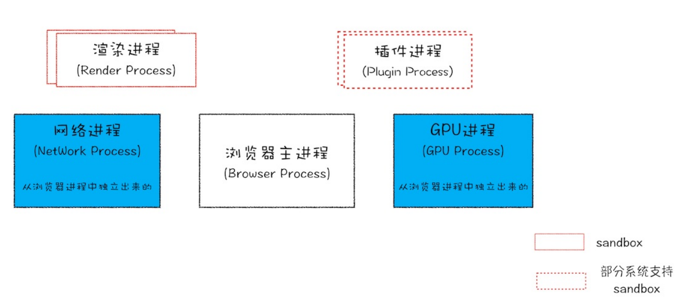
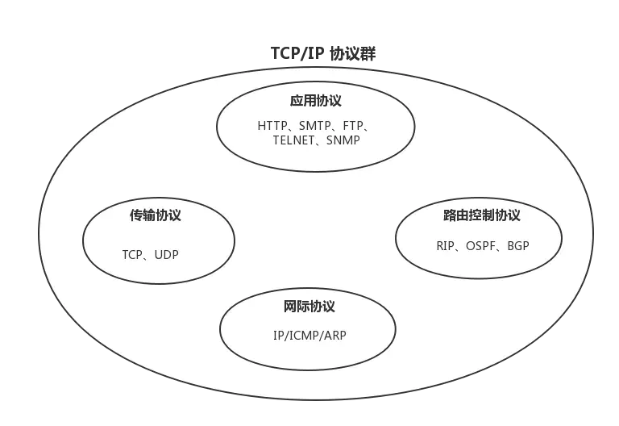
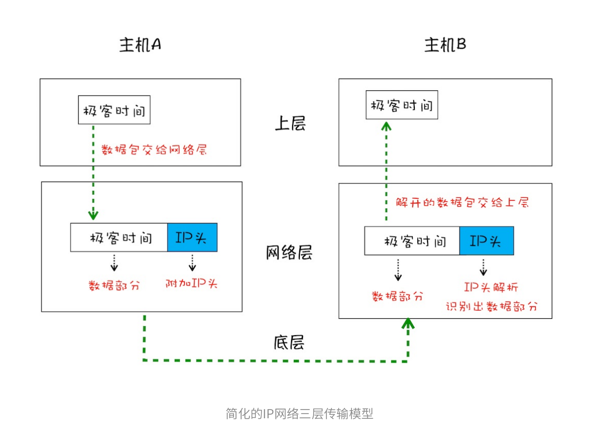
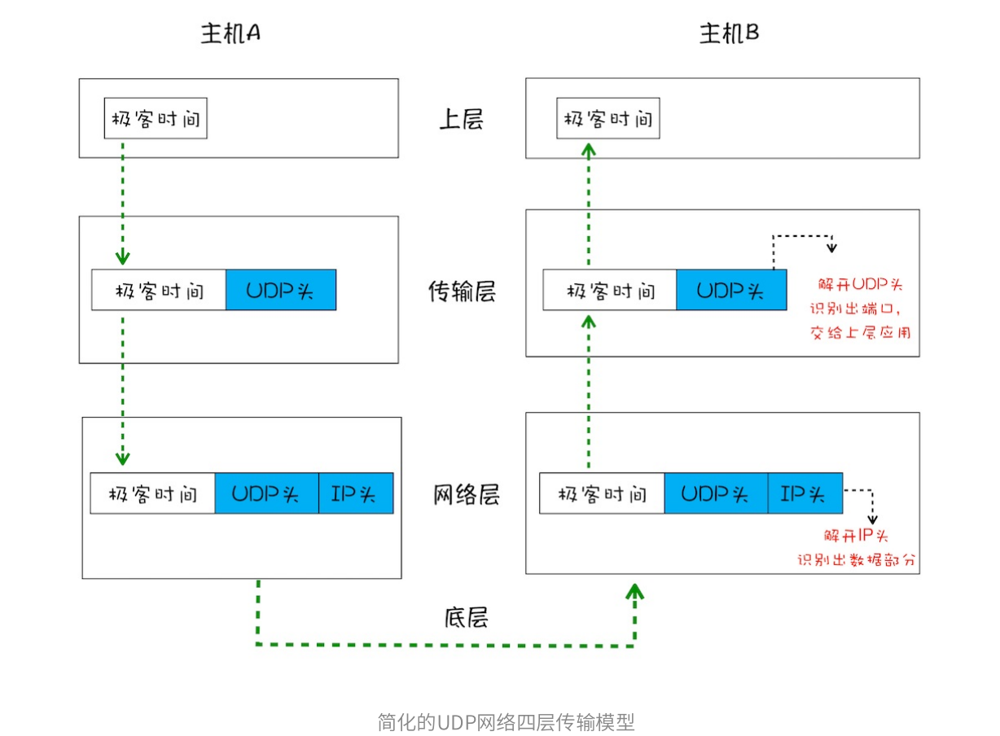
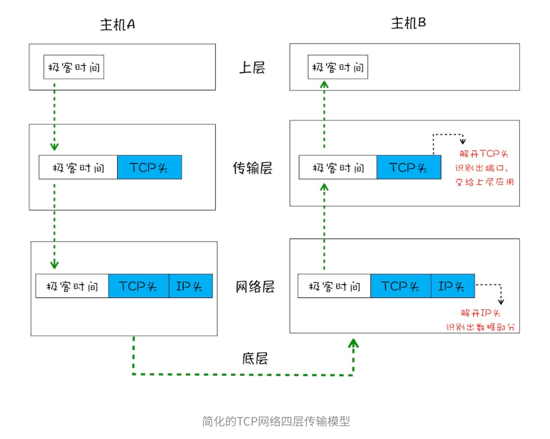
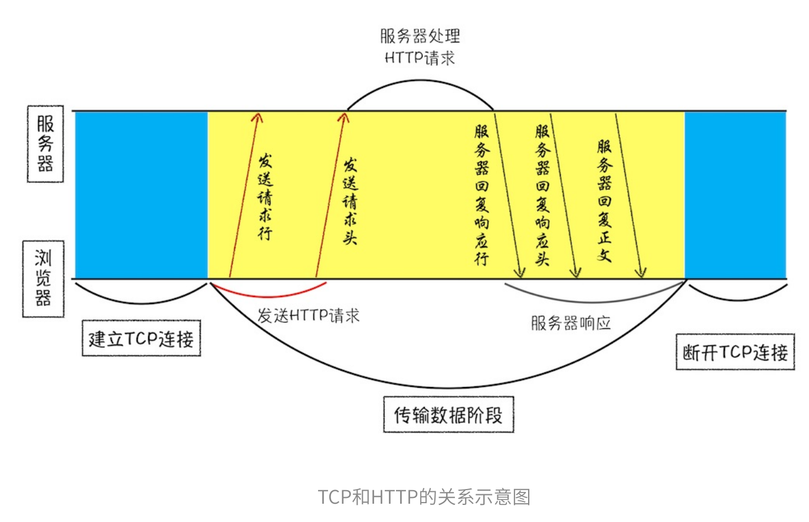
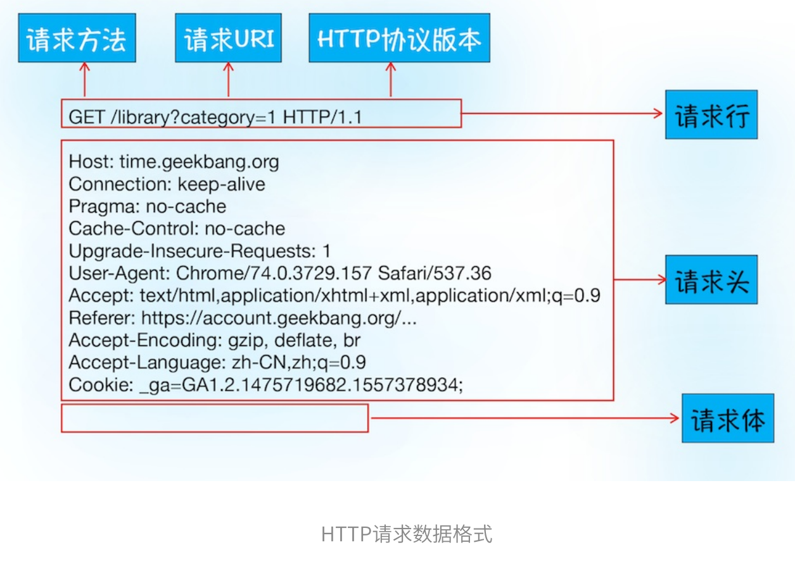
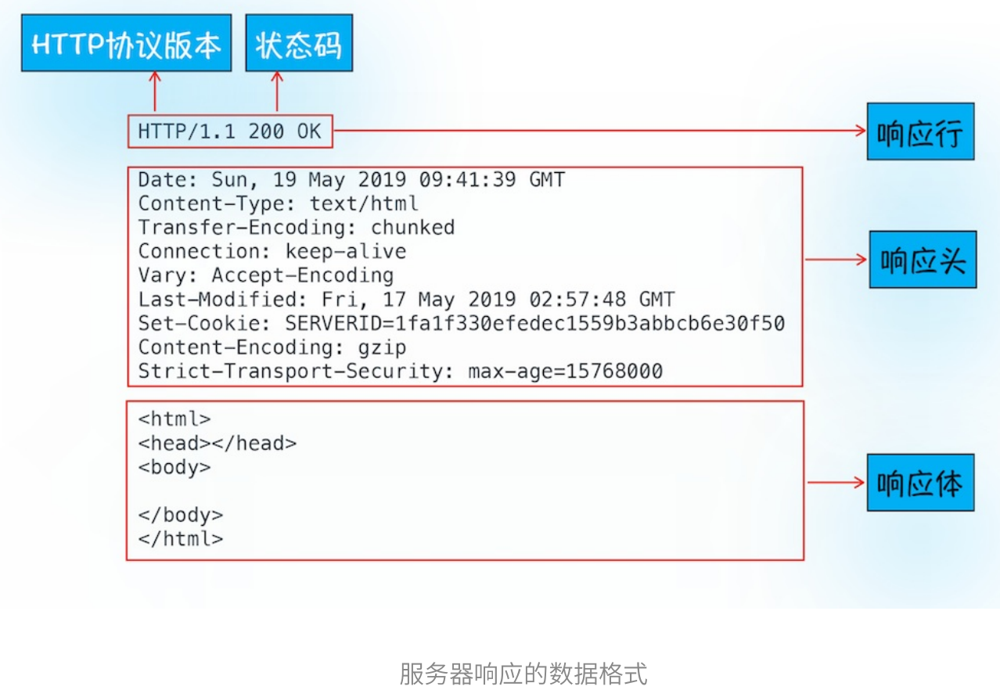
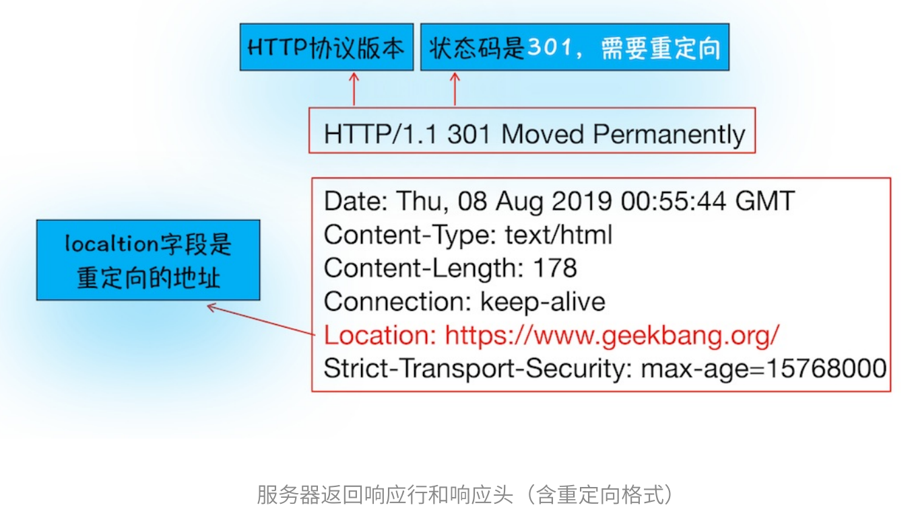

# 一、Chrome架构：仅仅打开了一个页面，为什么有 4 个进程？

## 进程和线程

### 什么是进程和线程？

**一个进程就是一个程序的运行实例，进程是操作系统中进行保护和资源分配的基本单位**。详细来说就是，启动一个程序的时候，操作系统会为该程序创建一块内存，用来存放代码、运行种的数据和一个执行任务的主线程，我们把这样的一个运行环境叫做**进程**。

**线程是进程的组成部分，它代表了一条顺序的执行流。线程是不能单独存在的，它由进程来启动和管理的**。

**线程是依附于进程的，而进程中使用多线程并行处理能提升运算效率。**

### 什么是并行处理？

**并行处理就是同一时刻处理多个任务**，⽐如我们要计算下⾯这三个表达式的值，并显⽰出结果：

```
A = 1+2
B = 20/5
C = 7*8
```

在编写代码的时候，可以把这个过程拆分为四个任务：

- **任务1?** 是计算A=1+2；
- **任务2?** 是计算B=20/5；
- **任务3?** 是计算C=7*8；
- **任务4?** 是显⽰最后计算的结果。

正常情况下可以使用**单线程**来处理，也就是分四步按照顺序分别执行这个任务。

如果采用**多线程**，则只需分 "两步走"：第一步，使用三个线程同时执行前三个任务；第二步，再执行第四个显示任务。

通过对比分析，你会发现用单线程执行需要四步，而使用多线程只需要两步。因此，**使用并行处理能大大提升性能**。


### 进程和线程之间的关系

**1. 进程中的任意一线程执行出错，都会导致整个进程的崩溃**。

**2. 线程之间共享进程中的数据**。

**3. 当一个进程关闭之后，操作系统会回收进程所占用的内存。**（即使其中任意线程因操作不当导致内存泄漏，当进程退出时，这些内存也会被正确回收）

**4. 进程之间的内容相互隔离。**（进程间通信使用（IPC）机制）


## Chrome 进程架构

以前的浏览器是**单进程浏览器**，**是指浏览器的所有功能模块都是运⾏在同⼀个进程⾥**，这些模块包含了⽹络、插件、JavaScript运⾏环境、渲染引擎和⻚⾯等。如此多的功能模块运⾏在⼀个进程⾥，是导致单进程浏览器 **不稳定**、 **不流畅**和 **不安全**的⼀个主要因素。



最新的 Chorme 浏览器采用多进程架构包括：1 个浏览器（Browser）主进程、1 个 GPU 进程、1 个网络（NetWork）进程、多个渲染进程和多个插件进程。

下面分析一下这几个进程的功能：

- **浏览器进程**：主要负责界面显示、用户交互、子进程管理，同时提供存储等功能。
- **渲染进程**：核⼼任务是将 `HTML`、`CSS`和`JavaScript`转换为⽤⼾可以与之交互的⽹⻚，排版引擎 Blink 和
  JavaScript 引擎 V8 都是运⾏在该进程中，默认情况下，Chrome会为每个 Tab 标签创建⼀个渲染进程。出
  于安全考虑，渲染进程都是运⾏在沙箱模式下。
- **GPU进程**：其实，Chrome 刚开始发布的时候是没有 GPU 进程的。⽽ GPU 的使⽤初衷是为了实现 `3D CSS`的
  效果，只是随后⽹⻚、Chrome 的 UI 界⾯都选择采⽤ GPU 来绘制，这使得 GPU 成为浏览器普遍的需求。最
  后，Chrome 在其多进程架构上也引⼊了 GPU 进程。
- **⽹络进程**：主要负责⻚⾯的⽹络资源加载，之前是作为⼀个模块运⾏在浏览器进程⾥⾯的，直⾄最近才独
  ⽴出来，成为⼀个单独的进程。
- **插件进程**：主要是负责插件的运⾏，因插件易崩溃，所以需要通过插件进程来隔离，以保证插件进程崩溃
  不会对浏览器和⻚⾯造成影响。


不过凡事都有两⾯性，虽然多进程模型提升了浏览器的稳定性、流畅性和安全性，但同样不可避免地带来了
⼀些问题：

- 更⾼的资源占⽤。因为每个进程都会包含公共基础结构的副本（如JavaScript运⾏环境），这就意味着浏
  览器会消耗更多的内存资源。
- 更复杂的体系架构。浏览器各模块之间耦合性⾼、扩展性差等问题，会导致现在的架构已经很难适应新的
  需求了。


# 二、TCP 协议：如果保证页面文件能被完整送达浏览器？

​		在衡量 Web 页面性能的时候有一个重要的指标叫 **“FP（First Paint）”**，是**指从页面加载到首次开始绘制的时长**这个指标直接影响了⽤⼾的跳出率，更快的⻚⾯响应意味着更多的PV、更⾼的参与度，以及更⾼的转化率。其中⼀个重要的因素是 **网络加载速度**

​		要想优化Web⻚⾯的加载速度，你需要对⽹络有充分的了解。⽽理解⽹络的关键是要对⽹络协议有深刻的认识，不管你是使⽤HTTP，还是使⽤ WebSocket，它们都是基于 **TCP/IP** 的，如果你对这些原理有⾜够了解，也就清楚如何去优化Web性能，或者能更轻松地定位Web问题了。此外，**TCP/IP** 的设计思想还有助于拓宽你的知识边界，从⽽在整体上提升你对项⽬的理解和解决问题的能⼒。

## 补充



> 互联网协议套件（Internet Protocol Suite，缩写 `IPS`）是一个网络通讯模型，以及一整个网络传输协议家族，为网际网络的基础通讯架构。它通常被称为 `TCP/IP 协议族`（`TCP/IP Protocol Suite`，或者 `TCP/IP Protocols`），简称 `TCP/IP`。因为该协议家族的两个核心协议：`TCP（传输控制协议）和 IP（网际协议）`，为该家族中最早通过的标准，所以才统称为 `TCP/IP 协议族`。


**那么如何保证⻚⾯⽂件能被完整地送达浏览器呢？**

## 一个数据包的 “旅程”

三个角度：“**数据包如何送达主机**” —— “**主机如何将数据包转交给应用**” —— “**数据是如何被完整地送达应用程序**” 来讲述数据的传输过程。

**互联⽹，实际上是⼀套理念和协议组成的体系架构**。其中，协议是⼀套众所周知的规则和标准，如果各⽅都同意使⽤，那么它们之间的通信将变得毫⽆障碍。

互联⽹中的数据是通过数据包来传输的。如果发送的数据很⼤，那么该数据就会被拆分为很多⼩数据包来传输。⽐如你现在听的⾳频数据，是拆分成⼀个个⼩的数据包来传输的，并不是⼀个⼤的⽂件⼀次传输过来的。


### 1. IP：把数据包送达目的主机

数据包要在互联网上进行传输，就要符合**网际协议**（Internet Protocol，简称 **IP**）标准。互联网上不同的在线设备都有唯一的地址，地址只是一个数字，着和大部分家庭收件地址类似，你只需要知道这个具体地址，就可以往这个地址发包，这样物流系统就能把物品送到目的地。

**计算机的地址就成为 IP 地址，访问任何网站实际上只是你的计算机向另外一台计算机请求信息。**

如果要想把一个数据包从主机 A 发送给主机 B，那么在传输之前，数据包上会被附加上主机 B 的 IP 地址信息，这样在传输过程中才能正确寻址。另外，数据包上还会附加上主机 A 本身的 IP 地址，有了这些信息主机 B 才可以回复信息给主机 A 。这些附加的信息会被装进一个叫 IP 头的数据结构里。**IP 头是 IP 数据包开头的信息，包含 IP 版本、源 IP 地址、目标 IP 地址、生存时间等信息**。

为了方便理解，把网络简单分为三层结构，如下：




下面来看一下一个数据包从主机 A 到主机 B 的旅程：

- 上层将含有信息的数据包交给网络层；
- 网络层再将 IP 头附加到数据包上，组成新的 **IP 数据包**，并交给底层；
- 底层通过物理网络将数据包传输给主机 B；
- 数据包被传输到主机 B 的网络层，这里主机 B 拆开数据包的 IP 头信息，并将拆开来的数据交给上层；
- 最终，含有信息的数据包就到了主机 B 的上层了。

### 2. UDP：把数据包送达应用程序

IP 是非常底层的协议，只负责把数据包传送到对方电脑，但是对方电脑并不知道把数据包交给哪个程序。因此，需要**基于 IP 之上开发能和应用打交道的协议**，最常见的是 “**用户数据包协议（User Datagram Protocol）**”，简称 **UDP** 。

UDP 中一个最重要的信息是**端口号**，端口号其实就是一个数字，每个想访问网络的程序都需要绑定一个端口号。通过端口号 UDP 就能把指定的数据包发送给指定的程序了，所以 **IP 通过 IP 地址信息把数据包发送给指定的电脑，而 UDP 通过端口号把数据包分发给正确的程序。**和 IP 头一样，端口号会被装进 UDP 头里面，UDP 头再和原始数据包合并组成新的 UDP 数据包。UDP 头中除了目的端口，还有源端口号等信息。 

为了支持 UDP 协议，把前面的三层结构扩充为四层结构，在网络层和上层之间增加了传输层，如下图所示：



下面是一个数据包从主机 A 传输到主机 B 的路线：

- 上层将含有信息的数据包交给传输层；
- 传输层会在数据包前面附加上 **UDP 头**，组成新的 UDP 数据包，再将新的 UDP 数据包交给网络层；
- 网络层再将 IP 头附加到数据包上，组成新的 IP 数据包，并交给底层；
- 数据包被传输到主机 B 的网络层，在这里主机 B 拆开 IP 头信息，并将拆开来的数据部分交给传输层；
- 在传输层，数据包的 UDP 头会被拆开，**并根据 UDP 中所提供的端口号，把数据部分交给上层的应用程序**；
- 最终，含有信息的数据包就传输到了主机 B 上层应用程序这里。

在使用 UDP 发送数据时，有各种因素会导致数据包出错，虽然 UDP 可以校验数据是否正确，但是对于错误的数据包，UDP 并不提供重发机制，只是丢弃当前的的包，而且 UDP 在发送之后也无法知道是否能够到达目的地。

虽说 **UDP 不能保证数据可靠性，但是传输速度却非常快**，所以 UDP 会应用在一些关注速度、但不那么严格要求数据完整性的领域，如在线视频、互动游戏等。


### 3. TCP：把数据完整地送达应用程序

对于浏览器请求，或者邮件这类要求数据传输可靠性（reliability）的应用，如果使用 UDP 来传输会存在两个问题：

- 数据包在传输过程中容易丢失；
- 大文件会被拆分成很多小的数据包来传输，这些小的数据包会经过不同的路由，并在不同的时间到达接收端，而 UDP 协议并不知道如何组装这些数据包，从而把这些数据包还原成完整的文件。

基于这两个问题，我们引入了 TCP 了。**TCP（Transmission Control Protocol，传输控制协议）是一种面向连接的、可靠的、基于字节流的传输层通信协议。**相对于 UDP，TCP 有下面两个特点：

- 对于数据包丢失的情况，TCP 提供重传机制；
- TCP 引入了数据包排序机制，用来保证把乱序的数据包组合成一个完整的文件。

和 UDP 头一样，TCP 头除了包含目标端口和本机端口号外，还提供了用于排序的序列号，以便接收端通过序号来重排数据包。

下面是 TCP 下的单个数据包的传输流程：



通过上图应该可以了解一个数据包是如何通过 TCP 来传输的。TCP 单个数据包的传输流程和 UDP 流程差不多，不同的地方在于，通过 TCP 头的信息保证了一块大的数据传输的完整性。

下面再看 **完整的 TCP 连接过程**，通过这个过程可以明白 TCP 是如何保证重传机制和数据包的排序功能的。

从下图可以看出，一个完整的 TCP 连接的生命周期包括了 "**建立连接**" 、"**传输数据**" 和 "**断开连接**" 三个阶段。


- **首先，建立连接阶段**。 这个阶段是通过 "三次握手" 来建立客户端和服务器之间的连接。TCP 提供面向连接的通信传输。**面向连接**是指在数据通信开始之前先做好两端之间的准备工作。所谓**三次握手**，是指在建立一个 TCP 连接时，客户端和服务器总共要发送三个数据包以确认连接的建立。
- **其次，传输数据阶段**。在该阶段，**接收端需要对每个数据包进行确认操作**，也就是接收端在接收到数据包之后，需要发送确认数据包给发送端。所以当发送端发送了一个数据包之后，在规定时间内没有接收到接收端反馈的确认消息，则判断为数据包丢失，并触发发送端的**重发机制**。同样，一个大的文件在传输过程中会被拆分成很多小的数据包，这些数据包到达接收端后，接收端会按照 TCP 头中的序号为其**排序**，从而保证组成完整的数据。
- **最后，断开连接阶段**。数据传输完毕之后，就要终止连接了，涉及到最后一个阶段 "四次挥手" 来保证双方都能断开连接。

TCP 为了保证数据传输的可靠性，牺牲了数据包的传输速度，因为 "三次握手" 和 "数据包校验机制" 等把传输过程中的数据包数量提高了一倍。

## 总结

- 互联网中的数据是通过数据包来传输的，数据包在传输过程中容易丢失或者出错。
- IP 负责把数据包送达目的主机。——网络层
- UDP 负责把数据包送达具体应用（端口）。——传输层
- TCP 保证了数据完整地传输，它的连接可分为三个阶段：建立连接、传输数据和断开连接。——传输层

# 三、HTTP 请求流程：为什么很多站点第二次打开速度会很快？

HTTP 协议，是建立在 TCP 连接基础上的。**HTTP 是一种允许浏览器向服务器获取资源的协议，是 web 的基础**，通常由浏览器发起请求，用来获取不同类型的文件，例如 HTML 文件、CSS 文件、JavaScript 文件、图片、视频等。此外 **HTTP 也是浏览器使用最广的协议**。    

## 浏览器发起 HTTP 请求流程

如果在浏览器地址栏里键入网站的地址：https://time.geekbang.org/index.html，那么接下来，浏览器会完成哪些动作呢？下面我们就一步步详细 "追踪" 下。

### 1. 构建请求

首先，浏览器构建 **请求行** 信息（如下所示），构建好后，浏览器准备发起网络请求。

```http
GET /index.html HTTP1.1
```

### 2. 查找缓存

在真正发起网络请求之前，浏览器会先在浏览器缓存中查询是否有要请求的文件。其中，**浏览器缓存是一种在本地保存资源副本，以供下次请求时直接使用的技术**。

当浏览器发现请求的资源已经在浏览器缓存中存有副本，它会拦截请求，返回该资源的副本，并直接结束请求，而不会再去源服务器重新下载。这样做的好处有：

- 缓存服务器端压力，提升性能（获取资源的耗时更短了）；
- 对于网站来说，缓存是实现快速资源加载的重要组成部分。

当然，如果缓存查找失败，就会进入网络请求过程了。

### 3.准备 IP 地址和端口

在了解网络请求之前，我们需要先看看 HTTP 和 TCP 的关系。因为浏览器使用 **HTTP协议作为应用层 协议**，用来封装请求的文本信息；并使用 **TCP/IP 作传输层协议** 将它发到网络上，所以 HTTP 工作开始之前，浏览器需要通过 TCP 和服务器建立连接。也就是说 **HTTP 的内容是通过 TCP 的传输数据阶段来实现的**，结合下图可以更好的理解这二者的关系。



那接下来你可以思考这么“⼀连串”问题：

- HTTP 网络请求的第一步是做什么呢？结合上图看，是和服务器**建立 TCP 连接**。
- 那建立连接的信息都有了吗？建立 TCP 连接的第一步就是需要准备 **IP 地址和端口号**。
- 那怎么获取 IP 地址和端口号呢？我们现在有一个 URL 地址，那么是否可以利用 URL 地址来获取 IP 和端口信息呢?

在上文中，我们介绍过数据包都是通过 IP 地址传输给接收方的。由于 IP 地址是数字标识，比如极客时间的 IP 是 `39.106.233.176`，难以记忆，但用极客时间的域名（`time.geekbang.org`）就好记多了，所以基于这个需求又出现了一个服务，负责把域名和 IP 地址做一一映射关系。这套域名映射为 IP 的系统就叫做 “**域名系统**”，简称 **DNS（Domain Name System）**。

所以，这样一路推到下来，你会发现在 **第一步浏览器会请求 DNS 返回域名对应的 IP**。当然浏览器还提供了 **DNS 数据缓存服务**，如果某个域名已经解析过了，那么浏览器会缓存解析的结构，以供下次查询时直接使用，这样也会减少一次网络请求。

拿到 IP 之后，接下来就需要获取端口号了。通常情况下，如果 URL 没有特别指明端口号，那么 HTTP 协议默认是 80 端口。

### 4. 等待 TCP 队列

现在已经把端口和 IP 地址都准备好了，那么下一步是不是可以建立 TCP 连接了呢？

答案依然是 “不行”。Chrome 有个机制，同一个域名同时最多只能建立 6 个 TCP 连接，如果在同一个域名下同时有 10 个请求发生，那么其中 4 个请求会进入排队等待状态，直至进行中的请求完成。

当然，如果当前请求数量少于 6，会直接进入下一步，建立 TCP 连接。

### 5. 建立 TCP 连接

排队等待结束之后，终于可以快乐地和服务器握手了，在 HTTP 工作开始之前，浏览器通过 TCP 与服务器建立连接。（见上一节）

### 6. 发送 HTTP 请求

一旦建立了 TCP 连接，浏览器就可以和服务器进行通信了。而 HTTP 中的数据正是在这个通信过程中传输的。

你可以结合下图来理解，浏览器是如何发送请求信息给服务器的。



首先浏览器会向服务器发送 **请求行**，它包括了 **请求方法、请求URI（Uniform Resource Identifier）和 HTTP 版本协议**。

发送请求行，就是告诉服务器，浏览器需要什么资源，最常用的请求方法是 **GET**。比如，直接在浏览器地址栏键入域名，这就是告诉服务器要 **GET** 它的首页资源。

另一个常用的请求方法是 **POST**，它用于发送一些数据给服务器，比如登录一个网站，就需要通过 **POST** 方法把用户信息发送给服务器。如果使用 **POST** 方法，那么浏览器还要准备数据给服务器，这里准备的数据是通过 **请求体** 来发送。

在浏览器发送请求行命令之后，还要以 **请求头** 形式发送其他一些信息，把浏览器的一些基础信息告诉服务器。比如包含了浏览器所使用的操作系统、浏览器内核等信息，以及当前请求的域名信息、浏览器端的 Cookie 信息，等等。

## 服务器端处理 HTTP 请求流程

经过上诉过程，HTTP 的请求信息终于被送达了服务器。接下来，服务器会根据浏览器的请求信息来准备相应的内容。

### 1. 返回请求

一旦服务器处理结束，便可以返回数据给浏览器了。可以通过工具软件 curl 来查看返回请求数据，具体使用方法是在命令行中输入以下命令：

```http
curl -i https://time.geekbang.org/
```

注：这里加上 `-i` 是为了返回响应行、响应头和响应体的数据，返回的结果如下图所示，你可以结合这些数据来理解服务器是如何响应浏览器的。



首先服务器会返回 **响应行**，包括协议版本和状态码。

但并不是所有的请求都可以被服务器处理的，那么一些无法处理或者处理出错的信息，怎么办呢？服务器会通过请求行的 **状态码** 来告诉浏览器它的处理结果，比如：

- 最常用的状态码是 200，表示处理成功；
- 如果没有找到页面，则会返回 **404**；

随后，正如浏览器会随同请求发送请求头一样，服务器也会随同响应向浏览器发送 **响应头**。响应头包含了服务器自身的一些信息，比如服务器生成返回数据的时间、返回的数据类型（JSON、HTML、流媒体等类型），以及服务器要在客户端保存的 Cookie 等信息。

发送完响应头后，服务器就可以继续发送**响应体**的数据，通常，响应体就包含了 HTML 的实际内容。

以上这些就是服务器响应浏览器的具体过程。

### 2. 断开连接

通常情况下，一旦服务器向客户端返回了请求数据，它就要关闭 TCP 连接。不过如果浏览器或者服务器在其头信息中加入了：

```http
Connection:Keep-Alive
```

那么 TCP 连接在发送后仍将保持打开状态，这样浏览器就可以继续通过同一个 TCP 连接发送请求。**保持 TCP 连接可以省去下次请求时需要建立连接的时间，提升资源加载速度**。比如，一个 Web 页面中内嵌的图片就都来自同一个 Web 站点，如果初始化了一个持久连接，你就可以复用该连接，以请求其他资源，而不需要再重新建立新的 TCP 连接。

### 3. 重定向

到这里似乎请求流程快结束了，不过还有一种情况需要了解一下，比如在浏览器中打开 `geekbang.org`，你会发现最终打开的页面地址是 `https://www.geekbang.org`。

这两个 URL 之所以不一样，是因为涉及到了一个 **重定向操作**。跟前面一样，你依然可以使用 curl 来查看一下请求 `geekbang.org` 会返回什么内容？

在控制台输入如下命令：

```http
curl -I geekbang.org
```

注意：这里输入的参数是 `-I`，和 `-i` 不一样，`-I` 表示只需要获取响应头和响应行数据，而不需要获取响应体的数据，最终返回的数据如下图所示：



从图中你可以看到，响应行返回的状态码是 301，状态 301 就是告诉浏览器，我需要重定向到另一个网址，而需要重定向的网址正是包含在响应头的 Location 字段中，接下来，浏览器获取 Location 字段中的地址，并使用该地址重新导航，这就是一个完整重定向的只需流程。这也就解释了为什么输入的是 `geekbang.org`，最终打开的却是 `https://www.geekbang.org` 了。

不过也不要认为这种跳转是必然的。如果你打开 `https://12306.cn`，你会发现这个站点是打不开的。这是因为 12306 的服务器并没有处理跳转，所以必须要⼿动输⼊完整的 `https://www.12306.com `才能打开⻚面。

## 