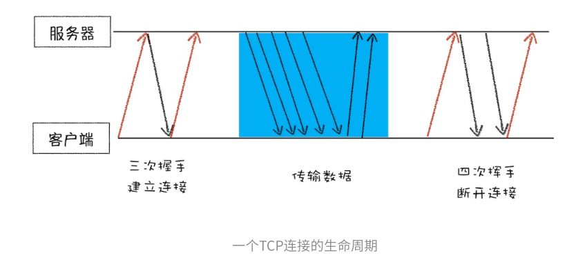

# 一、Chrome架构：仅仅打开了一个页面，为什么有 4 个进程？

## 进程和线程

### 什么是进程和线程？

**一个进程就是一个程序的运行实例，进程是操作系统中进行保护和资源分配的基本单位**。详细来说就是，启动一个程序的时候，操作系统会为该程序创建一块内存，用来存放代码、运行种的数据和一个执行任务的主线程，我们把这样的一个运行环境叫做**进程**。

**线程是进程的组成部分，它代表了一条顺序的执行流。线程是不能单独存在的，它由进程来启动和管理的**。

**线程是依附于进程的，而进程中使用多线程并行处理能提升运算效率。**

### 什么是并行处理？

**并行处理就是同一时刻处理多个任务**，⽐如我们要计算下⾯这三个表达式的值，并显⽰出结果：

```
A = 1+2
B = 20/5
C = 7*8
```

在编写代码的时候，可以把这个过程拆分为四个任务：

- **任务1?** 是计算A=1+2；
- **任务2?** 是计算B=20/5；
- **任务3?** 是计算C=7*8；
- **任务4?** 是显⽰最后计算的结果。

正常情况下可以使用**单线程**来处理，也就是分四步按照顺序分别执行这个任务。

如果采用**多线程**，则只需分 "两步走"：第一步，使用三个线程同时执行前三个任务；第二步，再执行第四个显示任务。

通过对比分析，你会发现用单线程执行需要四步，而使用多线程只需要两步。因此，**使用并行处理能大大提升性能**。


### 进程和线程之间的关系

**1. 进程中的任意一线程执行出错，都会导致整个进程的崩溃**。

**2. 线程之间共享进程中的数据**。

**3. 当一个进程关闭之后，操作系统会回收进程所占用的内存。**（即使其中任意线程因操作不当导致内存泄漏，当进程退出时，这些内存也会被正确回收）

**4. 进程之间的内容相互隔离。**（进程间通信使用（IPC）机制）


## Chrome 进程架构

以前的浏览器是**单进程浏览器**，**是指浏览器的所有功能模块都是运⾏在同⼀个进程⾥**，这些模块包含了⽹络、插件、JavaScript运⾏环境、渲染引擎和⻚⾯等。如此多的功能模块运⾏在⼀个进程⾥，是导致单进程浏览器 **不稳定**、 **不流畅**和 **不安全**的⼀个主要因素。


最新的 Chorme 浏览器采用多进程架构包括：1 个浏览器（Browser）主进程、1 个 GPU 进程、1 个网络（NetWork）进程、多个渲染进程和多个插件进程。

下面分析一下这几个进程的功能：

- **浏览器进程**：主要负责界面显示、用户交互、子进程管理，同时提供存储等功能。
- **渲染进程**：核⼼任务是将 `HTML`、`CSS`和`JavaScript`转换为⽤⼾可以与之交互的⽹⻚，排版引擎 Blink 和
  JavaScript 引擎 V8 都是运⾏在该进程中，默认情况下，Chrome会为每个 Tab 标签创建⼀个渲染进程。出
  于安全考虑，渲染进程都是运⾏在沙箱模式下。
- **GPU进程**：其实，Chrome 刚开始发布的时候是没有 GPU 进程的。⽽ GPU 的使⽤初衷是为了实现 `3D CSS`的
  效果，只是随后⽹⻚、Chrome 的 UI 界⾯都选择采⽤ GPU 来绘制，这使得 GPU 成为浏览器普遍的需求。最
  后，Chrome 在其多进程架构上也引⼊了 GPU 进程。
- **⽹络进程**：主要负责⻚⾯的⽹络资源加载，之前是作为⼀个模块运⾏在浏览器进程⾥⾯的，直⾄最近才独
  ⽴出来，成为⼀个单独的进程。
- **插件进程**：主要是负责插件的运⾏，因插件易崩溃，所以需要通过插件进程来隔离，以保证插件进程崩溃
  不会对浏览器和⻚⾯造成影响。


不过凡事都有两⾯性，虽然多进程模型提升了浏览器的稳定性、流畅性和安全性，但同样不可避免地带来了
⼀些问题：

- 更⾼的资源占⽤。因为每个进程都会包含公共基础结构的副本（如JavaScript运⾏环境），这就意味着浏
  览器会消耗更多的内存资源。
- 更复杂的体系架构。浏览器各模块之间耦合性⾼、扩展性差等问题，会导致现在的架构已经很难适应新的
  需求了。


# 二、TCP 协议：如果保证页面文件能被完整送达浏览器？

​		在衡量 Web 页面性能的时候有一个重要的指标叫 **“FP（First Paint）”**，是**指从页面加载到首次开始绘制的时长**这个指标直接影响了⽤⼾的跳出率，更快的⻚⾯响应意味着更多的PV、更⾼的参与度，以及更⾼的转化率。其中⼀个重要的因素是 **网络加载速度**

​		要想优化Web⻚⾯的加载速度，你需要对⽹络有充分的了解。⽽理解⽹络的关键是要对⽹络协议有深刻的认识，不管你是使⽤HTTP，还是使⽤ WebSocket，它们都是基于 **TCP/IP** 的，如果你对这些原理有⾜够了解，也就清楚如何去优化Web性能，或者能更轻松地定位Web问题了。此外，**TCP/IP** 的设计思想还有助于拓宽你的知识边界，从⽽在整体上提升你对项⽬的理解和解决问题的能⼒。

## 补充


> 互联网协议套件（Internet Protocol Suite，缩写 `IPS`）是一个网络通讯模型，以及一整个网络传输协议家族，为网际网络的基础通讯架构。它通常被称为 `TCP/IP 协议族`（`TCP/IP Protocol Suite`，或者 `TCP/IP Protocols`），简称 `TCP/IP`。因为该协议家族的两个核心协议：`TCP（传输控制协议）和 IP（网际协议）`，为该家族中最早通过的标准，所以才统称为 `TCP/IP 协议族`。


**那么如何保证⻚⾯⽂件能被完整地送达浏览器呢？**

## 一个数据包的 “旅程”

三个角度：“**数据包如何送达主机**” —— “**主机如何将数据包转交给应用**” —— “**数据是如何被完整地送达应用程序**” 来讲述数据的传输过程。

**互联⽹，实际上是⼀套理念和协议组成的体系架构**。其中，协议是⼀套众所周知的规则和标准，如果各⽅都同意使⽤，那么它们之间的通信将变得毫⽆障碍。

互联⽹中的数据是通过数据包来传输的。如果发送的数据很⼤，那么该数据就会被拆分为很多⼩数据包来传输。⽐如你现在听的⾳频数据，是拆分成⼀个个⼩的数据包来传输的，并不是⼀个⼤的⽂件⼀次传输过来的。


### 1. IP：把数据包送达目的主机

数据包要在互联网上进行传输，就要符合**网际协议**（Internet Protocol，简称 **IP**）标准。互联网上不同的在线设备都有唯一的地址，地址只是一个数字，着和大部分家庭收件地址类似，你只需要知道这个具体地址，就可以往这个地址发包，这样物流系统就能把物品送到目的地。

**计算机的地址就成为 IP 地址，访问任何网站实际上只是你的计算机向另外一台计算机请求信息。**

如果要想把一个数据包从主机 A 发送给主机 B，那么在传输之前，数据包上会被附加上主机 B 的 IP 地址信息，这样在传输过程中才能正确寻址。另外，数据包上还会附加上主机 A 本身的 IP 地址，有了这些信息主机 B 才可以回复信息给主机 A 。这些附加的信息会被装进一个叫 IP 头的数据结构里。**IP 头是 IP 数据包开头的信息，包含 IP 版本、源 IP 地址、目标 IP 地址、生存时间等信息**。

为了方便理解，把网络简单分为三层结构，如下：


下面来看一下一个数据包从主机 A 到主机 B 的旅程：

- 上层将含有信息的数据包交给网络层；
- 网络层再将 IP 头附加到数据包上，组成新的 **IP 数据包**，并交给底层；
- 底层通过物理网络将数据包传输给主机 B；
- 数据包被传输到主机 B 的网络层，这里主机 B 拆开数据包的 IP 头信息，并将拆开来的数据交给上层；
- 最终，含有信息的数据包就到了主机 B 的上层了。

### 2. UDP：把数据包送达应用程序

IP 是非常底层的协议，只负责把数据包传送到对方电脑，但是对方电脑并不知道把数据包交给哪个程序。因此，需要**基于 IP 之上开发能和应用打交道的协议**，最常见的是 “**用户数据包协议（User Datagram Protocol）**”，简称 **UDP** 。

UDP 中一个最重要的信息是**端口号**，端口号其实就是一个数字，每个想访问网络的程序都需要绑定一个端口号。通过端口号 UDP 就能把指定的数据包发送给指定的程序了，所以 **IP 通过 IP 地址信息把数据包发送给指定的电脑，而 UDP 通过端口号把数据包分发给正确的程序。**和 IP 头一样，端口号会被装进 UDP 头里面，UDP 头再和原始数据包合并组成新的 UDP 数据包。UDP 头中除了目的端口，还有源端口号等信息。 

为了支持 UDP 协议，把前面的三层结构扩充为四层结构，在网络层和上层之间增加了传输层，如下图所示：


下面是一个数据包从主机 A 传输到主机 B 的路线：

- 上层将含有信息的数据包交给传输层；
- 传输层会在数据包前面附加上 **UDP 头**，组成新的 UDP 数据包，再将新的 UDP 数据包交给网络层；
- 网络层再将 IP 头附加到数据包上，组成新的 IP 数据包，并交给底层；
- 数据包被传输到主机 B 的网络层，在这里主机 B 拆开 IP 头信息，并将拆开来的数据部分交给传输层；
- 在传输层，数据包的 UDP 头会被拆开，**并根据 UDP 中所提供的端口号，把数据部分交给上层的应用程序**；
- 最终，含有信息的数据包就传输到了主机 B 上层应用程序这里。

在使用 UDP 发送数据时，有各种因素会导致数据包出错，虽然 UDP 可以校验数据是否正确，但是对于错误的数据包，UDP 并不提供重发机制，只是丢弃当前的的包，而且 UDP 在发送之后也无法知道是否能够到达目的地。

虽说 **UDP 不能保证数据可靠性，但是传输速度却非常快**，所以 UDP 会应用在一些关注速度、但不那么严格要求数据完整性的领域，如在线视频、互动游戏等。


### 3. TCP：把数据完整地送达应用程序

对于浏览器请求，或者邮件这类要求数据传输可靠性（reliability）的应用，如果使用 UDP 来传输会存在两个问题：

- 数据包在传输过程中容易丢失；
- 大文件会被拆分成很多小的数据包来传输，这些小的数据包会经过不同的路由，并在不同的时间到达接收端，而 UDP 协议并不知道如何组装这些数据包，从而把这些数据包还原成完整的文件。

基于这两个问题，我们引入了 TCP 了。**TCP（Transmission Control Protocol，传输控制协议）是一种面向连接的、可靠的、基于字节流的传输层通信协议。**相对于 UDP，TCP 有下面两个特点：

- 对于数据包丢失的情况，TCP 提供重传机制；
- TCP 引入了数据包排序机制，用来保证把乱序的数据包组合成一个完整的文件。

和 UDP 头一样，TCP 头除了包含目标端口和本机端口号外，还提供了用于排序的序列号，以便接收端通过序号来重排数据包。

下面是 TCP 下的单个数据包的传输流程：


通过上图应该可以了解一个数据包是如何通过 TCP 来传输的。TCP 单个数据包的传输流程和 UDP 流程差不多，不同的地方在于，通过 TCP 头的信息保证了一块大的数据传输的完整性。

下面再看 **完整的 TCP 连接过程**，通过这个过程可以明白 TCP 是如何保证重传机制和数据包的排序功能的。

从下图可以看出，一个完整的 TCP 连接的生命周期包括了 "**建立连接**" 、"**传输数据**" 和 "**断开连接**" 三个阶段。



- **首先，建立连接阶段**。 这个阶段是通过 "三次握手" 来建立客户端和服务器之间的连接。TCP 提供面向连接的通信传输。**面向连接**是指在数据通信开始之前先做好两端之间的准备工作。所谓**三次握手**，是指在建立一个 TCP 连接时，客户端和服务器总共要发送三个数据包以确认连接的建立。
- **其次，传输数据阶段**。在该阶段，**接收端需要对每个数据包进行确认操作**，也就是接收端在接收到数据包之后，需要发送确认数据包给发送端。所以当发送端发送了一个数据包之后，在规定时间内没有接收到接收端反馈的确认消息，则判断为数据包丢失，并触发发送端的**重发机制**。同样，一个大的文件在传输过程中会被拆分成很多小的数据包，这些数据包到达接收端后，接收端会按照 TCP 头中的序号为其**排序**，从而保证组成完整的数据。
- **最后，断开连接阶段**。数据传输完毕之后，就要终止连接了，涉及到最后一个阶段 "四次挥手" 来保证双方都能断开连接。

TCP 为了保证数据传输的可靠性，牺牲了数据包的传输速度，因为 "三次握手" 和 "数据包校验机制" 等把传输过程中的数据包数量提高了一倍。

## 总结

- 互联网中的数据是通过数据包来传输的，数据包在传输过程中容易丢失或者出错。
- IP 负责把数据包送达目的主机。——网络层
- UDP 负责把数据包送达具体应用（端口）。——传输层
- TCP 保证了数据完整地传输，它的连接可分为三个阶段：建立连接、传输数据和断开连接。——传输层


