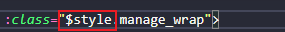
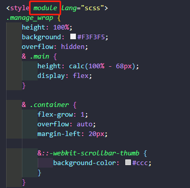
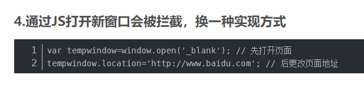
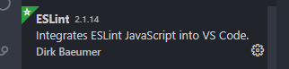

# CSS

## CSS Modules

[CSS Modules](https://vue-loader-v14.vuejs.org/zh-cn/features/css-modules.html)

老项目文件：是以用$style的文件，就用$style来维护，保持一致性，免得很乱，没有用这种写法的以及新创建的文件，都用字符串来写类名





## Fixed 定位问题

外部盒子若使用 `transform` ，会导致定位错误，会根据外部盒子进行定位，而不是视窗

# JS

## JS 打开新窗口被拦截




# 网络

## HTTP

### post 请求体限制

https://blog.csdn.net/yangguosb/article/details/83685647

[请求数据大小说明](http://yulilong.cn/doc/browserNetwork/007-http%E6%8A%A5%E6%96%87%E5%92%8C%E8%AF%B7%E6%B1%82%E6%95%B0%E6%8D%AE%E5%A4%A7%E5%B0%8F.html#_4-2-%E8%AF%B7%E6%B1%82%E5%A4%B4%E9%83%A8-header)

**请求体 body**

HTTP支持文件传输，文件的二进制数据不会放在URI或header中，而放在了body里面，那么这个body的大小就一定不能默认限制太小，尤其是客户端。

理论上，协议没有对body大小做任何限制。

浏览器也没有对body做任何大小限制，因为如果浏览器做了大小限制就意味着它直接影响了你的服务功能。

所以对body的限制任务就放在了服务器上。

出于安全考虑，我们必须在服务器端对请求体大小进行限制，请求体长度的最大值的设置有多方面的因素，需要根据业务情况反复调优决定。考虑以下几方面因素： 1、根据请求报文的大小，预估实际请求体的最大值； 2、限制上传文件的大小，文件上传服务与业务操作服务分离； 3、设置合理的超时时间，避免由于请求体太大导致线程被长时间占用； 4、请求体设置不能太大，防止轻易被DDOS攻击； 在Nginx中，`client_max_body_size`参数可以限制body大小，默认是1M。`client_body_timeout`参数用于当body太大，或者网络太差时，这个也有可能会影响请求的成功率。

## 请求库

### axios 手动取消请求

```vue
<body>
  <div class="page" id="app">
    <button @click="getMsg" class="get-msg">获取数据</button>
    <button @click="cancelGetMsg" class="cancel">取消获取</button>
    <ul>
      <li v-for="item in items">{{item.name}}</li>
    </ul>
  </div>
  <script>
  var app = new Vue({
    el: '#app',
    data: {
      message: 'Hello Vue!',
      items: [],
      cancel: null
    },
    methods: {
      getMsg () {
        let CancelToken = axios.CancelToken
        let self = this
        axios.get('http://jsonplaceholder.typicode.com/comments', {
          cancelToken: new CancelToken(function executor(c) {
            self.cancel = c
            console.log(c)
            // 这个参数 c 就是CancelToken构造函数里面自带的取消请求的函数，这里把该函数当参数用
          })
        }).then(res => {
          this.items = res.data
        }).catch(err => {
          console.log(err)
        })


        //手速够快就不用写这个定时器了，点击取消获取就可以看到效果了
        setTimeout(function () {
          //只要我们去调用了这个cancel()方法，没有完成请求的接口便会停止请求
          self.cancel()
        }, 100)
      },
      //cancelGetMsg 方法跟上面的setTimeout函数是一样的效果，因为手速不够快，哦不，是因为网速太快，导致我来不及点取消获取按钮，数据就获取成功了
      cancelGetMsg () {
        // 在这里去判断你的id 1 2 3，你默认是展示的tab1，点击的时候不管你上一个请求有没有执行完都去调用这个cancel()，
        this.cancel()
      }
    }
  })
  </script>
</body>
```

# 功能点

## 文件下载（响应文件流接收）

导出文件示例：

```js
/**
 * @description: 文件导出（xhr 请求方式）
 * @detail: 
 * @param {*} url           导出请求地址
 * @param {*} fileName      导出文件名（默认后缀 YYYY-MM-DD）
 * @param {*} fileExtension 文件扩展名
 * @param {*} callback      请求结束回调
 */
WXApp.excelFileExport = function(url, fileName, fileExtension = 'txt', callback) {
    axios.get(url,
        {
            responseType: 'blob',    // 设置相应的数据类型为一个包含二进制数据的Blob对象，必须设置
        },
    ).then(res => {
        const { data } = res;
        const blob = new Blob([data], { type: 'application/vnd.ms-excel' });
        const downloadElement = document.createElement('a');     // 新建一个 a 标签
        const href = window.URL.createObjectURL(blob);           // 创建下载的链接
        downloadElement.href = href;
        const exportFileName = `${(fileName ? fileName : '导出文件')}-${moment().format('YYYY-MM-DD')}`;
        downloadElement.download = `${exportFileName}.${fileExtension}`;     // 下载后文件名
        document.body.appendChild(downloadElement);             // 将新增的节点挂载到页面上
        downloadElement.click();                                // 触发点击下载
        document.body.removeChild(downloadElement);             // 下载完成移除元素
        window.URL.revokeObjectURL(href);                       // 释放掉blob对象
    })
    .catch(error => {
        WXApp.ing(error.message, true, 'failed');
    })
    .finally(() => {
        callback && callback();
    });
}
```


# 项目构建配置

## Eslint 配置



1.cd ~/dev-svn/jiguiyuan/res/edu/js/ （进入js文件所在目录）
2.npm install eslint --save-dev
3.npm install babel-eslint --save-dev
4.npm install eslint-plugin-vue --save-dev

- 配置 Eslint 

  ```json
  "eslint.alwaysShowStatus": true,
    "eslint.validate": [
      "javascript",
      "javascriptreact",
      "html",
      "vue"
    ],
    "editor.codeActionsOnSave": {
      "source.fixAll.eslint": true
    },
    "eslint.probe": [
      "javascript",
      "javascriptreact",
      "typescript",
      "typescriptreact",
      "html"
    ],
  ```

  