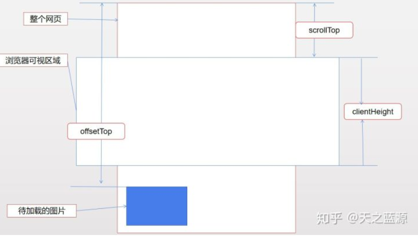

# 自我介绍

  【开头】面试官您好，我是XX，来自XX大学XX专业，是XX级的本科/硕士生，首先非常感谢XX公司给我这次机会，我这次应聘的是XX岗位；
【中间】关于我有两个特点，特点1+一个特点1的事儿，特点2+一个特点2的事儿；
【结尾】我相信我的这些特质，是大体符合公司该岗位的用人要求的，谢谢。  


​	面试官您好，我是纪桂源，我来自北部湾大学物联网工程专业，是21届的本科生，非常感谢贵公司给我这次机会，我这次应聘的是前端开发岗位；

​	首先，本人在校期间，学习成绩专业前十，曾任职校物联网协会项目部副部长，通过相关的书籍和技术论坛以及技术视频来学习前端知识。

​	曾获得物联网竞赛二等奖以及广西大学生人工智能大赛物联网应用赛道二等奖，后者做的项目是基于 websocket 的实时数据监控系统，通过使用 node 连接 tcp 服务器，再与前端通过 websocket 来交互实现数据的实时传输。 最近的一个项目是与同学合作的旅游论坛项目，负责前端开发以及功能点设计，使用的 vue 框架以及ElementUI 组件库来搭建项目。

​	我的自我介绍结束，谢谢。

# 项目经历

## 项目一：

### 1. 抽取封装通用组件，弹出层组件

具名插槽：`<slot name="body"></slot>`

使用：`<template v-slot:body></template>`

### 2. 使用富文本编辑器

关键：`document.execCommand`API

wangEditor

### 3.	使用	axios	库与后端数据交 互，并且进行	接口统一错误拦截。

```js
// 超时设置 8s
axios.defaults.timeout = 8000;
// 根据环境变量获取不同的请求地址
// axios.defaults.baseURL = env.baseURL;
// 接口错误拦截
axios.interceptors.response.use(function (response){
  // 直接取得响应的 data
  let res = response.data;
  // 业务错误拦截
  if(response.status == 200){
    return res;
  }else{
    // 抛出异常
    Message.warning(res.msg);
    return Promise.reject(res);
  }
},(error)=>{
  // 请求错误拦截 http 状态码
  let res = error.response;
  Message.error(res.data.message);
  return Promise.reject(error);
});
```

### 4.	使用	nginx	反向代理解决跨域问题	(nginx 恩静克思)

```js
module.exports = {
    devServer: {
        host: 'localhost',
        port: 8080,
        // 反向代理
        proxy: {
            //拦截 /api 的访问
            // 例 https://localhost:8080/api/loading
            // 当访问到 /api 时会转发到 target
            '/api': {
                // 代理的目标地址
                target: 'http://47.106.215.69:8080/',
                // 是否要将主机头的源点更改为 url 地址
                changeOrigin: true,
                // 路径转发规则：把 /api 置为空
                pathRewrite: {
                    '/api': ''
                },
            }
        }
    }
```

### 5. 使用图片懒加载，滚动加载获取后端数据，异步组件，Element	UI库按需引入等进行性能优化

#### 图片懒加载

浏览器是否发起亲求就是根据是否有src属性决定的， **初始置 src 属性为空**，或者全部为“加载中”提示图的路径。**监听页面滚动**，**当图片标签即将进入可视区域时给src重新赋值**。此时图片开始加载。


在懒加载的实现中，有两个关键的数值：一个是**当前可视区域的高度**，另一个是**元素距离可视区域顶部的高度**。

**当前可视区域的高度**，在现代浏览器记忆 IE9 以上的浏览器中，可以使用 `window.innerHeight` 属性获取，在低版本的 IE 中使用 `document.documentElement.clientHeight` 获取，



如果：`offsetTop - scrollTop < clientHeight`，则图片进入了可视区域内，则被请求。

#### 代码实现：

```html
<body>
    
    
    
    
    
    
    
    
    
    
    
    
</body>
```

```js
var imgs = document.querySelectorAll('img');

//offsetTop是元素与offsetParent的距离，循环获取直到页面顶部
function getTop(e) {
    var T = e.offsetTop;
    while(e = e.offsetParent) {
        T += e.offsetTop;
    }
    return T;
}

function lazyLoad(imgs) {
    var H = document.documentElement.clientHeight;//获取可视区域高度
    var S = document.documentElement.scrollTop || document.body.scrollTop;
    for (var i = 0; i < imgs.length; i++) {
        if (H + S > getTop(imgs[i])) {
            imgs[i].src = imgs[i].getAttribute('data-src');
        }
    }
}
// 防抖函数
function debounce(fn, delay = 500) {
    let timer = null;
    return function (...args) {
      if (timer) clearTimeout(timer);
      timer = setTimeout(() => {
        fn.call(this, args);
      }, delay);
    };
}

// 是的页面初始化是加载首屏图片
window.onload = lazyload;
// 监听Scroll事件，为了防止频繁调用，使用防抖函数优化一下
window.addEventListener("scroll", debounce(lazyload, 600), false);
```

## express和koa的区别

**1. 语法区别**

experss 异步使用 回调
koa1 异步使用 generator + yeild
koa2 异步使用 await/async

**2. 中间件区别**

koa采用洋葱模型，进行顺序执行，出去反向执行，支持context传递数据
express本身无洋葱模型，需要引入插件，不支持context
express的中间件中执行异步函数，执行顺序不会按照洋葱模型，异步的执行结果有可能被放到最后，response之前。
这是由于，其中间件执行机制，递归回调中没有等待中间件中的异步函数执行完毕，就是没有await中间件异步函数

**3. 集成度区别**

express 内置了很多中间件，集成度高，使用省心，
koa 轻量简洁，容易定制