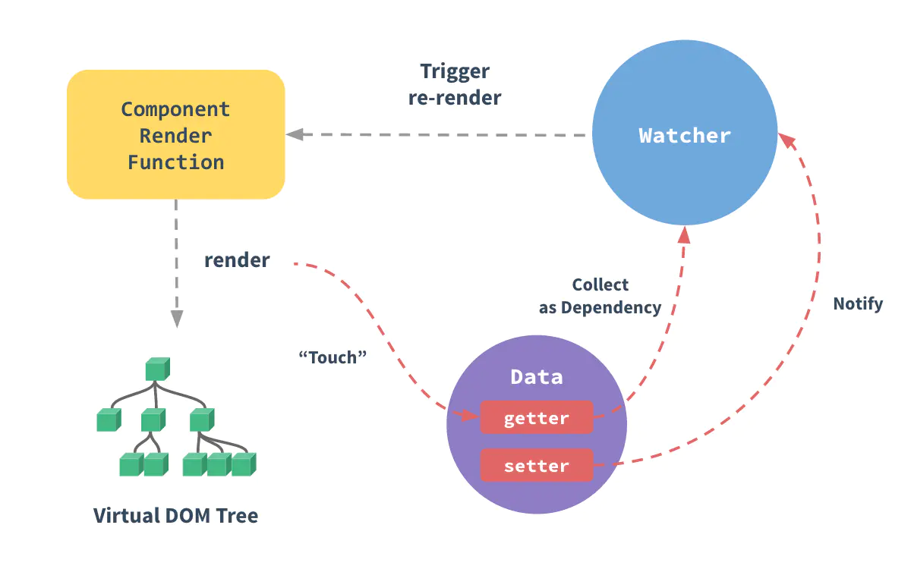
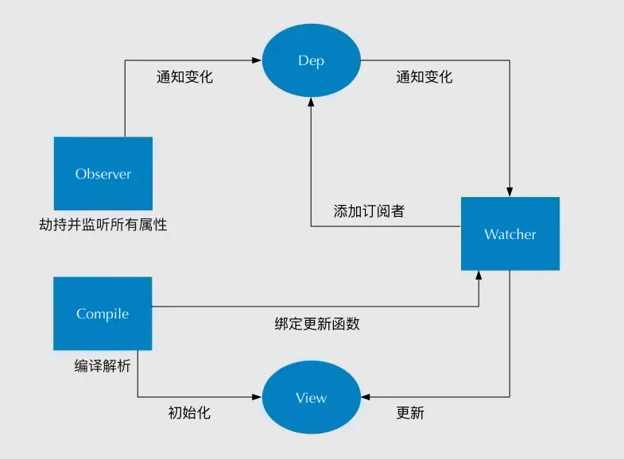

# 云影天光

## 项目相关

## 技术

### nginx 性能

#### vue2.x 双向绑定 / 响应式数据原理

- Vue 数据双向绑定主要是指：数据变化更新视图，视图变化更新数据。其中，View 变化更新 Data，可以通过事件监听的方式来实现，所以 Vue 数据双向绑定的工作主要是如何 **根据 Data 变化更新 View**。

- 简述：

  - 当你把一个普通的 JavaScript 对象传入 Vue 实例作为 data 选项，Vue 将遍历此对象所有的属性，并使用 `Object.defineProperty` 来设置这些属性的 `getter/setter`。
  - 这些 `getter/setter` 对用户来说是不可见的，但是在内部它们让 Vue 能够追踪依赖，在属性被访问和被修改时通知变更。
  - 每个组件实例都对应一个 `watcher` 实例，它会在组件渲染的过程中把 “接触” 过的数据属性记录为依赖。之后当依赖项的 `setter` 触发时，会通知 `watcher` ，从而使它关联的组件重新渲染。

  


- 深入理解：
  - **监听器 Observer**：对数据对象进行遍历，包括子属性对象的属性，利用 `Object.defineProperty()` 对属性都加上 `getter/setter`方法。这样的话，给这个对象的某个属性赋值，就会触发 setter，那么就能监听到了数据变化。
  - **解析器 Compile**：解析 Vue 模板指令，将模板中的变量都替换成数据，然后初始化渲染页面视图，并将每个指令对应的节点绑定更新函数，添加监听数据的订阅者，一旦数据有变动，收到通知，调用更新函数进行数据更新。
  - **订阅者 Watcher**：Watcher 订阅者是 Observer 和 Compile 之间的通信桥梁，主要的任务是订阅 Observer 中的属性值变化的消息，当收到属性值变化的消息时，触发解析器 Compile 中对应的更新函数。（每个组件实例都有相应的 watcher 实例对象，它会在组件渲染的过程中把属性记录为依赖，之后的依赖项的 setter 被调用时，会通知 watcher 重新计算，从而使它关联的组件得以更新————这是一个典型的观察者模式）。
  - **订阅器 Dep**：订阅器采用 发布-订阅 设计模式，用来收集订阅者 Watcher，对监听器 Observer 和订阅者 Watcher 进行统一管理。



#### MVC / MVVM 区别原理

##### 对 MVC 的理解

- `Model-View-Controller` 的缩写，Model 代表数据层，View 代表视图层，Controller 代表控制层。
- 控制层负责根据用户从视图层输入的指令，选取数据层中的数据，然后对其进行相应的操作，产生最终结果。
- 简单理解：用户操作 -> View（负责接收用户的输入操作）-> Controller（业务逻辑处理）-> Model（数据持久化）-> View（将结果反馈给 View）

##### 对 MVVM 的理解

- `Model-View-ViewModel` 的缩写，Model 代表数据模型，View 代表 UI 组件，ViewModel 将 Model 和 View 关联起来。
- 数据会绑定到 viewModel 层并自动将数据渲染到页面中，视图变化的时候会通知 viewModel 层更新数据。
- **设计思想**：关注 Model 层的变化，让 MVVM 框架去**自动更新 DOM 的状态**，从而把开发者从操作 DOM 的繁琐步骤中解脱出来。

### 性能优化

图片懒加载，滚动加载获取后端数据，路由引入异步组件，UI 库按需引入

### 项目难点

### 前端缓存（localStroage、SessionStroage）

### vue load（没听清）

### 跨域

- JSONP

- CORS

- 反向代理

### 内存泄漏（没接触过就没问了）

### 微信小程序（无接触）

### v-if 和 v-show

- v-if 是惰性加载的，当条件不成立时，v-if 不会渲染 DOM 元素；直到条件第一次变为真时，才会开始渲染条件块。
- v-show 不管初始条件是什么，元素总是会被渲染，操作的是样式（display），切换当前的 DOM 的显示和隐藏。
- v-if 使用与在运行时很少改变条件，不需要频繁切换条件的场景；
- v-show 则适用于需要非常频繁切换条件的场景。


## 其他

### 如何学习前端

### 可远程办公


# 朗视

### 如何判断一个对象为空

1. 最常见的思路，`for...in...` 遍历属性，为真则为“非空数组”；否则为“空数组”

   ```js
   for (var i in obj) { // 如果不为空，则会执行到这一步，返回true
       return true
   }
   return false // 如果为空,返回false
   ```

2. 通过 `JSON` 自带的 `stringify()` 方法来判断:

   `JSON.stringify()` 方法用于将 `JavaScript` 值转换为 `JSON` 字符串。

   ```js
   if (JSON.stringify(data) === '{}') {
       return false // 如果为空,返回false
   }
   return true // 如果不为空，则会执行到这一步，返回true
   ```

3. `ES6` 新增的方法 `Object.keys()`:

   `Object.keys()` 方法会返回一个由一个给定对象的自身可枚举属性组成的数组。

   如果我们的对象为空，他会返回一个空数组，如下：

   ```js
   var a = {}
   Object.keys(a) // []
   ```

   也可以依靠 `Object.keys()` 这个方法通过判断它的长度来知道它是否为空。

   ```js
   if (Object.keys(object).length === 0) {
       return false // 如果为空,返回false
   }
   return true // 如果不为空，则会执行到这一步，返回true
   ```

4. `Object.getOwnPropertyNames()`方法
   此方法是使用Object对象的 `getOwnPropertyNames` 方法，获取到对象中的属性名，存到一个数组中，返回数组对象，我们可以通过判断数组的length来判断此对象是否为空。
   注意：此方法不兼容ie8，其余浏览器没有测试。

   ```js
   var data = {};
   var arr = Object.getOwnPropertyNames(data);
   alert(arr.length == 0);//true
   ```

### 异步方式

- **回调函数**
- **事件监听**

- **promise**
- **生成器 Generators / yield**
- **async/await**

# 天贝物联

### 闭包

### 跨域

### 项目搭建流程

### 异步方式

## 答不上来的

### 数组排序使用的是什么算法

### 富文本转义，后续查询

### 前端安全（没了解）

### 数组的遍历处理——（ES6 的 Set 、Map 新集合）

### 前端分页——如何处理数据

### websocket 原理（通信原理）

### 输入 url 。。。。（不完整）

# 玩动网络（十几分钟）

## 一面（技术

#### vue 父子传参 以及 是否可以修改 props 传递的属性

#### es6 的新特性

#### 箭头函数的 this

#### es6 子类如何访问父类

#### 原生 js 的继承是怎么实现的

### 不会，或者没答好

#### 面向对象 js 相关（多态、重载），js 如何实现多态

#### webpack 用过什么插件

#### CSRF 是什么以及怎么防御

## 三面

### 面向对象和面向过程的区别（需要去细究一下）

### webpack 的打包原理（不会）

### vue 的生命周期

### ES6 新特性

### var、let 的区别

### 项目搭建的流程

### 表单编辑时，当用户刷新后，如何去保存用户上次所输入的信息

### jQuery 和 vue 在项目中如何选择考虑？


# 荔枝（一小时）

## 笔试

### block  和 inline 的区别

- **block**：
  - block元素会独占一行，多个block元素会各自新起一行。默认情况下，block元素宽度自动填满其父元素宽度。
  - block元素可以设置width,height属性。块级元素即使设置了宽度,仍然是独占一行。
  - block元素可以设置margin和padding属性。
- **inline**：
  - inline元素不会独占一行，多个相邻的行内元素会排列在同一行里，直到一行排列不下，才会新换一行，其宽度随元素的内容而变化。
  - inline元素设置width,height属性无效。
  - inline元素的margin和padding属性，水平方向的padding-left, padding-right, margin-left, margin-right都产生边距效果；但竖直方向的padding-top, padding-bottom, margin-top, margin-bottom不会产生边距效果。

### 垂直居中的 N 种方法

-  单行内联（inline）元素

  - 有时候行内元素或文字显示为垂直居中，是因为它们的上下内边距（**padding**）相等

    ```css
    .element {
        padding-top: 30px;
        padding-bottom: 30px;
    }
    ```
  - 如果 padding 出于某些原因无法使用，那么可以通过设置内联元素高度（**height**）和行高（**line-height**）相等。
    ```css
    .element {
        height: 30px;
        line-height: 30px;
    }
    ```

-  多行内联元素

   -  ##### 利用表布局（**table**）

      利用表布局的 `vertical-align: middle` 可以实现子元素的垂直居中。

      ```css
      .table-center{
          display: table;
      }
      .child {
          display: table-cell;
          vertical-align: middle;
      }
      ```

-  块级元素

   -  **absolute+负margin（需定宽）**

      ```css
      .parent {
          position: relative;
      }
      .child {
          position: absolute;
          top: 50%;
          height: 100px;
          margin-top: -50px;
      }
      ```

   -  **absolute + margin-top/bottom: auto (可用百分比宽度)**

      ```css
      .parent {
          position: relative;
      }
      .child {
          position: absolute;
          top: 0;
          bottom: 0;
          height: 100px;
          margin: auto 0;
      }
      ```

-  通用：

   - **flex + align-items**

     ```css
     .flex-center {
         display: flex;
         align-items: center;
     }
     ```

   - **absolute + transform**

     ```css
     .parent {
         position: relative;
     }
     .child {
         position: absolute;
         top: 50%;
         transform: translateY(-50%);
     }
     ```

### cookie 的缺点

- 缺点：
  1. **Cookie 数量和长度的限制**。每个域名最多只能有 20 条 cookie，每个 cookie 长度不能超过 4KB，否则会被截掉。
  2. **安全性问题**。在 HTTP 请求种 cookie 是明文传递的，有被篡改或窃取的风险。
  3. **用户配置为禁用**。有些用户会禁用 cookie 功能。
  4.  **额外开销**。  cookie 在每次发起 HTTP 请求的时候都会被发送给服务器，会增加开销。
- 优点：
  1. **数据持久性**。
  2. **可配置过期时间**。通过控制 cookie 的生命期，使之不会永远有效
  3. **简单性**
  4. 通过加密和安全传输技术（ SSL ），可减少 cookie 被破解的可能性。
  5.  通过良好的编程，可控制保存 cookie 中的 session 对象的大小。

###  localStorage 与 sessionStorage 的区别

共同点：

1. 都是保存在浏览器端，且是同源的，不好自动把数据发送给服务器。

2. 存储大小可以达到 5M 或者更大。
3. 有对应的 API：`setItem、getItem、removeItem。`

区别：

1. 数据有效期：

   - localStorge：存储持久数据，在本地种中储，浏览器关闭后数据不会丢失除非主动删除数据。
   - sessionStorage：在内存种存储，是一种会话技术，数据在当前浏览器关闭后自动删除。

2. 作用域：

   - 不同浏览器无法共享`localStorage`或`sessionStorage`中的信息

   - localStorage 在所有同源窗口都是共享的。
   - sessionStorage 在不同页面或标签页间无法共享

   - 注：如果一个标签页包含多个`iframe`标签且他们属于同源页面，那么他们之间是可以共享`sessionStorage`的。

### HTTP 状态码，401，301，302

- `301 Moved Permanently`，永久性重定向，表示资源已经被分配新的 URL。
- `302 Found`，临时性重定向，表示资源临时被分配了新的 URL。


- `401 Unauthorized`，表示发送的请求需要有通过 HTTP 认证的认证信息。

### 原生 js 实现继承

组合继承：

```js
function Parent (name) {
    this.name = name;
    this.colors = ['red', 'blue', 'green'];
}

// 原型链继承
Parent.prototype.getName = function () {
    console.log(this.name)
}

function Child (name, age) {
	// 借用构造函数
    Parent.call(this, name);
    this.age = age;
}

Child.prototype = new Parent();
// 重写子类的 constructor 属性，指向自己本身的构造函数 Child
Child.prototype.constructor = Child;

var child1 = new Child('gy', '21');
```

### 创建一个函数，传递父类和子类，返回继承子类的父类。

## 面试

### block 与 inline 

### BFC是什么？作用？如何触发？（没回答好）

### cookie 的安全性怎么处理

### cookie 跨域处理

### http 状态码？304？

### 浏览器缓存分为哪几种？协商缓存怎么设置？（没记住是什么）

### for 循环中嵌套函数传递 i 的几种方法（let 函数传参）

### 讲一下 var、let、const 的区别

### css 动画位移时使用什么可以增强性能？（transform，类似硬件加速）

### es6 箭头函数、扩展运算符结合参数获取箭头函数的参数

### arguments 是否会影响形参？（会）

### 使用过 Promise 吗？（状态如何改变）了解过规范吗？

### 图片懒加载处理

### axios 的统一拦截是怎么实现的

### Base 64 的原理

### 使用 Vue.set 的原因（2.x 对于对象与数组的处理）

### Vue 如何监听数组方法（2.x）

### v-model 如何实现？

### es6 的模块化，之前的呢（amd、comxxx）

### node 中的 require 和 import


# 暗物智能（二十几分钟）

## 一面

### 了解过哪些 ES6 的新特性？（不熟，需加深）

### async/await  和 Promise 的关系

### 箭头函数和普通函数的区别

### 类和普通函数有什么关系？（原型）

### 讲一下原型链

### nginx 跨域怎么做？CORS 呢？

### 图片懒加载的原理？

### websocket 原理？使用过系统的 socket 吗？

### Bootstrap 栅格布局的原理？自己如何实现？（flex）

### 具体说一下 flex 布局（不熟，多看看各个属性）

### Vue 2.x 和 3.x 的区别

### Object.defineProperty 的缺陷还有为什么监听不到数组？那如何监听数组？

### Git 的命令，常用的一些


## 二面

```js
/**
 * 给定一个树，给定一个节点id，返回从root到该节点的path（从跟节点到查询节点的路径上所有节点的id，以短横线连接）、以及该节点的所有子孙节点中是叶子节点的节点id数组，格式见return
 * @param {object: { _id: number, children: [ tree ] }} tree
 * @param {number} id 
 * @return 6 => { path: '1-3-6', leaves: [ 9, 10 ] }
 * @example
 */

const exampleTree = {
    _id: 1,
    children: [{
        _id: 2,
        children: [{
            _id: 4,
            children: [{
                _id: 7,
                children: []
            }]
        }, {
            _id: 5,
            children: []
        }]
    }, {
        _id: 3,
        children: [{
            _id: 6,
            children: [{
                _id: 8,
                children: [{
                    _id: 10,
                    children: []
                }]
            }, {
                _id: 9,
                children: []
            }]
        }]
    }]
}

const exampleId = 1
const exampleResult = {
    path: '1-3-6',
    leaves: [9, 10]
}

function searchTree(exampleTree, exampleId) {
}
searchTree(exampleTree,exampleId)
```

回答：

```js
function searchTree(exampleTree, exampleId) {
    let result = !arguments[2] ? {
        path: '',
        leaves: []
    } : arguments[2];
    // 若当前节点与寻找节点相同
    if(exampleTree['_id'] == exampleId){
        exampleTree.children.forEach((item)=>{
            if(item.children.length == 0) {
                result.leaves.push(item['_id']);
            }
        })
        result.path += String(exampleTree['_id']);
        result.flag = true;
        return result;
    }
    result.path += exampleTree['_id'] + '-';
    // 寻找左节点树
    exampleTree.children.find((item)=>{
        // 在子节点树中查找
        let fin = searchTree(item, exampleId, result);
        // 若找到直接返回
        if(fin.hasOwnProperty('flag')){
            result = fin;
            return true;
        }
    })
    return result;
}
```

### Vue 3.0 新增了什么？

### Object.defineProperty 为什么监听不了数组（数组的 length 不可修改属性）

### 前端缓存的选择

### Vuex 的生命周期

# 职业规划

1-2：各大框架

2-3：H5、移动端、小程序

后面：大前端（全栈

# 不会的题（解决）

## 前端安全

### CSRF（跨站请求伪造）

> 你可以这么理解 CSRF 攻击：攻击者盗用了你的身份，以你的名义进行恶意请求。它能做的事情有很多包括：以你的名义发送邮件、发信息、盗取账号、购买商品、虚拟货币转账等。总结起来就是：个人隐私暴露及财产安全问题。

利用的是站点对客户端的信任，当用户成功登录过后，在没有登出的情况下，站点会对客户端信任（例如请求携带 cookie）。在此期间，用户访问危险网站，危险网站种存在恶意代码，代码发送一个恶意请求，携带了站点的信任信息，然后该站点验证为合法的请求，即达到了 CSRF 的攻击目的。

#### 防御措施（推荐添加 token / HTTP 头自定义属性）

- 涉及到数据修改操作严格使用 post 请求而不是 get 请求
- HTTP 协议中使用 Referer 属性来确定请求来源进行过滤（禁止外域）
- 请求地址添加 token，使黑客无法伪造用户信息
- HTTP 头自定义属性验证（类似上一条）
- 显示验证方式：添加验证码、密码等

### XSS（跨站脚本攻击）

> XSS 又叫 CSS（Cross Site Script），跨站脚本攻击：攻击者在目标网站植入恶意脚本（js / html），用户在浏览器运行时可以获取用户敏感信息（cookie / session），修改 web 页面以欺骗用户、与其他漏洞相结合形成蠕虫等。

浏览器遇到 html 中的 script 标签时，会解析并执行其中的js代码。

#### XSS 类型

- 持久型 XSS：将脚本植入到服务器上，从而导致每个访问的用户的都会执行。
- 非持久型 XSS：对个体用户某 url 的参数进行攻击。

#### 防御措施

- 现代大部分浏览器都自带 XSS 筛选器，vue / react 等成熟框架也对 XSS 进行一些防护
- 即便如此，我们在开发时也要注意和小心，对用户输入内容和服务端返回内容进行过滤和转译

- 重要内容加密传输
- 合理使用get/post等请求方式
- 对于URL携带参数谨慎使用
- 我们无法做到彻底阻止，但是能增加黑客攻击成本，当成本与利益不符时自然会降低风险