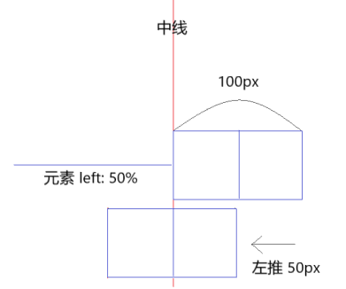
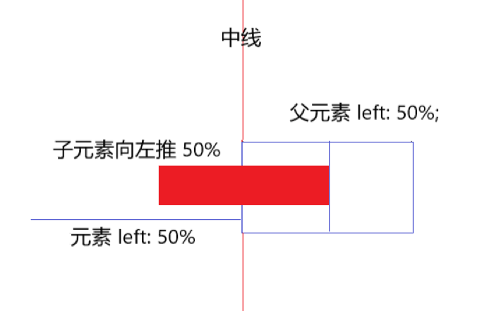

#### 1. 介绍一下标准的 CSS 的盒子模型？低版本 IE 的盒子模型有什么不同？

```
1. 有两种：W3C 盒模型（标准盒模型）和 IE 盒模型（怪异盒模型）
2. 盒模型：内容(content)、填充(padding)、边界(margin)、边框(border);
3. 区别：IE 盒模型的 content 部分包括了 border 和 padding，也就是说盒子的宽高为 content + padding + border;
浏览器默认使用标准盒模型
IE 盒模型用： box-sizing: border-box 来设置
```

#### 2. CSS 选择符有哪些？哪些属性可以继承?

```
-	1. id选择器（# id）
  	2. 类选择器（. className）
  	3. 标签选择器（div, h1, p）
  	4. 相邻选择器（h1 + p）
  	5. 子选择器（ul > li）
  	6. 后代选择器（li a）
    7. 通配符选择器（ * ）
    8. 属性选择器（a[rel = 'xxx']）
    9. 伪类选择器（a:hover, li:nth-child） （伪类表示一种状态）
    10. 伪元素选择器 （::after ::before）（伪元素生成的是"表现"）

- 可继承样式：font-size font-family color
- 不可继承样式：border padding margin width height
```

#### 3. CSS 优先级算法如何计算？

```
- 优先级就近原则，同权重情况下样式定义最近者为准；
- 载入样式以最后载入的定义为准；
优先级为：
	同权重：内联样式表（标签内部）> 嵌入样式表（当前文件中）> 外部样式表（外部文件中）
	!important > id(100) > class > tag
	important 比内联(1000)优先级高
	权重值：
	1、!important，加在样式属性值后，权重值为 10000
    2、内联样式，如：style=””，权重值为1000
    3、ID 选择器，如：#content，权重值为100
    4、类，伪类和属性选择器，如： content、:hover 权重值为10
    5、标签选择器和伪元素选择器，如：div、p、:before 权重值为1
    6、通用选择器（*）、子选择器（>）、相邻选择器（+）、同胞选择器（~）、权重值为0
```

#### 4. CSS3 新增伪类有哪些？

```
例如：
	p:first-of-type 选择属于其父元素的首个 <p> 元素的每个 <p> 元素
	p:last-of-type	选择属于其父元素的最后 <p> 元素的每个 <p> 元素
 	p:only-of-type	选择属于其父元素唯一的 <p> 元素的每个 <p> 元素
 	p:only-child	选择属于其父元素的唯一子元素的每个 <p> 元素。
  	p:nth-child(2)	选择属于其父元素的第二个子元素的每个 <p> 元素
  	
	伪元素：
    ::after			在元素之前添加内容,也可以用来做清除浮动。
  	::before		在元素之后添加内容
    :enabled  		匹配每个已启用的元素（大多用在表单元素上）
  	:disabled 		控制表单控件的禁用状态。
  	:checked        单选框或复选框被选中。
```

#### 5. 如何水平/垂直居中？

##### 内联元素水平居中：

设置 `text-align: center `

##### 内联元素垂直居中:

**单行内联元素**

设置上下内边距（**padding**）相等或者设置内联元素高度（**height**）和行高（**line-height**）相等：

```css
.element {
    padding-top: 30px;
    padding-bottom: 30px;
}
// 或者设置内联元素高度（height）和行高（line-height）相等
.element {
    height: 30px;
    line-height: 30px;
}
```

**多行内联元素**

**1. 利用表布局（table）**

利用表布局的 `vertical-align: middle` 可以实现子元素的垂直居中。

```css
.table-center{
    display: table;
}
.child {
    display: table-cell;
    vertical-align: middle;
}
```

**2. 利用"精灵元素"(ghost element)**

利用"精灵元素"(ghost element)技术实现，即在父容器内放一个100%高度的伪元素，让文本和伪元素垂直对齐(vertical-align)，从而达到垂直居中的目的。

```css
.ghost-center {
    position: relative;
}
.ghost-center::before {
    content: " ";
    display: inline-block;
    height: 100%;
    width:1%;
    vertical-align: middle;
}
.ghost-center p {
    display: inline-block;
    vertical-align: middle;
    width: 20rem;
}
```


##### 块级元素水平居中：

###### 1. （需定宽）margin: 0 auto;

```
.block-box{
	width: 100px;		// 需定宽
	margin: 0 auto;
}
```

###### 2. 绝对定位 absolute + transform; (CSS3，有兼容性问题)

```
.parent{
	position: relative;
}
.child{
	position: absolute;
	left: 50%;
	transform: translateX(-50%);
}
```

###### 3.（需定宽）绝对定位 absolute + 负margin 

```css
.parent {
    position: relative;
}
.child {
    position: absolute;
    width: 100px;
    left: 50%;
    /* 向左偏移元素高度的一半 */
    margin-left: -50px;
}
```

###### 4. (可用百分比宽度) 绝对定位 absolute + margin: 0 auto; 

```css
.parent {
    position: relative;
}
.child {
    position: absolute;
    width: 50%;
    height: 50%;
    left: 0;
    right: 0;
    /*水平居中*/
    margin: 0 auto;
}
```

##### 块级元素垂直居中:

###### 1. (需定宽) 绝对定位 + 负margin

```css
.parent {
    position: relative;
}
.child {
    position: absolute;
    top: 50%;
    height: 100px;
    margin-top: -50px;
}
```

###### 2. 绝对定位 absolute + margin-top/bottom: auto (可用百分比宽度)

```css
.parent {
    position: relative;
}
.child {
    position: absolute;
    top: 0;
    bottom: 0;
    height: 100px;
    margin: auto 0;
}
```

###### 3. table-cell+vertical-align

将父元素转化为一个表格单元格显示，再通过设置 `vertical-align`属性，使表格单元格内容垂直居中。

```css
.parent {
    display: table-cell;
    vertical-align: middle;
}
.child{}
```

###### ！！！！万能方法：下面的 flex布局 以及 CSS3 的 transform

##### 多块级元素水平居中

###### 1. 父:text-align: center + 子:inline-block

将需要水平排列的块级元素的 **display** 修改为 **inline-block** 属性，父级元素设置行内居中 **text-align: center**

```css
.parent {
    text-align: center;
}
.child {
    display: inline-block;
}
```

- 注：**如果一行中有两个或两个以上的块级元素，也可以通过这个方法从而使多个块级元素水平居中。**

###### 2. flex 布局

##### 浮动元素水平居中 

###### 1. 需定宽 relative + 负margin



```css
.float-element {
    width: 100px;
    height: 50px;
    float: left;
    position: relative;
    left: 50%;
    /* 向左偏移元素宽度的一半 */
    margin-left: -50px;
}
```

###### 2. 不定宽 父元素left: 50% 子元素 right: 50%



需要清除浮动，给外部元素（父元素）加上 float

```js
.parent {
    float: left;
    position: relative;
    left: 50%;
}
.child {
    float: left;
    position: relative;
   	left: -50%;
}
```

###### 3. 不论宽度 flex 布局

```js
.parent {
    float: left;
    display:flex;
    justify-content:center;
}
.child {
    /*有无宽度都行*/
    float: left;
}
```


#### 6. 如何水平垂直居中？

##### 固定宽高：

###### 1. 绝对定位 + 负 margin

绝对定位居中，通过margin 平移元素整体宽度和高度的一半。

```css
.parent {
    position: relative;
}
.child {
    width: 100px;
    height: 100px;
    position: absolute;
    top: 50%;
    left: 50%;
    margin-left: -50px;
    margin-top: -50px;
}
```

- 优点：有良好的跨浏览器特性，兼容 IE6-IE7。
- 缺点：灵活性差，不能自适应，宽高不支持百分比尺寸和 min-/max-width/height 属性

###### 2. 绝对定位 + margin: auto

通过定位设置各个方向的距离都是0，此时再将margin设为auto

```css
.parent {
    position: relative;
}
.child {
    /*可用百分比*/
    width: 100px;
    height: 100px;
    position: absolute;;
    top: 0;
    left: 0;
    right: 0;
    bottom: 0;
    margin: auto;
}
```

- 优点：
  - 不仅可以实现在正中间，还可以在正左方，正右方。
  - 元素的宽高支持百分比 % 属性值和 min-/max-width/height 属性。
  - 可以封装成一个弹出层。
  - 浏览器支持性好。

###### 3. 绝对定位 + calc（计算属性）

使用 CSS3 的计算属性 calc，top 的百分比是基于元素的左上角，再减去宽度的一半就好了(有点类似于绝对定位+负边距)

```css
.parent {
    position: relative;
}
.child {
    width: 100px;
    height: 100px;
    position: absolute;
    top: calc(50% - 50px);
    left: calc(50% - 50px);
}
```

- 缺点：兼容性、需要知道子元素的具体宽高

###### 4. 父: table-cell + vertical-align 子：inline/inline-block

适用于子元素为 **inline-block**, **inline** 类型的元素

```
.parent {
    display: table-cell;
    vertical-align: middle;/*垂直居中*/
    text-align: center; /*水平居中*/
    width: 200px;
    height: 200px;
}
.child {
    width: 100px;
    height: 100px;
    display: inline-block;
}
```


##### 不定宽高:

###### 1. 绝对定位 + transform

利用 2D 变换，在水平和垂直两个方向都反向平移自身宽高的一半，从而使元素水平垂直居中。

```css
.parent {
    position: relative;
}
.child {
    position: absolute;
    top: 50%;
    left: 50%;
    transform: translate(-50%, -50%);
}
```

- 优点：内容可自适应，可以封装成一个弹出层。
- 缺点：部分浏览器存在兼容性问题，可能干扰其他 transform 效果

###### 2. css-table

css新增的table属性，可以让我们把普通元素，变为table元素的现实效果，通过这个特性也可以实现水平垂直居中

```css
.parent {
    display: table-cell;
    text-align: center;
    vertical-align: middle;
}
.child {
    display: inline-block;
}
```

###### 3. flex布局

利用CSS3 新增的 flex 弹性盒子布局，其中`justify-content` 用于设置或检索弹性盒子元素在主轴（默认横轴）方向上的对齐方式；而`align-items`属性定义flex子项在flex容器的当前行的侧轴（默认纵轴）方向上的对齐方式。

```css
.flex-center {
    display: flex;
    justify-content: center;
    align-items: center;
}
```

- 优点：移动端可以完全使用，PC端需要看兼容情况。CSS 布局未来的趋势，设计初中就是为了解决像垂直居中这样的常见的布局问题。

###### 4. grid布局

CSS3 新增的网格布局，兼容性不好不如flex，不推荐使用

```js
.parent {
    display: gird;
}
.box {
    align-self: center;
    justify-self: center;
}
```

###### 5. flex/grid + margin:auto

父元素必须有高度，容器元素设为 flex 布局或是grid布局，子元素只要写 margin: auto 即可,不能兼容低版本的IE浏览器。

```css
.parent {
  height: 100vh;
  display: flex;  / grid
}
.child {
  margin: auto;
}
```


##### 总结：

- PC端有兼容性要求，宽高固定，推荐absolute + 负margin
- PC端有兼容要求，宽高不固定，推荐css-table
- PC端无兼容性要求，推荐flex
- 移动端推荐使用flex


#### 7. display 有哪些值? 说明他们的作用。

```
    none			元素不显示，并从文档流中移除。
    block			块类型。默认宽度为父元素宽度。可设置宽高，换行显示。
    inline			行内元素类型。默认宽度为内容宽度，不可设置宽高，同行显示。
    inline-block	默认宽度为内容宽度，可以设置宽高，同行显示。
    list-item		像块类型元素一样显示，并添加样式列表标记。
    table			此元素会作为块级表格来显示。
    inherit			规定应该从父元素继承 display 属性的值。
```

#### 8. position 的值 relative 和 absolute 定位原点是？

```
	static
		默认值，元素出现在文档流中。
    relative
		（正常文档流）生成相对定位的元素，相对于其正常位置进行定位。
	absolute	
		（脱离文档流）生成绝对定位的元素，相对于值非 static 的第一个父元素进行定位。
	fixed（老 IE 不支持）
		（脱离文档流）生成绝对定位的元素，相对于浏览器窗口进行定位。
	inherit
		规定从父元素继承 position 属性的值。
```

#### 9. CSS3 有哪些新特性？

```
	圆角			 (border-radius: 8px)
	多列布局		(multi-column layout)
	阴影和反射	   (box-shadow \ box-reflect)
	文字特性	   （text-shadow)
	文字渲染        (text-decoration)
	线性渐变		(gradient)
	2d3d变换		 (transform)
	缩放，定位，倾斜，动画，多背景
	例如:transform:\scale(0.85,0.90)\ translate(0px,-30px)\ skew(-9deg,0deg)\Animation:
```

#### 10. CSS3 的 FlexBox（弹性盒布局模型），以及适用场景？

```
	一个用于页面布局的全新 CSS3 功能，Flexbox 可以把列表放在同一个方向（从上到下排列，从左到右），并让列表能延伸到占用可用的空间。
	较为复杂的布局还可以通过嵌套一个伸缩容器（flex container）来实现。
	利用 flex 布局的元素，称为 Flex 容器（flex container），简称"容器"。
	它的所有子元素自动称为容器成员，称为 flex 项目（flex item)，简称“项目”。
	常规布局是基于块和内联流方向的，而 flex 布局是基于 flex-flow 流，可以很方便的用来做居中，能对不同屏幕大小自适应。
	在布局上有了比以前更加灵活的空间。
	
   具体：http://www.w3cplus.com/css3/flexbox-basics.html
```

#### 11. 纯 CSS 创建一个三角形的原理是什么？

把上、左、右 三条边隐藏掉（颜色设为 transparent——透明)

```css
#demo {
    width: 0;
    height: 0;
    border-width: 20px;
    border-style: solid;
    border-color: transparent transparent red transparent;
}
```

#### 12. 一个满屏 品 字布局 如何设计?

```
  简单的方式：
  	上面的div宽100%，
  	下面的两个div分别宽50%，
  	然后用float或者inline使其不换行即可
```

#### 13. css 多列等高如何实现？

1. ##### **真实等高布局 flex**

   **技术点：弹性盒子布局 flex，默认值就是自带等高布局的特点**

   定义 flex 布局时，有一些默认值：

   - `flex--direction` 属性定义主轴的方向。默认值为 `row` ，一般是水平显示。flex 容器的主轴被定义为与文本方向相同，主轴的起点和主轴的终点与内容方向相同。
   - `align-item` 属性定义 flex 子项在 flex 容器的当前行的侧轴（纵轴，或者说交叉轴）方向上的对齐方式。默认值为 `stretch`，元素被拉伸以适应容器。

2. **真实等高布局 table-cell**

   **技术点：table 布局天然就具有等高的特性。**

   子元素的`display` 设置为 `table-cell`，则元素会作为一个表格单元格显示。类似于使用标签 `<td>` 或 `<th>` 

3. **假等高多列布局，内外底边距互为正负值**

   **实现：设置父容器的 overflow 属性为 hidden。给每列设置比较大的底内边距，然后用数值相同的负外边距消除这个高度。**

   - 不考虑可扩展性，只需要将padding-bottom/margin-bottom ，设置为最高列与最低列相差高度值，就可以得到等高效果。
   - 考虑扩展性，为了防止将来可能某列高度大量的增加或减少，所有，我们设置了一个比较大的值。

   **技术点**：

   1. background 会填充内边距 padding，而不会填充外边距 margin。margin 具有坍塌性，可以设置负值。
   2. float:left。使用float，元素会脱离文档流，使其浮动至最近的文档流元素。在这里的作用是，将三个div元素并排。
   3. overflow:hidden; 设置overflow属性为hidden，这样会让父容器产生BFC（Block Fromatting Context块级格式化上下文）效果，消除float带来的影响。同时，根据需要，会截取内容以适应填充框，将超出容器的部分隐藏。

    ```
        利用 padding-bottom | margin-bottom 正负值相抵；
        设置父容器超出隐藏（overflow: hidden)，这样子父容器的高度就还是它里面的列没有设定 padding-bottom 时的高度，
        当它里面的任一列高度增加了，则父容器的高度会被撑到里面最高的那列的高度，
        其他比这列矮的列会用它们的 padding-bottom 补偿这部分高度差。
    ```

#### 14.  经常遇到的浏览器的兼容性有哪些？原因，解决方法是什么，常用 hack 的技巧 ？

```
	- png24 位的图片在 IE6 浏览器上出现背景，解决方案是做成 PNG8。
	
	- 浏览器默认的 margin 和 padding 不同。解决方案是加一个全局的 *{margin:0;padding:0;} 来统一
	
	- IE 下，可以使用获取常规属性的方法来获取自定义属性，也可以使用 getAttribute() 获取自定义属性。
	  Firefox 下，只能使用 getAttribute() 获取自定义属性。
	  解决方法：统一通过 getAttribute() 获取自定义属性。
	
	- IE 下，event 对象有 x，y 属性，但是没有 pageX，pageY 属性。
	  Firefox 下，event 对象有 pageX，pageY 属性，但是没有 x，y 属性。
	  
	- Chrome 中文界面下默认会将小于 12px 的文本强制按照 12px 显示,
      可通过加入 CSS 属性 -webkit-text-size-adjust: none; 解决。
	 
	- 超链接访问过后hover样式就不出现了 被点击访问过的超链接样式不在具有hover和active了解决方法是改变CSS属性的排列顺序:
  	  L-V-H-A :  a:link {} a:visited {} a:hover {} a:active {}
```

#### 15. li 与 li 之间有看不见的空白间隔是什么原因引起的？有什么解决办法?

```
	行框的排列会受到中间空白（回车、空格）等的影响，因为空格也属于字符，这些空白也会被应用样式，占据空间，所以会有间隔，把字符大小设为 0，就没有空格了。
```

#### 16. 为什么要初始化 CSS 样式

```
	- 因为浏览器的兼容问题，不同浏览器对有些标签的默认值是不同的，如果没对 CSS 初始化往往会出现浏览器之间的页面显示差异。
	- 当然，初始化样式会对 SEO 有一定的影响，但鱼和熊掌不可兼得，但力求影响最小的情况下初始化。
	
	最简单的初始化方法： * {padding: 0; margin: 0;} （强烈不建议）

  	  淘宝的样式初始化代码：
      body, h1, h2, h3, h4, h5, h6, hr, p, blockquote, dl, dt, dd, ul, ol, li, pre, form, fieldset, legend, button, input, textarea, th, td { margin:0; padding:0; }
      body, button, input, select, textarea { font:12px/1.5tahoma, arial, \5b8b\4f53; }
      h1, h2, h3, h4, h5, h6{ font-size:100%; }
      address, cite, dfn, em, var { font-style:normal; }
      code, kbd, pre, samp { font-family:couriernew, courier, monospace; }
      small{ font-size:12px; }
      ul, ol { list-style:none; }
      a { text-decoration:none; }
      a:hover { text-decoration:underline; }
      sup { vertical-align:text-top; }
      sub{ vertical-align:text-bottom; }
      legend { color:#000; }
      fieldset, img { border:0; }
      button, input, select, textarea { font-size:100%; }
      table { border-collapse:collapse; border-spacing:0; }
```

#### 17. absolute 的 containing block（容器块）计算方式跟正常流有什么不同？

```
	无论属于哪种，都要找到其祖先元素中最近的 position 值不为 static 的元素，然后再判断：
	1. 若此元素位 inline 元素，则 containing block 为能够包含这个元素生成的第一个和最后一个 inline box 的 padding box（除 margin，border 外的区域）的最小矩形；
	2. 否则，则由这个祖先元素的 padding box 构成。
	 如果都找不到，则为 initial containing block。
	 
	 补充：
      1. static(默认的)/relative：简单说就是它的父元素的内容框（即去掉padding的部分）
      2. absolute: 向上找最近的定位为absolute/relative的元素
      3. fixed: 它的containing block一律为根元素(html/body)，根元素也是initial containing block
```


#### 18. CSS 里的 visibility 属性有个 collapse 属性值是干嘛用的？在不同浏览器下有什么区别？

```
	对于普通元素 visibility: collapse; 会将元素完全隐藏，不占据页面布局空间，与 display: none; 表现相同。
	如果目标元素为 table, visibility: collapse; 将 table 隐藏，但是会占据页面布局空间，仅在 firefox 下起作用，IE 会显示元素，Chrome 会将元素隐藏，但是占据空间。
```

#### 19. position 跟 display、margin、collapse、overflow、float 这些特性相互叠加后会怎么样？

```
	- 如果元素的 display 为 none，那么元素不被渲染，position，float 不起作用；
	- 如果元素拥有 postion: absolute; 或者 position: fixed; 属性，那么元素将为绝对定位，float 不起作用；
	- 如果元素 float 属性不是 none，元素会脱离文档流，根据 float 属性值来显示；
	- 有浮动，绝对定位，inline-block 属性的元素，margin 不会和垂直方向上的其他元素 margin 折叠。
```

