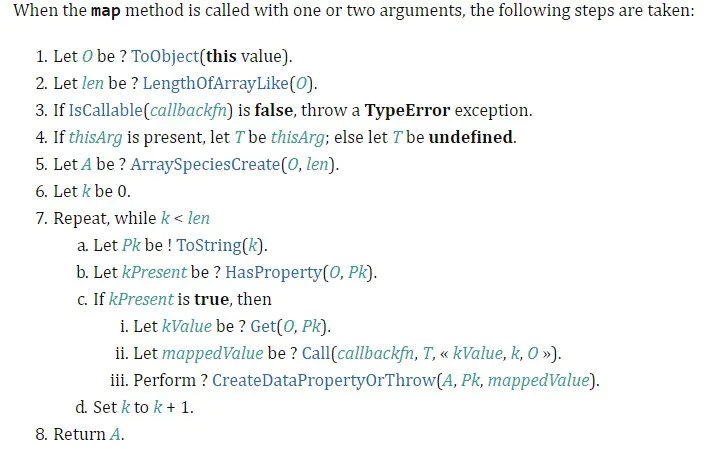
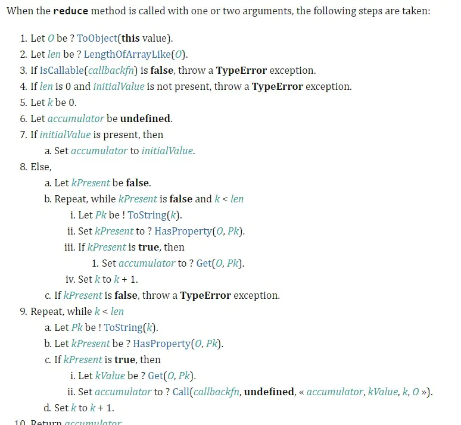
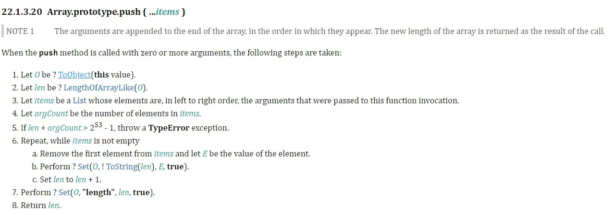
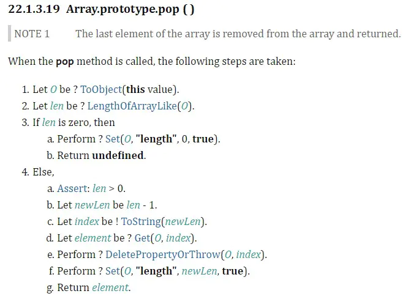
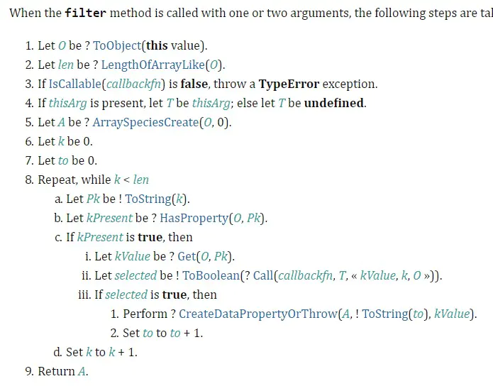
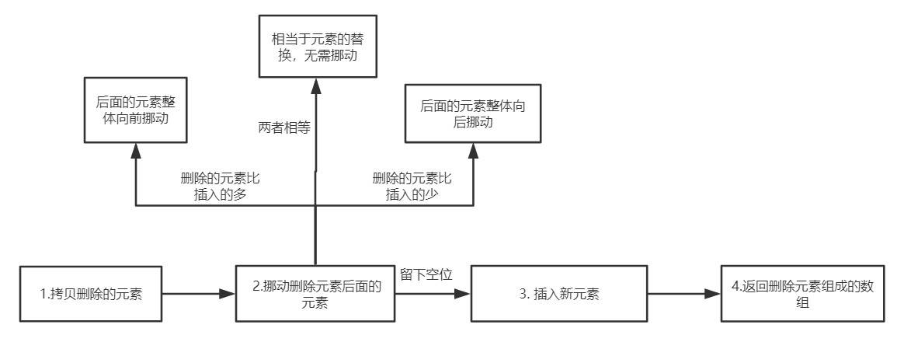
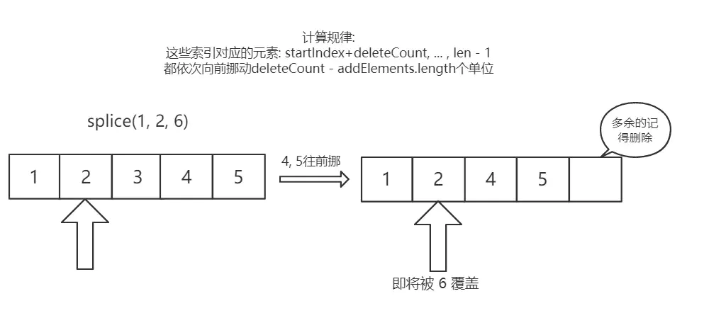
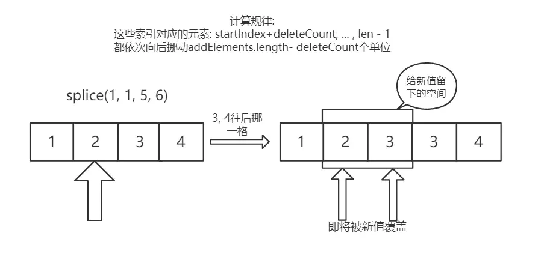

# 一、JS 数据类型

# 概念篇

## 1. JS 原始数据类型有哪些？ 引用数据类型有哪些？

在 JS 中，存在着 7 种原始值（基本数据类型），分别是：

- `boolean`
- `null`
- `undefined`
- `number`
- `string`
- `symbol`（ES6 的符号）
- `bigint`（未发布）

引用数据类型：对象（Object）——普通对象-`Object`，数组对象-`Array`，正则对象-`RegExp`，日期对象-`Date`，数学函数-`Math`，函数对象-`Function`。

## 2. 说出下面运行的结果，解释原因。

```js
function test(person) {
  person.age = 26
  person = {
    name: 'hzj',
    age: 18
  }
  return person
}
const p1 = {
  name: 'fyq',
  age: 19
}
const p2 = test(p1)
console.log(p1) // -> p1：{name: “fyq”, age: 26}
console.log(p2) // -> p2：{name: “hzj”, age: 18}
```

解析：在函数传参的时候，传递的是对象在堆中的内存地址值，`test` 函数中的实参 `person` 是 `p1` 对象的内存地址，通过调用 `person.age = 26` 确实改变了 `p1` 的值，但随后 `person` 指向了另一块内存空间的地址，并且在最后将这另一块内存空间的地址返回，赋给了 `p2`。

**补充**：**基本类型的变量是存放在栈区的，引用类型的存储需要内存的栈区和堆区共同完成，栈区内存保存遍历标识符和指向对象在堆内存的地址。**

## 3. null 是对象吗？为什么？

答：`null` 不是对象

解析：虽然 `typeof null` 会输出 `object`，但是这只是 JS 存在已久的 BUG。在 JS 最初版本中使用的是 32 位系统，为了性能考虑使用低位存储变量的类型信息，000 开头代表是对象，然而 `null` 表示为全零，所以将它错误的判断为 `object`。

## 4. '1'.toString() 为什么可以调用？

其实在这个语句运行的过程中做了这样几件事情：

```js
var s = new Object('1');
s.toString();
s = null;
```

第一步：创建 `Object` 类实例，注意为什么不是 `String`？由于 `Symbol` 和 `BigInt` 的出现，对它们调用 `new` 都会报错，目前 ES6 规范也不建议用 new 来创建基本类的包装类。

第二步，调用实例方法。

第三步：执行完方法立即销毁这个实例。

整个过程提现了 **基本包装类型** 的性质，而基本包装类型恰恰属于基本数据类型，包括 `Boolean`、`Number` 和 `String`。

> 参考:《JavaScript高级程序设计(第三版)》P118

## 5. 0.1 + 0.2 为什么不等于 0.3 ？

二进制浮点数中的 0.1 和 0.2 并不是十分精确，0.1 和 0.2 在转换成二进制后会无限循环，由于标准位数的限制，后面多余的位数会被截断，此时就出现了精度的损失，相加后因浮点数小数位的限制而截断的二进制数字就会变成 0.30000000000000004，所以条件判断为 false。

**解决方案**：

设置一个误差范围：在 JS 中这个值通常是 **2^52** ，从 ES6 开始，该值定义在 Number.EPSILON 中。

```js
function numberErrorRange(n1, n2){
    // 兼容 ES6 之前
    if(!Number.EPSILON){
        Number.EPSILON = Math.pow(2, -52);
    }
    return Math.abs( n1 - n2 ) < Number.EPSILON;
}
var a = 0.1 + 0.2;
var b = 0.3;

numberErrorRange(a, b);
```

## 6. 如何理解 BigInt ？

**什么是 BigInt ？**

> BigInt 是一种新的数据类型，用于当整数值大于 Number 数据类型支持的范围时。这种数据类型允许我们安全地对 **大整数** 执行算术操作，表示高分辨率的时间戳，使用大整数 id，等等，而不需要使用库。

**为什么需要 BigInt ？**

在 JS 中，所有的数字都以双精度 64 位浮点格式表示，那这样会带来什么问题呢？

这导致 JS 中的 Number 无法精确表示非常常大的整数，它会将非常大的整数四舍五入，确切地说，JS 中的 Number 类型只能安全地表示 `-9007199254740991(-(2^53-1))` 和 `9007199254740991（(2^53-1)）`，任何超出此范围的整数值都可能失去精度。

```js
console.log(999999999999999);  //=>10000000000000000
```

同时也会有一定的安全性问题:

```js
9007199254740992 === 9007199254740993;    // → true 居然是true!
```

**如何创建并使用 BigInt ？**

一：只需要在数字末尾追加 n 即可。

```
console.log( 9007199254740995n );    // → 9007199254740995n	
console.log( 9007199254740995 );     // → 9007199254740996
```

二：另一种创建 BigInt 的方法是用 `BigInt()` 构造函数（不能使用 new 调用）

```js
BigInt("9007199254740995");    // → 9007199254740995n
```

注意：

1. BigInt 不支持一元加号运算符，这可能是某些程序可能依赖于 + 始终生成 Number 的不变量，或者抛出异常。另外，更改 + 的行为也会破坏 asm.js代码。
2. 因为隐式类型转换可能丢失信息，所以不允许在 bigInt 和 Number 之间进行混合操作。当混合使用大整数和浮点数，结果值可能无法由 BigInt 或 Number 精确表示。
3. 不能将BigInt传递给Web api和内置的 JS 函数，这些函数需要一个 Number 类型的数字。尝试这样做会报TypeError错误。
4. 当 Boolean 类型与 BigInt 类型相遇时，BigInt的处理方式与Number类似，换句话说，只要不是0n，BigInt就被视为truthy的值。
5. 元素都为BigInt的数组可以进行sort。
6. BigInt可以正常地进行位运算，如|、&、<<、>>和^。


# 检测篇

## 1. typeof 是否能正确判断类型？

对于原始类型来说，除了 null 都可以调用 `typeof` 显示正确的类型。

```js
typeof 1 // 'number'
typeof '1' // 'string'
typeof undefined // 'undefined'
typeof true // 'boolean'
typeof Symbol() // 'symbol'
```

但对于引用数据类型，除了函数之外，都会显示 "object"。

```js
typeof [] // 'object'
typeof {} // 'object'
typeof console.log // 'function'
```

因此采用 `typeof` 判断对象数据类型是不合适的，采用 `instanceof` 会更好，`instanceof` 的原理是基于原型链的查询，只要处于原型链中，判断永远为 `true`。

```js
const Person = function() {}
const p1 = new Person()
p1 instanceof Person // true

var str1 = 'hello world'
str1 instanceof String // false

var str2 = new String('hello world')
str2 instanceof String // true
```

## 2. instanceof 能否判断基本数据类型？

能。比如下面这种方式:

```js
class PrimitiveNumber {
  static [Symbol.hasInstance](x) {
    return typeof x === 'number'
  }
}
console.log(111 instanceof PrimitiveNumber) // true
```

如果你不知道 `Symbol`，可以看看[MDN上关于hasInstance的解释](https://developer.mozilla.org/zh-CN/docs/Web/JavaScript/Reference/Global_Objects/Symbol/hasInstance)。（**Symbol.hasInstance** 用于判断某对象是否为某构造器的实例。因此你可以用它自定义 [`instanceof`](https://developer.mozilla.org/zh-CN/docs/Web/JavaScript/Reference/Operators/instanceof) 操作符在某个类上的行为。）

其实就是自定义 `instanceof` 行为的一种方式，这里将原有的 `instanceof` 方法重定义，换成了 `typeof`，因此能够判断基本数据类型。

## 3. 手动实现 instanceof 的功能？

核心：原型链的查找

```js
// L 表示instanceof左边，R 表示instanceof右边
function _instanceof(L, R){
    // getPrototypeOf 是 Object 对象自带的一个方法，能够获取参数的原型对象
    // 或者使用 __proto__
    let L = Object.getPrototypeOf(obj);
    // 取 R 的显示原型
    let R = R.prototype;
    while(true){
        // 表示查找到原型链的尽头，还没找到
        if(L === null) return false;
        if(R === L) return true;
        L = Object.getPrototypeOf(L);
    }
}
```

## Object.is 和 === 的区别？

`Object.is` 在严格等于的基础上修复了一些特殊情况下的失误，具体来说就是 `+0` 和 `-0`，`NaN` 和 `NaN`。

源码如下：

```js
function is(x, y){
    if(x === y){
        // 运行到 1/x === 1/y 的时候 x 和 y 都为0，但是1/+0 = +Infinity， 1/-0 = -Infinity, 是不一样的
        return x !== 0 || y !== 0 || 1/x === 1/y;
    }else{
        // NaN === NaN 是 false，这是不对的，在这里做一个拦截， x !== x，那么一定是 NaN，y 同理
        // 两个都是 NaN 的时候返回true
        return x !== x && y !== y;
    }
}
```


#  转换篇

## 1. [] == ![] 结果是什么？ 为什么？

解析： `==` 中，左右两边都需要转换为数字然后进行比较。

`[]` 转换为数字 0；

`![]` 首先是转换为布尔值，由于 `[]` 作为一个引用类型转换为布尔值为 `true`，

因此 `![]` 为 `false`，进而再转换为数字，变为 0。

0 == 0，结果为 `true`。


## 2. JS 中类型转换有哪几种？

JS 中，类型转换只有三种：

- 转换为数字
- 转换为布尔值
- 转换为字符串

转换规则如下：

> 注意 “ Boolean 转字符串 ” 这行结果指的是 true 转字符串的例子


**转Boolean**

在条件判断时，除了 `undefined`， `null`， `false`， `NaN`， `''`， `0`， `-0`，其他所有值都转为 `true`，包括所有对象。

## 3. == 和 === 有什么区别？

`===` 称为 严格等于，是指：左右两边不仅值要相等，类型也要相等（也就是不进行类型转换）。例如 '1' === 1 的结果是 `false` 

`==` 不像 `===` 那么严格，对于一般情况，只要值相等，就返回 `true`，但 `==` 还涉及一些类型转换，它的转换规则如下：

- 两边的类型是否相同，相同的话就比较值的大小，例如 `1 == 2`，返回 `false`。
- 判断的是否是 `null` 和 `undefined` ，是的话就返回 `true`。
- 判断的类型是否是`String`和`Number`，是的话，把`String`类型转换成`Number`，再进行比较。
- 判断其中一方是否是`Boolean`，是的话就把`Boolean`转换成`Number`，再进行比较。
- 如果其中一方为`Object`，且另一方为`String`、`Number`或者`Symbol`，会将`Object`转换成字符串，再进行比较

## 4. 对象转原始类型是根据什么流程进行的？

对象转原始类型，会调用内置的 `[ToPrimitive]` 函数，对于该函数而言，其逻辑如下：

1. 如果已经是原始类型了，那就不需要转换了
2. 调用 `valueOf()` ，如果转为原始类型，则返回
3. 调用 `toString()`，如果转为原始类型，则返回
4. 如果都没有返回原始类型，会报错

当然你也可以重写 `Symbol.toPrimitive` ，该方法在转原始类型时调用优先级最高。

```js
let a = {
  valueOf() {
    return 0
  },
  toString() {
    return '1'
  },
  [Symbol.toPrimitive]() {
    return 2
  }
}
1 + a // => 3
```


## 5. 如何让 if(a == 1 && a == 2) 条件成立？

其实就是上一个问题的应用。

```js
var a = {
    value:  0,
    valueOf: function(){
        this.value++;
        return this.value;
    }
};
console.log(a == 1 && a == 2)； // true
```

# 二、谈谈你对闭包的理解

## 1. 什么是闭包（closure）？

> 红宝书(P178)上对于闭包的定义：闭包是指有权访问另一个函数作用域中的变量的函数。

> MDN 对闭包的定义为：闭包是指那些能够访问自由变量的函数 。（其中自由变量，是指在函数中使用，但既不是函数参数 arguments 也不是函数的局部变量的变量，其实就是另一个函数作用域中的变量。）

 闭包的特性：

 1.函数内再嵌套函数
 2.内部函数可以引用外层的参数和变量
 3.参数和变量不会被垃圾回收机制回收

## 2. 闭包产生的原因？

首先要明白作用域链的概念，其实很简单，在 ES5 中只存在两种作用域——全局作用域和函数作用域，**当访问一个变量时，解释器会首先在当前作用域查找提示符，如果没有找到，就去父作用域找，直到找到该变量的标示符或者在顶级作用域内页找不到，这就是作用域链**，值得注意的是，每个函数都会保留一个对父级作用域的引用，形成一个作用域的链条，比如：

```js
var a = 1;
function f1() {
  var a = 2
  function f2() {
    var a = 3;
    console.log(a);//3
  }
}
```

在这段代码中，`f1` 的作用域指向有全局作用域(`window`)和它本身，而`f2`的作用域指向全局作用域(`window`)、`f1`和它本身。而且作用域是从最底层向上找，直到找到全局作用域`window`为止，如果全局还没有的话就会报错。就这么简单一件事情！

**闭包产生的本质就是，当前环境中存在指向父级作用域的引用。**

```js
function f1() {
  var a = 2
  function f2() {
    console.log(a);//2
  }
  return f2;
}
var x = f1();
x();
```

这里 `x` 会拿到父级作用域中的变量，输出 `2`。因为在当前环境中，含有对 `f2` 的引用，`f2`恰恰引用了`window`、`f1`和`f2`的作用域。因此`f2`可以访问到`f1`的作用域的变量。

在 chrome 浏览器控制台可以看到，`Scope` 表示当前作用域，`Local` 表示当前活动对象，`Closure` 表示闭包（这里的闭包是 `f1` 函数）


那是不是只有返回函数才算是产生了闭包呢？

回到闭包的本质，我们只需要让父级作用域的引用存在即可，因此我们还可以这么做：

```js
var f3;
function f1() {
  var a = 2
  f3 = function() {
    console.log(a);
  }
}
f1();
f3();
```

让 `f1` 执行，给 `f3` 赋值后，等于说现在 **f3 拥有了 window、f1 和 f3 本身这几个作用域的访问权限**，还是自底向上查找，最近的是在 `f1` 中找到了 `a`，因此输出 `2`。

在这里是外面的变量`f3存在着父级作用域的引用`，因此产生了闭包，形式变了，本质没有改变。

## 3. 闭包有哪些表现形式？

明白了本质之后，我们就来看看，在真实的场景中，究竟在哪些地方能体现闭包的存在？

1. 返回一个函数。上面的例子

2. 作为函数参数传递：

   ```js
   var a = 1;
   function foo(){
     var a = 2;
     function baz(){
       console.log(a);
     }
     bar(baz);
   }
   function bar(fn){
     // 这就是闭包
     fn();
   }
   // 输出2，而不是1
   foo();
   ```

3. 在定时器、事件监听、Ajax请求、跨窗口通信、Web Workers或者任何异步中，只要使用了回调函数，实际上就是在使用闭包。

   以下的闭包保存的仅仅是window和当前作用域：

   ```js
   // 定时器
   setTimeout(function timeHandler(){
     console.log('111');
   }，100)
   
   // 事件监听
   $('#app').click(function(){
     console.log('DOM Listener');
   })
   ```

4. IIFE(立即执行函数表达式) 创建闭包，保存了 **全局作用域 window** 和 **当前函数的作用域**，因此可以使用全局变量。

   ```js
   var a = 2;
   (function IIFE(){
     // 输出2
     console.log(a);
   })();
   ```

## 4. 如何解决下面的循环输出问题？

```js
for(var i = 1; i <= 5; i ++){
  setTimeout(function timer(){
    console.log(i)
  }, 0)
}
```

为什么会全部输出6？如何改进，让它输出1，2，3，4，5？(方法越多越好)

**因为 setTimeout 为宏任务，由于 JS 单线程 eventLoop 机制，在主线程同步任务执行完后才去执行宏任务，因此循环结束后 setTimeout 中的回调才依次执行，但输出 i 的时候当前作用域不存在，往上级作用域寻找，发现了 i，但此时循环已经结束，i 变成了 6。因此会全部输出 6。**

解决方法：

1. 利用 `IIFE （立即执行函数表达式）`当每次 for 循环时，把此时的 i 变量传递到定时器中：

    ```js
    for(var i = 1;i <= 5;i++){
      (function(j){
        setTimeout(function timer(){
          console.log(j)
        }, 0)
      })(i)
    }
    ```

2. 给定时器传入第三个参数，作为 `timer` 函数的第一个函数参数：

   ```js
   for(var i=1;i<=5;i++){
     setTimeout(function timer(j){
       console.log(j)
     }, 0, i)
   }
   ```
   
3. 使用 ES6 中的 `let`（块级作用域）

    ```js
    for(let i = 1; i <= 5; i++){
      setTimeout(function timer(){
        console.log(i)
      },0)
    }
    ```

    `let` 使 JS 发生革命性的变化，让 JS 由函数作用域变为了块级作用域，用 let 后作用域链不复存在。代码的作用域以块级为单位，以上面代码为例:

    ```js
    // i = 1
    {
      setTimeout(function timer(){
        console.log(1)
      },0)
    }
    // i = 2
    {
      setTimeout(function timer(){
        console.log(2)
      },0)
    }
    // i = 3
    ```


# 三、谈谈你对原型的理解

## 1. 原型是什么？

​		JavaScript 中的对象有一个特殊的 `[[Prototype]]` 内置属性（外部代码无法直接访问），该属性指向该对象的**原型对象**，其实就是对于其他对象的引用。几乎所有的对象在创建时 `[[Prototype]]` 属性都会被赋予一个非空的值（对象的 `[[Prototype]]` 链接可以为空，但是很少见，例如用 `Object.create(null)` 创造的对象）。

**获取对象原型对象的方法（`[[Prototype]]`）**

1. `Object.getPrototypeOf()` (或者 `Reflect.getPrototypeOf()`)

   在ES5中，可以使用 `Object.getPrototypeOf()` 来访问一个对象的原型对象，也就是内置属性 `[[Prototype]]` 的指向。

2. `__proto__` 属性

   这个 `__proto__` 属性引用了内部的 `[[Prototype]]` 对象（原型对象），甚至还可以通过 `.__proto__.__proto__...` 来遍历原型链。

   实际上`__proto__` 存在于内置的 `Object.prototype `,`__proto__` 属性是一个访问器属性（ `getter/setter`），暴露了通过它访问对象的内部 `[[Prototype]]`属性（一个原型对象或 null）。

   `__proto__` 的实现大致上是这样的：

   ```js
   Object.defineProperty(Object.prototype, "__proto__",{
     get: function() {
         return Object.getPrototypeOf(this);
     },
     set: function(o){
         // ES6 的 setPrototypeOf(..)
         Object.setPrototypeOf(this, o);
         return o;
     }
   });
   ```

   因此，访问 `a.__proto__` 时，实际上是调用了  `getter` 函数。虽然 `getter` 函数存在于 `Object.prototype` 对象中，但是它的 `this`  指向对象 a（ [`this` 的隐式绑定](https://juejin.im/post/5e80f60ef265da47c43204da)） ，所以和 `Object.getPrototypeOf(a)` 结果相同。

## 2. 什么是原型链？

​	`[[Prototype]]` 机制就是存在于对象的一个内部链接，它会引用其他对象。这个链接的作用是：如果在对象上没有找到需要的属性或方法引用，引擎就会继续在 `[[Prototype]]` 关联的对象上进行查找。同理，如果在后者也没有找到需要的引用就会继续查找它的 `[[Prototype]]`，以此类推。这一系列的链接被称为 **“原型链”**。

​	所有普通对象（内置的，不是来源于特定主机的扩展）都“源于” **Object.prototype** 对象，也就是说把所有的普通对象的原型链最终都会指向内置的 **Object.prototype** 对象。（这里注意：`Object.prototype.__proto__` 的值为 `null`  即表示没有对象，**所以说 Object.prototype 没有原型对象**）

## 3. 构造函数

函数的一种特性：所有的函数默认都会拥有一个名为 **prototype** 的公有并且不可枚举的属性，它会指向另一个对象。

对于这个对象最直接的解释就是，当通过 `new` 调用函数的时候，创建的每个实例对象的 `[[Prototype]]` 会链接到这个函数的 `xx.prototype` 上。

**构造函数的由来**

- 一个原因是因为使用了关键字 **new** 来调用，在面向类的语言中构造类的实例也会使用到他。
- 另一个原因是，看起来我们执行了类的构造函数方法，**new Foo()** 的调用方式很像初始化类时构造函数的调用方法。

实际上，`Foo` 和程序中的其他函数没有任何区别。函数本身不是构造函数，然而，当你在普通的函数调用前面加上 `new` 关键字之后，就会把这个函数调用变成一个 **”构造函数调用“**。**new 会劫持所有普通函数并用构造对象的形式来调用它。**

**constructor**：函数的 `prototype` 指向的对象中有一个 `constructor` 返回创建实例对象时构造函数的引用。

注意：

- 当你创建了一个新对象并替换了函数默认的 `prototype` 对象引用，那么新的对象并不会自动获得 `constructor`，`constructor` 同样也会被修改，需要去手动添加一个符合正常行为的 `constructor` 属性。
- **由于 `constructor` 是可以手动修改的，所以是一个不可靠的引用，它们不一定会指向默认的函数引用，要避免使用。**

## 4. 函数的原型？

在 JavaScript 中函数即对象，函数是对象的一个特殊的子类型，所以函数也有原型`[[Prototpye]]`属性。

所有的构造函数（构造器）都继承于 **Function.prototype**，甚至包括根构造器 `Object` 及 `Function` 自身。所有构造器都继承了 `Function.prototype` 的属性及方法。如 `length、call、apply、bind（ES5）`等

即 

- Object 构造器的 `[[Prototype]]` 属性指向 `Function` 构造器的 `prototype` 属性  
  - `Object.__proto__ === Function.prototype` 
- Function 构造器的 `[[Prototype]]` 属性指向其构造器本身的 `prototype` 属性：
  - `Function.__proto__ === Function.prototype`

而 `Function.prototype.__proto__` 会指向哪里呢？

根据我们在上面得出的结论：所有的构造器即是函数，也是一个 JS 对象，而对象的原型链的顶端都是  `Object.prototype`，所以它也会继承自 `Object.prototype` 以及其方法（例如：toString、valueOf、hasOwnProperty 等）。

即 `Function.prototype.__proto__ === Object.prototype`

## 5. 总结	

​	JS 对象的委托（继承）关联机制——原型链接（也就是对象内部属性 `[[Prototype]]` 的指向)，以及函数的 `prototype、constructor` 属性的指向。	

​	对象的 `[[Prototype]]`总结：先由 `Object.prototype`（原型链顶端），接下来是构造函数的 `prototype` 属性。

​	函数的`[[Prototype]]` 指向总结：先由 `Object.prototype`（原型链顶端），`Function.prototype` 继承 `Object.prototype` 而产生，最后，`Function` 和 `Object`  和其它构造函数继承 `Function.prototype` 而产生。


下图是包含了 Foo 函数创建了 f 对象的结构图：


# 四、创建对象的方法

在 JavaScript 中对象被定义为无序属性的集合，其属性可以包含基本值、对象或者函数。

## 1. 基本方法：

我们指定创建对象可以使用 **Object构造函数** 或者 **字面量** 的形式创建单个对象：

### Object 构造函数模式

```js
var person = new Object();
person.name = "gy";
person.age = 21;
person1.sayName = function () {
  console.log(this.name);
}
person1.sayName(); // gy
console.log(person1.age); // 21
```

### 对象字面量模式

```js
var person2 = {
    name: 'gy',
    age: 21,
    sayName: function () {
      console.log(this.name);
    }
}
person2.sayName(); // gy
```

但是这两个模式有个明显的缺点：使用同一个接口创建很多对象，会产生大量的重复代码。

于是为了解决这个问题，引出了 👇 多种创建对象的模式：

## 2. 工厂模式

```js
function createPerson(name){
    var o = new Object();
    o.name = name;
    o.getName = function () {
        console.log(this.name);
    }
    return o;
}
var person1 = createPerson('gy');
```

缺点：工厂模式虽然解决了创建多个相似对象的问题，但是没有解决这个对象是一个什么类型的对象（即无法辨认实例是由哪个构造函数创建）。

```js
console.log(person1 instanceof createPerson); // false
console.log(person1 instanceof Object); // true
```

## 3. 构造函数模式

将工厂模式改造成构造函数之后：

```js
// 约定成俗的规矩，构造函数以大写字母开头，以区别普通函数
function Person(name) {
    this.name = name;
    this.getName = function () {
        console.log(this.name);
    };
}

var person1 = new Person('gy');
console.log(person1 instanceof Person); // true
```

优点：实例可以识别为一个特定的类型。

缺点：每次实例化一个新对象，都会在其内部创建一个对应的方法函数，而这个函数对所有实例来说是没有必要每次都创建的，他们只需指向同一个函数即可。

注：其实构造函数也是普通函数，只是因为使用 `new` 操作符对普通函数进行构造调用而已

### 构造函数模式优化

```js
function Person(name) {
    this.name = name;
    this.getName = getName;
}

function getName() {
    console.log(this.name);
}

var person1 = new Person('gy');
```

优点：解决了每个方法都要被重新创建的问题。

缺点：上面的做法虽然解决了重复创建函数的问题，但是又引入了一个新的问题：外部的函数仅仅在构造函数中用到，如果对象需要很多个方法，那么就需要在外部定义很多这种函数，这无疑会导致代码很难组织。

## 4. 原型模式

```js
function Person(name) {}

Person.prototype.name = 'gy';
Person.prototype.getName = function () {
    console.log(this.name);
};

var person1 = new Person();
```

优点：省略了构造函数初始化参数这个环境，原型中所有属性都被实例共享，共享对函数非常合适，基本属性也适用，通过在实例上添加同名属性，可隐藏原型中的对应属性值。

缺点：共享属性，对于包含引用类型值的属性，如果实例重新赋值没什么影响，处理与基本类型一样，如果是修改操作，则会使所有实例获取到的该属性都被修改。例如在一个实例上增删改一个引用为数组的属性。

### 原型模式优化

```js
function Person(name) {}

Person.prototype = {
    constructor: Person,
    name: 'kevin',
    getName: function () {
        console.log(this.name);
    }
};

var person1 = new Person();
```

优点：封装性更好，实例可以通过 **constructor** 属性找到所属构造函数。（但是此时的 `constructor` 变成了可枚举属性，原生的原型对象的 `constructor` 是不可枚举的，可通过 `Object.defineProperty()` 来设置）。

缺点：原型模式的缺点还是存在。

## 5. 组合模式

构造函数模式 + 原型模式

1. 构造函数模式用与定义实例属性，每个属性在每个实例上都重新创建了一次，即使引用类型的修改也不会影响到其他实例。
2. 原型模式用与定义方法和共享属性。

```js
function Person(name){
    this.name = name;
}
Person.prototype = {
    constructor: Person,
    getName: function(){
        console.log(this.name);
    }
}
var person1 = new Person();
```

优点：属性和方法该共享的共享，该私有化的私有。是一种使用最广泛的创建自定义类型的方法

缺点：有的觉得需要写在一起，即拥有更好的封装性。

## 6. 动态原型模式

原型和构造函数独立分开，会让有其他 oo 语音经验的开发人员感觉到困扰，所有有了动态原型模式。

原理：在构造函数中检查某个应该存在的方法是否有效，来决定是否需要初始原型。

```js
function Person(name){
    this.name = name;
    if(typeof this.getName != "function"){
        Person.prototype.getName = function () {
            console.log(this.name);
        }
    }
}
var person1 = new Person();
```

注意：使用动态原型模式时，不能用对象字面量重写原型

原因如下：

```js
function Person(name) {
    this.name = name;
    if (typeof this.getName != "function") {
        // 对象字面量方式
        Person.prototype = {
            constructor: Person,
            getName: function () {
                console.log(this.name);
            }
        }
    }
}

var person1 = new Person('hins');
var person2 = new Person('enoo');

// 报错 并没有该方法
person1.getName();

// 注释掉上面的代码，这句是可以执行的。
person2.getName(); // enoo
```

其实这个原因关系到 `new` 的执行过程：

1. 首先先创建一个新对象 `obj`
2. 然后将对象的原型指向 `Person.prototype`
3. 然后执行 `Person.apply(obj)` ，也就是调用构造函数
4. 返回这个对象

然后在调用构造函数那一步，这个时候会执行 `if` 语句里面的内容，要注意构造函数 `Person` 原先的 `prototype` 指向了 `obj` 的原型对象，使用字面量方式直接覆盖 `Person.prototype`，并不会更改已经创建的实例（`obj`）的原型的值。

所以 `person1 ` 依然是指向了以前的原型，而不是通过字面量修改的原型，而之前的原型没有 `getName` 方法，所以会报错，如果一定要使用字面量的方式，可以使用下面这种方式：

```js
function Person(name) {
    this.name = name;
    if (typeof this.getName != "function") {
        Person.prototype = {
            constructor: Person,
            getName: function () {
                console.log(this.name);
            }
        }
		
        // 返回原型被修改后的一个新的对象
        return new Person(name);
    }
}

var person1 = new Person('hins');
var person2 = new Person('enoo');

person1.getName(); // hins
person2.getName();  // enoo
```

## 7. 寄生构造函数模式

```js
function Person(name) {
    var o = new Object();
    o.name = name;
    o.getName = function () {
        console.log(this.name);
    };

    return o;
}

var person1 = new Person('gy');
console.log(person1 instanceof Person) // false
console.log(person1 instanceof Object)  // true
```

**它返回的对象与构造函数和构造函数的原型没有任何关系！！（也不就是能用 instanceof 操作符来确定对象类型）这种模式就是比工厂模式在创建对象的时候，多使用了一个 new ，而实际上两者的结果是一样的。**

所以可以理解为是 **寄生** 在 **构造函数** 里面的一种模式。

这种模式可以在特殊情况下使用，比如我们想创建一个具有额外方法的特殊数组，但是又不想直接修改 **Array** 构造函数，因此可以使用这个模式：

```js
function SpecialArray() {
    // 创建数组
    var values = new Array();
    
	// 初始化，添加值
    values.push.apply(values, arguments);

    // 添加额外方法
    values.toPipedString = function () {
        return this.join("|");
    };
    
    // 返回数组
    return values;
}

var colors = new SpecialArray('red', 'blue', 'green');
var colors2 = SpecialArray('red2', 'blue2', 'green2');


console.log(colors);
console.log(colors.toPipedString()); // red|blue|green

console.log(colors2);
console.log(colors2.toPipedString()); // red2|blue2|green2
```

## 8.  稳妥构造函数模式

所谓稳妥对象，指的是没有公共属性，而且其方法也不引用 this 的对象。

与寄生构造函数模式有两点不同：

1. 新创建的实例方法不引用 this
2. 不使用 new 操作符调用构造函数

稳妥对象最适合在一些安全的环境中。

稳妥构造函数模式也跟工厂模式一样，无法识别对象所属类型。


# 四、JS 如何实现继承？

JS 实现继承主要是依靠原型链来模拟实现的。接下来讲解 JavaScript 各种继承方式和优缺点（常用七种方案 + ES6 的类继承） 👇：

## 1. 原型链继承

继承的本质就是**复制**，即重写原型对象，给之以一个新类型的实例。

```js
function Parent() {
    this.name = 'gy';
}

Parent.prototype.getName = function () {
    console.log(this.name);
}

function Child () {}

Child.prototype = new Parent();

var child = new Child();

child.getName(); // gy
```

缺点：

1. 引用类型的属性会被所有实例共享。对于包含引用类型值的属性，如果实例重新赋值没什么影响，处理与基本类型一样（通过在实例上添加同名属性，隐藏原型中的对应属性值），如果是修改操作，则会使所有实例获取到的该属性都被修改

2. 在创建 Child 的实例时，不能向 `Parent` 传参。

## 2. 借用构造函数继承

使用父类的构造函数来增强子类实例，等同于复制父类的实例给子类（不适用原型）。

```js
function Partent(){
    this.name = ['kevin', 'daisy'];
}

function Child () {
    // 借用 Parent 构造函数
    Parent.call(this);
}

var child1 = new Child();

child1.names.push('gy');

console.log(child1.names); // ["hins", "enoo", "gy"]

var child2 = new Child();

console.log(child2.names); // ["hins", "enoo"]
```

优点：

1. 子类的每个实例都会将父类中的属性复制一份，避免了引用类型的属性被所有实例共享。
2. 子类构造函数中可以向父类构造函数传参。

缺点：

1. 只能继承父类的实例属性和方法，不能继承原型属性/方法。
2. 方法都在构造函数中定义，每次创建实例都会创建一遍方法，无法实现复用。


## 3.  组合继承

原型链继承 + 借用构造函数继承： 用原型链实现对原型属性和方法的继承，用借用构造函数继承来实现实例属性的继承。

```js
function Parent (name) {
    this.name = name;
    this.colors = ['red', 'blue', 'green'];
}

// 原型链继承
Parent.prototype.getName = function () {
    console.log(this.name)
}

function Child (name, age) {
	// 借用构造函数
    Parent.call(this, name);
    this.age = age;

}

Child.prototype = new Parent();
// 重写子类的 constructor 属性，指向自己本身的构造函数 Child
Child.prototype.constructor = Child;

var child1 = new Child('gy', '21');

child1.colors.push('black');

console.log(child1.name); // gy
console.log(child1.age); // 21
console.log(child1.colors); // ["red", "blue", "green", "black"]

var child2 = new Child('hins', '20');

console.log(child2.name); // hins
console.log(child2.age); // 20
console.log(child2.colors); // ["red", "blue", "green"]
```

优点：融合原型链继承和借用构造函数继承的优点，是 JavaScript 中最常用的继承模式。

缺点：调用了两次父类构造函数，造成了不必要的消耗。

- 一次是设置子类型实例的原型的时候：

```js
Child.prototype = new Parent();
```

- 一次在创建子类型实例的时候，内部执行 `Parent.call(this, name);` 时会调用父类构造函数：

```js
var child1 = new Child('gy', '21');
// 在这个时候执行了
// Parent.call(this, name);
```

所以，在这个例子中，如果我们打印 `child1` 对象，我们会发现 `Child.prototype` 和 `child1` 都有一个属性为`colors`，属性值为`['red', 'blue', 'green']`。

使用**寄生组合式继承**可以解决这个问题，请看下文

## 4. 原型式继承

在 `createObj()` 函数内部, 先创建一个临时性的构造函数, 然后将传入的对象作为这个构造函数的原型,最后返回了这个临时类型的一个新实例。

```js
function createObj(o) {
    function F(){}
    F.prototype = o;
    return new F();
}
```

从本质上讲，`createObj()` 对传入其中的对象执行了一次浅复制：

```js
var person = {
	friends : ["gy","hins"]
};
var person1 = object(person);
person1.friends.push("enoo");
var person2 = object(person);
person2.friends.push("milk");
alert(person.friends);//"gy,hins,enoo,milk"
```

也就是 ES5 提供的 `Object.create` 的模拟实现，将传入对象作为创建的对象的原型。

缺点：包含引用类型的属性值始终都会共享相应的值，这点跟原型链继承一样。

```js
var person = {
    name: 'gy',
    friends: ['hins', 'enoo']
}

var person1 = createObj(person);
var person2 = createObj(person);

person1.name = 'person1';
console.log(person2.name); // gy

person1.firends.push('ray');
console.log(person2.friends); // ["hins", "enoo", "ray"]
```

注意：修改`person1.name`的值，`person2.name `的值并未发生改变，并不是因为 `person1` 和 `person2` 有独立的 name 值，而是因为`person1.name = 'person1'`，给`person1`添加了 name 值，屏蔽了原型上的相同属性，并非修改了原型上的 name 值。

## 5. 寄生式继承

（在原型式继承的基础上）创建一个仅用于封装继承过程的函数，该函数在内部以某种形式来增强对象，最后返回对象。

```js
function createObj (o) {
    var clone = Object.create(o);
    clone.sayName = function () {
        console.log('hi');
    }
    return clone;
}
```

缺点：跟借用构造函数模式一样，每次创建对象都会创建一遍方法，不能做到函数复用而降低效率。


## 6. 寄生组合式继承

（结合借用构造函数传递参数和寄生式继承实现）

在组合继承中，使用原型链继承  `Child.prototype = new Parent() ` 时会调用一次父类的构造函数，以及子类借用父类构造函数时，会造成两次构造函数的浪费。

所以解决方法是不使用 `Child.prototype = new Parent() `，而是间接的让 `Child.prototype` 访问到 `Parent.prototype` （原型链的原理）

```js
// 父类初始化实例属性和原型属性（方法）
function Parent (name) {
    this.name = name;
    this.colors = ['red', 'blue', 'green'];
}
Parent.prototype.getName = function () {
    console.log(this.name)
}

function Child (name, age) {
    // 借用构造函数传递增强子类实例属性（支持传参和避免篡改）
    Parent.call(this, name);
    this.age = age;
}

// 关键！！
// 使用一个中间函数，让其的 prototype 指向 父类的原型
var F = function () {};
F.prototype = Parent.prototype;
// 让子类的 prototype 指向中间函数的实例
// Child.prototype -> F 的实例 -> F.prototype -> Parent.prototype
Child.prototype = new F();

var child1 = new Child('kevin', '18');

console.log(child1);
```

封装一下中间函数：

```js
function object(o){
    function F (){}
    F.prototype = o.prototype;
    return new F();
}

function prototype(child, parent){
    // 创建对象，创建父类原型的一个副本，或者使用 ES5 的 Object.create() 方法
    var prototype = object(parent.prototype);
    // 增强对象，弥补因重写原型而失去的默认的constructor 属性
    prototype.constructor = child;
    // 指定对象，将新创建的对象赋值给子类的原型
    child.prototype = prototype;
}

// =》 等同于
// Child.prototype = Object.create(Parent.prototype);
// Child.prototype.constructor = Child;

// 当我们使用的时候：
prototype(Child, Parent);
```


引用《JavaScript高级程序设计》中对寄生组合式继承的夸赞就是：

这种方式的高效率体现它只调用了一次 `Parent` 构造函数，并且因此避免了在 `Parent.prototype` 上面创建不必要的、多余的属性。与此同时，原型链还能保持不变；因此，还能够正常使用 `instanceof` 和 `isPrototypeOf`。开发人员普遍认为寄生组合式继承是引用类型最理想的继承范式。

**这是最成熟的方法，也是现在库实现的方法**

## 7. 混入方式继承多个对象

```js
function MyClass() {
     SuperClass.call(this);
     OtherSuperClass.call(this);
}

// 继承一个父类
MyClass.prototype = Object.create(SuperClass.prototype);
// 混合其它父类
Object.assign(MyClass.prototype, OtherSuperClass.prototype);
// 重新指定constructor
MyClass.prototype.constructor = MyClass;

MyClass.prototype.myMethod = function() {
     // do something
};
```

`Object.assign`会把 `OtherSuperClass`原型上的函数拷贝到 `MyClass`原型上，使 `MyClass` 的所有实例都可用 `OtherSuperClass` 的方法。

## 8. ES6 类继承 extends

`extends` 关键字主要用于声明或类表达式中，以创建一个类，该类是另一个类的子类。其中 `constructor` 表示构造函数，一个类中只能有一个构造函数，如果没用显示指定构造方法，则会添加默认的 `constructor`，例子如下：

```js
class Rectangle {
    // constructor
    constructor(height, width) {
        this.height = height;
        this.width = width;
    }
    
    // Getter
    get area() {
        return this.calcArea()
    }
    
    // Method
    calcArea() {
        return this.height * this.width;
    }
}

const rectangle = new Rectangle(10, 20);
console.log(rectangle.area);
// 输出 200

-----------------------------------------------------------------
// 继承
class Square extends Rectangle {

  constructor(length) {
    super(length, length);
    
    // 如果子类中存在构造函数，则需要在使用“this”之前首先调用 super()。
    this.name = 'Square';
  }

}

const square = new Square(10);
console.log(square.area);
// 输出 100
```

`extends` 继承的核心代码如下，其实现与上述的寄生组合式继承方式一样：

```js
function _inherits(subType, superType){
    // 创建对象，创建父类原型的一个副本
    // 增强对象，弥补因重写原型而失去的默认的 constructor 属性
    // 指定对象，将新创建的对象赋值给子类的原型
    subType.prototype = Object.create(superType && superType.prototype, {
        constructor: {
            value: subType,
            enumerable: false,
            writable: true,
            configurable: true
        }
    });
    
    if (superType) {
        Object.setPrototypeOf ? 
        Object.setPrototypeOf(subType, superType) 
        : subType.__proto__ = superType;
    }
}
```

## 总结

1、函数声明和类声明的区别

函数声明会提升，类声明不会。首先需要声明你的类，然后访问它，否则像下面的代码会抛出一个`ReferenceError`。

```js
let p = new Rectangle(); 
// ReferenceError

class Rectangle {}
```

2、ES5 继承和ES6 继承的区别

- ES5 的继承实质上是先创建子类的实例对象，然后再将父类的方法添加到this上（`Parent.call(this)`）.
- ES6 的继承有所不同，实质上是先创建父类的实例对象this，然后再用子类的构造函数修改this。因为子类没有自己的this对象，所以必须先调用父类的 `super()` 方法，否则新建实例报错。


# 五、数组篇

## 1. 函数的 arguments 为什么不是数字？如何转化成数组？

`arguments` 本身并不能调用数组方法，它下标依次为 0, 1, 2... 最后还有 `callee（当前函数的引用）` 和 `length`属性，我们也把这样的对象称之为类数组。

常见的类数组还有：

1. 用 `getElementsByTagName / ClassName()` 获得的 `HTMLCollection（元素集合）`
2. 用`querySelector`获得的`nodeList`

那这导致很多数组的方法都无法使用，所以在必要时我们需要将它们转换为数组，有哪些方法呢？

### 1. Array.prototype.slice.call()

`slice()` 方法返回一个新的数组对象，这一对象是一个由 `begin` 和 `end` 决定的原数组的**浅拷贝**（包括 `begin`，不包括`end`）。原始数组不会被改变。

```js
function sum(a, b) {
  let args = Array.prototype.slice.call(arguments);
  // reduce() 方法对数组中的每个元素执行一个提供的函数，将其结果汇总为单个返回值
  console.log(args.reduce((sum, cur) => sum + cur));//args可以调用数组原生的方法啦
}
sum(1, 2);//3
```

### 2. Array.from()

（ES6 新增）`Array.from()` 方法从一个类似数组或可迭代对象创建一个新的，浅拷贝的数组实例。

```js
function sum(a, b) {
  let args = Array.from(arguments);
  console.log(args.reduce((sum, cur) => sum + cur));//args可以调用数组原生的方法啦
}
sum(1, 2);//3
复制代码
```

这种方法也可以用来转换Set和Map。

### 3. ES6 扩展运算符

扩展运算符（`...`），将一个数组转换为用逗号分隔的参数序列。

```js
function sum(a, b) {
  let args = [...arguments];
  console.log(args.reduce((sum, cur) => sum + cur));//args可以调用数组原生的方法啦
}
sum(1, 2);//3
```

### 4. 利用 concat + apply

`concat()` 方法用于合并两个或多个数组。此方法不会更改现有数组，而是返回一个新数组。 

```js
function sum(a, b) {
  let args = Array.prototype.concat.apply([], arguments);//apply方法会把第二个参数展开
  console.log(args.reduce((sum, cur) => sum + cur));//args可以调用数组原生的方法啦
}
sum(1, 2);//3
```

当然，最原始的方法就是再创建一个数组，用for循环把类数组的每个属性值放在里面，过于简单，就不浪费篇幅了。


## 2. forEach 中的 return 有效果吗？如何中断 forEach 循环？

在 `forEach` 中用 `return` 不会返回，函数会继续执行。

```js
let nums = [1,2,3];
nums.forEach((item,index)=>{
    return; // 无效
})
```

中断方法：

1. 使用 `try` 监视代码块，在需要中断的地方抛出异常（`throw`）。
2. 官方推荐方法（替换方法）：用 `every` 和 `some` 替代 `forEach` 函数。`every`在碰到`return false`的时候，中止循环。`some`在碰到`return true`的时候，中止循环。


## 3. JS 判断数组中是否包含某个值

### 1. array.indexOf

> 此方法判断数组中是否存在某个值，如果存在，则返回数组元素的下标，否则返回 -1.

```js
var arr=[1,2,3,4];
var index=arr.indexOf(3);
console.log(index); // 2
```

### 2. (ES6) array.includes(serachElement[,fromIndex])

> 此方法判断数组中是否存在某个值，如果存在返回 true，否则返回 false。（fromIndex 表示从何处索引开始查找）

```js
var arr=[1,2,3,4];
if(arr.includes(3))
    console.log("存在");
else
    console.log("不存在");
```

### 3.  (ES6) array.find(callback[,thisArg])

> 返回数组中满足条件的第一个元素的值，如果没有，返回 undefined

```js
var arr=[1,2,3,4];
var result = arr.find(item =>{
    return item > 3
});
console.log(result); // 4 值
```

### 4.  (ES6) array.findeIndex(callback[,thisArg])

> 返回数组中满足条件的第一个元素的下标，如果没有找到，返回`-1`

```js
var arr=[1,2,3,4];
var result = arr.findIndex(item =>{
    return item > 3
});
console.log(result); // 3 索引
```

当然，for循环当然是没有问题的，这里讨论的是数组方法，就不再展开了。


## 4. JS 中的 flat —— 数组扁平化

对于项目开发过程中，偶尔会出现层叠数据结构的数组，我们需要将多层级数组转化为一级数组（即提取嵌套数组元素最终合并为一个数组），使其内容合并且展开，那么该如何去实现呢？

需求：多维数组 => 一维数组

```js
var arr = [1, [2, [3, 4]]];
console.log(flatten(arr)) // [1, 2, 3, 4]

let ary = [1, [2, [3, [4, 5]]], 6];// -> [1, 2, 3, 4, 5, 6]
let str = JSON.stringify(ary);
```

### 1. 递归

我们一开始能想到的莫过于循环数组元素，如果还是一个数组，就递归调用该方法：

```js
// 方法1
var arr = [1, [2, [3, 4]]];

function flatten(arr){
    var result = [];
    for(var i = 0, len = arr.length; i < len; i++){
        if(Array.isArray(arr[i])){
            result = result.concat(flatten(arr[i]));
        }else{
            result.push(arr[i]);
        }
    }
    return result;
}

console.log(flatten(arr))
```

### 用 reduce 递归

既然是对数组进行处理，最终返回一个值，我们就可以考虑使用 `reduce` 来简化代码：

```js
// 方法3
var arr = [1, [2, [3, 4]]];

function flatten(arr) {
    return arr.reduce(function(prev, next){
        return prev.concat(Array.isArray(next) ? flatten(next) : next)
    }, [])
}

console.log(flatten(arr))
```


### 2. toString + split

如果数组的元素都是数字，那么我们可以考虑使用 `toString` 方法，因为：

```js
[1, [2, [3, 4]]].toString() // "1,2,3,4"
```

调用 `toString` 方法，返回了一个逗号分隔的扁平的字符串，这时候我们再 `split`，然后转成数字(`+item`)不就可以实现扁平化了吗？

```js
// 方法2
var arr = [1, [2, [3, 4]]];

function flatten(arr) {
    return arr.toString().split(',').map(function(item){
        return +item
    })
}

console.log(flatten(arr))复制代码
```

然而这种方法使用的场景却非常有限，如果数组是 [1, '1', 2, '2'] 的话，这种方法就会产生错误的结果。

### 3. 调用 ES6 中的 flat 方法

`flat()` 方法会按照一个可指定的深度递归遍历数组，并将所有元素与遍历到的子数组中的元素合并为一个新数组返回。

```js
ary = ary.flat(Infinity);
```

### 4. replace + split

利用正则表达式，去除所有的中括号，然后利用 `split` 将字符串转为数组

```js
ary = str.replace(/(\[|\])/g, '').split(',')
```

### 5. replace + JSON.parse

```js
str = str.replace(/(\[|\])/g, '');
str = '[' + str + ']';
ary = JSON.parse(str);
```

### 6. 扩展运算符

```js
/只要有一个元素有数组，那么循环继续
while (ary.some(Array.isArray)) {
  ary = [].concat(...ary);
}
```


## 5. JS数组的高阶函数

### 1. 什么是高阶函数？

概念非常简单，如下：

> `一个函数`就可以接收另一个函数作为参数或者返回值为一个函数，`这个函数`就称之为高阶函数。

那对应到数组中有哪些方法呢？

### 2. 数组中的高阶函数

#### 1. map

- 描述：创建一个新数组，其结果是该数组中的每个元素都调用一次提供的函数后返回的结果，对原数组没有影响。

- 参数： 接收两个参数，
  - 一个是回调函数，回调函数被默认传入三个值，依次为当前元素、当前索引、整个数组。
  - 一个是回调函数的 this 值（可选）。

```js
let nums = [1, 2, 3];
let obj = {val: 5};
let newNums = nums.map(function(item,index,array) {
  return item + index + array[index] + this.val; 
  //对第一个元素，1 + 0 + 1 + 5 = 7
  //对第二个元素，2 + 1 + 2 + 5 = 10
  //对第三个元素，3 + 2 + 3 + 5 = 13
}, obj);
console.log(newNums);//[7, 10, 13]
```

当然，后面的参数都是可选的 ，不用的话可以省略。


#### 2. reduce

- 描述：方法对数组中的每个元素执行一个由您提供的**reducer**函数(升序执行)，将其结果汇总为单个返回值。

- 参数： 接收两个参数
  - 一个是回调函数，回调函数中三个默认参数，依次为积累值、当前值、整个数组。
  - 一个是回调函数第一个参数的初始值， 如果没有提供初始值，则将使用数组中的第一个元素。 

```js
let nums = [1, 2, 3];
// 多个数的加和
let newNums = nums.reduce(function(preSum,curVal,array) {
  return preSum + curVal; 
}, 0);
console.log(newNums);//6
```

#### 3. filter

- 描述：创建一个新数组, 其包含通过所提供函数实现的测试的所有元素。 
- 参数：一个函数参数，这个函数接受一个默认参数，就是当前元素。这个作为参数的函数返回值为一个布尔类型，决定元素是否保留。

```js
let nums = [1, 2, 3];
// 保留奇数项
let oddNums = nums.filter(item => item % 2);
console.log(oddNums);	// [1, 3]
```

#### 4. sort

- 描述：对数组的元素进行排序，并返回数组。
- 参数: 一个用于比较的函数，它有两个默认参数，分别是代表比较的两个元素。

```js
let nums = [2, 3, 1];
//两个比较的元素分别为a, b
nums.sort(function(a, b) {
  if(a > b) return 1;
  else if(a < b) return -1;
  else if(a == b) return 0;
})
```

当比较函数返回值大于0，则 a 在 b 的后面，即a的下标应该比b大。

反之，则 a 在 b 的后面，即 a 的下标比 b 小。

整个过程就完成了一次升序的排列。

当然还有一个需要注意的情况，就是比较函数不传的时候，是如何进行排序的？

> 答案是将数字转换为字符串，然后根据字母 `unicode`值进行升序排序，也就是根据字符串的比较规则进行升序排序。

## 6. 能不能实现数组 map 方法？

依照 [ecma262 草案](https://tc39.es/ecma262/#sec-array.prototype.map)，实现的map的规范如下:



下面根据草案的规定一步步来模拟实现map函数:

```js
Array.prototype.map = function(callbackFn, thisArg){
    // 处理数组类型异常
    if(this === null || this === undefined){
        throw new TypeError("Cannot read property 'map' of null or undefined");
    }
    
    // 处理回调类型异常
    if(Object.prototype.toString.call(callbackFn) != "[object Function]"){
        throw new TypeError(callbackFn + 'is not a function');
    }
    // 草案中提到要先转换为对象
    let O = Object(this);
    let T = thisArg;
    
    // 右移 0 位
    let len = O.length >>> 0;
   let A = new Array(len);
    for(let k = 0; k < len; k++){
        // in 表示在原型链查找
        // 如果使用 hasOwnProperty 是有问题的，它只能找到私有属性
        if(k in O){
            let kValue = O[k];
            // 依次传入 this，当前项，当前索引，整个数组
            let mappedValue = callbackFn.call(T, kValue, k, O);
            A[k] = mappedValue;
        }
    }
    return A;
}
```

这里解释一下, length >>> 0, 字面意思是指"右移 0 位"，但实际上是把前面的空位用0填充，这里的作用是保证 len 为数字且为整数。

举几个特例：

```js
null >>> 0  //0

undefined >>> 0  //0

void(0) >>> 0  //0

function a (){};  a >>> 0  //0

[] >>> 0  //0

var a = {}; a >>> 0  //0

123123 >>> 0  //123123

45.2 >>> 0  //45

0 >>> 0  //0

-0 >>> 0  //0

-1 >>> 0  //4294967295

-1212 >>> 0  //4294966084
复制代码
```

总体实现起来并没那么难，需要注意的就是使用 in 来进行原型链查找。同时，如果没有找到就不处理，能有效处理稀疏数组的情况。

## 7. 能不能实现数组 reduce 方法?

依照 [ecma262 草案](https://tc39.es/ecma262/#sec-array.prototype.reduce)，实现的reduce的规范如下:



其中有几个核心要点：

1. 初始值不传怎么处理。
2. 回调函数的参数有哪些，返回值如何处理。

```js
Array.prototype.reduce = function(callbackFn, initialValue){
    // 异常处理，和 map 一样
    // 处理数组类型异常
    if (this === null || this === undefined) {
    throw new TypeError("Cannot read property 'reduce' of null or undefined");
    }
    // 处理回调类型异常
    if (Object.prototype.toString.call(callbackfn) != "[object Function]") {
    throw new TypeError(callbackfn + ' is not a function')
    }
    let O = Object(this);
    let len = O.length >>> 0;
    let k = 0;
    let accumulator = initialValue;
    // 若初始值不传，取第一个存在的元素为初始值
    if (accumulator === undefined) {
        for(; k < len ; k++) {
          // 查找原型链
          if (k in O) {
            accumulator = O[k];
            k++;
            break;
          }
        }
    }
    // 表示数组全为空
    if(k === len && accumulator === undefined) 
        throw new Error('Each element of the array is empty');
    for(;k < len; k++) {
        if (k in O) {
          // 注意，核心！
          accumulator = callbackfn.call(undefined, accumulator, O[k], k, O);
        }
    }
    return accumulator;
}

```

## 8. 能不能实现数组 push、pop 方法？

参照 ecma262 草案的规定，关于 push 和 pop 的规范如下图所示:





首先来实现一下 push 方法:

```js
Array.prototype.push = function(...items) {
    let O = Object(this);
    let len = this.length >>> 0;
    let argCount = items.length >>> 0;
    // 2 ** 53 - 1 为JS能表示的最大正整数
    if (len + argCount > 2 ** 53 - 1) {
        throw new TypeError("The number of array is over the max value restricted!")
    }
    for(let i = 0; i < argCount; i++) {
        O[len + i] = items[i];
    }
    let newLength = len + argCount;
    O.length = newLength;
    return newLength;
}
```

然后来实现 pop 方法:

```js
    Array.prototype.pop = function() {
    let O = Object(this);
    let len = this.length >>> 0;
    if (len === 0) {
        O.length = 0;
        return undefined;
    }
    len --;
    let value = O[len];
    delete O[len];
    O.length = len;
    return value;
}
```

## 9. 能不能实现数组 filter 方法？



```js
Array.prototype.filter = function(callbackfn, thisArg){
    // 处理数组类型异常
    if (this === null || this === undefined) {
        throw new TypeError("Cannot read property 'filter' of null or undefined");
    }
    // 处理回调类型异常
    if (Object.prototype.toString.call(callbackfn) != "[object Function]") {
        throw new TypeError(callbackfn + ' is not a function')
    }
    let O = Object(this);
    let len = O.length >>> 0;
    let resLen = 0;
    let res = [];
    for(let i = 0; i < len; i++) {
    if (i in O) {
        let element = O[i];
        if (callbackfn.call(thisArg, O[i], i, O)) {
            res[resLen++] = element;
        } 
    }
  }
  return res;
}
```

## 10. 能不能实现数组 splice 方法？

splice 可以说是最受欢迎的数组方法之一，api 灵活，使用方便。现在来梳理一下用法：

1. `splice(position, count)` 表示从 `position` 索引的位置开始，删除 `count` 个元素。
2. `splice(position, 0, ele1, ele2, ...)` 表示从 `position` 索引的元素后面插入一系列的元素。
3. `splice(position, count, ele1, ele2, ...)` 表示 从`position` 索引的位置开始，删除 `count` 个元素，然后再插入一系列的元素。
4. 返回值为 `被删除元素` 组成的 `数组`。 

接下来我们实现这个方法。

参照ecma262草案的规定，详情请[点击](https://tc39.es/ecma262/#sec-array.prototype.splice)。

首先我们梳理一下实现的思路。



### 初步实现

```js
Array.prototype.splice = function(startIndex, deleteCount, ...addElements){
    let argumentsLen = argumens.length;
    let array = Object(this);
    let len = array.length;
    let deleteArr = new Array(deleteCount);
    
    // 拷贝删除的元素
    sliceDeleteElements(array, startIndex, deleteCount, deleteArr);
    // 移动删除元素后面的元素
    movePostElements(array, startIndex, len, deleteCount, addElements);
    // 插入新元素
    for(let i = 0; i < addELements.length; i++){
        array[startIndex + i] = addElements[i];
    }
    array.length = len - deleteCount + addElements.length;
    return deleteArr;
}
```

先拷贝删除的元素，如下所示：

```js
const sliceDeleteElements = (array, startIndex, deleteCount, deleteArr) => {
    for(let i = 0; i < deleteCount; i++){
        let index = startIndex + i;
        if(index in array){
            let current = array[index];
            deleteArr[i] = current;
        }
    }
};
```

然后对删除元素后面的元素进行挪动, 挪动分为三种情况:

1. 添加的元素和删除的元素个数相等
2. 添加的元素个数小于删除的元素
3. 添加的元素个数大于删除的元素

当两者相等时，

```js
const movePostElements = (array, startIndex, len, deleteCount, addElements) => {
  if (deleteCount === addElements.length) return;
}
```

当添加的元素个数小于删除的元素时, 如图所示:



```js
const movePostElements = (array, startIndex, len, deleteCount, addElements) => {
    // 如果添加的元素和删除的元素个数不相等，则移动后面的元素
    if(deleteCount > addElements.length) {
        // 删除的元素比新增的元素多，那么后面的元素整体向前挪动
        // 一共需要挪动 len - startIndex - deleteCount 个元素
        for(let i = startIndex + deleteCount; i < len; i++){
            let fromIndex = i;
            // 将要挪动的目标位置
            let toIndex = i - (deleteCount - addElements.length);
            if(fromIndex in array){
                array[toIndex] = array[fromIndex];
            }else{
                delete array[toIndex];
            }
        }
        // 注意！这里我们把元素向前挪，相当于数组长度减小了，需要删除冗余元素
        // 目前长度为 len + addElements - deleteCount
        for (let i = len - 1; i >= len + addElements.length - deleteCount; i --) {
            delete array[i];
        }
	}
};
```

当添加的元素个数大于删除的元素时，如图所示：



```js
const movePostElements = (array, startIndex, len, deleteCount, addElements) =>{
    // ...
    if(deleteCount < addElements.length) {
        // 删除的元素比新增的元素少，那么后面的元素整体向后挪动
        // 思考一下：这里为什么要从后往前遍历？从前往后会产生什么问题？ 会覆盖后边的元素
        for(let i = len - 1; i >= startIndex + deleteCount; i--){
            let fromIndex = i;
            // 将要挪动到的目标位置
            let toIndex = i + (addElements.length - deleteCount);
            if(fromIndex in array){
                array[toIndex] = array[fromIndex];
            }else{
                delete array[toIndex];
            }
        }
    }
};
```

### 优化一: 参数的边界情况

当用户传来非法的 startIndex 和 deleteCount 或者负索引的时候，需要我们做出特殊的处理。

```js
const computeStartIndex = (startIndex, len) => {
    // 处理索引负数的情况
    if(startIndex < 0){
        return startIndex + len > 0 ? startIndex + len : 0; 
    }
    return startIndex >= len ? len: startIndex;
}

const computeDeleteCount = (startIndex, len, deleteCount, argumentsLen) => {
    // 删除数目没有传，默认删除 startIndex 及后面所有的
    if(argumentsLen === 1) return len - startIndex;
    // 删除数目过小
    if(deleteCount < 0) return 0;
    // 删除数目过大
    if(deleteCount > len - startIndex) return len - startIndex;
    return deleteCount;
}

Array.prototype.splice = function(startIndex, deleteCount, ...addElements){
    // ...
    let deleteArr = new Array(deleteCount);
    
    // 下面参数的清洗工作
    startIndex = computeStartIndex(startIndex, len);
    deleteCount = computeDeleteCount(startIndex, deleteCount, argumentsLen);
    
    // 拷贝删除的元素
    sliceDeleteElements(array, startIndex,deleteCount, deleteArr);
    // ...
}
```

## 优化二：数组为密封对象或冻结对象

什么是密封对象？

> 密封对象是不可扩展的对象，而且已有成员的 `[[Configurable]]` 属性设置为 false，这意味着不能添加、删除方法和属性，但是属性值是可以修改的。

什么是冻结对象？

> 冻结对象是最严格的防篡改级别，除了包含密封对象的限制外，还不能修改属性值。

接下来，我们来把着两种情况一一排除。

```js
// 判断 sealed 对象和 frozen 对象, 即 密封对象 和 冻结对象
if (Object.isSealed(array) && deleteCount !== addElements.length) {
  throw new TypeError('the object is a sealed object!')
} else if(Object.isFrozen(array) && (deleteCount > 0 || addElements.length > 0)) {
  throw new TypeError('the object is a frozen object!')
}
```

好了，现在就写了一个比较完整的splice，如下:

```js
const sliceDeleteElements = (array, startIndex, deleteCount, deleteArr) => {
  for (let i = 0; i < deleteCount; i++) {
    let index = startIndex + i;
    if (index in array) {
      let current = array[index];
      deleteArr[i] = current;
    }
  }
};

const movePostElements = (array, startIndex, len, deleteCount, addElements) => {
  // 如果添加的元素和删除的元素个数相等，相当于元素的替换，数组长度不变，被删除元素后面的元素不需要挪动
  if (deleteCount === addElements.length) return;
  // 如果添加的元素和删除的元素个数不相等，则移动后面的元素
  else if(deleteCount > addElements.length) {
    // 删除的元素比新增的元素多，那么后面的元素整体向前挪动
    // 一共需要挪动 len - startIndex - deleteCount 个元素
    for (let i = startIndex + deleteCount; i < len; i++) {
      let fromIndex = i;
      // 将要挪动到的目标位置
      let toIndex = i - (deleteCount - addElements.length);
      if (fromIndex in array) {
        array[toIndex] = array[fromIndex];
      } else {
        delete array[toIndex];
      }
    }
    // 注意注意！这里我们把后面的元素向前挪，相当于数组长度减小了，需要删除冗余元素
    // 目前长度为 len + addElements - deleteCount
    for (let i = len - 1; i >= len + addElements.length - deleteCount; i --) {
      delete array[i];
    }
  } else if(deleteCount < addElements.length) {
    // 删除的元素比新增的元素少，那么后面的元素整体向后挪动
    // 思考一下: 这里为什么要从后往前遍历？从前往后会产生什么问题？
    for (let i = len - 1; i >= startIndex + deleteCount; i--) {
      let fromIndex = i;
      // 将要挪动到的目标位置
      let toIndex = i + (addElements.length - deleteCount);
      if (fromIndex in array) {
        array[toIndex] = array[fromIndex];
      } else {
        delete array[toIndex];
      }
    }
  }
};

const computeStartIndex = (startIndex, len) => {
  // 处理索引负数的情况
  if (startIndex < 0) {
    return startIndex + len > 0 ? startIndex + len: 0;
  } 
  return startIndex >= len ? len: startIndex;
}

const computeDeleteCount = (startIndex, len, deleteCount, argumentsLen) => {
  // 删除数目没有传，默认删除startIndex及后面所有的
  if (argumentsLen === 1) 
    return len - startIndex;
  // 删除数目过小
  if (deleteCount < 0) 
    return 0;
  // 删除数目过大
  if (deleteCount > len - startIndex) 
    return len - startIndex;
  return deleteCount;
}

Array.prototype.splice = function(startIndex, deleteCount, ...addElements)  {
  let argumentsLen = arguments.length;
  let array = Object(this);
  let len = array.length >>> 0;
  let deleteArr = new Array(deleteCount);

  startIndex = computeStartIndex(startIndex, len);
  deleteCount = computeDeleteCount(startIndex, len, deleteCount, argumentsLen);

  // 判断 sealed 对象和 frozen 对象, 即 密封对象 和 冻结对象
  if (Object.isSealed(array) && deleteCount !== addElements.length) {
    throw new TypeError('the object is a sealed object!')
  } else if(Object.isFrozen(array) && (deleteCount > 0 || addElements.length > 0)) {
    throw new TypeError('the object is a frozen object!')
  }
   
  // 拷贝删除的元素
  sliceDeleteElements(array, startIndex, deleteCount, deleteArr);
  // 移动删除元素后面的元素
  movePostElements(array, startIndex, len, deleteCount, addElements);

  // 插入新元素
  for (let i = 0; i < addElements.length; i++) {
    array[startIndex + i] = addElements[i];
  }

  array.length = len - deleteCount + addElements.length;

  return deleteArr;
}
```

## 11. 能不能实现数组 sort 方法？

`sort` 方法在 `V8` 内部相对与其他方法而且是一个比较高深的算法，对于很多边界情况做了反复的优化。根据源码的思路，实现一个跟引擎性能一样的排序算法。

### V8 引擎的思路分析

首先大概梳理一下源码中排序的思路：

设要排序的元素个数是 n：

- 当 n <= 10 时，采用 `插入排序`
- 当 n > 10 时，采用 `三路快速排序`
  - 10 < n <= 1000，采用中位数作为哨兵元素。
  - n > 1000，每隔 200~215 个元素挑出一个元素，放到一个新数组，然后对它排序，找到中间位置的数，以此作为中位数。

在动手之前，我觉得我们有必要**为什么**这么做。

第一、为什么元素个数少的时候要采用插入排序？

虽然 `插入排序` 理论上说是 `O(n^2)` 的算法，`快速排序` 是一个 `O(nlogn)` 级别的算法。但是别忘了，这只是理论上的估算，在实际情况中两者的算法复杂度前面都会有一个系数的，当 `n` 足够小的时候，快速排序 `nlogn` 的优势会越来越小，倘若插入排序 `O(n^2)` 前面的系数足够小，那么就会超过很多快排。而事实上正是如此，`插入排序` 经过优化以后对小数据集的排序会有非常优越的性能，很多时候甚至会超过快排。

因此，对于很小的数据量，应用 `插入排序`是一个非常不错的选择。

第二、为什么要花这么大的力气选择哨兵元素？

因为`快速排序`的性能瓶颈在于递归的深度，最坏的情况是每次的哨兵都是最小元素或者最大元素，那么进行partition(一边是小于哨兵的元素，另一边是大于哨兵的元素)时，就会有一边是空的，那么这么排下去，递归的层数就达到了n, 而每一层的复杂度是O(n)，因此快排这时候会退化成O(n^2)级别。

这种情况是要尽力避免的！如果来避免？

就是让哨兵元素进可能地处于数组的中间位置，让最大或者最小的情况尽可能少。这时候，你就能理解 V8 里面所做的种种优化了。

接下来，我们来一步步实现的这样的官方排序算法。

### 插入排序及优化

最初的插入排序可能是这样写的:

```js
const insertSort = (arr, start = 0, end) => {
  end = end || arr.length;
  for(let i = start; i < end; i++) {
    let j;
    for(j = i; j > start && arr[j - 1] > arr[j]; j --) {
      let temp = arr[j];
      arr[j] = arr[j - 1];
      arr[j - 1] = temp;
    }
  }
  return;
}
```

看似可以正确的完成排序，但实际上交换元素会有相当大的性能消耗，我们完全可以用变量覆盖的方式来完成，如图所示:


优化后代码如下:

```js
function insertionSort(arr){
    var len = arr.length;
    var preIndex, current;
    for(var i = 1; i < len; i++){
        preIndex = i - 1;
        current = arr[i];
        // 如果前一个元素大于新元素，则将该元素移入下一位置
        while(preIndex >= 0 && arr[preIndex] > current){
            arr[preIndex + 1] = arr[preIndex];
            preIndex--;
        }
        // 将新元素插入到该位置后
        arr[preIndex + 1] = current;
    }
    return arr;
}
```

接下来正式进入到 sort 方法。

### 寻找哨兵元素

sort 的骨架大致如下:

```js
Array.prototype.sort = (comparefn) => {
  let array = Object(this);
  let length = array.length >>> 0;
  return InnerArraySort(array, length, comparefn);
}
const InnerArraySort = (array, length, comparefn) => {
      // 比较函数未传入
      if (Object.prototype.toString.call(callbackfn) !== "[object Function]") {
        comparefn = function (x, y) {
          if (x === y) return 0;
          x = x.toString();
          y = y.toString();
          if (x == y) return 0;
          else return x < y ? -1 : 1;
        };
      }
      // 插入排序
      const insertSort = () => {
        //...
      }
      const getThirdIndex = (a, from, to) => {
        // 元素个数大于1000时寻找哨兵元素
      }
      
      const quickSort = (a, from, to) => {
        //哨兵位置
        let thirdIndex = 0;
        while(true) {
          if(to - from <= 10) {
            insertSort(a, from, to);
            return;
          }
          if(to - from > 1000) {
            thirdIndex = getThirdIndex(a, from , to);
          }else {
            // 小于1000 直接取中点
            thirdIndex = from + ((to - from) >> 2);
          }
        }
        //下面开始快排
      }

}
```

我们先来把求取哨兵位置的代码实现一下:

```js
const getThirdIndex = (a, from, to) => {
  let tmpArr = [];
  // 递增量，200~215 之间，因为任何正数和15做与操作，不会超过15，当然是大于0的
  let increment = 200 + ((to - from) & 15);
  let j = 0;
  from += 1;
  to -= 1;
  for (let i = from; i < to; i += increment) {
    tmpArr[j] = [i, a[i]];
    j++;
  }
  // 把临时数组排序，取中间的值，确保哨兵的值接近平均位置
  tmpArr.sort(function(a, b) {
    return comparefn(a[1], b[1]);
  });
  let thirdIndex = tmpArr[tmpArr.length >> 1][0];
  return thirdIndex;
}
```

### 完成快排

接下来我们来完成快排的具体代码：

```js
const _sort = (a, b, c) => {
  let arr = [a, b, c];
  insertSort(arr, 0, 3);
  return arr;
}

const quickSort = (a, from, to) => {
  //...
  // 上面我们拿到了thirdIndex
  // 现在我们拥有三个元素，from, thirdIndex, to
  // 为了再次确保 thirdIndex 不是最值，把这三个值排序
  [a[from], a[thirdIndex], a[to - 1]] = _sort(a[from], a[thirdIndex], a[to - 1]);
  // 现在正式把 thirdIndex 作为哨兵
  let pivot = a[thirdIndex];
  // 正式进入快排
  let lowEnd = from + 1;
  let highStart = to - 1;
  // 现在正式把 thirdIndex 作为哨兵, 并且lowEnd和thirdIndex交换
  let pivot = a[thirdIndex];
  a[thirdIndex] = a[lowEnd];
  a[lowEnd] = pivot;
  
  // [lowEnd, i)的元素是和pivot相等的
  // [i, highStart) 的元素是需要处理的
  for(let i = lowEnd + 1; i < highStart; i++) {
    let element = a[i];
    let order = comparefn(element, pivot);
    if (order < 0) {
      a[i] = a[lowEnd];
      a[lowEnd] = element;
      lowEnd++;
    } else if(order > 0) {
      do{
        highStart--;
        if(highStart === i) break;
        order = comparefn(a[highStart], pivot);
      }while(order > 0)
      // 现在 a[highStart] <= pivot
      // a[i] > pivot
      // 两者交换
      a[i] = a[highStart];
      a[highStart] = element;
      if(order < 0) {
        // a[i] 和 a[lowEnd] 交换
        element = a[i];
        a[i] = a[lowEnd];
        a[lowEnd] = element;
        lowEnd++;
      }
    }
  }
  // 永远切分大区间
  if (lowEnd - from > to - highStart) {
    // 继续切分lowEnd ~ from 这个区间
    to = lowEnd;
    // 单独处理小区间
    quickSort(a, highStart, to);
  } else if(lowEnd - from <= to - highStart) {
    from = highStart;
    quickSort(a, from, lowEnd);
  }
}

```

### 测试结果

测试结果如下:

一万条数据:


十万条数据:


一百万条数据:


一千万条数据:


结果仅供大家参考，因为不同的node版本对于部分细节的实现可能不一样，我现在的版本是v10.15。

从结果可以看到，目前版本的 node 对于有序程度较高的数据是处理的不够好的，而我们刚刚实现的排序通过反复确定哨兵的位置就能 有效的规避快排在这一场景下的劣势。

最后给大家完整版的sort代码:

```
const sort = (arr, comparefn) => {
  let array = Object(arr);
  let length = array.length >>> 0;
  return InnerArraySort(array, length, comparefn);
}

const InnerArraySort = (array, length, comparefn) => {
  // 比较函数未传入
  if (Object.prototype.toString.call(comparefn) !== "[object Function]") {
    comparefn = function (x, y) {
      if (x === y) return 0;
      x = x.toString();
      y = y.toString();
      if (x == y) return 0;
      else return x < y ? -1 : 1;
    };
  }
  const insertSort = (arr, start = 0, end) => {
    end = end || arr.length;
    for (let i = start; i < end; i++) {
      let e = arr[i];
      let j;
      for (j = i; j > start && comparefn(arr[j - 1], e) > 0; j--)
        arr[j] = arr[j - 1];
      arr[j] = e;
    }
    return;
  }
  const getThirdIndex = (a, from, to) => {
    let tmpArr = [];
    // 递增量，200~215 之间，因为任何正数和15做与操作，不会超过15，当然是大于0的
    let increment = 200 + ((to - from) & 15);
    let j = 0;
    from += 1;
    to -= 1;
    for (let i = from; i < to; i += increment) {
      tmpArr[j] = [i, a[i]];
      j++;
    }
    // 把临时数组排序，取中间的值，确保哨兵的值接近平均位置
    tmpArr.sort(function (a, b) {
      return comparefn(a[1], b[1]);
    });
    let thirdIndex = tmpArr[tmpArr.length >> 1][0];
    return thirdIndex;
  };

  const _sort = (a, b, c) => {
    let arr = [];
    arr.push(a, b, c);
    insertSort(arr, 0, 3);
    return arr;
  }

  const quickSort = (a, from, to) => {
    //哨兵位置
    let thirdIndex = 0;
    while (true) {
      if (to - from <= 10) {
        insertSort(a, from, to);
        return;
      }
      if (to - from > 1000) {
        thirdIndex = getThirdIndex(a, from, to);
      } else {
        // 小于1000 直接取中点
        thirdIndex = from + ((to - from) >> 2);
      }
      let tmpArr = _sort(a[from], a[thirdIndex], a[to - 1]);
      a[from] = tmpArr[0]; a[thirdIndex] = tmpArr[1]; a[to - 1] = tmpArr[2];
      // 现在正式把 thirdIndex 作为哨兵
      let pivot = a[thirdIndex];
      [a[from], a[thirdIndex]] = [a[thirdIndex], a[from]];
      // 正式进入快排
      let lowEnd = from + 1;
      let highStart = to - 1;
      a[thirdIndex] = a[lowEnd];
      a[lowEnd] = pivot;
      // [lowEnd, i)的元素是和pivot相等的
      // [i, highStart) 的元素是需要处理的
      for (let i = lowEnd + 1; i < highStart; i++) {
        let element = a[i];
        let order = comparefn(element, pivot);
        if (order < 0) {
          a[i] = a[lowEnd];
          a[lowEnd] = element;
          lowEnd++;
        } else if (order > 0) {
          do{
            highStart--;
            if (highStart === i) break;
            order = comparefn(a[highStart], pivot);
          }while (order > 0) ;
          // 现在 a[highStart] <= pivot
          // a[i] > pivot
          // 两者交换
          a[i] = a[highStart];
          a[highStart] = element;
          if (order < 0) {
            // a[i] 和 a[lowEnd] 交换
            element = a[i];
            a[i] = a[lowEnd];
            a[lowEnd] = element;
            lowEnd++;
          }
        }
      }
      // 永远切分大区间
      if (lowEnd - from > to - highStart) {
        // 单独处理小区间
        quickSort(a, highStart, to);
        // 继续切分lowEnd ~ from 这个区间
        to = lowEnd;
      } else if (lowEnd - from <= to - highStart) {
        quickSort(a, from, lowEnd);
        from = highStart;
      }
    }
  }
  quickSort(array, 0, length);
}
复制代码
```

参考链接:

[V8 sort源码(点开第997行)](https://github.com/v8/v8/blob/ad82a40509c5b5b4680d4299c8f08d6c6d31af3c/src/js/array.js#997)

[冴羽排序源码专题](https://juejin.im/post/59e80dc6f265da432a7aaf15)

# 六、实现 new、bind、call/apply

## 1. 能不能模拟实现一个 new 的效果？

在 `new` 操作中发生了什么呢？

- 创建一个新的对象，以构造函数的 `prototype` 属性为原型；
- 使 `this` 指向新建的对象（所以 `new` 操作会改变 `this` 指向）；
- 将 `this` 和调用参数传给构造函数，并执行；
- 如果构造函数没有手动返回对象，则返回第一步创建的新对象。如果有，则返回手动 `return` 的对象。

```js
function _new(){
    // 1. 创建一个新对象；
    var obj = {};
    // 2, 获得构造函数，取出 arguments 的第一个参数(会改变原数组)
    Constructor = [].shift.call(arguments);
    // 3. 将 obj 的原型指向构造函数的 prototype
    obj.__proto__ = Constructor.prototype;
    // 4. 将构造函数的 this 指向新对象
    var ret = Constructor.apply(obj, arguments);
    // 5. 优先返回构造函数返回的对象
    return typeof ret === 'object' ? ret : obj;
}
```

## 2. 能不能模拟实现一个 bind 的效果？

`bind()` 函数是 ES5 提供的，所以在旧版本并不支持。

分析一下 `bind` 函数的特性：

1. 第一个参数可以绑定 `this`
2. 返回一个函数
3. 可以传入参数
4. 函数柯里化

还有一个特点是：

- 一个绑定函数也能使用 `new` 操作符创建对象：这种行为就像把原函数当成构造器，提供的 `this` 值被忽略，同时调用时的参数被提供给模拟函数。

也就是说当 `bind` 返回的函数作为构造函数时，`bind` 指定 的`this` 值会失效，但传入的参数依然失效。

 ```js
Function.prototype.bind = function(context){
    // 判断调用的是否为函数
	if(typeof this !== 'function'){
        throw new Error("Function.prototype.bind - what is trying to be bound is not callable");
    }
    // 保存 this 的值，它代表调用 bind 的函数
    var self = this;
    // 获取其他参数，作为绑定函数的参数，柯里化
    var args = Array.prototype.slice.call(arguments, 1);
    
    
    // 返回的绑定函数
    var fBound = function(){
        // 这个时候的arguments是指bind返回的函数传入的参数
        var bindArgs = Array.prototype.slice.call(arguments);
        // 绑定 this, 并且拼接参数数组传入
        self.apply(
            // 看下面解释
            this instanceof self ? this : context,
            args.concat(bindArgs));
    }
    
    // 创建一个空对象，进行中转
    // 直接将 fbound.prototype = this.prototype 有一个缺点，
    // 当修改 fBound.prototype 的时候，也会直接修改 this.prototype
    var fNOP = function() {};
    fNOP.prototype = this.prototype;	// 空对象的原型指向绑定函数的原型
    fBound.prototype = new fNOP();		// 空对象的实例赋值给 fBound.prototype
   // ES5 的话直接：`fBound.prototype = Object.create(this.prototype);` 不过部分旧浏览器并不支持。
    
    return fBound;
    
}
 ```

- 当作为构造函数，`this` 指向实例，`self` 指向绑定函数，因为下面一句 `fbound.prototype = this.prototype;`，已经修改了 `fbound.prototype` 为 绑定函数的 `prototype`，此时结果为 true，当结果为 true 的时候，this 指向实例。
-  当作为普通函数时，`this` 指向 `window`，`self` 指向绑定函数，此时结果为 `false`，当结果为 `false` 的时候，`this` 指向绑定的 `context`。

## 3. 能不能实现一个 call/apply 函数？

### call 实现;

```js
Function.prototype.call2 = function (context){
    // 获取当前时间戳作为属性名,避免属性覆盖
    var fn = '_' + new Date().getTime();
    // 当指定 this 为 null，视为指向 window
    var context = context ? Object(context) : window;
    // 将函数设置为 this 对象的方法
    context[fn] = this;
    
    // 获取函数执行参数 args =>  ["arguments[1]", "arguments[2]",...]
   	var args = [];
    // 由于 argumentss 是类数组对象，所以可以使用 for 循环
    for(var i = 1, len = arguments.length; i < len; i++){
        args.push('arguments['+ i +']');
    }
    // 执行函数,传递参数 并获取函数的返回值
    var result = eval('context[fn]('+ args +')');
    
    // 删除该方法
    delete context[fn];     
    // 返回函数的返回值
    return result
}
```

### ES6 版本的 call 简单模拟实现 

- 用 Symbol 来标识属性名，可避免属性重复。
- 使用扩展运算符 `...` 来展开数组，与 `[]` 配合使用可以把类数组转为数组。

```js
Function.prototype.myCall = function(context){
    // ES6 新增的基本数据类型 Symbol——符号
    var fn = Symbol();
    var context = context || window;
  	context[fn] = this;
    // 使用扩展运算符... 通过 [..arrayLike] 将类数组转换为数组
    // 使用数组方法 slice 获取从第二个开始的参数并返回一个新的数组
    var args = [...arguments].slice(1);
	// 使用扩展运算符展开数组来传递参数
    var result = context[fn](...args);
    // 删除 fn
    delete context[fn];
    return result;
}
```

### apply 实现：

apply 的实现跟 call 很类似，区别就是 apply 是获取一个参数值数组解析成参数传递给函数：

```js
Function.prototype.apply2 = function(context,arr) {
    var fn = '_' + new Date().getTime();
    var context = context ? Object(context) : window;
    context[fn] = this;
    
   	var result;
    // 判断是否有第二个参数
    if(!arr){
        // 若无需传递参数，则直接执行
        result = context[fn]();
    }else{
        var args = [];
        // 直接使用
        for(var i = 0, len = arr.length; i < len; i++){
            args.push('arr['+ i +']');
        }
        result = eval('context[fn]('+ args +')');
    }
    
    delete context[fn];     
    return result;
}
```

### ES6 版本的 apply 简单模拟实现:

```js
Function.prototype.myApply = function (context,arr) {
    var fn = Symbol();
    var context = context || window;
    context[fn] = this;

    var result;
    // 需要判断是否存在第二个参数
    if (!arr) {
    	result = context[fn]();
    } else {
        // 如果存在，则展开第二个参数传递给数组
    	result = context[fn](...arr);
    }
    
    delete context[fn];
    return result;
}
```

# 七、谈谈你对JS中this的理解

## 一、this是什么？

当一个函数被调用时，会创建一个执行上下文记录。这个记录会包含调用栈、函数的调用方式、传入的参数等信息。`this` 就是这个记录的一个属性，会在函数执行的过程中用到。

所以 `this` 是在运行时进行绑定的，而不是在编写时绑定，它的上下文取决于函数调用时的各自条件。`this` 的绑定和函数声明的位置没有任何关系，**只取决于函数的调用方式（调用位置）**。

## 二、绑定规则

### 1. 默认绑定

​	最常用的函数调用类型：**独立函数调用**。可以把这条规则看作是无法应用其他规则时的默认规则。默认规则，`this` 指向**全局对象**。

注：**对于默认绑定来说，如果函数体处于严格模式，`this` 会被绑定到 `undefined`，否则 `this` 会被绑定到全局对象；并不是调用位置是否处于严格模式。**

### 2. 隐式绑定

​		当函数引用有**上下文对象**，或者说被某个对象拥有作为对象的属性，隐式绑定规则会把函数中的 `this` 绑定到这个上下文对象。

#### 对象.方法的形式调用

```js
function foo(){
    console.log(this.a);
}
var obj = {
    a: 2,
    foo: foo
};
// 隐式绑定规则 this.a ==> obj.a
obj.foo(); // 2
```

要注意对象属性引用链中只有上一层或者说最后一层在调用中隐式绑定规则才会起作用

#### DOM事件绑定

`onclick` 和 `addEventerListener` 中 this 默认指向绑定事件的元素。

IE比较奇异，使用 `attachEvent`，里面的 `this` 默认指向 `window`。

### 3. 显式绑定

通过使用函数的 `call(...)` 或者 `apply(...)` 方法。第一个参数是一个对象，在调用时将这个对象绑定到 `this`。因为直接指定 `this` 的绑定对象，所以称之为**显式绑定**。

#### 硬绑定

**ES5** 提供了内置的方法 `Function.prototype.bind`

JS 许多内置函数提供了一个可选参数，被称之为 **”上下文（context）“**，其作用和 `bind(...)` 一样，确保回调函数使用指定的 `this`，这些函数实际上就是通过 `call(..)` 和 `apply(..)` 实现了显式绑定。

```js
function foo(el) {
	console.log( el, this.id );
}

var obj = {
    id: "awesome"
}

// 调用foo(..)时把this绑定到obj
[1, 2, 3].forEach( foo, obj );
// 1 awesome 2 awesome 3 awesome
```

### 补充：call、apply、bind 有什么区别？

1. `call、apply、bind` 都用与改变 `this` 绑定，但 `call、apply` 在改变 `this` 指向的同时还会执行函数，而 `bind` 在改变 `this` 后是返回一个全新的 `boundFunction` 绑定函数  ，这也是为什么上方例子中 `bind` 后还加了一对括号的原因。
2. `bind` 属于硬绑定，返回的 `boundFunction` 的 `this` 指向无法再次通过 `call、apply、bind` 修改；`call` 与 `apply` 的绑定只适合当前调用，调用完就结束了，再次调用需要重新绑定。
3. `call` 与 `apply` 的功能完全相同，唯一不同的是 `call` 方法调传递函数调用的形参必须**一一列举出来**，而 `apply` 方法的形参是一个**数组**。在传参的情况下，`call` 的性能要高于 `apply`，因为 `apply` 在执行时还要多一步解析数组。


### 4. new 绑定

此时构造函数中的this指向实例对象。

### 5. 箭头函数

ES6 新增的一种特殊函数类型：**箭头函数**，箭头函数不使用 `this`  的四种标准规则，而是根据外层（函数或全局）作用域（**词法作用域**）来决定 `this` 。

```js
function foo() {
    // 返回一个箭头函数
    return (a) => {
        // this继承自foo()
        console.log( this.a );
    };
}

var obj1 = {
    a: 2
};

var obj2 = {
    a: 3
}

var bar = foo.call( obj1 );
bar.call( obj2 ); // 2，不是3
```


### 6. 绑定例外

#### 6.1 被忽略的 this 

如果把 `null` 或者 `undefined` 作为 `this` 的绑定对象传入 `call`、`apply` 或者`bind` ，这些值在调用时会被忽略，实际应用的是默认规则。

#### 6.2 间接引用

在”间接引用”下，调用这个函数会应用默认绑定规则。间接引用最容易在**赋值**时发生。

```js
function foo() {
    console.log( this.a );
}

var a = 2;
var o = { a: 3, foo: foo };
var p = { a: 4};

o.foo(); // 3
(p.foo = o.foo)(); // 2
```

赋值表达式 `p.foo = o.foo` 的返回值是目标函数的引用，因此调用位置是 `foo()` 而不是 `p.foo()` 或者 `o.foo()`


## 三、 绑定优先级

根据优先级来判断函数在某个调用位置应用的是哪条规则，可以按照下面的顺序来进行判断：

1. 由 `new` 调用？ 绑定到新创建的对象。
2. 由 `call` 或 `apply`（或者 `bind`）调用？ 绑定到指定的对象。``
3. 由上下文对象调用？ 绑定到那个上下文对象。
4. 默认：函数体在严格模式下绑定到 undefined，否则绑定到全局对象。