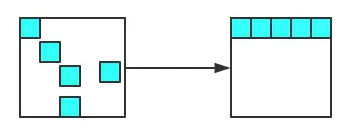
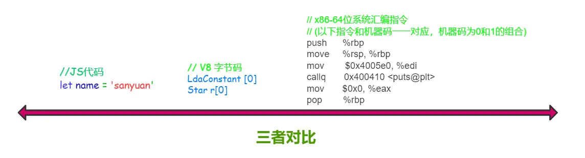

# 八、JavaScript内存机制

## 1. 数据是如何存储的？

> 补充：闭包变量是存在堆内存中的。

具体而已，以下数据类型存储在栈中：

- boolean
- null
- undefined
- number
- string
- symbol
- bigint

而所有的对象数据类型存放在堆中。

值得注意的是，对于 `赋值` 操作，原始类型的数据直接完整地复制变量值，对象数据类型的数据则是复制引用地址。

因此会有下面的情况：

```js
let obj = { a: 1 };
let newObj = obj;
newObj.a = 2;
console.log(obj.a);//变成了2
```

之所以会这样，是因为 `obj` 和 `newObj`  是同一份堆空间的地址，改变 `newObj` ，等于改变了共同的堆内存，这时候通过 `obj` 来获取这块内存的值当然会改变。

当然，你可能会问: 为什么不全部用栈来保存呢？

首先，对于系统栈来说，它的功能除了保存变量之外，还有创建并切换函数执行上下文的功能。举个例子:

```js
function f(a) {
  console.log(a);
}

function func(a) {
  f(a);
}

func(1);
复制代码
```

假设用ESP指针来保存当前的执行状态，在系统栈中会产生如下的过程：

1. 调用func, 将 func 函数的上下文压栈，ESP指向栈顶。
2. 执行func，又调用f函数，将 f 函数的上下文压栈，ESP 指针上移。
3. 执行完 f 函数，将ESP 下移，f函数对应的栈顶空间被回收。
4. 执行完 func，ESP 下移，func对应的空间被回收。

图示如下:


因此你也看到了，如果采用栈来存储相对基本类型更加复杂的对象数据，那么切换上下文的开销将变得巨大！

不过堆内存虽然空间大，能存放大量的数据，但与此同时垃圾内存的回收会带来更大的开销，下一篇就来分析一下堆内存到底是如何进行垃圾回收并进行优化的。


## 2. V8 引擎如何进行垃圾内存的回收？

JS 语言不像 C/C++，让程序员自己去开辟或释放内存，而是类似 Java，采用自己的一套垃圾回收算法进行自动的内存管理。作为一名的前端工程师，对于 JS 内存回收的机制是需要非常清楚, 以便于在极端的环境下能够分析出系统性能的瓶颈，另一方面，学习这其中的机制，也对我们深入理解 JS 的闭包特性、以及对内存的高效使用，都有很大的帮助。

### V8 内存机制

在其他的后端语言中，如Java/Go, 对于内存的使用没有什么限制，但是JS不一样，V8 只能使用系统的一部分内存，具体来说，在 `64` 位系统下，V8 最多只能分配 `1.4G`，在 32 位系统中，最多只能分配 `0.7G`。你想想在前端这样的大内存需求其实并不大，但对于后端而言，nodejs 如果遇到一个 2G 多的文件，那么将无法全部将其读入内存进行各种操作了。

对于栈内存而言，当 ESP 指针下移，也就是上下文切换之后，栈顶的空间会自动被回收。但对于堆内存而言就比较复杂了，下面着重分析堆内存的垃圾回收。

之前提到过，所有的对象类型的数据在 JS 中都是通过堆进行空间分配的。当我们构造一个对象进行赋值操作的时候，其实相应的内存已经分配到了堆上。你可以不断的这样创建对象，让 V8 为它分配空间，直到堆的大小达到上限。

那么问题来了，V8 为什么要给它设置内存上限？明明我的机器大几十G的内存，只能让我用这么一点？

究其根本，是由两个因素所共同决定的，一个是 JS 单线程的执行机制，另一个是 JS 垃圾回收机制的限制。

首先 JS 是单线程运行的，这意味着一旦进入垃圾回收，那么其它的各种运行逻辑都要暂停；另一个方法垃圾回收其实是非常耗时的操作，V8 官方是这样形容的：

>  以 1.5GB 的垃圾回收堆内存为例，V8 做一次小的垃圾回收需要 50ms 以上，做一次非增量式(ps:后面会解释)的垃圾回收甚至要 1s 以上。

可见其耗时之久，而且在这么长的时间内，我们的 JS 代码执行会一直没有响应，造成应用卡顿，导致应用性能和响应能力直线下降。因此，V8 做了一个简单粗暴的选择，那就是限制堆内存，也算是一种权衡的手段，因为大部分情况是不会遇到操作几个 G 内存这样的场景的。

不过，如果你想调整这个内存的限制也不是不行。配置命令如下:

```js
// 这是调整老生代这部分的内存，单位是MB。后面会详细介绍新生代和老生代内存
node --max-old-space-size=2048 xxx.js 
复制代码
```

或者

```js
// 这是调整新生代这部分的内存，单位是 KB。
node --max-new-space-size=2048 xxx.js
```

### 新生代内存的回收

V8 把堆内存分成了两部分进行处理——新生代内存和老生代内存。顾名思义，新生代就是临时分配的内存，存活时间短， 老生代是常驻内存，存活的时间长。V8 的堆内存，也就是两个内存之和。


根据这两种不同种类的堆内存，V8 采用了不同的回收策略，来根据不同的场景做针对性的优化。

首先是新生代的内存，刚刚已经介绍了调整新生代内存的方法，那它的内存默认限制是多少？在 64 位和 32 位系统下分别位 32 MB 和 16 MB。够小吧，不过也很好理解，新生代中的变量存号时间短，来了马上就走，不容易产生太大的内存负担，因此可以将它设的足够小。

那好了，新生代的垃圾回收是怎么做的呢？

首先将新生代内存空间一分为二：


其中 From 部分表示正在使用的内存，To 是目前闲置的内存。

当进行垃圾回收时，V8 将 From 部分的对象检查一遍，如果是存活对象那么复制到 To 内存中（在 To 内存中按照顺序从头放置的），如果是非存活对象直接回收即可。

当所有的 From 中的存活对象按照顺序进入到 To 内存之后，From 和 To 两者的角色`对调`，From 现在被闲置，To 位正在使用，如此循环。

那你很可能会问了，直接将非存活对象回收了不就万事大吉了嘛，为什么还要后面的一系列操作？

注意，我刚刚特别说明了，在To内存中按照顺序从头放置的，这是为了应对这样的场景:


深色的小方块代表存活对象，白色部分表示待分配的内存，由于堆内存是连续分配的，这样零零散散的空间可能会导致稍微大一点的对象没有办法进行空间分配，这种零散的空间也叫做**内存碎片**。刚刚介绍的新生代垃圾回收算法也叫 **Scavenge 算法**。

Scavenge 算法主要就是解决内存碎片的问题，在进行一顿复制之后，To 空间变成了这个样子：


这样就大大方便了后续连续空间的分配。

不过 Scavenge 算法的劣势也非常明显，就是内存只能使用新生代内存的一半，但是它只存放**生命周期短**的对象，这种对象**一般很少**，因此**时间**性能非常优秀。

### 老生代内存的回收

刚刚介绍了新生代的回收方式，那么新生代中的变量如果经过多少次回收后依然存在，那么就会被放入到 `老生代内存` 中，这种现象就叫 `晋升`。

发生晋升其实不止这一种原因，我们来梳理一下会有哪些情况触发晋升：

- 已经经过一次 Scavenge 回收。
- To（闲置）空间的内存占用超过 25%。

现在进入到老生代的垃圾回收机制当中，老生代中累积的变量空间一般都是很大的，当然不能用 `Scavenge` 算法，浪费一半空间不说，对庞大的内存空间进行复制岂不是劳民伤财？

那么对于老生代而言，究竟是采取怎样的策略进行垃圾回收的呢？

第一步，进行标记-清除。这个过程在《JavaScript高级程序设计(第三版)》中有过详细的介绍，主要分成两个阶段，即标记阶段和清除阶段。首先会遍历堆中的所有对象，对它们做上标记，然后对于代码环境中 `使用的变量` 已经被 `强引用`的变量取消标记，剩下的就是要删除的变量了，在随后的 `清除阶段` 对其进行空间的回收。

当然这又会引发内存碎片的问题，存活对象的空间不连续对后续的空间分配造成障碍。老生代又是如何处理这个问题的呢？

第二步，整理内存碎片。V8 的解决方式非常简单粗暴，在清除阶段结束后，把存活的对象全部往一端靠拢。



由于是移动对象，它的执行速度不可能很快，事实上也是整个过程中最耗时间的部分。

### 增量标记

由于 JS 的单线程机制，V8 在进行垃圾回收的时候，不可避免的会阻塞业务逻辑的执行，倘若老生代的垃圾回收任务很重，那么耗时会非常可怕，严重影响应用的性能。那么这个时候为了避免这样的问题，V8 采取了增量标记的方案，即将一口气完成的标记任务分为很多小的部分完成，每做完一个小的部分就 “歇” 一下，就让 JS 应用逻辑执行一会儿，然后再执行下面的部分，如果循环，直到标记阶段完成才进入到内存碎片的整理上面来。其实这个过程跟React Fiber的思路有点像，这里就不展开了。

经过增量标记之后，垃圾回收过程对 JS 应用的阻塞时间减少到原来的 1/6 ，可以看到，这是一个非常成功的改进。


JS垃圾回收的原理就介绍到这里了，其实理解起来是非常简单的，重要的是理解它`为什么要这么做`，而不仅仅是`如何做的`，希望这篇总结能够对你有所启发。


## 3. 描述一下 V8 执行一段 JS 代码的过程？

前端相对来说是一个比较新兴的领域，因此各种前端框架和工具层出不穷，让人眼花缭乱，尤其是各大厂商推出`小程序`之后`各自制定标准`，让前端开发的工作更加繁琐，在此背景下为了抹平平台之间的差异，诞生的各种`编译工具/框架`也数不胜数。但无论如何，想要赶上这些框架和工具的更新速度是非常难的，即使赶上了也很难产生自己的`技术积淀`，一个更好的方式便是学习那些`本质的知识`，抓住上层应用中不变的`底层机制`，这样我们便能轻松理解上层的框架而不仅仅是被动地使用，甚至能够在适当的场景下自己造出轮子，以满足开发效率的需求。

站在 V8 的角度，理解其中的执行机制，也能够帮助我们理解很多的上层应用，包括Babel、Eslint、前端框架的底层机制。那么，一段 JavaScript 代码放在 V8 当中究竟是如何执行的呢？

首先需要明白的是，机器是读不懂 JS 代码，机器只能理解特定的机器码，那如果要让 JS 的逻辑在机器上运行起来，就必须将 JS 的代码翻译成机器码，然后让机器识别。JS 属于**解释型语言**，对于解释型语言来说，解释器会对源代码做如下分析：

- 通过词法分析和语法分析生成 `AST（Abstract Syntax Tree）`（抽象语法树）
- 生成字节码

然后解释器根据字节码来执行程序。但 JS 整个执行的过程其实会比这个更加复杂：

### 1. 生成 AST

生成 `AST` 分为两步 ——词法分析和语法分析。

词法分析即分词，它的工作就是将一行行的代码分解成一个个 `token`。比如下面一行代码：

```js
let name = 'sanyuan'
```

其中会把句子分解成四个部分：


即解析成四个 `token`，这就是词法分析的作用。

接下来语法分析阶段，将生成的这些 `token` 数据，根据一定的语法规则转换为 `AST`。举个例子：

```js
let name = 'sanyuan'
console.log(name)
```

最后生成的 `AST` 是这样的：


- `Program`——程序
  - `variable declaration`——变量声明
    - `variable declarator`——变量说明符
  - `expression statement`——表达式语句
    - `call expression`——调用表达式
      - `member expression`——成员表达式


当生成了 `AST` 之后，编译器/解释器后续的工作都要依靠 AST 而不是源代码。顺便补充一句，`babel`的工作原理就是将 ES6 的代码解析成 `ES6 的 AST`，然后将 ES6 的 AST  转换为 `ES5 的 AST`，最后才将 ES5 的 AST 转换为具体的 ES5 代码。由于本文着重阐述原理，关于 babel 编译的细节就不展开了，推荐大家去读一读荒山的[babel文章](https://juejin.im/post/5d94bfbf5188256db95589be), 帮你打开新世界的大门: )

回到 V8 本身，生成 AST 后，接下来会生成执行上下文，关于执行上下文，可以参考上上篇《JavaScript内存机制之问——数据是如何存储的？》中对于上下文压栈出栈过程的讲解。

### 2. 生成字节码

开头就已经提到过了，生成 AST 之后，直接通过 V8 的解释器（也叫 Ignition）来生成字节码。但是 `字节码` 并不能让机器直接运行，那你可能就会说了，不能执行还转成字节码干嘛，直接把 AST 转换成机器码不就得了，让机器直接执行。确实，在 V8 的早期是这么做的，但后来因为机器码的体积太大，引发了严重的内存占用问题。

给一张对比图让大家直观地感受以下三者代码量的差异:



很容易得出，字节码是比机器码轻量得多的代码。那么 V8 为什么要使用字节码，字节码到底是个什么东西?

> 字节码是介于 AST 和 机器码之间的一种代码，但是与特定类型的机器码无关，字节码需要通过解释器将其转换为机器码然后执行。

字节码仍然需要转换为机器码，但是和原来不同的是，现在不用一次性将全部的字节码都转换为机器码，而是通过解释器来逐行执行字节码，省去了生成二进制文件的操作，这样就大大降低了内存的压力。

### 3. 执行代码

接下来，就进入到字节码解释执行的阶段：

在执行字节码的过程中，如果发现某一部分代码重复出现，那么 V8 将它记作 **热点代码（HotSpot）**，然后将这样的代码编译成 **机器码** 保存起来，这个用来编译的工具就是 V8 的 **编译器** 也叫做 **TurboFan**，因此在这样的机制下，代码执行的时间越久，那么执行效率会越来越高，因为有越来越多的字节码被标记为 **热点代码**，遇到它们时直接执行相应的机器码，不用再次转换为机器码。

其实当你听到有人说 JS 就是一门解释器语言的时候，其实这个说法是有问题的。因为字节码不仅配合了解释器，而且还和编译器打交道，所以 JS 并不是完全的解释型语言。而编译器和解释器的根本区别在于前者会编译生成二进制文件但后者不会。

并且，这种字节码跟编译器和解释器结合的技术，我们称之为 **即时编译**，也就是我们经常听到的 **JIT**。


这就是 V8 中执行一段 JS 代码的整个过程，梳理一下：

1. 首先通过词法分析和语法分析生成 AST
2. 将 AST 转换为字节码
3. 由解释器逐行执行字节码，遇到热点代码启动编译器进行编译，生成对应的机器码，以优化执行效率


# 九、EventLoop

## 1. 宏任务和微任务

### 宏任务（Macro Task）引入

在 JS 中，大部分的任务都是在主线程上执行，常见的任务有：

1. 渲染事件
2. 用户交互事件
3. js 脚本执行
4. 网络请求、文件读写完成事件等等。

为了让这些事件有条不紊地进行，JS 引擎需要对之执行的顺序做一定的安排，V8 其实采用的是一种 `队列` 的方式来存储这些任务，即先进来的先执行。模拟如下：

```js
bool keep_running = true;
void MainTherad(){
    for(;;){
        // 执行队列中的任务
        Task task = task_queue.takeTask();
        ProcessTask(task);
        
        // 执行延迟队列中的任务
        ProcessDelayTask();
        
        // 如果设置了退出标志，那么直接退出线程循环
        if(!keep_running) break;
    }
}
```

这里用到了一个 for 循环，将队列中的任务一一取出，然后执行，这个很好理解。但是其中包含了两种任务队列，除了上述提到的任务队列，它专门处理诸如 `setTimeout/setInterval` 这样的定时器回调任务。

上述提到的，普通任务队列和延迟队列中的任务，都属于**宏任务**。


### 微任务（Micro Task）引入

对于每个宏任务而言，其内部都有一个微任务队列。那为什么要引入微任务？微任务在什么时候执行呢?

其实引入微任务的初衷是为了解决异步回调的问题。想一想，对于异步回调的处理，有多少种方式？总结起来有两点：

1. 将异步回调进行宏任务队列的入队操作。
2. 将异步回调放到当前宏任务的末尾。

如果采用第一种方式，那么执行回调的时机应该是在前面 **所有的宏任务** 完成之后，倘若现在的任务队列非常长，那么回调迟迟得不到执行，造成**应用卡顿**。

为了规避这样的问题，V8 引入了第二种方式，这就是 **微任务** 的解决方式。在每一个宏任务种定义一个 **微任务队列**，当该宏任务执行完成，会检查其中的微任务队列，如果为空则直接执行下一个宏任务，如果不为空，则 **依次执行微任务**，执行完成才去执行下一个宏任务。

常见的微任务有 `MutationObserver` 、`Promise.then(或.reject)` 以及以 `Promise` 为基础开发的其他技术（比如 `fetch API`)，还包括 V8 的垃圾回收过程。

这便是 **宏任务** 和 **微任务** 的概念，接下来正式介绍 JS 非常重要的运行机制——EventLoop。


## 2. 浏览器篇

从一个例子开始:

```js
console.log('start');
setTimeout(() => {
    console.log('timeout');
});
Promise.resolve().then(() => {
    console.log('resolve');
});
console.log('end');
```

分析一下：

1. 刚开始整个脚本作为一个宏任务来执行，对于同步代码直接压入执行栈进行执行，**因此先打印 start 和 end**；
2. `setTimeout` 作为一个宏任务放入宏任务队列
3. `Promise.then` 作为一个微任务放入到微任务对象
4. 当本次宏任务执行完，检查微任务队列，发现一个 `Promise.then` 执行
5. 接下来进入到下一个宏任务——`setTimeout`，执行

因此最后的顺序是：

```js
start->end->resolve->timeout
```

这样就直观感受到了浏览器环境下的 `EventLoop` 的执行流程。不过，这只是其中的一部分情况，接下来做一个更完整的总结：

1. 一开始整段脚本作为第一个**宏任务**执行；

2. 执行过程中同步代码直接执行，**宏任务** 进入宏任务队列，**微任务**进入微任务队列；
3. 当前宏任务执行完出队，检查微任务队列，如果有则依次执行，直到微任务队列为空；
4. 执行浏览器 UI 线程的渲染工作；
5. 检查是否有 Web worker 任务，有则执行；
6. 执行队首新的宏任务，回到步骤 2 ，直到宏任务和微任务队列都为空


练习:

```js
Promise.resolve().then(()=>{
  console.log('Promise1')  
  setTimeout(()=>{
    console.log('setTimeout2')
  },0)
});
setTimeout(()=>{
  console.log('setTimeout1')
  Promise.resolve().then(()=>{
    console.log('Promise2')    
  })
},0);
console.log('start');

// start
// Promise1
// setTimeout1
// Promise2
// setTimeout2
```

## 3. node.js 篇

nodejs 和 浏览器的 eventLoop 还是有很大差别的，值得单独拿出来说一说。

先上个流程图


看到这你不用紧张，这里会抛开这些晦涩的流程图，以最清晰浅显的方式来一步步拆解 nodejs 的事件循环机制。

### 1. 三大关键阶段

首先，梳理一下 nodejs 三个非常重要的执行阶段：

1. 执行 **定时器回调** 的阶段。检查定时器，如果到了时间，就执行回调。这些定时器就是 `setTimeout`、`setInterval`。这个阶段暂且叫它 `timer`。
2. 轮询（`poll`）阶段。因为在 node 代码中难免会有异步操作，比如文件 I/O，网络 I/O 等等，那么当这些异步操作做完了，就会来通知 JS 主线，怎么通知呢？就是通过 'data' 、'connect' 等事件使得事件循环到达 `poll` 阶段。到达了这个阶段后：
   - 如果当前已经存在定时器，而且有定时器到时间了，拿出来执行，`eventLoop` 将回到 `timer` 阶段。
   - 如果没有定时器，会去看回调函数队列：
     - 如果队列**不为空**，拿出队列中的方法依次执行；
     - 如果队列`为空`，检查是否有 `setImmdiate` 的回调：
       - 有则前往 **check阶段**（下面会介绍）
       - **没有则继续等待**，相当于阻塞了一段时间（阻塞时间是有上限的），等待 `callback` 函数加入队列，加入后会立即执行，一段时间后 **自动进入 check 阶段**
3. `check` 阶段。这是一个比较简单的阶段，直接 **执行 setImmdiate** 的回调。

这三个阶段为一个循环过程。不过现在的 eventLoop 并不完整，我们现在就来一一的完善。

### 2. 完善

首先，当第 1 阶段结束后，可能并不会立即等到异步事件的响应，这是 nodejs 会进入到 **I/O 异常的回调阶段**。比如说 TCP 连接遇到 `ECONNREFUSED（拒绝错误连接）`，就会在这个时候执行回调。

并且在 `check` 阶段结束后还会进入到 **关闭事件的回调阶段**。如果一个 `socket` 或句柄（`handle`）被突然关闭，例如 `socket.destory()`，‘close’ 事件的回调就会在这个阶段执行。

梳理一下，nodejs 的 eventLoop 分为下面的几个阶段：

1. timer 阶段
2. I/O 异常回调阶段
3. 空闲、预备阶段（第 2 阶段结束，poll 未被触发之前）
4. poll 阶段
5. check 阶段
6. 关闭事件的回调阶段


### 3. 实例演示

好，我们以上次的练习题来实践一把:

```js
setTimeout(()=>{
    console.log('timer1')
    Promise.resolve().then(function() {
        console.log('promise1')
    })
}, 0)
setTimeout(()=>{
    console.log('timer2')
    Promise.resolve().then(function() {
        console.log('promise2')
    })
}, 0)
```

这里我要说，node版本 >= 11和在 11 以下的会有不同的表现。

首先说 node 版本 >= 11的，它会和浏览器表现一致，一个定时器运行完立即运行相应的微任务。

```js
timer1
promise1
time2
promise2
```

而 node 版本小于 11 的情况下，对于定时器的处理是:

> 若第一个定时器任务出队并执行完，发现队首的任务仍然是一个定时器，那么就将微任务暂时保存，`直接去执行`新的定时器任务，当新的定时器任务执行完后，`再一一执行`中途产生的微任务。

因此会打印出这样的结果:

```js
timer1
timer2
promise1
promise2
```

### 4. nodejs 和 浏览器关于 eventLoop 的主要区别

两者最主要的区别在于浏览器中的微任务是在每个相应的宏任务中执行的，而 nodejs 中的微任务是在 **不同阶段之间** 执行的。

### 5.关于process.nextTick的一点说明

`process.nextTick` 是一个独立于 eventLoop 的任务队列。

在每一个 eventLoop 阶段完成后会去检查这个队列，如果里面有任务，会让这部分任务`优先于微任务`执行。


# 十、nodejs 中的异步、非阻塞I/O

在听到 nodejs 相关的特性时，经常会对 **异步I/O**、**非阻塞 I/O** 有所耳闻，听起来好像是差不多的意思，但是其实是两码事，下面就以原理的角度来剖析一下对于 nodejs 来说，这两种技术底层是如何实现的?

## 1. 什么是 I/O?

首先，解释一下 I/O 的概念。I/O 即 **Input/Output**，输入和输出的意思。在浏览器端，只有一种 I/O，那就是利用 Ajax 发送网络请求，然后读取返回的内容，这属于 **网络I/O**。回到 nodejs 中，其实这种 I/O 的场景就更加广泛了，主要分为两种：

- 文件 I/O。比如用 fs 模块对文件进行读写操作。
- 网络 I/O。比如用 http 模块发起网络请求。


## 2. 阻塞和非阻塞 I/O

**阻塞** 和 **非阻塞** I/O 其实是针对操作系统内核而言的，并不是 nodejs 本身。阻塞 I/O 的特点就是一定要 **等到操作系统完成所有操作后才表示调用结束**，而非阻塞 I/O 是调用后里面返回，不用等操作系统内核完成操作。

对前者而言，在操作系统进行 I/O 的操作的过程中，我，我们的应用程序其实是一直处于等待状态的，什么都做不了。那如果换成 **非阻塞 I/O**，调用返回后我们的 nodejs 应用程序就可以完成其他的事情，而操作系统同时也在进行 I/O。这样就把等待的时间充分利用了起来，提高了执行效率，但是同时又会产生一个问题，nodejs 应用程序怎么知道操作系统已经完成了 I/O 操作呢？

为了让 nodejs 知道操作系统已经做完了 I/O 操作，需要重复地去操作系统那里判断一下是否完成，这种重复判断的方式就是 **轮询**。对于轮询而言，有以下这么几种方案：

1. 一直轮询检查 I/O状态，直到 I/O 完成。这是最原始的方式，也是性能最低的，会让 CPU 一直耗用在等待上面，其实跟阻塞 I/O 的效果是一样的。
2. 遍历文件描述符（即文件 I/O 时操作系统和 nodejs 之间的文件凭证）的方式来确定 I/O 是否完成，I/O 完成则文件描述符的状态改变。但 CPU 轮询消耗还是很大。
3. epoll 模式。即在进入轮询的时候如果 I/O 未完成 CPU 就休眠，完成之后唤醒 CPU。

总之，CPU要么重复检查I/O，要么重复检查文件描述符，要么休眠，都得不到很好的利用，我们希望的是:

> node应用程序发起 I/O 调用后可以直接去执行别的逻辑，操作系统默默地做完 I/O之后给 nodejs 发送一个完成信号，nodejs 执行回调操作。

这是理想的情况，也是异步 I/O 的效果，那么如何实现这样的效果呢？

## 3. 异步 I/O 的本质

Linux 原生存在这样的一种方式，即（AIO），但有两个致命的缺陷：

1. 只有在 Linux 下存在，其他系统中没有异步 I/O 支持；
2. 无法利用系统缓存。

### nodejs 中的异步 I/O 方案

是不是没有办法了呢？ 在单线程的情况下确实是这样，但是如果把思路放开一点，利用多线程来考虑这个问题，就变得轻松多了。我们可以让一个进程进行计算机操作，另一个进行 I/O 调用，I/O 完成后把信号传给计算的线程，进而执行回调，这不就好了吗？没错，**异步 I/O 就是使用这样的线程池来实现的**。

只不过在不同的系统下面表现会有所差异，在 Linux 下可以直接使用线程池来完成，在 Window 系统下则采用 IOCP 这个系统 API（其内部还是用线程池完成的）。

有了操作系统的支持，那 nodejs 如何来对接这些操作系统从而实现异步 I/O 呢？

以文件为 I/O 我们以一段代码为例：

```js
et fs = require('fs');

fs.readFile('/test.txt', function (err, data) {
    console.log(data); 
});
```

### 执行流程

执行代码的过程中大概发生了这些事情：

1. 首先，`fs.readFile` 调用 Node 的核心模块 `fs.js`;
2. 接下来，Node 的核心模块调用内建模块 `node_file.cc` ，创建对应的文件 I/O 观察者对象（这个对象后面大有用！）；
3. 最后，根据不同平台（Linux 或 window），内建模块通过 libuv 中间层进行系统调用


### libuv调用过程拆解

重点来了！ libuv 中是如何来进行系统调用的呢？ 也就是 uv_fs_open() 中做了什么？

#### **1. 创建请求对象**

以 Windows 系统为例来说，这个函数的调用过程中，我们创建了一个文件 I/O 请求对象，并往里面注入了回调函数。

```js
req_wrap->object_->Set(oncomplete_sym, callback);
```

`req_wrap` 便是这个请求对象，`req_wrap` 中 `object_` 的 `oncomplete_sym` 属性对应的值便是我们 nodejs 应用程序代码中传入的回调函数。

#### 2. 推入线程池，调用返回

在这个对象包装完成后，`QueueUserWorkItem()` 方法将这个对象推进线程池中等待执行。

好，至此现在 js 调用就直接返回了，我们的 js 应用程序代码可以 **继续往下执行**，当然，当前的 `I/O`

操作同时也在线程池中将被执行，这不就完成了异步么？

等等，别高兴太早，回调都还没执行呢！接下来便是执行回调通知的环节。

#### 3. 回调通知

事实上现在线程池中的 I/O 无论是阻塞还是非阻塞都已经无所谓了，因为异步的目的已经达成。重要的是 I/O 完成后会发生什么。

在介绍后续的故事之前，给大家介绍两个重要的方法: `GetQueuedCompletionStatus` 和 `PostQueuedCompletionStatus`。

1. 还记得之前讲过的 eventLoop 吗？在每一个Tick当中会调用`GetQueuedCompletionStatus`检查线程池中是否有执行完的请求，如果有则表示时机已经成熟，可以执行回调了。
2. `PostQueuedCompletionStatus`方法则是向 IOCP 提交状态，告诉它当前I/O完成了。

名字比较长，先介绍是为了让大家混个脸熟，至少后面出来不会感到太突兀：）

我们言归正传，把后面的过程串联起来。

当对应线程中的 I/O 完成后，会将获得的结果`存储`起来，保存到`相应的请求对象`中，然后调用`PostQueuedCompletionStatus()`向 IOCP 提交执行完成的状态，并且将线程还给操作系统。一旦 EventLoop 的轮询操作中，调用`GetQueuedCompletionStatus`检测到了完成的状态，就会把`请求对象`塞给I/O观察者(之前埋下伏笔，如今终于闪亮登场)。

I/O 观察者现在的行为就是取出`请求对象`的`存储结果`，同时也取出它的`oncomplete_sym`属性，即回调函数(不懂这个属性的回看第1步的操作)。将前者作为函数参数传入后者，并执行后者。 这里，回调函数就成功执行啦！


## 总结:

1. **阻塞** 和 **非阻塞** I/O 其实是针对操作系统内核而言的。阻塞 I/O 的特点就是一定要等到操作系统完成所有操作后才表示调用结束，而非阻塞 I/O 是调用后立马返回，不用等操作系统内核完成操作。
2. nodejs 中的异步 I/O 采用多线程的方式，由 **EventLoop**、**I/O 观察者**、**请求对象**、**线程池** 四大要素相互配合，共同实现。


# 十一、JS 异步编程方案

关于 JS **单线程**、**EventLoop** 以及 **异步 I/O** 这些底层的特性，我们之前做过了详细的拆解，不在赘述。在探究了底层机制后，还需要对代码的组织方式有所理解，这是离我们日常开发最接近的部分，异步代码的组织方式直接决定了 **开发** 和 **维护** 的 **效率**，其重要性也不可小觑。尽管**底层机制**没变，但异步代码的组织方式却随着 ES 标准的发展，一步步发生了巨大的**变革**！

## 1. 回调函数时代

相信很多 nodejs 的初学者都或多或少踩过这样的坑，node 中很多原生的 api 就是诸如这样的:

```js
fs.readFile('xxx', (err, data) => {

});
复制代码
```

典型的高阶函数，将回调函数作为函数参数传给了readFile。但久而久之，就会发现，这种传入回调的方式也存在大坑, 比如下面这样:

```js
fs.readFile('1.json', (err, data) => {
    fs.readFile('2.json', (err, data) => {
        fs.readFile('3.json', (err, data) => {
            fs.readFile('4.json', (err, data) => {

            });
        });
    });
});
```

回调当中嵌套回调，也称回调地狱。这种代码的可读性和可维护性都是非常差的，因为嵌套的层级太多。而且还要一个严重的问题，就是每次任务可能会失败，需要在回调里面对每个任务的失败情况进行处理，增加了代码的混乱程度。


## 2. Promise 时代

ES6 中新增的 Promise 就很好的解决了 **回调地狱** 的问题，同时的合并了错误处理，写出来的代码类似于下面这样：

```js
readFilePromise('1.json').then(data => {
    return readFilePromise('2.json')
}).then(data => {
    return readFilePromise('3.json')
}).then(data => {
    return readFilePromise('4.json')
});
```

以链式调用的方式避免了大量的嵌套，也符合人的线性思维，大大方便了异步编程。


## 3. co + Generator 方式

利用协程完成 Generator 函数，用 co 库让代码依次执行完，同时以同步的方式书写，也让异步操作按顺序执行。

```js
co(function* () {
  const r1 = yield readFilePromise('1.json');
  const r2 = yield readFilePromise('2.json');
  const r3 = yield readFilePromise('3.json');
  const r4 = yield readFilePromise('4.json');
})
```

## 4. async + await 方式

这是 ES7 中新增的关键字，凡是加上 async 的函数都默认返回一个 Promise 对象，而更重要的是 async + await 也能让异步代码以同步的方式来书写，而不需要借助第三方库的支持。

```js
const readFileAsync = async function () {
  const f1 = await readFilePromise('1.json')
  const f2 = await readFilePromise('2.json')
  const f3 = await readFilePromise('3.json')
  const f4 = await readFilePromise('4.json')
}
```


## 简单实现一下 node 中回调函数的机制？

**回调函数**的方式其实内部利用了 **发布—订阅** 模式，在这里我们以模拟实现 node 中的 Event 模块为例来写实现回调函数的机制。

```js
function EventEmitter(){
    this.events = new Map();
}
```

这个 EventEmitter 一共需要实现这些方法：`addListener`，`removeListener`，`once`，`removeAllListener`，`emit`。

首先是 `addListener`：

```js
// once 参数表示是否只触发一次
const wrapCallback = (fn, once = false) => ({callback: fn, once});

EventEmitter.prototype.addListener = function(type, fn, once = false){
    let handler = this.events.get(type);
    if (!handler) {
        // 为 type 事件绑定回调
        this.events.set(type, wrapCallback(fn, once));
    } else if (handler && typeof handler.callback === 'function') {
        // 目前 type 事件只有一个回调
        this.events.set(type, [handler, wrapCallback(fn, once)]);
    } else {
        // 目前 type 事件回调数 >= 2
        handler.push(wrapCallback(fn, once));
    }
}
```

removeLisener 的实现如下:

```js
EventEmitter.prototype.removeListener = function (type, listener) {
  let handler = this.events.get(type);
  if (!handler) return;
  if (!Array.isArray(handler)) {
    if (handler.callback === listener.callback) this.events.delete(type);
    else return;
  }
  for (let i = 0; i < handler.length; i++) {
    let item = handler[i];
    if (item.callback === listener.callback) {
      // 删除该回调，注意数组塌陷的问题，即后面的元素会往前挪一位。i 要 -- 
      handler.splice(i, 1);
      i--;
      if (handler.length === 1) {
        // 长度为 1 就不用数组存了
        this.events.set(type, handler[0]);
      }
    }
  }
}
```

once 实现思路很简单，先调用 addListener 添加上了once标记的回调对象, 然后在 emit 的时候遍历回调列表，将标记了once: true的项remove掉即可。

```js
EventEmitter.prototype.once = function (type, fn) {
  this.addListener(type, fn, true);
}

EventEmitter.prototype.emit = function (type, ...args) {
  let handler = this.events.get(type);
  if (!handler) return;
  if (Array.isArray(handler)) {
    // 遍历列表，执行回调
    handler.map(item => {
      item.callback.apply(this, args);
      // 标记的 once: true 的项直接移除
      if (item.once) this.removeListener(type, item);
    })
  } else {
    // 只有一个回调则直接执行
    handler.callback.apply(this, args);
  }
  return true;
}
```

最后是 removeAllListener：

```js
EventEmitter.prototype.removeAllListener = function (type) {
  let handler = this.events.get(type);
  if (!handler) return;
  else this.events.delete(type);
}
```

现在我们测试一下:

```js
let e = new EventEmitter();
e.addListener('type', () => {
  console.log("type事件触发！");
})
e.addListener('type', () => {
  console.log("WOW!type事件又触发了！");
})

function f() { 
  console.log("type事件我只触发一次"); 
}
e.once('type', f)
e.emit('type');
e.emit('type');
e.removeAllListener('type');
e.emit('type');

// type事件触发！
// WOW!type事件又触发了！
// type事件我只触发一次
// type事件触发！
// WOW!type事件又触发了！
```

OK，一个简易的 Event 就这样实现完成了，为什么说它简易呢？因为还有很多细节的部分没有考虑:

1. 在`参数少`的情况下，call 的性能优于 apply，反之 apply 的性能更好。因此在执行回调时候可以根据情况调用 call 或者 apply。
2. 考虑到内存容量，应该设置`回调列表的最大值`，当超过最大值的时候，应该选择部分回调进行删除操作。
3. `鲁棒性`有待提高。对于`参数的校验`很多地方直接忽略掉了。

不过，这个案例的目的只是带大家掌握核心的原理，如果在这里洋洋洒洒写三四百行意义也不大，有兴趣的可以去看看Node中 [Event 模块](https://github.com/Gozala/events/blob/master/events.js) 的源码，里面对各种细节和边界情况做了详细的处理。


# 十二、Promise

## 1. Promise 凭什么消灭了回调地狱？

### 问题

首先，什么是回调地狱：

1. 多层嵌套的问题。
2. 每种任务的处理结果存在两种可能性（成功或失败），那么需要在每种任务执行结束后分别处理这两种可能性。

这两种问题在回调函数时代尤为突出。Promise 的诞生就是为了解决这两个问题。

### 解决方法

Promise 利用了三大技术手段来解决**回调地狱**：

- **回调函数延迟绑定**
- **返回值穿透**
- **错误冒泡**

首先举个例子：

```js
let readFilePromise = (filename) =>{
    fs.readFile(filename,(err, data)=>{
        if(err){
            reject(err);
        }else{
            resolve(data);
        }
    })
}
readFilePromise('1.json').then(data => {
    return readFilePromise('2.json');
});
```

如上面的例子，回调函数不是直接声明的，而是在通过后面的 then 方法传入的，即延迟传入。这就是 **回调函数延迟绑定**。

然后我们做以下微调:

```js
let x = readFilePromise('1.json').then(data => {
  return readFilePromise('2.json')//这是返回的Promise
});
x.then(/* 内部逻辑省略 */)
```


会根据 then 中回调函数的传入值创建不同类型的 Promise，然后把返回的 Promise 穿透到外层，以供后续的调用。这里的 x 指的就是内部返回的 Promise，然后在 x 后面可以依次完成链式调用。

这便是 **返回值穿透** 的效果。

这两种技术一起作用便可以将深层的嵌套回调写成下面的形式：

```js
readFilePromise('1.json').then(data => {
    return readFilePromise('2.json');
}).then(data => {
    return readFilePromise('3.json');
}).then(data => {
    return readFilePromise('4.json');
});
```

这样就显得清爽了许多，更重要的是，它更符合人的线性思维，开发体验也更好。

两种技术结合产生了链式调用的效果。

这解决的是多层嵌套的问题，那另一个问题，即每次任务执行结束后 **分别处理成功和失败** 的情况怎么解决的呢？

Promise 采用 **错误冒泡** 的方式，其实很容易理解，来看看效果：

```js
readFilePromise('1.json').then(data => {
    return readFilePromise('2.json');
}).then(data => {
    return readFilePromise('3.json');
}).then(data => {
    return readFilePromise('4.json');
}).catch(err => {
  // xxx
})
```

这样前面产生的错误会一直向后传递，被 catch 接收到，就不用频繁地检查错误了。

### 解决效果

1. 实现链式调用，解决多层嵌套问题
2. 实现错误冒泡后一站式处理，解决每次任务中判断错误、增加代码混乱度的问题


##  2. 为什么 Promise 要引入微任务？

Promise 中的执行函数是同步进行的，但是里面存在着异步操作，在异步操作结束后会调用 `resolve` 方法，或者中途遇到错误调用 `reject` 方法，这两者都是作为微任务进入到 EventLoop 中。但是你有没有想过，Promise 为什么要引入微任务的方式来进行回调操作？

### 解决方式

回到问题本身，其实就是如何处理回调的问题。总结起来有三种方式：

1. 使用同步回调，直到异步任务进行完，再进行后面的任务。
2. 使用异步回调，将回调函数放在进行 **宏任务队列** 的队尾。
3. 使用异步回调，将回调函数放到 **当前宏任务中** 的最后面。

### 优劣对比

第一种方式显然不可取，因为同步的问题非常明显，会让整个脚本阻塞住，当前任务等待，后面的任务都无法得到执行，而这部分**等待的时间** 是可以拿来完成其他事情的，导致 CPU 的利用率非常低，而且还有另外一个致命的问题，就是无法实现**延迟绑定**的效果。

如果采用第二种方式，那么执行回调（`resolve/reject`）的时机应该是在前面所有的宏任务完成之后，倘若现在的任务队列非常长，那么回调迟迟得不到执行，造成应用卡顿。

为了解决上述方案的问题，另外也考虑到 **延迟绑定** 的需求，Promise 采取第三种方式，即 **引入微任务**，即把 `resolve(reject)` 回调的执行放在当前宏任务的末尾。

这样，利用 **微任务** 解决了两大痛点：

1. 采用**异步回调**代替同步回调解决了浪费 CPU 性能的问题。
2. 放到 **当前宏任务最后** 执行，解决了回调执行的实时性问题。

好，Promise 的基本实现思想已经讲清楚了，相信大家已经知道了它`为什么这么设计`，接下来就让我们一步步弄清楚它内部到底是`怎么设计的`。


## Promise 如何实现链式调用?

从现在开始，我们就来动手实现一个功能完整的 Promise，一步步深挖其中的细节。我们先从链式调用开始。

###  简易版实现

首先写出第一版的代码：

```js
// 定义三种状态
const PENDING = "pending";		// 进行中
const FULFILLED = "fulfilled";	// 已成功
const REJECTED = "rejected";	// 已失败

function MyPromise(executor) {
    let self = this;  // 缓存当前 Promise 实例
    // 初始化实例状态
    self.value = null;
    self.error = null;
    self.status = PENDING;
    self.onFulfilled = null; // 成功的回调函数
    self.onRejected = null;  // 失败的回调函数
    
    const resolve = (value) => {
        // 若状态不为进行中，则直接返回
        if(self.status !== PENDING) return;
        setTimeout(()=>{
            self.status = FULFILLED;
            self.value = value;
            self.onFulfilled(self.value);	// resolve时执行成功回调
        });
    };
    
    const reject = (error) => {
        if(self.status !== PENDING) return;
        setTimeout(() => {
          	self.status = REJECTED;
          	self.error = error;
         	self.onRejected(self.error);//reject时执行失败回调
        }); 
    };
    executor(resolve, reject);
}
MyPromise.prototype.then = function(onFulfilled, onRejected){
    if(this.status === PENDING){
        this.onFulfilled = onFulfilled;
        this.onRejected = onRejected;
    }else if(this.status === FULFILLED){
        // 如果状态是 fulfilled ，直接执行成功回调，并将成功值传入
        onFulfilled(this.value);
    }else{
        // 如果状态是 rejected，直接执行失败回调，并将失败原因传入
        onRejected(this.error);
    }
    return this;
}
```

可以看到，Promise 的本质是一个 **有限状态机**，存在三种状态：

- PENDING——进行中（未完成）
- FULFILLED——已成功
- REJECTED——已失败

状态改变规则如下图：


对于 Promise 而言，状态的改变 **不可逆**，即由未完成变为其他状态后，就无法再改变了。

不过，回到目前这一版的 Promise，还是存在一些问题的。

### 设置回调数组

首先只能执行一个回调函数，对于多个回调的绑定就无能为力，比如下面这样：

```js
let promise1 = new MyPromise((resolve, reject) => {
  fs.readFile('./001.txt', (err, data) => {
    if(!err){
      resolve(data);
    }else {
      reject(err);
    }
  })
});

let x1 = promise1.then(data => {
  console.log("第一次展示", data.toString());    
});

let x2 = promise1.then(data => {
  console.log("第二次展示", data.toString());    
});

let x3 = promise1.then(data => {
  console.log("第三次展示", data.toString());    
});
```

这里绑定了三个回调，想要在 `resolve()` 之后一起执行，那怎么办呢？

需要将 `onFulfilled` 和 `onRejected` 改为数组，调用 `resolve` 时将其中的方法拿出来一一执行即可：

```js
self.onFulfilledCallbacks = [];
self.onRejectedCallbacks = [];
```

```js
MyPromise.prototype.then = function(onFulfilled, onRejected){
    if(this.status === PENDING){
        this.onFulfilledCallbacks.push(onFulfilled);
        this.onRejectCallbacks.push(onRejected);
    }else if (this.status === FULFILLED) {
        onFulfilled(this.value);
    } else {
        onRejected(this.error);
    }
    return this;
}
```

接下来将 `resolve` 和 `reject` 方法中执行回调的部分进行修改：

```js
// resolve 中
self.onFulfilledCallbacks.forEach((callback) => callback(self.value));
//reject 中
self.onRejectedCallbacks.forEach((callback) => callback(self.error));
```

### 链式调用完成

我们采用目前的代码来进行测试:

```js
let fs = require('fs');
let readFilePromise = (filename) => {
  return new MyPromise((resolve, reject) => {
    fs.readFile(filename, (err, data) => {
      if(!err){
        resolve(data);
      }else {
        reject(err);
      }
    })
  })
}
readFilePromise('./001.txt').then(data => {
  console.log(data.toString());    
  return readFilePromise('./002.txt');
}).then(data => {
  console.log(data.toString());
})
// 001.txt的内容
// 001.txt的内容
```

咦？怎么打印了两个 `001`，第二次不是读的 `002` 文件吗？

问题出在这里:

```js
MyPromise.prototype.then = function(onFulfilled, onRejected) {
  //...
  return this;
}
```

这么写每次返回的都是第一个 Promise。then 函数当中返回的第二个 Promise 直接被无视了。

说明 then 当中的实现还需要改进, 我们现在需要对 then 中返回值重视起来。实际上的 then 方法返回的是一个新的 Promise 实例，所以才能使用链式写法。

```js
MyPromise.prototype.then = function (onFulfilled, onRejected) {
    let bridgePromise;
    let self = this;
    if(self.status === PENDING){
        return bridgePromise = new MyPromise((resolve, reject) => {
            self.onFulfilledCallbacks.push((value)=>{
                try{
                    // 拿到 then 中回调返回的结果
                    let x = onFulfilled(value);
                    resolve(x);
                }catch(e){
                    reject(e);
                }
            });
            self.onRejectedCallbacks.push((error) => {
                try {
                  	let x = onRejected(error);
                  	resolve(x);
                } catch (e) {
                  	reject(e);
                }
            });
        });
    }
    // ...
}
```

假若当前状态为 PENDING ，将回调数组中添加如上的函数，当 Promise 状态变化后，会遍历相应的回调数组并执行回调。

但是这段程序还是存在一些问题：

1. 首先 then 中的两个参数不传的情况没有处理，
2. 假如 then 中的回调执行后返回的结果（也就是上面的 x）是一个 Promise，直接给 resolve 了，这是我们不希望看到的。

怎么来解决这两个问题呢？

先对参数不传的情况做判断：

```js
// 成功回调不传给它一个默认函数、
onFulfilled = typeof onFulfilled === "function" ? onFulfilled : value => value;
// 对于失败回调直接抛错
onRejected = typeof onRejected === "function" ? onRejected : error => { throw error };
```

然后对**返回 Promise** 的情况进行处理：

```js
function resolvePromise(bridgePromise, x, resolve,reject){
    // 如果 x 是一个 Promise
    if(x instanceof MyPromise){
        // 拆解这个 promise, 直到返回值不为 promise 为止
        if(x.status === PENDING){
            x.then(y => {
            	resolvePromise(bridgePromise, y, resolve, reject);
            }, error => {
            	reject(error);
            });
        }else {
            x.then(resolve, reject);
        }
    }else{
        // 非 Promise 的话直接 resolve 即可
        resolve(x);
    }
}
```


