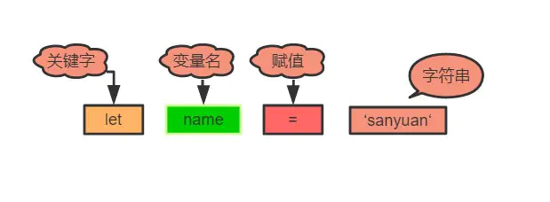

# 八、JavaScript内存机制

## 1. 数据是如何存储的？

> 补充：闭包变量是存在堆内存中的。

具体而已，以下数据类型存储在栈中：

- boolean
- null
- undefined
- number
- string
- symbol
- bigint

而所有的对象数据类型存放在堆中。

值得注意的是，对于 `赋值` 操作，原始类型的数据直接完整地复制变量值，对象数据类型的数据则是复制引用地址。

因此会有下面的情况：

```js
let obj = { a: 1 };
let newObj = obj;
newObj.a = 2;
console.log(obj.a);//变成了2
```

之所以会这样，是因为 `obj` 和 `newObj`  是同一份堆空间的地址，改变 `newObj` ，等于改变了共同的堆内存，这时候通过 `obj` 来获取这块内存的值当然会改变。

当然，你可能会问: 为什么不全部用栈来保存呢？

首先，对于系统栈来说，它的功能除了保存变量之外，还有创建并切换函数执行上下文的功能。举个例子:

```js
function f(a) {
  console.log(a);
}

function func(a) {
  f(a);
}

func(1);
复制代码
```

假设用ESP指针来保存当前的执行状态，在系统栈中会产生如下的过程：

1. 调用func, 将 func 函数的上下文压栈，ESP指向栈顶。
2. 执行func，又调用f函数，将 f 函数的上下文压栈，ESP 指针上移。
3. 执行完 f 函数，将ESP 下移，f函数对应的栈顶空间被回收。
4. 执行完 func，ESP 下移，func对应的空间被回收。

图示如下:


因此你也看到了，如果采用栈来存储相对基本类型更加复杂的对象数据，那么切换上下文的开销将变得巨大！

不过堆内存虽然空间大，能存放大量的数据，但与此同时垃圾内存的回收会带来更大的开销，下一篇就来分析一下堆内存到底是如何进行垃圾回收并进行优化的。


## 2. V8 引擎如何进行垃圾内存的回收？

JS 语言不像 C/C++，让程序员自己去开辟或释放内存，而是类似 Java，采用自己的一套垃圾回收算法进行自动的内存管理。作为一名的前端工程师，对于 JS 内存回收的机制是需要非常清楚, 以便于在极端的环境下能够分析出系统性能的瓶颈，另一方面，学习这其中的机制，也对我们深入理解 JS 的闭包特性、以及对内存的高效使用，都有很大的帮助。

### V8 内存机制

在其他的后端语言中，如Java/Go, 对于内存的使用没有什么限制，但是JS不一样，V8 只能使用系统的一部分内存，具体来说，在 `64` 位系统下，V8 最多只能分配 `1.4G`，在 32 位系统中，最多只能分配 `0.7G`。你想想在前端这样的大内存需求其实并不大，但对于后端而言，nodejs 如果遇到一个 2G 多的文件，那么将无法全部将其读入内存进行各种操作了。

对于栈内存而言，当 ESP 指针下移，也就是上下文切换之后，栈顶的空间会自动被回收。但对于堆内存而言就比较复杂了，下面着重分析堆内存的垃圾回收。

之前提到过，所有的对象类型的数据在 JS 中都是通过堆进行空间分配的。当我们构造一个对象进行赋值操作的时候，其实相应的内存已经分配到了堆上。你可以不断的这样创建对象，让 V8 为它分配空间，直到堆的大小达到上限。

那么问题来了，V8 为什么要给它设置内存上限？明明我的机器大几十G的内存，只能让我用这么一点？

究其根本，是由两个因素所共同决定的，一个是 JS 单线程的执行机制，另一个是 JS 垃圾回收机制的限制。

首先 JS 是单线程运行的，这意味着一旦进入垃圾回收，那么其它的各种运行逻辑都要暂停；另一个方法垃圾回收其实是非常耗时的操作，V8 官方是这样形容的：

>  以 1.5GB 的垃圾回收堆内存为例，V8 做一次小的垃圾回收需要 50ms 以上，做一次非增量式(ps:后面会解释)的垃圾回收甚至要 1s 以上。

可见其耗时之久，而且在这么长的时间内，我们的 JS 代码执行会一直没有响应，造成应用卡顿，导致应用性能和响应能力直线下降。因此，V8 做了一个简单粗暴的选择，那就是限制堆内存，也算是一种权衡的手段，因为大部分情况是不会遇到操作几个 G 内存这样的场景的。

不过，如果你想调整这个内存的限制也不是不行。配置命令如下:

```js
// 这是调整老生代这部分的内存，单位是MB。后面会详细介绍新生代和老生代内存
node --max-old-space-size=2048 xxx.js 
复制代码
```

或者

```js
// 这是调整新生代这部分的内存，单位是 KB。
node --max-new-space-size=2048 xxx.js
```

### 新生代内存的回收

V8 把堆内存分成了两部分进行处理——新生代内存和老生代内存。顾名思义，新生代就是临时分配的内存，存活时间短， 老生代是常驻内存，存活的时间长。V8 的堆内存，也就是两个内存之和。


根据这两种不同种类的堆内存，V8 采用了不同的回收策略，来根据不同的场景做针对性的优化。

首先是新生代的内存，刚刚已经介绍了调整新生代内存的方法，那它的内存默认限制是多少？在 64 位和 32 位系统下分别位 32 MB 和 16 MB。够小吧，不过也很好理解，新生代中的变量存号时间短，来了马上就走，不容易产生太大的内存负担，因此可以将它设的足够小。

那好了，新生代的垃圾回收是怎么做的呢？

首先将新生代内存空间一分为二：


其中 From 部分表示正在使用的内存，To 是目前闲置的内存。

当进行垃圾回收时，V8 将 From 部分的对象检查一遍，如果是存活对象那么复制到 To 内存中（在 To 内存中按照顺序从头放置的），如果是非存活对象直接回收即可。

当所有的 From 中的存活对象按照顺序进入到 To 内存之后，From 和 To 两者的角色`对调`，From 现在被闲置，To 位正在使用，如此循环。

那你很可能会问了，直接将非存活对象回收了不就万事大吉了嘛，为什么还要后面的一系列操作？

注意，我刚刚特别说明了，在To内存中按照顺序从头放置的，这是为了应对这样的场景:


深色的小方块代表存活对象，白色部分表示待分配的内存，由于堆内存是连续分配的，这样零零散散的空间可能会导致稍微大一点的对象没有办法进行空间分配，这种零散的空间也叫做**内存碎片**。刚刚介绍的新生代垃圾回收算法也叫 **Scavenge 算法**。

Scavenge 算法主要就是解决内存碎片的问题，在进行一顿复制之后，To 空间变成了这个样子：


这样就大大方便了后续连续空间的分配。

不过 Scavenge 算法的劣势也非常明显，就是内存只能使用新生代内存的一半，但是它只存放**生命周期短**的对象，这种对象**一般很少**，因此**时间**性能非常优秀。

### 老生代内存的回收

刚刚介绍了新生代的回收方式，那么新生代中的变量如果经过多少次回收后依然存在，那么就会被放入到 `老生代内存` 中，这种现象就叫 `晋升`。

发生晋升其实不止这一种原因，我们来梳理一下会有哪些情况触发晋升：

- 已经经过一次 Scavenge 回收。
- To（闲置）空间的内存占用超过 25%。

现在进入到老生代的垃圾回收机制当中，老生代中累积的变量空间一般都是很大的，当然不能用 `Scavenge` 算法，浪费一半空间不说，对庞大的内存空间进行复制岂不是劳民伤财？

那么对于老生代而言，究竟是采取怎样的策略进行垃圾回收的呢？

第一步，进行标记-清除。这个过程在《JavaScript高级程序设计(第三版)》中有过详细的介绍，主要分成两个阶段，即标记阶段和清除阶段。首先会遍历堆中的所有对象，对它们做上标记，然后对于代码环境中 `使用的变量` 已经被 `强引用`的变量取消标记，剩下的就是要删除的变量了，在随后的 `清除阶段` 对其进行空间的回收。

当然这又会引发内存碎片的问题，存活对象的空间不连续对后续的空间分配造成障碍。老生代又是如何处理这个问题的呢？

第二步，整理内存碎片。V8 的解决方式非常简单粗暴，在清除阶段结束后，把存活的对象全部往一端靠拢。


由于是移动对象，它的执行速度不可能很快，事实上也是整个过程中最耗时间的部分。

### 增量标记

由于 JS 的单线程机制，V8 在进行垃圾回收的时候，不可避免的会阻塞业务逻辑的执行，倘若老生代的垃圾回收任务很重，那么耗时会非常可怕，严重影响应用的性能。那么这个时候为了避免这样的问题，V8 采取了增量标记的方案，即将一口气完成的标记任务分为很多小的部分完成，每做完一个小的部分就 “歇” 一下，就让 JS 应用逻辑执行一会儿，然后再执行下面的部分，如果循环，直到标记阶段完成才进入到内存碎片的整理上面来。其实这个过程跟React Fiber的思路有点像，这里就不展开了。

经过增量标记之后，垃圾回收过程对 JS 应用的阻塞时间减少到原来的 1/6 ，可以看到，这是一个非常成功的改进。


JS垃圾回收的原理就介绍到这里了，其实理解起来是非常简单的，重要的是理解它`为什么要这么做`，而不仅仅是`如何做的`，希望这篇总结能够对你有所启发。


## 3. 描述一下 V8 执行一段 JS 代码的过程？

前端相对来说是一个比较新兴的领域，因此各种前端框架和工具层出不穷，让人眼花缭乱，尤其是各大厂商推出`小程序`之后`各自制定标准`，让前端开发的工作更加繁琐，在此背景下为了抹平平台之间的差异，诞生的各种`编译工具/框架`也数不胜数。但无论如何，想要赶上这些框架和工具的更新速度是非常难的，即使赶上了也很难产生自己的`技术积淀`，一个更好的方式便是学习那些`本质的知识`，抓住上层应用中不变的`底层机制`，这样我们便能轻松理解上层的框架而不仅仅是被动地使用，甚至能够在适当的场景下自己造出轮子，以满足开发效率的需求。

站在 V8 的角度，理解其中的执行机制，也能够帮助我们理解很多的上层应用，包括Babel、Eslint、前端框架的底层机制。那么，一段 JavaScript 代码放在 V8 当中究竟是如何执行的呢？

首先需要明白的是，机器是读不懂 JS 代码，机器只能理解特定的机器码，那如果要让 JS 的逻辑在机器上运行起来，就必须将 JS 的代码翻译成机器码，然后让机器识别。JS 属于**解释型语言**，对于解释型语言来说，解释器会对源代码做如下分析：

- 通过词法分析和语法分析生成 `AST（Abstract Syntax Tree）`（抽象语法树）
- 生成字节码

然后解释器根据字节码来执行程序。但 JS 整个执行的过程其实会比这个更加复杂：

### 1. 生成 AST

生成 `AST` 分为两步 ——词法分析和语法分析。

词法分析即分词，它的工作就是将一行行的代码分解成一个个 `token`。比如下面一行代码：

```js
let name = 'sanyuan'
```

其中会把句子分解成四个部分：



即解析成四个 `token`，这就是词法分析的作用。

接下来语法分析阶段，将生成的这些 `token` 数据，根据一定的语法规则转换为 `AST`。举个例子：

```js
let name = 'sanyuan'
console.log(name)
```

最后生成的 `AST` 是这样的：


- `Program`——程序
  - `variable declaration`——变量声明
    - `variable declarator`——变量说明符
  - `expression statement`——表达式语句
    - `call expression`——调用表达式
      - `member expression`——成员表达式


当生成了 `AST` 之后，编译器/解释器后续的工作都要依靠 AST 而不是源代码。顺便补充一句，`babel`的工作原理就是将 ES6 的代码解析成 `ES6 的 AST`，然后将 ES6 的 AST  转换为 `ES5 的 AST`，最后才将 ES5 的 AST 转换为具体的 ES5 代码。由于本文着重阐述原理，关于 babel 编译的细节就不展开了，推荐大家去读一读荒山的[babel文章](https://juejin.im/post/5d94bfbf5188256db95589be), 帮你打开新世界的大门: )

回到 V8 本身，生成 AST 后，接下来会生成执行上下文，关于执行上下文，可以参考上上篇《JavaScript内存机制之问——数据是如何存储的？》中对于上下文压栈出栈过程的讲解。

### 2. 生成字节码

开头就已经提到过了，生成 AST 之后，直接通过 V8 的解释器（也叫 Ignition）来生成字节码。但是 `字节码` 并不能让机器直接运行，那你可能就会说了，不能执行还转成字节码干嘛，直接把 AST 转换成机器码不就得了，让机器直接执行。确实，在 V8 的早期是这么做的，但后来因为机器码的体积太大，引发了严重的内存占用问题。

给一张对比图让大家直观地感受以下三者代码量的差异:


很容易得出，字节码是比机器码轻量得多的代码。那么 V8 为什么要使用字节码，字节码到底是个什么东西?

> 字节码是介于 AST 和 机器码之间的一种代码，但是与特定类型的机器码无关，字节码需要通过解释器将其转换为机器码然后执行。

字节码仍然需要转换为机器码，但是和原来不同的是，现在不用一次性将全部的字节码都转换为机器码，而是通过解释器来逐行执行字节码，省去了生成二进制文件的操作，这样就大大降低了内存的压力。

### 3. 执行代码

接下来，就进入到字节码解释执行的阶段：

在执行字节码的过程中，如果发现某一部分代码重复出现，那么 V8 将它记作 **热点代码（HotSpot）**，然后将这样的代码编译成 **机器码** 保存起来，这个用来编译的工具就是 V8 的 **编译器** 也叫做 **TurboFan**，因此在这样的机制下，代码执行的时间越久，那么执行效率会越来越高，因为有越来越多的字节码被标记为 **热点代码**，遇到它们时直接执行相应的机器码，不用再次转换为机器码。

其实当你听到有人说 JS 就是一门解释器语言的时候，其实这个说法是有问题的。因为字节码不仅配合了解释器，而且还和编译器打交道，所以 JS 并不是完全的解释型语言。而编译器和解释器的根本区别在于前者会编译生成二进制文件但后者不会。

并且，这种字节码跟编译器和解释器结合的技术，我们称之为 **即时编译**，也就是我们经常听到的 **JIT**。


这就是 V8 中执行一段 JS 代码的整个过程，梳理一下：

1. 首先通过词法分析和语法分析生成 AST
2. 将 AST 转换为字节码
3. 由解释器逐行执行字节码，遇到热点代码启动编译器进行编译，生成对应的机器码，以优化执行效率


# 九、EventLoop

## 1. 宏任务和微任务

### 宏任务（Macro Task）引入

在 JS 中，大部分的任务都是在主线程上执行，常见的任务有：

1. 渲染事件
2. 用户交互事件
3. js 脚本执行
4. 网络请求、文件读写完成事件等等。

为了让这些事件有条不紊地进行，JS 引擎需要对之执行的顺序做一定的安排，V8 其实采用的是一种 `队列` 的方式来存储这些任务，即先进来的先执行。模拟如下：

```js
bool keep_running = true;
void MainTherad(){
    for(;;){
        // 执行队列中的任务
        Task task = task_queue.takeTask();
        ProcessTask(task);
        
        // 执行延迟队列中的任务
        ProcessDelayTask();
        
        // 如果设置了退出标志，那么直接退出线程循环
        if(!keep_running) break;
    }
}
```

这里用到了一个 for 循环，将队列中的任务一一取出，然后执行，这个很好理解。但是其中包含了两种任务队列，除了上述提到的任务队列，它专门处理诸如 `setTimeout/setInterval` 这样的定时器回调任务。

上述提到的，普通任务队列和延迟队列中的任务，都属于**宏任务**。


### 微任务（Micro Task）引入

对于每个宏任务而言，其内部都有一个微任务队列。那为什么要引入微任务？微任务在什么时候执行呢?

其实引入微任务的初衷是为了解决异步回调的问题。想一想，对于异步回调的处理，有多少种方式？总结起来有两点：

1. 将异步回调进行宏任务队列的入队操作。
2. 将异步回调放到当前宏任务的末尾。

如果采用第一种方式，那么执行回调的时机应该是在前面 **所有的宏任务** 完成之后，倘若现在的任务队列非常长，那么回调迟迟得不到执行，造成**应用卡顿**。

为了规避这样的问题，V8 引入了第二种方式，这就是 **微任务** 的解决方式。在每一个宏任务种定义一个 **微任务队列**，当该宏任务执行完成，会检查其中的微任务队列，如果为空则直接执行下一个宏任务，如果不为空，则 **依次执行微任务**，执行完成才去执行下一个宏任务。

常见的微任务有 `MutationObserver` 、`Promise.then(或.reject)` 以及以 `Promise` 为基础开发的其他技术（比如 `fetch API`)，还包括 V8 的垃圾回收过程。

这便是 **宏任务** 和 **微任务** 的概念，接下来正式介绍 JS 非常重要的运行机制——EventLoop。


## 2. 浏览器篇

从一个例子开始:

```js
console.log('start');
setTimeout(() => {
    console.log('timeout');
});
Promise.resolve().then(() => {
    console.log('resolve');
});
console.log('end');
```

分析一下：

1. 刚开始整个脚本作为一个宏任务来执行，对于同步代码直接压入执行栈进行执行，**因此先打印 start 和 end**；
2. `setTimeout` 作为一个宏任务放入宏任务队列
3. `Promise.then` 作为一个微任务放入到微任务对象
4. 当本次宏任务执行完，检查微任务队列，发现一个 `Promise.then` 执行
5. 接下来进入到下一个宏任务——`setTimeout`，执行

因此最后的顺序是：

```js
start->end->resolve->timeout
```

这样就直观感受到了浏览器环境下的 `EventLoop` 的执行流程。不过，这只是其中的一部分情况，接下来做一个更完整的总结：

1. 一开始整段脚本作为第一个**宏任务**执行；

2. 执行过程中同步代码直接执行，**宏任务** 进入宏任务队列，**微任务**进入微任务队列；
3. 当前宏任务执行完出队，检查微任务队列，如果有则依次执行，直到微任务队列为空；
4. 执行浏览器 UI 线程的渲染工作；
5. 检查是否有 Web worker 任务，有则执行；
6. 执行队首新的宏任务，回到步骤 2 ，直到宏任务和微任务队列都为空


练习:

```js
Promise.resolve().then(()=>{
  console.log('Promise1')  
  setTimeout(()=>{
    console.log('setTimeout2')
  },0)
});
setTimeout(()=>{
  console.log('setTimeout1')
  Promise.resolve().then(()=>{
    console.log('Promise2')    
  })
},0);
console.log('start');

// start
// Promise1
// setTimeout1
// Promise2
// setTimeout2
```

## 3. node.js 篇

nodejs 和 浏览器的 eventLoop 还是有很大差别的，值得单独拿出来说一说。

先上个流程图


看到这你不用紧张，这里会抛开这些晦涩的流程图，以最清晰浅显的方式来一步步拆解 nodejs 的事件循环机制。

### 1. 三大关键阶段

首先，梳理一下 nodejs 三个非常重要的执行阶段：

1. 执行 **定时器回调** 的阶段。检查定时器，如果到了时间，就执行回调。这些定时器就是 `setTimeout`、`setInterval`。这个阶段暂且叫它 `timer`。
2. 轮询（`poll`）阶段。因为在 node 代码中难免会有异步操作，比如文件 I/O，网络 I/O 等等，那么当这些异步操作做完了，就会来通知 JS 主线，怎么通知呢？就是通过 'data' 、'connect' 等事件使得事件循环到达 `poll` 阶段。到达了这个阶段后：
   - 如果当前已经存在定时器，而且有定时器到时间了，拿出来执行，`eventLoop` 将回到 `timer` 阶段。
   - 如果没有定时器，会去看回调函数队列：
     - 如果队列**不为空**，拿出队列中的方法依次执行；
     - 如果队列`为空`，检查是否有 `setImmdiate` 的回调：
       - 有则前往 **check阶段**（下面会介绍）
       - **没有则继续等待**，相当于阻塞了一段时间（阻塞时间是有上限的），等待 `callback` 函数加入队列，加入后会立即执行，一段时间后 **自动进入 check 阶段**
3. `check` 阶段。这是一个比较简单的阶段，直接 **执行 setImmdiate** 的回调。

这三个阶段为一个循环过程。不过现在的 eventLoop 并不完整，我们现在就来一一的完善。

### 2. 完善

首先，当第 1 阶段结束后，可能并不会立即等到异步事件的响应，这是 nodejs 会进入到 **I/O 异常的回调阶段**。比如说 TCP 连接遇到 `ECONNREFUSED（拒绝错误连接）`，就会在这个时候执行回调。

并且在 `check` 阶段结束后还会进入到 **关闭事件的回调阶段**。如果一个 `socket` 或句柄（`handle`）被突然关闭，例如 `socket.destory()`，‘close’ 事件的回调就会在这个阶段执行。

梳理一下，nodejs 的 eventLoop 分为下面的几个阶段：

1. timer 阶段
2. I/O 异常回调阶段
3. 空闲、预备阶段（第 2 阶段结束，poll 未被触发之前）
4. poll 阶段
5. check 阶段
6. 关闭事件的回调阶段


### 3. 实例演示

好，我们以上次的练习题来实践一把:

```js
setTimeout(()=>{
    console.log('timer1')
    Promise.resolve().then(function() {
        console.log('promise1')
    })
}, 0)
setTimeout(()=>{
    console.log('timer2')
    Promise.resolve().then(function() {
        console.log('promise2')
    })
}, 0)
```

这里我要说，node版本 >= 11和在 11 以下的会有不同的表现。

首先说 node 版本 >= 11的，它会和浏览器表现一致，一个定时器运行完立即运行相应的微任务。

```js
timer1
promise1
time2
promise2
```

而 node 版本小于 11 的情况下，对于定时器的处理是:

> 若第一个定时器任务出队并执行完，发现队首的任务仍然是一个定时器，那么就将微任务暂时保存，`直接去执行`新的定时器任务，当新的定时器任务执行完后，`再一一执行`中途产生的微任务。

因此会打印出这样的结果:

```js
timer1
timer2
promise1
promise2
```

### 4. nodejs 和 浏览器关于 eventLoop 的主要区别

两者最主要的区别在于浏览器中的微任务是在每个相应的宏任务中执行的，而 nodejs 中的微任务是在 **不同阶段之间** 执行的。